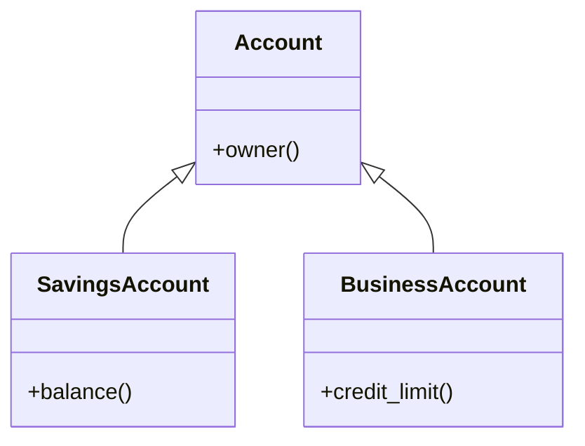

<TLDR>
  <TLDRCell label="what">
    Inheritance gives a derived object a base subobject and, when access permits, lets code use that object as
    the base type. Public inheritance should express a real is-a relationship, not merely reuse a few lines of
    code.
  </TLDRCell>
  <TLDRCell label="trap">
    Accepting or storing a base by value slices off the derived part. A same-named member can also hide base
    overloads instead of overriding them.
  </TLDRCell>
  <TLDRCell label="fix">
    Preserve dynamic types with base references or smart pointers, use `override` on virtual functions, and
    give bases that support polymorphic destruction a public virtual destructor.
  </TLDRCell>
</TLDR>

## What it is and why it exists

C++ inheritance defines a relationship between class types. The inherited type is the
<Term id="base-class">base class</Term>; the new type that names it in a base-clause is the
<Term id="derived-class">derived class</Term>. A complete derived object contains a base subobject and can add
its own data and operations.

Inheritance solves a common-interface and type-substitution problem. If `SavingsAccount` publicly inherits
`Account`, code accepting `const Account&` can also accept a `SavingsAccount`. The caller depends on the
account contract and doesn't need another overload for every account type.

Public inheritance carries a semantic promise: a derived class preserves the preconditions, postconditions,
and invariants of every operation allowed by its base. This requirement is commonly called the
<Term id="liskov-substitution-principle">Liskov substitution principle</Term>. Similar fields or a desire to
reuse implementation don't prove that two types belong in a public inheritance relationship.

You meet inheritance in framework extension points, exception hierarchies, device-driver interfaces, and
heterogeneous object collections. When the goal is only to place one implementation component inside another
type, composition is usually more direct: a member says has-a, while inheritance says is-a.

## How it works

A derived class writes a base-clause after its name, as in `class SavingsAccount : public Account`. Every
complete `SavingsAccount` object contains an `Account` subobject. The base's `private` members still exist,
but derived-class members cannot name them directly; the derived class works with that state through the
base's `public` or `protected` interface.

The inheritance specifier is also an <Term id="access-specifier">access specifier</Term>. It changes the
greatest access that the base's `public` and `protected` members have through the derived class, but it never
makes the base's `private` members accessible.

| Base member | `public` inheritance    | `protected` inheritance | `private` inheritance   |
| ----------- | ----------------------- | ----------------------- | ----------------------- |
| `public`    | `public`                | `protected`             | `private`               |
| `protected` | `protected`             | `protected`             | `private`               |
| `private`   | not directly accessible | not directly accessible | not directly accessible |

Only a public and unambiguous base relationship normally permits external code to perform an implicit upcast.
A `protected` base leaves that conversion to derived classes and friends; a `private` base leaves it to the
current class and friends. Base access defaults to `private` for `class` and `public` for `struct`, so public
hierarchies should spell out `public`.

Think of the inheritance structure as nested subobjects, not as the source text of two classes pasted
together:



When constructing a complete derived object, virtual bases initialize first. Direct bases follow in
base-clause order, then derived members in declaration order, and finally the derived constructor body runs.
Destruction reverses this order. Reordering the written initializer list cannot change these rules.

A derived constructor selects a constructor for each direct base. If it omits a base initializer, the compiler
tries to call that base's default constructor. Omitting the initializer is a compile error when the base has
no accessible default constructor.

Name lookup and virtual dispatch are separate mechanisms. Declaring a name in a derived class can hide the
base's entire overload set with that name; `using Base::name` can bring those overloads back into the
candidate set. Once overload resolution selects a virtual signature, a call through a base reference or
pointer dispatches on the object's dynamic type. See `cpp/virtual-functions` for the full rules.

Public inheritance supports an upcast from a derived reference or pointer to an accessible, unambiguous base.
The conversion points into the base subobject within the same complete object and makes no copy. A by-value
conversion is different: it constructs only a base object, losing added derived state and the dynamic type.

## Examples

The next three programs build from base initialization to substitution through a common interface, then expose
slicing at a by-value boundary. All were compiled and run locally with `g++` in C++23 mode; the displayed
output is the actual result.

### Public inheritance and upcasting

`SavingsAccount` explicitly initializes its `Account` subobject. `print_owner()` takes a base reference, so
passing the derived object neither copies nor slices it.

<Depth level="quick">

```cpp title="public_inheritance.cpp"
#include <iostream>
#include <string>
#include <utility>

class Account {
public:
    explicit Account(std::string owner) : owner_(std::move(owner)) {}
    const std::string& owner() const { return owner_; }

private:
    std::string owner_;
};

class SavingsAccount : public Account {
public:
    SavingsAccount(std::string owner, int cents)
        : Account(std::move(owner)), cents_(cents) {}

    int balance() const { return cents_; }

private:
    int cents_;
};

void print_owner(const Account& account) {
    std::cout << "owner: " << account.owner() << '\n';
}

int main() {
    SavingsAccount account{"Mina", 12500};
    print_owner(account);
    std::cout << "balance: " << account.balance() << '\n';
}
```

```text
owner: Mina
balance: 12500
```

</Depth>

While constructing `account`, the `Account` subobject receives the owner name before `cents_` initializes.
`print_owner(account)` performs an implicit upcast and binds its reference to the base part of that same
complete object.

`owner_` is a `private` base member. Inheritance neither removes it nor makes it directly accessible to the
derived class; both `SavingsAccount` and the external function read it through `owner()`.

### Preserving the dynamic type through a base reference

A public interface can provide one entry point for several derived types. This example only shows the
connection between inheritance and substitution; `cpp/virtual-functions` covers virtual tables, pure virtual
functions, and destructor policies in detail.

```cpp title="virtual_dispatch.cpp"
#include <iostream>

class ShippingRule {
public:
    virtual int fee(int grams) const {
        return 300 + grams / 10;
    }

    virtual ~ShippingRule() = default;
};

class ExpressRule : public ShippingRule {
public:
    int fee(int grams) const override {
        return 700 + grams / 10;
    }
};

void print_fee(const ShippingRule& rule, int grams) {
    std::cout << "fee: " << rule.fee(grams) << '\n';
}

int main() {
    ShippingRule standard;
    ExpressRule express;
    print_fee(standard, 2000);
    print_fee(express, 2000);
}
```

```text
fee: 500
fee: 900
```

Both calls use the static interface `ShippingRule`, but the second preserves the dynamic type `ExpressRule`
and therefore runs its overridden `fee()`. `override` makes the compiler verify that the signature actually
overrides a base virtual function. Omitting `const` or changing a parameter type then fails at compile time.

The base destructor is virtual because the interface allows derived objects to be owned and destroyed through
base pointers. This example doesn't allocate dynamically, but placing the destruction contract in the base
keeps later code using `std::unique_ptr<ShippingRule>` safe.

### Observing object slicing

A by-value parameter constructs a new base object from the argument's base subobject. This is
<Term id="object-slicing">object slicing</Term>, and it does not preserve the original object's derived part.

```cpp title="object_slicing.cpp"
#include <iostream>
#include <string>

class Notice {
public:
    virtual std::string channel() const {
        return "generic";
    }

    virtual ~Notice() = default;
};

class SmsNotice : public Notice {
public:
    std::string channel() const override {
        return "sms";
    }
};

void print_value(Notice notice) {
    std::cout << "value: " << notice.channel() << '\n';
}

void print_reference(const Notice& notice) {
    std::cout << "reference: " << notice.channel() << '\n';
}

int main() {
    SmsNotice notice;
    print_value(notice);
    print_reference(notice);
}
```

```text
value: generic
reference: sms
```

Inside `print_value()`, the local `Notice` is already a separate base object, so even a virtual call can only
produce `generic`. `print_reference()` creates no new object. Its reference still denotes the original
`SmsNotice`, so it prints `sms`.

Heterogeneous collections have the same distinction. `std::vector<Notice>` stores base values and slices its
inputs. To retain dynamic types, store `std::unique_ptr<Notice>`, or use reference wrappers with explicit
lifetimes when ownership lives elsewhere.

## Pitfalls

> [!PITFALL] Building public inheritance only to reuse implementation can expose a base contract that the
> derived class cannot honestly support.

**Fix:** Check whether the derived class accepts every valid base input and preserves the same postconditions
and invariants. If the relationship is only uses-this-component, make the component a member. Consider
non-public inheritance only for constrained implementation reuse, and don't describe it as a subtype
relationship.

> [!PITFALL] Passing or returning a polymorphic base by value, or putting it in a base-value container,
> silently removes derived state.

**Fix:** Use `Base&` or `const Base&` when ownership does not move. Use `std::unique_ptr<Base>` for
heterogeneous ownership. If the API needs value semantics, design an explicit polymorphic copy operation for
the hierarchy or use a closed representation such as `std::variant`.

> [!PITFALL] A same-named function in a derived class hides base overloads even when their parameter lists
> differ. A call may select an unintended conversion or stop compiling.

**Fix:** Put `override` on functions meant to override. When the derived class should retain the base overload
set, add `using Base::name` in the derived scope and compile calls through both a base reference and a derived
object.

> [!PITFALL] Deleting a derived object through a base pointer has undefined behavior when the base destructor
> is not virtual.

**Fix:** A base that permits polymorphic destruction should have a public virtual destructor, commonly
`virtual ~Base() = default`. A type that forbids destruction through the base interface can use a protected
non-virtual destructor. Don't leave a public non-virtual destructor available for callers to misuse.

> [!PITFALL] A virtual call in a base constructor or destructor does not dispatch to a derived part that has
> not begun construction or has already finished destruction.

**Fix:** Don't make base construction or destruction depend on derived overrides. Move work that needs a
complete object into an ordinary member or factory and call it after construction. Let each layer's destructor
and member objects handle cleanup.

> [!PITFALL] A diamond hierarchy contains two common-base subobjects by default, which can make member access
> and upcasts ambiguous.

**Fix:** First decide whether both paths truly share one base identity. If they do, both intermediate paths
must virtually inherit the common base, and the most-derived class initializes it. If each base state has its
own meaning, keep non-virtual inheritance and name the access path explicitly.

<Depth level="deep">

## Multiple and virtual inheritance

Multiple inheritance gives a class more than one direct base. The structure is usually manageable when those
bases express independent interfaces and carry no conflicting state. Trouble starts when two inheritance paths
meet again at one ancestor: ordinary inheritance creates a separate ancestor subobject along each path.

<Term id="virtual-inheritance">Virtual inheritance</Term> makes specified paths share one virtual-base
subobject. It solves common-base identity, not ordinary virtual-function dispatch. The most-derived class in
the complete object initializes a virtual base. An initializer written by an intermediate class matters only
when that intermediate class is itself the most-derived class.

The following `Document` inherits `Record` through both `Versioned` and `Audited`. Both paths use virtual
inheritance, so the two converted `Record*` values point to the same subobject.

```cpp title="virtual_diamond.cpp"
#include <iostream>
#include <string>
#include <utility>
class Record {
public:
    explicit Record(std::string id) : id_(std::move(id)) {}
    const std::string& id() const { return id_; }

private:
    std::string id_;
};

class Versioned : virtual public Record {
public:
    explicit Versioned(int revision) : Record{"unused"}, revision_(revision) {}
    int revision() const { return revision_; }

private:
    int revision_;
};

class Audited : virtual public Record {
public:
    Audited() : Record{"unused"} {}
};

class Document : public Versioned, public Audited {
public:
    Document(std::string id, int revision)
        : Record{std::move(id)}, Versioned{revision}, Audited{} {}
};

int main() {
    Document document{"policy", 7};
    Record* via_version = static_cast<Versioned*>(&document);
    Record* via_audit = static_cast<Audited*>(&document);
    std::cout << "id: " << document.id() << '\n';
    std::cout << "revision: " << document.revision() << '\n';
    std::cout << std::boolalpha << "same base: " << (via_version == via_audit) << '\n';
}
```

```text
id: policy
revision: 7
same base: true
```

The `Record{std::move(id)}` initializer in `Document` determines the shared virtual base's contents. The
`Record{"unused"}` initializers in `Versioned` and `Audited` are ignored while constructing a `Document`, but
still matter when either intermediate class is constructed as a complete object.

### When not to use virtual inheritance

Virtual inheritance is not a marker to add mechanically whenever a diagram contains a diamond. If the two
paths represent distinct roles that each need ancestor state, merging them changes the model. Write down
whether the object should own one shared state or two separate states before choosing the inheritance form.

Virtual bases also move construction responsibility past direct-base boundaries and make conversions and
object layout more involved. Don't depend on pointer offsets, object sizes, or hidden-table structures
observed with one compiler. The language guarantees subobject and conversion semantics, not the byte layout of
one ABI.

</Depth>

<Checkpoint id="cpp/inheritance" />

## Further reading

- [C++ working draft: base and derived classes](https://eel.is/c++draft/class.derived)
- [C++ working draft: accessibility of base classes and members](https://eel.is/c++draft/class.access.base)
- [C++ working draft: initialization](https://eel.is/c++draft/class.init)
- [C++ working draft: member name lookup](https://eel.is/c++draft/class.member.lookup)
- [C++ working draft: construction and destruction](https://eel.is/c++draft/class.cdtor)
