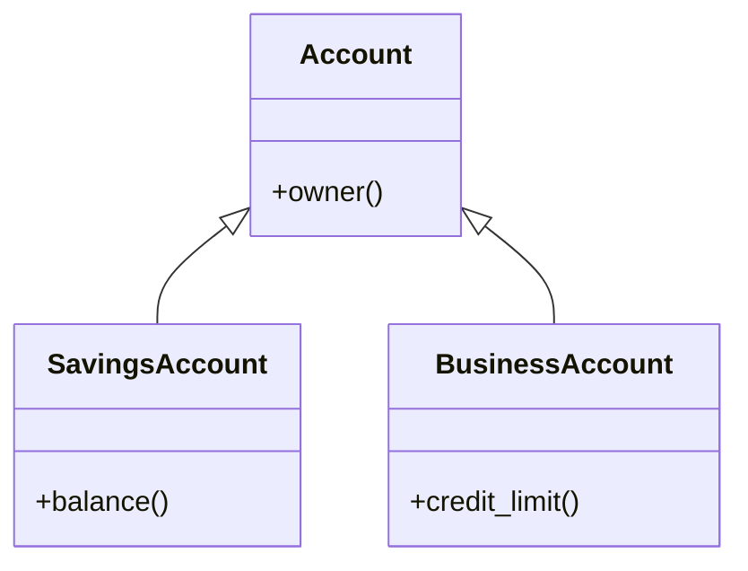

<TLDR>
  <TLDRCell label="what">
    继承让派生类对象包含一个基类子对象，并可在满足访问规则时当作基类使用。公有继承应表达真实的「是一种」关系，而不只是复用几行代码。
  </TLDRCell>
  <TLDRCell label="trap">
    按值接收或保存基类会切掉派生部分；同名成员还可能隐藏基类重载，而不是重写它。
  </TLDRCell>
  <TLDRCell label="fix">
    通过基类引用或智能指针保留动态类型，对虚函数使用 `override`，并让需要多态销毁的基类拥有公有虚析构函数。
  </TLDRCell>
</TLDR>

## 是什么，为什么存在

C++ 继承定义一种类之间的关系。被继承的类型是<Term id="base-class">基类（base
class）</Term>，声明基类列表的新类型是<Term id="derived-class">派生类（derived
class）</Term>。派生类的完整对象包含基类子对象，还可以增加自己的数据和操作。

继承解决的是共同接口与类型替换问题。若 `SavingsAccount` 公有继承 `Account`，接受 `const Account&`
的代码也能接收 `SavingsAccount`。调用者只依赖账户契约，不必为每一种账户增加重载。

公有继承带着语义承诺：凡是基类允许的操作，派生类都应保持其前置条件、后置条件和不变量。这个要求通常称为<Term id="liskov-substitution-principle">里氏替换原则（Liskov
substitution principle）</Term>。仅仅拥有相似字段，或想复用实现，并不足以证明两个类型适合公有继承。

你会在框架扩展点、异常层次、设备驱动接口和异构对象集合中遇到继承。若目标只是把一个实现部件放进另一个类型，组合通常更直接：成员关系表达「有一个」，继承关系表达「是一种」。

## 工作原理

派生类在类名后写基类列表，例如 `class SavingsAccount : public Account`。每个完整的 `SavingsAccount`
对象都含有一个 `Account` 子对象。基类的 `private`
成员仍然存在，只是派生类成员不能直接命名它们；派生类应通过基类的 `public` 或 `protected` 接口操作这部分状态。

继承说明符也是一种<Term id="access-specifier">访问说明符（access specifier）</Term>。它改变基类的 `public` 和
`protected` 成员通过派生类暴露时的最高访问级别，但不会把基类的 `private` 成员改成可访问成员。

| 基类成员    | `public` 继承 | `protected` 继承 | `private` 继承 |
| ----------- | ------------- | ---------------- | -------------- |
| `public`    | `public`      | `protected`      | `private`      |
| `protected` | `protected`   | `protected`      | `private`      |
| `private`   | 不可直接访问  | 不可直接访问     | 不可直接访问   |

只有公有且无歧义的基类关系通常允许外部代码隐式向上转换。`protected` 继承把这种转换留给派生类及友元，`private`
继承则只留给当前类及友元。`class` 的基类访问默认为 `private`，`struct` 默认为
`public`，因此公共层次最好始终显式写出 `public`。

对象的继承结构可以看成嵌套的子对象，而不是把两个类的文本拼在一起：



构造派生类完整对象时，虚基类先初始化，然后按基类列表中的声明顺序初始化直接基类，再按成员声明顺序初始化派生类成员，最后进入派生类构造函数体。析构顺序相反。初始化器列表的书写顺序不能改变这些规则。

派生类构造函数负责为直接基类选择构造函数。若没有写基类初始化器，编译器会尝试调用该基类的默认构造函数。基类没有可访问的默认构造函数时，遗漏初始化器就是编译错误。

名字查找与虚分派是两件事。派生类声明某个名称时，可能隐藏基类中的整组同名重载；`using Base::name`
可以把基类重载重新引入候选集。选中虚函数签名后，通过基类引用或指针调用才会按对象的动态类型分派，具体规则见
`cpp/virtual-functions`。

公有继承支持从派生类引用或指针到可访问、无歧义基类的向上转换。转换指向完整对象内部的基类子对象，不会复制对象。按值转换则不同：它只构造一个基类对象，派生类新增的状态和动态类型都会丢失。

## 示例

下面三个程序依次展示基类初始化、通过公共接口替换类型，以及按值传递造成的对象切片。它们都使用本地 `g++`
的 C++23 模式编译并运行，输出来自真实执行结果。

### 公有继承与向上转换

`SavingsAccount` 显式初始化自己的 `Account` 子对象。`print_owner()`
接受基类引用，因此传入派生类对象时不复制，也不切片。

<Depth level="quick">

```cpp title="public_inheritance.cpp"
#include <iostream>
#include <string>
#include <utility>

class Account {
public:
    explicit Account(std::string owner) : owner_(std::move(owner)) {}
    const std::string& owner() const { return owner_; }

private:
    std::string owner_;
};

class SavingsAccount : public Account {
public:
    SavingsAccount(std::string owner, int cents)
        : Account(std::move(owner)), cents_(cents) {}

    int balance() const { return cents_; }

private:
    int cents_;
};

void print_owner(const Account& account) {
    std::cout << "owner: " << account.owner() << '\n';
}

int main() {
    SavingsAccount account{"Mina", 12500};
    print_owner(account);
    std::cout << "balance: " << account.balance() << '\n';
}
```

```text
owner: Mina
balance: 12500
```

</Depth>

构造 `account` 时，`Account` 子对象先取得所有者名称，随后 `cents_` 初始化。`print_owner(account)`
使用隐式向上转换，把引用绑定到同一个完整对象中的基类部分。

`owner_` 是基类的 `private` 成员。它没有因继承而消失，也没有变成派生类可直接访问的数据；`SavingsAccount`
和外部函数都通过 `owner()` 读取它。

### 通过基类引用保留动态类型

公共接口可以为不同派生类型提供统一入口。这里只展示继承与替换的连接；虚函数表、纯虚函数和析构策略在
`cpp/virtual-functions` 中展开。

```cpp title="virtual_dispatch.cpp"
#include <iostream>

class ShippingRule {
public:
    virtual int fee(int grams) const {
        return 300 + grams / 10;
    }

    virtual ~ShippingRule() = default;
};

class ExpressRule : public ShippingRule {
public:
    int fee(int grams) const override {
        return 700 + grams / 10;
    }
};

void print_fee(const ShippingRule& rule, int grams) {
    std::cout << "fee: " << rule.fee(grams) << '\n';
}

int main() {
    ShippingRule standard;
    ExpressRule express;
    print_fee(standard, 2000);
    print_fee(express, 2000);
}
```

```text
fee: 500
fee: 900
```

两次调用的静态接口都是 `ShippingRule`，第二次却保留了 `ExpressRule` 的动态类型，因此执行重写后的
`fee()`。`override` 要求编译器确认函数签名确实覆盖基类虚函数；若遗漏 `const`
或写错参数类型，程序会在编译期失败。

基类析构函数是虚函数，因为这个接口允许派生对象经基类指针拥有和销毁。示例没有动态分配，但把销毁契约写在基类中，能让之后使用
`std::unique_ptr<ShippingRule>` 的代码保持安全。

### 观察对象切片

按值形参会从实参的基类子对象构造一个新的基类对象。这个过程叫作<Term id="object-slicing">对象切片（object
slicing）</Term>，它不会保留原对象的派生部分。

```cpp title="object_slicing.cpp"
#include <iostream>
#include <string>

class Notice {
public:
    virtual std::string channel() const {
        return "generic";
    }

    virtual ~Notice() = default;
};

class SmsNotice : public Notice {
public:
    std::string channel() const override {
        return "sms";
    }
};

void print_value(Notice notice) {
    std::cout << "value: " << notice.channel() << '\n';
}

void print_reference(const Notice& notice) {
    std::cout << "reference: " << notice.channel() << '\n';
}

int main() {
    SmsNotice notice;
    print_value(notice);
    print_reference(notice);
}
```

```text
value: generic
reference: sms
```

`print_value()` 中的局部 `Notice` 已是独立基类对象，所以虚调用也只能得到 `generic`。`print_reference()`
没有构造新对象，引用仍指向原来的 `SmsNotice`，于是输出 `sms`。

异构集合也有同样区别。`std::vector<Notice>` 存放的是基类值，会切片；需要保留动态类型时，可保存
`std::unique_ptr<Notice>`，或在所有权位于别处时保存生命周期明确的引用包装器。

## 陷阱

> [!PITFALL] 为了复用实现而建立公有继承，可能把并不成立的基类契约暴露给调用者。

**修复：**
逐项检查派生类能否接受基类的全部有效输入，并保持相同后置条件和不变量。若关系只是「使用这个部件」，把部件设为成员；只有需要受限实现复用时才考虑非公有继承，而且不要把它描述成子类型关系。

> [!PITFALL] 把多态基类按值传参、按值返回或放入基类值容器，会静默切掉派生状态。

**修复：** 不转移所有权时使用 `Base&` 或 `const Base&`。需要异构所有权时使用
`std::unique_ptr<Base>`；需要值语义时，为层次设计明确的多态复制操作，或改用 `std::variant` 等封闭表示。

> [!PITFALL]
> 派生类中的同名函数会隐藏基类的同名重载，即使参数列表不同；调用可能选择意外的转换，也可能直接无法编译。

**修复：** 对准备重写的虚函数写 `override`。若派生类还需要保留基类重载集，在派生类作用域加入
`using Base::name`，并用基类引用和派生类对象分别编译测试调用。

> [!PITFALL] 经基类指针删除派生对象，而基类析构函数不是虚函数，会产生未定义行为。

**修复：** 允许多态销毁的基类应提供公有虚析构函数，常见写法是
`virtual ~Base() = default`。若类型明确禁止经基类接口销毁，可使用受保护的非虚析构函数；不要留下公有非虚析构函数让调用者误用。

> [!PITFALL] 基类构造函数或析构函数中的虚调用不会分派到尚未开始构造或已经完成析构的派生部分。

**修复：**
不要让基类构造或析构逻辑依赖派生重写。把完成对象后才能执行的工作移到普通成员函数或工厂中，并在对象完整构造后调用；清理则交给各层自己的析构函数和成员对象。

> [!PITFALL] 菱形层次默认包含两份共同基类子对象，因此成员访问和向上转换可能有歧义。

**修复：**
先判断两条路径是否真的需要共享同一个基类身份。需要共享时，两条中间路径都应虚继承共同基类，并由最派生类初始化它；若两份基类状态各有含义，就保留非虚继承并显式命名访问路径。

## AI 时代

**生成代码在这里常犯的错**

模型常把字段相似或实现复用误判成公有继承，生成的派生类随后收紧基类输入或破坏不变量。它还容易生成
`std::vector<Base>`、按值回调参数或按值工厂返回，导致对象切片；重写函数则常漏掉
`const`、引用限定或准确参数类型，却又没写
`override`。涉及多重继承时，生成代码可能只在中间类初始化虚基类，没有让最派生类承担初始化责任。

**让 AI 检查**

- 列出每个基类转换发生的位置，标明是引用或指针转换，还是会构造新基类对象的按值转换。
- 比较每个派生函数与基类虚函数的完整签名，并要求所有预期重写都带 `override`。
- 沿每条销毁路径和菱形继承路径检查析构策略、基类数量，以及由哪个最派生类初始化虚基类。

**审查清单**

- 用基类契约的边界输入测试每个派生类，确认替换后没有新增异常或收紧前置条件。
- 搜索按值出现的多态基类，包括函数参数、返回值、容器元素和 `catch` 参数。
- 分别编译通过基类引用、派生类对象和拥有型基类指针进行的调用与销毁。

**提示词词汇**

使用准确术语：`base subobject`（基类子对象）、`public inheritance`（公有继承）、`implicit upcast`（隐式向上转换）、`object slicing`（对象切片）、`name hiding`（名称隐藏）、`substitutability`（可替换性）、`virtual destructor`（虚析构函数）、`virtual base`（虚基类）、`most-derived class`（最派生类）。要求 AI 画出子对象图并标出按值边界，比笼统地说「检查这个类层次」更容易暴露问题。

<Depth level="deep">

## 多重继承与虚继承

多重继承让一个类拥有多个直接基类。若这些基类表达彼此独立的接口，而且没有冲突状态，结构通常容易理解。困难出现在两条继承路径再次汇合到同一个祖先时：普通继承会沿每条路径各创建一份祖先子对象。

<Term id="virtual-inheritance">虚继承（virtual inheritance）</Term>
让多条指定路径共享一份虚基类子对象。它解决的是共同基类身份，而不是普通虚函数分派。最终完整对象中的最派生类负责初始化虚基类；中间类写出的虚基类初始化器只在该中间类本身是最派生类时生效。

下面的 `Document` 经 `Versioned` 和 `Audited` 两条路径继承 `Record`。两条路径都使用虚继承，所以转换得到的两个
`Record*` 指向同一个子对象。

```cpp title="virtual_diamond.cpp"
#include <iostream>
#include <string>
#include <utility>
class Record {
public:
    explicit Record(std::string id) : id_(std::move(id)) {}
    const std::string& id() const { return id_; }

private:
    std::string id_;
};

class Versioned : virtual public Record {
public:
    explicit Versioned(int revision) : Record{"unused"}, revision_(revision) {}
    int revision() const { return revision_; }

private:
    int revision_;
};

class Audited : virtual public Record {
public:
    Audited() : Record{"unused"} {}
};

class Document : public Versioned, public Audited {
public:
    Document(std::string id, int revision)
        : Record{std::move(id)}, Versioned{revision}, Audited{} {}
};

int main() {
    Document document{"policy", 7};
    Record* via_version = static_cast<Versioned*>(&document);
    Record* via_audit = static_cast<Audited*>(&document);
    std::cout << "id: " << document.id() << '\n';
    std::cout << "revision: " << document.revision() << '\n';
    std::cout << std::boolalpha << "same base: " << (via_version == via_audit) << '\n';
}
```

```text
id: policy
revision: 7
same base: true
```

`Document` 的初始化器 `Record{std::move(id)}` 决定共享虚基类的内容。`Versioned` 和 `Audited` 中的
`Record{"unused"}` 在构造 `Document` 时被忽略，但在直接构造这些中间类的完整对象时仍有作用。

### 何时不用虚继承

虚继承不是看到菱形就机械添加的标记。如果两条路径代表两个不同角色，各自确实需要一份祖先状态，那么合并它们会改变模型。先写出对象应拥有一份还是两份共同状态，再决定继承形式。

虚基类还会让构造责任越过直接基类边界，并使转换与对象布局更复杂。不要依赖特定编译器的指针偏移、对象大小或隐藏表结构；语言保证的是子对象与转换语义，不是某个 ABI 的字节布局。

</Depth>

<Checkpoint id="cpp/inheritance" />

## 延伸阅读

- [C++ 工作草案：基类与派生类](https://eel.is/c++draft/class.derived)
- [C++ 工作草案：基类及其成员的可访问性](https://eel.is/c++draft/class.access.base)
- [C++ 工作草案：初始化](https://eel.is/c++draft/class.init)
- [C++ 工作草案：成员名称查找](https://eel.is/c++draft/class.member.lookup)
- [C++ 工作草案：构造与析构](https://eel.is/c++draft/class.cdtor)
