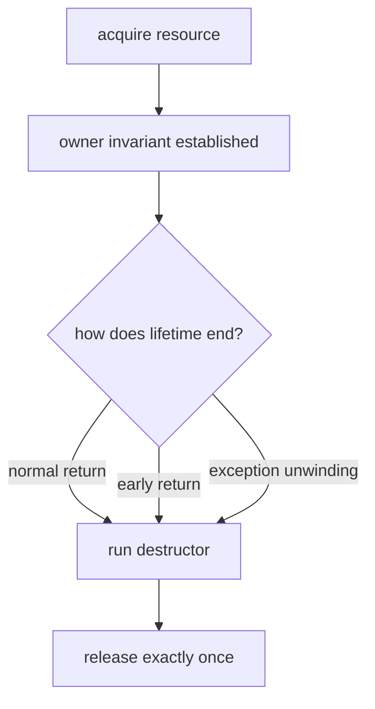

<TLDR>
  <TLDRCell label="what">
    <Term id="raii">Resource Acquisition Is Initialization (RAII)</Term> gives a resource to an owning object; the object's destructor deterministically releases that resource when its lifetime ends.
  </TLDRCell>
  <TLDRCell label="trap">
    Manual cleanup at the end of a function misses early returns and exception paths. Compiler-generated copying of an object that owns a raw handle can instead release the same resource twice.
  </TLDRCell>
  <TLDRCell label="fix">
    Prefer composing standard RAII types and follow the Rule of Zero. When you must write an owner, either prohibit copying or implement real copy semantics, transfer ownership safely, and keep destructor cleanup non-throwing.
  </TLDRCell>
</TLDR>

## What it is and why it exists

RAII is C++'s scope-bound resource-management technique: a successfully constructed object establishes an ownership invariant, and destruction ends that ownership. "Initialization" doesn't mean every initialization must allocate. It means that once acquired, a resource should immediately enter a fully constructed owner instead of lingering in an unowned raw state.

A resource isn't limited to heap memory. File handles, sockets, mutex locks, database transactions, temporary directories, and subscription tokens all have paired acquire and release operations; RAII expresses that these operations must stay paired through an object's lifetime.

C++ provides deterministic destruction for fully constructed objects. Automatic objects are destroyed according to language rules when control reaches the end of a scope, returns, or leaves because of an exception. Cleanup no longer depends on every control-flow path remembering to reach one trailing statement.

RAII doesn't mean "stack object." An owner may be a member of another object or be managed by a container or <Term id="smart-pointer">smart pointer</Term>. What matters is that the resource lifetime depends on the owner's lifetime, not whether the owner itself resides on the stack or heap.

Ordinary C++ code already uses RAII everywhere. `std::vector` manages dynamic storage, `std::unique_ptr` owns one object, file streams own files, and `std::lock_guard` owns a lock. Compose those types first, and write a wrapper only when neither the standard library nor your project offers a suitable owner.

## How it works

An RAII owner maintains one central invariant: it either holds a valid resource and is responsible for releasing it, or it is in a documented empty state. Construction succeeds only after that invariant holds; destruction inspects the current state and releases at most once.

The resource lifetime follows this path:

1. An acquisition operation returns a raw resource such as a pointer, integer handle, or locked state.
2. Code immediately gives the resource to an owning object.
3. Business logic borrows the resource through the owner without changing the release responsibility.
4. If ownership moves, the source enters a state that is safe to destroy.
5. The final owner's lifetime ends, and its destructor performs the paired release once.



Ownership and access must be described separately. An owner decides who releases, a borrower only uses the resource within an agreed lifetime, and a transfer gives the release responsibility to another object.

| Representation | Responsible for release | Typical C++ form |
| --- | --- | --- |
| Exclusive ownership | Yes, exactly one owner | `std::unique_ptr<T>`, move-only handle class |
| Shared ownership | Yes, last owner releases | `std::shared_ptr<T>` |
| Borrowed access | No | `T&`, `T*`, `std::span<T>`, raw handle view |
| Ownership transfer | Responsibility moves to target | Move construction or move assignment |

Destruction order lets several RAII objects compose. Local objects are destroyed in reverse order of completed construction; members are constructed in declaration order and destroyed in reverse. A later resource, which often depends on an earlier one, is cleaned up first.

An exception doesn't run the destructor of a complete object whose construction never succeeded. Its already-constructed bases and members are still destroyed. This rule is why a resource belongs in an RAII member: if a constructor acquires a raw handle and then throws, the outer destructor never gets a chance to repair the leak.

During an exception, <Term id="stack-unwinding">stack unwinding</Term> destroys fully constructed automatic objects in the scopes being exited. RAII therefore guarantees resource cleanup, but it doesn't automatically undo data already written to a database, sent over a network, or appended to an external container.

An <Term id="exception-safety-guarantee">exception-safety guarantee</Term> states what happens to resources, invariants, and observable state after a throw. RAII underpins basic resource safety. If an interface promises the strong guarantee, it must also finish fallible work in temporary state and replace the old state through a non-throwing commit step.

## Examples

The next three programs build from a standard owner to exception unwinding and then a move-only handle. Each was compiled with GCC 13.3.0 using `-std=c++23 -Wall -Wextra -Wpedantic -Werror` and executed; the displayed output is from those runs.

### Give a file to a standard owner

`std::unique_ptr` can manage more than objects created by `new`. With a deleter, it can own a `std::FILE*`; after `tmpfile()` succeeds, every later exit path calls `FileCloser`.

<Depth level="quick">

```cpp title="temporary_file.cpp"
#include <cstdio>
#include <iostream>
#include <memory>
#include <stdexcept>

struct FileCloser {
    void operator()(std::FILE* file) const noexcept {
        std::fclose(file);
        std::cout << "closed temporary file\n";
    }
};

using File = std::unique_ptr<std::FILE, FileCloser>;

void inspect_invoice() {
    File file(std::tmpfile());
    if (!file) {
        throw std::runtime_error("tmpfile failed");
    }

    std::fputs("invoice=42\n", file.get());
    std::rewind(file.get());

    char line[32]{};
    if (!std::fgets(line, sizeof line, file.get())) {
        throw std::runtime_error("read failed");
    }
    std::cout << line;
}

int main() {
    inspect_invoice();
}
```

```text
invoice=42
closed temporary file
```

<TryToBreak items={['make the read fail after acquiring the file', 'return early before printing', 'construct File with a null FILE pointer']} />

</Depth>

The deleter prints a line only to expose the destruction time; a production deleter usually performs just the release. `unique_ptr` already encodes the ownership model: its move operations transfer the pointer and deleter, while its copy operations are deleted.

There is still a brief raw-pointer result before `File` is constructed, but it is given to the owner within the same full expression. Don't save the raw pointer, perform several operations that might throw, and wrap it only afterward.

### Observe reverse cleanup during an exception

The second program establishes two leases in dependency order and then deliberately throws. `transaction` was constructed later, so unwinding releases it before `connection`; only then does control enter the `catch` block.

```cpp title="unwinding.cpp"
#include <iostream>
#include <stdexcept>
#include <string>
#include <utility>

class Lease {
public:
    explicit Lease(std::string name) : name_(std::move(name)) {
        std::cout << "acquire " << name_ << '\n';
    }

    ~Lease() {
        std::cout << "release " << name_ << '\n';
    }

private:
    std::string name_;
};

void post_invoice() {
    Lease connection("connection");
    Lease transaction("transaction");
    throw std::runtime_error("validation failed");
}

int main() {
    try {
        post_invoice();
    } catch (const std::exception& error) {
        std::cout << "caught: " << error.what() << '\n';
    }
}
```

```text
acquire connection
acquire transaction
release transaction
release connection
caught: validation failed
```

RAII cleanup happens before the handler runs. If a `Lease` destructor allowed another exception to escape while the original exception was propagating, the program would call `std::terminate()`. Destructor cleanup must absorb, record, or otherwise handle failure through a non-throwing channel.

This example demonstrates lifetime only; it doesn't claim the resource operation was rolled back. A real transaction commonly rolls back uncommitted state in its destructor and makes the success path call `commit()` explicitly, keeping "commit" distinct from "clean up the object."

### Write a move-only handle

When no standard owner fits, a custom type must encode exclusive responsibility in its special member functions. This `Channel` prohibits copying, and its move constructor uses `std::exchange` to take the handle while emptying the source.

```cpp title="movable_channel.cpp"
#include <iostream>
#include <string_view>
#include <utility>

int next_handle = 10;
int open_channel(std::string_view name) {
    int handle = next_handle++;
    std::cout << "open " << name << " -> " << handle << '\n';
    return handle;
}
void close_channel(int handle) noexcept {
    std::cout << "close " << handle << '\n';
}

class Channel {
public:
    explicit Channel(std::string_view name) : handle_(open_channel(name)) {}
    ~Channel() { reset(); }
    Channel(const Channel&) = delete;
    Channel& operator=(const Channel&) = delete;
    Channel& operator=(Channel&&) = delete;
    Channel(Channel&& other) noexcept
        : handle_(std::exchange(other.handle_, -1)) {}
    int get() const noexcept { return handle_; }

private:
    void reset() noexcept {
        if (handle_ != -1) close_channel(handle_);
    }
    int handle_ = -1;
};

int main() {
    Channel primary("billing");
    Channel active(std::move(primary));
    std::cout << "active " << active.get() << '\n';
}
```

```text
open billing -> 10
active 10
close 10
```

The moved-from `primary` remains alive but is now empty and safe to destroy. This example deliberately deletes move assignment; if the interface doesn't need an operation, deleting it is better than implementing it carelessly.

If the type does require move assignment, its target may already own a resource. The implementation must safely handle the target's old resource, take the source resource, and handle self-move. Those details are a reason to prefer standard RAII members.

## Pitfalls

### Leaving cleanup at the end of a function

> [!PITFALL]
> A raw handle followed by one trailing `close()` covers only the straight-line success path. A new early return, validation exception, or intermediate allocation failure can bypass it.

**Fix:** construct an owner immediately after successful acquisition, and let later code borrow only through it. Test normal return, every early return, and exceptions after acquisition instead of exercising only the happiest path.

### Letting the compiler shallow-copy an exclusive resource

> [!PITFALL]
> If a class with a raw pointer or integer handle keeps compiler-generated copying, two objects believe they must release the same resource. The result is usually double release, dangling access, or a leak introduced to avoid the crash.

**Fix:** delete copying and correctly implement moving for an exclusive owner, or place the resource in a member such as `std::unique_ptr` and let its special members compose. If copying is required, define an independent resource, reference counting, or another explicit semantic; don't accept an address copied bit for bit.

### Confusing a borrow with a transfer

> [!PITFALL]
> A function named `get()` usually lends a handle. If the caller stores it, closes it, or gives it to another owner, the original object still releases it according to its own contract, causing a dangling handle or double release.

**Fix:** name and document borrowing, copying, and transfer separately in the API. A transfer operation should make the source stop owning, as `unique_ptr::release()` does; a borrowed view must not outlive the owner or release the resource itself.

### Throwing from a destructor

> [!PITFALL]
> Closing a file, submitting telemetry, or releasing a remote lease can itself fail. Callers can't reliably handle an exception escaping a destructor; if stack unwinding is already in progress, the program terminates.

**Fix:** make the destructor perform non-throwing fallback cleanup. If a caller must know the close result, provide an explicit `close()`, `commit()`, or `finish()` that returns status or throws before destruction; the destructor still recovers safely when explicit completion didn't happen.

### Assuming RAII rolls back business changes

> [!PITFALL]
> RAII releases memory and handles, but it doesn't automatically undo data appended to a container, a message already sent, or a record written to an external system. No resource leak doesn't mean the operation has the strong exception guarantee.

**Fix:** state the observable result after failure first. For all-or-nothing behavior, complete validation and fallible work in a temporary object, then publish through a non-throwing swap, handle replacement, or transaction commit.

### Treating scope as every lifetime boundary

> [!PITFALL]
> A dynamically allocated owner isn't destroyed merely because the block that created it ends. `std::exit()`, `std::_Exit()`, `std::abort()`, and process crashes don't follow ordinary local stack-unwinding paths either.

**Fix:** place dynamic objects themselves in smart pointers or value-semantic containers and schedule their lifetimes under the real owner. Persistent data needs explicit flush and recovery protocols; a destructor isn't a crash-consistency mechanism.

<Depth level="deep">

## Ownership transfer and special members

Prefer the Rule of Zero: make `std::vector`, `std::string`, `std::unique_ptr`, a file stream, or an existing project handle type a member, and don't handwrite destruction, copying, or moving. Those members already know how to manage their resources, so the outer type's default operations compose their semantics in declaration order.

A custom owner must first decide what copying means. An exclusive operating-system handle commonly can't be copied, so delete the copy constructor and copy assignment. A copyable buffer may need a deep copy; only a genuinely shared resource calls for reference counting. Don't retain shallow copying and wait for a double-release test to expose it.

A move constructor puts the source resource in the new object and leaves the source in a <Term id="moved-from-state">moved-from state</Term> that still satisfies its invariant. For a type with one handle, `std::exchange(other.handle_, invalid)` states the operation directly. The source may still be destroyed or assigned afterward, but business code shouldn't assume it retains the original resource unless the interface promises that.

Move assignment has an old target in addition to the source. It must handle the target resource, take the source resource, restore the source invariant, and give `object = std::move(object)` safe behavior. If the interface never needs resource relocation by assignment, delete move assignment as the example does and reduce the state space you must maintain.

A user-declared destructor affects the rules for implicitly declared move operations. Don't guess which special member functions the compiler ultimately generates. State each ownership choice as `= default`, `= delete`, or a custom implementation, then verify the public contract with traits such as `std::is_copy_constructible_v<T>` and `std::is_move_constructible_v<T>`.

### The ownership window around construction failure

A complete object exists only after its constructor finishes successfully. If the constructor body throws, the class's own destructor doesn't run, but completed members are destroyed in reverse. A resource should therefore be acquired by an RAII member's constructor or enter a member owner before later fallible initialization begins.

One dangerous pattern stores the result of `open_resource()` in a plain integer member and then performs a registration that may throw in the constructor body. The integer has no destruction behavior, so a registration failure leaks the handle. Put the integer in a separate RAII handle member, or let a factory establish a temporary owner, finish all configuration, and move it into the result.

If acquisition itself fails, construction should preserve the clear outcome that no object was produced. Returning an invalid but apparently usable object postpones the check to every member call. If invalidity isn't a normal domain state, throwing or having a factory return an explicit result type is usually easier to maintain.

### Declaration order controls composition

Data members are constructed in their class declaration order, regardless of the order written in a constructor's initializer list, and destroyed in reverse declaration order. If a `Transaction` depends on a `Connection`, declare the connection first and the transaction second so the transaction is destroyed first. Rearranging only the visual initializer list cannot change this rule.

Local automatic objects are also destroyed in reverse order of completed construction. Array elements and base subobjects have their own specified order, but the review technique is the same: list the real construction order and reverse it to obtain normal destruction and unwinding order instead of guessing from the layout.

## Destructor failure and explicit completion

A destructor is suited to promising "attempt release and don't let an exception escape," not to reporting a failure that business logic must handle. Final file writes, remote acknowledgements, and transaction commits can fail. If success changes the caller's decision, complete the operation explicitly in ordinary control flow.

A common interface makes `close()` or `commit()` return status and marks the object empty or complete after success. The destructor inspects that state and performs non-throwing close or rollback on unfinished objects. These aren't duplicate responsibilities: the explicit method reports the result, while the destructor is the last safety net for omissions and exception paths.

Deleters also run on a destruction path. A `std::unique_ptr` deleter must be safe to invoke during destruction; if it throws, the exception crosses a non-throwing destruction boundary and terminates the program. Putting network retries, allocation, or other complex policy into a deleter makes a simple lifetime guarantee fragile.

Logging a cleanup failure also deserves care. Logging code may allocate, take a lock, or fail again, and its infrastructure may already be gone during static destruction. Handle errors that must be retained during explicit completion; destructor logging is only best-effort diagnosis.

### Transactions default to rollback

A transactional RAII object commonly begins in an "unfinished" state. The success path explicitly commits and marks it complete; exceptions and early returns let the destructor roll back. Rollback by default is safer than commit by default because leaving a scope doesn't prove every business validation succeeded.

Rollback can fail too. A destructor can't magically report that fact to a call site that has already been left, so the interface needs a policy suited to the system: report explicit rollback errors, log or invalidate the connection during destructor fallback, and let an outer recovery process confirm external state.

## RAII and exception-safety boundaries

The basic guarantee means failure leaks no resources and preserves object invariants; the strong guarantee means failure has no observable effect; the no-throw guarantee means no exception escapes. A function can give every temporary allocation to an RAII object and still offer only the basic guarantee because it modified its caller's container before failing.

The strong guarantee often uses a prepare-then-commit structure. Allocate, parse, and validate in a local RAII object, then publish the result through a swap or handle replacement already known not to throw. The temporary later destroys the old state; resources are safe throughout, but business atomicity comes from commit design rather than destruction itself.

Not every interface needs the strong guarantee. Streaming work or a large batch may intentionally retain completed progress and provide only the basic guarantee. That can be a sound contract, but the caller must know where recovery starts. Don't substitute "uses RAII" for a description of post-failure state.

### Non-ordinary termination paths

Leaving a scope normally and C++ exception unwinding destroy automatic objects, but program-termination APIs and crashes differ. `std::exit()` doesn't unwind the current thread's automatic objects, `std::_Exit()` and `std::abort()` perform still less cleanup, and power loss runs no user code.

RAII therefore doesn't provide durability by itself. Important files need protocols such as writing a temporary, flushing, atomic replacement, or log recovery. Cross-process locks and leases need operating-system or server-side disconnect recovery. Destructors still cover ordinary in-process paths, but recovery design must handle the process no longer executing.

## Auditing an RAII type

Write the resource state table before reading function bodies. At minimum, record the invalid value, acquisition operation, release operation, exclusive or shared rule, borrow lifetime, copy policy, moved-from state, and channel for close failures. When one is missing, code tends to fill the gap with an undocumented assumption.

Then trace one resource identity through construction, normal use, early return, exception, move, and destruction. The most useful test doesn't merely construct once and exit normally. Inject errors at every fallible point after acquisition and count whether acquisitions and releases pair one for one.

Test acquisition and release functions can record resource identities, exposing double releases, missing releases, and order errors. In multithreaded code, keep the recorder itself safe so the test helper doesn't introduce another data race.

The invalid value is also part of the state contract. File descriptor `0` can be valid, while some handle APIs use a null pointer for invalidity. A wrapper must use the sentinel defined by its underlying API instead of borrowing a convention from another resource type.

Compile-time checks can pin the type's surface contract. Assert that an exclusive handle isn't copyable and is movable exactly as designed, check whether move operations are truthfully `noexcept`, and for polymorphic bases verify the destruction contract when deleting through a base. Runtime tools can find leaks and double releases, but they can't decide who should have owned the resource.

Finally, inspect API names. `get()`, `view()`, and reference returns should clearly mean borrow; `release()` means abandon ownership without releasing; `reset()` means replace or end current ownership. An ambiguous `handle()` that might borrow or transfer leaves the most important lifetime information to guesswork.

</Depth>

<Checkpoint id="cpp/raii" />

## Further reading

- [C++23 working draft: scope](https://timsong-cpp.github.io/cppwp/n4950/basic.scope.scope)
- [C++23 working draft: destructors](https://timsong-cpp.github.io/cppwp/n4950/class.dtor)
- [C++23 working draft: stack unwinding](https://timsong-cpp.github.io/cppwp/n4950/except.ctor)
- [C++23 working draft: `unique_ptr`](https://timsong-cpp.github.io/cppwp/n4950/unique.ptr)
- [C++ Core Guidelines: resource management](https://isocpp.github.io/CppCoreGuidelines/CppCoreGuidelines#Rr-raii)
