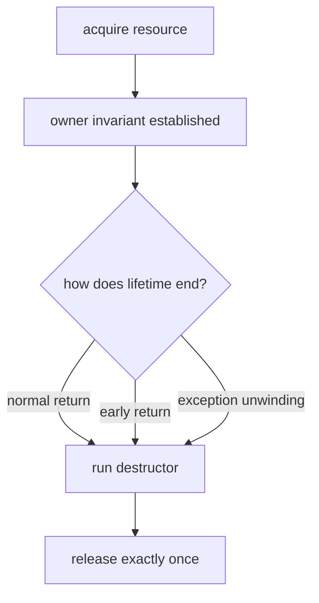

<TLDR>
  <TLDRCell label="what">
    <Term id="raii">RAII（Resource Acquisition Is Initialization，资源获取即初始化）</Term>把一个资源交给对象拥有；对象生命周期结束时，析构函数确定地释放该资源。
  </TLDRCell>
  <TLDRCell label="trap">
    只在函数末尾手动清理会漏掉提前返回和异常路径；让编译器复制拥有裸句柄的对象，又会造成重复释放。
  </TLDRCell>
  <TLDRCell label="fix">
    优先组合标准库 RAII 类型并遵循零法则。必须自定义所有者时，明确禁止复制或实现真正的复制，安全转移所有权，并让析构清理不抛异常。
  </TLDRCell>
</TLDR>

## 是什么，为什么存在

RAII 是 C++ 的作用域绑定资源管理方法：成功构造的对象建立所有权不变量，析构则结束这份所有权。名称中的「初始化」不是说每次初始化都必须申请资源，而是说资源一旦取得，就应立即进入一个已经构造好的所有者，不能长期停留在无人负责的裸状态。

这里的资源不只指堆内存。文件句柄、套接字、互斥锁、数据库事务、临时目录和订阅令牌都有配对的获取与释放操作；RAII 用对象生命周期表达这对操作必须成对发生。

C++ 对已完成构造的对象提供确定性析构。正常走到作用域末尾、执行 `return` 或因异常离开时，自动存储期对象都会按规则析构。于是清理不再依赖每条控制流都记得跳到同一段尾部代码。

RAII 并不等于「栈对象」。所有者可以是另一个对象的成员，也可以由容器或<Term id="smart-pointer">智能指针（smart pointer）</Term>管理；关键是资源寿命从属于所有者对象，而不是所有者具体放在栈还是堆上。

日常 C++ 代码已经处处使用 RAII。`std::vector` 管理动态存储，`std::unique_ptr` 管理独占对象，文件流管理文件，`std::lock_guard` 管理锁。你通常应先组合这些类型，只有标准库或项目库没有合适所有者时才手写包装器。

## 工作原理

一个 RAII 所有者维持一条核心不变量：它要么持有一个有效资源并负责释放，要么处于明确的空状态。构造函数只有在不变量成立后才算成功；析构函数检查当前状态并至多释放一次。

资源寿命沿以下路径推进：

1. 获取操作返回裸资源，例如指针、整数句柄或锁定状态。
2. 代码立即把资源交给一个所有者对象。
3. 普通业务逻辑通过所有者借用资源，但不改变释放责任。
4. 所有权若发生移动，源对象进入可安全析构的空状态。
5. 最终所有者生命周期结束，析构函数执行一次配对释放。



所有权与访问权必须分开描述。拥有者决定谁释放，借用者只在约定寿命内使用资源，转移则把释放责任交给另一个对象。

| 表达方式 | 是否负责释放 | 典型 C++ 形式 |
| --- | --- | --- |
| 独占拥有 | 是，恰好一个所有者 | `std::unique_ptr<T>`、只移动句柄类 |
| 共享拥有 | 是，最后一个所有者释放 | `std::shared_ptr<T>` |
| 借用访问 | 否 | `T&`、`T*`、`std::span<T>`、原生句柄视图 |
| 所有权转移 | 责任转给目标 | 移动构造或移动赋值 |

销毁顺序让多个 RAII 对象可以组合。局部对象按完成构造的逆序销毁；成员按声明顺序构造，再按逆序销毁。后取得、通常也更依赖前一资源的对象会先清理。

异常不会调用一个尚未成功构造的完整对象的析构函数。不过，构造期间已经完成的基类和成员仍会析构。这条规则意味着资源应放在成员 RAII 类型中；若构造函数先取得裸句柄，随后又抛出，外层析构函数没有机会补救。

发生异常时，<Term id="stack-unwinding">栈展开（stack unwinding）</Term>会销毁退出范围内已完成构造的自动对象。RAII 因此能保证资源清理，但不能自动撤销已经写入数据库、发送到网络或追加到外部容器的业务效果。

<Term id="exception-safety-guarantee">异常安全保证（exception-safety guarantee）</Term>描述抛出后资源、不变量和可观察状态怎样保留。RAII 是基本资源安全的基础；若接口承诺强保证，还要先在临时状态中完成可能失败的工作，再用不抛出的提交步骤替换旧状态。

## 示例

下面三个程序依次展示标准所有者、异常栈展开和只移动句柄。它们均使用 GCC 13.3.0，以 `-std=c++23 -Wall -Wextra -Wpedantic -Werror` 编译后执行；输出来自实际运行。

### 用标准所有者接管文件

`std::unique_ptr` 不只管理 `new` 创建的对象。指定删除器后，它也能拥有 `std::FILE*`；一旦 `tmpfile()` 成功，任何后续退出路径都会调用 `FileCloser`。

<Depth level="quick">

```cpp title="temporary_file.cpp"
#include <cstdio>
#include <iostream>
#include <memory>
#include <stdexcept>

struct FileCloser {
    void operator()(std::FILE* file) const noexcept {
        std::fclose(file);
        std::cout << "closed temporary file\n";
    }
};

using File = std::unique_ptr<std::FILE, FileCloser>;

void inspect_invoice() {
    File file(std::tmpfile());
    if (!file) {
        throw std::runtime_error("tmpfile failed");
    }

    std::fputs("invoice=42\n", file.get());
    std::rewind(file.get());

    char line[32]{};
    if (!std::fgets(line, sizeof line, file.get())) {
        throw std::runtime_error("read failed");
    }
    std::cout << line;
}

int main() {
    inspect_invoice();
}
```

```text
invoice=42
closed temporary file
```

<TryToBreak items={['让读取在取得文件后失败', '在输出前提前 return', '用空 FILE 指针构造 File']} />

</Depth>

这里的删除器输出一行文字，只为显示析构时机；生产删除器通常只执行释放。`unique_ptr` 的移动操作会转移指针和删除器，复制操作则被删除，所有权模型已经由类型表达。

构造 `File` 前仍有一个短暂的裸指针结果，但它在同一个完整表达式中直接交给所有者。不要先保存裸指针，再执行若干可能抛出的操作，最后才包装它。

### 观察异常路径的逆序清理

第二个程序让两个租约按依赖顺序建立，然后故意抛出。`transaction` 后构造，所以栈展开先释放它，再释放 `connection`，最后控制才进入 `catch`。

```cpp title="unwinding.cpp"
#include <iostream>
#include <stdexcept>
#include <string>
#include <utility>

class Lease {
public:
    explicit Lease(std::string name) : name_(std::move(name)) {
        std::cout << "acquire " << name_ << '\n';
    }

    ~Lease() {
        std::cout << "release " << name_ << '\n';
    }

private:
    std::string name_;
};

void post_invoice() {
    Lease connection("connection");
    Lease transaction("transaction");
    throw std::runtime_error("validation failed");
}

int main() {
    try {
        post_invoice();
    } catch (const std::exception& error) {
        std::cout << "caught: " << error.what() << '\n';
    }
}
```

```text
acquire connection
acquire transaction
release transaction
release connection
caught: validation failed
```

RAII 清理发生在处理器运行之前。若 `Lease` 的析构函数让另一个异常逃出，此时原异常仍在传播，程序会调用 `std::terminate()`；析构清理必须吞掉、记录或以其他非抛出渠道处理失败。

这个示例只展示生命周期，不声称资源操作已经回滚。真实事务通常在析构时回滚未提交状态，而成功路径显式调用 `commit()`，这样「没有提交」与「清理对象」不会混为一谈。

### 编写只移动句柄

标准所有者不适用时，自定义类型要把独占责任写进特殊成员函数。下面的 `Channel` 禁止复制，移动构造使用 `std::exchange` 同时取走句柄并把源对象置空。

```cpp title="movable_channel.cpp"
#include <iostream>
#include <string_view>
#include <utility>

int next_handle = 10;
int open_channel(std::string_view name) {
    int handle = next_handle++;
    std::cout << "open " << name << " -> " << handle << '\n';
    return handle;
}
void close_channel(int handle) noexcept {
    std::cout << "close " << handle << '\n';
}

class Channel {
public:
    explicit Channel(std::string_view name) : handle_(open_channel(name)) {}
    ~Channel() { reset(); }
    Channel(const Channel&) = delete;
    Channel& operator=(const Channel&) = delete;
    Channel& operator=(Channel&&) = delete;
    Channel(Channel&& other) noexcept
        : handle_(std::exchange(other.handle_, -1)) {}
    int get() const noexcept { return handle_; }

private:
    void reset() noexcept {
        if (handle_ != -1) close_channel(handle_);
    }
    int handle_ = -1;
};

int main() {
    Channel primary("billing");
    Channel active(std::move(primary));
    std::cout << "active " << active.get() << '\n';
}
```

```text
open billing -> 10
active 10
close 10
```

移动后的 `primary` 仍然存活，但已处于可安全析构的空状态。这个例子刻意删除移动赋值；接口不需要某项操作时，删除它比草率实现更好。

若类型确实需要移动赋值，目标可能已经拥有资源。实现必须先安全处理目标旧资源，再接管源资源，并处理自移动；这些细节正是优先采用标准 RAII 成员的理由。

## 陷阱

### 把清理留在函数末尾

> [!PITFALL]
> 裸句柄配上一条末尾 `close()` 只覆盖正常直线路径。新增的提前返回、校验异常或中间分配失败都可能绕过它。

**修复：** 获取成功后立即构造所有者，后续代码只通过它借用资源。测试正常返回、每个提前返回和获取之后的异常，不要只检查最顺利的路径。

### 让编译器浅复制独占资源

> [!PITFALL]
> 含裸指针或整数句柄的类若保留默认复制，两个对象会认为自己都负责释放同一资源。结果通常是重复释放、悬空访问，或为了避开崩溃而意外泄漏。

**修复：** 独占所有者应删除复制并正确实现移动，或者把资源放进 `std::unique_ptr` 等成员，让特殊成员函数组合出正确行为。确实需要复制时，应定义独立资源、引用计数或其他明确语义，不能接受地址的按位复制。

### 混淆借用与转移

> [!PITFALL]
> 名为 `get()` 的函数通常只借出句柄；调用方若把它存起来、关闭它或交给另一个所有者，原对象仍会按自己的契约释放，造成悬空或重复释放。

**修复：** 在 API 中分别命名并记录借用、复制与转移。转移函数应让源对象失去所有权，例如 `unique_ptr::release()`；借用视图则不能活过所有者，也不能私自释放资源。

### 从析构函数抛出

> [!PITFALL]
> 关闭文件、提交遥测或释放远程租约本身可能失败。让异常逃出析构函数很难被调用方可靠处理；若同时正在栈展开，程序会终止。

**修复：** 析构函数执行不抛出的兜底清理。若调用方必须知道关闭结果，提供可显式调用的 `close()`、`commit()` 或 `finish()`，让它在对象销毁前返回状态或抛出；析构仍负责未显式完成时的安全回收。

### 以为 RAII 会撤销业务修改

> [!PITFALL]
> RAII 能释放内存和句柄，却不会自动撤销已经追加到容器的数据、已发送的消息或已写入外部系统的记录。资源没有泄漏，不代表操作满足强异常保证。

**修复：** 先写明失败后的可观察状态。需要全有或全无时，在临时对象中完成校验和可能抛出的工作，再用不抛出的交换、句柄替换或事务提交发布结果。

### 把作用域误当成所有生命周期边界

> [!PITFALL]
> 动态分配的所有者不会因为创建它的代码块结束就自动销毁；`std::exit()`、`std::_Exit()`、`std::abort()` 和进程崩溃也不遵循普通局部栈展开路径。

**修复：** 让动态对象本身也进入智能指针或值语义容器，并按真正所有者安排寿命。持久数据需要显式刷新与恢复协议，不能把析构当成崩溃一致性机制。

## AI 时代

**生成代码在这里常犯的错**

模型会生成一个带析构函数的裸句柄类，却忘记删除默认复制；也会先取得句柄，调用一个可能抛出的配置函数，最后才把句柄包装起来。另一类常见输出用 `std::shared_ptr` 掩盖所有权不清的问题，制造引用环，或者为数组配错 `delete`、为 `FILE*` 配错删除器。生成的析构函数还可能直接调用会抛出的 `close()`，在栈展开期间把普通错误升级为终止。

**让 AI 检查**

- 为每种资源列出获取点、唯一释放责任、所有借用者、转移点和每条退出路径。
- 检查拥有资源的类的析构、复制构造、复制赋值、移动构造与移动赋值，并说明每一项为何默认、删除或自定义。
- 在获取之后的每个可能抛出点注入失败，跟踪已完成构造的对象、外部副作用和最终释放次数。

**审查清单**

- 确认每个成功取得的资源立即进入所有者，并且正常返回、提前返回和异常都恰好释放一次。
- 确认借用不会越过所有者寿命，移动后源对象可安全析构，共享所有权没有强引用环。
- 确认析构和删除器不让异常逃出，需要报告的关闭或提交失败另有显式接口。

**提示词词汇**

使用准确术语：`RAII`（资源获取即初始化）、`scope-bound resource management`（作用域绑定资源管理）、`ownership`（所有权）、`borrowed handle`（借用句柄）、`deterministic destruction`（确定性析构）、`stack unwinding`（栈展开）、`move-only owner`（只移动所有者）、`moved-from state`（移动后状态）、`non-throwing destructor`（不抛出析构函数）和 `strong exception guarantee`（强异常保证）。要求模型输出所有权表与异常路径，而不是笼统地「让资源管理更安全」。

<Depth level="deep">

## 所有权转移与特殊成员函数

优先选择零法则：让 `std::vector`、`std::string`、`std::unique_ptr`、文件流或项目已有句柄类型成为成员，不手写析构、复制或移动。成员已经知道怎样管理自己的资源，外层类型的默认操作就能按声明顺序组合这些语义。

自定义所有者首先要决定复制含义。独占操作系统句柄通常不能复制，所以删除复制构造和复制赋值；一块可复制缓冲区可能需要深复制；真正共享的资源才适合引用计数。不能先保留默认浅复制，等测试遇到重复释放后再补救。

移动构造要把资源从源对象放入新对象，并给源对象留下满足不变量的<Term id="moved-from-state">移动后状态（moved-from state）</Term>。对只含一个句柄的类型，`std::exchange(other.handle_, invalid)` 很直接。源对象随后仍可能被析构或重新赋值，但除非接口另有保证，业务代码不应假定它还保留原资源。

移动赋值比移动构造多一个旧目标。它要处理目标原资源、接管源资源、恢复源不变量，还要对 `object = std::move(object)` 给出安全行为。若接口从不需要重新安置资源，可以像示例那样删除移动赋值，缩小要维护的状态空间。

自定义析构函数会影响编译器隐式声明移动操作的规则。不要猜测最终生成了哪些特殊成员函数；把所有权策略明确写成 `= default`、`= delete` 或自定义实现，并用 `std::is_copy_constructible_v<T>`、`std::is_move_constructible_v<T>` 等类型特征验证公开契约。

### 构造失败前后的所有权窗口

完整对象只有在构造函数成功结束后才存在。如果构造函数体抛出，类自身的析构函数不会执行，但已完成的成员会逆序析构。因此，资源最好由成员构造函数直接取得，或在进入后续可能抛出的初始化之前交给成员所有者。

一个危险写法是先把 `open_resource()` 返回值存进普通整数成员，再在构造函数体中执行可能抛出的注册。整数没有析构行为，注册失败时句柄便泄漏。可以把整数放进单独的 RAII 句柄成员，也可以使用先建立临时所有者、全部配置成功后再移动进结果对象的工厂。

资源获取本身失败时，构造函数应保持「没有对象产生」这一清楚结果。返回无效但看似可用的对象会把检查推迟到每次成员调用；如果无效状态不是类型的正常业务状态，抛出异常或让工厂返回显式结果类型通常更容易维护。

### 声明顺序决定组合顺序

数据成员按类中声明顺序构造，与构造函数初始化列表书写顺序无关，并按声明的逆序销毁。若 `Transaction` 依赖 `Connection`，应先声明连接，再声明事务，使事务先销毁。只调整初始化列表的视觉顺序不能改变这一规则。

局部自动对象也按完成构造的逆序销毁。数组元素和基类子对象还有各自规定的顺序，但审查方法相同：先列真实构造顺序，再反转得到正常销毁与栈展开顺序，不要靠代码版面猜测。

## 析构失败与显式完成

析构函数适合保证「尝试释放且不让异常逃出」，不适合报告一项必须由业务处理的失败。文件最终写回、远程确认和事务提交都可能失败；如果成功与否会改变调用方决策，就应在普通控制流中显式完成。

常见接口让 `close()` 或 `commit()` 返回状态，成功后把对象标为空或已完成。析构函数检查该状态，对未完成对象执行不抛出的关闭或回滚。这不是重复职责：显式方法报告结果，析构函数提供遗漏与异常路径上的最后安全网。

删除器同样属于析构路径。`std::unique_ptr` 的删除器必须能够在销毁时安全调用；若删除器抛出，异常会越过不抛出的销毁边界并导致终止。把网络重试、分配或其他复杂策略塞进删除器，会让原本简单的生命周期保证变得脆弱。

记录清理失败也要谨慎。日志代码可能分配内存、获取锁或再次失败，而且程序静态销毁阶段的基础设施可能已经停止。对必须可靠留存的错误，应在显式完成阶段处理；析构日志只能是尽力而为的诊断。

### 事务默认回滚

事务型 RAII 对象通常把「未完成」作为初始状态。成功路径显式提交并标记完成，异常或提前返回则让析构函数回滚。默认回滚比默认提交安全，因为离开作用域本身不能证明所有业务校验都已通过。

回滚也可能失败。析构函数不能把这个事实魔法般交给已经离开的调用点，因此接口要根据系统需求选择策略：在显式回滚时报告错误，在析构兜底时记录或终止连接，并依靠上层恢复流程确认外部状态。

## RAII 与异常安全边界

基本保证要求失败后没有资源泄漏，对象仍满足不变量；强保证要求失败不产生可观察效果；不抛出保证要求操作不会让异常逃出。一个函数可以把所有临时内存都交给 RAII 对象，却仍只提供基本保证，因为它在失败前已经修改了调用方容器。

强保证常用「准备后提交」结构。先在局部 RAII 对象中分配、解析和验证，再通过已经确认不抛出的交换或句柄替换发布结果。旧状态随后由临时对象析构清理；每个资源安全，但业务原子性来自提交设计而不是析构本身。

并非每个接口都需要强保证。流式处理或大型批次可能有意保留已完成进度，只提供基本保证；这可以是合理契约，但必须让调用方知道从哪里恢复。不要用「采用了 RAII」代替对失败后状态的描述。

### 非普通终止路径

从作用域正常离开和 C++ 异常栈展开会触发自动对象析构，但程序终止 API 与崩溃路径不同。`std::exit()` 不展开当前线程的自动对象，`std::_Exit()` 和 `std::abort()` 的清理更少，断电更不会运行用户代码。

因此，RAII 不能单独提供持久性。重要文件需要写临时文件、刷新、原子替换或日志恢复等协议；跨进程锁和租约需要操作系统或服务端的断线回收。析构仍负责正常进程内路径，但恢复设计必须覆盖进程不再执行的情况。

## 审计一个 RAII 类型

先写资源状态表，再读函数体。表中至少列出无效值、获取操作、释放操作、独占或共享规则、借用寿命、复制策略、移动后状态和关闭失败渠道；这些信息缺一项，代码往往会用未经说明的假设补空白。

然后沿构造、正常使用、提前返回、异常、移动与析构逐条跟踪同一个资源标识。最有价值的测试不是只创建一次再正常退出，而是在取得资源后的每个可失败点注入错误，并统计获取与释放是否一一对应。

测试用的获取与释放函数可以记录资源标识，从而发现重复释放、漏掉释放和顺序错误。多线程代码还要让记录器本身保持安全，避免测试辅助设施引入新的数据竞争。

无效值也属于状态契约。文件描述符的 `0` 可能有效，某些句柄用空指针表示无效；包装器必须采用底层 API 定义的哨兵，不能凭其他资源类型的习惯猜测。

编译期检查能锁定类型表面契约。对独占句柄断言不可复制且可按设计移动，对移动操作检查 `noexcept` 是否真实，对多态基类检查通过基类删除是否有正确析构契约。运行期工具可以发现泄漏和重复释放，但它们不能替你决定谁本来应该拥有资源。

最后检查 API 名称。`get()`、`view()` 或引用返回值应清楚表示借用，`release()` 表示放弃所有权且不释放，`reset()` 表示替换或结束当前所有权。一个含糊的 `handle()` 若既可能借用又可能转移，会把最重要的生命周期信息留给猜测。

</Depth>

<Checkpoint id="cpp/raii" />

## 延伸阅读

- [C++23 工作草案：作用域](https://timsong-cpp.github.io/cppwp/n4950/basic.scope.scope)
- [C++23 工作草案：析构函数](https://timsong-cpp.github.io/cppwp/n4950/class.dtor)
- [C++23 工作草案：栈展开](https://timsong-cpp.github.io/cppwp/n4950/except.ctor)
- [C++23 工作草案：`unique_ptr`](https://timsong-cpp.github.io/cppwp/n4950/unique.ptr)
- [C++ Core Guidelines：资源管理](https://isocpp.github.io/CppCoreGuidelines/CppCoreGuidelines#Rr-raii)
