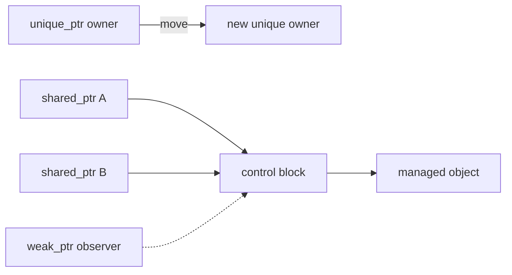

<TLDR>
  <TLDRCell label="what">
    A <Term id="smart-pointer">smart pointer</Term> uses an object to express a pointer's ownership and release rules. `std::unique_ptr` owns exclusively, `std::shared_ptr` shares ownership, and `std::weak_ptr` only observes an object managed by `shared_ptr`.
  </TLDRCell>
  <TLDRCell label="trap">
    `shared_ptr` isn't a universal safety upgrade. Two control blocks for the same raw pointer cause double deletion, while a strong-reference cycle prevents the counts from ever reaching zero.
  </TLDRCell>
  <TLDRCell label="fix">
    Start with `make_unique` by default, and use `make_shared` only when several parties genuinely co-own the object. Use a reference, raw pointer, or `weak_ptr` for non-owning relationships, and call `lock()` to hold temporary strong ownership before access.
  </TLDRCell>
</TLDR>

## What it is and why it exists

C++ smart pointers are pointer-like RAII objects defined in `<memory>`. They encode who destroys an object in the type's copy, move, and destruction behavior, so normal returns, early returns, and exception paths follow the same release rules. They can't decide who should own an object in your domain; that design remains yours.

`std::unique_ptr<T>` expresses <Term id="exclusive-ownership">exclusive ownership</Term>: exactly one owner is responsible for destroying `T` at a time. It can't be copied, but it can be moved; a move transfers release responsibility and leaves the source empty. Factory results, owning data members, and containers of polymorphic objects should usually start here.

`std::shared_ptr<T>` expresses <Term id="shared-ownership">shared ownership</Term>: several pointers collectively extend an object's lifetime, and the last strong owner destroys it. It fits tasks, subscriptions, or state crossing asynchronous operations when there is no natural sole parent. It doesn't fit a design that copies ownership everywhere merely because the call relationships haven't been clarified.

`std::weak_ptr<T>` is a non-owning observation handle established from a `shared_ptr`. It doesn't prevent destruction and can't be dereferenced directly; `lock()` atomically obtains a temporary `shared_ptr` if the object is still alive. Parent-child back-links, observer lists, and callbacks that must not keep their target alive commonly need this relationship.

Smart pointers manage ownership, not every access. If a function uses an object only for the duration of the call, `T&` or `T*` is often clearer than `const shared_ptr<T>&`. Pass a smart pointer in an interface when the interface extends lifetime or accepts ownership.

## How it works

Each `unique_ptr` stores a pointer and a deleter. Destruction or `reset()` calls the deleter when the pointer is non-null, whereas `release()` returns the raw pointer without deleting the object. The default deleter calls `delete` for one object; the `unique_ptr<T[]>` array specialization calls `delete[]` and provides indexed access.

`make_unique<T>(args...)` combines construction and adoption in one expression and avoids repeating the type. C++23 code normally doesn't need a direct `new` unless it adopts an existing resource or supplies a custom deleter. A custom deleter also lets `unique_ptr` manage `FILE*`, operating-system handles, and other resources with paired release functions.

An ordinary `shared_ptr` conceptually relates two addresses: the stored pointer returned by `get()`, and a shared <Term id="reference-count-control-block">reference-count control block</Term>. The control block records the managed object or its deleter, the number of strong owners, and the weak observers that still require the block itself.

Copying a `shared_ptr` shares its control block and increments the strong count; moving transfers the existing relationship. The managed object is destroyed when the last strong owner disappears. If `weak_ptr` objects remain, the control block lives on until the final weak observer also leaves; weak pointers don't determine when the managed object is destroyed.



Access through a `weak_ptr` must combine "is it alive?" with "keep it alive until this use ends." When `if (auto owner = weak.lock())` succeeds, the local `owner` keeps the object alive for its scope. Calling `expired()` first and accessing separately leaves a race window.

Choose among the three types from the ownership relationship:

1. Use `unique_ptr` when one place is responsible for final destruction.
2. Use `shared_ptr` when independent participants must each be able to keep the object alive.
3. Use `weak_ptr` when a link may expire and must not extend lifetime.
4. Use a reference or raw pointer when a caller only accesses an object within a known lifetime.

The passing form in an interface is also a contract:

| Parameter or result | Expressed semantics | What the caller can expect to change |
| --- | --- | --- |
| `std::unique_ptr<T>` by value | Transfer exclusive ownership | The caller usually passes `std::move(pointer)` |
| Return `std::unique_ptr<T>` | Produce a new exclusive owner | The result takes charge of the object |
| `std::shared_ptr<T>` by value | Acquire a share of ownership | There is at least one extra strong owner during the call |
| `T&` or `T*` | Borrow for an agreed duration | Ownership doesn't change |
| `std::weak_ptr<T>` | Observe a relationship that may expire | Call `lock()` before use |

`make_shared<T>(args...)` typically puts the object and control block in one allocation, but the standard specifies observable semantics rather than a particular memory layout. This combined allocation also means that after the last strong reference destroys the object, the allocation containing its storage may remain until all weak references are gone.

## Examples

These three programs progress from exclusive transfer to breaking a cycle with a weak link, then to a delayed callback that doesn't keep its target alive. Each was compiled and run with GCC 13.3.0 using `-std=c++23 -Wall -Wextra -Wpedantic -Werror`; the output shown is from those executions.

### Transfer exclusive ownership

The factory creates one owner, and `std::move` hands the report to the next location. Taking a `unique_ptr` by value makes `archive` an explicit ownership consumer; the report closes when that parameter is destroyed as the function returns.

<Depth level="quick">

```cpp title="unique_transfer.cpp"
#include <iostream>
#include <memory>
#include <string>
#include <utility>

class Report {
public:
    explicit Report(std::string name) : name_(std::move(name)) {
        std::cout << "open " << name_ << '\n';
    }
    ~Report() { std::cout << "close " << name_ << '\n'; }
    const std::string& name() const { return name_; }

private:
    std::string name_;
};

void archive(std::unique_ptr<Report> report) {
    std::cout << "archive " << report->name() << '\n';
}

int main() {
    auto draft = std::make_unique<Report>("quarterly");
    std::cout << "owner " << draft->name() << '\n';

    auto active = std::move(draft);
    std::cout << "draft empty: " << std::boolalpha << !draft << '\n';
    archive(std::move(active));
    std::cout << "active empty: " << !active << '\n';
}
```

```text
open quarterly
owner quarterly
draft empty: true
archive quarterly
close quarterly
active empty: true
```

<TryToBreak items={['remove std::move when calling archive', 'dereference draft after the first move', 'return early inside archive']} />

</Depth>

The moved-from `draft` and `active` are both empty states that remain safe to destroy or assign. You can test them for emptiness here, but production code should generally stop relying on a variable immediately after its ownership has moved.

### Use a weak link for the back-reference

A team owns its members, while each member only observes the team. If both directions used `shared_ptr`, the two objects would form a strong-reference cycle. Making the back-link a `weak_ptr` lets releasing the last team owner destroy the team normally.

```cpp title="weak_parent.cpp"
#include <iostream>
#include <memory>
#include <string>
#include <utility>
#include <vector>

struct Team;

struct Member {
    explicit Member(std::string value) : name(std::move(value)) {}
    ~Member() { std::cout << "destroy member " << name << '\n'; }
    void show_team() const;
    std::string name;
    std::weak_ptr<Team> team;
};

struct Team {
    explicit Team(std::string value) : name(std::move(value)) {}
    ~Team() { std::cout << "destroy team " << name << '\n'; }
    std::string name;
    std::vector<std::shared_ptr<Member>> members;
};

void Member::show_team() const {
    if (auto owner = team.lock()) {
        std::cout << name << " works in " << owner->name << '\n';
    } else {
        std::cout << name << " has no team\n";
    }
}

int main() {
    auto team = std::make_shared<Team>("compiler");
    auto member = std::make_shared<Member>("Ada");
    member->team = team;
    team->members.push_back(member);

    std::cout << "team owners: " << team.use_count() << '\n';
    std::cout << "member owners: " << member.use_count() << '\n';
    member->show_team();

    auto saved_member = team->members.front();
    member.reset();
    team.reset();
    saved_member->show_team();
}
```

```text
team owners: 1
member owners: 2
Ada works in compiler
destroy team compiler
Ada has no team
destroy member Ada
```

`saved_member` keeps the member alive, but the member's weak link doesn't keep the team alive in return. A failed `lock()` is an ordinary state, not an exception; the caller must decide whether to skip work, remove a record, or report that the target is gone.

### Build a callback that doesn't keep its target alive

If an object stores a lambda that captures a `shared_ptr` to itself, it creates a self-cycle. This callback captures `weak_from_this()` and tries to upgrade it when invoked, so a task queue doesn't keep `Worker` alive merely by retaining the callback.

```cpp title="weak_callback.cpp"
#include <functional>
#include <iostream>
#include <memory>
#include <string>
#include <utility>

class Worker : public std::enable_shared_from_this<Worker> {
public:
    explicit Worker(std::string value) : name_(std::move(value)) {}
    ~Worker() { std::cout << "destroy " << name_ << '\n'; }

    std::function<void()> callback() {
        std::weak_ptr<Worker> self = weak_from_this();
        return [self] {
            if (auto worker = self.lock()) {
                std::cout << "run " << worker->name_ << '\n';
            } else {
                std::cout << "worker expired\n";
            }
        };
    }

private:
    std::string name_;
};

int main() {
    auto worker = std::make_shared<Worker>("index");
    auto run_later = worker->callback();
    run_later();
    worker.reset();
    run_later();
}
```

```text
run index
destroy index
worker expired
```

`weak_from_this()` returns an empty weak pointer when the object isn't yet managed by a compatible `shared_ptr`. If the callback's contract requires the object to be alive, the registrar should explicitly hold a `shared_ptr`; don't silently interpret a failed upgrade as successful execution.

## Pitfalls

### Treating shared ownership as the default

> [!PITFALL]
> Mechanically replacing every `unique_ptr` or raw borrow with `shared_ptr` hides the place responsible for release. Once copying becomes ubiquitous, objects may be destroyed far later than expected and reference cycles become easier to create.

**Fix:** draw who must keep the object alive first. Use `unique_ptr` when there is one natural owner, use `shared_ptr` only when participants can independently extend lifetime, and pass `T&` or `T*` for access alone.

### Creating two control blocks from one raw pointer

> [!PITFALL]
> Evaluating `std::shared_ptr<T>(raw)` twice usually creates two control blocks that know nothing about each other. Each eventually deletes the same object; constructing a `shared_ptr` directly from `this` creates the same class of bug.

**Fix:** call `make_shared` in one place, then copy only the resulting `shared_ptr`. When a member function must share its own object, inherit from `enable_shared_from_this<T>`, ensure a compatible `shared_ptr` already manages it, and then call `shared_from_this()`.

### Leaving a strong-reference cycle

> [!PITFALL]
> Reference counting sees pointer counts, not whether a group of objects is unreachable from program roots. Two nodes holding `shared_ptr` values to each other, or an object storing a callback that strongly captures itself, prevent the strong counts from reaching zero.

**Fix:** choose the non-owning side from the domain relationship and make it a `weak_ptr`. In tests, release every external strong owner and observe destruction; also decide whether containers must periodically remove expired weak entries.

### Using a weak observation after a separate check

> [!PITFALL]
> A `false` result from `expired()` describes only the instant of the check; another thread or callback can immediately release the last strong owner. Checking first and then relying on an earlier raw pointer can still dangle.

**Fix:** call `lock()` once per use and finish the access within the scope of the resulting local `shared_ptr`. Make upgrade failure an explicit branch, and don't use `use_count()` to predict future safety.

### Blurring responsibility with `get()` or `release()`

> [!PITFALL]
> `get()` lends an address without transferring release responsibility; storing that result long-term or giving it to another owner causes dangling access or double deletion. `unique_ptr::release()` disables automatic deletion, so it leaks if no recipient adopts the result immediately.

**Fix:** use `get()` only with legacy interfaces that neither adopt nor retain the address. For a real transfer to a raw-pointer API, verify its adoption contract first, then call `release()` and record the new sole releaser.

### Misunderstanding shared-pointer thread safety

> [!PITFALL]
> Different `shared_ptr` objects sharing one control block can be copied and destroyed independently across threads, but that doesn't make the managed `T` thread-safe. Concurrent non-read-only operations on the same `shared_ptr` variable also require synchronization.

**Fix:** give `T` its own synchronization policy. Use a lock or `std::atomic<std::shared_ptr<T>>` when threads read and write the same smart-pointer variable, and don't mistake atomic reference counting for protection against data races inside the object.

## In the AI era

**What generated code gets wrong here**

Models often replace fields and parameters with `shared_ptr` without stating ownership, or construct fresh `shared_ptr` values from an existing raw pointer and from `this`. Generated graphs make both parent and child links strong, asynchronous lambdas capture `shared_from_this()` and are then stored back in the same object, and array code pairs `unique_ptr<T>` with `new T[]`. Another failure mode dereferences a source `unique_ptr` after a move, or checks `weak_ptr::expired()` before carrying an old raw pointer across an asynchronous boundary.

**Ask your AI to check**

- For every dynamic object, list strong owners, weak observers, raw borrowers, ownership-transfer points, and the final destruction condition.
- Find every `shared_ptr` constructed from a raw pointer or `this`, and prove that one object corresponds to exactly one control block.
- Simulate the last external strong owner leaving, a late callback, and a failed `weak_ptr::lock()`, explaining what each branch keeps alive, skips, or cleans up.

**Review checklist**

- Confirm that `unique_ptr` is the default, no old value is relied on after `std::move`, and every `release()` has an immediate adopter.
- Confirm that shared graphs have no unintended strong-reference cycles and every `enable_shared_from_this` object is managed by a compatible `shared_ptr` from the start.
- Confirm that weak observations use a local strong pointer from one `lock()` call, and separately review synchronization for object state and for the same pointer variable.

**Prompt vocabulary**

Use the exact terms `exclusive ownership`, `shared ownership`, `control-block identity`, `strong reference cycle`, `non-owning observer`, `ownership transfer`, `moved-from state`, `custom deleter`, and `atomic<shared_ptr>`. Ask the model for an ownership graph and destruction conditions instead of vaguely requesting "safe smart pointers."

<Depth level="deep">

## Control-block identity and aliasing

Common ownership between `shared_ptr` objects is determined by control-block identity, not the numeric value of `get()`. Two `shared_ptr` values can store the same address while belonging to different control blocks. Conversely, the aliasing constructor can share a control block while making `get()` point to a member of the managed object.

The aliasing form `std::shared_ptr<Member>(owner, member_address)` makes the result co-own the original object with `owner`, while dereferencing the result accesses the member address. The complete owning object stays alive as long as the alias exists, so the member address remains valid. This is useful for binding a subobject view to its parent lifetime, but API documentation must distinguish what the result owns from what it points to.

`owner_before` and `std::owner_less` compare ownership relationships and can organize associative containers by control-block identity. C++23 has no corresponding ownership-hashing interface, so this topic's examples must not assume one exists.

`use_count()` is primarily diagnostic. It reports the number of strong owners observed at the instant of the call; it can't prove that the caller is the unique owner or replace synchronization and lifetime protocols. Between that result and the next statement, another thread may copy or destroy its own pointer.

`make_shared` commonly removes a separate allocation and keeps construction exception-safe, but directly constructing `shared_ptr` may be necessary for a custom deleter, separate control of object-storage release, or adoption of an existing resource. Whatever creation form you use, the same object can enter only one ownership group.

## Creation and adoption boundaries

A creation function should return the weakest ownership type that is sufficient. If a new object naturally has one recipient, returning `unique_ptr` preserves the caller's choice: the caller can stay exclusive or promote it to `shared_ptr` with a move. A factory returning `shared_ptr` commits every caller to shared control-block semantics from the beginning.

Move-constructing `shared_ptr` from `unique_ptr` creates a control block and transfers the object and deleter together. The source `unique_ptr` is empty afterward, so the conversion still has one release path. The standard library has no operation that demotes an arbitrary `shared_ptr` to `unique_ptr`, because even a currently observed count of one can't restore the original exclusive contract.

Adopting a raw pointer is a boundary operation, not an ordinary copy. Only one place may first put a particular dynamic object into an owning smart pointer, and the deleter must match how that object was created. Every other location must copy an existing `shared_ptr` or borrow the address within the original owner's promised lifetime.

Ownership interfaces can be ordered by the strength of their promise:

| Interface need | Suitable form | What it must not imply |
| --- | --- | --- |
| Create and hand off one owner | Return `unique_ptr<T>` | The caller must share |
| Accept and consume one owner | Take `unique_ptr<T>` by value | The source remains accessible afterward |
| Join co-ownership | Take `shared_ptr<T>` by value | The managed object is automatically synchronized |
| Possibly use later without keeping alive | Store `weak_ptr<T>` | The object necessarily exists when invoked |
| Finish only the current call | Take `T&` or `T*` | The callee stores or releases the object |

`const shared_ptr<T>&` can avoid one temporary count change, but it doesn't automatically say whether the function copies the pointer elsewhere. If a function only operates on the object, `T&` states non-ownership more directly. If it must keep the object alive after returning, taking by value and moving into a member better matches the contract.

`enable_shared_from_this<T>` doesn't create ownership by itself. It lets an object that has already joined a compatible control block obtain a new `shared_ptr` in the same ownership group. Calling `shared_from_this()` in a constructor or on a stack object throws `std::bad_weak_ptr` because that relationship hasn't been established.

`weak_from_this()` is useful for producing a handle that may expire; it returns an empty weak pointer rather than throwing when the object isn't managed yet. The empty result must still fit the domain contract. An initialization-order bug shouldn't always be treated as though the object simply disappeared later.

## Release, reset, and shutdown protocols

`unique_ptr::reset()` replaces the stored address and invokes the deleter on the old address when it is non-null; without an argument it makes the pointer empty. `release()` only empties the pointer and returns the address without invoking the deleter. Their names are similar but their responsibilities are different, so generated code reviews should trace every returned raw address.

### The empty state still has exact semantics

A default-constructed smart pointer, one built from a null pointer, or one moved from can be safely destroyed, assigned, and queried. An empty `unique_ptr` doesn't invoke its deleter. An empty `shared_ptr` with no control block has a `use_count()` of zero; the state can express "no object," but it must not be dereferenced without a check.

A `shared_ptr` Boolean conversion checks only whether the stored pointer is null, not whether a control block exists. Aliasing can even produce a pointer with `get() == nullptr` and a false Boolean value that still co-owns another object, so ownership identity can't be reduced to an address or Boolean comparison.

`shared_ptr::reset()` relinquishes only this one share of ownership. Whether the object is destroyed immediately depends on every other `shared_ptr`, including function parameters, lambda captures, asynchronous tasks, and aliases. Seeing the object survive a `reset()` doesn't mean release failed.

Destruction occurs inside the operation that reduces the strong count to zero. The thread holding the final owner therefore influences which thread runs destruction. A resource with thread affinity, a low-latency queue, or explicit shutdown-error handling needs a dedicated `close()` or scheduling protocol rather than placing every semantic in its deleter.

A weak callback only answers whether a queued task keeps its target alive; it doesn't cancel a task that has already locked successfully. Unregistration must also define whether it waits for running callbacks, whether callbacks may reenter, and which synchronization mechanism protects object state.

Ownership tests should observe destruction conditions, not only final output. At minimum, cover moved-from sources, departure of the last strong reference, failed weak upgrades, broken strong cycles, and failed adoption. Use dynamic tools such as AddressSanitizer to check executed paths for double deletion and use after free.

## Arrays, deleters, and concurrency boundaries

Dynamic arrays need matching types and release operations. Use `std::make_unique<T[]>(count)` to obtain `unique_ptr<T[]>` and access it with `operator[]`; don't put `new T[count]` into a single-object `unique_ptr<T>`. C++20 also provides `make_shared<T[]>(count)`, though fixed-size `std::array` and variable-size `std::vector` usually offer a more complete container interface.

The deleter is part of a smart pointer's type or control-block semantics. `unique_ptr<T, D>` places the deleter type in the pointer type, so different deleters generally produce different types. `shared_ptr<T>` type-erases its deleter and stores the concrete deleter in the control block; either way, the deleter must match resource acquisition and must not let an exception escape a destruction path.

`unique_ptr` can hold a pointer to an incomplete type, which is useful for Pimpl, but the point where its default deleter actually deletes must see the complete type. A common arrangement declares the implementation class and outer destructor in the header, then defines that destructor in a source file that sees the implementation definition.

Reference-count operations keep the control block itself consistent while pointers are copied and destroyed concurrently. They don't synchronize fields in `*pointer`, raw addresses returned by `get()`, or concurrent `reset()` calls on one ordinary `shared_ptr` object. In C++23, `std::atomic<std::shared_ptr<T>>` provides atomic operations when a shared pointer value itself must be published or replaced.

Shared ownership makes destruction happen wherever the last strong reference is released, which the creator often can't predict directly. If destruction has high latency, must run on one thread, or performs blocking work such as joining a thread, use an additional scheduling and shutdown protocol instead of relying only on the reference count reaching zero.

</Depth>

<Checkpoint id="cpp/smart-pointers" />

## Further reading

- [C++23 working draft: `unique_ptr`](https://timsong-cpp.github.io/cppwp/n4950/unique.ptr)
- [C++23 working draft: `shared_ptr`](https://timsong-cpp.github.io/cppwp/n4950/util.smartptr.shared)
- [C++23 working draft: `weak_ptr`](https://timsong-cpp.github.io/cppwp/n4950/util.smartptr.weak)
- [C++ Core Guidelines: resource management](https://isocpp.github.io/CppCoreGuidelines/CppCoreGuidelines#Rr-ptr)
