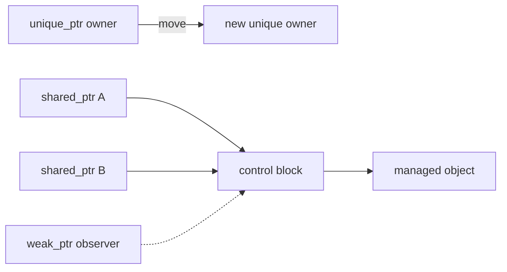

<TLDR>
  <TLDRCell label="what">
    <Term id="smart-pointer">智能指针（smart pointer）</Term>用对象表达指针的所有权和释放规则。`std::unique_ptr`独占对象，`std::shared_ptr`共享对象，`std::weak_ptr`只观察由`shared_ptr`管理的对象。
  </TLDRCell>
  <TLDRCell label="trap">
    `shared_ptr`不是通用的安全升级。为同一个裸指针创建两个控制块会重复释放，强引用环则会让计数永远无法归零。
  </TLDRCell>
  <TLDRCell label="fix">
    默认从`make_unique`开始，只有确实存在多个共同所有者时才使用`make_shared`。非拥有关系使用引用、裸指针或`weak_ptr`，并在访问前用`lock()`取得临时强所有权。
  </TLDRCell>
</TLDR>

## 是什么，为什么存在

C++智能指针是定义在`<memory>`中的指针式RAII对象。它把“谁负责销毁对象”写进类型及其复制、移动和析构行为，因而能让正常返回、提前返回和异常路径遵循同一套释放规则。它不会替你判断业务上应该由谁拥有对象；这项设计仍由程序员完成。

`std::unique_ptr<T>`表达<Term id="exclusive-ownership">独占所有权（exclusive ownership）</Term>：同一时刻只有一个所有者负责销毁`T`。它不能复制，但可以移动；移动把释放责任交给目标，并把源指针置空。工厂返回值、类的拥有型成员和多态对象容器通常都应先考虑它。

`std::shared_ptr<T>`表达<Term id="shared-ownership">共享所有权（shared ownership）</Term>：多个指针共同延长一个对象的生命周期，最后一个强所有者离开时销毁对象。它适合生命周期没有天然单一上级的任务、订阅或跨异步操作状态，不适合仅仅因为调用关系尚未梳理清楚就到处复制。

`std::weak_ptr<T>`是由`shared_ptr`建立的非拥有观察句柄。它不阻止对象销毁，也不能直接解引用；调用`lock()`可以在对象仍存活时原子地取得一个临时`shared_ptr`。父子反向链接、观察者列表和不保活的回调经常需要这种关系。

智能指针管理的是所有权，不是所有访问。只在调用期间使用对象时，`T&`或`T*`往往比`const shared_ptr<T>&`更清楚；接口要延长生命周期或接受所有权时，才应在参数或返回类型中传递智能指针。

## 工作原理

每个`unique_ptr`保存一个指针和一个删除器。析构或`reset()`会在非空时调用删除器，`release()`则只交出裸指针而不删除对象。默认删除器对单对象调用`delete`；`unique_ptr<T[]>`的数组特化调用`delete[]`并提供下标访问。

`make_unique<T>(args...)`把构造和接管放在一个表达式中，并避免重复写类型。C++23代码除非要接管已有资源或指定自定义删除器，通常不必直接写`new`。自定义删除器还能让`unique_ptr`管理`FILE*`、操作系统句柄或其他采用成对释放函数的资源。

一个普通`shared_ptr`在概念上关联两个地址：`get()`返回的存储指针，以及一个共享的<Term id="reference-count-control-block">引用计数控制块（reference-count control block）</Term>。控制块记录被管理对象或其删除器、强所有者数量，以及仍需保留控制块的弱观察者数量。

复制`shared_ptr`会共享同一个控制块并增加强计数，移动则转交现有关系。最后一个强所有者消失时，被管理对象销毁；仍有`weak_ptr`时，控制块继续存在，直到最后一个弱观察者也离开。`weak_ptr`不参与决定被管理对象何时销毁。



从`weak_ptr`访问对象必须把“检查是否存活”与“延长到本次使用结束”合成一个操作。`if (auto owner = weak.lock())`成功时，局部`owner`在作用域内保持对象存活；先调用`expired()`再另行访问会留下竞争窗口。

三种类型的选择取决于所有权关系：

1. 一个位置负责最终销毁时，使用`unique_ptr`。
2. 多个独立参与者都必须让对象存活时，使用`shared_ptr`。
3. 某个链接可以失效且不应延长生命周期时，使用`weak_ptr`。
4. 调用者只在已知生命周期内访问时，使用引用或裸指针表达借用。

接口中的传递方式同样构成契约：

| 形参或结果 | 表达的语义 | 调用方可预期的变化 |
| --- | --- | --- |
| `std::unique_ptr<T>`按值传入 | 转移独占所有权 | 调用方通常传入`std::move(pointer)` |
| `std::unique_ptr<T>`返回 | 产生新的独占所有者 | 返回值接管对象 |
| `std::shared_ptr<T>`按值传入 | 函数取得一份共享所有权 | 调用期间至少增加一个强所有者 |
| `T&`或`T*` | 在约定期限内借用 | 不改变所有权 |
| `std::weak_ptr<T>` | 可失效的观察关系 | 使用前必须调用`lock()` |

`make_shared<T>(args...)`通常把对象与控制块放在一次分配中，但标准只规定可观察语义，不要求某一种内存布局。这个组合分配也意味着：最后一个强引用销毁对象后，只要弱引用仍在，包含对象存储的整块分配可能还不能释放。

## 示例

下面三个程序依次展示独占转移、用弱链接打断环，以及不保活的延迟回调。它们都使用GCC 13.3.0按`-std=c++23 -Wall -Wextra -Wpedantic -Werror`编译并运行，输出来自实际执行。

### 转移独占所有权

工厂创建唯一所有者，`std::move`把报告交给下一个位置。按值接收`unique_ptr`的`archive`明确消费所有权，函数返回时报告就在参数析构期间关闭。

<Depth level="quick">

```cpp title="unique_transfer.cpp"
#include <iostream>
#include <memory>
#include <string>
#include <utility>

class Report {
public:
    explicit Report(std::string name) : name_(std::move(name)) {
        std::cout << "open " << name_ << '\n';
    }
    ~Report() { std::cout << "close " << name_ << '\n'; }
    const std::string& name() const { return name_; }

private:
    std::string name_;
};

void archive(std::unique_ptr<Report> report) {
    std::cout << "archive " << report->name() << '\n';
}

int main() {
    auto draft = std::make_unique<Report>("quarterly");
    std::cout << "owner " << draft->name() << '\n';

    auto active = std::move(draft);
    std::cout << "draft empty: " << std::boolalpha << !draft << '\n';
    archive(std::move(active));
    std::cout << "active empty: " << !active << '\n';
}
```

```text
open quarterly
owner quarterly
draft empty: true
archive quarterly
close quarterly
active empty: true
```

<TryToBreak items={['remove std::move when calling archive', 'dereference draft after the first move', 'return early inside archive']} />

</Depth>

移动后的`draft`和`active`都处于可析构、可赋值的空状态。这里可以检查它们是否为空，但实际业务代码一般应立即停止依赖已经转移所有权的变量。

### 用弱链接表达反向关系

团队拥有成员，成员只观察团队。如果两个方向都使用`shared_ptr`，两个对象会形成强引用环；把反向链接写成`weak_ptr`后，释放最后一个团队所有者会正常销毁团队。

```cpp title="weak_parent.cpp"
#include <iostream>
#include <memory>
#include <string>
#include <utility>
#include <vector>

struct Team;

struct Member {
    explicit Member(std::string value) : name(std::move(value)) {}
    ~Member() { std::cout << "destroy member " << name << '\n'; }
    void show_team() const;
    std::string name;
    std::weak_ptr<Team> team;
};

struct Team {
    explicit Team(std::string value) : name(std::move(value)) {}
    ~Team() { std::cout << "destroy team " << name << '\n'; }
    std::string name;
    std::vector<std::shared_ptr<Member>> members;
};

void Member::show_team() const {
    if (auto owner = team.lock()) {
        std::cout << name << " works in " << owner->name << '\n';
    } else {
        std::cout << name << " has no team\n";
    }
}

int main() {
    auto team = std::make_shared<Team>("compiler");
    auto member = std::make_shared<Member>("Ada");
    member->team = team;
    team->members.push_back(member);

    std::cout << "team owners: " << team.use_count() << '\n';
    std::cout << "member owners: " << member.use_count() << '\n';
    member->show_team();

    auto saved_member = team->members.front();
    member.reset();
    team.reset();
    saved_member->show_team();
}
```

```text
team owners: 1
member owners: 2
Ada works in compiler
destroy team compiler
Ada has no team
destroy member Ada
```

`saved_member`让成员继续存活，但成员的弱链接不会反过来保活团队。`lock()`失败是正常状态，不是异常；调用方必须决定跳过、删除记录还是报告目标已经离开。

### 建立不保活的回调

对象若把捕获自身`shared_ptr`的lambda保存在自己的成员中，就会形成自环。这个回调捕获`weak_from_this()`，执行时再尝试升级，因此任务队列不会仅仅因为保存了回调就让`Worker`永久存活。

```cpp title="weak_callback.cpp"
#include <functional>
#include <iostream>
#include <memory>
#include <string>
#include <utility>

class Worker : public std::enable_shared_from_this<Worker> {
public:
    explicit Worker(std::string value) : name_(std::move(value)) {}
    ~Worker() { std::cout << "destroy " << name_ << '\n'; }

    std::function<void()> callback() {
        std::weak_ptr<Worker> self = weak_from_this();
        return [self] {
            if (auto worker = self.lock()) {
                std::cout << "run " << worker->name_ << '\n';
            } else {
                std::cout << "worker expired\n";
            }
        };
    }

private:
    std::string name_;
};

int main() {
    auto worker = std::make_shared<Worker>("index");
    auto run_later = worker->callback();
    run_later();
    worker.reset();
    run_later();
}
```

```text
run index
destroy index
worker expired
```

`weak_from_this()`在对象尚未由兼容的`shared_ptr`管理时会得到空弱指针。若回调的契约要求对象必须存活，就应让注册者明确持有`shared_ptr`；不要把失败升级悄悄解释为成功执行。

## 陷阱

### 把共享所有权当作默认值

> [!PITFALL]
> 把所有`unique_ptr`或裸借用机械地换成`shared_ptr`，会隐藏实际负责释放的位置。复制变得随处可见后，对象可能远晚于预期才析构，也更容易形成引用环。

**修复：** 先画出谁必须让对象存活。存在唯一自然所有者时用`unique_ptr`，只有多个参与者确实能独立延长生命周期时才用`shared_ptr`，只访问则传`T&`或`T*`。

### 从同一个裸指针建立两个控制块

> [!PITFALL]
> 两次执行`std::shared_ptr<T>(raw)`通常会创建两个互不知情的控制块。每个控制块最终都会删除同一个对象，从`this`直接构造`shared_ptr`也会产生同类错误。

**修复：** 在一个地方使用`make_shared`，随后只复制所得的`shared_ptr`。成员函数需要共享自身时继承`enable_shared_from_this<T>`，并保证对象已经由兼容的`shared_ptr`管理，再调用`shared_from_this()`。

### 留下强引用环

> [!PITFALL]
> 引用计数只能看到指针数量，看不出一组对象是否已经无法从程序根部访问。两个节点互持`shared_ptr`，或对象保存捕获自身强指针的回调，都会让强计数无法归零。

**修复：** 根据领域关系选出不拥有的一边，并改用`weak_ptr`。测试中释放所有外部强所有者并观察析构，同时检查容器中的过期弱项是否需要定期清理。

### 在检查后继续使用弱观察结果

> [!PITFALL]
> `expired()`返回`false`只描述检查瞬间；另一个线程或回调可能马上释放最后一个强所有者。先检查再依赖先前保存的裸指针仍会悬空。

**修复：** 每次使用都调用一次`lock()`，并在一个局部`shared_ptr`的作用域内完成访问。把升级失败设计成显式分支，不要用`use_count()`猜测接下来是否安全。

### 让`get()`或`release()`模糊责任

> [!PITFALL]
> `get()`借出地址，不转移释放责任；把结果长期保存或交给另一个所有者会悬空或重复释放。`unique_ptr::release()`则会取消自动删除，如果接收方没有立即接管就会泄漏。

**修复：** 只把`get()`用于不会接管且不会保存地址的旧接口。确实需要转移到接受裸指针的API时，先确认该API的接管契约，再调用`release()`并记录新的唯一释放者。

### 误解共享指针的线程安全

> [!PITFALL]
> 共享同一控制块的不同`shared_ptr`对象可以在不同线程中独立复制或销毁，但这不会让被管理的`T`自动线程安全。对同一个`shared_ptr`变量并发执行非只读操作也需要同步。

**修复：** 为`T`的状态建立自己的同步策略；多个线程需要读写同一个智能指针变量时，使用锁或`std::atomic<std::shared_ptr<T>>`。不要把原子引用计数误当成对象内部的数据竞争保护。

<Depth level="deep">

## 控制块身份与别名

`shared_ptr`的共同所有权由控制块身份决定，不由`get()`的数值决定。两个`shared_ptr`即使存储相同地址，也可能属于不同控制块；反过来，别名构造函数可以让它们共享控制块却让`get()`指向被管理对象的某个成员。

别名构造形式`std::shared_ptr<Member>(owner, member_address)`让结果与`owner`共同拥有原对象，但解引用结果访问的是成员地址。只要别名指针存在，完整拥有对象就保持存活，因此成员地址仍然有效。这个工具适合把子对象视图与父对象生命周期绑定，但API文档必须说明返回值拥有的是谁、指向的又是谁。

`owner_before`和`std::owner_less`比较的是所有权关系，可用于按控制块身份组织关联容器。C++23没有提供对应的所有权哈希接口，因此本主题的示例不能假定它存在。

`use_count()`主要适合诊断。它返回调用瞬间观察到的强所有者数量，不能证明调用者是唯一所有者，也不能替代同步或生命周期协议；判断结果到下一条语句之间，其他线程可能复制或销毁自己的指针。

`make_shared`通常减少一次独立分配并让构造过程保持异常安全，但自定义删除器、需要单独控制对象存储释放时机，或接管既有资源时可能需要直接构造`shared_ptr`。无论采用哪种创建方式，同一个对象都只能进入一个所有权组。

## 创建与接管边界

创建函数应返回最弱但足够的所有权类型。如果新对象天然只有一个接收者，返回`unique_ptr`能保留调用方的选择；调用方可以继续独占，也可以用移动构造把它提升为`shared_ptr`。工厂若直接返回`shared_ptr`，所有调用者从一开始就承担共享控制块语义。

从`unique_ptr`移动构造`shared_ptr`会建立一个新控制块，并把对象与删除器一同转交。源`unique_ptr`随后为空，这次转换仍保持唯一的释放路径。标准库没有把任意`shared_ptr`降回`unique_ptr`的操作，因为即使此刻看似只有一个强所有者，也无法恢复原来的独占契约。

接管裸指针是一项边界操作，不是普通复制。只有一个位置可以把某个动态对象首次放进拥有型智能指针，而且删除器必须匹配它的创建方式。其他位置只能复制现有`shared_ptr`，或在原所有者保证的期限内借用地址。

所有权接口可以按承诺强度排列：

| 接口需求 | 合适的形式 | 不应暗示的事情 |
| --- | --- | --- |
| 创建并交出单一所有者 | 返回`unique_ptr<T>` | 调用方必须共享 |
| 接受并消费单一所有者 | 按值接收`unique_ptr<T>` | 调用后源对象仍可访问 |
| 加入共同所有权 | 按值接收`shared_ptr<T>` | 被管理对象自动同步 |
| 可能在以后使用但不保活 | 保存`weak_ptr<T>` | 回调执行时对象一定存在 |
| 只完成当前调用 | 接收`T&`或`T*` | 被调用方会保存或释放对象 |

`const shared_ptr<T>&`可以避免一次临时计数变化，却没有自动说明函数是否会把它复制到别处。若函数只操作对象，接收`T&`会把非拥有语义写得更直接；若函数必须在返回后继续保活对象，按值接收并移动到成员中更符合契约。

`enable_shared_from_this<T>`不会自行创建所有权。它让已经加入某个兼容控制块的对象取得同一所有权组中的新`shared_ptr`；在构造函数中或栈对象上调用`shared_from_this()`会因为尚未建立这种关系而抛出`std::bad_weak_ptr`。

`weak_from_this()`适合生成允许失效的句柄，它在尚未受管理时返回空弱指针而不抛出。空结果仍需要符合业务契约：初始化顺序错误不应被一概当成“对象稍后自然消失”。

## 释放、重置与关闭协议

`unique_ptr::reset()`会替换保存的地址，并在旧地址非空时对它调用删除器；不带参数时把指针清空。`release()`只清空并返回地址，不调用删除器。两者名称相近但责任完全不同，审查生成代码时应逐个追踪返回的裸地址。

### 空状态仍有明确语义

默认构造、从空指针构造或移出后的智能指针都可以安全析构、重新赋值和查询。空`unique_ptr`不会调用删除器；不关联控制块的空`shared_ptr`，其`use_count()`为零。空状态可用于表达没有对象，但不应在未检查时解引用。

`shared_ptr`的布尔转换只检查存储指针是否为空，不直接检查控制块。别名构造甚至能产生`get() == nullptr`、布尔值为假但仍共同拥有另一个对象的指针，因此所有权身份判断不能简化为地址或布尔值比较。

`shared_ptr::reset()`只放弃当前这一个强所有权。对象是否立即析构取决于其他`shared_ptr`，包括函数参数、lambda捕获、异步任务和别名指针；调用`reset()`后观察到对象仍存在并不表示释放失败。

析构发生在让强计数降为零的那次操作中。因此，最后一个所有者位于哪个线程，会影响析构在哪个线程执行。需要线程亲和性、低延迟队列或显式关闭错误处理的资源，应增加专门的`close()`或调度协议，而不能把全部语义压在删除器上。

弱回调只解决“排队任务是否保活对象”，不能取消已经成功`lock()`的任务。注销逻辑还要定义是否等待正在执行的回调、回调能否重入，以及对象状态由什么同步机制保护。

所有权测试应观察析构条件，而不只看最终输出。至少覆盖移动后源值、最后一个强引用离开、弱升级失败、强环断开和接管失败；并用AddressSanitizer等动态工具检查已执行路径中的重复释放与释放后使用。

## 数组、删除器与并发边界

动态数组需要匹配的类型与释放操作。使用`std::make_unique<T[]>(count)`得到`unique_ptr<T[]>`，用`operator[]`访问；不要让单对象`unique_ptr<T>`接管`new T[count]`。C++20起也有`make_shared<T[]>(count)`，但固定大小的`std::array`或可变大小的`std::vector`通常携带更完整的容器接口。

删除器是智能指针类型或控制块语义的一部分。`unique_ptr<T, D>`把删除器类型放进指针类型，因而不同删除器通常产生不同类型；`shared_ptr<T>`擦除删除器类型，把具体删除器保存在控制块中。删除器必须与资源的取得方式匹配，并且不应让异常逃出析构路径。

`unique_ptr`可以持有指向不完整类型的指针，这对Pimpl很有用，但默认删除器实际执行删除的位置必须能看到完整类型。常见做法是在头文件中声明实现类和外层析构函数，再在能看到实现定义的源文件中定义析构函数。

引用计数操作保证控制块本身在并发复制和销毁中保持一致。它不为`*pointer`的字段、通过`get()`得到的裸地址，或同一个普通`shared_ptr`对象上的并发`reset()`建立同步。需要发布或替换共享指针值时，C++23的`std::atomic<std::shared_ptr<T>>`提供相应原子操作。

共享所有权会让析构发生在最后一个强引用释放的线程和位置，这往往不是创建者能直接预测的。析构若延迟很高、必须在特定线程执行，或会触发线程连接等阻塞操作，就需要额外的调度与关闭协议，不能只依赖引用计数达到零。

</Depth>

<Checkpoint id="cpp/smart-pointers" />

## 延伸阅读

- [C++23工作草案：`unique_ptr`](https://timsong-cpp.github.io/cppwp/n4950/unique.ptr)
- [C++23工作草案：`shared_ptr`](https://timsong-cpp.github.io/cppwp/n4950/util.smartptr.shared)
- [C++23工作草案：`weak_ptr`](https://timsong-cpp.github.io/cppwp/n4950/util.smartptr.weak)
- [C++ Core Guidelines：资源管理](https://isocpp.github.io/CppCoreGuidelines/CppCoreGuidelines#Rr-ptr)
