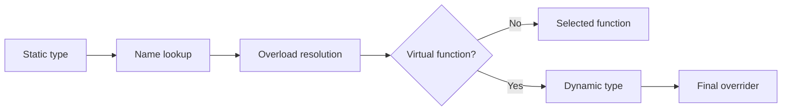

<TLDR>
  <TLDRCell label="what">
    A <Term id="virtual-function">virtual function</Term> lets a base reference or pointer call the final overrider selected from an object's dynamic type, enabling subtype polymorphism.
  </TLDRCell>
  <TLDRCell label="trap">
    One missing `const` can prevent an override; a non-virtual destructor, object slicing, or a virtual call during construction can also defeat the expected polymorphic behavior.
  </TLDRCell>
  <TLDRCell label="fix">
    Mark derived implementations `override`, use a public virtual destructor for polymorphic ownership, and preserve dynamic types with references or smart pointers.
  </TLDRCell>
</TLDR>

## What it is and why it exists

A <Term id="virtual-function">virtual function</Term> is a non-static member function declared `virtual` in a base class. A derived class can provide a matching override. When code calls the function through a base reference or pointer, the runtime selects a function body from the complete object's dynamic type.

This solves the problem where a caller knows only a common interface but behavior depends on the actual object. An alert system, for example, can store different `AlertSink` objects and call one `send()` interface without a central branch that lists every console, file, and network implementation.

This capability is <Term id="subtype-polymorphism">subtype polymorphism</Term>. The static type controls which members are visible and which overloads participate in resolution; the dynamic type selects an implementation only after a virtual function has been chosen. Many override bugs come from treating these two stages as one.

Introduce virtual functions only when behavior really must vary at runtime. They fit heterogeneous object collections and library extension points whose implementations aren't all known to the caller. When the set of types is closed and known at compile time, `std::variant`, templates, or ordinary composition may state the constraints more clearly.

Virtual functions don't give an interface correct ownership, lifetime, or substitution semantics automatically. The base must still define inputs, results, errors, and destruction, and derived classes must preserve that contract. Successful dispatch means the language found a function body; it doesn't mean the hierarchy is well designed.

## How it works

An expression's static type comes from declarations and type deduction. A complete object's dynamic type is the most-derived type that was actually constructed. If a `JsonFormatter` object binds to `const Formatter&`, the reference's static type is `Formatter`, while the object's dynamic type remains `JsonFormatter`.

The compiler first performs name lookup and overload resolution. If the selected member isn't virtual, that stage fixes the call. If it is virtual and the call isn't explicitly qualified, the runtime uses the dynamic type to find the <Term id="final-overrider">final overrider</Term>.



The base writes `virtual` only on the first declaration; virtuality continues down the derived chain. A derived class should write `override` so the compiler checks the parameters, `const`, reference qualifiers, return type, and related rules. `final` prevents a deeper class from overriding that function, or prevents further derivation when it appears on a class declaration.

A <Term id="pure-virtual-function">pure virtual function</Term> ends its declaration with `= 0`. A class with a pure virtual function that has no concrete final overrider is an <Term id="abstract-class">abstract class</Term> and can't be instantiated directly. A derived class becomes concrete only after it supplies every required operation.

Virtual dispatch preserves a dynamic type; it doesn't preserve data that has already been discarded. Copying a derived object into a base value causes <Term id="object-slicing">object slicing</Term>: the new object contains only the base subobject, and its dynamic type is the base. A later virtual call can't recover the lost derived portion.

If an interface permits owning and deleting a derived object through a base pointer, the base needs a public <Term id="virtual-destructor">virtual destructor</Term>. Destruction then enters the most-derived destructor before destroying base parts in order. Deleting through a public non-virtual base destructor has <Term id="undefined-behavior">undefined behavior</Term>.

## Examples

These three programs show virtual versus non-virtual calls, polymorphic ownership through an abstract interface, and restricted dispatch during construction and destruction. Each was compiled and run locally with GCC 13.3 using `-std=c++23 -Wall -Wextra -Wpedantic -Werror`; the transcripts are the actual output.

### Dynamic and static members

`render()` is virtual; `category()` isn't. `print_order()` receives only a `Formatter` reference, so the two members behave differently at the same call site.

<Depth level="quick">

```cpp title="dispatch.cpp"
#include <iostream>
#include <string>

class Formatter {
public:
    virtual std::string render(int order_id) const {
        return "text:" + std::to_string(order_id);
    }

    std::string category() const { return "formatter"; }
    virtual ~Formatter() = default;
};

class JsonFormatter final : public Formatter {
public:
    std::string render(int order_id) const override {
        return "{\"order\":" + std::to_string(order_id) + "}";
    }

    std::string category() const { return "json"; }
};

void print_order(const Formatter& formatter) {
    std::cout << formatter.category() << '\n';
    std::cout << formatter.render(7) << '\n';
}

int main() {
    JsonFormatter formatter;
    print_order(formatter);
    std::cout << formatter.category() << '\n';
}
```

```text
formatter
{"order":7}
json
```

<TryToBreak items={['change print_order from a reference parameter to a value parameter', 'remove const from the derived render declaration', 'add another Formatter-derived class']} />

</Depth>

`formatter.category()` is selected from the expression's static type, `JsonFormatter`, in `main()`, so it prints `json`. Inside `print_order()`, the non-virtual `category()` is selected from the static type `Formatter` and prints `formatter`.

Overload resolution for `render()` also starts from the `Formatter` interface, but this member is virtual. The object's dynamic type is `JsonFormatter`, so execution reaches the implementation marked `override` and prints the JSON text.

### Pure virtual interface and ownership

`AlertSink` specifies behavior without providing a default `send()`. The container owns different concrete objects through `std::unique_ptr<AlertSink>`, so the base destructor must be public and virtual.

```cpp title="abstract_sinks.cpp"
#include <iostream>
#include <memory>
#include <string>
#include <utility>
#include <vector>

class AlertSink {
public:
    virtual void send(const std::string& message) = 0;
    virtual ~AlertSink() = default;
};

class ConsoleSink final : public AlertSink {
public:
    explicit ConsoleSink(std::string prefix) : prefix_(std::move(prefix)) {}

    void send(const std::string& message) override {
        std::cout << prefix_ << message << '\n';
    }

private:
    std::string prefix_;
};

class CountingSink final : public AlertSink {
public:
    void send(const std::string& message) override {
        std::cout << "count=" << ++count_ << " message=" << message << '\n';
    }

private:
    int count_ = 0;
};

int main() {
    std::vector<std::unique_ptr<AlertSink>> sinks;
    sinks.push_back(std::make_unique<ConsoleSink>("[ops] "));
    sinks.push_back(std::make_unique<CountingSink>());

    for (const auto& sink : sinks) {
        sink->send("disk 95%");
    }
}
```

```text
[ops] disk 95%
count=1 message=disk 95%
```

Every container element has the same static interface, `AlertSink`, but each pointed-to object has a different dynamic type. The loop needs no `if` or cast: each `send()` call reaches the right final overrider.

When `main()` exits, each `unique_ptr<AlertSink>` deletes through a base pointer. Virtual destruction ensures the `ConsoleSink` or `CountingSink` destruction runs before the `AlertSink` part is destroyed. That ownership contract belongs in the interface even though these derived classes don't currently declare custom destructors.

### Dispatch during construction and destruction

While a layer is being constructed or destroyed, a virtual call doesn't enter a more-derived part whose lifetime hasn't begun or has already ended. Both the `Stage` constructor and destructor below call `report()`, but both calls stay in `Stage::report()`.

```cpp title="construction_dispatch.cpp"
#include <iostream>

class Stage {
public:
    Stage() {
        std::cout << "Stage ctor: ";
        report();
    }

    virtual void report() const {
        std::cout << "Stage::report\n";
    }

    virtual ~Stage() {
        std::cout << "Stage dtor: ";
        report();
    }
};

class Pipeline final : public Stage {
public:
    Pipeline() {
        std::cout << "Pipeline ctor: ";
        report();
    }

    void report() const override {
        std::cout << "Pipeline::report ready=" << std::boolalpha << ready_ << '\n';
    }

    ~Pipeline() override {
        std::cout << "Pipeline dtor: ";
        report();
    }

private:
    bool ready_ = true;
};

int main() {
    Pipeline pipeline;
    std::cout << "main: ";
    pipeline.report();
}
```

```text
Stage ctor: Stage::report
Pipeline ctor: Pipeline::report ready=true
main: Pipeline::report ready=true
Pipeline dtor: Pipeline::report ready=true
Stage dtor: Stage::report
```

While the `Stage` constructor runs, the `Pipeline` part hasn't begun its lifetime, so the first line can't read `ready_`. Once execution enters the `Pipeline` constructor body, the member has been initialized and the call can reach `Pipeline::report()`.

Destruction reverses the sequence. The derived part still exists while the `Pipeline` destructor body runs. By the time control enters the `Stage` destructor, the derived part's lifetime has ended and dispatch stops at `Stage`.

## Pitfalls

### An apparent override that is a new overload

> [!PITFALL]
> The base declares `virtual void save() const`, but generated code writes `void save()`. The missing `const` makes this a different function. Without `override`, the code may compile while calls through the base interface still use the old implementation.

**Fix:** mark every derived implementation `override` and treat a compilation failure as evidence of an interface mismatch. Compare parameter types, `const`, reference qualifiers, and covariant returns; don't repeat `virtual` as a substitute for checking intent.

### Base ownership with a non-virtual destructor

> [!PITFALL]
> A factory returns `std::unique_ptr<Base>`, but `Base::~Base()` is public and non-virtual. A smart pointer can't repair the class contract: it still deletes the derived object through `Base*`, which has undefined behavior.

**Fix:** use a public virtual destructor when polymorphic deletion is allowed. If deletion through the base is deliberately forbidden, use a protected non-virtual destructor and make ownership APIs return a type that expresses the real deletion strategy.

### Slicing at a value boundary

> [!PITFALL]
> A parameter, return value, data member, or `std::vector<Base>` that stores a polymorphic base by value slices the derived part during copying. Later virtual calls target the new `Base` object and can't recover its former dynamic type.

**Fix:** use `Base&` or `const Base&` for non-owning calls and usually `std::unique_ptr<Base>` for heterogeneous ownership. When polymorphic value semantics are required, define a deliberate `clone()` contract or use a closed `std::variant` representation.

### Depending on a constructor to call a derived override

> [!PITFALL]
> A base constructor calls virtual `configure()` and expects the derived class to populate state. The call doesn't dispatch to the derived implementation. If the base declares that function pure virtual and makes a virtual call to it, the program can enter undefined behavior.

**Fix:** let each constructor establish invariants that its own class can guarantee. If an overridable step needs a complete object, use a factory that calls it after construction, or pass the needed data to the base as ordinary constructor arguments.

### Mixing virtual functions with different defaults

> [!PITFALL]
> The function body is chosen from the dynamic type, but a default argument comes from the call expression's static type. Calls through `Base&` and `Derived&` can enter the same override with different default values, making results depend on the call-site type.

**Fix:** don't change default arguments in derived virtual functions. Put the default in a non-virtual base entry point that calls a virtual core without defaults, or require callers to pass the value explicitly.

## In the AI era

**What generated code gets wrong here**

Models often generate virtual business operations in a base while leaving its public destructor non-virtual, then return `std::unique_ptr<Base>` from a factory. They also omit a trailing `const` or change a reference qualifier in a derived function and leave out `override`; tests that call the derived object directly pass, while calls through the base still run the old implementation. Other recurring failures include storing `Base` by value and slicing it, or calling a virtual initialization hook from a base constructor under the false assumption that derived members are ready.

**Ask your AI to check**

- List each base virtual declaration and every intended override; compare parameters, `const`, reference qualifiers, return type, `override`, and `final` field by field.
- Trace ownership through every `Base*`, `std::unique_ptr<Base>`, and factory return, and identify the static type through which deletion finally occurs.
- Mark every virtual call in a constructor, destructor, or explicitly qualified expression, and state the final overrider that will actually be selected.

**Review checklist**

- Run contract tests through a base reference or pointer; direct derived-object calls aren't enough.
- Search for polymorphic bases used by value in parameters, return values, members, and container element types.
- Check whether default arguments, object lifetimes, or destruction paths depend on a call site's static type.

**Prompt vocabulary**

Use the exact terms `virtual function`, `virtual dispatch`, `dynamic type`, `final overrider`, `pure virtual function`, `abstract class`, `object slicing`, `virtual destructor`, and `qualified call`. Ask for an override-signature table, an ownership/destruction path, and a construction/destruction dispatch timeline. "Is this polymorphism safe?" is too vague to produce a verifiable answer.

<Depth level="deep">

## Final overriders and override rules

At each virtual call site, name lookup and overload resolution first choose a member declaration from the static type. The dynamic type participates only when that declaration is virtual. The final overrider is the override left along the relevant inheritance path in the most-derived class; if a class has no unique final overrider for a virtual function, the class definition is ill-formed.

An override needs a matching parameter list and matching `const`, `volatile`, and reference qualifiers. The return type is usually the same, though a pointer or reference to a class can use a permitted covariant return. `override` doesn't create the relationship; it requires the compiler to prove that the relationship already exists.

Access control doesn't decide whether a function overrides. A derived class can override a `private virtual` function in its base even though it can't name that private base member directly. This rule makes the non-virtual interface pattern possible: a public non-virtual entry point controls the flow while a private virtual function supplies the extension point.

Name hiding isn't overriding either. Declaring a same-named function in a derived class can hide other base overloads from ordinary lookup. `using Base::operation` can reintroduce the overload set, but the complete function declaration still determines whether an override exists. Enable compiler warnings as well as using `override`; they catch different classes of mistakes.

### Default arguments and qualified calls

Default arguments aren't part of virtual dispatch. The compiler fills a missing argument from the static declaration visible at the call site, and the runtime then chooses the body. Different defaults in a base and derived class therefore create subtle mixed behavior.

Explicitly qualifying a member name suppresses virtual dispatch. Even when `object` has a derived dynamic type, `object.Base::render()` calls `Base::render()` directly. A derived implementation can use this form to reuse a base implementation, but reviewers must recognize it as a deliberate bypass of dispatch.

A pure virtual function may still have an out-of-class definition, but its class remains abstract and a derived class still needs an override to become concrete. A derived function can enter that definition with a qualified call. A pure virtual destructor must have a definition because the base destructor phase still runs when a concrete derived object is destroyed.

## Construction, destruction, and lifetime

Constructing a derived object starts with its base parts, followed by members and the derived part. While a given constructor runs, virtual calls on that object use final overriders in the current construction layer or its bases. They don't enter a more-derived part whose lifetime hasn't started.

The rule is symmetric during destruction: the most-derived destructor body runs first, followed by members and bases layer by layer. Once control enters a base destructor, more-derived parts have ended their lifetimes, so virtual calls don't return to them. This restriction prevents access to unconstructed or destroyed state, but it also makes virtual initialization and cleanup hooks easy to misunderstand.

During construction or destruction, a virtual call on the current object that reaches a pure virtual function has undefined behavior. A diagnostic isn't guaranteed along every indirect call path, so "the linker will catch it" isn't a safety mechanism. Factories, explicit post-construction steps, and RAII owned by members express cross-layer lifetime work more reliably.

## Language guarantees and common implementations

C++ specifies the observable result of virtual dispatch, but it doesn't prescribe a virtual function table, the location of a virtual-table pointer, or a table layout. Mainstream ABIs commonly use a table per class and a hidden pointer in each object. That is an implementation strategy, not a portable object-representation contract.

Don't convert objects to `void***` to read table slots, and don't present `sizeof` differences as cross-platform constants. Such probes can violate the object model or depend on the compiler, target architecture, and ABI. Debugger views, compiler layout reports, and disassembly are better tools for implementation-level diagnosis.

A virtual call is commonly implemented as an indirect call, but a compiler can devirtualize and inline when it proves the dynamic type. `final` can make that proof easier; it doesn't guarantee an optimization and can't replace a benchmark. Without measurements matched to the compiler, optimization settings, hardware, and real workload, don't attach a fixed cost to virtual dispatch.

Publishing a C++ class hierarchy across a shared-library or plugin boundary makes ABI policy part of the interface. Adding, removing, or reordering virtual functions can change a particular ABI's table layout. Source compatibility isn't binary compatibility; providers must define their compiler, standard library, build settings, version policy, and recompilation boundary, or use a stable C interface with opaque handles.

## Testing the dispatch contract

Tests should exercise the interface in the same form production code uses it. Calling `Derived::operation()` directly proves the derived function works, but it doesn't prove that the base signature matches, that dynamic dispatch reaches it, or that ownership destroys the complete object.

Use a small call matrix to expose those boundaries:

| Test expression | What it verifies |
| --- | --- |
| `derived.operation()` | Direct derived behavior |
| `base_ref.operation()` | Override matching and virtual dispatch |
| `base_ptr->operation()` | Pointer dispatch and null preconditions |
| `Base value = derived` | The deliberate or accidental slicing result |
| destruction through `unique_ptr<Base>` | The polymorphic destruction contract |

Contract tests should run against every concrete implementation through `Base&` or `const Base&`. Give the implementations different observable results so a fallback to the base can't hide. Also test arguments at the base contract's boundaries; an override that narrows accepted input violates substitutability even when dispatch itself is correct.

Compile-time checks carry part of the load. Write `override` on every intended override, enable warnings for hidden virtual functions, and use `static_assert(std::has_virtual_destructor_v<Base>)` when a generic owner requires polymorphic deletion. Such checks document assumptions close to the interface and fail before a missed dispatch reaches runtime.

Destruction tests shouldn't depend only on a printed destructor name. Give a derived test object an RAII member whose observable cleanup can be checked, destroy it through the real owning base type, and run AddressSanitizer or UndefinedBehaviorSanitizer on exercised paths. Sanitizers don't prove the design sound, but they can reveal lifetime failures that ordinary output misses.

For construction and destruction hooks, record the order explicitly. A useful regression test distinguishes calls made in the base constructor, derived constructor body, normal lifetime, derived destructor body, and base destructor. The expected sequence should name the selected implementation at each stage.

Review a new derived class in this order:

1. Compare each intended override with the exact base declaration.
2. Run common contract cases through a base reference.
3. Exercise the ownership and destruction route used by callers.
4. Check construction, destruction, default arguments, and qualified calls for static-type surprises.

This sequence separates language-mechanism failures from behavioral contract failures. A function can dispatch to the intended override and still weaken a postcondition, retain an object too long, or return a reference whose lifetime is too short.

</Depth>

<Checkpoint id="cpp/virtual-functions" />

## Further reading

- [C++ working draft: virtual functions](https://eel.is/c++draft/class.virtual)
- [C++ working draft: abstract classes](https://eel.is/c++draft/class.abstract)
- [C++ working draft: destructors](https://eel.is/c++draft/class.dtor)
- [C++ working draft: construction and destruction](https://eel.is/c++draft/class.cdtor)
- [C++ Core Guidelines: C.128 virtual-function declarations](https://isocpp.github.io/CppCoreGuidelines/CppCoreGuidelines#c128-virtual-functions-should-specify-exactly-one-of-virtual-override-or-final)
