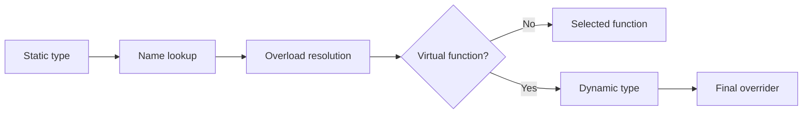

<TLDR>
  <TLDRCell label="what">
    <Term id="virtual-function">虚函数（virtual function）</Term>让基类引用或指针按对象的动态类型调用最终覆盖函数，从而实现子类型多态。
  </TLDRCell>
  <TLDRCell label="trap">
    少写一个`const`就可能没有真正重写；非虚析构、对象切片和构造函数中的虚调用还会破坏预期的多态行为。
  </TLDRCell>
  <TLDRCell label="fix">
    派生实现使用`override`，多态所有权使用公有虚析构函数，并通过引用或智能指针保留动态类型。
  </TLDRCell>
</TLDR>

## 是什么，为什么存在

<Term id="virtual-function">虚函数（virtual function）</Term>是基类声明为`virtual`的非静态成员函数。派生类可以提供与它匹配的重写实现；代码通过基类引用或指针调用时，运行时会根据完整对象的动态类型选择函数体。

这解决了“调用者只知道共同接口，但行为取决于实际对象”的问题。例如，告警系统可以保存不同的`AlertSink`，只调用统一的`send()`，而不必让中央分支列出控制台、文件和网络等每一种具体类型。

这种能力叫作<Term id="subtype-polymorphism">子类型多态（subtype polymorphism）</Term>。静态类型决定哪些成员可见以及哪些重载参与解析；动态类型只在已经选中虚函数后决定执行哪个最终覆盖函数。把这两个阶段混成一个，是许多重写错误的根源。

只有确实需要运行时替换行为时才应引入虚函数。对象集合需要容纳调用方事先不知道的实现，或库向使用方开放扩展点时，它很合适；类型集合封闭且编译期已知时，`std::variant`、模板或普通组合有时能把约束表达得更清楚。

虚函数不会自动赋予接口正确的所有权、生命周期或替换语义。基类仍需定义输入、结果、错误和析构契约，派生类也必须保持这些契约。能成功分派只说明语言找到了函数体，不说明这个层次设计合理。

## 工作原理

表达式的静态类型来自声明和类型推导，完整对象的动态类型则是对象实际构造出的最派生类型。若`JsonFormatter`对象绑定到`const Formatter&`，引用的静态类型是`Formatter`，对象的动态类型仍是`JsonFormatter`。

编译器先执行名字查找与重载决议。若选中的成员不是虚函数，调用在这个阶段已经确定；若它是虚函数，而且调用没有被显式限定，运行时再从动态类型找到<Term id="final-overrider">最终覆盖函数（final overrider）</Term>。



基类只需在首次声明处写`virtual`，虚属性会沿派生链保留。派生类最好写`override`，让编译器验证形参、`const`、引用限定符和返回类型等规则；`final`则禁止更深层派生类再次重写该函数，也可以放在类声明上禁止继续派生。

把函数声明为<Term id="pure-virtual-function">纯虚函数（pure virtual function）</Term>时，在声明末尾写`= 0`。含有尚未得到具体最终覆盖函数的纯虚函数的类是<Term id="abstract-class">抽象类（abstract class）</Term>，不能直接实例化；派生类只有补全所有纯虚操作后才能成为具体类。

虚分派保留的是动态类型，不是被切掉的数据。把派生对象复制进基类值会产生<Term id="object-slicing">对象切片（object slicing）</Term>：新对象只有基类子对象，其动态类型就是基类。之后再调用虚函数也无法恢复已经丢失的派生部分。

若接口允许通过基类指针拥有并删除派生对象，基类需要公有<Term id="virtual-destructor">虚析构函数（virtual destructor）</Term>。这样销毁会先进入最派生类析构函数，再按顺序销毁基类部分；公有非虚析构会让这种删除产生<Term id="undefined-behavior">未定义行为（undefined behavior）</Term>。

## 示例

下面三个程序依次展示虚分派、抽象接口的多态所有权，以及构造与析构期间受限的分派。它们都使用本地GCC 13.3，以`-std=c++23 -Wall -Wextra -Wpedantic -Werror`编译并执行；输出是实际运行结果。

### 动态成员与静态成员

`render()`是虚函数，`category()`不是。`print_order()`只接收`Formatter`引用，因此两个成员在同一调用点表现不同。

<Depth level="quick">

```cpp title="dispatch.cpp"
#include <iostream>
#include <string>

class Formatter {
public:
    virtual std::string render(int order_id) const {
        return "text:" + std::to_string(order_id);
    }

    std::string category() const { return "formatter"; }
    virtual ~Formatter() = default;
};

class JsonFormatter final : public Formatter {
public:
    std::string render(int order_id) const override {
        return "{\"order\":" + std::to_string(order_id) + "}";
    }

    std::string category() const { return "json"; }
};

void print_order(const Formatter& formatter) {
    std::cout << formatter.category() << '\n';
    std::cout << formatter.render(7) << '\n';
}

int main() {
    JsonFormatter formatter;
    print_order(formatter);
    std::cout << formatter.category() << '\n';
}
```

```text
formatter
{"order":7}
json
```

<TryToBreak items={['把print_order的引用形参改成按值形参', '从render的派生声明中删除const', '增加另一个Formatter派生类']} />

</Depth>

`formatter.category()`在`main()`中按表达式的静态类型`JsonFormatter`选择函数，所以输出`json`。进入`print_order()`后，非虚`category()`按静态类型`Formatter`选择，输出`formatter`。

`render()`的重载决议同样从`Formatter`接口开始，但它是虚函数。对象的动态类型是`JsonFormatter`，因此最终执行带有`override`的实现，输出JSON文本。

### 纯虚接口与多态所有权

`AlertSink`只规定行为，不提供`send()`的默认实现。容器通过`std::unique_ptr<AlertSink>`拥有不同的具体对象，因此基类析构函数必须是公有虚函数。

```cpp title="abstract_sinks.cpp"
#include <iostream>
#include <memory>
#include <string>
#include <utility>
#include <vector>

class AlertSink {
public:
    virtual void send(const std::string& message) = 0;
    virtual ~AlertSink() = default;
};

class ConsoleSink final : public AlertSink {
public:
    explicit ConsoleSink(std::string prefix) : prefix_(std::move(prefix)) {}

    void send(const std::string& message) override {
        std::cout << prefix_ << message << '\n';
    }

private:
    std::string prefix_;
};

class CountingSink final : public AlertSink {
public:
    void send(const std::string& message) override {
        std::cout << "count=" << ++count_ << " message=" << message << '\n';
    }

private:
    int count_ = 0;
};

int main() {
    std::vector<std::unique_ptr<AlertSink>> sinks;
    sinks.push_back(std::make_unique<ConsoleSink>("[ops] "));
    sinks.push_back(std::make_unique<CountingSink>());

    for (const auto& sink : sinks) {
        sink->send("disk 95%");
    }
}
```

```text
[ops] disk 95%
count=1 message=disk 95%
```

容器元素的静态接口都是`AlertSink`，每个指针所指对象的动态类型却不同。循环不需要`if`或类型转换，两个`send()`调用各自进入正确的最终覆盖函数。

离开`main()`时，`unique_ptr<AlertSink>`通过基类指针删除对象。虚析构保证`ConsoleSink`或`CountingSink`的析构过程先发生，再销毁`AlertSink`部分；即使当前派生类没有手写析构函数，这仍是接口必须写明的所有权契约。

### 构造与析构期间的分派

构造或析构某一层基类时，虚调用不会进入更派生、尚未开始或已经结束生命周期的部分。下面的`Stage`构造函数和析构函数都调用`report()`，但两次都只会进入`Stage::report()`。

```cpp title="construction_dispatch.cpp"
#include <iostream>

class Stage {
public:
    Stage() {
        std::cout << "Stage ctor: ";
        report();
    }

    virtual void report() const {
        std::cout << "Stage::report\n";
    }

    virtual ~Stage() {
        std::cout << "Stage dtor: ";
        report();
    }
};

class Pipeline final : public Stage {
public:
    Pipeline() {
        std::cout << "Pipeline ctor: ";
        report();
    }

    void report() const override {
        std::cout << "Pipeline::report ready=" << std::boolalpha << ready_ << '\n';
    }

    ~Pipeline() override {
        std::cout << "Pipeline dtor: ";
        report();
    }

private:
    bool ready_ = true;
};

int main() {
    Pipeline pipeline;
    std::cout << "main: ";
    pipeline.report();
}
```

```text
Stage ctor: Stage::report
Pipeline ctor: Pipeline::report ready=true
main: Pipeline::report ready=true
Pipeline dtor: Pipeline::report ready=true
Stage dtor: Stage::report
```

执行`Stage`构造函数时，`Pipeline`部分尚未开始生命周期，所以首行不能读取`ready_`。进入`Pipeline`构造函数体后，成员已经初始化，调用才会到达`Pipeline::report()`。

析构顺序相反。`Pipeline`析构函数体运行时派生部分仍然存在；进入`Stage`析构函数后，派生部分的生命周期已经结束，分派便停在`Stage`。

## 陷阱

### 看似重写，实际新增重载

> [!PITFALL]
> 基类声明`virtual void save() const`，生成代码却写成`void save()`。少掉的`const`使它成为另一个函数；若没有`override`，代码可能编译成功，却仍通过基类接口调用旧实现。

**修复方法：** 每个派生实现都写`override`，并把编译失败当作接口不匹配的证据。核对形参类型、`const`、引用限定符和协变返回类型，不要靠重复书写`virtual`表达意图。

### 经基类所有，却使用非虚析构

> [!PITFALL]
> 工厂返回`std::unique_ptr<Base>`，但`Base::~Base()`是公有非虚函数。智能指针并不能修补类契约；它最终仍通过`Base*`删除派生对象，行为未定义。

**修复方法：** 允许多态删除时使用公有虚析构函数。若设计明确禁止通过基类删除，则使用受保护非虚析构函数，并让所有权接口返回能表达真实删除方式的类型。

### 在值边界发生对象切片

> [!PITFALL]
> 参数、返回值、数据成员或`std::vector<Base>`按值保存多态基类时，派生部分会在复制时被切掉。之后的虚调用针对新建的`Base`对象，不会恢复原来的动态类型。

**修复方法：** 非拥有调用使用`Base&`或`const Base&`，异构所有权通常使用`std::unique_ptr<Base>`。确实需要多态值语义时，应明确设计`clone()`契约或选择封闭的`std::variant`表示。

### 依赖构造函数调用派生实现

> [!PITFALL]
> 基类构造函数调用虚`configure()`，期望派生类填充状态。调用不会分派到派生实现；若基类把该函数声明为纯虚函数并进行虚调用，还可能直接进入未定义行为。

**修复方法：** 构造函数只建立当前类能独立保证的不变量。需要完整对象后的可替换步骤时，使用工厂在构造结束后调用，或把所需数据作为普通构造参数交给基类。

### 混用虚函数与不同默认实参

> [!PITFALL]
> 函数体按动态类型选择，默认实参却按调用表达式的静态类型取得。`Base&`和`Derived&`调用同一个重写函数时，可能传入不同默认值，使结果取决于调用点类型。

**修复方法：** 虚函数不要在派生层改变默认实参。把默认值放进基类的非虚入口，再由它调用不带默认实参的虚核心，或要求调用方始终显式传值。

<Depth level="deep">

## 最终覆盖函数与重写规则

在每个虚函数调用点，名字查找和重载决议先依据静态类型选择一个成员声明。只有这个声明是虚函数时，动态类型才参与下一步；最终覆盖函数是最派生类中沿相关继承路径留下的那个覆盖实现。一个类若对同一虚函数没有唯一最终覆盖函数，类定义就是错误的。

重写要求成员函数具有匹配的形参列表，以及匹配的`const`、`volatile`和引用限定符。返回类型通常相同，但指向类的指针或引用可以使用满足规则的协变返回类型。`override`不创造重写关系，只要求编译器证明这层关系已经存在。

访问控制不决定能否重写。派生类可以重写基类的`private virtual`函数，尽管不能通过名称直接调用那个私有基类成员；这让公有非虚入口控制流程、私有虚函数提供扩展点的非虚接口模式成为可能。

名字隐藏也不等于重写。派生类声明同名函数后，可能让基类其他重载在普通查找中不可见；`using Base::operation`可以重新引入重载集，但最终是否重写仍由完整函数声明决定。编译器警告和`override`应同时启用，因为它们捕获的错误范围不同。

### 默认实参与限定调用

默认实参不属于虚分派。编译器从调用点可见的静态声明填入缺失参数，再由运行时选择函数体，因此基类和派生类写不同默认值会得到难以察觉的混合行为。

显式限定成员名会抑制虚分派。即使`object`的动态类型是派生类，`object.Base::render()`也直接调用`Base::render()`；派生实现可用这种写法复用基类实现，但代码审查必须把它识别为有意绕过分派。

纯虚函数也可以在类外提供定义，但类仍然是抽象类，派生类仍需提供覆盖实现才能具体化。派生函数可以用限定调用显式进入该定义。纯虚析构函数则必须有定义，因为销毁具体派生对象时仍会执行基类析构阶段。

## 构造、析构与生命周期

构造派生对象时，先构造基类部分，再构造成员和派生部分。某个构造函数运行期间，对该对象发出的虚调用只会使用当前构造层或其基类中的最终覆盖函数，不会进入尚未开始生命周期的更派生部分。

析构时规则对称：先运行最派生析构函数体，再逐层销毁成员和基类。当控制已经进入某个基类析构函数，更派生部分的生命周期已经结束，虚调用不会回到那里。这个限制避免函数读取尚未构造或已经销毁的数据，但也使虚初始化钩子与虚清理钩子容易产生错误期待。

在构造或析构期间，若对当前对象进行虚调用并命中纯虚函数，行为未定义。诊断并非在所有间接调用路径上都必然出现，所以不能把“链接器会报错”当作安全机制。工厂、显式初始化步骤和由成员对象承担的RAII更适合表达跨层生命周期工作。

## 语言保证与常见实现

C++语言规定可观察到的虚分派结果，但不规定虚函数表（vtable）、虚表指针（vptr）的位置或具体布局。主流ABI通常用每类一组表和对象中的隐藏指针实现分派，这是一种实现策略，不是可移植的对象表示契约。

因此，不应把对象转换成`void***`读取虚表槽位，也不应把`sizeof`的差异写成跨平台常数。这类探测可能违反对象模型或依赖编译器、目标架构和ABI；调试器、编译器布局报告和反汇编更适合用于实现层诊断。

虚调用常通过间接调用实现，但编译器若能证明动态类型，仍可去虚拟化并内联。`final`可以增加这种证明机会，却不保证某项优化，也不能替代基准测试。没有与目标编译器、优化选项、硬件和真实负载相匹配的测量，就不应给虚分派附上固定开销数字。

跨共享库或插件边界发布C++类层次时，新增、删除或重排虚函数可能改变特定ABI的虚表布局。源码兼容不等于二进制兼容；接口提供方需要明确编译器、标准库、构建选项、版本策略和重新编译边界，或改用稳定的C接口与不透明句柄。

## 测试分派契约

测试应采用生产代码实际使用接口的方式。直接调用`Derived::operation()`只能证明派生函数自身可用，不能证明基类签名匹配、动态分派确实到达它，也不能证明所有权路径会销毁完整对象。

可以用一个小型调用矩阵暴露这些边界：

| 测试表达式 | 验证内容 |
| --- | --- |
| `derived.operation()` | 直接调用派生行为 |
| `base_ref.operation()` | 重写匹配与虚分派 |
| `base_ptr->operation()` | 指针分派与空指针前置条件 |
| `Base value = derived` | 有意或意外切片后的结果 |
| 通过`unique_ptr<Base>`销毁 | 多态销毁契约 |

应通过`Base&`或`const Base&`对每个具体实现运行同一组契约测试。不同实现要给出可区分的可观察结果，避免退回基类实现后仍碰巧通过。还要测试基类契约的参数边界；即使分派正确，拒绝基类本来接受的输入仍会破坏可替换性。

编译期检查可以承担一部分工作。每个预期重写都写`override`，开启隐藏虚函数警告；泛型所有者要求多态删除时，可用`static_assert(std::has_virtual_destructor_v<Base>)`固化约束。这些检查会在缺失分派进入运行时前失败，也把假设留在接口附近。

析构测试不应只依赖打印析构函数名称。可以让派生测试对象拥有一个可观察清理结果的RAII成员，再通过真实的基类所有权类型销毁它，并在已覆盖路径上运行AddressSanitizer或UndefinedBehaviorSanitizer。消毒器不能证明设计正确，但能暴露普通输出遗漏的生命周期错误。

对于构造与析构钩子，应明确记录顺序。一项有效的回归测试会区分基类构造函数、派生构造函数体、正常生命周期、派生析构函数体和基类析构函数中的调用，并为每个阶段写出预期选择的实现。

可以按以下顺序审查新的派生类：

1. 把每个预期重写与基类的完整声明逐项比较。
2. 通过基类引用运行公共契约用例。
3. 执行调用方实际采用的所有权与销毁路径。
4. 检查构造、析构、默认实参与限定调用中的静态类型意外。

这个顺序把语言机制错误与行为契约错误分开。函数可能正确分派到预期实现，却仍然削弱后置条件、让对象存活过久，或返回生命周期太短的引用。

</Depth>

<Checkpoint id="cpp/virtual-functions" />

## 延伸阅读

- [C++工作草案：虚函数](https://eel.is/c++draft/class.virtual)
- [C++工作草案：抽象类](https://eel.is/c++draft/class.abstract)
- [C++工作草案：析构函数](https://eel.is/c++draft/class.dtor)
- [C++工作草案：构造与析构](https://eel.is/c++draft/class.cdtor)
- [C++ Core Guidelines：C.128虚函数声明](https://isocpp.github.io/CppCoreGuidelines/CppCoreGuidelines#c128-virtual-functions-should-specify-exactly-one-of-virtual-override-or-final)
