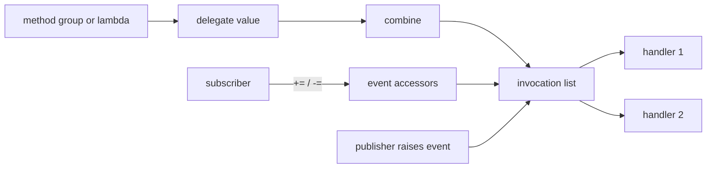

<TLDR>
  <TLDRCell label="what">
    A <Term id="delegate">delegate</Term> is a callable value with typed parameters and return value. An event is a notification member that restricts outside access to a delegate.
  </TLDRCell>
  <TLDRCell label="trap">
    A multicast delegate returns only its last handler's result, and a thrown exception prevents later handlers from running.
  </TLDRCell>
  <TLDRCell label="fix">
    Describe calls with `Func`, `Action`, or a meaningful custom delegate. For notifications, expose an event and define its lifetime, failure, and async policies.
  </TLDRCell>
</TLDR>

## What it is and why it exists

A delegate is a reference type that represents one or more methods with a compatible signature. It lets you assign a method to a variable, pass it as an argument, and invoke it later. Unlike a raw function pointer, a delegate retains its target object and method information, while the C# type system checks its parameters and return value.

You need a delegate when one piece of code knows when to call but shouldn't depend on a specific implementation. A sorter accepts a comparison rule, a retry component accepts an operation, and a LINQ operator accepts a projection or filter function. Each is a <Term id="callback">callback</Term>: the caller supplies behavior for another component to invoke as part of its own flow.

A method name in a delegate context forms a <Term id="method-group">method group</Term>. The compiler uses the target delegate's signature to select a compatible overload and create the delegate. Lambda expressions and anonymous methods can also create delegates, but a lambda may capture outer variables and introduce extra state and lifetime concerns.

An event stores handlers in a delegate but narrows public access. Outside code can subscribe and unsubscribe with `+=` and `-=`, but it can't replace the entire invocation list or raise the event. A delegate answers "what can be called"; an event answers "who can publish this notification." The `csharp/events` topic covers publisher lifetime, event arguments, and async event design in full.

## How it works

### The signature is the call contract

`public delegate decimal Discount(decimal subtotal);` declares a new delegate type. Any method converted to it must accept one `decimal` and return one `decimal`. A delegate variable can still be `null`; invoke a non-null delegate with either `discount(value)` or `discount.Invoke(value)`. The two forms have the same semantics.

A custom delegate name can carry domain meaning, but framework generic types cover most local callbacks. `Action<T1, ...>` represents a method returning `void`; the last type argument of `Func<T1, ..., TResult>` is the return value; and `Predicate<T>` always returns `bool`. There is no `Func<void>`; use `Action` when there is no result.

A delegate storing a static method needs only the method information. A delegate storing an instance method also retains the target object, and invoking it is equivalent to calling that method on the object. When a lambda captures a local variable, the generated handler retains the captured state, so this small function may outlive its original local scope.

### Combination creates an invocation list

`+` or `+=` combines compatible delegates into a <Term id="multicast-delegate">multicast delegate</Term>. Delegates are immutable, so combination doesn't alter the original object; it produces a new <Term id="invocation-list">invocation list</Term>. Direct invocation runs its entries synchronously in the order they were added.

`-` or `-=` removes the last matching entry when searching from the end of the invocation list. With no match, the original list remains unchanged. The same handler can appear more than once, and one removal eliminates only one match. Save a lambda's delegate instance if you need to remove it later.

The path looks like this. An ordinary delegate lets its holder replace or invoke the list. An event exposes addition and removal to subscribers while leaving invocation with the publisher.



### An event exposes only the subscription boundary

For a field-like event such as `public event EventHandler<OrderEventArgs>? Placed;`, the compiler provides storage plus `add` and `remove` accessors. Code inside the declaring type can raise it with `Placed?.Invoke(this, args)`. An ordinary outside caller can only subscribe and unsubscribe; it can't assign, clear, or invoke the event.

`EventHandler` represents `void (object? sender, EventArgs e)`, while `EventHandler<TEventArgs>` carries custom event data. They remain ordinary `void` delegates, so raising them runs synchronously on the calling thread by default. The `event` keyword doesn't queue work, switch threads, or isolate exceptions.

## Examples

### Pass a pricing rule as an argument

The first example declares a `Discount` delegate with a domain-specific name. The loyalty rule comes from a method group and the launch rule from a lambda, but both satisfy the same call contract.

<Depth level="quick">

```csharp title="PricingRules.cs"
using System;

public delegate decimal Discount(decimal subtotal);

public static class Program
{
    public static void Main()
    {
        Discount loyalty = LoyaltyDiscount;
        Discount launch = subtotal => Math.Min(subtotal * 0.20m, 30m);

        Console.WriteLine($"loyalty: {Total(120m, loyalty):0.00}");
        Console.WriteLine($"launch: {Total(120m, launch):0.00}");
    }

    private static decimal Total(decimal subtotal, Discount discount)
    {
        decimal reduction = discount(subtotal);
        return subtotal - reduction;
    }

    private static decimal LoyaltyDiscount(decimal subtotal)
    {
        return subtotal >= 100m ? 15m : 0m;
    }
}
```

```text
# not executed here: the .NET SDK and C# compilers are unavailable
```

</Depth>

`Total` doesn't know how to calculate a discount; it knows only the `Discount` signature. The caller can replace the rule without changing the pricing flow. The custom type also prevents accidental use of a delegate with a different meaning but a superficially similar parameter list.

A custom type earns its place when that semantic name appears at an API boundary or across several call sites. For a one-off local transformation, `Func<decimal, decimal>` is usually simpler.

### Choose among `Action`, `Func`, and `Predicate`

The second example uses three built-in delegates for a side effect, transformation, and condition. Their type names already express the return shape, so there is no need to declare three new types containing only boilerplate.

```csharp title="BuiltInDelegates.cs"
using System;
using System.Collections.Generic;

public static class Program
{
    public static void Main()
    {
        var prices = new List<decimal> { 19m, 55m, 120m };
        Predicate<decimal> isLarge = price => price >= 50m;
        Func<decimal, decimal> addTax = price => price * 1.20m;
        Action<decimal> print = price =>
            Console.WriteLine($"total: {price:0.00}");

        foreach (decimal price in prices.FindAll(isLarge))
        {
            print(addTax(price));
        }
    }
}
```

```text
# not executed here: the .NET SDK and C# compilers are unavailable
```

`List<T>.FindAll` expects `Predicate<T>`, so you can't pass an existing `Func<decimal, bool>` variable merely because it has the same signature. A lambda can be converted separately to either type, but already created values of those distinct delegate types aren't implicitly interchangeable.

An asynchronous callback returning `Task` still has a return value, so use `Func<Task>` or `Func<T, Task>`. Converting an async lambda to `Action` produces `async void`, which its caller can't await.

### Combine and remove handlers

The third example saves the identity of `reserve`, adds it twice, and removes it once. The final invocation list still contains one `reserve` entry and runs in addition order.

```csharp title="MulticastHandlers.cs"
using System;

public static class Program
{
    public static void Main()
    {
        Action<string> audit = orderId =>
            Console.WriteLine($"audit {orderId}");
        Action<string> reserve = orderId =>
            Console.WriteLine($"reserve {orderId}");

        Action<string> handlers = audit;
        handlers += reserve;
        handlers += reserve;
        handlers -= reserve;

        Console.WriteLine($"handlers: {handlers.GetInvocationList().Length}");
        handlers("A-17");
    }
}
```

```text
# not executed here: the .NET SDK and C# compilers are unavailable
```

`GetInvocationList()` returns an array in normal invocation order, with each delegate representing exactly one target. It is useful for diagnostics or for a contract that explicitly says "attempt each handler." Ordinary code doesn't need to traverse it merely to invoke a multicast delegate.

This example uses `Action<string>`, so there is no question of combining several return values. If a multicast delegate does return a value, direct invocation still runs each entry, but the call expression receives only the last normally completed entry's result.

### Tighten a public delegate into an event

The final example lets only `OrderBook` raise `Placed`. The caller keeps a named handler and removes it normally. After removal, the second order still completes its business operation but produces no audit line.

```csharp title="OrderEventBoundary.cs"
using System;

public sealed class OrderPlacedEventArgs : EventArgs
{
    public OrderPlacedEventArgs(string orderId, decimal total)
    {
        OrderId = orderId;
        Total = total;
    }

    public string OrderId { get; }
    public decimal Total { get; }
}

public sealed class OrderBook
{
    public event EventHandler<OrderPlacedEventArgs>? Placed;

    public void Place(string orderId, decimal total)
    {
        Console.WriteLine($"placed {orderId}");
        Placed?.Invoke(this, new OrderPlacedEventArgs(orderId, total));
    }
}

public static class Program
{
    public static void Main()
    {
        var orders = new OrderBook();
        EventHandler<OrderPlacedEventArgs> audit = (_, e) =>
            Console.WriteLine($"audit {e.OrderId}: {e.Total:0.00}");

        orders.Placed += audit;
        orders.Place("A-17", 45m);
        orders.Placed -= audit;
        orders.Place("A-18", 20m);
    }
}
```

```text
# not executed here: the .NET SDK and C# compilers are unavailable
```

If `Placed` were a public `EventHandler<OrderPlacedEventArgs>` field, outside code could set it to `null`, overwrite other handlers, or forge a notification. `event` keeps the same handler signature while restricting those operations to the declaring type.

This example covers only the boundary between a delegate and an event. Subscriber retention, exception propagation, custom accessors, cancellable events, and threading rules belong to full event API design; continue with the related events topic for those details.

## Pitfalls

### Treating matching signatures as matching types

> [!PITFALL]
> Two custom delegates remain different named types even when their parameters and return types match exactly. You can't assign their variables directly.
>
> **Fix:** reuse `Func`, `Action`, or `Predicate` when the API needs no domain-specific meaning. Keep custom types for genuinely different contracts, and create the target type explicitly through a fresh lambda or method group instead of hiding the difference behind a cast.

### Unsubscribing an old lambda with a new one

> [!PITFALL]
> `source.Changed -= (_, e) => Handle(e);` usually doesn't remove the handler created by another lambda expression earlier, even when the source text looks identical.
>
> **Fix:** when removal is required, keep the delegate instance in a field or local, or use the same named method. Raise the notification after unsubscription and confirm that the old handler stays silent.

### Capturing a loop variable that keeps changing

> [!PITFALL]
> Generated `for` loops often add lambdas to a list while every lambda captures the same `i`. When called after the loop, they observe the final value of `i`, not each iteration's value.
>
> **Fix:** create `int index = i;` inside the loop body so the lambda captures the iteration's variable, or pass the value to a handler factory. Tests must call every handler after the loop ends.

### Ignoring multicast results and failure

> [!PITFALL]
> A returning multicast delegate gives its caller only the last normally completed return value. If any handler throws, invocation stops and later handlers don't run.
>
> **Fix:** prefer `void` handlers for broadcast notifications. If the contract requires every result or an attempt at every handler, traverse `GetInvocationList()` and define ordering, failure collection, and what happens to partial side effects.

### Putting async work in a synchronous delegate

> [!PITFALL]
> An async lambda converted to `Action` or `EventHandler` becomes `async void`. The caller can't await completion, and exceptions after an `await` don't return through the original call.
>
> **Fix:** use `Func<Task>`, `Func<T, Task>`, or a dedicated `Task`-returning delegate when completion matters. Don't invoke a multicast async delegate once and await only its last returned `Task`; obtain the invocation list and choose sequential awaits or concurrent `Task.WhenAll`.

<Depth level="deep">

## Invocation lists, identity, and variance

### Delegate identity controls removal

Delegates are immutable objects. Assignment copies a reference, while combination and removal produce new delegate values instead of editing existing instances in place. Two non-null delegates are equal only when they have the same runtime delegate type and equal entries in the same invocation-list order.

For ordinary static or instance methods, a single entry is determined by its method and target object. Converting the same named instance method to the same delegate type can therefore match an earlier subscription, while the same method on another object can't. Compiler-generated lambda methods and captured objects make identity unsafe to infer from source appearance, so save any lambda that must later be removed.

Removal searches for the last matching invocation-list segment. Subtracting `A` from `A + B + A` removes the final `A`; subtracting `A + B` from `A + B + A + B` removes the last such segment. Complex list subtraction is hard to review, so event code normally saves and removes handlers one at a time.

`GetInvocationList()` returns an array snapshot of the list at that moment, with one target in each element. Recombining the original delegate later doesn't change that array. Its target objects are still the original objects, however; they haven't been deep-copied.

### Return values and exceptions have no aggregation protocol

When you call a returning multicast delegate, the runtime invokes each list entry and uses the last successfully invoked entry's return value as the expression result. Earlier results aren't collected automatically. `ref` or `out` arguments also keep changing along invocation order, which usually makes a public contract difficult to understand.

Exceptions aren't aggregated automatically either. If an entry throws synchronously, invocation ends at that point and the exception returns directly to the caller. A business rule requiring every attempt must call entries separately and decide which failures to retain; it must also define system state after earlier handlers have already produced side effects.

These rules are one reason events normally return `void`. When a notification reports an already completed fact, its publisher shouldn't depend on several unknown subscribers to calculate one result. If one decision is required, an explicit strategy delegate or method parameter is usually a better fit than an event.

### Generic delegate variance

In `Func<in T, out TResult>`, the input is contravariant and the result is covariant. A site requiring `Func<Dog, Animal>` can use a function that accepts the broader `Animal` and returns the narrower `Dog`: it can handle every `Dog` the caller supplies, and its result is always an `Animal`. `Action<in T>` has only inputs and therefore supports contravariance.

Variance conversions apply to reference types. Value-type arguments don't gain boxing-based variance conversions from these `in` and `out` annotations. A custom generic delegate must mark safe type parameters as `in` or `out` in its declaration to support the same conversions.

Don't confuse generic variance with method-group signature compatibility. The compiler can convert a method with a wider parameter or narrower return directly into a delegate; generic variance converts between compatible generic delegate types that already exist. During review, write down the method signature, source delegate type, and target delegate type separately to check the direction.

### Multicast async delegates need their own protocol

Directly invoking a multicast `Func<Task>` calls each handler in order to obtain its `Task`, but the delegate call returns only the last task. Awaiting that result doesn't prove earlier tasks finished and doesn't reliably observe their exceptions. The code compiles, which makes this bug especially easy to miss in generated code.

The publisher should first use `GetInvocationList()` to obtain single-target delegates, then choose an execution policy. Sequential awaits start the second handler only after the first completes and can stop on failure. Calling every handler first and passing the tasks to `Task.WhenAll` waits concurrently, but the contract must still cover synchronous throws, cancellation, and reporting of multiple failures.

The async protocol must also identify the source of its `CancellationToken`, whether one failure cancels other work, and whether handlers may mutate the same state concurrently. Calling a method `RaiseAsync` doesn't supply those semantics. If the answers are central to a request's result, a direct async method returning a domain result is often clearer than an event-shaped API.

## Choosing a callback boundary

A delegate is the smallest useful boundary when a consumer needs to supply one operation. It keeps the call shape explicit and avoids forcing a one-method implementation class on every caller. That doesn't make a delegate the default for every form of extensibility.

Choose by ownership and by the number of operations that must stay consistent. A callback belongs to the operation that receives it; an event belongs to its publisher; an interface can bind several operations and state into one longer-lived collaborator.

| Need | API shape | Why |
|---|---|---|
| One local operation with a familiar signature | `Func` or `Action` | The type already states inputs and result |
| One operation with domain meaning | Custom delegate | The name and modifiers become part of the contract |
| Several related operations or shared state | Interface | One object can maintain invariants across its methods |
| Notification to an unknown number of consumers | Event | The publisher retains control of invocation |
| Notification across a process boundary | Message contract | Delegates don't provide transport or delivery guarantees |

A replaceable delegate property can be useful for a single strategy owned by an object, but its assignment policy must be clear. A public field lets any caller replace the value without validation. A constructor parameter or get-only property usually makes ownership easier to follow.

### Parameters are part of the protocol

Parameter names don't affect delegate type identity, but they matter to callers reading lambdas and generated documentation. Use domain names such as `subtotal` or `cancellationToken`, and document units and valid ranges where the CLR type can't express them.

Parameter modifiers do affect compatibility. A method taking `ref T` doesn't match a delegate taking `T`, and `in`, `ref`, and `out` aren't interchangeable call contracts. Custom delegates remain useful when one of these modifiers is required because the standard `Func` and `Action` families can't express them.

Nullable annotations participate in compiler analysis rather than creating new runtime delegate types. A generated method can therefore compile with warnings while promising weaker null handling than the delegate contract. Treat nullable warnings at a callback boundary as contract findings, not cosmetic output.

Exceptions and cancellation also belong to the protocol even though they don't appear in the delegate type. Before publishing a callback API, answer four questions:

- Which exceptions may cross the callback boundary?
- May the receiver invoke the callback zero times, once, or repeatedly?
- Can calls overlap or arrive on different threads?
- Who owns cancellation, timeout, and cleanup?

### Events and callbacks have different owners

A method accepting a callback usually gives one caller a scoped way to customize one operation. The receiving method decides when and how often to invoke it, and its return or thrown exception can remain part of that method's control flow. This is a direct two-party contract.

An event opens subscription to a changing set of consumers. The publisher doesn't normally know how many handlers exist and shouldn't require one specific subscriber to preserve its own invariants. That open-ended ownership is why event results, handler ordering, and teardown need more care.

An interface is a better boundary when behavior comes with state, several coordinated operations, or a lifetime that deserves a name. Replacing three related delegates with one interface can make invariants visible. Replacing every one-method callback with an interface merely adds ceremony.

### Public delegate types evolve like other APIs

Changing a public delegate's parameter list or return type breaks call sites, method groups, and implementing lambdas. Adding an optional parameter to the methods currently used as handlers doesn't change the delegate's invocation signature, so existing callers still can't supply that new argument through the delegate.

If a callback is likely to gain contextual data, a parameter object can provide a more stable shape than a growing positional list. That choice should come from known evolution pressure, not speculative fields. Required data still needs constructor or validation rules.

For events, a new property on a custom `EventArgs` type is often easier to consume than replacing the event's delegate type. Subscribers compiled against an earlier shape can ignore data they don't use, subject to the normal binary-compatibility rules of the containing assembly.

</Depth>

<Checkpoint id="csharp/delegates-events" />

## Further reading

- [Delegates in the C# programming guide](https://learn.microsoft.com/en-us/dotnet/csharp/programming-guide/delegates/)
- [Using delegates](https://learn.microsoft.com/en-us/dotnet/csharp/programming-guide/delegates/using-delegates)
- [Combining delegates and multicast delegates](https://learn.microsoft.com/en-us/dotnet/csharp/programming-guide/delegates/how-to-combine-delegates-multicast-delegates)
- [Covariance and contravariance in delegates](https://learn.microsoft.com/en-us/dotnet/csharp/programming-guide/concepts/covariance-contravariance/variance-in-delegates)
- [`Delegate.GetInvocationList`](https://learn.microsoft.com/en-us/dotnet/api/system.delegate.getinvocationlist?view=net-10.0)
- [Events in the C# programming guide](https://learn.microsoft.com/en-us/dotnet/csharp/programming-guide/events/)
