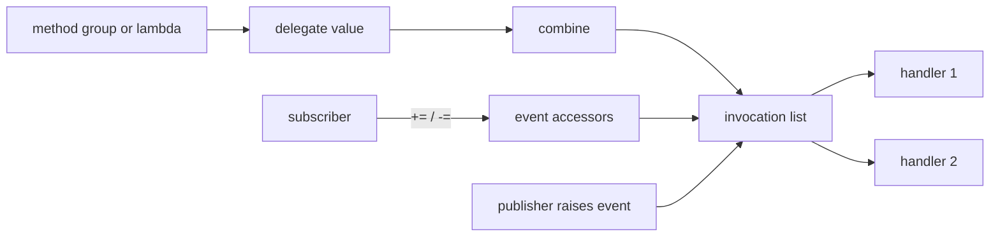

<TLDR>
  <TLDRCell label="what">
    <Term id="delegate">委托（delegate）</Term>是带有参数和返回类型的可调用值；事件是在委托之上限制外部操作的通知成员。
  </TLDRCell>
  <TLDRCell label="trap">
    多播委托只返回最后一个处理器的结果，而且任一处理器抛出异常后，后续处理器不会运行。
  </TLDRCell>
  <TLDRCell label="fix">
    用 `Func`、`Action` 或语义明确的自定义委托描述调用契约；需要通知时公开事件，并显式规定生命周期、失败与异步策略。
  </TLDRCell>
</TLDR>

## 是什么，为什么存在

委托是一种引用类型，表示一个或多个具有兼容签名的方法。它让方法可以赋给变量、作为参数传递，也可以稍后调用。与裸函数指针相比，委托保留目标对象和方法信息，并由 C# 类型系统检查参数与返回值。

当一段代码知道何时调用，却不该依赖具体实现时，就需要委托。排序器接收比较规则，重试器接收要执行的操作，LINQ 运算符接收投影或筛选函数。这些都是<Term id="callback">回调（callback）</Term>：调用方提供行为，接收方在自己的流程中调用它。

方法名出现在需要委托的上下文中时，会形成<Term id="method-group">方法组（method group）</Term>。编译器从目标委托签名中选择兼容重载并创建委托。lambda 表达式和匿名方法也能创建委托，但 lambda 还可能捕获外层变量，因此带来额外的状态与生命周期问题。

事件使用委托保存处理器，却收紧了公开权限。外部代码可以用 `+=` 和 `-=` 订阅、取消订阅，但不能替换整条调用列表，也不能触发事件。委托回答“可以调用什么”，事件回答“谁能发布这次通知”。完整的发布者生命周期、事件参数与异步事件设计见 `csharp/events`。

## 工作原理

### 签名就是调用契约

`public delegate decimal Discount(decimal subtotal);` 声明了一个新委托类型。任何可转换到它的方法都必须接收一个 `decimal`，并返回一个 `decimal`。委托变量本身仍可能是 `null`；非空委托可以用 `discount(value)` 或 `discount.Invoke(value)` 调用，两种写法语义相同。

自定义委托名称可以表达领域含义，但大多数局部回调直接使用框架泛型类型。`Action<T1, ...>` 表示返回 `void` 的方法，`Func<T1, ..., TResult>` 的最后一个类型参数是返回值，`Predicate<T>` 固定返回 `bool`。不存在 `Func<void>`；没有返回值时应使用 `Action`。

委托保存静态方法时只需要方法信息。保存实例方法时，还会保留目标对象；调用委托等价于在该对象上调用对应方法。lambda 捕获局部变量时，编译器会让生成的处理器持有捕获状态，所以这个小函数可能比它所在的局部作用域活得更久。

### 组合产生调用列表

`+` 或 `+=` 会组合兼容委托，得到<Term id="multicast-delegate">多播委托（multicast delegate）</Term>。委托对象不可变，因此组合不会修改原对象，而是创建一条新的<Term id="invocation-list">调用列表（invocation list）</Term>。直接调用时，各项目按添加顺序同步运行。

`-` 或 `-=` 会从调用列表尾部删除最后一个匹配项；没有匹配项时，原列表保持不变。同一个处理器可以重复加入，删除一次也只消除一次匹配。需要稍后移除 lambda 时，应保存创建时的委托实例。

通知路径可以画成下面这样。普通委托允许持有者替换或调用列表；事件把添加和移除开放给订阅者，把触发权留在发布者中。



### 事件只暴露订阅边界

字段式事件 `public event EventHandler<OrderEventArgs>? Placed;` 由编译器提供存储以及 `add`、`remove` 访问器。声明类型内部可以通过 `Placed?.Invoke(this, args)` 触发它。普通外部调用方只能订阅和取消订阅，不能赋值、清空或调用该事件。

`EventHandler` 表示 `void (object? sender, EventArgs e)`，`EventHandler<TEventArgs>` 则携带自定义事件数据。它们仍然是普通的 `void` 委托，所以默认触发过程同步发生在调用线程上。`event` 关键字不会自动排队、切换线程或隔离异常。

## 示例

### 把计价规则作为参数

第一个例子声明具有领域名称的 `Discount` 委托。忠诚度规则来自方法组，活动规则来自 lambda，但两者都遵守同一个调用契约。

<Depth level="quick">

```csharp title="PricingRules.cs"
using System;

public delegate decimal Discount(decimal subtotal);

public static class Program
{
    public static void Main()
    {
        Discount loyalty = LoyaltyDiscount;
        Discount launch = subtotal => Math.Min(subtotal * 0.20m, 30m);

        Console.WriteLine($"loyalty: {Total(120m, loyalty):0.00}");
        Console.WriteLine($"launch: {Total(120m, launch):0.00}");
    }

    private static decimal Total(decimal subtotal, Discount discount)
    {
        decimal reduction = discount(subtotal);
        return subtotal - reduction;
    }

    private static decimal LoyaltyDiscount(decimal subtotal)
    {
        return subtotal >= 100m ? 15m : 0m;
    }
}
```

```text
# not executed here: the .NET SDK and C# compilers are unavailable
```

</Depth>

`Total` 不知道折扣怎样计算，只知道 `Discount` 的签名。调用方可以换规则，不必修改计价流程。自定义类型还阻止偶然传入另一个含义不同、但参数看起来相似的委托。

只有当这个语义名称会出现在 API 边界或多处代码中时，自定义类型才真正有帮助。一次性的局部转换用 `Func<decimal, decimal>` 往往更简洁。

### 选择 `Action`、`Func` 与 `Predicate`

第二个例子用三个内置委托分别表达副作用、转换和条件。类型名已经说明返回值形状，因此不需要再声明三个只有样板代码的新类型。

```csharp title="BuiltInDelegates.cs"
using System;
using System.Collections.Generic;

public static class Program
{
    public static void Main()
    {
        var prices = new List<decimal> { 19m, 55m, 120m };
        Predicate<decimal> isLarge = price => price >= 50m;
        Func<decimal, decimal> addTax = price => price * 1.20m;
        Action<decimal> print = price =>
            Console.WriteLine($"total: {price:0.00}");

        foreach (decimal price in prices.FindAll(isLarge))
        {
            print(addTax(price));
        }
    }
}
```

```text
# not executed here: the .NET SDK and C# compilers are unavailable
```

`List<T>.FindAll` 的参数类型是 `Predicate<T>`，所以这里不能仅因为签名相同，就把一个 `Func<decimal, bool>` 变量直接传进去。lambda 可以分别转换成两种类型，但已经创建的不同委托类型没有这种隐式互换。

返回 `Task` 的异步回调仍然有返回值，因此应写成 `Func<Task>` 或 `Func<T, Task>`。把异步 lambda 转换成 `Action` 会得到 `async void`，调用方无法等待它。

### 组合并移除处理器

第三个例子保存 `reserve` 的身份，将它加入两次，再移除一次。最终调用列表仍保留一个 `reserve`，并按添加顺序执行。

```csharp title="MulticastHandlers.cs"
using System;

public static class Program
{
    public static void Main()
    {
        Action<string> audit = orderId =>
            Console.WriteLine($"audit {orderId}");
        Action<string> reserve = orderId =>
            Console.WriteLine($"reserve {orderId}");

        Action<string> handlers = audit;
        handlers += reserve;
        handlers += reserve;
        handlers -= reserve;

        Console.WriteLine($"handlers: {handlers.GetInvocationList().Length}");
        handlers("A-17");
    }
}
```

```text
# not executed here: the .NET SDK and C# compilers are unavailable
```

`GetInvocationList()` 返回一个数组，其中每个委托只代表一个调用目标，顺序与正常调用顺序一致。它适合诊断，或者实现明确规定“逐个尝试”的调用策略；普通代码无需为了调用多播委托而手动遍历。

这里使用 `Action<string>`，所以不存在多个返回值如何合并的问题。若多播委托有返回值，直接调用仍会运行各项目，但调用表达式只得到最后一个正常完成项目的结果。

### 从公开委托收紧为事件

最后一个例子只允许 `OrderBook` 触发 `Placed`。调用方保存命名处理器并正常移除；移除后，第二次下单仍完成业务操作，但不会再产生审计输出。

```csharp title="OrderEventBoundary.cs"
using System;

public sealed class OrderPlacedEventArgs : EventArgs
{
    public OrderPlacedEventArgs(string orderId, decimal total)
    {
        OrderId = orderId;
        Total = total;
    }

    public string OrderId { get; }
    public decimal Total { get; }
}

public sealed class OrderBook
{
    public event EventHandler<OrderPlacedEventArgs>? Placed;

    public void Place(string orderId, decimal total)
    {
        Console.WriteLine($"placed {orderId}");
        Placed?.Invoke(this, new OrderPlacedEventArgs(orderId, total));
    }
}

public static class Program
{
    public static void Main()
    {
        var orders = new OrderBook();
        EventHandler<OrderPlacedEventArgs> audit = (_, e) =>
            Console.WriteLine($"audit {e.OrderId}: {e.Total:0.00}");

        orders.Placed += audit;
        orders.Place("A-17", 45m);
        orders.Placed -= audit;
        orders.Place("A-18", 20m);
    }
}
```

```text
# not executed here: the .NET SDK and C# compilers are unavailable
```

如果 `Placed` 是公开的 `EventHandler<OrderPlacedEventArgs>` 字段，外部代码就能把它设为 `null`、覆盖其他处理器或伪造通知。`event` 保留同一种处理器签名，同时把这些操作限制在声明类型内部。

这个示例只展示委托与事件的边界。订阅者保留、异常传播、自定义访问器、可取消事件和线程规则属于事件 API 的完整设计，应继续阅读相关事件主题。

## 陷阱

### 把相同签名当作相同类型

> [!PITFALL]
> 两个自定义委托即使参数和返回类型完全相同，仍是不同的命名类型，变量不能直接互相赋值。
>
> **修复：** API 没有领域语义需求时，复用 `Func`、`Action` 或 `Predicate`。确实需要不同契约时保留自定义类型，并通过新的 lambda 或方法组显式创建目标类型，而不是用强制转换掩盖含义差异。

### 用新 lambda 取消旧订阅

> [!PITFALL]
> `source.Changed -= (_, e) => Handle(e);` 通常不会移除先前另一处 lambda 表达式创建的处理器，即使两段源码看起来一样。
>
> **修复：** 需要移除时，把委托实例保存在字段或局部变量中，或者使用同一个命名方法。取消订阅后再次触发通知，确认旧处理器没有运行。

### 捕获会继续变化的循环变量

> [!PITFALL]
> 生成的 `for` 循环经常把 lambda 加入列表，却让每个 lambda 都捕获同一个 `i`。循环结束后调用时，它们会看到 `i` 的最终值，而不是各轮的值。
>
> **修复：** 在循环体内创建 `int index = i;`，让 lambda 捕获本轮变量，或者把值作为参数传给创建处理器的工厂。测试要在循环结束后调用全部处理器。

### 忽略多播返回值与失败

> [!PITFALL]
> 有返回值的多播委托只把最后一个正常返回值交给调用方。任何处理器抛出异常后，调用立即停止，排在后面的处理器不会运行。
>
> **修复：** 广播通知优先使用返回 `void` 的处理器。若契约要求收集每个结果或尝试每个处理器，遍历 `GetInvocationList()`，并明确规定顺序、失败收集和部分副作用的处理方式。

### 把异步工作塞进同步委托

> [!PITFALL]
> 传给 `Action` 或 `EventHandler` 的异步 lambda 会成为 `async void`。调用方无法等待完成，`await` 之后的异常也不会通过原调用返回。
>
> **修复：** 需要等待时定义 `Func<Task>`、`Func<T, Task>` 或专用的返回 `Task` 委托。多播异步委托不能直接调用后只等待返回的最后一个 `Task`；应取得调用列表，并选择顺序等待或通过 `Task.WhenAll` 并发等待。

<Depth level="deep">

## 调用列表、身份与变体

### 委托身份决定能否移除

委托是不可变对象。赋值复制引用，组合与删除则产生新的委托值，不会就地编辑已有实例。两个非空委托相等时，它们必须具有相同运行时委托类型，而且调用列表中的对应项目相等、顺序相同。

对于普通静态方法或实例方法，单个调用项目由方法和目标对象共同决定。命名实例方法重新转换成同一委托类型后，通常仍能匹配原订阅；不同对象上的同一个方法不能匹配。编译器生成的 lambda 方法和捕获对象不适合靠源码外观推断身份，所以需要取消订阅的 lambda 应保存实例。

删除操作寻找最后一段匹配的调用列表。这意味着从 `A + B + A` 中减去 `A` 会移除末尾的 `A`，从 `A + B + A + B` 中减去 `A + B` 会移除最后那一段。依赖复杂的列表减法很难审查；事件订阅通常逐个保存并移除处理器。

`GetInvocationList()` 返回当时列表的数组快照，每个元素只有一个调用目标。拿到数组后，原委托随后怎样重新组合都不会改变该数组。不过，其中的目标对象仍是原对象，并没有被深拷贝。

### 返回值与异常没有聚合协议

调用有返回值的多播委托时，运行时依次调用列表项目，并把最后一个成功运行项目的返回值作为整个表达式的结果。前面算出的返回值不会自动进入集合。`ref` 或 `out` 参数也会沿调用顺序继续变化，这通常会让公开契约难以理解。

异常同样不会自动聚合。某个项目同步抛出后，调用在该点结束，异常直接返回调用方。若业务要求全部尝试，就要逐个调用并决定保留哪些异常；若前面的处理器已经产生副作用，还要定义失败后的系统状态。

这些规则也是事件通常返回 `void` 的原因。通知表示已经发生的事实时，发布者不应依赖多个未知订阅者共同计算一个返回值。需要一个决定时，明确的策略委托或方法参数往往比事件更合适。

### 泛型委托变体

`Func<in T, out TResult>` 的输入参数逆变，返回参数协变。需要 `Func<Dog, Animal>` 的地方，可以使用接收更宽泛 `Animal`、返回更具体 `Dog` 的函数：它能处理调用方可能给出的每只 `Dog`，结果也一定是 `Animal`。`Action<in T>` 只有输入，因此支持逆变。

变体转换适用于引用类型。值类型参数不会通过这些 `in`、`out` 标记产生装箱式的变体转换。自定义泛型委托若要支持同样能力，必须在声明中明确标出安全的 `in` 和 `out` 类型参数。

不要把泛型变体与方法组的签名兼容混为一谈。编译器可以把参数更宽或返回值更窄的方法直接转换为某个委托；泛型变体则是在已经创建的兼容泛型委托类型之间转换。审查时分别写出方法签名、源委托类型和目标委托类型，会更容易判断方向。

### 多播异步委托需要单独协议

直接调用多播 `Func<Task>` 时，每个处理器都会按顺序被调用以取得各自的 `Task`，但整个委托调用只返回最后一个任务。等待这个返回值不能证明前面的任务已完成，也无法可靠观察它们的异常。这个写法会编译，因此特别容易混入生成代码。

发布方应先通过 `GetInvocationList()` 得到单目标委托，再选择执行策略。顺序等待让第二个处理器在第一个完成后开始，失败时可以立即停止。先调用所有处理器再交给 `Task.WhenAll` 会并发等待，但还需要规定同步抛出、取消和多个失败怎样报告。

异步协议还必须说明 `CancellationToken` 从哪里来、一次失败是否取消其他工作，以及处理器能否并发修改同一状态。仅把方法命名为 `RaiseAsync` 不会提供这些语义。若这些答案属于一次请求的核心结果，直接定义返回领域结果的异步方法通常比模仿事件更清楚。

## 选择回调边界

使用方只需提供一项操作时，委托是最小的实用边界。调用形状清楚，也不用强迫每个调用方都实现一个只有单一方法的类。不过，这并不表示所有扩展点都应该使用委托。

应根据所有权以及需要保持一致的操作数量选择边界。回调属于接收它的操作，事件属于发布者，接口则能把多项操作和状态绑定到一个生命周期更长的协作者上。

| 需求 | API 形状 | 原因 |
|---|---|---|
| 一项签名常见的局部操作 | `Func` 或 `Action` | 类型已经说明输入与结果 |
| 一项具有领域含义的操作 | 自定义委托 | 名称和修饰符成为契约的一部分 |
| 多项相关操作或共享状态 | 接口 | 一个对象可以跨方法维护不变量 |
| 向数量未知的使用方发出通知 | 事件 | 发布者保留触发权 |
| 跨进程通知 | 消息契约 | 委托不提供传输或交付保证 |

对象拥有单一可替换策略时，委托属性可能很合适，但赋值策略必须明确。公开字段允许任何调用方无验证地替换其值。构造函数参数或只有 `get` 的属性通常更容易说明所有权。

### 参数也是协议的一部分

参数名不影响委托类型身份，却会影响阅读 lambda 和生成文档的调用方。应使用 `subtotal`、`cancellationToken` 等领域名称；CLR 类型无法表达计量单位与有效范围时，还要在契约中说明。

参数修饰符会影响兼容性。接收 `ref T` 的方法不能匹配接收 `T` 的委托，`in`、`ref` 与 `out` 也不是可以互换的调用契约。标准 `Func` 和 `Action` 系列无法表达这些修饰符，因此需要它们时，自定义委托仍有价值。

可空注解参与编译器分析，不会创建新的运行时委托类型。因此，生成的方法可能在出现警告的情况下仍能编译，却提供比委托契约更弱的空值处理。回调边界上的可空警告属于契约问题，不是外观问题。

异常与取消没有出现在委托类型中，但同样属于协议。发布回调 API 前，要回答四个问题：

- 哪些异常可以越过回调边界？
- 接收方可以不调用、调用一次，还是重复调用回调？
- 调用能否重叠，或者来自不同线程？
- 谁负责取消、超时与清理？

### 事件与回调的所有者不同

接收回调的方法通常让一个调用方在有限范围内定制一次操作。接收方法决定何时调用、调用几次，返回值或抛出的异常也能留在该方法的控制流中。这是一份直接的双方契约。

事件允许一组会变化的使用方订阅。发布者通常不知道有多少处理器，也不应依靠某一个订阅者维护自身不变量。正是这种开放的所有权，让事件返回值、处理器顺序和关系拆除需要更多设计。

行为带有状态、多项协调操作，或者其生命周期需要一个名称时，接口是更好的边界。把三个相关委托换成一个接口，可以让不变量更清楚；把每个单方法回调都换成接口，则只会增加样板。

### 公开委托类型也需要演进

修改公开委托的参数列表或返回类型，会破坏调用点、方法组与实现它的 lambda。即使当前处理器方法新增了可选参数，委托的调用签名也没有随之改变，因此现有调用方仍无法通过委托提供该实参。

如果回调很可能增加上下文数据，参数对象通常比不断扩张的位置参数列表稳定。这个选择应来自已知的演进压力，不应提前塞入猜测性的字段。必需数据仍需要构造或验证规则。

对于事件，在自定义 `EventArgs` 类型上新增属性，通常比替换事件委托类型更容易消费。在包含该类型的程序集遵守常规二进制兼容规则的前提下，基于早期形状编译的订阅者可以忽略自己不使用的数据。

</Depth>

<Checkpoint id="csharp/delegates-events" />

## 延伸阅读

- [C# 编程指南：委托](https://learn.microsoft.com/en-us/dotnet/csharp/programming-guide/delegates/)
- [C# 编程指南：使用委托](https://learn.microsoft.com/en-us/dotnet/csharp/programming-guide/delegates/using-delegates)
- [组合委托与多播委托](https://learn.microsoft.com/en-us/dotnet/csharp/programming-guide/delegates/how-to-combine-delegates-multicast-delegates)
- [委托中的协变与逆变](https://learn.microsoft.com/en-us/dotnet/csharp/programming-guide/concepts/covariance-contravariance/variance-in-delegates)
- [`Delegate.GetInvocationList`](https://learn.microsoft.com/en-us/dotnet/api/system.delegate.getinvocationlist?view=net-10.0)
- [C# 编程指南：事件](https://learn.microsoft.com/en-us/dotnet/csharp/programming-guide/events/)
