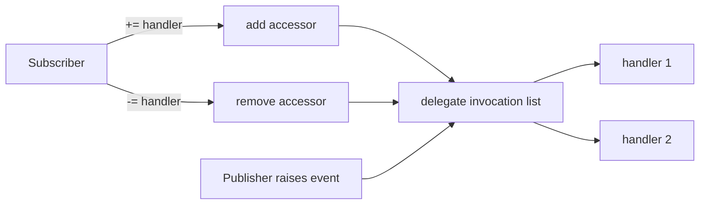

<TLDR>
  <TLDRCell label="what">
    A C# event is a delegate member controlled by its publisher: outside code can subscribe and unsubscribe, but only the declaring type can raise the notification.
  </TLDRCell>
  <TLDRCell label="trap">
    Event handlers run synchronously, in order, on the raising thread by default. If one handler throws, later handlers don't run.
  </TLDRCell>
  <TLDRCell label="fix">
    Use `EventHandler<TEventArgs>` for event data, keep a stable handler reference when you must unsubscribe, and define lifetime, exception, and async policies in the API contract.
  </TLDRCell>
</TLDR>

## What it is and why it exists

An event gives an object a notification point for "something happened" without requiring it to know who responds. The object that sends the notification is the publisher, an object that registers response code is a subscriber, and the registered method or lambda is an <Term id="event-handler">event handler</Term>. Button clicks, property changes, progress updates, and connection-state changes commonly use events.

Events are built on delegates, but they aren't the same public interface. A public delegate field lets outside code replace, clear, or invoke its value. A public event only lets outside code use `+=` and `-=`. That restriction leaves "when it happens" with the publisher and "what to do afterward" with subscribers.

An event can register several handlers, so a <Term id="multicast-delegate">multicast delegate</Term> normally holds its invocation list. The notification still happens inside one process and is a synchronous method call by default. An event isn't a message queue, and it doesn't automatically create background work, switch threads, or persist messages.

Events fit when a component must announce a local state change to an unknown number of consumers without depending on those consumers. If a caller needs a return value, must control execution order, or must include failure in the publisher's transaction, an ordinary method or explicit <Term id="callback">callback</Term> is usually clearer.

## How it works

### A restricted delegate member

`public event EventHandler<OrderEventArgs>? Changed;` declares a field-like event. Its type must be a delegate type. Code inside the class can read and invoke the event much like a delegate, while outside code can only register or remove handlers through the event's add and remove operations.

`EventHandler` has the signature `void (object? sender, EventArgs e)`. When a notification carries data, the usual choice is `EventHandler<TEventArgs>` with a domain-specific `EventArgs` subclass. `sender` identifies the source. A subscriber that already holds a properly typed source doesn't need to cast this parameter merely to use it.

When a field-like event has no subscribers, its internal delegate is `null`. Publishers usually write `Changed?.Invoke(this, args)`: invoke the handlers if present, otherwise finish. Outside code can't write `publisher.Changed?.Invoke(...)` because the right to raise an event belongs to its declaring type.

The notification path looks like this. The add and remove operations update the invocation list; raising the event reads that list and calls its handlers.



### Subscribe, raise, and unsubscribe

`+=` appends a handler to the invocation list. Adding the same handler repeatedly creates repeated entries. `-=` removes the last matching handler and has no effect when it finds no match. If you need to unsubscribe later, keep a named method or delegate instance instead of writing a seemingly identical lambda beside `-=`.

Raising a multicast delegate runs handlers synchronously in invocation-list order. The publisher's thread remains inside those handlers until all return or one throws. Events have no built-in priority, retry, timeout, or exception isolation.

Every handler receives the same event-argument object in sequence. For a cancellable "before" event, a handler can set a shared `Cancel` property to `true`, and the publisher reads it after notification finishes. This pattern needs a clear contract: later handlers shouldn't change an already true cancellation flag back to false.

### References determine lifetime

An instance-method delegate contains its target object and method. While the publisher's invocation list retains that delegate, the subscriber remains reachable through a <Term id="strong-reference">strong reference</Term>. A local variable going out of scope isn't enough to make the subscriber collectible.

When the publisher outlives the subscriber, the subscriber should use `-=` as its lifetime ends. Common designs unsubscribe in `Dispose()`, or make the higher-level object that created the relationship tear it down as well. Extra unsubscription isn't necessarily useful when the two objects share a lifetime. Ownership, not a rote rule, decides.

A lambda can capture `this`, a service, or a large object graph. Its target stays alive with the delegate even when the handler body is tiny. Static events and application-wide singleton publishers deserve special scrutiny because they often outlive pages, requests, and temporary services.

## Examples

### Declare, raise, and remove a handler

This order exposes its status event, not the underlying delegate. The first status change writes an audit line. After removing the same `audit` delegate, the second change no longer notifies it.

<Depth level="quick">

```csharp title="OrderEvents.cs"
using System;

var order = new Order("A-17");
EventHandler<OrderStatusChangedEventArgs> audit =
    (_, e) => Console.WriteLine(
        $"{e.OrderId}: {e.OldStatus} -> {e.NewStatus}");

order.StatusChanged += audit;
order.AdvanceTo("paid");
order.StatusChanged -= audit;
order.AdvanceTo("packed");

Console.WriteLine($"current: {order.Status}");

public sealed record OrderStatusChangedEventArgs(
    string OrderId,
    string OldStatus,
    string NewStatus) : EventArgs;

public sealed class Order(string id)
{
    public string Status { get; private set; } = "pending";
    public event EventHandler<OrderStatusChangedEventArgs>? StatusChanged;

    public void AdvanceTo(string newStatus)
    {
        string oldStatus = Status;
        Status = newStatus;
        StatusChanged?.Invoke(
            this,
            new OrderStatusChangedEventArgs(id, oldStatus, newStatus));
    }
}
```

```text
# not executed here: the .NET SDK and C# compilers are unavailable
```

</Depth>

`StatusChanged` is a field-like event, and only `Order` can invoke it. The event data is an immutable record, so a subscriber sees a snapshot of one transition. The program still prints the current status at the end: removing a subscriber doesn't change the order's own work.

Saving `audit` is about identity, not syntax preference. `+=` and `-=` must operate on equal delegates; keeping the reference makes both intent and lifetime plain. A named method also provides stable add and remove operations.

### Make a before-event cancellable

The second example sends a notification before submission. The first handler rejects a total above its limit. The second observes the same argument object, so it sees the cancellation state already set.

```csharp title="CancelableCheckout.cs"
using System;

var checkout = new Checkout();

checkout.Submitting += (_, e) =>
{
    if (e.Total > 100m)
        e.Cancel = true;
};

checkout.Submitting += (_, e) =>
    Console.WriteLine($"observed cancel: {e.Cancel}");

Console.WriteLine($"accepted: {checkout.Submit(120m)}");

public sealed class SubmitEventArgs(decimal total) : EventArgs
{
    public decimal Total { get; } = total;
    public bool Cancel { get; set; }
}

public sealed class Checkout
{
    public event EventHandler<SubmitEventArgs>? Submitting;

    public bool Submit(decimal total)
    {
        var args = new SubmitEventArgs(total);
        Submitting?.Invoke(this, args);
        return !args.Cancel;
    }
}
```

```text
# not executed here: the .NET SDK and C# compilers are unavailable
```

This API makes the cancellation decision after every synchronous handler runs. It doesn't use handler return values because a multicast call would produce several results with no obvious combining rule. Mutable arguments work for this narrow purpose; immutable data is a better default for ordinary "already happened" events.

Handler order shouldn't become an authorization rule. This example's contract says handlers only move `Cancel` from false to true. If a later handler can restore submission, an earlier rejection loses effect. The publisher itself must perform any authorization that needs enforcement.

### See exception propagation

The third example registers three handlers. When the second throws, the exception returns to the caller of `Complete()`, and the third handler doesn't run.

```csharp title="HandlerExceptions.cs"
using System;

var job = new Job();

job.Completed += (_, _) => Console.WriteLine("audit saved");
job.Completed += (_, _) => throw new InvalidOperationException("email failed");
job.Completed += (_, _) => Console.WriteLine("metrics updated");

try
{
    job.Complete();
}
catch (InvalidOperationException error)
{
    Console.WriteLine($"caught: {error.Message}");
}

public sealed class Job
{
    public event EventHandler? Completed;

    public void Complete()
    {
        Completed?.Invoke(this, EventArgs.Empty);
    }
}
```

```text
# not executed here: the .NET SDK and C# compilers are unavailable
```

A publisher can't assume every subscriber receives a notification. If "try every handler" is part of the contract, the publisher must obtain the invocation list, call each entry while recording failures, and define how multiple errors reach the caller. Don't apply this policy silently to every event; it changes the error semantics.

Nor should a handler swallow every exception. It can handle failures from which it can recover; other failures belong at the system's chosen error boundary. Whether audit, email, and metrics may fail independently is an application decision, not one the `event` keyword makes.

### Tie a subscription to an object's lifetime

The final example subscribes a panel in its constructor and removes the same named method in `Dispose()`. The second raise, after the `using` block, no longer calls the panel. The subscription now follows the object's useful scope.

```csharp title="DisposableSubscription.cs"
using System;

var ticker = new Ticker();

using (var panel = new StatusPanel(ticker))
{
    ticker.Tick();
}

ticker.Tick();
Console.WriteLine("done");

public sealed class Ticker
{
    public event EventHandler? Ticked;

    public void Tick() => Ticked?.Invoke(this, EventArgs.Empty);
}

public sealed class StatusPanel : IDisposable
{
    private readonly Ticker _ticker;

    public StatusPanel(Ticker ticker)
    {
        _ticker = ticker;
        _ticker.Ticked += OnTicked;
    }

    private void OnTicked(object? sender, EventArgs e) =>
        Console.WriteLine("panel refreshed");

    public void Dispose() => _ticker.Ticked -= OnTicked;
}
```

```text
# not executed here: the .NET SDK and C# compilers are unavailable
```

Here `Dispose()` ends a subscription; it doesn't imply that the object owns unmanaged resources. The pattern is still appropriate because it expresses a managed relationship that must end deterministically. Callers must actually dispose the panel. Implementing the interface alone performs no cleanup.

Some frameworks already provide load and unload hooks, subscription tokens, or weak-event mechanisms. Prefer the framework's lifetime model when it has one. Handwritten `IDisposable` works for ordinary objects with clear ownership, but several places shouldn't have to guess who removes one subscription.

## Pitfalls

### Unsubscribing an old lambda with a new one

> [!PITFALL]
> `source.Changed -= (_, e) => Update(e);` usually doesn't remove a handler registered with another lambda expression earlier. Matching source text doesn't make the delegates equal.

**Fix:** when a subscription must be removed, store its handler in a field or local delegate, or use a named method. Raise the event again after removal and assert that the handler stays silent. Merely checking that `-=` compiles proves nothing.

### Forgetting that a long-lived publisher retains subscribers

> [!PITFALL]
> After a page object subscribes to a singleton or static event, the publisher can retain that page through its instance-method delegate even after the page closes. The object may stay alive and continue processing stale notifications.

**Fix:** decide who creates and removes the subscription, then unsubscribe at that same lifetime boundary. Prefer a testable `IDisposable` path or framework lifecycle hook. Don't begin with a generic weak-event implementation that hides uncertain ownership.

### Treating a synchronous event as an async pipeline

> [!PITFALL]
> Registering an `async` lambda with `EventHandler` creates an `async void` handler. The publisher can't await completion or observe exceptions from the asynchronous portion through an ordinary `try`/`catch`.

**Fix:** if completion, cancellation, and errors must return to the publisher, define an explicit async contract that returns `Task` and specifies sequential or parallel handling. A genuine fire-and-forget notification still needs an observable error channel rather than relying on process-level unhandled errors.

### Assuming every handler runs

> [!PITFALL]
> A multicast delegate invokes handlers in order and stops when one throws. Cleanup placed in "the last subscriber" can therefore leave the system in a partial state.

**Fix:** the publisher should perform work required for its own invariants and protect resource cleanup with `try`/`finally`. Invoke handlers individually and aggregate or record failures only when the event's contract explicitly calls for isolation.

### Treating `?.Invoke` as a threading solution

> [!PITFALL]
> A null-conditional call handles the current absence of subscribers, but it doesn't marshal handlers to a UI thread or make shared handler data thread-safe. When removal races with raising, the snapshot already obtained for this call can still contain the newly removed handler.

**Fix:** document the raising thread and reentrancy rules. UI subscribers should switch through their framework's dispatcher, and shared state needs suitable synchronization. Unsubscribing stops future lists from including a handler; it can't recall an invocation already in flight.

### Letting outside handlers maintain publisher invariants

> [!PITFALL]
> A publisher doesn't know which subscribers exist and can't guarantee that they succeed. Depending on a handler to update core state makes behavior change when there are no subscribers, registration order changes, or a handler fails.

**Fix:** complete and validate the publisher's own state change before raising an "already happened" event. A cancellable "about to happen" event may collect opinions, but the publisher remains responsible for final authorization and consistency checks.

## In the AI era

**What generated code gets wrong here**

Models often generate an inline lambda and then place a second, identical-looking lambda in `Dispose()`, assuming the subscription is gone. They also mark an event handler `async` while keeping the void-returning `EventHandler` contract, so the caller continues too early and asynchronous exceptions leave the original error boundary. Another stock "thread-safe" fix puts a lock around `?.Invoke` and runs unknown subscriber code while holding that lock, inviting reentrancy or deadlock.

Generated code also moves required business steps into several handlers and assumes all of them succeed. A multicast call stops at its first exception, leaving only some side effects complete. With cancellable events, models sometimes reset `Cancel` in a later handler, making the result depend on registration order.

**Ask your AI to check**

- Match every `+=` with its `-=`, compare delegate instance identity, and state whether the publisher or subscriber lives longer.
- Trace the raising thread, handler order, and exception path for one notification, naming handlers that may never run.
- Find every event handler converted to `async void` and propose a contract that can await completion, propagate cancellation, and report errors.

**Review checklist**

- Raise the event after unsubscription, then use a weak reference or memory profiler to confirm that a long-lived publisher no longer retains the subscriber.
- Test zero, one, and several subscribers, including a middle handler that throws.
- Test background-thread raising, reentrancy, and async-handler completion timing; don't treat `?.Invoke` as evidence of concurrency safety.

**Prompt vocabulary**

Use the exact terms `field-like event`, `event accessor`, `invocation list`, `delegate identity`, `publisher lifetime`, `subscriber retention`, `exception propagation`, and `async void event handler`. Ask the model for a timeline covering subscription, raising, failure, and cleanup. "Check the event code" is too vague to expose retention or ordering bugs.

<Depth level="deep">

## Event accessors and inheritance

For a field-like event, the compiler provides hidden storage plus add and remove accessors. Code in the declaring type can read that storage and raise the event; outside code can only invoke the accessors. Saying "an event is a public delegate field" misses the access restriction that provides the encapsulation.

Explicit <Term id="event-accessor">event accessors</Term> fit when you forward to another source, share storage among many rarely used events, or need controlled behavior when subscriptions change. Both accessors receive the handler through an implicit parameter named `value`. They must be symmetrical, or a caller can execute `-=` and still leave its handler retained.

Custom accessors also change how the declaring type works: there is no automatically generated event field to invoke, so the type calls its backing delegate or forwarding source. A lock inside an accessor can protect subscription-list updates. Don't hold that lock while invoking handlers; handlers are outside code and can subscribe again, unsubscribe, or reenter the publisher.

An unsealed base class normally supplies a protected virtual method such as `OnChanged(EventArgs e)` that raises the event. Derived classes override the raising path rather than invoking the base event directly, and an override normally calls `base.OnChanged(e)` so existing subscribers still receive notifications. A sealed class doesn't need a pointless virtual method just to imitate the pattern.

C# 14 supports partial events. The defining declaration uses field-like syntax, while the implementing declaration supplies add and remove accessors. This mainly separates generated declarations from handwritten implementations. Both declarations must belong to the same partial type; ordinary events don't need splitting merely to use new syntax.

### Add and remove aren't lifetime managers

An event accessor knows that a delegate was added or removed, but it doesn't know when the subscriber has finished its work. The publisher can't reliably infer that a page closed, a request ended, or a service was replaced. Code that owns those objects still has to express the lifetime.

A subscription method can return an `IDisposable` token that binds one add operation to the matching removal. That's a library design choice, not built-in C# event behavior. The token still needs disposal at the right boundary, or the omission has merely moved from `-=` to `Dispose()`.

## Exception policy for invocation lists

Delegates are immutable objects. Combine and remove operations produce a new delegate result rather than editing an old object in place. Once raising code reads a particular delegate value, that call uses its invocation list; later subscription changes affect values read for later calls.

The invocation list preserves handler order and permits duplicates. An ordinary call runs from first to last, and registering one handler twice makes it run twice. `-=` removes only the last matching invocation-list segment, so repeated subscriptions should usually be treated as an ownership bug to investigate.

An exception from a handler returns directly to the raising caller, and the remaining handlers don't run. Catching at the outer call site can receive the failure, but it can't make skipped handlers resume. This default suits a contract in which a subscriber failure means the synchronous operation failed.

When a contract requires isolation, a publisher can use `GetInvocationList()` to obtain a snapshot and invoke entries individually. It then has to choose between immediate logging, collecting an `AggregateException`, or returning a domain result, while accounting for side effects completed before another handler fails. A loop of `try`/`catch` blocks that discards every exception creates silent divergence.

Cancellation arguments also belong to the invocation contract rather than to the language. All handlers see one mutable object, and later handlers observe earlier writes. When ordering shouldn't change the result, require the flag to move only toward `true`, or collect independent check results and combine them explicitly in the publisher.

### Reentrancy changes the timeline

A handler can synchronously call another method on the publisher or even raise the same event again. This is reentrancy. If the publisher has completed only half a state update before raising, a reentrant handler can observe an inconsistent intermediate state.

Publishers should establish an observable, consistent state before raising an after-event. An operation that truly forbids reentrancy can reject nested calls with explicit state, but its error and recovery behavior belong in the contract. Accidentally preventing reentrancy with a lock isn't enough; some locks allow the same thread to enter again.

## Concurrency and asynchronous boundaries

By default, handlers run on whichever thread raises the event. Console and server code shouldn't assume a UI context exists, and desktop or mobile UIs can't be updated freely from background threads. When thread affinity matters, either the publisher promises dispatch or the subscriber switches through its framework dispatcher. The responsibility must be explicit.

`?.Invoke` performs a null check on the obtained delegate value and is suitable for ordinary field-like event raising. It doesn't guarantee that a just-removed handler won't run, because the raising code may already hold a value containing that handler. Handlers must tolerate disposal racing with an in-flight notification and, when needed, check their own disposed state on entry.

Safe subscription-list updates don't make handler code thread-safe. Two threads can raise the same event and run one subscriber concurrently. A publisher that promises serialized notifications must queue or synchronize them itself. Without that promise, subscribers have to protect their mutable state.

Standard `EventHandler<TEventArgs>` returns `void`, so it provides no completion signal to await. An async lambda converts to `async void`, and only its work before the first incomplete `await` remains within the synchronous call. Later completion, cancellation, and exceptions can't return through the event-raising method.

When a publisher must await all handlers, design an explicit delegate that returns `Task` or expose an async method instead. Its contract must answer whether handlers run sequentially or in parallel, whether one failure cancels the others, which `CancellationToken` applies, and how several exceptions are combined. Calling a method `RaiseAsync` while it still invokes an ordinary event doesn't create those semantics.

Notifications between processes need another set of guarantees. A broker or durable queue introduces serialization, retries, idempotency, and delivery semantics that C# events don't provide. Wrapping local handlers in `Task.Run` doesn't turn them into a reliable messaging system.

</Depth>

<Checkpoint id="csharp/events" />

## Further reading

- [Events in the C# programming guide](https://learn.microsoft.com/en-us/dotnet/csharp/programming-guide/events/)
- [Subscribe to and unsubscribe from events](https://learn.microsoft.com/en-us/dotnet/csharp/programming-guide/events/how-to-subscribe-to-and-unsubscribe-from-events)
- [Standard .NET event patterns](https://learn.microsoft.com/en-us/dotnet/csharp/event-pattern)
- [The `event` keyword](https://learn.microsoft.com/en-us/dotnet/csharp/language-reference/keywords/event)
- [C# language specification: events](https://learn.microsoft.com/en-us/dotnet/csharp/language-reference/language-specification/classes#158-events)
- [`Delegate.GetInvocationList`](https://learn.microsoft.com/en-us/dotnet/api/system.delegate.getinvocationlist?view=net-10.0)
