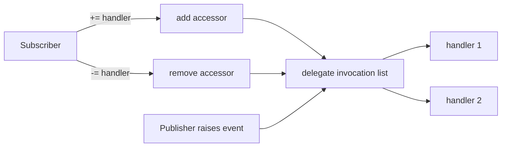

<TLDR>
  <TLDRCell label="what">
    C# 事件（event）是受发布者控制的委托成员：外部代码可以订阅和取消订阅，只有声明方能够触发通知。
  </TLDRCell>
  <TLDRCell label="trap">
    事件处理器默认在触发线程上同步、按顺序运行；一个处理器抛出异常后，后面的处理器不会运行。
  </TLDRCell>
  <TLDRCell label="fix">
    使用 `EventHandler<TEventArgs>` 表达事件数据，保存可取消订阅的处理器引用，并把生命周期、异常和异步策略写进 API 契约。
  </TLDRCell>
</TLDR>

## 是什么，为什么存在

事件让对象公开“某件事已经发生”的通知点，而不必知道谁会响应。发出通知的对象叫发布者（publisher），注册响应代码的对象叫订阅者（subscriber），注册的方法或 lambda 是<Term id="event-handler">事件处理器（event handler）</Term>。按钮点击、属性变化、进度更新和连接状态变化都会用到它。

事件建立在委托（delegate）之上，但两者不是同一种公开接口。公开委托字段允许外部代码整体赋值、清空或调用；公开事件只允许外部代码使用 `+=` 和 `-=`。这个限制把“何时发生”留给发布者，把“发生后做什么”留给订阅者。

一个事件可以注册多个处理器，因此通常由<Term id="multicast-delegate">多播委托（multicast delegate）</Term>保存调用列表。通知仍发生在一个进程内，并且默认是同步方法调用。事件不是消息队列，也不会自动创建后台任务、跨线程调度或持久化消息。

当一个组件需要向数量未知的本地使用方广播状态变化，而且发布者不应依赖具体订阅者时，事件很合适。如果调用方必须得到返回值、控制执行顺序，或者失败需要参与发布者的事务，普通方法或显式回调（callback）通常更清楚。

## 工作原理

### 一个受限制的委托成员

`public event EventHandler<OrderEventArgs>? Changed;` 声明了一个字段式事件。事件的类型必须是委托类型。类的内部可以像使用委托一样读取和调用该事件，外部代码则只能通过事件的 add 和 remove 操作注册或移除处理器。

`EventHandler` 的签名是 `void (object? sender, EventArgs e)`。需要携带数据时，通常使用 `EventHandler<TEventArgs>`，把领域数据放入 `EventArgs` 派生类。`sender` 表示通知来源；如果订阅者已经明确持有来源，也不必为了使用这个参数而强制转换它。

字段式事件没有订阅者时，内部委托为 `null`。发布者通常使用 `Changed?.Invoke(this, args)`：有处理器就调用，没有则直接结束。外部代码不能写 `publisher.Changed?.Invoke(...)`，因为事件的调用权限属于声明它的类型。

通知路径可以画成下面这样。add 和 remove 操作改变调用列表；触发操作读取列表，再调用其中的处理器。



### 订阅、触发和取消订阅

`+=` 把处理器加入调用列表，重复添加同一个处理器会得到重复条目。`-=` 移除最后一个匹配的处理器；找不到匹配项时没有效果。若以后需要取消订阅，应保存命名方法或委托实例，而不是在 `-=` 处重新写一个看似相同的 lambda。

触发多播委托时，处理器按调用列表中的顺序同步执行。发布者的调用线程会一直执行这些处理器，直到全部返回或其中一个抛出异常。事件本身没有内置的优先级、重试、超时或异常隔离。

事件参数对象会依次传给每个处理器。对于可取消的“操作前”事件，处理器可以把共享参数的 `Cancel` 属性设为 `true`，发布者在通知结束后读取它。这个模式依赖明确契约：后面的处理器不应把已经为 `true` 的取消标志改回 `false`。

### 引用关系决定生命周期

实例方法委托包含目标对象和方法。只要发布者的调用列表保留这个委托，订阅者就通过<Term id="strong-reference">强引用（strong reference）</Term>保持可达。局部变量离开作用域，并不足以让订阅者被垃圾回收。

当发布者比订阅者活得更久时，订阅者应在生命周期结束时执行 `-=`。常见做法是在 `Dispose()` 中取消订阅，或者让创建订阅关系的上层对象同时负责拆除它。若两者生命周期相同，额外取消订阅不一定有收益；判断依据是所有权，不是一条机械规则。

lambda 可能捕获 `this`、服务或大型对象图。即使处理器正文很短，捕获目标仍会随委托一起保留。静态事件和应用级单例发布者尤其需要检查，因为它们往往比页面、请求或临时服务活得更久。

## 示例

### 声明、触发和移除处理器

这个订单对象只公开状态事件，不公开底层委托。第一个状态变化会写入审计输出；移除同一个 `audit` 委托后，第二次变化不会再通知它。

<Depth level="quick">

```csharp title="OrderEvents.cs"
using System;

var order = new Order("A-17");
EventHandler<OrderStatusChangedEventArgs> audit =
    (_, e) => Console.WriteLine(
        $"{e.OrderId}: {e.OldStatus} -> {e.NewStatus}");

order.StatusChanged += audit;
order.AdvanceTo("paid");
order.StatusChanged -= audit;
order.AdvanceTo("packed");

Console.WriteLine($"current: {order.Status}");

public sealed record OrderStatusChangedEventArgs(
    string OrderId,
    string OldStatus,
    string NewStatus) : EventArgs;

public sealed class Order(string id)
{
    public string Status { get; private set; } = "pending";
    public event EventHandler<OrderStatusChangedEventArgs>? StatusChanged;

    public void AdvanceTo(string newStatus)
    {
        string oldStatus = Status;
        Status = newStatus;
        StatusChanged?.Invoke(
            this,
            new OrderStatusChangedEventArgs(id, oldStatus, newStatus));
    }
}
```

```text
# not executed here: the .NET SDK and C# compilers are unavailable
```

</Depth>

`StatusChanged` 是字段式事件，只有 `Order` 能调用它。事件数据是不可变记录，订阅者看到的是一次状态迁移的快照。程序最后仍会打印当前状态，因此取消订阅并不影响订单自身的业务操作。

这里保存 `audit` 的原因不是语法偏好，而是身份。`+=` 和 `-=` 必须处理相等的委托，保存引用能让意图和生命周期都清楚。命名方法同样可以稳定地添加和移除。

### 让操作前事件可以取消

第二个例子在提交前发出通知。第一个处理器拒绝超过限额的总额，第二个处理器观察同一个参数对象，因此会看到已经设置的取消状态。

```csharp title="CancelableCheckout.cs"
using System;

var checkout = new Checkout();

checkout.Submitting += (_, e) =>
{
    if (e.Total > 100m)
        e.Cancel = true;
};

checkout.Submitting += (_, e) =>
    Console.WriteLine($"observed cancel: {e.Cancel}");

Console.WriteLine($"accepted: {checkout.Submit(120m)}");

public sealed class SubmitEventArgs(decimal total) : EventArgs
{
    public decimal Total { get; } = total;
    public bool Cancel { get; set; }
}

public sealed class Checkout
{
    public event EventHandler<SubmitEventArgs>? Submitting;

    public bool Submit(decimal total)
    {
        var args = new SubmitEventArgs(total);
        Submitting?.Invoke(this, args);
        return !args.Cancel;
    }
}
```

```text
# not executed here: the .NET SDK and C# compilers are unavailable
```

这个 API 明确把取消决定放在所有同步处理器运行之后。它没有用处理器返回值，因为多播调用会产生多个返回值，难以定义组合规则。可变参数适合这种窄用途，普通的“已经发生”事件则更适合不可变数据。

处理器顺序不应成为权限规则。这个示例约定处理器只能把 `Cancel` 从 `false` 设为 `true`；如果一个后注册处理器可以恢复提交，前面的拒绝就会失效。需要强制授权时，发布者本身必须执行最终检查。

### 看清异常传播

第三个例子注册三个处理器。第二个处理器抛出异常后，异常回到 `Complete()` 的调用方，第三个处理器不会运行。

```csharp title="HandlerExceptions.cs"
using System;

var job = new Job();

job.Completed += (_, _) => Console.WriteLine("audit saved");
job.Completed += (_, _) => throw new InvalidOperationException("email failed");
job.Completed += (_, _) => Console.WriteLine("metrics updated");

try
{
    job.Complete();
}
catch (InvalidOperationException error)
{
    Console.WriteLine($"caught: {error.Message}");
}

public sealed class Job
{
    public event EventHandler? Completed;

    public void Complete()
    {
        Completed?.Invoke(this, EventArgs.Empty);
    }
}
```

```text
# not executed here: the .NET SDK and C# compilers are unavailable
```

发布者不能假设每个订阅者都会获得通知。若“每个处理器都尝试一次”是契约的一部分，发布者必须取得调用列表，逐个调用并记录异常，然后定义如何向调用方报告多个失败。不要在每个事件上悄悄采用这种策略，它会改变错误语义。

也不要在处理器里无条件吞掉异常。处理器能在本地恢复时可以处理；不能恢复时，应让失败进入系统规定的错误边界。审计、邮件和指标是否允许彼此独立，是应用设计决定，不是 `event` 关键字替你做的决定。

### 把订阅绑到对象生命周期

最后一个例子让面板在构造时订阅，在 `Dispose()` 中移除同一个命名方法。`using` 块结束后的第二次触发不会再调用面板，订阅关系与对象的使用范围保持一致。

```csharp title="DisposableSubscription.cs"
using System;

var ticker = new Ticker();

using (var panel = new StatusPanel(ticker))
{
    ticker.Tick();
}

ticker.Tick();
Console.WriteLine("done");

public sealed class Ticker
{
    public event EventHandler? Ticked;

    public void Tick() => Ticked?.Invoke(this, EventArgs.Empty);
}

public sealed class StatusPanel : IDisposable
{
    private readonly Ticker _ticker;

    public StatusPanel(Ticker ticker)
    {
        _ticker = ticker;
        _ticker.Ticked += OnTicked;
    }

    private void OnTicked(object? sender, EventArgs e) =>
        Console.WriteLine("panel refreshed");

    public void Dispose() => _ticker.Ticked -= OnTicked;
}
```

```text
# not executed here: the .NET SDK and C# compilers are unavailable
```

`Dispose()` 在这里负责结束订阅，不代表对象持有非托管资源。这个用法仍然合理，因为它表达了必须确定结束的托管关系。调用者必须实际释放面板；仅仅实现接口不会自动执行清理。

有些框架已经提供加载与卸载钩子、订阅令牌或弱事件机制，应优先沿用框架的生命周期模型。手写的 `IDisposable` 适合所有权清楚的普通对象，但不要让多个位置同时猜测谁负责释放同一次订阅。

## 陷阱

### 用新 lambda 取消旧订阅

> [!PITFALL]
> `source.Changed -= (_, e) => Update(e);` 通常不会移除先前用另一处 lambda 表达式注册的处理器。两段代码看起来一样，不代表它们是相等的委托。

**修复方法：** 需要解除订阅时，把处理器保存为字段或局部委托，或者使用命名方法。测试应在解除后再次触发事件，确认处理器不再运行；只检查 `-=` 能否编译没有意义。

### 忘记长生命周期发布者仍持有订阅者

> [!PITFALL]
> 页面对象订阅单例或静态事件后，即使页面已经关闭，发布者仍可能通过实例方法委托保留它。结果既可能是对象无法回收，也可能是过期界面继续处理通知。

**修复方法：** 明确谁创建和销毁订阅关系，并在同一生命周期边界取消订阅。优先使用可验证的 `IDisposable` 或框架生命周期钩子；不要先写一套通用弱事件实现来掩盖所有权不清。

### 把同步事件当成异步管道

> [!PITFALL]
> 把 `async` lambda 注册到 `EventHandler` 会产生 `async void` 处理器。发布者无法等待它完成，也无法通过普通 `try`/`catch` 观察其中异步阶段的异常。

**修复方法：** 如果完成、取消和错误必须回到发布者，定义返回 `Task` 的明确异步契约，并规定处理器顺序或并行方式。真正的即发即弃通知也要把异常交给可观察的错误通道，而不是依靠进程级未处理异常。

### 假设每个处理器都会运行

> [!PITFALL]
> 多播委托按顺序调用；某个处理器抛出异常时，后续处理器不会执行。把必须发生的清理工作放在“最后一个订阅者”中会留下不完整状态。

**修复方法：** 必须维护业务不变量的操作应由发布者直接执行，并使用 `try`/`finally` 保护资源。只有当事件契约明确要求隔离失败时，才逐个调用处理器并聚合或记录异常。

### 认为 `?.Invoke` 解决了线程问题

> [!PITFALL]
> 空条件调用能安全处理当前没有订阅者的情况，但不会把处理器切换到 UI 线程，也不会让处理器共享的数据变成线程安全。取消订阅与触发并发发生时，本次已取得的调用快照仍可能包含刚被移除的处理器。

**修复方法：** 在事件契约中写明触发线程和重入规则。UI 订阅者应通过所属框架的调度器切回正确线程，共享状态则使用适合它的同步方式；取消订阅只能阻止未来取得的新列表，不能撤回已经开始的调用。

### 让外部处理器维护发布者不变量

> [!PITFALL]
> 发布者不知道有哪些订阅者，也不能保证它们成功运行。依赖某个处理器更新核心状态，会让没有订阅者、订阅顺序改变或处理器失败时的结果不同。

**修复方法：** 发布者先完成并验证自己的状态变化，再发出“已经发生”事件。可取消的“即将发生”事件只能收集意见，最终授权和一致性检查仍由发布者负责。

## AI 时代

**生成代码在这里常犯的错**

模型常生成内联 lambda，然后在 `Dispose()` 中写出另一段相同 lambda，以为这样已经取消订阅。它们也会把事件处理器直接标成 `async`，却仍使用返回 `void` 的 `EventHandler`，于是调用方过早继续执行，异步异常脱离原有错误边界。另一个常见错误是为了“线程安全”给 `?.Invoke` 周围加锁，并在持锁期间执行未知的订阅者代码，造成重入或死锁。

生成代码还容易把业务必做步骤放进若干事件处理器，并假定它们全部成功。多播调用遇到第一个异常就停止，这会留下只完成一部分的副作用。遇到可取消事件时，模型有时让后续处理器重置 `Cancel`，从而让结果依赖注册顺序。

**让 AI 检查**

- 列出每个 `+=` 对应的 `-=`，比较委托实例身份，并说明发布者和订阅者谁活得更久。
- 跟踪一次触发的调用线程、处理器顺序和异常路径，指出哪些处理器可能永远不会运行。
- 找出所有转换为 `async void` 的事件处理器，并给出能够等待完成、传播取消和报告异常的契约。

**审查清单**

- 解除订阅后再次触发事件，并用弱引用或内存分析确认长期发布者不再保留订阅者。
- 分别测试零个、一个和多个订阅者，以及中间处理器抛异常的情况。
- 对后台线程触发、重入和异步处理器完成时机编写测试，不把 `?.Invoke` 当作并发证明。

**提示词词汇**

使用准确术语：`field-like event`（字段式事件）、`event accessor`（事件访问器）、`invocation list`（调用列表）、`delegate identity`（委托身份）、`publisher lifetime`（发布者生命周期）、`subscriber retention`（订阅者保留）、`exception propagation`（异常传播）和 `async void event handler`（`async void` 事件处理器）。要求模型画出订阅、触发、异常与释放的时间线；“检查事件代码”不足以暴露对象保留和调用顺序。

<Depth level="deep">

## 事件访问器与继承

字段式事件让编译器提供隐藏存储以及 add、remove 访问器。声明类型的代码可以读取该存储并触发事件，外部代码只能调用访问器。不能把这解释成“事件就是公共委托字段”：访问权限正是事件提供的封装。

显式<Term id="event-accessor">事件访问器（event accessor）</Term>适合转发到另一个事件源、为大量稀少使用的事件共享存储，或者在订阅变更时执行受控逻辑。add 与 remove 访问器都通过隐式参数 `value` 接收处理器。两边必须对称，否则调用方执行 `-=` 后仍可能保留处理器。

自定义访问器还改变了声明类型内部的用法：没有自动生成的事件字段可供直接调用，类型必须调用自己的后备委托或转发源。访问器中的锁只保护订阅列表的更新；不要持锁调用处理器，因为处理器属于外部代码，可能再次订阅、取消订阅或调用发布者。

未密封基类通常提供受保护的虚方法 `OnChanged(EventArgs e)`，由该方法触发事件。派生类重写的是触发流程，而不是直接调用基类的事件；重写方法通常调用 `base.OnChanged(e)`，这样现有订阅者仍能收到通知。密封类不需要为了套用模式而添加无用的虚方法。

C# 14 支持 partial event。定义声明使用字段式语法，实现声明提供 add 和 remove 访问器。这主要服务于生成代码与手写实现的分离；两份声明必须属于同一个 partial 类型，普通事件无需为追新语法而拆开。

### add 和 remove 不是生命周期管理器

事件访问器知道某个委托被添加或移除，却不知道订阅者何时完成工作。发布者不能可靠推断页面关闭、请求结束或服务被替换。生命周期仍要由拥有这些对象的代码表达。

把订阅包装在返回 `IDisposable` 的方法中，可以把一次 add 和对应 remove 绑定到同一个令牌。这是一种库设计选择，不是 C# 事件自带行为。令牌仍需在正确边界释放，否则只是把遗漏从 `-=` 转移到了 `Dispose()`。

## 调用列表的异常策略

委托是不可变对象。组合和移除操作会产生新的委托结果，而不会就地修改旧对象。触发代码读取某一时刻的委托值后，本次调用使用那份调用列表；与此同时发生的后续订阅变更影响以后取得的值。

调用列表保持处理器顺序，也允许重复项。普通调用从第一项执行到最后一项；同一处理器注册两次就执行两次。`-=` 只移除最后一段匹配的调用列表，因此重复订阅通常应被当作需要定位的所有权错误。

处理器抛出的异常直接返回给触发方，剩余处理器不会继续。触发方在外层捕获异常，只能接住失败，不能让已跳过的处理器补跑。这个默认值适合把订阅者失败视为整个同步操作失败的契约。

如果契约要求隔离，发布者可以使用 `GetInvocationList()` 取得快照并逐个调用。此时必须决定是立即记录、收集为 `AggregateException`，还是返回领域结果；还要考虑某些处理器已经产生副作用后另一些失败的情况。仅仅写一圈 `try`/`catch` 并忽略异常，会制造难以察觉的数据分歧。

取消参数也属于调用列表契约，而不是语言功能。所有处理器看到同一个可变对象，后面的处理器会观察前面的写入。如果顺序不应影响结论，可以规定取消标志只能单向变成 `true`，或者让每个检查返回独立结果，再由发布者显式组合。

### 重入会改变时序

处理器可以同步调用发布者的其他方法，甚至再次触发同一个事件。这叫重入（reentrancy）。若发布者在触发前只完成了一半状态更新，重入处理器就能观察到不变量被破坏的中间状态。

发布者应先建立一个可观察的一致状态，再发出事后事件。确实不能重入的操作可以使用明确状态位拒绝嵌套调用，但错误信息和恢复路径要写进契约。用锁偶然阻止重入不够可靠，有些锁允许同一线程再次进入。

## 并发与异步边界

事件在哪个线程被触发，处理器就默认在哪个线程运行。控制台和服务器代码不应假定存在 UI 上下文；桌面或移动界面也不能从后台线程直接修改控件。需要线程亲和性时，由发布者承诺调度，或者由订阅者通过框架调度器切换，两种责任不能含糊。

`?.Invoke` 会对取得的委托值做一次空检查，适合字段式事件的普通触发。它不保证刚被移除的处理器一定不会运行，因为触发方可能已经取得包含该处理器的值。处理器必须容忍释放与在途通知交错，必要时在自身入口检查已释放状态。

订阅列表的安全更新也不代表处理器代码线程安全。两个线程可以分别触发同一事件，导致同一个订阅者并发执行。若发布者承诺串行通知，就必须自己排队或同步；如果不承诺，订阅者需要保护其可变状态。

标准 `EventHandler<TEventArgs>` 返回 `void`，所以没有可等待的完成信号。异步 lambda 会转换成 `async void`，只有到第一个未完成的 `await` 之前仍处于同步调用中。之后的完成、取消和异常不能通过事件触发方法的返回值传回发布者。

需要等待所有处理器时，应设计一个明确返回 `Task` 的异步委托或直接暴露异步方法。契约必须回答处理器是顺序还是并行、一个失败是否取消其余处理器、使用哪个 `CancellationToken`，以及怎样汇总多个异常。把方法命名为 `RaiseAsync` 却继续调用普通事件，并不会产生这些语义。

进程外通知需要另一套保证。消息代理或持久队列会涉及序列化、重试、幂等和投递语义，C# 事件都不提供。把本地事件处理器包装进 `Task.Run` 也不会把它变成可靠消息系统。

</Depth>

<Checkpoint id="csharp/events" />

## 延伸阅读

- [C# 编程指南：事件](https://learn.microsoft.com/en-us/dotnet/csharp/programming-guide/events/)
- [订阅和取消订阅事件](https://learn.microsoft.com/en-us/dotnet/csharp/programming-guide/events/how-to-subscribe-to-and-unsubscribe-from-events)
- [.NET 标准事件模式](https://learn.microsoft.com/en-us/dotnet/csharp/event-pattern)
- [`event` 关键字参考](https://learn.microsoft.com/en-us/dotnet/csharp/language-reference/keywords/event)
- [C# 语言规范：事件](https://learn.microsoft.com/en-us/dotnet/csharp/language-reference/language-specification/classes#158-events)
- [`Delegate.GetInvocationList`](https://learn.microsoft.com/en-us/dotnet/api/system.delegate.getinvocationlist?view=net-10.0)
