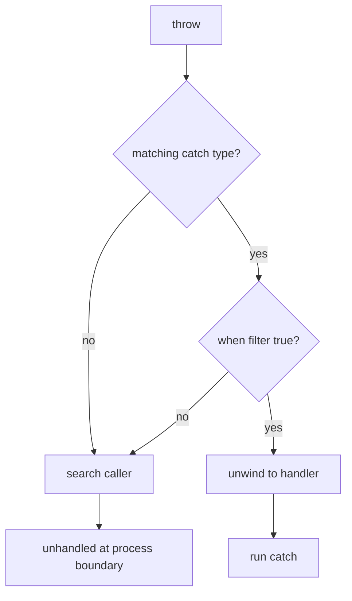

<TLDR>
  <TLDRCell label="what">
    An <Term id="exception">exception</Term> is an object representing an operation that couldn't finish normally. `throw` interrupts the current path, and the runtime looks for a `catch` that can handle it.
  </TLDRCell>
  <TLDRCell label="trap">
    An empty `catch`, `throw ex`, and an overly broad `catch (Exception)` can hide failure, reset the stack's starting point, or treat an unrecoverable error as recoverable.
  </TLDRCell>
  <TLDRCell label="fix">
    Catch only at a boundary that can recover or translate error semantics. Preserve the original stack with `throw;`, and protect required cleanup with `finally`, `using`, or `await using`.
  </TLDRCell>
</TLDR>

## What it is and why it exists

An exception is .NET's typed control flow for reporting a failed operation. An exception object has at least a type and message, and it normally carries a <Term id="stack-trace">stack trace</Term>. A wrapper can retain a lower-level cause through `InnerException`. The caller can use the type to decide whether to recover, translate, or keep propagating the failure.

Ordinary return values are better for expected outcomes in a method's contract, such as "not found" or "invalid input." Exceptions fit when the current operation can't fulfill its contract and the current layer can't handle that result through a normal branch. A failed file read, an operation forbidden by an object's current state, or a violated public-parameter constraint can fall into this category.

`throw` transfers control from the ordinary path to a matching handler. That transfer can cross several method calls, so the discovery site doesn't have to turn a failure immediately into a log entry, status code, or user message. Lower layers describe the technical failure; a boundary with business context decides how to present it or recover.

Exceptions aren't a mechanism that makes every error recoverable. After catching one, the program needs a defined next step: retry an operation known to be retryable, use a valid fallback, translate the failure into a more suitable abstraction, or let it continue after cleanup. Without such an action, catching usually loses information.

## How it works

### The thrown value is an object

A C# `throw` expression must produce an object derived from `System.Exception`. Framework exception types describe common failure categories: use `ArgumentNullException` for a null argument, `ArgumentOutOfRangeException` for an argument outside its allowed range, and often `InvalidOperationException` when an object's current state forbids an operation.

The exception type is part of the API contract. Callers select `catch` clauses with it, and monitoring systems group failures by it. The message explains a particular instance to a person; it isn't a machine-readable error code. Branching on message text makes code depend on wording, locale, and changes in lower-level libraries.

An exception object can carry structured context. Standard properties include `Message`, `StackTrace`, `InnerException`, and `Data`. A custom exception may expose a stable field such as an order ID, but don't put passwords, access tokens, or personal data in messages or properties: exceptions commonly reach logs and telemetry.

### Handler selection

The runtime searches outward from the throw site along the call stack. After one `try`, handlers are checked in source order. A handler runs when the exception type is compatible with the declared type and its optional filter evaluates to `true`. Put specific types before general ones; otherwise the specific branch is unreachable, and the compiler rejects that order.

An <Term id="exception-filter">exception filter</Term> has the form `catch (SomeException error) when (condition)`. It narrows a handler using stable exception properties, such as a parameter name or status code. When the filter returns `false`, the search continues. If the filter itself throws, its exception is treated as a false result and doesn't replace the exception whose handler is being sought.

A filter is evaluated before the stack is unwound for its corresponding `catch`. That lets a debugger see the original state at the throw site. It also explains why a filter shouldn't modify business state, increment a retry counter, or perform fallible I/O. Keep it fast and free of side effects.



"Matching" in the diagram includes inheritance. `ArgumentNullException` is also an `ArgumentException`, and regular .NET exceptions ultimately derive from `Exception`. `catch (Exception)` therefore matches almost everything. It usually belongs at an application boundary, at a site that records and rethrows, or at a boundary that can genuinely translate every failure into one external result.

### Stack unwinding and cleanup

After finding a handler, the runtime leaves the active scopes between the throw site and that handler, a process called stack unwinding. `finally` blocks on that path run, so they can release resources, restore a lock, or undo temporary state. The associated `finally` also runs when the `try` completes normally, returns, or exits because of an exception.

`finally` isn't a durability guarantee. It might not run if the process is forcibly terminated, the runtime calls `Environment.FailFast`, or the machine loses power. Data that must survive process failure needs transactions, atomic writes, or external coordination, not hope placed in `finally`.

Prefer `using` for resources that implement `IDisposable` and `await using` for `IAsyncDisposable`. The compiler lowers these constructs to protected cleanup paths, which are harder to get wrong than handwritten null checks and `finally` blocks. A resource's `Dispose` or `DisposeAsync` can still fail, so the cleanup method's contract also deserves review.

### Catch boundaries

A useful catch site normally knows both how to recover and what semantics the next layer should see. A repository can wrap a database-driver exception in a domain-visible data-access exception. An HTTP boundary can map known domain exceptions into responses, while a background-task boundary can record one final failure. Catching and logging the same exception in every layer only creates duplicate logs.

If the current method can't recover, add stable context, or perform required cleanup, let the exception propagate. The absence of a `throws` declaration doesn't mean a method can't fail; C# doesn't require checked-exception lists. Public APIs should still document the exceptions that callers can reasonably handle.

## Examples

### Select by type and property

The first example keeps argument validation inside the method that performs the operation. The calling boundary catches only the parameter failure it recognizes and uses a filter to confirm that `quantity` failed. `finally` records that every request has left the protected region.

<Depth level="quick">

```csharp title="CatchAndFinally.cs"
using System;

foreach (int quantity in new[] { 2, 0 })
{
    try
    {
        decimal total = CalculateTotal(15m, quantity);
        Console.WriteLine($"total: {total:0.00}");
    }
    catch (ArgumentOutOfRangeException error)
        when (error.ParamName == "quantity")
    {
        Console.WriteLine($"rejected quantity: {quantity}");
    }
    finally
    {
        Console.WriteLine($"finished: {quantity}");
    }
}

static decimal CalculateTotal(decimal unitPrice, int quantity)
{
    if (quantity < 1)
        throw new ArgumentOutOfRangeException(
            nameof(quantity), quantity, "Quantity must be positive.");

    return unitPrice * quantity;
}
```

```text
# not executed here: the .NET SDK and C# compilers are unavailable
```

</Depth>

For quantity `2`, no exception occurs and the `catch` doesn't run, but `finally` still does. For quantity `0`, an `ArgumentOutOfRangeException` carries the parameter name past the ordinary path, the filter accepts it, and the same `finally` performs the final step.

The filter reads `ParamName` instead of matching `Message`. The parameter name is a structured property in the exception's contract. The message primarily serves readers and can vary with the runtime locale.

### Wrap an exception and retain its cause

The import layer knows which order supplied a string, but `FormatException` doesn't. The next example wraps the lower-level parsing failure in `OrderImportException` and stores the original as an <Term id="inner-exception">inner exception</Term>.

```csharp title="WrapException.cs"
using System;
using System.Globalization;

try
{
    decimal total = ReadTotal("B-42", "not-a-price");
    Console.WriteLine(total);
}
catch (OrderImportException error)
{
    Console.WriteLine($"order: {error.OrderId}");
    Console.WriteLine($"failure: {error.Message}");
    Console.WriteLine($"cause: {error.InnerException?.GetType().Name}");
}

static decimal ReadTotal(string orderId, string text)
{
    try
    {
        return decimal.Parse(text, CultureInfo.InvariantCulture);
    }
    catch (FormatException error)
    {
        throw new OrderImportException(
            orderId, $"Invalid total for order {orderId}.", error);
    }
}

public sealed class OrderImportException : Exception
{
    public OrderImportException(
        string orderId, string message, Exception innerException)
        : base(message, innerException)
    {
        OrderId = orderId;
    }

    public string OrderId { get; }
}
```

```text
# not executed here: the .NET SDK and C# compilers are unavailable
```

The custom type gives callers a stable catch target, while `OrderId` avoids parsing context from the message. Passing `innerException` to the base constructor retains the original failure type and stack, so diagnostic tools can show the complete chain of causes.

Add an exception type only when callers need to handle it differently. If an existing `ArgumentException`, `InvalidOperationException`, or `IOException` already states the contract accurately, a project-specific name adds cognitive cost without a useful distinction.

### Let `using` clean up before an outer handler

Keep a resource's scope as small as possible. The next example creates an `ImportSession` inside the `try`. When `Run()` fails, `using` calls `Dispose()` before the exception reaches the outer `catch`.

```csharp title="UsingCleanup.cs"
using System;

try
{
    using var session = new ImportSession();
    session.Run();
}
catch (InvalidOperationException error)
{
    Console.WriteLine($"caught: {error.Message}");
}

public sealed class ImportSession : IDisposable
{
    private bool _disposed;

    public void Run()
    {
        if (_disposed)
            throw new ObjectDisposedException(nameof(ImportSession));

        Console.WriteLine("import started");
        throw new InvalidOperationException("source rejected");
    }

    public void Dispose()
    {
        _disposed = true;
        Console.WriteLine("session disposed");
    }
}
```

```text
# not executed here: the .NET SDK and C# compilers are unavailable
```

The session has already been released when the outer handler starts. This ordering supports a clean division of responsibility: the lower scope always owns cleanup, while the upper layer decides how to report the failure.

If `Dispose()` also throws, the outer layer might see the cleanup failure instead of the original failure from `Run()`. Keep custom disposal logic predictable, and use tests to pin down the policy when a primary failure and cleanup failure occur together.

### Observe several concurrent failures

`await` rethrows a task's recorded failure at the await point. A combined task returned by `Task.WhenAll` stores the exceptions from all input tasks. Directly awaiting it throws only one of them, so code that needs complete diagnostics must also inspect the combined task's `Exception.InnerExceptions`.

```csharp title="WhenAllFailures.cs"
using System;
using System.IO;
using System.Threading.Tasks;

Task inventory = Task.FromException(
    new InvalidOperationException("inventory unavailable"));
Task invoice = Task.FromException(
    new IOException("invoice store unavailable"));

Task all = Task.WhenAll(inventory, invoice);

try
{
    await all;
}
catch (Exception error)
{
    Console.WriteLine($"await observed: {error.GetType().Name}");

    foreach (Exception failure in all.Exception!.InnerExceptions)
    {
        Console.WriteLine(
            $"stored: {failure.GetType().Name}: {failure.Message}");
    }
}
```

```text
# not executed here: the .NET SDK and C# compilers are unavailable
```

The example saves `all` so the `catch` can inspect that same combined task. Writing `await Task.WhenAll(...)` directly still lets you catch one exception, but it leaves no variable from which to read the combined task's properties.

Production code shouldn't depend on which failure `await` chooses to throw. Keep the input tasks and inspect their states when each result matters. If you report a set of failures, define its ordering, deduplication, and external representation.

## Pitfalls

### Swallowing an unknown exception

> [!PITFALL]
> An empty `catch (Exception)` turns programming bugs, environmental faults, and cancellation into apparent success. The caller loses the failure signal, and the log has no throw site to investigate.

**Fix:** Catch only specific types from which this layer can recover. An outer application boundary can catch `Exception` to record a final failure or translate it into a protocol response, but it should end that unit of work after fulfilling the boundary's responsibility instead of continuing with possibly corrupted state.

### Using exceptions for expected branches

> [!PITFALL]
> Calling `Parse` for every invalid form field and catching `FormatException`, or testing dictionary absence with an indexer and `KeyNotFoundException`, disguises normal input states as exceptional paths.

**Fix:** Use explicit APIs such as `TryParse` and `TryGetValue` for common failures, and return the states the caller must distinguish. Absence and malformed input should throw only when the method contract says that a value must exist or be valid.

### Rethrowing with `throw ex`

> [!PITFALL]
> Writing `throw ex;` inside a `catch` resets the stack trace's starting point to that statement. The method that found the error might still appear in partial information, but the most useful original propagation path is truncated.

**Fix:** Write `throw;` to propagate the current exception unchanged. To change abstraction, throw a new exception with `innerException`. To resume propagation elsewhere after leaving the current `catch`, use `ExceptionDispatchInfo.Capture(error).Throw()`.

### Replacing the original failure during cleanup

> [!PITFALL]
> A new exception from `finally` or `Dispose` becomes the exception leaving that scope, so the exception already in flight might no longer be directly observable. Handwritten code that always ignores cleanup failures goes to the other extreme and permanently loses them.

**Fix:** Prefer tested resource types and `using`. Custom cleanup needs an explicit policy for primary and secondary failures: record a cleanup failure this layer can handle, or use a deliberate aggregate result or exception type when both must reach the caller. Don't let incidental replacement define the policy.

### Logging cancellation as a system error

> [!PITFALL]
> `catch (Exception)` also catches `OperationCanceledException`. Generated background jobs often log a user cancellation as an error, trigger a retry, or translate it into a generic exception that loses the original cancellation token.

**Fix:** Define cancellation separately. For expected cancellation of the same unit of work, usually let `OperationCanceledException` reach the task scheduler boundary. If only timeouts are handled, distinguish timeout from caller cancellation using stable conditions and preserve token semantics.

## In the AI era

**What generated code gets wrong here**

Models like to wrap every method in `try/catch (Exception)`, log `Message`, and then write `throw ex;`. One failure is logged repeatedly while its stack is shortened. They also put `decimal.Parse`, dictionary indexing, and file probes on exception-driven normal paths, or perform fallible remote logging in `finally`, where it can replace the original exception. In async code, generated results often inspect only the one exception thrown by `await Task.WhenAll` and miss the other failures stored by the combined task.

**Ask your AI to check**

- List every exception type each `catch` can match and the recovery action the handler performs. Flag branches that only log and continue or return a default.
- Find every `throw ex`, wrapper without an `innerException`, and decision based on `Message` text; propose a version that preserves the stack and structured information.
- Draw task ownership for each `async` call, distinguish failure, caller cancellation, and timeout, and show where all exceptions are retained when concurrent tasks fail.

**Review checklist**

- Exercise success, a known recoverable failure, an unknown failure, and cancellation at each boundary; confirm that it consumes only the category it owns.
- Release resources on normal and exceptional paths, then force cleanup to fail once and verify that it doesn't silently replace the primary diagnostic.
- Trace the final log or response back to the original throwing method; confirm that type, inner exception, and stack survive without exposing sensitive values.

**Prompt vocabulary**

Use precise terms: `exception propagation`（异常传播）, `stack unwinding`（堆栈展开）, `exception filter`（异常筛选器）, `catch boundary`（捕获边界）, `bare rethrow`（无操作数重新抛出）, `stack trace preservation`（堆栈跟踪保留）, `inner exception`（内部异常）, `exception aggregation`（异常聚合）, and `cancellation semantics`（取消语义）. Ask the model why each handler can recover. "Add error handling" usually produces a wider `catch`.

<Depth level="deep">

## Stack traces and rethrowing

When an exception is first thrown, the runtime records a diagnostic path. `StackTrace` shows methods and source locations through which the exception traveled, with details depending on symbols, optimization, and the runtime environment. A stack trace isn't a stable data format, so don't parse it for business decisions. Its value is the route back to the original execution path.

`throw;` is valid only inside a `catch`. It continues propagating the current exception and preserves existing stack information. It also keeps the same object identity and custom properties. This is normally the right rethrow form when the current layer only records a final fault or performs compensation.

`throw error;` is a new throw with an expression. Even when `error` still refers to the same object, the current location becomes the new stack starting point. When this appears in review, ask whether the author intended to create a new throw boundary. Most "log and continue propagating" handlers don't.

### Wrapping changes the abstraction

Wrapping translates lower-level implementation details into the current API's error language. An importer can turn a parser-specific `FormatException` into `OrderImportException`, so callers don't depend on the parsing library. The new message explains the current operation, and the original exception goes into `InnerException`.

Don't wrap again at every layer. A wrapper without new semantics lengthens the cause chain and gives logs and tests brittle assumptions about its depth. An abstraction change, not the number of method calls, determines the boundary.

A custom exception usually ends in `Exception` and provides the message constructor and inner-exception constructor that its real uses require. Add a parameterless constructor only if callers need it. Don't mechanically copy the formatter-based serialization constructor from old templates into .NET 10 code; formatter-based serialization APIs are obsolete.

### Deferred propagation

Sometimes a `catch` must capture an exception now and rethrow it from a different callback or execution phase. `System.Runtime.ExceptionServices.ExceptionDispatchInfo` captures both the exception and its current propagation information. Calling `Throw()` later preserves the original throw site and marks the rethrow boundary in the stack.

It isn't an interprocess transport mechanism, and it doesn't make damaged state safe. Convert a failure into an explicit data record if it must enter a queue or durable store. Exception objects contain runtime object graphs and possibly sensitive details, so they make poor general-purpose message formats.

## Exceptions in async methods

An `async` method returning `Task` or `Task<T>` normally stores an unhandled exception in its returned task. The caller receives that task and observes the failure in its own control flow when it reaches `await`. If nobody awaits the task, the exception might be discovered much later or never reach the intended error boundary.

`async void` has no task for a caller to await and inspect. Its exceptions go to the current synchronization context or a process-level mechanism. Other than event handlers, async APIs should return `Task` or `Task<T>`. Assigning an `async` lambda to a delegate that returns `void` creates the same problem.

Async propagation still needs layered boundaries. Lower-level code doesn't need a `try/catch` merely because it is async; directly awaiting is enough when the only action is propagation. Catch only to recover, add stable context, adjust cancellation semantics, or record the final failure at a boundary.

### Cancellation is not an ordinary fault

An `OperationCanceledException` associated with the token makes a task enter the `Canceled` state, while another unhandled exception makes it `Faulted`. Those states mean different things for retries, monitoring, and user feedback. If a wrapper drops the token or turns cancellation into a plain `Exception`, the combined task might stop behaving as canceled.

A timeout and caller cancellation sometimes share an exception type; the API contract determines how to distinguish them. Review which `CancellationToken` was passed, who triggers it, and whether timeout uses a separate token or exception. The type name in a `catch` isn't enough.

### `Task.WhenAll` retains the aggregate

`Task.WhenAll` doesn't automatically cancel the other tasks when the first one fails. It returns a task that completes only after every input task completes. If any input task fails, the combined task is `Faulted`, and its `Exception` is an `AggregateException` containing the unwrapped input exceptions.

Awaiting the combined task rethrows one exception instead of requiring application code always to catch `AggregateException`. This makes the common single-failure path natural, but it can mislead a reviewer into thinking only one failure occurred. Keep the combined task and inspect its `Exception` when the complete set matters, as the example does.

If no task fails but at least one is canceled, the combined task is `Canceled`. It reaches `RanToCompletion` only when all tasks succeed. Decide whether a caller needs "one overall outcome" or "an outcome per item," then choose between awaiting only the combined task and retaining each input task for inspection.

## Exception types in public contracts

An exception exposed by a public method should correspond to an action the caller can take. An argument exception tells the caller to fix the call, a state exception reports an invalid operation order, and a domain exception can represent a business rejection. Letting every implementation-specific exception escape binds callers to the current implementation.

Conversely, wrapping every failure in `AppException` erases useful distinctions. Callers end up parsing a message or error code and lose the language's native type selection. Before designing a hierarchy, list the genuinely different actions callers take and make the smallest stable classification that supports them.

Exception types also affect compatibility. Introducing a more specific derived exception can usually still be caught by an existing base-type handler, but changing an established exception to an unrelated type can break recovery logic. Contract tests for failure paths matter as much as success tests after a library upgrade.

Don't put an implementation detail in a public type name. `SqlServerOrderException` exposes today's database through a domain API; `OrderStoreUnavailableException` describes a capability failure that callers can understand. Keep the driver exception as the inner exception so diagnostics still show the real implementation fault.

</Depth>

<Checkpoint id="csharp/exceptions" />

## Further reading

- [Exception-handling statements - C# reference](https://learn.microsoft.com/en-us/dotnet/csharp/language-reference/statements/exception-handling-statements)
- [Best practices for exceptions](https://learn.microsoft.com/en-us/dotnet/standard/exceptions/best-practices-for-exceptions)
- [How to create user-defined exceptions](https://learn.microsoft.com/en-us/dotnet/standard/exceptions/how-to-create-user-defined-exceptions)
- [`System.Exception` API](https://learn.microsoft.com/en-us/dotnet/api/system.exception?view=net-10.0)
- [`ExceptionDispatchInfo` API](https://learn.microsoft.com/en-us/dotnet/api/system.runtime.exceptionservices.exceptiondispatchinfo?view=net-10.0)
- [`Task.WhenAll` API](https://learn.microsoft.com/en-us/dotnet/api/system.threading.tasks.task.whenall?view=net-10.0)
