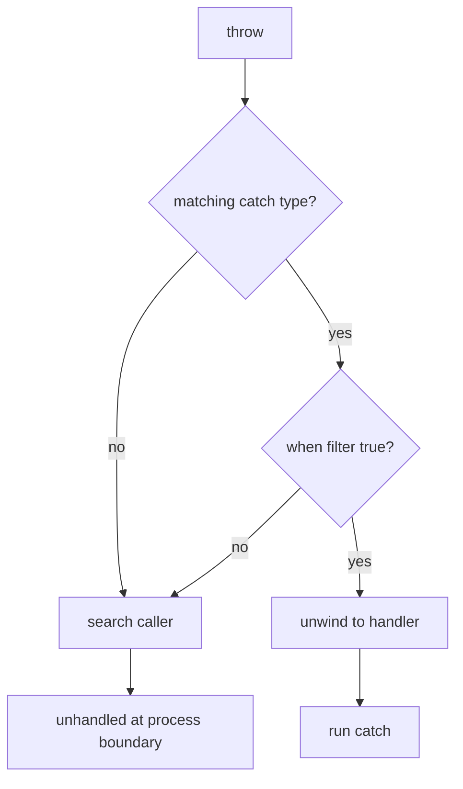

<TLDR>
  <TLDRCell label="what">
    <Term id="exception">异常（exception）</Term>是表示某次操作无法正常完成的对象；`throw` 会中断当前路径，运行时再寻找能够处理它的 `catch`。
  </TLDRCell>
  <TLDRCell label="trap">
    空的 `catch`、`throw ex` 和过宽的 `catch (Exception)` 会分别隐藏失败、重置堆栈起点或把本不该恢复的错误当成可恢复错误。
  </TLDRCell>
  <TLDRCell label="fix">
    只在能恢复或转换错误语义的边界捕获异常；用 `throw;` 保留原始堆栈，用 `finally`、`using` 或 `await using` 保护必须完成的清理。
  </TLDRCell>
</TLDR>

## 是什么，为什么存在

异常是 .NET 用来报告操作失败的一条带类型控制流。异常对象至少包含类型和消息，通常还携带<Term id="stack-trace">堆栈跟踪（stack trace）</Term>；包装异常时还能通过 `InnerException` 保留底层原因。调用方可以按异常类型决定恢复、转换，还是继续向上传播。

普通返回值适合表达方法契约中的预期结果，例如“没有找到”和“输入格式无效”。异常更适合当前操作无法履行契约，而且当前层不能用正常分支完成处理的情况。文件读取失败、对象状态不允许某项操作，以及违反公开参数约束，都可能属于这一类。

`throw` 把控制权从普通路径转移到匹配的处理器。这个转移可以跨越多层方法调用，所以错误不必在发现位置立即变成日志、状态码或用户提示。较低层描述技术失败，知道业务语境的边界再决定如何呈现或恢复。

异常不是“任何错误都能被修好”的机制。捕获发生后，程序必须有明确的下一步：重试一个确认可重试的操作、换用有效回退、把异常转换成更合适的抽象，或者在完成清理后让它继续传播。没有这样的动作，捕获通常只会损失信息。

## 工作原理

### 抛出的是对象

C# 的 `throw` 表达式必须产生派生自 `System.Exception` 的对象。框架异常类型表达常见失败类别：参数为 `null` 用 `ArgumentNullException`，参数超出允许范围用 `ArgumentOutOfRangeException`，对象当前状态不允许操作则常用 `InvalidOperationException`。

异常类型是 API 契约的一部分。调用方会据此选择 `catch`，监控系统也会用类型聚合故障。消息用于解释具体实例，不适合充当机器可读错误码；依靠消息文本分支会受到文案、区域设置和底层库变化影响。

异常对象可以附带结构化上下文。标准属性包括 `Message`、`StackTrace`、`InnerException` 和 `Data`。自定义异常还可以公开订单号等稳定字段，但不要把密码、访问令牌或个人数据塞进消息与属性，因为异常经常会进入日志和遥测。

### 处理器选择

运行时从抛出点沿调用栈向外寻找 `catch`。在同一个 `try` 后，处理器按源码顺序检查；异常类型与声明类型兼容，而且可选筛选器结果为 `true` 时，该处理器才会运行。具体类型应写在通用类型之前，否则更具体的分支无法到达，编译器会拒绝这种顺序。

<Term id="exception-filter">异常筛选器（exception filter）</Term>写成 `catch (SomeException error) when (condition)`。它适合依据异常的稳定属性缩小处理范围，例如只处理特定参数或状态码。筛选器返回 `false` 后，搜索会继续；筛选器自身抛出的异常会被视为 `false`，不会替换正在搜索处理器的异常。

筛选器在对应 `catch` 的堆栈展开之前求值。这一点让调试器仍能看到抛出点的原始状态，也解释了为什么筛选器不应修改业务状态、递增重试计数或执行可能失败的 I/O。它应该是一个快速、无副作用的判断。



图中的“匹配”包含继承关系。`ArgumentNullException` 也是 `ArgumentException`，而所有常规 .NET 异常最终都派生自 `Exception`。因此，`catch (Exception)` 几乎匹配一切；它通常只适合应用边界、记录后重新抛出的位置，或者确实能把所有失败转换成统一外部结果的边界。

### 堆栈展开与清理

找到处理器后，运行时会退出抛出点与处理器之间的活动作用域，这个过程称为堆栈展开。沿途的 `finally` 会运行，所以它适合恢复锁、释放资源或撤销临时状态。`try` 正常结束、执行 `return`，或者因异常离开时，关联的 `finally` 都会执行。

`finally` 不是持久性保证。进程被强制终止、运行时执行 `Environment.FailFast` 或机器失去电源时，它可能没有机会运行。必须跨进程故障保存的数据，应依赖事务、原子写入或外部协调机制，而不是把希望寄托在 `finally` 上。

实现了 `IDisposable` 的资源优先用 `using`，实现了 `IAsyncDisposable` 的资源用 `await using`。编译器会把这些结构转换成受保护的清理路径，代码比手写空值检查与 `finally` 更难出错。资源的 `Dispose` 或 `DisposeAsync` 仍可能失败，所以清理方法本身的契约也需要审查。

### 捕获边界

合适的捕获位置通常知道如何恢复，也知道应该向上一层暴露什么语义。仓储层可以把数据库驱动异常包装成领域可识别的数据访问异常，HTTP 边界可以把已知领域异常映射成响应，后台任务边界则可以记录一次最终失败。每一层都捕获并记录同一个异常，只会制造重复日志。

如果当前方法不能恢复、不能补充稳定上下文，也不需要清理，就让异常自然传播。签名里没有 `throws` 声明不表示方法不会失败；C# 不要求列出检查型异常。公开 API 仍应在文档中说明调用方能够合理处理的异常。

## 示例

### 按类型和属性处理

第一个例子把参数验证放在执行操作的方法中。调用边界只捕获它能识别的参数异常，并用筛选器确认失败来自 `quantity`；`finally` 则记录每次请求都已经离开处理区域。

<Depth level="quick">

```csharp title="CatchAndFinally.cs"
using System;

foreach (int quantity in new[] { 2, 0 })
{
    try
    {
        decimal total = CalculateTotal(15m, quantity);
        Console.WriteLine($"total: {total:0.00}");
    }
    catch (ArgumentOutOfRangeException error)
        when (error.ParamName == "quantity")
    {
        Console.WriteLine($"rejected quantity: {quantity}");
    }
    finally
    {
        Console.WriteLine($"finished: {quantity}");
    }
}

static decimal CalculateTotal(decimal unitPrice, int quantity)
{
    if (quantity < 1)
        throw new ArgumentOutOfRangeException(
            nameof(quantity), quantity, "Quantity must be positive.");

    return unitPrice * quantity;
}
```

```text
# not executed here: the .NET SDK and C# compilers are unavailable
```

</Depth>

数量为 `2` 时没有异常，`catch` 不运行，但 `finally` 仍运行。数量为 `0` 时，`ArgumentOutOfRangeException` 带着参数名越过普通路径，筛选器接受它，然后同一个 `finally` 完成收尾。

筛选器读取 `ParamName`，而不是匹配 `Message`。参数名是异常契约中的结构化属性；消息主要给人阅读，还可能随运行时区域设置变化。

### 包装异常并保留原因

导入层知道字符串来自哪个订单，但 `FormatException` 不知道。下面的代码把低层解析失败包装成 `OrderImportException`，同时把原异常保存为<Term id="inner-exception">内部异常（inner exception）</Term>。

```csharp title="WrapException.cs"
using System;
using System.Globalization;

try
{
    decimal total = ReadTotal("B-42", "not-a-price");
    Console.WriteLine(total);
}
catch (OrderImportException error)
{
    Console.WriteLine($"order: {error.OrderId}");
    Console.WriteLine($"failure: {error.Message}");
    Console.WriteLine($"cause: {error.InnerException?.GetType().Name}");
}

static decimal ReadTotal(string orderId, string text)
{
    try
    {
        return decimal.Parse(text, CultureInfo.InvariantCulture);
    }
    catch (FormatException error)
    {
        throw new OrderImportException(
            orderId, $"Invalid total for order {orderId}.", error);
    }
}

public sealed class OrderImportException : Exception
{
    public OrderImportException(
        string orderId, string message, Exception innerException)
        : base(message, innerException)
    {
        OrderId = orderId;
    }

    public string OrderId { get; }
}
```

```text
# not executed here: the .NET SDK and C# compilers are unavailable
```

自定义类型给调用方一个稳定的捕获目标，`OrderId` 则避免从消息中解析上下文。传给基类构造函数的 `innerException` 保留了原始失败类型和堆栈，诊断工具因此能展示完整原因链。

只有调用方确实需要区别处理时，才值得新增异常类型。若现有 `ArgumentException`、`InvalidOperationException` 或 `IOException` 已准确表达契约，换一个项目专属名字只会增加认知成本。

### 让 `using` 在外层处理前清理

资源的作用域应尽量小。下面在 `try` 内创建 `ImportSession`；`Run()` 失败后，`using` 先调用 `Dispose()`，然后异常才到达外层 `catch`。

```csharp title="UsingCleanup.cs"
using System;

try
{
    using var session = new ImportSession();
    session.Run();
}
catch (InvalidOperationException error)
{
    Console.WriteLine($"caught: {error.Message}");
}

public sealed class ImportSession : IDisposable
{
    private bool _disposed;

    public void Run()
    {
        if (_disposed)
            throw new ObjectDisposedException(nameof(ImportSession));

        Console.WriteLine("import started");
        throw new InvalidOperationException("source rejected");
    }

    public void Dispose()
    {
        _disposed = true;
        Console.WriteLine("session disposed");
    }
}
```

```text
# not executed here: the .NET SDK and C# compilers are unavailable
```

外层处理器开始时，会话已经释放。这个顺序适合“清理始终由低层作用域负责，上层决定如何报告失败”的分工。

若 `Dispose()` 也抛出异常，外层可能看到清理失败，而不是 `Run()` 的原失败。自定义资源应让释放逻辑尽可能可预测，并用测试锁定主失败与清理失败同时发生时的策略。

### 观察并发任务的多个失败

`await` 会在等待点重新抛出任务记录的失败。`Task.WhenAll` 返回的组合任务会保存所有输入任务的异常；直接 `await` 时只会抛出其中一个，因此需要全部诊断信息的代码还要读取组合任务的 `Exception.InnerExceptions`。

```csharp title="WhenAllFailures.cs"
using System;
using System.IO;
using System.Threading.Tasks;

Task inventory = Task.FromException(
    new InvalidOperationException("inventory unavailable"));
Task invoice = Task.FromException(
    new IOException("invoice store unavailable"));

Task all = Task.WhenAll(inventory, invoice);

try
{
    await all;
}
catch (Exception error)
{
    Console.WriteLine($"await observed: {error.GetType().Name}");

    foreach (Exception failure in all.Exception!.InnerExceptions)
    {
        Console.WriteLine(
            $"stored: {failure.GetType().Name}: {failure.Message}");
    }
}
```

```text
# not executed here: the .NET SDK and C# compilers are unavailable
```

这里先保存 `all`，是为了在 `catch` 中检查同一个组合任务。若直接写 `await Task.WhenAll(...)`，仍能捕获一个异常，却失去了读取该组合任务属性的变量。

生产代码不应依赖 `await` 选择哪一个失败作为抛出结果。需要逐项结果时，保留各任务并在组合任务结束后检查状态；需要报告一组失败时，明确规定顺序、去重和对外表示。

## 陷阱

### 吞掉未知异常

> [!PITFALL]
> 空的 `catch (Exception)` 会把编程错误、环境故障和取消都变成表面成功。调用方失去失败信号，日志也没有可定位的抛出点。

**修复方法：** 只捕获可以恢复的具体类型。应用最外层边界可以捕获 `Exception` 以记录最终失败或转换成协议响应，但完成边界职责后应终止该工作单元，而不是继续使用可能已破坏的状态。

### 用异常处理预期分支

> [!PITFALL]
> 对每个无效表单字段调用 `Parse` 再捕获 `FormatException`，或者用字典索引器加 `KeyNotFoundException` 判断缺失，会把正常输入状态伪装成异常路径。

**修复方法：** 对常见失败使用 `TryParse`、`TryGetValue` 等明确 API，并返回调用方需要区分的状态。只有方法契约规定该值必须存在或必须有效时，缺失与格式错误才适合抛出。

### 用 `throw ex` 重新抛出

> [!PITFALL]
> 在 `catch` 中写 `throw ex;` 会把堆栈跟踪的起点重置到这条语句。真正发现错误的方法仍可能出现在部分信息中，但最有用的原始传播路径被截断了。

**修复方法：** 原样继续传播时写 `throw;`。需要改变抽象时，抛出带 `innerException` 的新异常；需要离开当前 `catch` 后在另一处继续传播时，使用 `ExceptionDispatchInfo.Capture(error).Throw()`。

### 在清理中覆盖原异常

> [!PITFALL]
> `finally` 或 `Dispose` 中的新异常会成为离开该作用域的异常，原来正在传播的异常可能因此无法直接观察。手写“清理失败就忽略”的代码则会走向另一个极端，永久丢掉清理故障。

**修复方法：** 优先使用经过测试的资源类型和 `using`。自定义清理逻辑要明确主失败与次失败的策略：能在本层处理的清理错误可以记录；两者都必须交给调用方时，应使用明确的聚合结果或异常类型，而不是偶然覆盖。

### 把取消记录成系统错误

> [!PITFALL]
> `catch (Exception)` 也会捕获 `OperationCanceledException`。生成的后台任务经常因此把用户取消写成错误日志、触发重试，甚至转换成一个丢失原取消令牌的通用异常。

**修复方法：** 单独定义取消策略。收到同一工作单元的预期取消时，通常让 `OperationCanceledException` 传播给任务调度边界；若只处理超时，则用稳定条件区分超时和调用方取消，并保留令牌语义。

<Depth level="deep">

## 堆栈跟踪与重新抛出

异常第一次被抛出时，运行时记录一条诊断路径，`StackTrace` 会展示异常经过的方法与源码位置，具体细节取决于符号、优化和运行环境。堆栈跟踪不是稳定的数据格式，不要解析它来决定业务分支。它的价值在于把失败带回最初执行路径。

`throw;` 只能出现在 `catch` 中，它继续传播当前异常并保留已有堆栈信息。它也保留对象身份和自定义属性。若当前层只是记录一次最终故障或执行补偿，这通常是正确的重新抛出形式。

`throw error;` 是一次带表达式的新抛出。即使 `error` 仍引用同一个对象，当前位置也会成为新的堆栈起点。代码审查看到它时，应先问作者是否真的想制造新的抛出边界；绝大多数“记录后继续”并不需要。

### 包装改变抽象

包装用于把底层实现细节转换成当前 API 的错误语言。比如导入器可以把某个具体解析器的 `FormatException` 转成 `OrderImportException`，调用方因此不必依赖解析库。新异常的消息应解释当前操作，原异常则作为 `InnerException` 传入。

不要在每一层都重新包装。无新语义的包装会让原因链变长，也会给日志与测试制造脆弱的层级假设。边界应当由抽象变化决定，而不是由方法数量决定。

自定义异常通常以 `Exception` 结尾，并至少提供符合实际用途的消息构造函数和带内部异常的构造函数。只有需要时才加无参构造函数。旧模板里的格式化序列化构造函数不应机械复制到 .NET 10 代码中，因为基于格式化程序的序列化 API 已经过时。

### 延迟传播

有时异常必须在当前 `catch` 中捕获，却要在另一个回调或执行阶段重新抛出。`System.Runtime.ExceptionServices.ExceptionDispatchInfo` 会同时捕获异常和当前传播信息；之后调用 `Throw()` 可以保留原抛出位置，并在堆栈中标记重新抛出的边界。

它不是跨进程传输机制，也不会让受损状态恢复正常。若失败要进入消息队列或持久化存储，应转换成明确的数据记录。异常对象包含运行时对象图和潜在敏感信息，不适合作为通用消息格式。

## 异步方法中的异常

返回 `Task` 或 `Task<T>` 的 `async` 方法通常把未处理异常存入返回任务。调用方法本身得到任务，直到 `await` 才在等待方的控制流中观察到失败。忘记等待任务，意味着异常可能晚得多才被发现，或者根本没有进入预期的错误边界。

`async void` 没有返回任务供调用方等待和检查，异常会交给当前同步上下文或进程级处理机制。除事件处理器外，异步 API 应返回 `Task` 或 `Task<T>`。把一个 `async` lambda 赋给返回 `void` 的委托，同样会产生这个问题。

异步异常传播仍需要保留分层边界。低层方法不必为了“异步”而增加 `try/catch`；若只想继续传播，直接 `await` 即可。只有要恢复、增加稳定上下文、调整取消语义或在最终边界记录时才捕获。

### 取消不是普通失败

带有关联令牌的 `OperationCanceledException` 会使任务进入 `Canceled` 状态，而其他未处理异常会使任务进入 `Faulted` 状态。两种状态对重试、监控和用户反馈的含义不同。包装取消时若丢掉原令牌或改成普通 `Exception`，组合任务可能不再表现为取消。

超时和调用方取消有时共享同一个异常类型，具体区别由 API 契约决定。审查时要查看哪个 `CancellationToken` 被传入、由谁触发，以及超时是否通过独立令牌或专用异常表达。不能只看 `catch` 中的类型名称。

### `Task.WhenAll` 保留聚合结果

`Task.WhenAll` 不会因为第一个任务失败就自动取消其他任务。它返回一个在所有输入任务完成后才完成的任务；只要任何输入任务失败，组合任务就是 `Faulted`，其 `Exception` 是包含未包装输入异常的 `AggregateException`。

对组合任务使用 `await` 时，等待表达式会重新抛出一个异常，而不是要求业务代码总是捕获 `AggregateException`。这让单一失败的常见路径更自然，但也容易让审查者误以为只发生了一次失败。需要完整集合时，应像示例那样保留组合任务并检查其 `Exception`。

若没有任务失败，但至少一个任务被取消，组合任务会进入 `Canceled`。全部成功时，它才进入 `RanToCompletion`。调用方应该先决定需要“一次总体成败”还是“每项独立结果”，再选择只等待组合任务，还是同时保留并检查每个输入任务。

## 异常类型与公开契约

公共方法抛出的异常应与调用方能采取的动作对应。参数异常告诉调用方修正调用，状态异常告诉调用方操作顺序不合法，领域异常则可以表示业务上拒绝执行。底层库的每个实现异常都穿透出去，会把调用方绑定到当前实现。

另一方面，把所有错误都包装成 `AppException` 也会抹平有用差异。调用方最终只能解析消息或错误码，失去了语言原生的类型选择。设计异常层次时，先列出调用方真正会采取的不同动作，再给这些动作建立最小的稳定分类。

异常类型还影响兼容性。新增一种更具体的派生异常通常仍能被现有的基类 `catch` 接住，但把原有异常改成无关类型可能破坏恢复逻辑。库升级后，针对异常路径的契约测试与成功路径测试同样重要。

不要把实现细节写进类型名。`SqlServerOrderException` 会让公开领域 API 暴露当前数据库；`OrderStoreUnavailableException` 描述的则是调用方能理解的能力失败。保留底层异常作为内部异常，诊断仍能看到真正驱动程序。

</Depth>

<Checkpoint id="csharp/exceptions" />

## 延伸阅读

- [C# 参考：异常处理语句](https://learn.microsoft.com/en-us/dotnet/csharp/language-reference/statements/exception-handling-statements)
- [.NET 异常最佳实践](https://learn.microsoft.com/en-us/dotnet/standard/exceptions/best-practices-for-exceptions)
- [.NET 指南：创建用户定义异常](https://learn.microsoft.com/en-us/dotnet/standard/exceptions/how-to-create-user-defined-exceptions)
- [`System.Exception` API](https://learn.microsoft.com/en-us/dotnet/api/system.exception?view=net-10.0)
- [`ExceptionDispatchInfo` API](https://learn.microsoft.com/en-us/dotnet/api/system.runtime.exceptionservices.exceptiondispatchinfo?view=net-10.0)
- [`Task.WhenAll` API](https://learn.microsoft.com/en-us/dotnet/api/system.threading.tasks.task.whenall?view=net-10.0)
