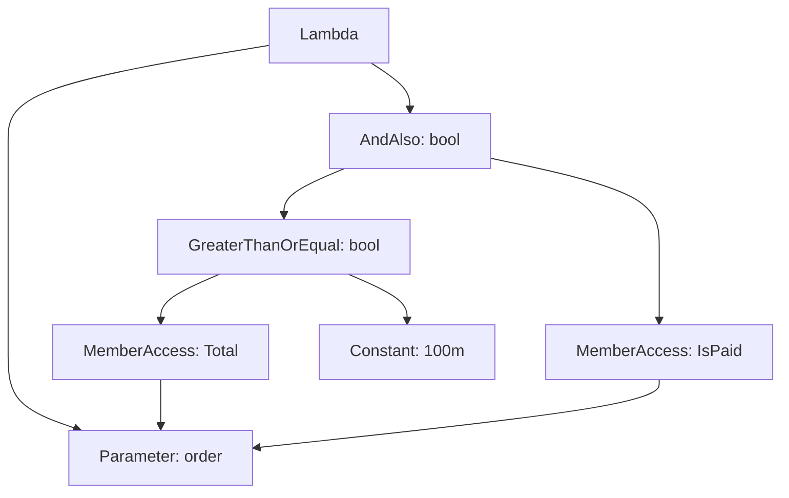

<TLDR>
  <TLDRCell label="what">
    An <Term id="expression-tree">expression tree</Term> is an immutable object graph that represents code structure. `Expression<TDelegate>` lets a consumer inspect, compose, or translate a lambda before executing it.
  </TLDRCell>
  <TLDRCell label="trap">
    A tree that can be constructed isn't necessarily translatable by a query provider. When you compose trees, two `ParameterExpression` objects with the same name still aren't the same parameter.
  </TLDRCell>
  <TLDRCell label="fix">
    Identify the tree's consumer, use only nodes it supports, unify parameter objects when composing predicates, and test translation and results with the real provider.
  </TLDRCell>
</TLDR>

## What it is and why it exists

An expression tree represents a piece of code as runtime objects. Each node describes an <Term id="expression">expression</Term>, such as a constant, parameter, member access, method call, or binary operation; parent nodes refer to child nodes to form a typed tree. It holds code structure, not C# source text or a complete Roslyn syntax tree.

The same lambda produces a different result depending on its target type. When assigned to `Func<Order, bool>`, the compiler creates an immediately callable <Term id="delegate">delegate</Term>; when assigned to `Expression<Func<Order, bool>>`, it creates an object graph that describes the lambda. The latter can't be called directly: a consumer must inspect or translate it, or use `Compile()` to produce a delegate.

This intermediate form lets an API receive what to do without immediately doing it. An `IQueryable<T>` LINQ provider can read filter, projection, and ordering structures, then translate its supported subset into a database query or another target language. Rule combiners, mapping tools, and test frameworks also use expressions to obtain type-safe member information.

Expression trees fit boundaries where the consumer must understand code structure. If you only need to run a callback later, a `Func<>` or `Action<>` is clearer; if you need to analyze whole declarations, statements, comments, or source locations, use Roslyn. Treating an expression tree as a general serialization format for arbitrary C# quickly runs into syntax and version boundaries.

Member and method nodes hold reflection metadata, while constant nodes can refer to arbitrary runtime objects. An expression tree therefore isn't a naturally portable, cross-process data format; a serialization protocol must separately define its permitted nodes and data types.

Immutability describes the links between nodes, not the objects a tree refers to. Changes to a captured object, a property getter's behavior, or backend data can make the same tree produce a different result when it executes later.

Inspecting an expression can also expose sensitive values. Logs and diagnostics should prefer node kinds and approved member identifiers, and record constant contents only after data classification.

## How it works

### Nodes carry static types

Every node derives from `System.Linq.Expressions.Expression`. `NodeType` identifies the node kind, while `Type` is the CLR type produced by evaluating that node; each concrete subclass exposes its own structure. For example, `BinaryExpression` has `Left` and `Right`, while `MethodCallExpression` has a receiver, method information, and arguments.

`Expression<TDelegate>` is a strongly typed lambda node. It derives from `LambdaExpression`, stores formal parameters in `Parameters`, and stores the function body in `Body`. Its generic argument constrains parameter and return types, so an incompatible tree is rejected when the lambda is constructed or earlier.

This diagram expands only the main nodes in `order => order.Total >= 100m && order.IsPaid`. The member and constant nodes' `Type` values participate in type checking the parent operations.



### Compiler conversion and manual construction

When an expression-bodied lambda targets `Expression<TDelegate>`, the C# compiler creates the corresponding nodes. The target type matters because a lambda has no single fixed delegate or expression-tree type on its own. Statement-bodied lambdas, `async` lambdas, and many newer syntax forms can't enter an expression tree through this implicit conversion.

At runtime, factory methods such as `Expression.Parameter`, `Expression.Property`, `Expression.Constant`, and `Expression.AndAlso` can build a tree from its leaves toward its root. The factories check operand types, member ownership, and applicable operators. They aren't string builders: incompatible types usually cause an exception during construction.

The manual construction API is richer than the lambda syntax the compiler can convert. It can create assignment, block, and loop nodes, for example, but that doesn't mean a remote provider supports them. Keep three sets separate: what the API can represent, what the compiler can convert, and what the consumer can process.

### Parameters use object identity

A <Term id="parameter-expression">parameter expression</Term> represents a parameter or local variable in a tree. Its name is only for display and diagnostics; binding depends on the `ParameterExpression` object itself. Two instances with the same name and type still represent different parameters.

When you build a lambda, every free parameter node in its body must be bound by its `Parameters` list. Passing the `Body` values of two independent predicates directly to `Expression.AndAlso` and retaining only the first predicate's parameter leaves the second one unbound. Safe composition rewrites both bodies to refer to one parameter instance.

### Trees are immutable; rewrites make new trees

You can't change an expression node's structure in place. Replacing a parameter or operation creates new nodes and can reuse unchanged old nodes. The original tree remains valid after a rewrite, and a node can safely appear in more than one tree.

An <Term id="expression-visitor">expression visitor</Term> centralizes traversal and rewriting in one type. Derive from `ExpressionVisitor` and override only the relevant `Visit*` methods; the base class recursively visits children and rebuilds a parent when a child changes. A visitor must define how it handles unknown nodes, especially when it is a translator rather than a simple rewriter.

### Execution and translation are different paths

`Compile()` turns an `Expression<TDelegate>` into a `TDelegate`, which then executes as ordinary .NET code. That fits in-memory data, rule execution, and dynamic accessors. If one stable tree will run repeatedly, give the generated delegate an explicit owner and reuse it instead of recompiling it for each element.

`Queryable.Where` accepts `Expression<Func<T, bool>>` and sends the structure to the source's <Term id="query-provider">query provider</Term>. `Enumerable.Where` accepts `Func<T, bool>` and calls it in the current process. A `Compile()` or `AsEnumerable()` call crosses this boundary; later filtering is no longer translated by the remote provider.

A provider promises only its documented subset. A method call that is valid under ordinary C# execution can still produce a database-provider translation error. Correctness tests must cover the real provider path rather than only succeeding against `List<T>.AsQueryable()`.

## Examples

These three examples progress from a compiler-generated tree to runtime construction and then predicate composition with unified parameters. Each was compiled and run with .NET SDK 10.0.400, and every output comes from the actual process.

### Inspecting and executing a compiler-generated tree

The first example reads stable node properties instead of relying on the expression's string format. The `Body` is a short-circuiting conjunction whose left side is an amount comparison.

<Depth level="quick">

```csharp title="inspect-expression.cs"
using System;
using System.Linq.Expressions;

Expression<Func<Order, bool>> qualifies =
    order => order.Total >= 100m && order.IsPaid;

var conjunction = (BinaryExpression)qualifies.Body;
var totalCheck = (BinaryExpression)conjunction.Left;

Console.WriteLine(qualifies.NodeType);
Console.WriteLine(conjunction.NodeType);
Console.WriteLine(totalCheck.NodeType);

var test = qualifies.Compile();
Console.WriteLine(test(new Order(125m, true)));
Console.WriteLine(test(new Order(125m, false)));

public sealed record Order(decimal Total, bool IsPaid);
```

```text
Lambda
AndAlso
GreaterThanOrEqual
True
False
```

</Depth>

`AndAlso` corresponds to conditional `&&` and preserves short-circuit behavior; it differs from the non-short-circuiting or bitwise `And`. Check the node kind before casting to a concrete node because an analyzer that accepts arbitrary input can't assume every function body is binary.

Calling `Compile()` produces an ordinary `Func<Order, bool>`. That delegate runs the described logic, but it no longer exposes traversable structure to a query provider.

### Building a filter from the leaves

The second example receives a minimum price at runtime and creates member accesses for `Price` and `InStock`. Each parent receives child nodes that have already been constructed.

```csharp title="build-filter.cs"
using System;
using System.Linq;
using System.Linq.Expressions;

decimal minimumPrice = 100m;
var product = Expression.Parameter(typeof(Product), "product");
var price = Expression.Property(product, nameof(Product.Price));
var stock = Expression.Property(product, nameof(Product.InStock));

var atLeastMinimum = Expression.GreaterThanOrEqual(
    price,
    Expression.Constant(minimumPrice, typeof(decimal)));
var body = Expression.AndAlso(atLeastMinimum, stock);
var filter = Expression.Lambda<Func<Product, bool>>(body, product);

var products = new[]
{
    new Product("Cable", 20m, true),
    new Product("Keyboard", 120m, true),
    new Product("Monitor", 220m, false),
    new Product("Laptop", 1400m, true)
};

var matches = products.Where(filter.Compile()).Select(item => item.Name);
Console.WriteLine(filter.Body.NodeType);
Console.WriteLine(string.Join(", ", matches));

public sealed record Product(string Name, decimal Price, bool InStock);
```

```text
AndAlso
Keyboard, Laptop
```

`nameof(Product.Price)` avoids an untraceable spelling string, but a truly dynamic API must still map external field names to permitted members. The constant explicitly uses `decimal`, so both sides of the comparison agree. A value received as text also needs parsing and validation against the target type; don't pass it straight to `Expression.Constant`.

This example deliberately compiles the tree and filters an array. If the source were a database `IQueryable<Product>`, pass `filter` directly to `Queryable.Where` and let the provider decide whether it can translate those nodes.

### Composing predicates after unifying parameters

The two independent lambdas each own a parameter object. A visitor replaces both old parameters in the bodies with one new instance before constructing the combined lambda.

```csharp title="combine-filters.cs"
using System;
using System.Linq;
using System.Linq.Expressions;

Expression<Func<Product, bool>> enoughStock = product => product.Stock >= 2;
Expression<Func<Product, bool>> rightCategory = item => item.Category == "hardware";

var parameter = Expression.Parameter(typeof(Product), "product");
var stockBody = new ReplaceParameter(enoughStock.Parameters[0], parameter)
    .Visit(enoughStock.Body)!;
var categoryBody = new ReplaceParameter(rightCategory.Parameters[0], parameter)
    .Visit(rightCategory.Body)!;
var combined = Expression.Lambda<Func<Product, bool>>(
    Expression.AndAlso(stockBody, categoryBody), parameter);

var products = new[]
{
    new Product("Keyboard", "hardware", 3),
    new Product("Cable", "hardware", 1),
    new Product("Manual", "books", 8)
}.AsQueryable();

Console.WriteLine(ReferenceEquals(
    enoughStock.Parameters[0], rightCategory.Parameters[0]));
Console.WriteLine(string.Join(", ", products.Where(combined).Select(p => p.Name)));

public sealed record Product(string Name, string Category, int Stock);

public sealed class ReplaceParameter(
    ParameterExpression source, ParameterExpression target) : ExpressionVisitor
{
    protected override Expression VisitParameter(ParameterExpression node) =>
        node == source ? target : base.VisitParameter(node);
}
```

```text
False
Keyboard
```

The first line proves that the original parameters aren't the same object, although both names read like product parameters. The combined tree binds only the new `parameter`, and the visitor ensures both subtrees refer to it.

The in-memory `EnumerableQuery` can execute this combined tree, but that doesn't prove a database can translate it. Provider integration tests should use the actual database provider and cover empty results, boundary values, and unsupported method calls.

## Pitfalls

### Passing a delegate across a query boundary

> [!PITFALL]
> A generated helper accepts `Func<T, bool>`, so an `IQueryable<T>` call selects an in-memory path, or the code calls `AsEnumerable()` before filtering. The result may be correct while retrieving far more remote data than necessary.

**Fix:** when remote translation is required, accept `Expression<Func<T, bool>>` and preserve `IQueryable<T>` until intentional materialization. Inspect every `AsEnumerable`, `ToList`, and `Compile` location, and use the real provider to observe the execution boundary.

### Composing by parameter name

> [!PITFALL]
> The two `x` parameters in `x => x.Active` and `x => x.Total > 0` don't become bound merely because their names match. Combining their bodies directly leaves the second parameter free, so lambda construction or compilation can fail.

**Fix:** choose one canonical parameter and use an `ExpressionVisitor` to replace other parameters by object identity. Don't just change `Name`, and don't default to `Expression.Invoke`; many remote providers don't support `InvocationExpression`.

### Giving constants the runtime value's type

> [!PITFALL]
> `Expression.Constant(rawValue)` uses the object's current runtime type. Text input doesn't automatically become `decimal`, while untyped `null` can't express every nullable target, so a binary factory can reject the operands.

**Fix:** first obtain the target type from an approved member, then use a controlled conversion policy for enums, nullable types, cultures, and failures. Create an explicitly typed constant, add `Expression.Convert` where necessary, and test `null`, invalid text, and numeric boundaries.

### Equating compilation with translation

> [!PITFALL]
> The fact that `Compile()` can execute a method call doesn't mean a database, search service, or other provider knows how to translate that `MethodInfo`. Testing only against in-memory data hides production translation failures and semantic differences.

**Fix:** maintain an explicit node and method allowlist per provider, and fail fast on unsupported shapes. Integration tests must use the real provider and assert results, parameterization, and query count; handwritten pseudo-SQL output isn't a substitute.

### Using `ToString()` as a structure or cache key

> [!PITFALL]
> An expression's `ToString()` is a diagnostic aid, not a stable serialization protocol. It can omit object identity and captured-value details, and two similar strings don't necessarily represent reusable execution or translation results.

**Fix:** define structural equivalence and value parameterization before caching, then use a controlled structural visitor or a caller-supplied key. Without reliable invalidation and capacity rules, cache a small set of known expressions instead of retaining arbitrary input forever.

## In the AI era

**What generated code gets wrong here:** models often interchange `Func<T, bool>` and `Expression<Func<T, bool>>`, call `Compile()`, and still claim filtering runs in the database. They also combine bodies with unrelated parameters, hide binding trouble behind `Expression.Invoke`, pass unchecked field names to `Expression.Property`, or generate statement bodies, `async`, null propagation, and pattern matching that current expression trees prohibit.

**Ask your AI to check:** ask it to name the exact call where a query chain changes from `IQueryable` to `IEnumerable`; have it map every free `ParameterExpression` to the lambda that binds it; ask for every node, method, and conversion grouped by target-provider support, with a failing test for every uncertain shape.

**Review checklist:**

- Confirm that external fields, operators, and values go through allowlists, type conversion, and error handling.
- Confirm that every parameter node in the composed tree is bound by object identity and that no unverified `Invoke` node remains.
- Compare results, `null` semantics, materialization points, and query counts on both the real provider and the in-memory path.

**Prompt vocabulary:** use `expression tree`, `lambda expression`, `delegate`, `node type`, `parameter identity`, `expression visitor`, `predicate composition`, `query provider`, `client-side evaluation`, and `translation boundary`. Ask for a parameter-binding table and provider support matrix; “optimize this dynamic query” is too vague to expose these faults.

<Depth level="deep">

## Expression shape and provider boundaries

### The compiler conversion boundary

C# 14 still prohibits many syntax forms in compiler-converted expression trees. Common examples include statement-bodied lambdas, `async` lambdas, assignments, `dynamic` operations, null propagation, pattern matching, tuple literals, `switch` expressions, indexes and ranges, and `with` expressions. The compiler issues a diagnostic instead of silently lowering them to older nodes.

These restrictions protect existing consumers. If the compiler suddenly represented every new syntax form with new nodes, already published visitors could misinterpret or omit them. Use the restrictions page as the version reference; don't infer that syntax can convert to `Expression<TDelegate>` merely because it compiles in an ordinary lambda.

The factory API has a different boundary. `Expression.Assign`, `Expression.Block`, and `Expression.Loop` can manually construct trees richer than compiler-converted lambdas, so “the lambda can't spell it” doesn't mean the object model lacks a node. Conversely, successful construction doesn't prove that `Compile(preferInterpretation: true)`, an AOT environment, or a particular query provider can execute the same shape.

### Captured values usually aren't constant nodes

When a lambda refers to a local variable, the compiler commonly stores that variable in a compiler-generated closure object. A typical tree contains a `ConstantExpression` that points to the closure object, wrapped in a `MemberExpression` that reads its field; the local value itself isn't necessarily in `ConstantExpression.Value`.

That shape makes execution timing important. If code changes a captured variable after building a query but before enumerating it, a provider may read the newer value at execution. When the business rule needs a creation-time snapshot, make ownership explicit and test it instead of guessing from how the expression prints.

Many providers recognize common capture shapes and parameterize their values, but that is provider behavior, not an expression-tree guarantee. A custom translator also shouldn't compile and run an arbitrary subtree merely to “get a constant,” because method calls, property getters, and user objects can have side effects.

### `Queryable` preserves a query description

`IQueryable<T>` exposes the element type, an `Expression`, and a `Provider`. A `Queryable.Where` call normally describes the new query with a `MethodCallExpression` containing the source query and predicate; actual execution is deferred until enumeration or a terminal operation.

`IQueryProvider.CreateQuery` creates a new query described by an expression, while `Execute` handles expressions that must immediately produce a result. A provider traverses the complete call chain, validates its supported subset, parameterizes data, and maps target results back. The expression tree supplies structure; it doesn't define SQL, network protocols, or null semantics for the provider.

`AsQueryable()` doesn't create database capability from nowhere. Calling it on an `IEnumerable<T>` normally produces an in-memory query implementation. Converting data back to `IQueryable<T>` after `AsEnumerable()` can't restore the remote translation boundary that was already lost.

Provider errors should identify an unsupported node or method rather than silently switching to client execution. If a product intentionally permits client post-processing, do it after explicit materialization and bound its data volume, authorization boundary, and failure behavior.

### `Quote` and `Invoke` express different intent

A lambda used in a query call often appears below a unary `Quote` node. Quoting means “pass this lambda as data to the receiver,” not “invoke it now.” Before stripping a quote, a visitor should confirm that the surrounding method parameter expects an expression tree.

`Expression.Invoke`, by contrast, creates an `InvocationExpression` that calls another expression from within the tree. A compiled delegate can execute it, but remote providers often don't support that node. Parameter substitution usually matches translator expectations better when composing predicates.

Inlining must still preserve lexical binding and evaluation count. If an argument expression has side effects, copying it to several parameter-use sites changes behavior. A general inliner must count uses and introduce a temporary when needed; a utility that only substitutes parameters in pure predicates should state that narrow contract.

### Failures happen at different stages

A compiler conversion failure appears as a C# diagnostic, such as a statement-bodied lambda not being convertible. Manual construction failures usually surface as `ArgumentException` or `InvalidOperationException` from a factory because types, members, or operators don't match. Both happen before a provider sees the tree.

Local `Compile()` can also reject some shapes while producing a delegate. A remote provider may not translate and fail until query creation, enumeration, `Count()`, or another terminal operation. Error handling and tests must reach the operation that actually triggers execution.

Diagnostics should include the failing node's `NodeType`, static `Type`, relevant `MemberInfo`, and position in the query chain. Don't log constant values or the full expression by default because either can contain personal data, tokens, or business secrets.

### Public APIs must name the consumer

A public method that accepts `Expression<Func<T, bool>>` should say whether it compiles, inspects, rewrites, or forwards the expression, and name the provider when applicable. Only then can callers choose legal methods and understand when errors occur. Saying only “accepts a lambda” hides the essential distinction between delegates and expression trees.

If an API needs only a member selector, validate that the body is an approved member access rather than accepting any expression and ignoring other shapes. A narrow contract produces earlier, clearer errors and reduces the risk of treating side-effecting method calls as metadata.

When returning a rewritten expression, document whether parameter objects, captured objects, and custom extension nodes are retained. Tree immutability doesn't make ownership irrelevant; storing a tree for a long time still extends the lifetime of objects it references.

### A visitor's return value is the rewrite

`ExpressionVisitor.Visit` returns an expression. Calling `Visit(child)` and discarding its return value performs analysis traversal but doesn't reconnect the rewritten child to its parent. An override must return its replacement node or let the base class update the original node with visited children.

Even a parameter-replacement visitor needs a scope boundary. If the subtree contains a nested lambda that declares the same parameter instance, blind replacement can change that lambda's binding. A general implementation should decide whether to stop when it enters a lambda declaring the source parameter, while a one-level predicate utility should state its constrained shape.

Translators and rewriters need different policies for unknown nodes. A rewriter can often delegate to the base implementation and preserve a node; a translator that can't prove semantics should throw `NotSupportedException` with node details. Continuing query generation after skipping an unknown node is riskier than an explicit failure.

Immutability guarantees only that the node topology doesn't change. `ConstantExpression.Value` can still refer to mutable objects, and members or methods can observe external state at execution. Cache, concurrency, and security designs must not read “immutable tree” as “pure, stable result.”

### Types, lifting, and nulls

A binary node records more than `NodeType`. It can also hold the `MethodInfo` implementing the operation and whether the operation is lifted to nullable types. User-defined operators, enums, and `Nullable<T>` make “the sides look close enough” insufficient evidence of correct semantics.

A dynamic filter should normalize its field, operator, and value before constructing nodes. For `Nullable<T>`, distinguish a null comparison, conversion of a non-null underlying value, and the database's own three-valued logic. One `Expression.Convert` can't paper over every difference.

A call node likewise depends on an exact `MethodInfo`. Taking the first overload by name is brittle; select the intended overload by parameter types and include that method in provider support checks. C# 14 overload-resolution changes can also make similar source produce a different method node, so upgrades need regression checks of both tree shape and real translation.

### Compilation, caching, and ownership

`Compile()` creates a delegate for a lambda tree. Hold it at a known reuse boundary, such as an immutable rule object or static registry; don't recompile one tree for every collection element, request, or recursive node visit.

Caching an arbitrary expression retains its whole object graph and constant references. A tree that captures a service, request object, or large collection can keep those objects reachable when placed in a long-lived cache. The cache design must define keys, capacity, lifetime, and invalidation together.

Only measurements from the actual workload can show whether a compilation cache justifies its complexity. For remote queries, most work may happen in provider translation and backend execution; caching a local delegate doesn't optimize that path. Identify the consumer before choosing the cache layer.

### An untrusted filter is an input language

Letting clients submit field names, operators, and literal values means designing a small query language. Expression trees provide typed construction tools, but they don't automatically restrict readable members, callable methods, query complexity, or data permissions. Build the allowlist from the public filtering contract, not from everything reflection can find.

Pass values as data for the provider to parameterize; don't concatenate them into SQL or another target text. A custom translator also shouldn't use `Compile()`, `DynamicInvoke()`, or reflection getters to execute arbitrary nodes from an untrusted tree in pursuit of a supposed constant.

Bound composition depth, collection size, and backend operations as well. A huge, type-correct `OrElse` tree can still impose excessive translation or query work. Syntax allowlists, authorization rules, and resource limits are three separate checks.

### Testing structure, behavior, and translation

Structure tests are useful for checking a visitor's resulting `NodeType`, `MethodInfo`, and parameter-object relationships. Don't use the full `ToString()` as a golden file because it is a diagnostic representation, not a specified serialization. Cover root replacement, nested lambdas, unknown nodes, and reuse of unchanged subtrees in custom visitors.

Behavior tests compile the tree to a delegate and cover ordinary values, boundaries, `null`, and exceptions. That verifies .NET execution semantics but not remote translation. Provider tests must separately run the real implementation and inspect returned results and executed queries.

Even when both paths pass, verify that their semantics agree. String comparison, dates, rounding, nullable booleans, and custom methods are common sources of differences between memory and a backend. If consistency isn't part of the contract, document the difference at the API boundary instead of leaving callers to infer it.

</Depth>

<Checkpoint id="csharp/expression-trees" />

## Further reading

- [Microsoft Learn: expression tree data structures](https://learn.microsoft.com/en-us/dotnet/csharp/advanced-topics/expression-trees/expression-trees-explained)
- [Microsoft Learn: build expression trees](https://learn.microsoft.com/en-us/dotnet/csharp/advanced-topics/expression-trees/expression-trees-building)
- [Microsoft Learn: translate expression trees](https://learn.microsoft.com/en-us/dotnet/csharp/advanced-topics/expression-trees/expression-trees-translating)
- [Microsoft Learn: expression tree restrictions](https://learn.microsoft.com/en-us/dotnet/csharp/language-reference/compiler-messages/expression-tree-restrictions)
- [Microsoft Learn: `ExpressionVisitor` API](https://learn.microsoft.com/en-us/dotnet/api/system.linq.expressions.expressionvisitor?view=net-10.0)
- [Microsoft Learn: `IQueryProvider` API](https://learn.microsoft.com/en-us/dotnet/api/system.linq.iqueryprovider?view=net-10.0)
