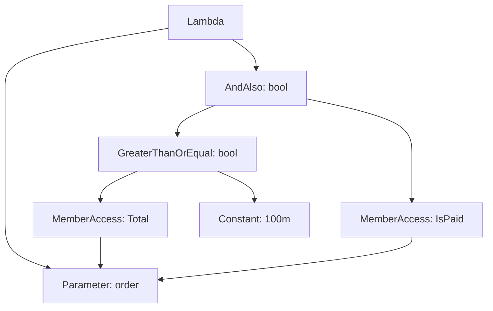

<TLDR>
  <TLDRCell label="what">
    <Term id="expression-tree">表达式树（expression tree）</Term>是表示代码结构的不可变对象图。`Expression<TDelegate>`让调用方在执行lambda前检查、组合或翻译它。
  </TLDRCell>
  <TLDRCell label="trap">
    能构造成表达式树不等于查询提供程序能翻译它。拼接树时，名称相同的`ParameterExpression`也不是同一个参数。
  </TLDRCell>
  <TLDRCell label="fix">
    先确定树交给谁消费，只使用其支持的节点；组合谓词时统一参数对象，并用真实提供程序测试翻译和结果。
  </TLDRCell>
</TLDR>

## 是什么，为什么存在

表达式树把一段代码表示成运行时对象。每个节点描述一个<Term id="expression">表达式（expression）</Term>，例如常量、参数、成员访问、方法调用或二元运算；父节点引用子节点，形成有类型的树。它保存的是代码结构，不是C#源文本，也不是完整的Roslyn语法树。

同一段lambda会因目标类型不同而产生不同结果。赋给`Func<Order, bool>`时，编译器创建可直接调用的<Term id="delegate">委托（delegate）</Term>；赋给`Expression<Func<Order, bool>>`时，编译器创建描述lambda的对象图。后者还不能直接调用，需要先由消费者检查、翻译，或通过`Compile()`生成委托。

这种中间表示让一个API接收“要做什么”，而不必立刻执行它。`IQueryable<T>`的LINQ提供程序可以读取筛选、投影和排序结构，再把受支持的部分翻译成数据库查询或其他目标语言。规则组合器、映射工具和测试框架也会用表达式取得类型安全的成员信息。

表达式树适合消费者必须理解代码结构的边界。如果只需要稍后执行回调，直接使用`Func<>`或`Action<>`更清楚；如果需要分析整个声明、语句、注释或源码位置，应使用Roslyn。把表达式树当成任意C#的通用序列化格式，会很快遇到语法和版本边界。

树中的成员与方法节点持有反射元数据，常量节点还可以引用任意运行时对象。因此，表达式树不是天然可跨进程传输的纯数据格式；序列化协议需要另行定义允许的节点和数据类型。

不可变描述的是节点之间的连接，不保证树所引用的对象不可变。捕获对象变化、属性getter的行为或后端数据更新，都可能让同一棵树在稍后执行时得到不同结果。

检查表达式也可能接触敏感值。日志与诊断应优先记录节点种类和允许的成员标识，只有经过数据分类后才记录常量内容。

## 工作原理

### 节点带着静态类型

所有节点都派生自`System.Linq.Expressions.Expression`。`NodeType`表示节点种类，`Type`表示该节点求值后的CLR类型；具体派生类再暴露自己的结构。例如，`BinaryExpression`有`Left`与`Right`，`MethodCallExpression`有目标对象、方法信息与实参。

`Expression<TDelegate>`是强类型的lambda节点。它继承自`LambdaExpression`，通过`Parameters`保存形参列表，通过`Body`保存函数体。泛型实参约束了形参与返回类型，因此不匹配的树会在lambda创建或编译前被拒绝。

下面的图只展开`order => order.Total >= 100m && order.IsPaid`的主要节点。成员节点和常量节点的`Type`参与上层运算的类型检查。



### 编译器转换与手动构建

当表达式体lambda的目标类型是`Expression<TDelegate>`时，C#编译器创建相应节点。目标类型很关键，因为lambda本身没有一个固定的委托或表达式树类型。语句体lambda、`async` lambda以及多种较新的语法不能通过这种隐式转换进入表达式树。

运行时也可以使用`Expression.Parameter`、`Expression.Property`、`Expression.Constant`和`Expression.AndAlso`等工厂方法从叶子向根构建树。工厂方法会检查操作数类型、成员归属和可用运算符。它们不是字符串拼接器，类型不兼容通常会在建树时抛出异常。

手动构建API比编译器允许转换的lambda语法更丰富。例如，它能创建赋值、块和循环节点，但这不意味着某个远程提供程序支持这些节点。需要同时区分“API能表示”“编译器能转换”和“消费者能处理”三个集合。

### 参数看对象标识

<Term id="parameter-expression">参数表达式（parameter expression）</Term>代表树中的一个参数或局部变量。它的名称只用于显示和诊断；绑定关系取决于`ParameterExpression`对象本身。同名、同类型的两个实例仍代表两个不同参数。

构建lambda时，函数体中的每个自由参数节点都必须由`Parameters`列表绑定。把两个独立谓词的`Body`直接交给`Expression.AndAlso`，再只保留第一个谓词的参数，会让第二个参数处于未绑定状态。安全组合需要把两个函数体改写为引用同一个参数实例。

### 树不可变，改写会产生新树

表达式节点的结构不可原地修改。要替换一个参数或操作，代码会创建新节点，并复用没有变化的旧节点。这种不可变性让原树在改写后仍然有效，也让节点可以安全地出现在多个树中。

<Term id="expression-visitor">表达式访问器（expression visitor）</Term>把遍历和改写集中在一个类型中。继承`ExpressionVisitor`后，只重写关心的`Visit*`方法；基类递归访问子节点，并在子节点变化时重建父节点。访问器必须明确处理未知节点，尤其是在它充当翻译器而不是简单改写器时。

### 执行和翻译是两条路径

`Compile()`把`Expression<TDelegate>`变成`TDelegate`，随后按普通 .NET代码执行。它适合内存数据、规则执行或动态访问器。若同一棵稳定的树会多次执行，应明确拥有并复用生成的委托，而不是在每个元素上重复编译。

`Queryable.Where`接收`Expression<Func<T, bool>>`，把结构交给源的<Term id="query-provider">查询提供程序（query provider）</Term>。`Enumerable.Where`接收`Func<T, bool>`并在当前进程中调用它。一次`Compile()`或`AsEnumerable()`会跨过这条边界，后续筛选不会再由远程提供程序翻译。

提供程序只承诺自己的受支持子集。普通C#执行完全合法的方法调用，仍可能让数据库提供程序报告无法翻译。正确性测试必须覆盖真实提供程序的执行路径，不能只在`List<T>.AsQueryable()`上通过。

## 示例

下面三个例子依次展示编译器生成的树、运行时建树，以及参数统一后的谓词组合。它们都已使用 .NET SDK 10.0.400编译并运行，输出来自实际进程。

### 检查并执行编译器生成的树

第一个例子只读取几个稳定属性，而不依赖表达式的字符串格式。`Body`是短路与节点，左侧又是金额比较节点。

<Depth level="quick">

```csharp title="inspect-expression.cs"
using System;
using System.Linq.Expressions;

Expression<Func<Order, bool>> qualifies =
    order => order.Total >= 100m && order.IsPaid;

var conjunction = (BinaryExpression)qualifies.Body;
var totalCheck = (BinaryExpression)conjunction.Left;

Console.WriteLine(qualifies.NodeType);
Console.WriteLine(conjunction.NodeType);
Console.WriteLine(totalCheck.NodeType);

var test = qualifies.Compile();
Console.WriteLine(test(new Order(125m, true)));
Console.WriteLine(test(new Order(125m, false)));

public sealed record Order(decimal Total, bool IsPaid);
```

```text
Lambda
AndAlso
GreaterThanOrEqual
True
False
```

</Depth>

`AndAlso`对应条件`&&`，保留短路语义；它不同于按位或非短路的`And`。向下转换具体节点前应先检查种类，面向任意输入的分析器不能假定每个函数体都是二元表达式。

调用`Compile()`后得到普通`Func<Order, bool>`。这个委托执行的是表达式描述的逻辑，但它不再向查询提供程序暴露可遍历的结构。

### 从叶子构建筛选器

第二个例子在运行时得到最低价格，并为`Price`与`InStock`创建成员访问。每个父节点都接收已经构造好的子节点。

```csharp title="build-filter.cs"
using System;
using System.Linq;
using System.Linq.Expressions;

decimal minimumPrice = 100m;
var product = Expression.Parameter(typeof(Product), "product");
var price = Expression.Property(product, nameof(Product.Price));
var stock = Expression.Property(product, nameof(Product.InStock));

var atLeastMinimum = Expression.GreaterThanOrEqual(
    price,
    Expression.Constant(minimumPrice, typeof(decimal)));
var body = Expression.AndAlso(atLeastMinimum, stock);
var filter = Expression.Lambda<Func<Product, bool>>(body, product);

var products = new[]
{
    new Product("Cable", 20m, true),
    new Product("Keyboard", 120m, true),
    new Product("Monitor", 220m, false),
    new Product("Laptop", 1400m, true)
};

var matches = products.Where(filter.Compile()).Select(item => item.Name);
Console.WriteLine(filter.Body.NodeType);
Console.WriteLine(string.Join(", ", matches));

public sealed record Product(string Name, decimal Price, bool InStock);
```

```text
AndAlso
Keyboard, Laptop
```

`nameof(Product.Price)`避免了一个无来源的拼写字符串，但真正的动态API仍需先把外部字段名映射到允许的成员。常量显式使用`decimal`类型，使比较两侧一致。来自文本的值还需要按目标类型解析并验证，不能直接塞进`Expression.Constant`。

这里故意编译后对数组执行筛选。若源是数据库`IQueryable<Product>`，应把`filter`直接传给`Queryable.Where`，并让提供程序决定能否翻译这些节点。

### 统一参数后组合谓词

两个独立lambda各有自己的参数对象。访问器把两个函数体中的旧参数都替换成新实例，然后才创建组合lambda。

```csharp title="combine-filters.cs"
using System;
using System.Linq;
using System.Linq.Expressions;

Expression<Func<Product, bool>> enoughStock = product => product.Stock >= 2;
Expression<Func<Product, bool>> rightCategory = item => item.Category == "hardware";

var parameter = Expression.Parameter(typeof(Product), "product");
var stockBody = new ReplaceParameter(enoughStock.Parameters[0], parameter)
    .Visit(enoughStock.Body)!;
var categoryBody = new ReplaceParameter(rightCategory.Parameters[0], parameter)
    .Visit(rightCategory.Body)!;
var combined = Expression.Lambda<Func<Product, bool>>(
    Expression.AndAlso(stockBody, categoryBody), parameter);

var products = new[]
{
    new Product("Keyboard", "hardware", 3),
    new Product("Cable", "hardware", 1),
    new Product("Manual", "books", 8)
}.AsQueryable();

Console.WriteLine(ReferenceEquals(
    enoughStock.Parameters[0], rightCategory.Parameters[0]));
Console.WriteLine(string.Join(", ", products.Where(combined).Select(p => p.Name)));

public sealed record Product(string Name, string Category, int Stock);

public sealed class ReplaceParameter(
    ParameterExpression source, ParameterExpression target) : ExpressionVisitor
{
    protected override Expression VisitParameter(ParameterExpression node) =>
        node == source ? target : base.VisitParameter(node);
}
```

```text
False
Keyboard
```

第一行证明原始参数不是同一对象，虽然两个名称看起来都像商品参数。组合树只绑定新的`parameter`，而访问器保证两个子树都引用它。

内存中的`EnumerableQuery`可以执行这个组合树，但不能证明数据库也能翻译它。提供程序集成测试应使用实际数据库提供程序，并覆盖空结果、边界值与不受支持的方法调用。

## 陷阱

### 把委托传到查询边界

> [!PITFALL]
> 生成的辅助方法接收`Func<T, bool>`，于是`IQueryable<T>`调用选择了内存执行路径，或者代码先调用`AsEnumerable()`再筛选。结果可能正确，却读取了远端本可过滤的大量数据。

**修复方法：** 需要远程翻译时，让API接收`Expression<Func<T, bool>>`并保持`IQueryable<T>`，直到刻意物化。检查每个`AsEnumerable`、`ToList`和`Compile`的位置，并用真实提供程序查看执行边界。

### 只按参数名称组合

> [!PITFALL]
> `x => x.Active`与另一个`x => x.Total > 0`中的两个`x`不会因名称相同而自动绑定。直接拼接函数体会留下第二个自由参数，创建或编译lambda时就可能失败。

**修复方法：** 选择一个规范参数，并用`ExpressionVisitor`按对象标识替换其他参数。不要只改`Name`，也不要默认使用`Expression.Invoke`；许多远程提供程序不支持`InvocationExpression`。

### 用运行时值的类型创建常量

> [!PITFALL]
> `Expression.Constant(rawValue)`使用对象当前的运行时类型。字符串输入不会自动变成`decimal`，而`null`在没有显式类型时也不能表达每个可空目标，二元工厂因而可能拒绝操作数。

**修复方法：** 先从允许的成员取得目标类型，再用受控转换处理枚举、可空类型、区域格式和失败策略。创建带明确类型的常量，必要时添加`Expression.Convert`，并测试`null`、无效文本与数值边界。

### 把能编译等同于能翻译

> [!PITFALL]
> `Compile()`能执行某个方法调用，并不表示数据库、搜索服务或其他提供程序知道如何翻译该`MethodInfo`。只在内存数据上测试，会掩盖生产查询的翻译异常或语义差异。

**修复方法：** 为每个提供程序维护明确的节点与方法白名单，对不支持的形状快速失败。集成测试要走真实提供程序，并断言结果、参数化和查询次数；不要用手写的伪SQL输出代替验证。

### 用`ToString()`当结构或缓存键

> [!PITFALL]
> 表达式的`ToString()`主要用于诊断，不是稳定的序列化协议。它可能遗漏对象标识与捕获值细节，两个相似字符串也不一定代表可共享的执行或翻译结果。

**修复方法：** 缓存前先定义等价关系与值参数化策略，再使用受控的结构访问器或调用方提供的键。若没有可靠失效与容量策略，先缓存少量已知表达式，而不是把任意输入永久保留。

<Depth level="deep">

## 表达式形状与提供程序边界

### 编译器转换的边界

C# 14仍然不允许多种语法出现在编译器转换的表达式树中。常见例子包括语句体lambda、`async` lambda、赋值、`dynamic`操作、空传播、模式匹配、元组字面量、`switch`表达式、索引与范围，以及`with`表达式。编译器会给出对应诊断，而不是悄悄把它们改写成旧节点。

这些限制保护已有消费者。若编译器突然用新节点表示每个新语法，已经发布的访问器可能错误解释或遗漏它们。限制页面是版本核对依据；不要根据普通lambda能通过编译，就推断同一语法能转换成`Expression<TDelegate>`。

工厂API的边界不同。`Expression.Assign`、`Expression.Block`和`Expression.Loop`可以手动构造比编译器转换更丰富的树，因此“lambda写不出来”不等于对象模型没有节点。反过来，创建成功也不代表`Compile(preferInterpretation: true)`、AOT环境或某个查询提供程序都能执行同一形状。

### 捕获值通常不是常量节点

lambda引用局部变量时，编译器通常会把该变量放进编译器生成的闭包对象。树中常见的形状是一个指向闭包对象的`ConstantExpression`，外面再套读取字段的`MemberExpression`；局部值本身未必直接成为`ConstantExpression.Value`。

这解释了执行时机的重要性。构建查询后、枚举查询前修改被捕获变量，提供程序可能在执行时读取新值。若业务需要创建时快照，应把快照所有权写清楚并测试，而不是从表达式的外观猜测。

许多提供程序识别常见捕获形状并把值参数化，但这是提供程序行为，不是所有表达式树的保证。自定义翻译器也不能为了“求出常量”就编译并执行任意子树，因为方法调用、属性getter或用户对象可能带来副作用。

### `Queryable`保存查询描述

`IQueryable<T>`同时暴露元素类型、`Expression`与`Provider`。调用`Queryable.Where`时，新查询通常用一个`MethodCallExpression`描述调用，源查询和谓词作为其组成部分；真正执行会延迟到枚举或终结操作。

`IQueryProvider.CreateQuery`创建由表达式描述的新查询，`Execute`处理需要立即产生结果的表达式。提供程序需要遍历整条调用链、验证支持范围、参数化数据，并把目标结果映射回来。表达式树只提供结构，不替提供程序定义SQL、网络协议或空值语义。

`AsQueryable()`也不会凭空添加数据库能力。对`IEnumerable<T>`调用它通常得到内存查询实现；把已经通过`AsEnumerable()`拉回的数据再转成`IQueryable<T>`，不能恢复之前丢失的远程翻译边界。

提供程序错误应该说明无法处理的节点或方法，而不是默默切到客户端执行。若产品确实允许客户端后处理，应在明确物化之后进行，并对数据量、权限边界和失败行为设限。

### `Quote`与`Invoke`表示不同意图

查询调用中的lambda经常出现在`Quote`一元节点下面。引用表示“把这段lambda当作数据交给接收方”，而不是现在调用它。访问器剥掉引用前，应确认外层方法参数确实要求表达式树。

`Expression.Invoke`则创建`InvocationExpression`，表示在树中调用另一个表达式。编译后的委托可以执行它，但远程提供程序经常不支持这个节点。组合谓词时进行参数替换，通常比引入调用节点更符合翻译器预期。

内联也需要保持词法绑定和求值次数。若实参表达式有副作用，简单地把它复制到参数的多个使用位置会改变行为。通用内联器必须计算使用次数，并在需要时引入临时变量；只处理纯谓词参数替换的工具应把窄契约写清楚。

### 失败发生在不同阶段

编译器转换失败会以C#诊断出现，例如语句体lambda无法转换。手动建树失败通常由工厂方法抛出`ArgumentException`或`InvalidOperationException`，原因可能是类型、成员或运算符不匹配。这两类问题都发生在提供程序看到树之前。

本地`Compile()`还可能在生成委托时拒绝某些形状。远程提供程序则可能在创建查询、枚举、调用`Count()`或其他终结操作时才翻译并失败。错误处理和测试必须覆盖真正触发执行的时点。

诊断应记录失败节点的`NodeType`、静态`Type`、相关`MemberInfo`，以及它位于查询链的哪一层。不要默认记录常量值或完整表达式字符串，因为其中可能包含个人数据、令牌或业务机密。

### 公开API要说明谁消费表达式

接收`Expression<Func<T, bool>>`的公开方法应说明表达式会被编译、检查、改写还是转交给哪个提供程序。调用方只有知道消费者，才能选择合法方法并理解异常何时出现。仅写“支持lambda”会掩盖委托和表达式树之间的关键差异。

若API只需要成员选择器，应验证函数体是允许的成员访问，而不是接受任意表达式后忽略其他形状。窄契约能给出更早、更清楚的错误，也减少把带副作用的方法调用当元数据的风险。

返回改写后的表达式时，还应说明是否保留参数对象、捕获对象和自定义扩展节点。表达式树不可变不等于所有权无关；长期保存一棵树仍会延长其中引用对象的生命周期。

### 访问器的返回值就是改写结果

`ExpressionVisitor.Visit`返回一个表达式。只调用`Visit(child)`却丢弃返回值，会让分析遍历发生，但不会把替换后的子树接回父节点。重写方法应返回替换节点，或者让基类用已访问的子节点更新原节点。

参数替换访问器看似简单，也要限定作用域。若被替换的子树内部又声明了同一个参数实例，盲目替换可能改变嵌套lambda的绑定。通用实现应在进入声明该参数的lambda时决定是否停止，或只处理已知的一层谓词形状。

翻译器与重写器对未知节点的策略不同。重写器常可委托给基类并保留节点；翻译器若不能证明语义，应抛出带节点信息的`NotSupportedException`。跳过未知节点后继续生成查询，风险比明确失败更大。

不可变只保证节点拓扑不会改变。`ConstantExpression.Value`仍可引用可变对象，成员和方法也可以在执行时观察外部状态。缓存、并发和安全设计不能把“树不可变”误读成“树的结果纯净且稳定”。

### 类型、提升与空值

二元节点不只记录`NodeType`。它还可能记录实现运算的`MethodInfo`，以及运算是否被提升到可空类型。自定义运算符、枚举和`Nullable<T>`会使“左右类型看起来接近”仍不足以证明语义正确。

动态筛选器应先规范化字段、操作符和值，再构造节点。对于`Nullable<T>`，需要区分空值比较、非空底层值转换，以及数据库自身的三值逻辑。不能靠一次`Expression.Convert`掩盖全部差异。

方法调用同样依赖精确`MethodInfo`。按名称取第一个重载很脆弱；应按参数类型选择预期重载，并把所选方法纳入提供程序支持检查。C# 14的重载解析变化也可能让相似源码产生不同方法节点，因此升级时应回归检查树形和真实翻译。

### 编译、缓存与所有权

`Compile()`会为lambda树创建委托。调用方应在已知复用边界持有它，例如不可变规则对象或静态注册表；不要在每个集合元素、每次请求或每次递归访问节点时重新编译同一棵树。

缓存任意表达式会保留整棵对象图及其常量引用。捕获服务、请求对象或大集合的树被放入长期缓存后，这些对象也可能长期可达。缓存设计必须同时定义键、容量、生命周期和失效规则。

只有测量真实工作负载后，才能决定编译缓存是否值得复杂度。对于远程查询，主要工作可能发生在提供程序翻译与后端执行；缓存本地委托并不能优化那条路径。先确认消费方式，再选择缓存层。

### 不可信筛选条件是一种输入语言

允许客户端提交字段名、操作符和文字值，相当于设计一个小型查询语言。表达式树提供类型化构造工具，却不会自动限制可以读取的成员、方法调用、查询复杂度或数据权限。允许列表应以公开筛选契约为依据，而不是以反射能找到什么为依据。

值应作为数据交给提供程序参数化，不能拼接进SQL或其他目标文本。自定义翻译器也不应通过`Compile()`、`DynamicInvoke()`或反射getter执行来自不可信树的任意节点来取得所谓常量。

还要限制组合深度、集合大小和可触发的后端操作。一个类型正确的巨大`OrElse`树仍可能造成过重的翻译或查询工作。语法白名单、授权规则与资源上限是三个独立检查。

### 测试结构、行为和翻译

结构测试适合验证访问器是否产生预期`NodeType`、`MethodInfo`和参数对象关系。不要把完整`ToString()`当黄金文件，因为它是诊断表示，不是规范序列化。对自定义访问器，应覆盖根节点替换、嵌套lambda、未知节点与不变子树复用。

行为测试把树编译为委托，并覆盖正常值、边界值、`null`与异常。这能验证 .NET执行语义，却不能验证远程翻译。提供程序测试必须单独运行真实实现，并检查返回结果和发生的查询。

两条路径都通过时，仍要确认语义一致。字符串比较、日期、舍入、可空布尔值和自定义方法最容易在内存与后端之间分歧。若一致性不是契约，应把差异写在API边界，而不是留给调用方猜测。

</Depth>

<Checkpoint id="csharp/expression-trees" />

## 延伸阅读

- [Microsoft Learn：表达式树的数据结构](https://learn.microsoft.com/en-us/dotnet/csharp/advanced-topics/expression-trees/expression-trees-explained)
- [Microsoft Learn：构建表达式树](https://learn.microsoft.com/en-us/dotnet/csharp/advanced-topics/expression-trees/expression-trees-building)
- [Microsoft Learn：转换表达式树](https://learn.microsoft.com/en-us/dotnet/csharp/advanced-topics/expression-trees/expression-trees-translating)
- [Microsoft Learn：表达式树限制](https://learn.microsoft.com/en-us/dotnet/csharp/language-reference/compiler-messages/expression-tree-restrictions)
- [Microsoft Learn：`ExpressionVisitor` API](https://learn.microsoft.com/en-us/dotnet/api/system.linq.expressions.expressionvisitor?view=net-10.0)
- [Microsoft Learn：`IQueryProvider` API](https://learn.microsoft.com/en-us/dotnet/api/system.linq.iqueryprovider?view=net-10.0)
