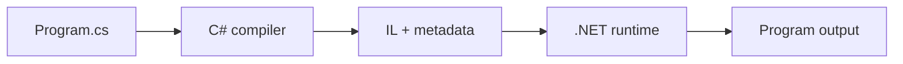

<TLDR>
  <TLDRCell label="what">
    A C# program combines statically typed values, expressions that produce values, statements that perform actions, and methods that package behavior; the compiler checks that they fit together before the program runs.
  </TLDRCell>
  <TLDRCell label="trap">
    A destination variable's type doesn't change how intermediate expressions are calculated, and `var` isn't dynamic; integer division, overflow, and null values are easy to miss as a result.
  </TLDRCell>
  <TLDRCell label="fix">
    State input and output types first, trace expressions, branches, and loops step by step, then exercise every control-flow path with boundary inputs.
  </TLDRCell>
</TLDR>

## What it is and why it exists

C# is a statically typed language that runs on .NET. Source code declares what type data has, which operations are allowed, and in what order the program performs those operations. The compiler checks those constraints before producing a program for the .NET runtime to execute.

The fundamentals are composition rules, not a catalog of keywords. An <Term id="expression">expression</Term> calculates and produces a value, as in `quantity * unitPrice`; a <Term id="statement">statement</Term> performs an action, such as declaring a variable, calling a method, choosing a branch, or repeating code. A method packages statements as a named operation with inputs and an output.

These rules solve two problems. First, the compiler rejects type mismatches, reads before assignment, and invalid control flow before the program runs. Second, readers can infer behavior from local declarations and control flow instead of guessing what a name might become at runtime.

You meet these building blocks in every C# program. Command-line tools, web APIs, desktop applications, and test projects have different outer frameworks, but their methods still consist of variables, expressions, branches, loops, and calls. The related topics cover copy semantics, collection APIs, and exception policy in their own right.

## How it works

### Execution starts at an entry point

A C# application has one entry point. Modern console projects let you write executable statements directly at file scope by default; these are <Term id="top-level-statement">top-level statements</Term>. The compiler generates an entry method for them. Existing codebases also commonly declare `static Main` explicitly, and both forms follow the same expression and statement rules.

A project can contain multiple `.cs` files, but only one file can contain top-level statements. In that file, `using` directives must precede the top-level statements, while type and namespace declarations follow them. Top-level statements remove ceremony from small examples; libraries and larger applications still place most behavior in types and methods.

The path from source code to output can be reduced to the following flow. The compiler produces intermediate language (IL) and type metadata, then the .NET runtime loads them and generates machine code suitable for the current platform as execution proceeds. The diagram omits build configuration, assembly loading, and optimization details but keeps the boundaries needed to classify failures.



| Stage | Problems it can reveal | Typical evidence |
| --- | --- | --- |
| Edit and compile | Syntax, name binding, types, and some control-flow errors | Compiler diagnostics |
| Program startup | Configuration, dependency, and entry-point failures | Startup errors and logs |
| Input processing | Null, format, range, and business-rule failures | Test results and exceptions |
| Continued operation | State, resource, and concurrency failures | Metrics, traces, and fault records |

One line of code can cross several stages. A method call must first pass overload and type checks, but the selected method can still throw for a particular input. Naming the stage precisely makes the repair point easier to find than saying only that “the code doesn't work.”

Syntax and type errors happen during compilation. Problems caused by input, null values, or out-of-range access usually happen while the program runs. Keeping those stages separate matters: adding runtime tests can't make invalid source compile, and successful compilation doesn't make every input safe.

### Variables have fixed static types

A variable binds a name to values of one type. `int quantity = 3;` declares the type, name, and initial value at once; you can later assign another `int` to `quantity`, but not a string. Use `const` for a compile-time value that can't be reassigned afterward.

`var` uses <Term id="type-inference">type inference</Term> to determine a static type from the initializer. In `var total = 12.5m;`, `total` is still a fixed `decimal`, not a container whose type can change. `var` needs an initializer because there is no right-hand expression to infer from otherwise.

A local variable must be definitely assigned along every reachable path before it is read. The compiler analyzes branches: if a variable is assigned on only one side of an `if`, reading it immediately after the branch might not compile. Fields and array elements receive default values, but a default value isn't necessarily meaningful to the business.

C# value types and reference types have different copy semantics, and nullable value types differ from nullable reference annotations. Here, a type is the contract the compiler uses to check operations. Continue with `csharp/data-types` when you need to reason about shared objects after assignment, boxing, or safe conversions.

### Expressions calculate from operand types

Literals, variable reads, method calls, and operator combinations can all form expressions. Each expression has a type, and an outer expression continues from its inner results. The right side of an assignment is fully evaluated before its result is converted or stored in the variable on the left.

That order explains common intermediate-value bugs. In `double ratio = completed / total;`, if both operands are `int`, integer division happens before the result is converted to `double`. To preserve a fraction, convert at least one operand to a floating-point type before division.

Operator precedence determines how an expression groups, while evaluation order determines when its parts run. Parentheses can make grouping explicit, but they don't change operand types by themselves. For mixed arithmetic, label the type of each subexpression before reasoning about the eventual destination type.

`&&` and `||` use <Term id="short-circuit-evaluation">short-circuit evaluation</Term>. `left && right` skips the right side when the left side is `false`; `left || right` skips it when the left side is `true`. This safely places a null check before member access, but hiding a required side effect on the right makes execution paths hard to reason about.

### Statements shape control flow

Declaration statements create local variables; expression statements perform assignments, calls, or increment operations; selection statements choose a path; and iteration statements repeat a block. Braces form blocks, and a local name declared in a block usually can't be used outside it. Indentation helps people read, but syntax determines scope.

Use `if` to conditionally execute code and `if` / `else` to choose one of two mutually exclusive paths. A `switch` statement runs actions for cases, while a `switch` expression produces a value from a matching arm. Pattern matching can further deconstruct types and data shapes, but basic code should first make branch coverage clear.

A `for` loop suits counting when initialization, condition, and step are explicit. A `foreach` loop reads sequence elements one at a time, `while` checks before each iteration, and `do` / `while` runs at least once. `break` ends the nearest loop, `continue` advances to its next iteration, and `return` ends the whole method.

Choose a loop that communicates its termination condition instead of chasing the shortest spelling. During review, trace zero, one, and multiple iterations separately. Check the index start, strict versus inclusive comparison, and whether every continuing path advances the state.

### Methods create small contracts

A method declares a return type, a name, and a parameter list. Callers supply arguments compatible with the parameter types, and the method returns a value of its declared type when its work finishes; `void` means there is no result value. A clear signature tells the compiler and caller what a call needs and promises.

Parameters and names declared inside a method are local to that invocation. Default parameter passing copies the argument's value; for a reference-type argument, the value being copied is the reference, not the object. `ref`, `out`, and `in` change those passing rules, but basic code doesn't need them unless an API explicitly requires aliasing.

Methods with the same name can be overloaded with different parameter lists. The compiler selects an applicable member using the arguments available at the call site, so too many similar overloads can introduce ambiguity or unintended conversions. For beginner code, one named operation with clear parameter meanings is more valuable than compressing logic into a clever expression.

A method is also a control-flow boundary. Parameter validation normally belongs near its entry. When the contract can't be met, the method can return an explicit failure result or throw an appropriate exception; normal results leave through `return`. That failure choice belongs to the API contract, and `csharp/exceptions` covers its details.

## Examples

### Calculate an order from typed values

The first program uses top-level statements to combine a quantity, unit price, and tax rate. Every literal has a type: `3` is an `int`, while a decimal literal with the `m` suffix is a `decimal`.

<Depth level="quick">

```csharp title="OrderTotal.cs"
// # not executed here: .NET SDK is not installed in the local environment.
using System;
using System.Globalization;

const decimal TaxRate = 0.20m;
int quantity = 3;
decimal unitPrice = 19.95m;

decimal subtotal = quantity * unitPrice;
decimal total = subtotal * (1 + TaxRate);

Console.WriteLine($"items: {quantity}");
Console.WriteLine($"subtotal: {subtotal.ToString("F2", CultureInfo.InvariantCulture)}");
Console.WriteLine($"total: {total.ToString("F2", CultureInfo.InvariantCulture)}");
```

```text
items: 3
subtotal: 59.85
total: 71.82
```

</Depth>

Multiplication converts the `int` quantity to a representation that can participate in `decimal` arithmetic, and the result is a `decimal`. Parentheses make the tax step's grouping visible; `1` can also be converted implicitly before it is added to `TaxRate`.

Formatting explicitly uses `InvariantCulture`, so the decimal separator doesn't change with the host's locale. Real money code also needs currency, scale, and rounding policies. This example shows how expressions compose; it doesn't make those business decisions.

### Validate each input in a loop

The second program treats external text as input that can fail. `TryParse` returns a Boolean and supplies the parsed integer through an `out` parameter when successful. Parse failures and nonpositive values both follow the rejection branch.

```csharp title="QuantityValidation.cs"
// # not executed here: .NET SDK is not installed in the local environment.
using System;

string[] requestedQuantities = ["2", "0", "many", "5"];
int acceptedUnits = 0;

foreach (string text in requestedQuantities)
{
    if (!int.TryParse(text, out int quantity) || quantity <= 0)
    {
        Console.WriteLine($"rejected: {text}");
        continue;
    }

    acceptedUnits += quantity;
    Console.WriteLine($"accepted: {quantity}");
}

Console.WriteLine($"accepted units: {acceptedUnits}");
```

```text
accepted: 2
rejected: 0
rejected: many
accepted: 5
accepted units: 7
```

`foreach` executes the block once for every string in the array. The failure branch uses `continue`, so that iteration never reaches the addition. Only a successfully parsed positive quantity reaches `acceptedUnits += quantity`.

The left side of the condition runs `TryParse` first. When parsing fails, `||` has already determined that the whole condition is `true`, so it skips the range check on the right. The compiler knows `quantity` has been assigned on the path that continues afterward.

### Package a rule with a method and `switch`

The third program moves shipping rules into a method. The call site needs only a zone and subtotal, the signature guarantees a `decimal` result, and a `switch` expression makes each arm produce the fee directly.

```csharp title="ShippingRules.cs"
// # not executed here: .NET SDK is not installed in the local environment.
using System;
using System.Globalization;

string[] zones = ["local", "regional", "remote"];
decimal subtotal = 42m;

foreach (string zone in zones)
{
    decimal fee = CalculateShipping(zone, subtotal);
    Console.WriteLine($"{zone}: {fee.ToString("F2", CultureInfo.InvariantCulture)}");
}

static decimal CalculateShipping(string zone, decimal subtotal)
{
    return zone switch
    {
        "local" => 0m,
        "regional" => subtotal >= 50m ? 0m : 5m,
        "remote" => 12.50m,
        _ => throw new ArgumentOutOfRangeException(nameof(zone))
    };
}
```

```text
local: 0.00
regional: 5.00
remote: 12.50
```

The three known zones each match one arm. The `regional` arm uses a conditional expression to decide whether shipping is free. The sample subtotal is below `50m`, so the arm returns `5m`.

The final discard pattern `_` covers every other input and rejects an unknown zone explicitly. Without that arm, the compiler couldn't prove that this `switch` expression always produces a value. Production code must also decide whether zone text is case-sensitive and how to present the error at its boundary.

### Combine parsing, branches, and methods

The final program processes three order lines. It reuses the previous input-validation shape, calls a small method to calculate each valid line, and reports the sum after the loop.

```csharp title="OrderSummary.cs"
// # not executed here: .NET SDK is not installed in the local environment.
using System;
using System.Globalization;

(string Sku, string Quantity, decimal UnitPrice)[] lines =
[
    ("A-10", "2", 9.50m),
    ("B-20", "oops", 4m),
    ("C-30", "3", 2.25m)
];

decimal grandTotal = 0m;

foreach (var line in lines)
{
    if (!int.TryParse(line.Quantity, out int quantity) || quantity <= 0)
    {
        Console.WriteLine($"{line.Sku}: invalid quantity");
        continue;
    }

    decimal lineTotal = CalculateLineTotal(quantity, line.UnitPrice);
    grandTotal += lineTotal;
    Console.WriteLine($"{line.Sku}: {Money(lineTotal)}");
}

Console.WriteLine($"grand total: {Money(grandTotal)}");

static decimal CalculateLineTotal(int quantity, decimal unitPrice) => quantity * unitPrice;
static string Money(decimal value) => value.ToString("F2", CultureInfo.InvariantCulture);
```

```text
A-10: 19.00
B-20: invalid quantity
C-30: 6.75
grand total: 25.75
```

The tuple array gives every position a name, and `var line` still has that static tuple type. The invalid second line neither calls the calculation method nor changes the total. The first and third lines contribute `19.00` and `6.75`, respectively.

The two small methods separate calculation from display rules. That boundary makes each behavior easier to test, but a real order must also validate negative prices, quantity limits, currency, and overflow policy. Basic syntax can express rules; the domain contract still decides whether they are complete.

## Pitfalls

### Looking only at the destination type

> [!PITFALL]
> `double average = total / count;` looks as if it requests a floating-point result, but two `int` operands perform integer division first. Similarly, two `int` values can overflow during multiplication before the damaged result is stored in a `long`.

**Fix:** label each subexpression's type from the inside out and convert an operand before the operation, as in `(double)total / count` or `checked((long)quantity * unitPrice)`. Don't treat a wider variable on the left as protection for earlier operations.

### Treating `var` as a dynamic type

> [!PITFALL]
> `var` infers one type at compile time. Generated code sometimes starts with `var result = 0;` and later assigns a `decimal` or string, as if the variable's type followed its value.

**Fix:** inspect the exact type established by the initializer. Spell the type when it isn't obvious or its domain meaning matters more than its construction syntax. If several states are genuinely needed, represent them with a clear domain type instead of falling back to `object`.

### Hiding required work in a Boolean expression

> [!PITFALL]
> `isCached || RefreshCache()` can skip the call on the right because `||` short-circuits. If refreshing is required work, putting it in the condition makes behavior depend on the left value and easy to change accidentally during refactoring.

**Fix:** let conditions make decisions and put required work in its own statement. Depend on short-circuiting only when the right side should be conditional, such as checking `customer is not null` before accessing a member.

### Running one iteration too many or too few

> [!PITFALL]
> The last valid array index is `Length - 1`, so `index <= items.Length` goes out of range on its final iteration. Conversely, mechanically changing a closed business interval to `<` can omit its endpoint.

**Fix:** write down the first item, last item, and empty-input behavior. Prefer `foreach` when visiting every element. When an index is necessary, `index < items.Length` is the usual bound; test inputs with lengths `0`, `1`, and several items.

### Replacing boundary validation with null suppression

> [!PITFALL]
> The `!` beside a nullable-reference warning only silences the compiler; it doesn't check or repair `null` at runtime. Generated code often applies it directly to `Console.ReadLine()!`, deserialized results, or database fields.

**Fix:** validate required values where they enter the system, use nullable types for legitimate absence, and make branches cover the missing path. Use `!` only when the program has already established an invariant the compiler can't infer, and prove that invariant with a test.

### Making a method signature wider than its contract

> [!PITFALL]
> Accepting `object`, returning `null`, or controlling behavior with several Boolean parameters lets invalid combinations pass compilation. The method must then recover information the caller could have expressed through casts and hidden conventions.

**Fix:** use the most specific required parameter types and a return type that preserves every state callers must distinguish. Use an enum or separate methods when a behavior mode has a name. Public boundaries must still validate ranges and formats that static types can't express.

<Depth level="deep">

## Evaluation order doesn't remove side effects

C# generally evaluates expression operands from left to right. Method arguments are also evaluated in source order before control enters the called method. That rule explains behavior, but compressing several state changes into one expression still makes review harder.

Increment operators expose the difference clearly. `current++` produces the old value and then updates the variable; `++current` updates first and produces the new value. As standalone statements they leave the same final state, but when embedded in a larger expression they produce values at different times.

A method call can read the clock, advance an enumerator, mutate an object, or perform I/O, so repeated calls aren't necessarily equivalent. Generated code often writes `LoadOrder() is not null ? LoadOrder().Total : 0m`, which calls twice. Store the result in a clearly typed local before validating and using it to separate one-time work from pure calculation.

Short-circuit operators introduce specified execution paths, not optimization hints. Whether the right side runs is part of the language semantics, so its exceptions and side effects might never occur. When reviewing a complex condition, treat each operand as a step with preconditions and confirm that skipping it satisfies the contract.

## The compiler proves language rules

Definite-assignment analysis rejects a read of a local variable that might not have been assigned. It follows reachable control flow and doesn't understand arbitrary business facts. Even when a human knows a configuration always makes one branch true, the compiler can require the other path to assign the variable or leave early.

Nullable-reference analysis is also a static proof. It tracks null state through paths visible to the compiler, but it can't validate data supplied by a database, reflection, deserialization, or an assembly with nullable context disabled. A cleared warning means the code satisfies the analysis rules, not that boundary data has been cleaned.

Range constraints usually exceed what a static type expresses as well. `int quantity` allows negative numbers, zero, and large positives, while an order quantity might allow only `1` through a business maximum. The method entry needs runtime validation, and tests must cover both sides of each boundary.

Compiler errors, warnings, and tests answer different questions. An error says the program violates a language or type rule, a warning identifies a risk worth review, and a test proves observable behavior for given inputs. Reliable code needs all three; none substitutes for the others.

## Control flow determines where names are valid

Braces do more than organize layout: they create local scopes. A name declared in a branch block isn't visible when the block ends, and a loop variable is generally valid only within its loop. This prevents temporary state from leaking into unrelated code, but shared results must be declared outside and assigned on every path.

The scope of a pattern variable depends on expressions and control flow. In `value is string text && text.Length > 0`, the right side runs only after the pattern succeeds, so `text` is available there. Replacing `&&` with an unsuitable operator breaks that guarantee, and the compiler rejects a possibly unassigned read.

`return`, `throw`, `break`, and `continue` change which later statements are reachable. Guard clauses can end invalid paths early, reduce nesting, and leave stronger invariants for the remaining code. Too many exits can scatter cleanup, so resource lifetimes belong in `using` or an explicit `finally`.

Don't trace generated code only once using its sample input. Mark every exit first, then follow each entry condition to an exit and record where variables acquire valid values. This method finds missing branches as well as handling code that exists syntactically but can never be reached.

## Overload selection happens at compile time

For an overloaded call, the compiler first gathers visible members with the matching name and determines which candidates accept the supplied arguments. It then chooses a better member from those applicable candidates. Without one unique result, the call is a compilation error rather than a choice deferred randomly to runtime.

A variable's static type participates in that process. Even when a reference points to a more specific runtime object, ordinary overload selection uses the static types and conversions visible at the call site. Virtual overriding determines which implementation runs after a signature has been selected; it isn't the same as overload selection.

Optional parameters and implicit numeric conversions can enlarge the candidate set. If generated code adds a seemingly convenient overload, an existing call can become ambiguous or bind to a different signature. Changes to public overloads therefore require compiling callers and running targeted tests, not merely checking the new method in isolation.

For beginner code, method names and parameter types should communicate intent plainly. When a call produces an unexpected result, ask the editor for the signature actually bound and list the implicit conversions involved. That turns a vague claim that “runtime chose the wrong method” into a verifiable compile-time decision.

## From source code to runtime failure

The compiler parses syntax, binds names and methods, checks types and control flow, then emits IL and metadata. Overload selection and most implicit conversions are fixed here. If the source doesn't pass this stage, there is no program for the runtime to “try.”

The .NET runtime loads assemblies and executes their IL. Common implementations compile methods to native code when needed, but the exact strategy belongs to the runtime. A JIT compiler can't guess away language-level integer division, branch selection, or exception behavior.

Runtime failures come from a valid program meeting a state that violates a precondition, such as passing malformed text to `Parse`, accessing an out-of-range index, or dereferencing `null`. Static types can't exclude every such case because values arrive from files, networks, users, or other processes.

Classify the stage before debugging. Start a compile failure from the earliest syntax or type diagnostic. For a runtime failure, retain the exception type, message, and stack trace, then construct the triggering input. Clear stages prevent asking an AI to repair a compile error with `try` / `catch` or suppress a real input problem with a cast.

</Depth>

<Checkpoint id="csharp/fundamentals" />

## Further reading

- [General structure of a C# program](https://learn.microsoft.com/en-us/dotnet/csharp/fundamentals/program-structure/)
- [The C# type system](https://learn.microsoft.com/en-us/dotnet/csharp/fundamentals/types/)
- [C# operators and expressions](https://learn.microsoft.com/en-us/dotnet/csharp/language-reference/operators/)
- [Selection statements](https://learn.microsoft.com/en-us/dotnet/csharp/language-reference/statements/selection-statements)
- [Iteration statements](https://learn.microsoft.com/en-us/dotnet/csharp/language-reference/statements/iteration-statements)
- [Methods](https://learn.microsoft.com/en-us/dotnet/csharp/methods)
