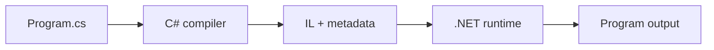

<TLDR>
  <TLDRCell label="what">
    C# 程序由带静态类型的值、产生值的表达式、执行动作的语句和封装行为的方法组成；编译器会在运行前检查它们能否合法组合。
  </TLDRCell>
  <TLDRCell label="trap">
    目标变量的类型不会改变中间表达式的计算方式，`var` 也不会变成动态类型；整数除法、溢出和空值常因此被忽略。
  </TLDRCell>
  <TLDRCell label="fix">
    先写清输入与输出类型，再逐步跟踪表达式、分支和循环，并用边界输入验证每条控制流路径。
  </TLDRCell>
</TLDR>

## 是什么，为什么存在

C# 是在 .NET 上运行的静态类型语言。源代码声明数据是什么类型、允许执行哪些操作，以及程序按什么顺序执行这些操作。编译器先检查这些约束，再生成交给 .NET 运行时执行的程序。

语言基础不是一张关键字清单，而是一套组合规则。<Term id="expression">表达式（expression）</Term>计算并产生值，例如 `quantity * unitPrice`；<Term id="statement">语句（statement）</Term>执行动作，例如声明变量、调用方法、选择分支或重复执行代码。方法把一组语句包装成有名称、有输入和输出的操作。

这些规则解决两个问题。第一，编译器能在程序运行前拒绝类型不匹配、未赋值读取和不可达写法。第二，读代码的人可以从局部声明和控制流推断行为，而不必猜测某个名称在运行时会变成什么。

你会在每个 C# 程序中遇到这些构件。命令行工具、Web API、桌面应用和测试项目的外层框架不同，但方法内部仍由变量、表达式、分支、循环与调用构成。数据类型的复制语义、集合 API 和异常策略分别由关联主题继续展开。

## 工作原理

### 程序从入口点开始

C# 应用只有一个入口点。现代控制台项目默认允许把可执行语句直接写在文件顶层，这些叫作<Term id="top-level-statement">顶级语句（top-level statement）</Term>。编译器会为它们生成入口方法；已有代码库也常显式声明 `static Main`，两种形式都遵循同一套表达式和语句规则。

一个项目可以有多个 `.cs` 文件，但只能有一个文件包含顶级语句。该文件中的 `using` 指令必须位于顶级语句之前，类型与命名空间声明则放在顶级语句之后。小示例使用顶级语句可以减少样板代码，库和大型应用仍会把大部分行为放进类型与方法。

从源代码到输出的关系可以简化为下面这条路径。编译器产生中间语言（IL）和类型元数据，.NET 运行时加载它们，并在执行时生成适合当前平台的机器代码。图中省略了构建配置、程序集加载和优化细节，但保留了理解错误阶段所需的边界。



| 阶段 | 能发现的问题 | 典型证据 |
| --- | --- | --- |
| 编辑与编译 | 语法、名称绑定、类型与部分控制流问题 | 编译器诊断 |
| 程序启动 | 配置、依赖与入口点问题 | 启动错误和日志 |
| 处理输入 | 空值、格式、范围与业务规则问题 | 测试结果和异常 |
| 持续运行 | 状态、资源与并发问题 | 指标、跟踪和故障记录 |

同一行代码可能跨越多个阶段。例如，方法调用必须先通过编译器的重载与类型检查，但被调用方法仍可能根据输入抛出异常。准确描述阶段，比笼统地说“代码不工作”更容易找到修复位置。

语法或类型错误发生在编译阶段，因输入、空值或越界访问触发的问题通常发生在运行阶段。区分这两个阶段很重要：增加运行时测试不能让无效源码通过编译，而通过编译也不等于所有输入都安全。

### 变量有固定的静态类型

变量把名称绑定到某种类型的值。`int quantity = 3;` 同时声明类型、名称和初始值；之后可以给 `quantity` 赋另一个 `int`，却不能直接赋字符串。`const` 适合编译期已知且之后不能重新赋值的值。

`var` 使用<Term id="type-inference">类型推断（type inference）</Term>从初始化表达式确定静态类型。`var total = 12.5m;` 中，`total` 仍然是固定的 `decimal`，不是可以随意换类型的容器。`var` 需要初始化值，因为没有右侧表达式就没有可推断的类型。

局部变量在读取前必须沿每条可达路径完成明确赋值。编译器会分析分支：如果某个变量只在 `if` 的一侧赋值，分支之后直接读取它可能无法编译。字段和数组元素有默认值，但这并不代表默认值一定符合业务含义。

C# 的值类型与引用类型具有不同的复制语义，可空值类型与可空引用注解也有不同机制。这里把类型看作编译器检查操作的契约；需要判断赋值后是否共享对象、何时装箱或怎样安全转换时，应继续阅读 `csharp/data-types`。

### 表达式先按操作数类型计算

字面量、变量读取、方法调用和运算符组合都可以形成表达式。表达式本身有类型，外层表达式根据内层结果继续计算。赋值语句右侧会先完整求值，最后才把结果转换或存入左侧变量。

这个顺序解释了常见的中间值错误。`double ratio = completed / total;` 中，如果两个操作数都是 `int`，除法先执行整数除法，之后才把结果转换成 `double`。要保留小数，必须在除法前把至少一个操作数转换成浮点类型。

运算符优先级决定表达式怎样分组，求值顺序决定这些部分何时运行。括号可以明确分组，却不会自动改变操作数类型。遇到混合算术时，先标出每个子表达式的类型，再讨论最后的目标类型。

`&&` 和 `||` 使用<Term id="short-circuit-evaluation">短路求值（short-circuit evaluation）</Term>。`left && right` 在左侧为 `false` 时不求值右侧，`left || right` 在左侧为 `true` 时不求值右侧。这能安全地把空值检查放在成员访问之前，但把必要副作用藏在右侧会让执行路径难以判断。

### 语句塑造控制流

声明语句创建局部变量，表达式语句执行赋值、调用或增减操作，选择语句决定走哪条路径，迭代语句重复一个代码块。花括号形成块，块内声明的局部名称通常不能在块外使用。缩进帮助人阅读，真正决定范围的是语法结构。

`if` 适合按布尔条件决定是否执行代码，`if` / `else` 从互斥路径中选择一条。`switch` 语句适合让不同情况执行动作，`switch` 表达式则直接从匹配分支产生值。模式匹配能进一步拆解类型和数据形状，但基础代码仍应先保证分支覆盖清楚。

`for` 适合初始化、条件和步进都清楚的计数循环，`foreach` 适合逐个读取序列元素，`while` 在每轮开始前检查条件，`do` / `while` 至少执行一次。`break` 结束最近一层循环，`continue` 跳到下一轮，`return` 则结束整个方法。

选择循环时要表达终止条件，而不是追求最短写法。审查时沿零次、一次和多次迭代分别推演，并检查索引的起点、严格或非严格比较以及每条路径是否推进状态。

### 方法建立小型契约

方法声明返回类型、名称和参数列表。调用方按参数类型提供实参，方法完成工作后返回声明类型的值；`void` 表示没有返回值。清楚的签名让编译器和调用方都知道一次调用需要什么、承诺产生什么。

参数与方法内部声明的名称属于该次调用的局部范围。默认参数传递会复制实参的值；如果实参是引用类型，复制的是引用，而不是对象。`ref`、`out` 和 `in` 会改变传递规则，除非 API 明确需要别名语义，否则基础代码不必用它们。

同名方法可以通过不同的参数列表重载。编译器根据调用点可用的实参选择适用成员，因此过多相近重载可能产生歧义或意外转换。对初学代码而言，一个方法只做一件可命名的事、参数含义明确，比压缩成复杂表达式更重要。

方法也是控制流边界。参数验证通常靠近入口，无法满足契约时可以返回显式失败结果或抛出适合的异常；正常结果通过 `return` 离开。选择哪种失败方式属于 API 契约，异常细节由 `csharp/exceptions` 继续说明。

## 示例

### 从带类型的值计算订单金额

第一个程序使用顶级语句，把数量、单价和税率组合成一个结果。每个字面量都有类型：`3` 是 `int`，带 `m` 后缀的十进制字面量是 `decimal`。

<Depth level="quick">

```csharp title="OrderTotal.cs"
// # not executed here: .NET SDK is not installed in the local environment.
using System;
using System.Globalization;

const decimal TaxRate = 0.20m;
int quantity = 3;
decimal unitPrice = 19.95m;

decimal subtotal = quantity * unitPrice;
decimal total = subtotal * (1 + TaxRate);

Console.WriteLine($"items: {quantity}");
Console.WriteLine($"subtotal: {subtotal.ToString("F2", CultureInfo.InvariantCulture)}");
Console.WriteLine($"total: {total.ToString("F2", CultureInfo.InvariantCulture)}");
```

```text
items: 3
subtotal: 59.85
total: 71.82
```

</Depth>

乘法把 `int` 数量转换到可参与 `decimal` 运算的表示，结果是 `decimal`。括号让加税步骤的分组一目了然；`1` 也能隐式转换后与 `TaxRate` 相加。

格式化时显式使用 `InvariantCulture`，因此小数点不会随运行机器的区域设置变化。实际金额代码还需要规定币种、小数位和舍入策略；示例只展示表达式如何组合，不替业务制定这些规则。

### 在循环中验证每个输入

第二个程序把外部文本当作可能失败的输入。`TryParse` 返回布尔值，并通过 `out` 参数提供成功解析的整数；失败和非正数都走拒绝分支。

```csharp title="QuantityValidation.cs"
// # not executed here: .NET SDK is not installed in the local environment.
using System;

string[] requestedQuantities = ["2", "0", "many", "5"];
int acceptedUnits = 0;

foreach (string text in requestedQuantities)
{
    if (!int.TryParse(text, out int quantity) || quantity <= 0)
    {
        Console.WriteLine($"rejected: {text}");
        continue;
    }

    acceptedUnits += quantity;
    Console.WriteLine($"accepted: {quantity}");
}

Console.WriteLine($"accepted units: {acceptedUnits}");
```

```text
accepted: 2
rejected: 0
rejected: many
accepted: 5
accepted units: 7
```

`foreach` 为数组中的每个字符串执行一次块。失败分支使用 `continue`，所以本轮不会执行累加；只有成功且为正的数量能到达 `acceptedUnits += quantity`。

条件的左侧先运行 `TryParse`。它失败时，`||` 已经确定整体为 `true`，右侧的范围检查会被跳过。编译器知道 `quantity` 在后续可达路径上已经由 `TryParse` 赋值。

### 用方法和 `switch` 表达式封装规则

第三个程序把配送费规则移进方法。调用点只需要区域与小计，方法签名保证返回 `decimal`，`switch` 表达式（switch expression）让每个分支直接产生费用。

```csharp title="ShippingRules.cs"
// # not executed here: .NET SDK is not installed in the local environment.
using System;
using System.Globalization;

string[] zones = ["local", "regional", "remote"];
decimal subtotal = 42m;

foreach (string zone in zones)
{
    decimal fee = CalculateShipping(zone, subtotal);
    Console.WriteLine($"{zone}: {fee.ToString("F2", CultureInfo.InvariantCulture)}");
}

static decimal CalculateShipping(string zone, decimal subtotal)
{
    return zone switch
    {
        "local" => 0m,
        "regional" => subtotal >= 50m ? 0m : 5m,
        "remote" => 12.50m,
        _ => throw new ArgumentOutOfRangeException(nameof(zone))
    };
}
```

```text
local: 0.00
regional: 5.00
remote: 12.50
```

三个已知区域分别匹配一个分支。`regional` 分支内部再用条件表达式决定是否免运费；示例小计低于 `50m`，因此返回 `5m`。

最后的弃元模式 `_` 覆盖其他输入，并明确拒绝未知区域。没有这个分支时，编译器不能证明该 `switch` 表达式一定产生值。生产代码还应决定区域文本是否区分大小写，以及错误应在边界处怎样呈现。

### 把解析、分支和方法组合起来

最后一个程序处理三条订单行。它沿用前面的输入验证，再调用小方法计算有效行金额，并在循环结束后报告合计。

```csharp title="OrderSummary.cs"
// # not executed here: .NET SDK is not installed in the local environment.
using System;
using System.Globalization;

(string Sku, string Quantity, decimal UnitPrice)[] lines =
[
    ("A-10", "2", 9.50m),
    ("B-20", "oops", 4m),
    ("C-30", "3", 2.25m)
];

decimal grandTotal = 0m;

foreach (var line in lines)
{
    if (!int.TryParse(line.Quantity, out int quantity) || quantity <= 0)
    {
        Console.WriteLine($"{line.Sku}: invalid quantity");
        continue;
    }

    decimal lineTotal = CalculateLineTotal(quantity, line.UnitPrice);
    grandTotal += lineTotal;
    Console.WriteLine($"{line.Sku}: {Money(lineTotal)}");
}

Console.WriteLine($"grand total: {Money(grandTotal)}");

static decimal CalculateLineTotal(int quantity, decimal unitPrice) => quantity * unitPrice;
static string Money(decimal value) => value.ToString("F2", CultureInfo.InvariantCulture);
```

```text
A-10: 19.00
B-20: invalid quantity
C-30: 6.75
grand total: 25.75
```

元组数组为每个位置提供了名称，`var line` 的静态类型仍是该元组类型。无效的第二行不会调用计算方法，也不会改变合计；第一行与第三行分别贡献 `19.00` 和 `6.75`。

两个小方法分开表达计算与显示规则。这个边界便于单独测试，但真实订单还应验证负价格、数量上限、币种与溢出策略。基础语法能表达规则，规则是否完整仍由领域契约决定。

## 陷阱

### 只看目标类型，忽略中间计算

> [!PITFALL]
> `double average = total / count;` 看似要求浮点结果，但两个操作数为 `int` 时会先执行整数除法。类似地，两个 `int` 相乘可能先溢出，再把错误结果存入 `long`。

**修复方法：** 从最内层开始标注每个子表达式的类型，并在运算前转换操作数，例如 `(double)total / count` 或 `checked((long)quantity * unitPrice)`。不要把更宽的左侧变量当作对早期运算的保护。

### 把 `var` 当成动态类型

> [!PITFALL]
> `var` 只在编译时推断一次类型。生成代码有时先写 `var result = 0;`，之后又尝试给它赋 `decimal` 或字符串，以为变量会跟着值改变类型。

**修复方法：** 查看初始化表达式决定的准确类型。类型不明显或领域含义比构造语法更重要时直接写出类型；确实需要多种状态时，用明确的领域类型表达，而不是退回 `object`。

### 在布尔表达式里隐藏必要动作

> [!PITFALL]
> `isCached || RefreshCache()` 可能跳过右侧调用，因为 `||` 会短路。若刷新是必须执行的动作，把它塞进条件会让行为依赖左侧值，并容易在重构后改变。

**修复方法：** 让条件负责判断，让必要动作成为独立语句。只有右侧本来就应按条件执行时才依赖短路，例如先检查 `customer is not null`，再访问其成员。

### 循环边界多走或少走一次

> [!PITFALL]
> 数组最后一个有效索引是 `Length - 1`，所以 `index <= items.Length` 会在最后一轮越界。反过来，把业务上的闭区间机械改成 `<` 也可能漏掉终点。

**修复方法：** 写出循环访问的第一项、最后一项和空输入行为。遍历全部元素时优先使用 `foreach`；确实需要索引时通常使用 `index < items.Length`，并用长度为 `0`、`1` 和多项的输入测试。

### 用空值抑制代替边界验证

> [!PITFALL]
> 可空引用警告旁的 `!` 只让编译器停止提醒，不会在运行时检查或修复 `null`。生成代码常对 `Console.ReadLine()!`、反序列化结果或数据库字段直接使用它。

**修复方法：** 在值进入系统时验证必填条件，为合法缺失状态使用可空类型，并让分支覆盖缺失路径。只有程序已经建立了编译器无法推断的不变量时才使用 `!`，同时用测试证明该不变量。

### 把方法签名写得比契约更宽

> [!PITFALL]
> 接受 `object`、返回 `null` 或用多个布尔参数控制行为，可能让无效组合顺利通过编译。方法内部随后只能靠强制转换和隐含约定恢复调用方本可表达的信息。

**修复方法：** 参数使用最具体的所需类型，返回类型保留调用方必须区分的状态。行为模式有名称时使用枚举或独立方法；公共边界还要验证静态类型无法表达的范围和格式约束。

<Depth level="deep">

## 求值顺序不会替你消除副作用

C# 通常按从左到右的顺序求值表达式操作数。方法实参也按源码顺序计算，然后才进入被调用方法。依赖这条规则可以解释行为，但把多个状态变化压进一个表达式仍会增加审查成本。

自增运算最容易暴露这个问题。`current++` 产生递增前的值，再更新变量；`++current` 先更新，再产生新值。单独作为语句时，两者最终状态相同；嵌入更大的表达式后，产生值的时机不同。

方法调用可能读取时间、推进枚举器、修改对象或执行 I/O，因此不能假定重复调用等价。生成代码常写出 `LoadOrder() is not null ? LoadOrder().Total : 0m`，这会调用两次。先把结果保存到有明确类型的局部变量，再验证和使用，能把一次性动作与纯计算分开。

短路运算符是明确的例外路径，不是优化提示。右侧是否运行属于语言语义，所以右侧的异常与副作用也可能完全不发生。审查复杂条件时，把每个操作数当作带前置条件的步骤，确认跳过它是否符合契约。

## 编译器证明的是语言规则

明确赋值分析会拒绝读取可能尚未赋值的局部变量。它根据可达控制流工作，不会理解任意业务事实。即使人知道某个配置总让分支成立，编译器也可能要求另一条路径完成赋值或提前离开。

可空引用分析同样是静态证明。它跟踪编译器可见路径中的空状态，却不能验证数据库、反射、反序列化或禁用可空上下文的程序集传来的数据。警告消失表示代码满足分析规则，不代表边界数据已经清洗。

范围约束通常也超出静态类型。`int quantity` 可以表达负数、零和很大的正数，而订单数量可能只允许 `1` 到某个业务上限。方法入口需要运行时验证，测试则要覆盖界限两侧。

编译器错误、警告与测试各自回答不同问题。错误说明程序不满足语言或类型规则，警告指出值得检查的风险，测试证明给定输入下的可观察行为。可靠代码需要三者协作，不能用其中一个替代另外两个。

## 控制流决定名称何时有效

花括号不仅组织版式，还创建局部范围。分支块中声明的名称在块结束后不可见，循环变量通常也只在循环结构内有效。这能防止临时状态泄漏到无关代码，但也要求共享结果在外层声明并沿每条路径赋值。

模式变量的范围受表达式与控制流影响。例如，在 `value is string text && text.Length > 0` 中，右侧只有在模式成功时才运行，所以 `text` 在那里可用。把 `&&` 改成不合适的运算形式会破坏这项保证，编译器会拒绝可能未赋值的读取。

`return`、`throw`、`break` 与 `continue` 会改变后续语句的可达性。守卫子句通过尽早结束无效路径，常能减少嵌套，并让剩余代码拥有更强的不变量。过多提前出口也会分散清理逻辑，因此资源生命周期应交给 `using` 或明确的 `finally`。

阅读生成代码时，不要只沿着示例输入走一次。先标出所有出口，再从每个入口条件追踪到出口，记录变量在哪条边上获得有效值。这个方法能发现遗漏分支，也能发现形式上存在但永远无法到达的处理代码。

## 重载选择发生在编译阶段

调用重载方法时，编译器先收集名称匹配且在当前位置可见的候选成员，再判断哪些候选能接收给定实参。最后从适用成员中选择更好的一个；如果没有唯一结果，调用会产生编译错误，而不是留到运行时随机决定。

变量的静态类型会参与这个过程。即使某个引用在运行时指向更具体的对象，普通重载选择仍以调用点可见的静态类型和转换规则为基础。虚方法重写解决的是选中签名之后调用哪个实现，不能与重载选择混为一谈。

可选参数与隐式数值转换会增加候选数量。生成代码若添加一个看似方便的新重载，已有调用可能变得歧义，或者绑定到不同签名。公共 API 的重载变化因此需要编译调用方和运行针对性测试，而不能只检查新方法本身。

初学阶段最稳妥的做法是让方法名和参数类型表达清楚意图。调用结果不符合预期时，先让编辑器显示实际绑定的签名，并列出发生的隐式转换。这样能把“运行时选错方法”的模糊判断还原为可验证的编译期决策。

## 从源码到运行时错误

编译器解析语法，绑定名称与方法，检查类型和控制流，再生成 IL 与元数据。方法重载选择和大部分隐式转换在这里确定。源码没有通过这一步，就不存在可供运行时“尝试”的程序。

.NET 运行时加载程序集并执行 IL。常见实现会把需要执行的方法编译成本机代码，但具体策略属于运行时实现。语言层面的整数除法、分支选择和异常行为不能靠 JIT 猜测改变。

运行时错误来自合法程序遇到不满足前置条件的状态，例如把无效文本交给 `Parse`、访问越界索引或解引用 `null`。这些情况通常无法仅靠静态类型完全排除，因为值来自文件、网络、用户或其他进程。

因此，定位错误时先判断它属于哪个阶段。编译错误从最早的语法或类型诊断开始处理；运行错误保留异常类型、消息与堆栈，再构造触发输入。把阶段说清，能避免要求 AI 用 `try` / `catch` 修复编译错误，或用强制转换压掉真实的输入问题。

</Depth>

<Checkpoint id="csharp/fundamentals" />

## 延伸阅读

- [C# 程序的一般结构](https://learn.microsoft.com/en-us/dotnet/csharp/fundamentals/program-structure/)
- [C# 类型系统](https://learn.microsoft.com/en-us/dotnet/csharp/fundamentals/types/)
- [C# 运算符与表达式](https://learn.microsoft.com/en-us/dotnet/csharp/language-reference/operators/)
- [选择语句](https://learn.microsoft.com/en-us/dotnet/csharp/language-reference/statements/selection-statements)
- [迭代语句](https://learn.microsoft.com/en-us/dotnet/csharp/language-reference/statements/iteration-statements)
- [C# 方法](https://learn.microsoft.com/en-us/dotnet/csharp/methods)
