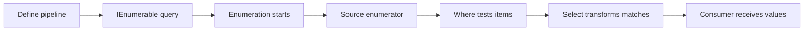

<TLDR>
  <TLDRCell label="what">
    <Term id="linq">LINQ</Term> is a set of C# language features and operators for querying object sequences and remote data sources. It composes filtering, projection, ordering, grouping, and aggregation into type-safe pipelines.
  </TLDRCell>
  <TLDRCell label="trap">
    Most sequence-returning operators use <Term id="deferred-execution">deferred execution</Term>, so saving a query doesn't save its results. Repeated enumeration can reread data, repeat side effects, or produce different results.
  </TLDRCell>
  <TLDRCell label="fix">
    Define the source, execution boundary, result cardinality, and ordering first. Materialize once when you need a stable snapshot, and verify which operations a remote provider translates.
  </TLDRCell>
</TLDR>

## What it is and why it exists

LINQ stands for Language Integrated Query. It supplies common query patterns for filtering, transforming, joining, grouping, and summarizing data with static type checking. Each query step remains an ordinary expression, so the compiler can check property names, lambda parameter types, and result types.

LINQ to Objects is the form you meet most often. Extension methods on `System.Linq.Enumerable` accept `IEnumerable<T>` and use delegates to process arrays, lists, and other enumerable sources in the current process. `Where` retains matching elements, `Select` changes each element's shape, `OrderBy` establishes order, and `GroupBy` forms groups by key.

LINQ can also describe remote queries. Operators on `System.Linq.Queryable` accept expression trees, which an `IQueryable<T>` <Term id="query-provider">query provider</Term> interprets or translates. A database is only one possible source; the specific provider defines the available operations and execution semantics.

LINQ solves query composition, not the problem of squeezing every loop onto one line. Short, side-effect-free data transformations usually fit a pipeline. An ordinary loop is often clearer when the work includes complex state transitions, per-item error recovery, or several branches. Choose based on whether the behavior is clear, not on character count.

Query syntax and method syntax belong to the same LINQ model. Query syntax supplies clauses such as `from`, `where`, `orderby`, `join`, `group`, and `select`, which the compiler translates to method calls. Method syntax exposes every standard query operator directly, and the two forms can be combined in one expression.

## How it works

### A pipeline can store operations instead of results

Calling `Where` or `Select` usually gives you an object representing query steps, not a populated result collection. When code actually requests elements, the query pulls from its source and applies each operator in order. This is deferred execution: the caller composes a query first, then decides when and how much of the result to consume.

The flow below shows the pull relationship when a `foreach` first consumes a LINQ to Objects pipeline. Each request from the consumer makes the pipeline search upstream for the next matching value.



`foreach`, `ToList`, `Count`, `First`, and `Sum` all demand results, so they trigger the relevant query work. They consume differently: `First` can stop after finding an element, `Count` usually has to determine the whole result's size, and `ToList` stores all results in a new list. Don't mistake “triggers execution” for “always builds a collection.”

### Streaming and buffering steps

`Where` and `Select` can process and yield one element at a time. `Take` can stop reading upstream once it reaches its limit, and `Any` can return when it finds its first match. Such operations support short-circuiting, though they still depend on whether upstream can produce values incrementally.

`OrderBy` must obtain all input before it knows the first sorted result. `GroupBy` also reads the source and builds groups. Both can remain deferred until enumeration starts, but they buffer after that point. “Deferred” and “streaming” are separate properties.

| Operator shape | Examples | Main behavior when results are requested |
| --- | --- | --- |
| Deferred and streaming | `Where`, `Select`, `Take` | Pull enough upstream data to produce the next result |
| Deferred and buffering | `OrderBy`, `GroupBy` | Read and organize input after enumeration begins |
| Immediate scalar | `Any`, `Count`, `Sum` | Consume enough input to calculate the scalar |
| Immediate materialization | `ToArray`, `ToList`, `ToDictionary` | Complete enumeration and store the results |

<Term id="materialization">Materialization</Term> writes query results into a concrete container. It fixes that container's membership and permits repeated reads without rerunning the upstream query, but it doesn't recursively copy element objects. If the source and result refer to the same mutable object, both can still observe mutations to that object.

### The compiler translates query syntax

A query expression must begin with `from` and end with `select` or `group`. The compiler translates its clauses into calls such as `Where`, `Select`, `OrderBy`, `Join`, or `GroupJoin` according to language rules. Query syntax isn't a separate runtime query engine, and looking like SQL doesn't make it execute remotely.

A `let` clause introduces a computed value for later clauses, while multiple ordering keys map to an initial ordering followed by subsequent ordering. Query syntax doesn't cover every standard operator; common operators such as `Take` and `Distinct` are normally appended as method calls. Query syntax is often readable with several range variables or joins, while a method chain is compact for ordinary filtering and projection.

### Generic types connect the steps

An `IEnumerable<Product>` still produces `Product` after `Where`. `Select(product => product.Name)` changes the element type to `string`, so the next step receives `string`. Anonymous types, records, and tuples can all serve as intermediate projections as long as they don't cross API boundaries where those types are unsuitable.

The operator determines the target signature of a lambda. `Enumerable.Where` needs a `Func<T, bool>`, so its predicate must return a Boolean. A `SelectMany` selector returns a nested sequence, and the operator flattens those sequences into one result sequence. Compile-time type relationships prevent many shape errors, but they can't tell whether a business predicate filters the wrong field.

### Result cardinality is part of the contract

`First` says at least one element must exist but allows more; an empty result throws `InvalidOperationException`. `Single` requires exactly one and throws for either zero or multiple results. The `OrDefault` variants only turn “no element” into a default value; `SingleOrDefault` still rejects multiple elements.

The default can be valid data. When `FirstOrDefault` over `IEnumerable<int>` returns `0`, the caller can't tell from that value alone whether the first item is zero or there was no item. If the distinction belongs to the business contract, use a single-pass `TryGet`-style helper, project to a nullable value, or return a domain result that represents presence.

Aggregates also have individual empty-sequence rules. `Count` and integer `Sum` can return zero, while `Average`, `Min`, and `Max` throw on many non-nullable numeric sequences with no elements. Don't infer boundary behavior from an operator's name; put empty, single-item, and multi-item inputs in tests.

### `Enumerable` and `Queryable` form an execution boundary

`Enumerable` operators accept delegates and execute ordinary .NET code. `Queryable` operators accept <Term id="expression-tree">expression trees</Term> and hand the query description to a provider. The same lambda source can become a delegate or an expression tree depending on the receiver's static type.

`AsEnumerable` doesn't materialize data by itself. It binds subsequent extension calls to `Enumerable`, so later predicates run in the current process; `ToList` is what immediately enumerates and stores results. Calling either too early on a remote source has different effects, but both can change which work happens remotely.

A provider doesn't have to support every legal C# expression. A delegate that runs correctly over an array doesn't prove that the same structure translates to a target query language. Remote queries need verification against the real provider for translation, parameterization, null semantics, ordering, and round trips. `List<T>.AsQueryable()` proves only an in-memory path.

## Examples

These four examples use inventory and order data to build from filtering and projection to deferred execution, flattening and grouping, and a query-syntax join. All were compiled and run with .NET SDK 10.0.400, and every output came from the actual process.

### Filter, order, and project

The first pipeline keeps products that are in stock and cost at least `100m`, orders them by descending price and then ascending name, and projects only the two fields needed for output.

<Depth level="quick">

```csharp title="InventoryQuery.cs"
using System;
using System.Globalization;
using System.Linq;

Product[] products =
[
    new("Book", 18m, true),
    new("Desk", 240m, true),
    new("Lamp", 80m, false),
    new("Chair", 120m, true)
];

var offers = products
    .Where(product => product.InStock && product.Price >= 100m)
    .OrderByDescending(product => product.Price)
    .ThenBy(product => product.Name)
    .Select(product => new { product.Name, product.Price });

foreach (var offer in offers)
{
    string price = offer.Price.ToString("F2", CultureInfo.InvariantCulture);
    Console.WriteLine($"{offer.Name}: {price}");
}

public sealed record Product(string Name, decimal Price, bool InStock);
```

```text
Desk: 240.00
Chair: 120.00
```

<TryToBreak items={['an empty product array', 'a price exactly equal to 100m', 'two products with the same price but different names']} />

</Depth>

`Where` leaves the element type unchanged, while `Select` projects `Product` into an anonymous type. `ThenBy` supplies a deterministic secondary order for equal prices. Calling another `OrderBy` instead would replace the previous primary ordering with a new one.

This query doesn't execute until `foreach`. The loop only reads the results and performs no source mutation or external side effect, so its timing is clear. If a caller must see exactly the same members later, call `ToArray` or `ToList` at the agreed boundary.

### Compare a deferred query with a materialized snapshot

This example defines a query and immediately takes an array snapshot, then changes the source list. Enumerating the original query again sees the new order, while the array retains its membership from materialization time.

```csharp title="DeferredSnapshot.cs"
using System;
using System.Collections.Generic;
using System.Linq;

var orders = new List<Order>
{
    new("A-100", 20m),
    new("B-200", 75m)
};

IEnumerable<string> largeOrderIds = orders
    .Where(order => order.Total >= 50m)
    .Select(order => order.Id);

string[] snapshot = largeOrderIds.ToArray();

Console.WriteLine($"snapshot: {string.Join(", ", snapshot)}");

orders.Add(new("C-300", 80m));

Console.WriteLine($"deferred: {string.Join(", ", largeOrderIds)}");
Console.WriteLine($"snapshot: {string.Join(", ", snapshot)}");

public sealed record Order(string Id, decimal Total);
```

```text
snapshot: B-200
deferred: B-200, C-300
snapshot: B-200
```

The array fixes a set of element references; it isn't a deep copy of the elements. `Order` is an immutable record here, so only the list addition creates a difference. With mutable elements, the snapshot and source could still observe changes to the same element object.

The query variable's static type is `IEnumerable<string>`, which doesn't promise that results already reside in memory. An API returning such a deferred query should state source ownership, whether enumeration is repeatable, and whether the source remains valid until consumption finishes.

### Flatten with `SelectMany`, then group

Each order contains several lines. `SelectMany` retains the customer name while flattening, `GroupBy` applies an explicit case rule for SKUs, and the remaining steps calculate units and customers for each SKU.

```csharp title="FlattenAndGroup.cs"
using System;
using System.Linq;

Order[] orders =
[
    new("Ana",
    [
        new("BK-1", 2),
        new("PN-2", 3)
    ]),
    new("Bo",
    [
        new("bk-1", 1)
    ])
];

var totals = orders
    .SelectMany(
        order => order.Lines,
        (order, line) => new { order.Customer, line.Sku, line.Quantity })
    .GroupBy(row => row.Sku, StringComparer.OrdinalIgnoreCase)
    .Select(group => new
    {
        Sku = group.Key,
        Units = group.Sum(row => row.Quantity),
        Customers = string.Join("/", group
            .Select(row => row.Customer)
            .Distinct()
            .OrderBy(name => name))
    })
    .OrderBy(total => total.Sku, StringComparer.OrdinalIgnoreCase);

foreach (var total in totals)
{
    Console.WriteLine($"{total.Sku}: {total.Units} units ({total.Customers})");
}

public sealed record Order(string Customer, Line[] Lines);
public sealed record Line(string Sku, int Quantity);
```

```text
BK-1: 3 units (Ana/Bo)
PN-2: 3 units (Ana)
```

The result selector places order context and line data in one row object, so flattening doesn't lose the customer. A group retains the first encountered spelling as its `Key`, which is why the output shows `"BK-1"`. Case-insensitive equality isn't a display-normalization policy.

`GroupBy` reads its input and builds groups after enumeration begins. If input can be enormous or infinite, that buffering requirement changes which sources the API can accept. A `Take` after grouping doesn't reduce the input that grouping must read.

### Express a group join with query syntax

Query syntax makes the customer, order group, and subtotal easy to name together. A group join retains customers with no orders, and `where` then removes results whose total is too small.

```csharp title="CustomerTotals.cs"
using System;
using System.Globalization;
using System.Linq;

Customer[] customers =
[
    new(1, "Alice"),
    new(2, "Bob"),
    new(3, "Cara")
];

Order[] orders =
[
    new(101, 1, 40m),
    new(102, 1, 65m),
    new(103, 2, 30m)
];

var summaries =
    from customer in customers
    join order in orders on customer.Id equals order.CustomerId into customerOrders
    let total = customerOrders.Sum(order => order.Amount)
    where total >= 50m
    orderby total descending, customer.Name
    select new { customer.Name, Total = total };

foreach (var summary in summaries)
{
    string total = summary.Total.ToString("F2", CultureInfo.InvariantCulture);
    Console.WriteLine($"{summary.Name}: {total}");
}

public sealed record Customer(int Id, string Name);
public sealed record Order(int Id, int CustomerId, decimal Amount);
```

```text
Alice: 105.00
```

The compiler translates `join ... into` to a group join and constructs suitable projections for `let` and the later clauses. `Sum` over an empty `decimal` sequence returns zero, so Cara is removed by `where` rather than failing during aggregation.

The sources here are arrays, so delegates execute in memory. If a range variable comes from `IQueryable<T>`, the same syntax binds to `Queryable`; you must then verify that the provider can translate the group join, aggregate, and ordering combination.

## Pitfalls

### Treating a query variable as a snapshot

> [!PITFALL]
> `var result = source.Where(...)` usually stores only a query. If the source changes before enumeration, result membership can change too. A disposed or invalid source can also delay its exception until the consumer runs.

**Fix:** decide whether callers need a live view or a stable snapshot. For a snapshot, materialize exactly once at an explicit boundary and say whether it is a container snapshot or a deep element copy. For a deferred query, keep the source valid through the entire consumption period.

### Enumerating a source with work or side effects more than once

> [!PITFALL]
> Calling `Count()` and then using `foreach` on the same `IEnumerable<T>` can perform two database requests, file reads, generator runs, or logging predicates. This is <Term id="multiple-enumeration">multiple enumeration</Term>, and the results can also change between passes.

**Fix:** if the contract needs one stable result set, materialize once and use the collection's `Count` and iterator. If the source deliberately represents a stream, design a single-pass consumer instead of probing for emptiness first. One enumeration can handle the first item and all following items.

### Hiding a cardinality error with an element operator

> [!PITFALL]
> Using `FirstOrDefault` to find an account that should be unique silently chooses one when duplicate data exists. Using `Single` on a query that legitimately allows several results turns ordinary input into an exception.

**Fix:** choose `First`, `Single`, and their `OrDefault` variants from the domain constraint, then test zero, one, and multiple results separately. When a default value is valid data, don't let one bare value represent both “missing” and a real result.

### Losing primary order with a second `OrderBy`

> [!PITFALL]
> `items.OrderBy(x => x.Team).OrderBy(x => x.Score)` creates a new primary ordering by score; it doesn't order by score within each team. Generated code often writes `OrderBy` mechanically for every sorting requirement.

**Fix:** use `OrderBy` or `OrderByDescending` for the first key, followed by `ThenBy` or `ThenByDescending` for later keys. Assert the full sequence with data that has equal primary keys and different secondary keys, plus different primary keys with equal secondary keys.

### Mutating a source collection during enumeration

> [!PITFALL]
> Adding to or removing from a list while `foreach` consumes a query over that same list invalidates the active enumerator and normally throws `InvalidOperationException`. Deferred execution makes this harder to locate when mutation is far from query definition.

**Fix:** collect the intended changes separately, then apply them after enumeration, or use a collection's dedicated bulk operation. If an algorithm truly needs mutation while reading, choose a data structure and traversal whose contract explicitly supports it.

### Falling back to memory at a provider boundary

> [!PITFALL]
> Inserting `AsEnumerable()` to call an untranslatable local method makes subsequent filtering and ordering execute in the current process. If it appears before result limits, the remote side can return far more data than the business operation needs.

**Fix:** mark the `IQueryable<T>` to `IEnumerable<T>` boundary and keep translatable filters, projections, and limits before it. Inspect the generated query and results with the real provider. Rewrite untranslatable logic, or switch explicitly only after applying a well-defined data bound.

## In the AI era

**What generated code gets wrong here**

Models often call `Count()`, `Any()`, and `foreach` in sequence on the same deferred source, overlooking that each can enumerate again. They also use `FirstOrDefault` to hide duplicates that should fail, treat several `OrderBy` calls as multi-key sorting, or insert `ToList()` or `AsEnumerable()` too early to silence a translation error. Another recurring mistake is omitting the domain comparer from `GroupBy`, `Distinct`, and joins, silently splitting SKUs, email addresses, or protocol identifiers under default case rules.

**Ask your AI to check**

- List each query's concrete source type, every enumeration trigger, and how many times upstream work executes.
- Mark every materialization and `IQueryable<T>`/`IEnumerable<T>` boundary, then state which filters, projections, and orderings run on each side.
- State the cardinality, equality, null, and ordering contract for every `First`, `Single`, `GroupBy`, `Distinct`, and ordering chain.

**Review checklist**

- Test deferred execution and element operators with empty input, one item, duplicates, and a source changed after query definition.
- Check whether any `IEnumerable<T>` is consumed more than once and whether predicates or selectors log, count, write, or otherwise cause side effects.
- For remote queries, inspect the real provider's generated query, parameters, returned row count, and round trips instead of testing only an in-memory list.

**Prompt vocabulary**

Use the exact terms `deferred execution`, `materialization`, `multiple enumeration`, `streaming operator`, `buffering operator`, `cardinality`, `stable ordering`, `equality comparer`, `query provider`, and `translation boundary`. Ask for an execution-boundary table and zero/one/many behavior; “optimize this LINQ” is too vague.

<Depth level="deep">

## Enumeration protocol and execution timing

`IEnumerable<T>.GetEnumerator()` creates an enumerator, `MoveNext()` advances it, and `Current` exposes the value at the current position. Compiler-generated `foreach` works around this protocol and disposes an enumerator that implements `IDisposable` on completion or exceptional exit. Deferred LINQ to Objects operators compose a chain by wrapping upstream enumerators.

Each call to a query object's `GetEnumerator()` normally starts a new traversal. Reusing the query object doesn't mean it cached the previous result. Whether traversal is repeatable and whether each pass returns the same result depend on the source. An array is usually stable; an iterable generator, network pager, or one-shot reader can have a different contract.

Execution exceptions move with enumeration too. Property access, parsing, or user code in a predicate might be written where the query is defined but not throw until a later `foreach` or `ToList`. Put the exception boundary around actual consumption, not only around the method call that returns the query object.

Disposing an iterator doesn't turn its results into a snapshot. It only ends the current enumeration and releases resources owned by that enumerator. If a method returns a deferred query backed by a disposed database context, stream, or reader, later enumeration still fails. Either consume within the resource scope or materialize the required data there.

### Short-circuiting, buffering, and infinite sequences

`Take(5)` emits at most five items downstream, but a preceding filter might inspect more inputs to find five matches. `Any(predicate)` can stop on its first match, while `All(predicate)` stops on its first nonmatch. Short-circuiting describes a stopping condition, not a fixed read count.

A buffering operator must see enough input to organize output. Calling `OrderBy` on an infinite source and then `Take(5)` can't produce the first sorted item because sorting never sees the input end. Limit input first only when a business rule makes that bound semantically valid; changing operator order can change results.

The order of `Take` and `Where` is itself semantic. `source.Where(valid).Take(10)` asks for ten valid items, while `source.Take(10).Where(valid)` checks only the first ten. Their result counts and members can differ. Don't reorder operators mechanically under the slogan “reduce data first.”

### Equality and ordering

Operations such as `Distinct`, `GroupBy`, `Join`, and `ToDictionary` depend on equality. Without an explicit comparer, LINQ to Objects uses the element or key type's default equality. Supply an `IEqualityComparer<T>` when the domain differs, and include case, normalization, and hash-collision examples in tests.

`OrderBy` establishes a new primary ordering; only `ThenBy` adds a secondary key within equal existing keys. .NET `OrderBy` is stable, so elements with equal keys retain their relative source order. A hash-based source might not have meaningful business order in the first place, so deterministic output should spell out every business ordering key.

Set-like operators apply equality; they don't implement a domain merge policy. If two objects compare equal, `Distinct` retains one, but callers shouldn't treat the retained object as a defined reconciliation result. Selecting the newest record, merging fields, or reporting conflicts needs explicit grouping and selection logic.

### Materialization boundaries and ownership

`ToList` and `ToArray` enumerate the source and create a new outer container. Later membership changes to the source collection don't alter that container's count or positions, but reference-type elements can still be shared with the source. A true deep snapshot requires an explicit copy of every element and its nested state.

Materializing too early cuts off later composition, while materializing too late can leak a volatile source and its side effects to an uncontrolled caller. A useful boundary is often an ownership transition: leaving a resource scope, handing data to another thread, publishing a cache, or fulfilling an API promise of stable results. Preserve composition before the boundary and use a concrete collection afterward to express that data has been obtained.

When returning `IEnumerable<T>`, say whether it is a repeatable query, a one-shot stream, or a read-only view over a concrete collection. The interface promises only enumeration. It doesn't promise cheap counts, indexing, thread safety, or snapshot semantics, so callers shouldn't infer those properties from the return type.

### Provider translation isn't delegate execution

`Queryable.Where` receives query structure, not an ordinary predicate to invoke immediately. A provider walks the expression tree and converts supported nodes to its target operation. Translation failures, target-system null rules, string comparison, and collation can all make a remote path differ from LINQ to Objects.

Captured variables commonly appear as readable values in the expression tree and are parameterized by database providers, but exact behavior still belongs to the provider. Concatenating user input into dynamic query text isn't the same as ordinary parameter capture; it needs a separate design for grammar, security, and resource limits. Calling `Compile()` to bypass a translation limit moves work back to delegate execution.

`AsQueryable()` doesn't grant database capabilities to an in-memory list either. It can only return a query-interface wrapper; the actual `Provider` determines available translation. Continue with `csharp/expression-trees` for query structure and `csharp/ef-core` for database loading, tracking, and query shape.

### Nulls and aggregate types

Nullable-reference annotations don't change LINQ runtime behavior. If the source actually contains `null`, `Select(item => item.Name)` can still throw `NullReferenceException`; compiler warnings depend on static annotations and null-state analysis. Validate external data at its boundary, then state whether a query excludes, replaces, or retains nulls.

The particular overload determines a numeric aggregate's result type. `Sum` over `IEnumerable<int>` returns `int`, so intermediate additions remain constrained to that range. Assigning the final result to `long` can't retroactively widen earlier arithmetic. Project to the target numeric type before aggregation when you need a wider range, and choose `checked` behavior from the contract.

`Average` also changes empty-sequence behavior with nullability. It throws for an empty non-nullable numeric sequence but can return `null` for the corresponding nullable sequence. Adding `DefaultIfEmpty` introduces a real default element and changes the semantics, so use it only when the domain truly defines an empty aggregate as that default.

### Side effects, concurrency, and testing

Predicates and selectors are easiest to reason about when the result depends only on the input. Hiding a counter increment, network call, or collection mutation inside a lambda makes its execution count depend on enumeration count, short-circuiting, and upstream operators. When side effects are required, an explicit loop usually states order, failure, and retry behavior more clearly.

A deferred pipeline doesn't become thread-safe automatically. Mutating an ordinary collection during enumeration can invalidate its enumerator, and consuming one stateful enumerator from several threads has no general safety guarantee. Even separate enumerations need a source that permits concurrent reads and lambdas whose captured state isn't raced.

Tests should assert full query results, not only counts. Cover empty input, one item, duplicate keys, case variants, equal ordering keys, and source mutation. For deferred behavior, place mutations both before and after query definition. For provider queries, add real-backend tests that verify the intended agreement with in-memory tests.

</Depth>

<Checkpoint id="csharp/linq" />

## Further reading

- [Microsoft Learn: LINQ overview](https://learn.microsoft.com/en-us/dotnet/csharp/linq/)
- [Microsoft Learn: Query expression basics](https://learn.microsoft.com/en-us/dotnet/csharp/linq/get-started/query-expression-basics)
- [Microsoft Learn: Standard query operators](https://learn.microsoft.com/en-us/dotnet/csharp/linq/standard-query-operators/)
- [Microsoft Learn: Deferred execution and lazy evaluation](https://learn.microsoft.com/en-us/dotnet/standard/linq/deferred-execution-lazy-evaluation)
- [Microsoft Learn: `IEnumerable<T>` interface](https://learn.microsoft.com/en-us/dotnet/api/system.collections.generic.ienumerable-1?view=net-10.0)
- [Microsoft Learn: `IQueryable<T>` interface](https://learn.microsoft.com/en-us/dotnet/api/system.linq.iqueryable-1?view=net-10.0)
