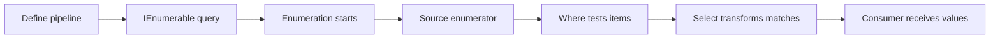

<TLDR>
  <TLDRCell label="what">
    <Term id="linq">LINQ</Term> 是 C# 查询对象序列和远程数据源的一组语言功能与运算符。它把筛选、投影、排序、分组和聚合组合成类型安全的管道。
  </TLDRCell>
  <TLDRCell label="trap">
    多数返回序列的运算符采用<Term id="deferred-execution">延迟执行（deferred execution）</Term>，所以保存查询不等于保存结果；重复枚举可能重复读取数据、执行副作用或得到不同结果。
  </TLDRCell>
  <TLDRCell label="fix">
    先写清数据源、执行边界、结果基数与顺序。需要稳定快照时只物化一次，并在远程查询上确认哪些操作会被目标提供程序翻译。
  </TLDRCell>
</TLDR>

## 是什么，为什么存在

LINQ 是语言集成查询（Language Integrated Query）的缩写。它提供一组通用查询模式，让 C# 代码以静态类型检查的方式筛选、转换、连接、分组和汇总数据。查询的每一步仍是普通表达式，编译器可以检查属性名称、Lambda 参数类型和结果类型。

你最常遇到的是 LINQ to Objects。`System.Linq.Enumerable` 中的扩展方法接收 `IEnumerable<T>`，通过委托在当前进程中处理数组、列表和其他可枚举源。`Where` 保留符合条件的元素，`Select` 改变每个元素的形状，`OrderBy` 建立顺序，`GroupBy` 按键形成分组。

LINQ 也可以描述远程查询。`System.Linq.Queryable` 上的运算符接收表达式树，由 `IQueryable<T>` 的<Term id="query-provider">查询提供程序（query provider）</Term>解释或翻译。数据库只是其中一种可能的数据源；可用操作与执行语义由具体提供程序决定。

LINQ 解决的是查询组合问题，不是把任何循环都压成一行。短小、无副作用的数据转换通常适合管道；包含复杂状态转换、逐项异常恢复或多处分支时，普通循环往往更直接。选择依据应是行为是否清楚，而不是字符数。

查询语法与方法语法属于同一个 LINQ 模型。查询语法提供 `from`、`where`、`orderby`、`join`、`group` 和 `select` 等子句，编译器会把它们转换为方法调用。方法语法可以直接使用全部标准查询运算符，两种写法也可以在同一表达式中组合。

## 工作原理

### 管道保存操作，不一定保存结果

调用 `Where` 或 `Select` 时，通常会取得一个表示查询步骤的对象，而不是已经填好的结果集合。真正请求元素时，查询才从源头拉取数据，并按顺序应用每个运算符。这就是延迟执行；它让调用方先组合查询，再决定何时以及消费多少结果。

下面的流程表示一个 LINQ to Objects 管道首次被 `foreach` 消费时的拉取关系。消费者每请求一个元素，管道就向上游寻找下一个符合条件的值。



`foreach`、`ToList`、`Count`、`First` 和 `Sum` 都会要求结果，因此会触发相应查询执行。它们的消费方式不同：`First` 可以在找到元素后停止，`Count` 通常需要确定整个结果的数量，`ToList` 则把所有结果保存进新列表。不要把「触发执行」误解成所有操作都一定建立集合。

### 流式步骤与缓冲步骤

`Where` 和 `Select` 可以逐个处理并产出元素。`Take` 达到数量后可以停止读取上游，`Any` 找到第一个匹配项后也可以返回。这样的操作适合短路，但仍取决于上游是否也能逐步产生值。

`OrderBy` 必须先取得全部输入，才能知道第一个排序结果。`GroupBy` 也需要读取源并建立分组。它们仍可以延迟到开始枚举时才工作，但开始之后会缓冲数据；「延迟」与「逐项流式」是两项不同属性。

| 运算符形态 | 例子 | 请求结果时的主要行为 |
| --- | --- | --- |
| 延迟且可逐项处理 | `Where`、`Select`、`Take` | 从上游拉取足够产生下一个结果的数据 |
| 延迟但需要缓冲 | `OrderBy`、`GroupBy` | 枚举开始后先读取并组织输入 |
| 立即返回标量 | `Any`、`Count`、`Sum` | 消费足以计算标量的输入 |
| 立即物化集合 | `ToArray`、`ToList`、`ToDictionary` | 完成枚举并保存结果 |

<Term id="materialization">物化（materialization）</Term>把查询结果写入具体容器。它固定容器成员，允许之后重复读取而不重跑上游查询，但不会递归复制元素对象。源和结果若引用同一个可变对象，修改该对象仍可从两边观察到。

### 查询语法经过编译器转换

查询表达式必须从 `from` 开始，并以 `select` 或 `group` 结束。编译器按照语言规则把子句转换成 `Where`、`Select`、`OrderBy`、`Join` 或 `GroupJoin` 等调用。查询语法本身不是另一套运行时查询引擎，也不会因为像 SQL 就自动远程执行。

`let` 子句为后续子句引入计算结果，多个排序键则映射到首个排序加后续排序。查询语法没有覆盖每个标准运算符，例如常见的 `Take` 与 `Distinct` 通常仍以方法调用追加。涉及多个范围变量或连接时，查询语法常更易读；普通筛选与投影通常用方法链更紧凑。

### 泛型类型连接每一步

一个 `IEnumerable<Product>` 经过 `Where` 后仍产生 `Product`。`Select(product => product.Name)` 把元素类型变为 `string`，因此下一步接收 `string`。匿名类型、记录和元组都可以作为中间投影，只要它们的生命周期不越过不适合暴露这些类型的 API 边界。

Lambda 的目标签名由运算符推断。`Enumerable.Where` 需要 `Func<T, bool>`，因此谓词必须返回布尔值；`SelectMany` 的选择器返回嵌套序列，并把这些序列展平成一个结果序列。编译期类型关系能阻止许多形状错误，却不能判断业务谓词是否筛错字段。

### 结果基数属于契约

`First` 表示至少要有一个元素，但允许更多元素；空结果会抛出 `InvalidOperationException`。`Single` 同时要求恰好一个元素，空结果或多个结果都会抛出。带 `OrDefault` 的版本只把「没有元素」变为默认值，不会让 `SingleOrDefault` 接受多个元素。

默认值可能是合法数据。对 `IEnumerable<int>` 调用 `FirstOrDefault` 得到 `0` 时，调用方无法仅凭返回值区分「首项是零」与「没有首项」。若这一区别属于业务契约，可使用单遍 `TryGet` 风格辅助方法、投影成可空值，或返回能表达存在性的领域结果。

聚合也各有空序列规则。`Count` 与整数 `Sum` 可以返回零，而 `Average`、`Min` 和 `Max` 对许多非可空数值序列会因没有元素而抛出。不要凭运算符名称猜测边界行为；让空、单项和多项输入进入测试。

### `Enumerable` 与 `Queryable` 是执行边界

`Enumerable` 运算符接收委托并执行普通 .NET 代码。`Queryable` 运算符接收<Term id="expression-tree">表达式树（expression tree）</Term>，把查询描述交给提供程序。相同的 Lambda 源码会因接收方静态类型不同而成为委托或表达式树。

`AsEnumerable` 本身不会物化数据。它把后续扩展方法绑定到 `Enumerable`，因此后续谓词在当前进程中运行；`ToList` 才会立即枚举并保存结果。对远程源过早调用这两个方法，影响不同，但都可能改变哪些工作由远端完成。

提供程序不需要支持所有合法 C# 表达式。一个委托在数组上运行正确，不代表相同结构能翻译成目标查询语言。远程查询必须用真实提供程序验证翻译结果、参数化、空值语义、排序和往返次数；`List<T>.AsQueryable()` 只能证明内存执行路径。

## 示例

下面四个示例使用库存与订单数据，依次展示筛选投影、延迟执行、展平分组和查询语法连接。它们均由 .NET SDK 10.0.400 编译并运行，输出来自实际进程。

### 筛选、排序并投影

第一个管道保留有库存且价格不低于 `100m` 的商品，先按价格降序，再按名称升序。最后只投影输出所需的两个字段。

<Depth level="quick">

```csharp title="InventoryQuery.cs"
using System;
using System.Globalization;
using System.Linq;

Product[] products =
[
    new("Book", 18m, true),
    new("Desk", 240m, true),
    new("Lamp", 80m, false),
    new("Chair", 120m, true)
];

var offers = products
    .Where(product => product.InStock && product.Price >= 100m)
    .OrderByDescending(product => product.Price)
    .ThenBy(product => product.Name)
    .Select(product => new { product.Name, product.Price });

foreach (var offer in offers)
{
    string price = offer.Price.ToString("F2", CultureInfo.InvariantCulture);
    Console.WriteLine($"{offer.Name}: {price}");
}

public sealed record Product(string Name, decimal Price, bool InStock);
```

```text
Desk: 240.00
Chair: 120.00
```

<TryToBreak items={['空商品数组', '价格恰好为 100m', '同价但名称不同的两个商品']} />

</Depth>

`Where` 不改变元素类型，`Select` 则把 `Product` 投影成匿名类型。`ThenBy` 在价格相同时提供确定的次级顺序；若再调用一次 `OrderBy`，新的主排序会取代旧的主排序。

这个查询直到 `foreach` 才执行。循环只读取结果，没有修改源或执行外部副作用，因此执行时机清楚。若调用方需要在之后看到完全相同的成员，应在约定的边界调用 `ToArray` 或 `ToList`。

### 对比延迟查询与物化快照

下面先定义查询并立即取得数组快照，随后修改源列表。再次枚举原查询会看到新订单，而数组仍保留物化时的成员。

```csharp title="DeferredSnapshot.cs"
using System;
using System.Collections.Generic;
using System.Linq;

var orders = new List<Order>
{
    new("A-100", 20m),
    new("B-200", 75m)
};

IEnumerable<string> largeOrderIds = orders
    .Where(order => order.Total >= 50m)
    .Select(order => order.Id);

string[] snapshot = largeOrderIds.ToArray();

Console.WriteLine($"snapshot: {string.Join(", ", snapshot)}");

orders.Add(new("C-300", 80m));

Console.WriteLine($"deferred: {string.Join(", ", largeOrderIds)}");
Console.WriteLine($"snapshot: {string.Join(", ", snapshot)}");

public sealed record Order(string Id, decimal Total);
```

```text
snapshot: B-200
deferred: B-200, C-300
snapshot: B-200
```

数组固定的是成员引用集合，不是元素的深复制。本例的 `Order` 是不可变记录，所以差异只来自列表新增；若元素本身可变，快照和源仍可能观察到同一个元素对象的变化。

查询变量的静态类型是 `IEnumerable<string>`，并不承诺结果已经存在内存。API 若返回这种延迟查询，应说明数据源所有权、能否重复枚举，以及源在消费前是否仍然有效。

### 用 `SelectMany` 展平，再分组汇总

每张订单包含多个明细。`SelectMany` 在展平时保留客户名称，`GroupBy` 使用明确的 SKU 大小写规则，随后计算每个 SKU 的总件数与客户集合。

```csharp title="FlattenAndGroup.cs"
using System;
using System.Linq;

Order[] orders =
[
    new("Ana",
    [
        new("BK-1", 2),
        new("PN-2", 3)
    ]),
    new("Bo",
    [
        new("bk-1", 1)
    ])
];

var totals = orders
    .SelectMany(
        order => order.Lines,
        (order, line) => new { order.Customer, line.Sku, line.Quantity })
    .GroupBy(row => row.Sku, StringComparer.OrdinalIgnoreCase)
    .Select(group => new
    {
        Sku = group.Key,
        Units = group.Sum(row => row.Quantity),
        Customers = string.Join("/", group
            .Select(row => row.Customer)
            .Distinct()
            .OrderBy(name => name))
    })
    .OrderBy(total => total.Sku, StringComparer.OrdinalIgnoreCase);

foreach (var total in totals)
{
    Console.WriteLine($"{total.Sku}: {total.Units} units ({total.Customers})");
}

public sealed record Order(string Customer, Line[] Lines);
public sealed record Line(string Sku, int Quantity);
```

```text
BK-1: 3 units (Ana/Bo)
PN-2: 3 units (Ana)
```

结果选择器把订单上下文与明细放进同一行对象，避免展平后丢失客户信息。分组沿用第一次出现的键作为 `Key`，所以显示为 `"BK-1"`；大小写相等规则不等于显示规范化策略。

`GroupBy` 在枚举开始后读取输入并建立分组。若输入可能包含巨大或无限序列，这项缓冲需求会改变 API 能接受的数据源；应在边界明确限制，而不是期待 `Take` 放在分组后就能减少分组前的读取。

### 用查询语法表达分组连接

查询语法适合同时命名客户、订单组和小计。分组连接保留没有订单的客户，`where` 再筛掉总额不足的结果。

```csharp title="CustomerTotals.cs"
using System;
using System.Globalization;
using System.Linq;

Customer[] customers =
[
    new(1, "Alice"),
    new(2, "Bob"),
    new(3, "Cara")
];

Order[] orders =
[
    new(101, 1, 40m),
    new(102, 1, 65m),
    new(103, 2, 30m)
];

var summaries =
    from customer in customers
    join order in orders on customer.Id equals order.CustomerId into customerOrders
    let total = customerOrders.Sum(order => order.Amount)
    where total >= 50m
    orderby total descending, customer.Name
    select new { customer.Name, Total = total };

foreach (var summary in summaries)
{
    string total = summary.Total.ToString("F2", CultureInfo.InvariantCulture);
    Console.WriteLine($"{summary.Name}: {total}");
}

public sealed record Customer(int Id, string Name);
public sealed record Order(int Id, int CustomerId, decimal Amount);
```

```text
Alice: 105.00
```

编译器会把 `join ... into` 转换为分组连接，并为 `let` 和后续子句构造相应投影。`Sum` 对空的 `decimal` 序列返回零，因此 Cara 会在 `where` 处被过滤，而不是在聚合处失败。

这里的源是数组，所以委托在内存中执行。若范围变量来自 `IQueryable<T>`，相同语法会绑定到 `Queryable`；这时必须确认提供程序能翻译分组连接、聚合与排序组合。

## 陷阱

### 把查询变量当成快照

> [!PITFALL]
> `var result = source.Where(...)` 通常只保存查询。源在枚举前发生变化时，结果成员也可能变化；源已经释放或失效时，异常也会推迟到消费位置。

**修复方法：** 先决定调用方需要实时视图还是稳定快照。需要快照就只在明确边界物化一次，并说明这是容器快照还是元素深复制；需要延迟查询就让源的生命周期覆盖完整消费过程。

### 重复枚举带有工作或副作用的源

> [!PITFALL]
> 先调用 `Count()`，再用 `foreach` 读取同一个 `IEnumerable<T>`，可能执行两次数据库请求、文件读取、生成器逻辑或带日志的谓词。这就是<Term id="multiple-enumeration">重复枚举（multiple enumeration）</Term>，结果还可能在两次之间变化。

**修复方法：** 若契约需要一组稳定结果，物化一次后使用集合的 `Count` 和迭代。若源刻意是流，则设计单次消费接口，不要为了探测是否为空而预先枚举；可以在一次枚举中处理首项与后续项。

### 用元素运算符隐藏基数错误

> [!PITFALL]
> 用 `FirstOrDefault` 查找本应唯一的账户，会在重复数据中静默选择第一项。反过来，对允许多项的查询使用 `Single`，会把正常输入变成异常。

**修复方法：** 从领域约束选择 `First`、`Single` 及其 `OrDefault` 版本，并分别测试零项、一项和多项。默认值也是合法数据时，不要让一个裸值同时表示「缺失」与真实结果。

### 用第二个 `OrderBy` 丢失主排序

> [!PITFALL]
> `items.OrderBy(x => x.Team).OrderBy(x => x.Score)` 建立的是以分数为主的新排序，不是团队内按分数排序。生成代码常把每个排序要求都机械写成 `OrderBy`。

**修复方法：** 第一个键使用 `OrderBy` 或 `OrderByDescending`，后续键使用 `ThenBy` 或 `ThenByDescending`。用主键相同而次键不同、以及主键不同但次键相同的数据断言完整顺序。

### 在枚举中修改源集合

> [!PITFALL]
> `foreach` 消费列表查询时又向同一列表添加或删除元素，会使活动枚举器失效并通常抛出 `InvalidOperationException`。延迟执行让修改点与查询定义位置相隔很远时，这个错误更难定位。

**修复方法：** 先把要改的项目收集到独立结果，再在枚举结束后应用变更；或者使用集合提供的专用批量操作。若确实需要边读边改，应选明确定义这种行为的数据结构与算法。

### 在提供程序边界意外切回内存

> [!PITFALL]
> 为了调用一个无法翻译的本地方法而插入 `AsEnumerable()`，会让后续筛选与排序在当前进程执行。若它出现在限制结果之前，远端可能返回远多于业务所需的数据。

**修复方法：** 标出 `IQueryable<T>` 到 `IEnumerable<T>` 的边界，把可翻译的筛选、投影与限制留在边界之前。用真实提供程序检查生成的查询和结果；无法翻译的逻辑要么重写，要么在有明确数据上限后显式转入内存。

## AI 时代

**生成代码在这里常犯的错**

模型常把 `Count()`、`Any()` 和 `foreach` 连续用于同一个延迟源，忽略每次调用都可能重新枚举。它还会用 `FirstOrDefault` 掩盖本应报错的重复记录，把多个 `OrderBy` 当作多键排序，或为解决翻译错误过早插入 `ToList()` 或 `AsEnumerable()`。另一类错误是遗漏 `GroupBy`、`Distinct` 和连接中的领域比较器，让 SKU、邮箱或协议标识按默认大小写规则悄悄分裂。

**让 AI 检查**

- 列出每个查询的具体源类型、每个枚举触发点，以及上游会执行多少次。
- 标出所有物化和 `IQueryable<T>`／`IEnumerable<T>` 边界，并说明边界两侧分别执行哪些筛选、投影与排序。
- 为每个 `First`、`Single`、`GroupBy`、`Distinct` 和排序链写出基数、相等性、空值与顺序契约。

**审查清单**

- 用空、单项、重复项和源在定义后变化的数据测试延迟执行与元素运算符。
- 检查同一 `IEnumerable<T>` 是否被多次消费，谓词与选择器是否含日志、计数或写操作等副作用。
- 对远程查询查看真实提供程序生成的查询、参数、返回行数和往返次数，而不是只在内存列表上测试。

**提示词词汇**

使用准确术语：`deferred execution`（延迟执行）、`materialization`（物化）、`multiple enumeration`（重复枚举）、`streaming operator`（流式运算符）、`buffering operator`（缓冲运算符）、`cardinality`（基数）、`stable ordering`（稳定排序）、`equality comparer`（相等比较器）、`query provider`（查询提供程序）和 `translation boundary`（翻译边界）。要求模型输出执行边界表与零项／一项／多项行为，不要只说「优化这段 LINQ」。

<Depth level="deep">

## 枚举协议与执行时机

`IEnumerable<T>.GetEnumerator()` 创建枚举器，`MoveNext()` 推进到下一个元素，`Current` 暴露当前位置的值。编译器生成的 `foreach` 围绕这个协议工作，并在结束或异常退出时释放实现了 `IDisposable` 的枚举器。LINQ to Objects 的延迟运算符通过包装上游枚举器组成链。

每次调用查询对象的 `GetEnumerator()` 通常都会开始一次新的遍历。查询对象本身可以重复使用，不代表它缓存了上一次结果；能否重复遍历以及每次结果是否相同取决于源。数组通常稳定，可迭代生成器、网络分页器或一次性读取器则可能具有不同契约。

执行异常也随枚举推迟。谓词中的属性访问、解析或用户代码即使写在查询定义处，也可能到稍后的 `foreach` 或 `ToList` 才抛出。异常边界应包住实际消费位置，而不是只包住返回查询对象的方法调用。

迭代器的释放不会把结果变成快照。它只结束当前枚举并释放该枚举器持有的资源。若一个方法返回依赖已释放数据库上下文、流或读取器的延迟查询，调用方开始枚举时仍会失败；要么把消费留在资源作用域内，要么在作用域内物化所需数据。

### 短路、缓冲与无限序列

`Take(5)` 最多向下游产生五项，但它之前的筛选可能需要检查更多输入才能找到五个匹配项。`Any(predicate)` 找到第一个匹配项就能停止，`All(predicate)` 则在第一个不匹配项停止。短路描述的是停止条件，不是固定读取次数。

缓冲运算符需要看到足够的输入才能组织输出。对无限源调用 `OrderBy` 后再 `Take(5)` 无法产生第一个排序项，因为排序永远看不到输入结束；先按业务上可证明安全的条件限制输入，才可能使排序完成。重新排列运算符前仍要确认语义相同。

`Take` 与 `Where` 的顺序就是语义的一部分。`source.Where(valid).Take(10)` 表示取十个有效项，`source.Take(10).Where(valid)` 表示只检查最初十项，两者的结果数量和成员都可能不同。不能仅凭「先减少数据」机械换序。

### 相等性与顺序

`Distinct`、`GroupBy`、`Join` 和 `ToDictionary` 等操作依赖相等性。未提供比较器时，LINQ to Objects 使用元素或键类型的默认相等规则。领域规则不同就要显式传入 `IEqualityComparer<T>`，并让测试包含大小写、规范化和哈希碰撞相关样例。

`OrderBy` 建立新的主排序，`ThenBy` 才在已有相等键范围内添加次级排序。.NET 的 `OrderBy` 是稳定排序，因此键相等的元素保留原相对顺序；但哈希型源本身未必具有可依赖的业务顺序。需要确定输出时，应把全部业务排序键写出来。

集合运算处理的是相等性，不会自动保留业务身份。两个对象若比较相等，`Distinct` 只保留一个；保留哪一个不应被当作合并策略。需要按键选择最新记录、合并字段或报告冲突时，应把规则写成显式分组与选择逻辑。

### 物化边界与所有权

`ToList` 和 `ToArray` 枚举源并创建新的外层容器。之后改变源集合的成员，不会改变该容器的成员数量与位置；但其中的引用类型元素仍可能与源共享。真正的深快照需要明确复制每个元素及其嵌套状态。

过早物化会切断后续组合机会，过晚物化则可能把易失源与副作用带进不受控的调用方。合适边界通常是所有权变化处：离开资源作用域、跨线程移交、缓存发布，或者 API 明确承诺稳定结果时。边界前保留组合能力，边界后使用具体集合表达已取得数据。

返回 `IEnumerable<T>` 时要说明它是可重复查询、一次性流还是具体集合的只读视图。接口只保证可枚举，不保证元素数量获取方式、索引、线程安全或快照语义。调用方不应从返回类型中猜测这些性质。

### 提供程序翻译不是委托执行

`Queryable.Where` 收到的是查询结构，而不是要立即调用的普通谓词。提供程序遍历表达式树，把支持的节点转换为目标操作。翻译失败、目标系统的空值规则、字符串比较与排序规则都可能让远程路径不同于 LINQ to Objects。

捕获变量通常会成为表达式树中可读取的值，并由数据库提供程序参数化，但具体行为仍属于提供程序。把用户输入拼成动态查询文本与正常参数捕获不是同一件事；前者需要独立的语法、安全和资源限制设计。不要为了绕开翻译限制而调用 `Compile()`，那会把工作转回委托执行。

`AsQueryable()` 也不会给内存列表增加数据库能力。它只能返回适合查询接口的包装；实际 `Provider` 决定可用翻译。需要理解表达式树结构时转到 `csharp/expression-trees`，需要数据库加载、跟踪和查询形状时转到 `csharp/ef-core`。

### 空值与聚合类型

可空引用类型注解不会改变 LINQ 的运行时行为。若源实际包含 `null`，`Select(item => item.Name)` 仍可能抛出 `NullReferenceException`；编译器警告取决于静态注解与空状态分析。外部数据边界仍要验证，查询则应明确是排除、替换还是保留空值。

数值聚合的结果类型由具体重载决定。对 `IEnumerable<int>` 求 `Sum` 返回 `int`，中间相加仍受该类型范围约束；把最终结果赋给 `long` 不能追溯扩大先前运算。需要更宽范围时，在聚合前投影到目标数值类型，并按契约选择 `checked` 行为。

`Average` 的空序列行为也受可空性影响。对非可空数值序列为空时会抛出，对相应可空数值序列则可以返回 `null`。把 `DefaultIfEmpty` 塞进查询会引入一个真实默认元素并改变语义，只有领域确实把空集聚合定义为该默认值时才使用。

### 副作用、并发与可测试性

谓词和选择器最好只由输入决定结果。把计数器递增、网络调用或集合修改藏进 Lambda，会让执行次数受到枚举次数、短路和上游运算符影响。需要副作用时，用显式循环通常更容易说明顺序、失败与重试规则。

延迟管道不会自动获得线程安全。枚举期间修改普通集合可能使枚举器失效，同时从多个线程消费同一个状态枚举器也没有通用保证。每个线程独立枚举仍需检查源本身是否允许并发读取，以及 Lambda 捕获的状态是否共享。

测试查询时应断言完整结果，而不是只断言数量。至少覆盖空、单项、重复键、大小写变体、相同排序键和源变化；对于延迟行为，还要分别在定义前后安排源修改。提供程序查询则增加真实后端测试，验证翻译与内存测试具有预期的一致性。

</Depth>

<Checkpoint id="csharp/linq" />

## 延伸阅读

- [Microsoft Learn：LINQ 概览](https://learn.microsoft.com/en-us/dotnet/csharp/linq/)
- [Microsoft Learn：查询表达式基础](https://learn.microsoft.com/en-us/dotnet/csharp/linq/get-started/query-expression-basics)
- [Microsoft Learn：标准查询运算符](https://learn.microsoft.com/en-us/dotnet/csharp/linq/standard-query-operators/)
- [Microsoft Learn：延迟执行与惰性求值](https://learn.microsoft.com/en-us/dotnet/standard/linq/deferred-execution-lazy-evaluation)
- [Microsoft Learn：`IEnumerable<T>` 接口](https://learn.microsoft.com/en-us/dotnet/api/system.collections.generic.ienumerable-1?view=net-10.0)
- [Microsoft Learn：`IQueryable<T>` 接口](https://learn.microsoft.com/en-us/dotnet/api/system.linq.iqueryable-1?view=net-10.0)
