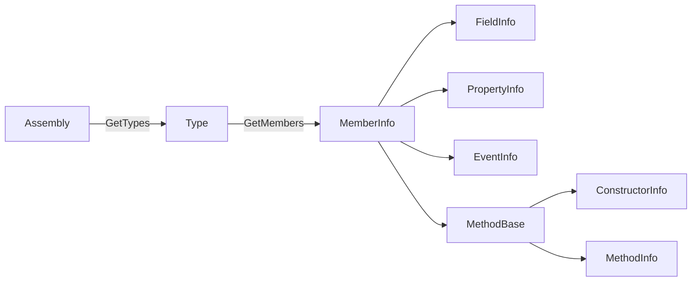

<TLDR>
  <TLDRCell label="what">
    <Term id="reflection">Reflection</Term> lets code obtain metadata about assemblies, types, and members at runtime, then create objects, access members, or invoke methods when needed.
  </TLDRCell>
  <TLDRCell label="trap">
    Name-only lookup runs into overload, inheritance, and visibility boundaries; dynamic invocation also wraps an exception from the target method in `TargetInvocationException`.
  </TLDRCell>
  <TLDRCell label="fix">
    Narrow each lookup with an explicit `Type`, signature, and `BindingFlags`, check missing results and target types, and verify reflection paths in trimmed or Native AOT publish builds.
  </TLDRCell>
</TLDR>

## What it is and why it exists

Reflection is the set of .NET APIs that expose program metadata at runtime. An assembly stores type definitions, and a type exposes records for constructors, methods, properties, fields, events, and attributes. An ordinary C# call is bound to a member by the compiler; reflection delays the question of which member to find until the program runs.

The usual entry point is `System.Type`. `typeof(Order)` obtains a compile-time-known type, `value.GetType()` obtains an object's actual runtime type, and `assembly.GetType(name)` searches a specified assembly by name. Each form expresses different knowledge, so don't turn a stable `typeof` into a string merely to make code look more dynamic.

Reflection has a real purpose when a framework can know the participating types only at runtime. A test runner discovers marked methods, a dependency injection container selects constructors, a serializer reads properties, and a plugin host identifies types that implement an interface. In each case, the framework code can't name every application type at compile time.

Reflection also delays compile-time errors until runtime. A misspelled name can produce `null`, an ambiguous overload can throw `AmbiguousMatchException`, and incompatible arguments can fail at the invocation boundary. A fixed call that an interface, generic parameter, or ordinary delegate can express usually doesn't need reflection.

Visible metadata doesn't imply that a business operation is allowed. If user input can select arbitrary types or members, the program has turned its internal API into a dynamic command language. A public boundary should map external names through a small allowlist instead of passing them directly to `Type.GetMethod()` or `Activator.CreateInstance()`.

## How it works

### Metadata objects form a navigation graph

`Assembly` represents a loaded assembly, and `Type` represents a type declaration. `Type.GetMembers()` returns abstract <Term id="member-info">member information</Term>; concrete results take forms such as `MethodInfo`, `PropertyInfo`, `FieldInfo`, `EventInfo`, and `ConstructorInfo`. These objects describe members and expose some dynamic operation entry points.

The diagram shows both navigation and the main type hierarchy. `Type` itself also derives from `MemberInfo`, because a nested type can be a member of another type; the diagram keeps only the paths used most often in ordinary lookup.



A reflection object isn't a member value. `PropertyInfo` describes a property's type and accessors; `GetValue()` reads it from a particular target object. `MethodInfo` describes a signature; `Invoke()` passes a target object and argument array to the runtime.

### `Type` comes from different kinds of knowledge

`typeof(T)` needs no object instance and can represent an interface, an open generic type, or an array type. `GetType()` requires a non-null object but returns its actual derived type. In generic code, `typeof(T)` is the current constructed type argument, which need not equal the runtime type of the object held by a variable.

String lookup must also resolve assembly identity. `Type.GetType("Namespace.Widget")` doesn't search every assembly in the process; for a type in another assembly, you generally need an assembly-qualified name or must select an `Assembly` before calling `GetType()`. Handle `null` when absence is permitted, or use a `throwOnError` overload when failure is part of the contract.

### Name, signature, and flags define a lookup

Parameterless methods such as `GetMethods()` and `GetProperties()` primarily return public members. To request non-public, static, or only locally declared members, combine <Term id="binding-flags">binding flags</Term> explicitly. With the filtering overloads, you generally select at least one of `Instance`/`Static` and one of `Public`/`NonPublic`.

| Intent | Common flags or arguments | Still verify |
| --- | --- | --- |
| Public instance members | `Public | Instance` | Whether inherited members belong |
| Members declared on this type | Add `DeclaredOnly` | Whether needed base members disappear |
| Public and non-public instance members | `Public | NonPublic | Instance` | Whether access fits the application boundary |
| One method overload | Name plus parameter `Type[]` | Generics, `ref`, and nullable contracts |

A member name can't identify an overload. `GetMethod("Quote")` can fail when several overloads share that name; adding `[typeof(decimal), typeof(string)]` narrows the lookup to exact parameter types. After obtaining a `MethodInfo`, still verify the static or instance target, return type, and your application's allowlist.

### Invocation has resolution and execution phases

A reflective call resolves metadata first, then executes the target member. `MethodInfo.Invoke(target, arguments)` requires a compatible `target` for instance methods and `null` for static methods. Arguments live in an `object?[]`, so value types are boxed and the compiler can't perform ordinary call-site nullable analysis for you.

If the target method throws, `Invoke()` throws `TargetInvocationException` and stores the original exception in `InnerException`. A bad parameter count, incompatible parameter type, or wrong target can fail before the target starts and isn't a target exception. Logging and retry policy must distinguish those phases.

### Attribute lookup can create objects

An <Term id="attribute">attribute</Term> is stored in metadata. APIs such as `GetCustomAttribute<T>()` return attribute objects, so the runtime calls the recorded constructor and applies named arguments. Attribute constructors should therefore avoid network access, file writes, or other hidden work.

When you need only the attribute type and its recorded arguments, `CustomAttributeData` reads the metadata representation without instantiating the attribute. This suits scanners and diagnostic tools, but it returns descriptors such as `CustomAttributeTypedArgument`, not an application object whose constructor has run.

## Examples

These three examples inspect members, select and invoke an overload, then discover constrained implementations by attribute. This environment has no .NET SDK or C# compiler, so each block carries the repository's non-execution marker and no output is fabricated.

### Inspect public instance members declared on one type

The first program limits lookup to public instance members declared directly by `Order`. It sorts the result solely to stabilize diagnostic output; application behavior shouldn't depend on the order returned by reflection APIs.

<Depth level="quick">

```csharp title="InspectMembers.cs"
// # not executed here: the .NET SDK and C# compilers are unavailable
using System;
using System.Linq;
using System.Reflection;

Type orderType = typeof(Order);
BindingFlags flags = BindingFlags.Public
    | BindingFlags.Instance
    | BindingFlags.DeclaredOnly;

foreach (MemberInfo member in orderType.GetMembers(flags)
             .OrderBy(member => member.MemberType)
             .ThenBy(member => member.Name))
{
    Console.WriteLine($"{member.MemberType}: {member.Name}");
}

Order order = new ExpressOrder { Id = 42, Total = 19.95m };
Console.WriteLine($"declared: {orderType.Name}");
Console.WriteLine($"runtime: {order.GetType().Name}");

public class Order
{
    public int Id { get; init; }
    public decimal Total { get; init; }
    private void Recalculate() { }
}

public sealed class ExpressOrder : Order { }
```

```text
# not executed here: the .NET SDK and C# compilers are unavailable
```

<TryToBreak items={['add a public property to a base class', 'remove the Public flag', 'add overloaded methods to Order']} />

</Depth>

`DeclaredOnly` excludes inherited members, while `Public | Instance` excludes `Recalculate()`. Public property accessors are also methods, so `GetMembers()` returns more than the two `Property` records. When you need only properties, call `GetProperties(flags)` rather than retrieving every member and guessing by type.

The variable's static type is `Order`, but `order.GetType()` returns `ExpressOrder`. This difference appears often with plugins, proxies, and ORM entities. Before reflecting, state whether the contract applies to the declared type or the actual runtime type.

### Select an overload exactly and preserve its exception

The second program selects the two-parameter overload with a parameter type array. It handles a successful result and an exception from the target separately, so a business failure isn't mislabeled as reflection infrastructure failure.

```csharp title="InvokeOverload.cs"
// # not executed here: the .NET SDK and C# compilers are unavailable
using System;
using System.Reflection;

Type calculatorType = typeof(ShippingCalculator);
MethodInfo quote = calculatorType.GetMethod(
    nameof(ShippingCalculator.Quote),
    [typeof(decimal), typeof(string)])
    ?? throw new MissingMethodException(calculatorType.FullName, "Quote");

var calculator = new ShippingCalculator();
object? result = quote.Invoke(calculator, [12.5m, "EU"]);
Console.WriteLine($"quote: {result}");

try
{
    quote.Invoke(calculator, [-1m, "EU"]);
}
catch (TargetInvocationException error)
    when (error.InnerException is ArgumentOutOfRangeException inner)
{
    Console.WriteLine($"inner: {inner.GetType().Name}");
}

public sealed class ShippingCalculator
{
    public decimal Quote(decimal weight) => Quote(weight, "local");

    public decimal Quote(decimal weight, string zone)
    {
        ArgumentOutOfRangeException.ThrowIfNegative(weight);
        return zone == "EU" ? weight * 2m : weight;
    }
}
```

```text
# not executed here: the .NET SDK and C# compilers are unavailable
```

`nameof` prevents a silent stale string after a method rename, but it doesn't choose an overload. The parameter type list removes that ambiguity. If a method has `ref` or `out` parameters, its corresponding parameter types use `typeof(T).MakeByRefType()`, and updated values must be read back from the argument array after invocation.

The catch filter handles only wrappers whose inner exception is `ArgumentOutOfRangeException`. Other `TargetInvocationException` values continue to propagate, and parameter-binding exceptions don't enter this branch. Production code should preserve the original stack and operation context instead of printing only a message.

### Constrain type discovery with an interface and attribute

The last program activates only types that meet three conditions: interface compatibility, a concrete type, and a marker attribute. Reflection discovers candidates, then an ordinary interface handles subsequent calls, keeping the dynamic boundary narrow.

```csharp title="DiscoverCommands.cs"
// # not executed here: the .NET SDK and C# compilers are unavailable
using System;
using System.Linq;
using System.Reflection;

var commands = Assembly.GetExecutingAssembly()
    .GetTypes()
    .Where(type => typeof(ICommand).IsAssignableFrom(type))
    .Where(type => !type.IsAbstract && !type.ContainsGenericParameters)
    .Select(type => new
    {
        Type = type,
        Marker = type.GetCustomAttribute<CommandAttribute>()
    })
    .Where(candidate => candidate.Marker is not null)
    .OrderBy(candidate => candidate.Marker!.Name);

foreach (var candidate in commands)
{
    if (Activator.CreateInstance(candidate.Type) is ICommand command)
        Console.WriteLine($"{candidate.Marker!.Name}: {command.Execute()}");
}

public interface ICommand
{
    string Execute();
}

[AttributeUsage(AttributeTargets.Class, Inherited = false)]
public sealed class CommandAttribute(string name) : Attribute
{
    public string Name { get; } = name;
}

[Command("status")]
public sealed class StatusCommand : ICommand
{
    public string Execute() => "ready";
}
```

```text
# not executed here: the .NET SDK and C# compilers are unavailable
```

The interface check keeps unrelated types out of the activation path, while the attribute supplies a stable external name. `Activator.CreateInstance(Type)` still requires each candidate here to have an accessible parameterless constructor; a real plugin protocol should validate that constraint at startup and report duplicate command names deterministically.

Scanning the small executing assembly works for the example, but a large application shouldn't repeat the scan for every request. Build an immutable registry during a startup phase with a clear lifetime. For external assemblies, separately design the load context, dependency resolution, unloading, and trust boundary.

## Pitfalls

### Looking up a method by name alone

> [!PITFALL]
> `GetMethod("Run")!` assumes that the name is unique and will always exist. An added overload, rename, or wrong declaring type can produce ambiguity, a null dereference, or a call to a member outside the contract.

**Fix:** specify parameter types, generic shape, and required flags, then use `?? throw` to report a resolution error containing the type and signature. Validate resolution at startup so the first real request isn't where configuration errors surface.

### Omitting one axis of `BindingFlags`

> [!PITFALL]
> Passing only `NonPublic` or only `Instance` often finds nothing because the filter doesn't describe both visibility and member shape. Adding every flag mechanically expands the set and mixes static, inherited, or private members into the result.

**Fix:** write the lookup intent in one sentence, then choose `Public`/`NonPublic`, `Instance`/`Static`, and optional `DeclaredOnly` separately. Test the boundary with at least one inherited member and one private member.

### Depending on enumeration order

> [!PITFALL]
> Treating `GetConstructors()[0]` as the default constructor, or accepting the first scan result, hides selection policy in metadata order. Declaration edits, generated code, and dependency updates can all alter the candidate set.

**Fix:** select one candidate by a public rule such as a marker attribute or exact signature; fail explicitly for zero or multiple candidates. Sorting can stabilize presentation, but it can't replace a business selection rule.

### Treating `CanWrite` as a public setter

> [!PITFALL]
> `PropertyInfo.CanWrite` says that a setter exists; it doesn't say the setter is public or that writing preserves object invariants. Generated mappers often use it to mutate state that only construction should maintain.

**Fix:** if the protocol permits only public writes, check `property.SetMethod?.IsPublic == true`. Then validate input through a member allowlist, null policy, and conversion rules; prefer an explicit constructor or factory when invariants belong to construction.

### Losing the target exception

> [!PITFALL]
> Logging only `TargetInvocationException.Message` hides the target method's real exception type and location. Treating every reflection failure as an `InnerException` makes the opposite mistake and misses argument, target, and access errors.

**Fix:** distinguish resolution, binding, and target execution. Preserve or rethrow the original target exception according to application policy, and report infrastructure errors separately with the member signature and target type.

### Turning external strings directly into calls

> [!PITFALL]
> `Type.GetType(userType)` followed by `GetMethod(userAction)` lets a caller explore reachable program types and members. A method-name denylist can't cover new names, inherited members, or equivalent entry points with different side effects.

**Fix:** map external identifiers through an application-owned command table, with each item bound to a reviewed delegate or constrained type. Validate assembly provenance, interface compatibility, and construction before registration; plugin isolation also requires a process or platform security boundary.

### Ignoring trimming and Native AOT

> [!PITFALL]
> A member reached only through unanalyzable name strings can be invisible to the static call graph. Working in a framework-dependent development build doesn't prove that a trimmed or Native AOT publish build retains the same metadata and code.

**Fix:** enable analyzers in the real publish configuration and resolve their warnings. Use annotations such as `DynamicallyAccessedMembers` when member requirements can be expressed statically; for highly dynamic patterns, narrow and declare the reflection boundary or replace it with source generation and explicit registration.

<Depth level="deep">

## Lookup, invocation, and deployment boundaries

### `Type` identity is more than a name

A type's `FullName` doesn't contain its complete assembly identity. Two assemblies can declare identically named types, and a plugin can load different instances of the same assembly into separate `AssemblyLoadContext` objects. Names help people read logs, but registries and caches should use the actual `Type` or an explicit assembly identity rather than a short name alone.

`IsAssignableFrom()` uses runtime type identity and inheritance or interface relationships. Equal names don't guarantee assignability. When a plugin produces a seemingly impossible cast failure, inspect which load context supplied the contract assembly instead of comparing more strings.

### Inheritance changes the candidate set

Public instance methods usually appear through the inheritance hierarchy, while `DeclaredOnly` limits results to the current `Type`. Private base members don't become members of the derived type in the same way as ordinary inherited members. To inspect private members declared at every level, walk `BaseType` and query each level explicitly.

The name `FlattenHierarchy` is easy to overread. It affects some static members across the inheritance hierarchy; it doesn't mean “return every private member from every base type,” and it isn't a general recursion switch for instance members. Test lookup rules around the specific API and member category.

Interfaces introduce another boundary. Use `interfaceType.IsAssignableFrom(candidate)` to test whether a type implements an interface; for an open generic interface, inspect candidate interfaces with `IsGenericType` and `GetGenericTypeDefinition()`. Comparing interface names alone loses generic arguments and assembly identity.

### Properties, fields, and methods aren't interchangeable

A property is a metadata abstraction composed of accessor methods, not its backing field. An auto-property may have a generated field, but that field's name is a compiler convention and shouldn't become a serialization or mapping protocol. Use `GetProperties()` for properties and `GetFields()` for fields instead of guessing from a mixed `GetMembers()` result.

An indexer is also a property, but `GetIndexParameters()` is nonempty and `GetValue()` or `SetValue()` needs index arguments. A mapper that handles only ordinary properties should exclude indexers explicitly. Before writing, inspect getter and setter existence and visibility separately instead of relying only on `CanRead` and `CanWrite`.

A method signature also contains generic arity, `ref`/`out` shape, and calling convention. `typeof(int)` and `typeof(int).MakeByRefType()` aren't the same parameter type. For a generic method definition, verify `IsGenericMethodDefinition` and its constraints before closing it with `MakeGenericMethod()`.

### Reflection binding doesn't reproduce every source rule

An ordinary C# call gets compiler overload resolution, generic inference, and nullable analysis. Reflection works from runtime types and an object array without all the source call site's information. Don't assume that `Invoke()` will parse strings according to your protocol, choose the “best” overload, or perform domain conversions.

If a dynamic entry point accepts text, define a parsing layer outside reflection. Let it handle enums, nullable values, dates, culture, and empty text according to approved target types, then pass correctly typed objects to the member. Input errors and reflection errors can then have distinct, stable reports.

Optional parameters need an explicit policy too. Some reflection binding paths accept `Type.Missing` to request a default value, but that isn't the same as omitting an array element; defaults can also drift as an API evolves. A command protocol exposed to external input should define each parameter and its version directly.

### Invocation crosses an exception boundary

`TargetInvocationException` means that a target constructor or method started and then threw. It doesn't create new business semantics; it is a wrapper at the reflection invocation boundary. Inspect `InnerException` when policy depends on the original exception type, and avoid `throw inner;`, which resets the stack trace.

The reflection setup phase has separate failures: a missing member, an ambiguous match, the wrong target type, a bad parameter count, an incompatible parameter type, or a member that can't be invoked. Catching all of them as “reflection failed” discards actionable detail. A diagnostic event should record the phase, stable member signature, and target type, but not sensitive arguments.

`ref` and `out` parameters travel through the argument array. After the call, the runtime writes updated values into the corresponding array positions. A wrapper that discards the array or reuses the wrong instance loses outputs that an ordinary call would expose, so test this case explicitly.

### Attribute reading has two cost models

`GetCustomAttributes()` returns instances, so attribute constructors and named property assignments execute. A throwing constructor can break a scan before application work starts. Attribute design should remain data-oriented, while the consumer must decide whether an instantiation failure skips a candidate or aborts startup.

`CustomAttributeData.GetCustomAttributes(member)` reads descriptors for the constructor, positional arguments, and named arguments without creating an attribute instance. A scanner that needs only a route name or version can start here. It must still validate argument shape rather than treating recorded metadata as trusted configuration.

Attribute inheritance isn't one uniform rule. A retrieval API's `inherit` argument, the attribute's `AttributeUsage.Inherited`, and whether the target is a type or overridden member all affect the result. A registration protocol should state whether it accepts only direct declarations or inherited markers too, and define conflicts between duplicate markers.

### A cache must retain every selection condition

Reflection lookup can stay in startup or another cold path; a repeatedly invoked hot path can cache already validated `MemberInfo` objects or delegates. Measure the real workload before deciding that caching is worthwhile, and don't claim a fixed speed multiplier without a benchmark. A strongly typed delegate also removes `object?[]` from later calls at the cost of signature adaptation code.

A cache key must contain every condition that determines the result, generally at least `Type`, member category, name, signature, and relevant flags. A method-name key merges overloads, while a `FullName` key ignores the assembly or load context. With unloadable plugins, a static cache holding `Type` or `MemberInfo` can also keep a load context alive.

A cache needs ownership and a capacity policy. If external input can create unlimited type-name or signature combinations, an unbounded concurrent dictionary turns lookup optimization into a memory-growth path. Prefer caching a small, allowlisted candidate set and replacing the complete registry when a plugin unloads or configuration changes.

### Trim analysis must see member requirements

The trimmer removes code according to statically visible use relationships. An analyzable pattern such as `typeof(Handler).GetMethods()` gives it very different information from obtaining an arbitrary string type and scanning every member. A warning means analysis can't prove that required members survive; a working development build isn't a reason to ignore it.

`DynamicallyAccessedMembers` can propagate which members a `Type` value must preserve through parameters, return values, or fields. Its annotation must match the real reflection operation: too broad keeps excess code, while too narrow can still fail in the published artifact. `DynamicDependency` and `RequiresUnreferencedCode` address different problem shapes and aren't generic warning-removal tools.

A broad reflection protocol that can't be described statically is a design candidate for replacement. Explicit registration turns type selection into ordinary references, and a source generator can emit mapping or serialization code at compile time. When reflection remains, concentrate it in a few entry points and run integration tests against the trimmed or Native AOT artifact for the target RID.

### Reflection isn't an isolation mechanism

Accessing non-public members bypasses the normal API boundary the type author expects callers to use and breaks easily under internal refactoring. It shouldn't become a cross-component protocol. A test tool may occasionally need this access; keep that dependency localized and accept its upgrade cost, while production integrations should prefer a public contract.

Loading and instantiating a third-party assembly means executing its code. Interface and attribute filters prove shape, not safety. If plugins are untrusted, use operating-system processes, permissions, resource limits, and a communication protocol for isolation; neither `AssemblyLoadContext` nor a reflection allowlist is a sandbox.

</Depth>

<Checkpoint id="csharp/reflection" />

## Further reading

- [Microsoft Learn: Attributes and reflection](https://learn.microsoft.com/en-us/dotnet/csharp/advanced-topics/reflection-and-attributes/)
- [Microsoft Learn: `Type` class](https://learn.microsoft.com/en-us/dotnet/api/system.type?view=net-10.0)
- [Microsoft Learn: `BindingFlags` enum](https://learn.microsoft.com/en-us/dotnet/api/system.reflection.bindingflags?view=net-10.0)
- [Microsoft Learn: `MethodBase.Invoke`](https://learn.microsoft.com/en-us/dotnet/api/system.reflection.methodbase.invoke?view=net-10.0)
- [Microsoft Learn: `CustomAttributeData` class](https://learn.microsoft.com/en-us/dotnet/api/system.reflection.customattributedata?view=net-10.0)
- [Microsoft Learn: Prepare .NET libraries for trimming](https://learn.microsoft.com/en-us/dotnet/core/deploying/trimming/prepare-libraries-for-trimming)
