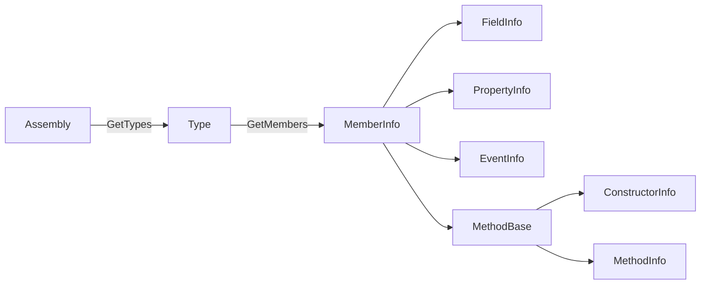

<TLDR>
  <TLDRCell label="what">
    <Term id="reflection">反射（reflection）</Term>让代码在运行时取得程序集、类型和成员的元数据，并按需创建对象、读写成员或调用方法。
  </TLDRCell>
  <TLDRCell label="trap">
    只按名称查找会撞上重载、继承和可见性边界；动态调用还会把目标方法的异常包装成`TargetInvocationException`。
  </TLDRCell>
  <TLDRCell label="fix">
    用明确的`Type`、签名和`BindingFlags`缩小查找范围，检查空结果与目标类型，并在裁剪或Native AOT发布流程中验证反射路径。
  </TLDRCell>
</TLDR>

## 是什么，为什么存在

反射是 .NET在运行时公开程序元数据的一组API。程序集保存类型定义，类型再公开构造函数、方法、属性、字段、事件和特性等记录。普通C#调用由编译器绑定到成员，反射则把“查找哪个成员”推迟到程序运行时。

反射的入口通常是`System.Type`。`typeof(Order)`取得编译期已知类型，`value.GetType()`取得对象的实际运行时类型，`assembly.GetType(name)`则按名称在指定程序集中查找类型。三种方式表达的已知信息不同，不应为了“更动态”而把稳定的`typeof`改成字符串。

当框架只能在运行时知道参与类型时，反射有实际用途。测试运行器发现带标记的方法，依赖注入容器选择构造函数，序列化器读取属性，插件宿主识别实现接口的类型。共同点是框架代码不能在编译时直接写出所有业务类型。

反射也会把编译期错误推迟成运行时错误。拼错名称可能得到`null`，重载不明确可能抛出`AmbiguousMatchException`，实参与签名不匹配会在调用边界失败。能用接口、泛型或普通委托直接表达的固定调用，通常不需要反射。

元数据可见不等于业务上允许调用。若用户输入可以任意选择类型或成员，程序就把内部API变成了一种动态命令语言。公开边界应把外部名称映射到小型白名单，而不是直接传给`Type.GetMethod()`或`Activator.CreateInstance()`。

## 工作原理

### 元数据对象形成导航图

`Assembly`表示已加载的程序集，`Type`表示一种类型声明。`Type.GetMembers()`返回抽象的<Term id="member-info">成员信息（member information）</Term>，具体结果再表现为`MethodInfo`、`PropertyInfo`、`FieldInfo`、`EventInfo`或`ConstructorInfo`。这些对象描述成员，也提供部分动态操作入口。

下面的图同时包含导航关系和主要类型层级。`Type`本身也派生自`MemberInfo`，因为嵌套类型可以作为另一个类型的成员出现；图中只画出日常查找最常用的路径。



反射对象不是成员值。`PropertyInfo`描述属性的类型与访问器；调用`GetValue()`时才读取某个目标对象。`MethodInfo`描述签名；调用`Invoke()`时才把目标对象和实参数组交给运行时。

### `Type`来自不同的已知条件

`typeof(T)`不需要对象实例，也能表示接口、开放泛型或数组类型。`GetType()`只能在非空对象上调用，但会返回派生对象的实际类型。泛型代码中的`typeof(T)`是类型参数当前构造出来的类型，不一定等于变量所指对象的运行时类型。

字符串查找还必须解决程序集身份。`Type.GetType("Namespace.Widget")`并不会搜索进程中每个程序集；对其他程序集中的类型，通常需要程序集限定名或先选定`Assembly`再调用`GetType()`。找不到时应处理`null`，或在契约要求失败时使用带`throwOnError`的重载。

### 查找由名称、签名和标志共同决定

不带参数的`GetMethods()`、`GetProperties()`等方法主要返回公开成员。需要非公开、静态或仅当前类型声明的成员时，应显式组合<Term id="binding-flags">绑定标志（binding flags）</Term>。使用筛选重载时，通常至少要从`Instance`／`Static`和`Public`／`NonPublic`两组各选一个。

| 意图 | 常用标志或参数 | 仍需确认 |
| --- | --- | --- |
| 公开实例成员 | `Public | Instance` | 是否包含继承成员 |
| 当前类型自己声明的成员 | 加`DeclaredOnly` | 是否遗漏需要的基类成员 |
| 公开与非公开实例成员 | `Public | NonPublic | Instance` | 访问是否符合业务边界 |
| 一个方法重载 | 名称加形参`Type[]` | 泛型、`ref`与可空契约 |

成员名称不能标识一个重载。`GetMethod("Quote")`在同名重载存在时可能失败；给出`[typeof(decimal), typeof(string)]`才把查找限定到具体形参类型。返回`MethodInfo`后仍应检查静态或实例目标、返回类型和应用自己的允许规则。

### 调用分成解析和执行

反射调用先解析元数据，再执行目标成员。`MethodInfo.Invoke(target, arguments)`对实例方法要求兼容的`target`，对静态方法使用`null`。参数放在`object?[]`中，因此值类型会装箱，编译器也不会替你完成普通调用点上的可空分析。

若目标方法自身抛出异常，`Invoke()`会抛出`TargetInvocationException`，原始异常位于`InnerException`。参数数量、参数类型或目标对象错误则可能在目标方法开始前失败，不属于目标异常。日志与重试策略必须区分这两个阶段。

### 特性读取可能创建对象

<Term id="attribute">特性（attribute）</Term>记录在元数据中。`GetCustomAttribute<T>()`等API返回特性对象，意味着运行时会按记录调用特性构造函数并设置命名实参。特性构造函数因此不应执行网络访问、文件写入或其他隐藏工作。

只需要检查特性类型与构造实参时，`CustomAttributeData`可以读取元数据表示而不实例化特性。它适合扫描工具和诊断器，但返回的是`CustomAttributeTypedArgument`等描述对象，不是已经执行过构造函数的业务对象。

## 示例

下面三个示例依次检查成员、选择并调用重载，再按特性发现受约束的实现。当前环境没有 .NET SDK或C#编译器，因此代码块按仓库约定标明未执行，输出块不伪造结果。

### 检查当前类型的公开实例成员

第一个程序把查找限制为`Order`自己声明的公开实例成员。它显式排序结果，只是为了让诊断输出稳定；业务逻辑不应依赖反射API的返回顺序。

<Depth level="quick">

```csharp title="InspectMembers.cs"
// # not executed here: the .NET SDK and C# compilers are unavailable
using System;
using System.Linq;
using System.Reflection;

Type orderType = typeof(Order);
BindingFlags flags = BindingFlags.Public
    | BindingFlags.Instance
    | BindingFlags.DeclaredOnly;

foreach (MemberInfo member in orderType.GetMembers(flags)
             .OrderBy(member => member.MemberType)
             .ThenBy(member => member.Name))
{
    Console.WriteLine($"{member.MemberType}: {member.Name}");
}

Order order = new ExpressOrder { Id = 42, Total = 19.95m };
Console.WriteLine($"declared: {orderType.Name}");
Console.WriteLine($"runtime: {order.GetType().Name}");

public class Order
{
    public int Id { get; init; }
    public decimal Total { get; init; }
    private void Recalculate() { }
}

public sealed class ExpressOrder : Order { }
```

```text
# not executed here: the .NET SDK and C# compilers are unavailable
```

<TryToBreak items={['给基类增加公开属性', '去掉Public标志', '给Order增加同名重载']} />

</Depth>

`DeclaredOnly`排除了继承成员，`Public | Instance`又排除了`Recalculate()`。属性的公开访问器也是方法，所以`GetMembers()`的结果不只包含两条`Property`记录。需要纯属性列表时，直接调用`GetProperties(flags)`比先取全部成员再按类型筛选更准确。

变量的静态类型是`Order`，但`order.GetType()`返回`ExpressOrder`。插件、代理和ORM实体中经常出现这项差异。开始反射前，应先写清契约针对声明类型还是实际运行时类型。

### 精确选择重载并保留原始异常

第二个程序用形参类型数组选择双参数重载。它分别处理正常结果和目标方法抛出的异常，不把业务失败误报成反射基础设施失败。

```csharp title="InvokeOverload.cs"
// # not executed here: the .NET SDK and C# compilers are unavailable
using System;
using System.Reflection;

Type calculatorType = typeof(ShippingCalculator);
MethodInfo quote = calculatorType.GetMethod(
    nameof(ShippingCalculator.Quote),
    [typeof(decimal), typeof(string)])
    ?? throw new MissingMethodException(calculatorType.FullName, "Quote");

var calculator = new ShippingCalculator();
object? result = quote.Invoke(calculator, [12.5m, "EU"]);
Console.WriteLine($"quote: {result}");

try
{
    quote.Invoke(calculator, [-1m, "EU"]);
}
catch (TargetInvocationException error)
    when (error.InnerException is ArgumentOutOfRangeException inner)
{
    Console.WriteLine($"inner: {inner.GetType().Name}");
}

public sealed class ShippingCalculator
{
    public decimal Quote(decimal weight) => Quote(weight, "local");

    public decimal Quote(decimal weight, string zone)
    {
        ArgumentOutOfRangeException.ThrowIfNegative(weight);
        return zone == "EU" ? weight * 2m : weight;
    }
}
```

```text
# not executed here: the .NET SDK and C# compilers are unavailable
```

`nameof`防止方法改名后留下无提示的字符串，但它不能选择重载。真正消除歧义的是形参类型列表。若方法包含`ref`或`out`参数，对应元素必须使用`typeof(T).MakeByRefType()`，调用后还要从实参数组读取更新后的值。

捕获筛选器只处理内部异常为`ArgumentOutOfRangeException`的包装异常。其他`TargetInvocationException`会继续传播，参数绑定阶段抛出的异常也不会进入这个分支。生产代码还应保留原始堆栈与操作上下文，而不是只打印消息。

### 用接口与特性约束类型发现

最后一个程序只实例化同时满足接口、具体类型和标记特性三项条件的类型。反射负责发现候选者，普通接口负责后续调用，因此动态边界保持得很窄。

```csharp title="DiscoverCommands.cs"
// # not executed here: the .NET SDK and C# compilers are unavailable
using System;
using System.Linq;
using System.Reflection;

var commands = Assembly.GetExecutingAssembly()
    .GetTypes()
    .Where(type => typeof(ICommand).IsAssignableFrom(type))
    .Where(type => !type.IsAbstract && !type.ContainsGenericParameters)
    .Select(type => new
    {
        Type = type,
        Marker = type.GetCustomAttribute<CommandAttribute>()
    })
    .Where(candidate => candidate.Marker is not null)
    .OrderBy(candidate => candidate.Marker!.Name);

foreach (var candidate in commands)
{
    if (Activator.CreateInstance(candidate.Type) is ICommand command)
        Console.WriteLine($"{candidate.Marker!.Name}: {command.Execute()}");
}

public interface ICommand
{
    string Execute();
}

[AttributeUsage(AttributeTargets.Class, Inherited = false)]
public sealed class CommandAttribute(string name) : Attribute
{
    public string Name { get; } = name;
}

[Command("status")]
public sealed class StatusCommand : ICommand
{
    public string Execute() => "ready";
}
```

```text
# not executed here: the .NET SDK and C# compilers are unavailable
```

接口检查阻止无关类型进入激活路径，特性则提供稳定的外部名称。`Activator.CreateInstance(Type)`仍要求这里的候选类型具有可用的无参构造函数；真实插件协议应在启动时验证这一约束，并对重复命令名给出确定错误。

扫描当前小程序集适合示例，但大型应用不应每次请求都重复扫描。通常在有明确生命周期的启动阶段构建不可变注册表。若类型来自外部程序集，还要单独设计加载上下文、依赖解析、卸载和信任边界。

## 陷阱

### 只按方法名查找

> [!PITFALL]
> `GetMethod("Run")!`假定名称唯一且永远存在。增加重载、改名或选择了错误的声明类型后，代码会得到歧义、空引用，或调用不符合契约的成员。

**修复方法：** 同时指定形参类型、泛型形态和所需标志，并用`?? throw`在解析阶段产生含类型与签名的错误。把解析放到启动验证中，避免第一次真实请求才发现配置错误。

### 漏掉一组`BindingFlags`

> [!PITFALL]
> 只传`NonPublic`或只传`Instance`往往得不到预期成员，因为筛选没有同时说明可见性和成员形态。机械加上所有标志又会扩大查找范围，把静态、继承或私有成员混入结果。

**修复方法：** 用一句话写出查找意图，再分别选择`Public`／`NonPublic`、`Instance`／`Static`和可选的`DeclaredOnly`。用至少一个继承成员和一个私有成员测试边界。

### 依赖枚举顺序

> [!PITFALL]
> 把`GetConstructors()[0]`当作“默认构造函数”，或取扫描结果的第一项，会让选择策略藏在元数据顺序中。声明调整、生成代码和依赖更新都可能改变候选集合。

**修复方法：** 按公开规则选择唯一候选者，例如标记特性或精确签名；零个和多个候选者都应明确失败。排序只能稳定展示，不能代替业务选择规则。

### 把`CanWrite`当作公开setter

> [!PITFALL]
> `PropertyInfo.CanWrite`只说明属性存在setter，不保证setter公开，也不保证写入符合对象不变量。生成的映射器常因此改写本应只由构造过程维护的状态。

**修复方法：** 若协议只允许公开写入，检查`property.SetMethod?.IsPublic == true`。再按字段白名单、空值和转换规则校验输入；需要构造期不变量时，优先调用明确构造函数或工厂。

### 丢失目标异常

> [!PITFALL]
> 只记录`TargetInvocationException.Message`会隐藏目标方法的真实异常类型和位置。反过来，把所有反射失败都当成`InnerException`又会漏掉参数、目标对象和访问阶段的错误。

**修复方法：** 先区分解析、绑定和目标执行阶段。目标异常按应用策略保留或重新抛出原始异常，基础设施错误则携带成员签名与目标类型单独报告。

### 把外部字符串直接变成调用

> [!PITFALL]
> `Type.GetType(userType)`加`GetMethod(userAction)`让调用方探索程序中可达的类型和成员。方法名黑名单挡不住新名称、继承成员或副作用不同的等价入口。

**修复方法：** 把外部标识映射到应用定义的命令表，每项绑定一个已审核委托或受约束类型。程序集来源、接口实现和构造方式都要在进入注册表前验证；隔离插件还需要进程或平台级安全边界。

### 忽略裁剪和Native AOT

> [!PITFALL]
> 只由不可分析的名称字符串访问的成员可能不被静态调用图看见。开发环境中的框架相关构建能运行，不代表裁剪发布或Native AOT发布后仍保留相同元数据和代码。

**修复方法：** 在真实发布配置中启用分析器并处理警告。能静态表达成员需求时使用`DynamicallyAccessedMembers`等注解；模式过于动态时缩小反射边界、声明限制，或改用源生成器和显式注册。

<Depth level="deep">

## 查找、调用与部署边界

### `Type`身份不只是一段名称

类型的`FullName`不包含完整程序集身份。两个程序集可以声明同名类型，插件也可能在不同的`AssemblyLoadContext`中加载相同程序集的不同实例。日志可显示名称帮助人阅读，但注册表和缓存应使用实际`Type`或明确的程序集身份，而不是只用短名称。

`IsAssignableFrom()`按运行时类型身份和继承／接口关系判断兼容性。名称相同不保证可赋值。插件发生看似不可能的强制转换错误时，应同时检查契约程序集由哪个加载上下文载入，而不是继续比较字符串。

### 继承会改变候选集合

公开实例方法通常会沿继承层级出现在查找结果中，`DeclaredOnly`则把结果限制到当前`Type`。基类私有成员不会像普通继承成员那样成为派生类的成员。要检查每一层自己声明的私有成员，需要逐层访问`BaseType`并明确执行查询。

`FlattenHierarchy`的名字很容易误导。它影响继承层级上的部分静态成员，不表示“取回所有基类私有内容”，也不是实例成员的通用递归开关。查找规则应围绕具体API与目标成员种类写测试。

接口还有独立边界。检查一个类型是否实现接口可用`interfaceType.IsAssignableFrom(candidate)`；若要处理开放泛型接口，则需要检查候选接口的`IsGenericType`和`GetGenericTypeDefinition()`。只比较接口名称会丢失泛型实参与程序集身份。

### 属性、字段和方法不是同一种成员

属性是访问器方法组成的元数据抽象，不等于幕后字段。自动属性可能生成字段，但字段名称属于编译器实现约定，不应成为序列化或映射协议。需要属性时用`GetProperties()`，需要字段时用`GetFields()`，不要从`GetMembers()`的混合结果猜测。

索引器也是属性，但`GetIndexParameters()`非空，调用`GetValue()`或`SetValue()`时需要索引实参。只处理普通属性的映射器应明确排除索引器。写入前还应分别检查getter、setter的存在与可见性，而不是只看`CanRead`和`CanWrite`。

方法签名还包含泛型参数数量、`ref`／`out`形态和调用约定。`typeof(int)`与`typeof(int).MakeByRefType()`不是同一个形参类型。处理泛型方法定义时，先验证`IsGenericMethodDefinition`和约束，再用`MakeGenericMethod()`构造封闭方法。

### 反射绑定不会复刻所有源码规则

普通C#调用由编译器执行重载解析、泛型推断和可空分析。反射从运行时类型与对象数组工作，没有源码调用点的全部信息。不要假定`Invoke()`会按你的业务协议解析字符串、自动选择最合适的重载或执行领域转换。

若动态入口接收文本，应在反射外定义解析层。它按允许的目标类型处理枚举、可空值、日期、区域设置和空文本，再把类型正确的对象交给成员。这样，输入错误与反射错误有不同且稳定的报告方式。

可选参数也需要明确策略。反射调用可以在特定绑定路径中使用`Type.Missing`请求默认值，但这不等于省略数组元素；API演进后，默认值还可能与调用方预期不同。面向外部输入的命令协议最好显式定义每个参数及其版本。

### 调用会跨越异常边界

`TargetInvocationException`表示目标构造函数或方法开始执行后抛出了异常。它不是业务异常的新语义，只是反射调用边界的包装。需要按原始异常类型处理时，应查看`InnerException`，并避免用`throw inner;`重置堆栈。

反射前置阶段也有自己的失败：成员不存在、匹配歧义、目标对象类型错误、参数数量错误、参数类型不兼容或成员不可调用。把全部异常捕获成一个“reflection failed”会损失可操作信息。诊断事件至少应记录阶段、稳定成员签名和目标类型，但不要记录敏感实参。

`ref`与`out`参数通过实参数组传入。调用完成后，运行时把更新值写回数组对应位置。若封装器丢弃数组或复用错误的数组实例，普通调用可见的输出参数会消失，这类问题需要专门测试。

### 读取特性有两种成本模型

`GetCustomAttributes()`返回实例，特性构造函数和命名属性赋值会执行。构造函数抛错时，扫描过程可能在业务代码尚未启动前失败。特性设计应保持数据化，消费者则应决定实例化失败是跳过候选者还是终止启动。

`CustomAttributeData.GetCustomAttributes(member)`读取构造函数、位置实参与命名实参的描述，不创建特性实例。扫描器只需要路由名或版本号时，可以先用这条路径。不过，它仍要校验实参形状，不能把元数据中的值默认视为可信配置。

特性继承也不是统一规则。查询API的`inherit`参数、特性的`AttributeUsage.Inherited`，以及目标是类型还是被重写成员，都会影响结果。注册协议应明确只接受直接声明还是也接受继承标记，并为重复标记定义冲突规则。

### 缓存要保留完整选择条件

反射查找可放在启动阶段或其他低频路径，重复调用的热路径可以缓存已经验证的`MemberInfo`或委托。是否值得缓存必须由真实工作负载测量；没有基准时，不应声称某个固定倍数。创建强类型委托还能让后续调用脱离`object?[]`，但会增加签名适配代码。

缓存键必须包含决定结果的全部条件，通常至少有`Type`、成员种类、名称、签名和相关标志。只用方法名会把不同重载合并，只用`FullName`会忽略程序集或加载上下文。面向可卸载插件时，静态缓存持有`Type`或`MemberInfo`还可能阻止加载上下文卸载。

缓存也需要所有权和上限。若外部输入能制造无限类型名或签名组合，无界并发字典会把一次解析优化变成内存增长入口。优先缓存经过白名单验证的小型候选集，并在插件卸载或配置更新时替换整个注册表。

### 裁剪分析需要看见成员需求

裁剪器根据静态可见的使用关系移除不需要的代码。`typeof(Handler).GetMethods()`这类可分析模式和从任意字符串取得类型再扫描全部成员，给分析器的信息完全不同。警告说明静态分析不能证明所需成员会保留，不能只因为开发构建能运行就忽略。

`DynamicallyAccessedMembers`可以把“这个`Type`值必须保留哪些成员”传播到参数、返回值或字段。注解必须匹配真实反射操作；写得过宽会保留过多代码，写得过窄仍可能在发布产物中失败。`DynamicDependency`与`RequiresUnreferencedCode`解决的是不同形状的问题，也不应被当作通用消警工具。

无法静态描述的大型反射协议适合重新设计。显式注册把类型选择变成普通引用，源生成器可以在编译期生成映射或序列化代码。保留反射时，应把它集中在少数入口，并用目标RID的裁剪或Native AOT产物运行集成测试。

### 反射不是隔离机制

访问非公开成员会绕过类型作者希望调用方遵守的普通API边界，也容易随内部重构而损坏。它不应成为跨组件协议。测试工具偶尔需要这种访问时，应把依赖集中并接受升级成本，生产集成则优先要求公开契约。

允许加载并实例化第三方程序集意味着执行该程序集中的代码。接口和特性筛选只说明形状，不证明代码安全。需要运行不可信插件时，应使用操作系统进程、权限、资源限制和通信协议形成隔离，不能依赖`AssemblyLoadContext`或反射白名单充当沙箱。

</Depth>

<Checkpoint id="csharp/reflection" />

## 延伸阅读

- [Microsoft Learn：C#特性与反射](https://learn.microsoft.com/en-us/dotnet/csharp/advanced-topics/reflection-and-attributes/)
- [Microsoft Learn：`Type`类](https://learn.microsoft.com/en-us/dotnet/api/system.type?view=net-10.0)
- [Microsoft Learn：`BindingFlags`枚举](https://learn.microsoft.com/en-us/dotnet/api/system.reflection.bindingflags?view=net-10.0)
- [Microsoft Learn：`MethodBase.Invoke`](https://learn.microsoft.com/en-us/dotnet/api/system.reflection.methodbase.invoke?view=net-10.0)
- [Microsoft Learn：`CustomAttributeData`类](https://learn.microsoft.com/en-us/dotnet/api/system.reflection.customattributedata?view=net-10.0)
- [Microsoft Learn：为裁剪准备 .NET库](https://learn.microsoft.com/en-us/dotnet/core/deploying/trimming/prepare-libraries-for-trimming)
