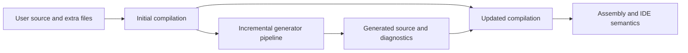

<TLDR>
  <TLDRCell label="what">
    A <Term id="source-generator">source generator</Term> is a compiler-loaded component. It reads the current compilation and other declared inputs, adds C# source files, and can report diagnostics.
  </TLDRCell>
  <TLDRCell label="when">
    Use one when types, attributes, or configuration fully describe repetitive code at compile time, such as serialization metadata, regex implementations, or registries. It doesn't fit requirements that depend on runtime data.
  </TLDRCell>
  <TLDRCell label="how">
    New generators should implement `IIncrementalGenerator`, project syntax and symbols into small equatable models early, and emit deterministic source under stable file names.
  </TLDRCell>
</TLDR>

## What it is and why it exists

A source generator runs during C# compilation. It can inspect source, parse options, references, analyzer configuration, and additional files, then use Roslyn APIs to add new `SourceText` objects. The added source goes through binding, type checking, and code generation like ordinary source.

Generation is additive; it isn't a source rewriter. A generator can't delete a statement, replace a method body, or edit a user file. To add members to an existing type, the user declaration and generated declaration usually compose through `partial`. This boundary keeps generated output inspectable and stops generators from silently rewriting developer input.

Source generation fits repetitive work that can be described statically. `System.Text.Json` can generate serialization metadata, `GeneratedRegexAttribute` can generate a regular-expression implementation, and a framework can build registration code from explicit markers. Consumers call ordinary C# members, and the compiler still checks those calls.

A source generator isn't a macro and has no general ability to transform syntax nodes. It can't generate code from the current state of an HTTP request or database. When the requirement would replace only a little handwritten code, the cost of another project, packaging, diagnostics, and compatibility tests often exceeds the boilerplate removed.

Consuming a generator and authoring one are different jobs. Consumers mainly care about activation, the generated contract, and publish settings. Authors must also handle Roslyn semantics, incremental invalidation, source escaping, diagnostic locations, and compiler-host compatibility. This topic covers both sides but concentrates on boundaries that generator authors commonly get wrong.

Older codebases still contain `ISourceGenerator`, while Roslyn documentation directs new implementations toward an <Term id="incremental-generator">incremental generator</Term>. Don't turn that migration advice into a claim that a particular .NET release suddenly removed the old interface. When upgrading an existing generator, pin its generated contract with tests before changing its execution model.

### Generated output is an API

Generated members enter the consumer's compilation view, so their names, accessibility, nullable annotations, and diagnostic ids form a public contract. A template change can be only a patch release for the generator assembly yet stop consumer source from compiling. Version review must inspect more than the generator assembly's own public types.

Snapshots and compilation tests should state which differences are allowed for the same input across an upgrade. If a member must be renamed or a generation condition changes, provide a migration diagnostic or compatibility period instead of silently removing the member. Formatting-only changes don't normally break the API, but they still affect snapshots and debugging.

Generator failure is also build behavior. For one invalid target, prefer a diagnostic and continue processing independent targets. Reserve exceptions for violated generator invariants that tests should catch. Swallowing every exception leaves consumers with missing members and discards the actual cause.

Treat a third-party generator upgrade as a source-dependency review. Inspect new diagnostics, generated-member differences, and publish output, especially under trimming or Native AOT settings. Successful package restore doesn't prove that the generator loads correctly in the targeted compiler host.

## How it works

### Two compilation views

The compiler builds an initial compilation from user source, runs generators, and adds generated source to an updated compilation. A generator can read the initial compilation but can't edit its trees. An ordinary source generator also can't treat another generator's output as an ordered upstream input because generators have no dependable execution order.



`AddSource` receives a hint name and source text. The hint should stay stable for the same logical input and be unique within one generator. It is an identity hint for the generated file, not an absolute disk path. Reusing a hint produces a generator error, while timestamps or random values make output change without a business change.

Generated source should declare `// <auto-generated/>` and an explicit nullable context. When usage is invalid, a generator should call `ReportDiagnostic` at the relevant user-source location instead of throwing an ordinary exception. An exception usually tells the consumer only that the generator failed; a located diagnostic can explain how to correct the input.

### `Initialize` builds a dataflow graph

`IIncrementalGenerator.Initialize` describes an immutable dataflow graph; it doesn't immediately scan the project. The compiler host decides when to execute transformations and caches intermediate results. The compiler also owns generator instance lifetime, so a generator must not keep cross-pass state in instance fields.

Sources appear as `IncrementalValueProvider<T>` or `IncrementalValuesProvider<T>`. The first supplies one value per evaluation, such as `CompilationProvider`; the second supplies zero or more, such as `AdditionalTextsProvider`. These objects describe computations. They aren't containers for initialization code to enumerate directly.

Common transformations resemble LINQ, but their purpose is to build an incremental graph. `Where` removes values, `Select` projects models, `Combine` joins two providers, and `Collect` aggregates a value set into an immutable array. `RegisterSourceOutput` connects a graph result to source or diagnostic production.

| Operation | Relationship it expresses | Review focus |
| --- | --- | --- |
| `Where` | Remove irrelevant candidates | Is the condition cheap and stable? |
| `Select` | Extract a model from an input | Does the result have value equality? |
| `Combine` | Join independent inputs | Does one side invalidate too much work? |
| `Collect` | Turn many values into one batch | Does aggregation magnify a local change? |
| `RegisterSourceOutput` | Produce source or diagnostics | Is output deterministic and each hint unique? |

Cache reuse depends on equality between step outputs. Returning a fresh ordinary class, array, or `ImmutableArray<T>` can keep triggering downstream work even when its contents haven't changed, because those values may use reference equality. Good models are often records containing strings, Boolean values, and other stable values; collections need an explicit element-wise equality policy.

### Syntax filtering and semantic confirmation

A <Term id="syntax-tree">syntax tree</Term> retains the structure and textual form of source. It suits a cheap candidate test such as "this is a class declaration with an attribute list." Syntax text alone can't reliably identify a type: attributes can use aliases, qualified names, or an omitted `Attribute` suffix, and an unrelated namespace can define the same short name.

A <Term id="semantic-model">semantic model</Term> binds syntax to types and symbols. When you must recognize a particular attribute, interface, overload, or accessibility level, query semantics during transformation instead of comparing `ToString()`. After the query, promptly extract the facts you need into a small model rather than carrying an `ISymbol` or `SyntaxNode` through the pipeline.

For attribute-driven generators, `ForAttributeWithMetadataName` combines efficient candidate selection with semantic matching. Its argument is a full metadata name such as `Demo.DescribeAttribute`; the callback receives the target node, target symbol, and matching attribute data. It avoids the alias and same-name failures common in handwritten suffix tests.

The syntax predicate can run frequently while a developer types. It should check only node shape or the presence of attribute lists, not obtain semantic models, walk the whole compilation, or read files. Pass cancellation tokens to longer reads and transformations so the host can abandon stale work after another edit.

## Examples

The first example consumes a platform generator. The second uses `GeneratorDriver` to inspect a small attribute-driven generator. This environment has no .NET SDK or C# compiler, so each code block carries the repository's non-execution marker and its output block records only that fact.

### Generate an implementation with `GeneratedRegex`

`GeneratedRegexAttribute` places the pattern, options, and timeout on a `partial` method. When the compiler finds the platform generator, it supplies that method's implementation. The caller depends only on the returned `Regex`, not an internal generated class name.

<Depth level="quick">

```csharp title="SlugParser.cs"
// # not executed here: the .NET SDK and C# compilers are unavailable
using System;
using System.Text.RegularExpressions;

Console.WriteLine(SlugParser.IsValid("source-generators"));
Console.WriteLine(SlugParser.IsValid("Source Generators"));

public static partial class SlugParser
{
    [GeneratedRegex(
        "^[a-z0-9]+(?:-[a-z0-9]+)*$",
        RegexOptions.CultureInvariant,
        matchTimeoutMilliseconds: 100)]
    private static partial Regex SlugPattern();

    public static bool IsValid(string value) =>
        SlugPattern().IsMatch(value);
}
```

```text
# not executed here: the .NET SDK and C# compilers are unavailable
```

<TryToBreak items={['an empty string', 'a string with two consecutive hyphens', 'a very long non-matching string']} />

</Depth>

The source contains only the method declaration, not a handwritten regex implementation. If the project doesn't load the required generator, the `partial` method lacks an implementation and compilation fails. Reflection or configuration doesn't wait until the first request to reveal the missing generation step. That compile-time failure is part of the generated contract's value.

Timeout remains part of the call contract. Source generation changes when the implementation is produced; it doesn't make a problematic pattern safe or replace tests with long inputs. Apply the same distinction to third-party generators: producing code doesn't prove that the code meets your application boundary.

### Test a custom generator with `GeneratorDriver`

This probe project references Roslyn 5.0.0, matching the C# 14 / .NET 10 target. It puts the generator and driver in one console project solely for a quick verification. A published NuGet package will normally separate the generator assembly from the consumer assembly.

```xml title="GeneratorProbe.csproj"
<Project Sdk="Microsoft.NET.Sdk">
  <PropertyGroup>
    <OutputType>Exe</OutputType>
    <TargetFramework>net10.0</TargetFramework>
    <LangVersion>14.0</LangVersion>
    <Nullable>enable</Nullable>
  </PropertyGroup>
  <ItemGroup>
    <PackageReference Include="Microsoft.CodeAnalysis.CSharp" Version="5.0.0" />
  </ItemGroup>
</Project>
```

The generator finds public partial classes by the attribute's full metadata name and immediately projects the symbol into two strings. The output callback no longer holds an `INamedTypeSymbol`, so the model doesn't keep an old compilation alive.

```csharp title="DescribeGenerator.cs"
// # not executed here: the .NET SDK and C# compilers are unavailable
using System.Text;
using Microsoft.CodeAnalysis;
using Microsoft.CodeAnalysis.CSharp.Syntax;
using Microsoft.CodeAnalysis.Text;

[Generator]
public sealed class DescribeGenerator : IIncrementalGenerator
{
    public void Initialize(IncrementalGeneratorInitializationContext context)
    {
        var types = context.SyntaxProvider.ForAttributeWithMetadataName(
            "Demo.DescribeAttribute",
            static (node, _) => node is ClassDeclarationSyntax,
            static (match, _) => new TypeModel(
                match.TargetSymbol.ContainingNamespace.ToDisplayString(),
                match.TargetSymbol.Name));

        context.RegisterSourceOutput(types, static (output, model) =>
        {
            string source = $$"""
                // <auto-generated/>
                #nullable enable
                namespace {{model.Namespace}};
                public partial class {{model.Name}}
                {
                    public static string Describe() => "{{model.Name}}";
                }
                """;

            output.AddSource(
                $"{model.Namespace}.{model.Name}.Describe.g.cs",
                SourceText.From(source, Encoding.UTF8));
        });
    }

    private sealed record TypeModel(string Namespace, string Name);
}
```

```text
# not executed here: the .NET SDK and C# compilers are unavailable
```

The driver creates an initial compilation from a string, runs the generator, and queries a type in the updated compilation. Counting generated trees shows that the pipeline emitted a file. Looking up `Describe` also proves that the generated declaration merged with the user's `partial` type.

```csharp title="Program.cs"
// # not executed here: the .NET SDK and C# compilers are unavailable
using System;
using System.Linq;
using Microsoft.CodeAnalysis;
using Microsoft.CodeAnalysis.CSharp;

const string input = """
    namespace Demo;
    [System.AttributeUsage(System.AttributeTargets.Class)]
    public sealed class DescribeAttribute : System.Attribute;
    [Describe]
    public partial class Order { }
    """;

var compilation = CSharpCompilation.Create(
    "Demo",
    [CSharpSyntaxTree.ParseText(input)],
    [MetadataReference.CreateFromFile(typeof(object).Assembly.Location)],
    new CSharpCompilationOptions(OutputKind.DynamicallyLinkedLibrary));

GeneratorDriver driver = CSharpGeneratorDriver.Create(
    new DescribeGenerator().AsSourceGenerator());
driver = driver.RunGeneratorsAndUpdateCompilation(
    compilation, out Compilation updated, out _);

var generated = driver.GetRunResult().GeneratedTrees;
var order = updated.GetTypeByMetadataName("Demo.Order")!;
Console.WriteLine($"generated: {generated.Length}");
Console.WriteLine($"Describe members: {order.GetMembers("Describe").Length}");
Console.WriteLine($"errors: {updated.GetDiagnostics().Count(
    diagnostic => diagnostic.Severity == DiagnosticSeverity.Error)}");
```

```text
# not executed here: the .NET SDK and C# compilers are unavailable
```

A real test should assert generated text, hint names, and diagnostics, not only a count. Treat error diagnostics from the updated compilation as a failure as well; that catches a generator that emitted a file which doesn't bind. For negative input, verify the diagnostic id, severity, and `Location` point to source the consumer can fix.

This small generator deliberately supports only top-level, non-generic, public classes. If the product contract permits nested types, records, generics, or the global namespace, expand the model and emitter and add an input for each shape. A simple sample isn't evidence of a broader contract.

## Pitfalls

### Matching attributes by syntax text

> [!PITFALL]
> Comparing `attribute.Name.ToString() == "Generate"` recognizes only one spelling. Aliases, `GenerateAttribute`, a fully qualified name, and an unrelated same-named attribute can all produce misses or false matches.

**Fix:** use `ForAttributeWithMetadataName` with the full metadata name for semantic matching. Test a short name, suffixed name, alias, `global::` qualification, and an unrelated attribute with the same short name.

### Keeping Roslyn objects in cached models

> [!PITFALL]
> `ISymbol`, `SyntaxNode`, `Compilation`, and `Location` aren't suitable long-lived value models. Small edits can make them unequal, and a symbol can keep an old compilation and its object graph reachable.

**Fix:** use them in the step that needs semantics, then project into value-equatable records. Give collections element-wise equality; merely putting an array in a `record` doesn't make its contents value-equatable.

### Calling `Collect` too early

> [!PITFALL]
> Collecting every candidate class before emitting one file per class turns a local edit into a change of the whole batch. That aggregation destroys the useful granularity when each input can produce its output independently.

**Fix:** keep a values provider itemized and register output directly for each model. Aggregate only when sorting, duplicate detection, or one global registry truly needs the complete set, and define a stable order afterward.

### Emitting an incomplete type declaration

> [!PITFALL]
> Generating `partial class Customer` works only for the simplest input. Records, structs, nested types, generic parameters, constraints, accessibility, and the containing namespace can all require another declaration shape.

**Fix:** write a supported-input matrix first, then extract type kind, container chain, and required modifiers from symbols. Report a located diagnostic for unsupported shapes instead of emitting source that causes cascading compiler errors.

### Failing to escape identifiers and literals

> [!PITFALL]
> Inserting a type name, configuration value, or attribute argument directly into a source string breaks on keyword identifiers, quotes, newlines, backslashes, or Unicode boundaries. If build input isn't trusted, direct concatenation also expands the syntax it can produce.

**Fix:** treat identifier, type-display, and string-literal contexts separately and use the corresponding Roslyn escaping or formatting support. Test generated text with quotes, newlines, keywords, generics, and nullable types, then compile that text.

### Letting output drift with the environment

> [!PITFALL]
> Writing the current time, a random GUID, a machine path, or unstable enumeration order into generated source makes identical inputs produce different files. Build caches, snapshots, and code review all receive meaningless churn.

**Fix:** compute output only from declared inputs, sort any collection without a contractual order, and use stable unique hint names. If build information is required, model it as explicit configuration and decide whether it deserves to invalidate the cache.

### Depending on another generator's ordinary output

> [!PITFALL]
> Generator A assumes its initial compilation contains a type just emitted by generator B. That relies on an ordinary execution order which doesn't exist. Neither IDE nor command-line hosts must run the generators that way.

**Fix:** make both generators consume user declarations, additional files, or an ordinary runtime contract instead of each other's output. If two phases require ordering, keep the protocol in one generator and use only phase APIs explicitly supported by the targeted Roslyn version.

## In the AI era

**What generated code gets wrong here**

Models often copy an old `CreateSyntaxProvider` sample and compare short attribute names as text. It passes one demo while missing aliases and fully qualified names. Another common result collects a `Compilation` and every candidate on each edit, then stores `ISymbol` in a record. It uses the incremental API by name without creating a reusable value boundary.

Source emission hides another set of failures. Models interpolate `symbol.Name` into a declaration and forget keyword identifiers, namespaces, containing types, records, and generics. They also reuse `Generated.g.cs` for every target. When a generated string contains configuration data, quotes and line breaks often remain unescaped until an actual project supplies an awkward value.

Models also add timestamps, absolute paths, or `Guid.NewGuid()` as "helpful debugging" data. Identical input then produces different output and repeatedly defeats caches. Ask the model to remove those values, sort unordered inputs explicitly, and test the updated compilation instead of snapshotting only generated strings.

**Ask your AI to check**

- List the input type, output type, equality rule, and downstream invalidation caused by a one-file edit for every pipeline step.
- Construct inputs using an alias, a same-named attribute, a nested generic record, and a keyword identifier; compile every generated tree and list all error diagnostics.
- Inspect every `AddSource` hint, collection order, path, time, and random value, then prove identical inputs produce byte-identical output.

**Review checklist**

- Attribute and type matching uses semantic identity, the syntax predicate stays cheap, and long work observes cancellation.
- Cached models don't retain `Compilation`, `ISymbol`, or long-lived `SyntaxNode` values, and every collection has explicit content equality and ordering.
- Generated source covers declaration and escaping boundaries, hint names are unique, invalid input gets located diagnostics, and the updated compilation has no errors.

**Prompt vocabulary**

Use the exact terms `incremental generator`, `incremental provider`, `syntax predicate`, `semantic transform`, `value equality`, `invalidation`, `hint name`, `deterministic output`, and `GeneratorDriver`. Ask for a pipeline table and input matrix; "optimize this generator" doesn't identify which incremental boundaries must survive.

<Depth level="deep">

## Designing incremental boundaries

An incremental generator gets its performance from changes that stop propagating, not from the interface name. A useful pipeline produces a small value immediately after semantic inspection, such as a namespace, type name, and a few Boolean options. When that value equals the previous value, downstream source formatting needn't run again.

Model granularity should match output granularity. If one type produces one file, let each `TypeModel` flow independently to output. If one configuration file produces one generated file, make its path and content digest inputs to that branch. Combining the entire `Compilation` with each model makes any compilation change reach the branch and should be reserved for emission that truly needs global semantics.

A `record` composes the equality contracts of its members. Strings and Boolean values compare by value, but arrays, `ImmutableArray<T>`, and many collections don't provide element-wise value equality by default. Use a well-defined immutable wrapper, a custom comparer, or a stable digest at the model boundary. A digest must include every fact that can alter output; cache hits bought with collisions or missing facts are correctness bugs.

`Collect` has legitimate uses, including detecting duplicate keys across every target or emitting one global route table. After aggregation, sort by a stable business key before detecting duplicates and report every conflict location. Don't depend on incidental syntax-tree, symbol-enumeration, or file-system order.

You can turn a pipeline review into an invalidation table. For edits to a method body, target type name, attribute argument, unrelated file, and additional configuration, identify exactly which steps should rerun. If every edit reaches the final emitter, the code uses `IIncrementalGenerator` without delivering useful incrementality.

### State, concurrency, and cancellation

The compiler controls generator instance lifetime and may schedule transformations concurrently. Don't accumulate seen types, incremental file numbers, or cached `StringBuilder` instances in fields. That state isn't a declared input and has no reliable cleanup or synchronization boundary.

Treat each transformation as a pure input-to-output computation. Put cacheable values in the incremental graph, express aggregation with `Collect`, and model configuration through `AnalyzerConfigOptionsProvider` or `AdditionalTextsProvider`. The host can then make valid reuse, concurrency, and cancellation decisions.

A cancellation token isn't a decorative parameter. Check it during large additional-file reads, member walks, or substantial formatting, and pass it to Roslyn APIs that accept it. Cancellation says the host no longer needs that snapshot; don't convert it into a user-visible generation error.

## Correctness of emitted source

Generated text is new compiler input and deserves the same review as handwritten library code. At minimum, add every generated tree to the updated compilation in tests and reject every error diagnostic. A string snapshot detects text changes, but it doesn't prove binding, accessibility, or `partial` composition.

Type names should come from semantic identity and use a display format suitable for source. A `global::` prefix can reduce ambiguity from consumer namespaces and `using` directives, but you must still choose how to represent nullable annotations, tuple names, and generic parameters. A debugging display string isn't automatically valid source.

When augmenting an existing type, containing types may also need matching `partial` declarations. Type kind, generic arity, parameter order, and required modifiers must be compatible with user declarations. Report one clear diagnostic on an unsupported target rather than relying on dozens of later compiler errors to explain it.

String literals, character literals, and identifiers follow different escaping rules. Configuration inserted into an ordinary string must cover quotes, backslashes, newlines, control characters, and Unicode. Raw strings don't make arbitrary input safe merely by surrounding it with more quotes. Prefer tested Roslyn construction or a dedicated literal formatter.

Every output needs a stable identity. A common hint name combines the full type identity with a fixed suffix, then encodes characters unavailable in a hint deterministically. Put same-named classes from two namespaces, nested classes, and generic arities in collision tests.

### Diagnostics are a public contract

A generator diagnostic needs a stable id, title, message format, category, severity, and default state. Its message should state an action the consumer can take, such as "type must be partial," instead of merely saying generation failed. Its location should point to the relevant type, attribute argument, or configuration item.

For invalid input, report a diagnostic and normally skip that target rather than emitting code that creates cascading errors. For duplicate business keys, report every conflict location or attach traceable additional locations. Don't silently choose the first candidate because input order might not be stable.

The test matrix should cover success, no match, one invalid target, conflicting targets, and cancellation. Run the generator twice as well: output stays identical for unchanged input, while a local change alters only related results. If a package supports several compiler versions, load it under that actual support matrix rather than testing only against the application runtime.

### Packaging and observability

The compiler host loads the generator, so target-framework compatibility concerns the host rather than the consumer application's runtime. A project reference is normally passed as an analyzer and doesn't expose the generator's runtime output to the consumer; a NuGet package places its generator assembly in the conventional analyzer directory. Verify loading in both command-line builds and each supported IDE before release.

During debugging, generated files are available through an IDE's analyzer node or a temporary compiler-generated-files build setting. If that output directory sits under the project tree, prevent the default `Compile` glob from including the files again, or the same declarations compile twice. Generated files are useful for inspection and snapshots; consumers shouldn't edit them by hand.

A log file isn't the generator's default diagnostic channel. Parallel builds, read-only environments, and remote builds make writes to the current directory brittle, and those files can disclose source or configuration in an unknown location. Use Roslyn diagnostics for consumer-actionable problems and a host-supported, optional trace mechanism for internal investigation.

</Depth>

<Checkpoint id="csharp/source-generators" />

## Further reading

- [Roslyn source generators design](https://github.com/dotnet/roslyn/blob/main/docs/features/source-generators.md)
- [Roslyn incremental generators design](https://github.com/dotnet/roslyn/blob/main/docs/features/incremental-generators.md)
- [Incremental generators cookbook](https://github.com/dotnet/roslyn/blob/main/docs/features/incremental-generators.cookbook.md)
- [`IIncrementalGenerator` API](https://learn.microsoft.com/en-us/dotnet/api/microsoft.codeanalysis.iincrementalgenerator?view=roslyn-dotnet-5.0.0)
- [`ForAttributeWithMetadataName` API](https://learn.microsoft.com/en-us/dotnet/api/microsoft.codeanalysis.syntaxvalueprovider.forattributewithmetadataname?view=roslyn-dotnet-5.0.0)
- [`System.Text.Json` source generation](https://learn.microsoft.com/en-us/dotnet/standard/serialization/system-text-json/source-generation)
