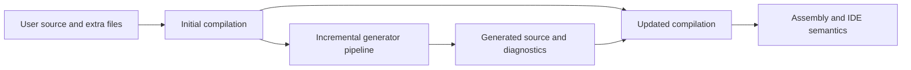

<TLDR>
  <TLDRCell label="what">
    <Term id="source-generator">源生成器（source generator）</Term>是编译器加载的组件。它读取当前编译及额外输入，添加新的 C# 源文件，并可报告诊断信息。
  </TLDRCell>
  <TLDRCell label="when">
    当重复代码可由类型、特性或配置在编译期完整描述时使用它，例如序列化元数据、正则表达式实现或注册表。需求依赖运行时数据时，它不合适。
  </TLDRCell>
  <TLDRCell label="how">
    新代码优先实现 `IIncrementalGenerator`，尽早把语法和符号投影成可比较的小模型，再以稳定的文件名和确定顺序生成源码。
  </TLDRCell>
</TLDR>

## 是什么，为什么存在

源生成器在 C# 编译过程中运行。它可以查看待编译源码、解析选项、引用、分析器配置与额外文件，并通过 Roslyn API 向编译加入新的 `SourceText`。加入的源码随后像普通源码一样接受绑定、类型检查和代码生成。

它是加法机制，不是源码重写器。生成器不能删除语句、替换方法体或改变用户文件；需要给已有类型增加成员时，用户声明和生成声明通常通过 `partial` 组成同一个类型。这条边界让生成结果可以独立查看，也避免生成器暗中改写开发者输入。

源生成适合把可静态描述的重复工作搬到编译期。`System.Text.Json` 可以生成序列化元数据，`GeneratedRegexAttribute` 可以生成正则表达式实现，框架也可以根据显式标记生成注册代码。消费者得到普通 C# 成员，编译器仍会检查这些成员的调用。

源生成器不是宏，也没有权限修改任意语法节点。它不能根据一次 HTTP 请求或数据库中的即时状态生成代码。若需求只涉及少量手写代码，生成器项目、打包、诊断和兼容性测试的成本通常高于它消除的样板代码。

使用现成生成器与编写生成器是两种不同工作。使用者主要关心启用方式、生成契约和发布配置；作者还必须处理 Roslyn 语义、增量失效、源码转义、诊断位置与编译器宿主兼容性。这个主题覆盖两边，但重点放在作者容易写错的边界。

旧的 `ISourceGenerator` 仍能在代码库中见到，Roslyn 文档建议新实现采用 <Term id="incremental-generator">增量生成器（incremental generator）</Term>。不要把这个迁移建议误写成某个 .NET 版本突然移除了旧接口；升级现有生成器时，应先用测试固定生成契约，再改变执行模型。

### 生成结果也是 API

生成成员会进入消费者的编译视图，因此名称、可访问性、可空注解和诊断 id 都属于公开契约。修改模板可能让生成器包只增加一个补丁版本，却使使用者源码无法编译；版本评审不能只看生成器自身程序集的公开类型。

同一个输入升级前后应产生怎样的差异，需要用快照与编译测试表达。若必须重命名成员或改变生成条件，应提供可迁移的诊断或兼容期，而不是静默让成员消失。生成代码的格式变化通常不破坏 API，但仍会影响快照和调试。

生成器失败也属于构建行为。对单个无效目标，最好报告诊断并继续处理其他独立目标；生成器自身违反不变量时才应让测试捕获异常。把所有异常吞掉会留下缺失成员，却丢失真正原因。

使用第三方生成器时，要把升级结果当作源码依赖审查。查看新增诊断、生成成员差异和发布产物，尤其要测试裁剪或 Native AOT 配置。包能恢复并不等于它在目标编译器宿主中正确加载。

## 工作原理

### 两次编译视图

编译器先根据用户源码建立初始编译，运行生成器，再把生成源码加入更新后的编译。生成器能读取初始编译，却不能编辑其中的树。普通源生成器也不能把另一个生成器的输出当成有序的上游输入，因为生成器之间没有可依赖的执行顺序。



`AddSource` 接收提示名称与源码文本。提示名称应对同一逻辑输入保持稳定，并且在一个生成器内唯一；它是生成文件的身份线索，不是磁盘绝对路径。相同提示名称被重复添加会产生生成器错误，而时间戳或随机数又会让没有业务变化的输出不断改变。

输出源码应包含 `// <auto-generated/>` 与明确的可空上下文。生成器遇到用法错误时，应通过 `ReportDiagnostic` 指向用户源码中的相关位置，而不是抛出普通异常。异常通常只告诉使用者「生成器失败」，有位置的诊断才能说明怎样修正输入。

### `Initialize` 建立数据流

`IIncrementalGenerator.Initialize` 描述一张不可变的数据流图，而不是立即扫描项目。编译器宿主决定何时执行各个转换，并缓存中间结果。生成器实例的生命周期也由编译器控制，因此不能把跨轮次状态保存在实例字段中。

数据源以 `IncrementalValueProvider<T>` 或 `IncrementalValuesProvider<T>` 表示。前者每次提供一个值，例如 `CompilationProvider`；后者提供零到多个值，例如 `AdditionalTextsProvider`。这些对象代表计算，不是让初始化代码直接读取的容器。

常见转换与 LINQ 外形相似，但语义是构建增量图。`Where` 筛掉值，`Select` 投影模型，`Combine` 合并两个提供者，`Collect` 把一组值聚合成一个不可变数组。`RegisterSourceOutput` 把图的某个结果连接到源码或诊断输出。

| 操作 | 适合表达的关系 | 审查重点 |
| --- | --- | --- |
| `Where` | 删除不相关候选 | 条件是否便宜且稳定 |
| `Select` | 从输入提取小模型 | 返回值是否具有值相等性 |
| `Combine` | 合并独立输入 | 一侧变化是否让过多工作失效 |
| `Collect` | 把多值变为一批 | 是否过早把局部变化扩大成全量变化 |
| `RegisterSourceOutput` | 产生源码或诊断 | 输出是否确定且提示名称唯一 |

缓存命中取决于步骤输出的相等性。每次都返回新的普通类、数组或 `ImmutableArray<T>`，即使内容相同，也可能因为引用相等而继续触发下游。适合的模型通常是只含字符串、布尔值和其他稳定值的 `record`，集合则需要明确的逐项相等策略。

### 语法筛选与语义确认

<Term id="syntax-tree">语法树（syntax tree）</Term>保留源码的结构与文本形态。它适合做便宜的候选筛选，例如「这是带特性列表的类声明」。仅凭语法文本无法可靠判断类型身份：特性可以使用别名、限定名或省略 `Attribute` 后缀，同名类型也可能来自别的命名空间。

<Term id="semantic-model">语义模型（semantic model）</Term>把语法绑定到类型与符号。需要识别某个特性、接口、重载或可访问性时，应在转换阶段查询语义，而不是比较 `ToString()`。完成查询后，应尽快把所需事实提取成小模型，不要让 `ISymbol` 或 `SyntaxNode` 沿管道长期传播。

针对特性驱动的生成器，`ForAttributeWithMetadataName` 同时提供高效候选筛选与语义匹配。参数使用完整元数据名，例如 `Demo.DescribeAttribute`；回调得到目标节点、目标符号和匹配的特性数据。它能避开手写字符串后缀判断常见的别名与同名类型错误。

语法谓词可能在编辑器输入期间频繁执行。这里应只检查节点种类或是否存在特性列表，不应获取语义模型、遍历整个编译或读文件。取消令牌要传给可能较长的读取与转换，避免用户继续编辑后，宿主仍为过期快照做工作。

## 示例

下面两个示例先展示如何消费平台自带生成器，再用 `GeneratorDriver` 检查一个最小的特性驱动生成器。当前环境没有 .NET SDK 或 C# 编译器，因此代码块按仓库规则标明未执行，输出块也只记录这一事实。

### 使用 `GeneratedRegex` 生成实现

`GeneratedRegexAttribute` 把模式、选项与超时放在一个 `partial` 方法上。编译器找到平台提供的生成器后，为该方法补上实现；调用方只依赖返回的 `Regex`，不需要知道生成类的内部名称。

<Depth level="quick">

```csharp title="SlugParser.cs"
// # not executed here: the .NET SDK and C# compilers are unavailable
using System;
using System.Text.RegularExpressions;

Console.WriteLine(SlugParser.IsValid("source-generators"));
Console.WriteLine(SlugParser.IsValid("Source Generators"));

public static partial class SlugParser
{
    [GeneratedRegex(
        "^[a-z0-9]+(?:-[a-z0-9]+)*$",
        RegexOptions.CultureInvariant,
        matchTimeoutMilliseconds: 100)]
    private static partial Regex SlugPattern();

    public static bool IsValid(string value) =>
        SlugPattern().IsMatch(value);
}
```

```text
# not executed here: the .NET SDK and C# compilers are unavailable
```

<TryToBreak items={['空字符串', '包含两个连续连字符的字符串', '长度很大但不匹配的字符串']} />

</Depth>

源码里只有方法声明，没有手写正则表达式实现。若项目没有加载相应生成器，`partial` 方法会缺少实现并在编译期失败，而不是到第一次请求时才发现反射或配置错误。这正是生成契约的价值：缺失的生成步骤会暴露为构建问题。

超时仍属于调用契约。源生成只改变实现产生的时机，不会让有问题的模式自动安全，也不会替代针对长输入的测试。审查第三方生成器时，同样要区分「生成了代码」与「生成代码满足业务边界」。

### 用 `GeneratorDriver` 测试自定义生成器

这个探针项目引用 Roslyn 5.0.0，与 C# 14／.NET 10 目标一致。它把生成器和测试驱动放在一个控制台项目中，仅用于快速验证；发布 NuGet 包时，生成器程序集与使用者程序集通常需要分开。

```xml title="GeneratorProbe.csproj"
<Project Sdk="Microsoft.NET.Sdk">
  <PropertyGroup>
    <OutputType>Exe</OutputType>
    <TargetFramework>net10.0</TargetFramework>
    <LangVersion>14.0</LangVersion>
    <Nullable>enable</Nullable>
  </PropertyGroup>
  <ItemGroup>
    <PackageReference Include="Microsoft.CodeAnalysis.CSharp" Version="5.0.0" />
  </ItemGroup>
</Project>
```

生成器按特性的完整元数据名查找公开的部分类，并立即把符号投影成两个字符串。输出回调不再持有 `INamedTypeSymbol`，因此旧编译不会因为模型对象而长期存活。

```csharp title="DescribeGenerator.cs"
// # not executed here: the .NET SDK and C# compilers are unavailable
using System.Text;
using Microsoft.CodeAnalysis;
using Microsoft.CodeAnalysis.CSharp.Syntax;
using Microsoft.CodeAnalysis.Text;

[Generator]
public sealed class DescribeGenerator : IIncrementalGenerator
{
    public void Initialize(IncrementalGeneratorInitializationContext context)
    {
        var types = context.SyntaxProvider.ForAttributeWithMetadataName(
            "Demo.DescribeAttribute",
            static (node, _) => node is ClassDeclarationSyntax,
            static (match, _) => new TypeModel(
                match.TargetSymbol.ContainingNamespace.ToDisplayString(),
                match.TargetSymbol.Name));

        context.RegisterSourceOutput(types, static (output, model) =>
        {
            string source = $$"""
                // <auto-generated/>
                #nullable enable
                namespace {{model.Namespace}};
                public partial class {{model.Name}}
                {
                    public static string Describe() => "{{model.Name}}";
                }
                """;

            output.AddSource(
                $"{model.Namespace}.{model.Name}.Describe.g.cs",
                SourceText.From(source, Encoding.UTF8));
        });
    }

    private sealed record TypeModel(string Namespace, string Name);
}
```

```text
# not executed here: the .NET SDK and C# compilers are unavailable
```

测试驱动从字符串建立初始编译，运行生成器，再查询更新后编译中的类型。断言生成树数量只能检查管道是否产出文件；查询 `Describe` 成员还能证明生成声明确实与用户的 `partial` 类型合并。

```csharp title="Program.cs"
// # not executed here: the .NET SDK and C# compilers are unavailable
using System;
using System.Linq;
using Microsoft.CodeAnalysis;
using Microsoft.CodeAnalysis.CSharp;

const string input = """
    namespace Demo;
    [System.AttributeUsage(System.AttributeTargets.Class)]
    public sealed class DescribeAttribute : System.Attribute;
    [Describe]
    public partial class Order { }
    """;

var compilation = CSharpCompilation.Create(
    "Demo",
    [CSharpSyntaxTree.ParseText(input)],
    [MetadataReference.CreateFromFile(typeof(object).Assembly.Location)],
    new CSharpCompilationOptions(OutputKind.DynamicallyLinkedLibrary));

GeneratorDriver driver = CSharpGeneratorDriver.Create(
    new DescribeGenerator().AsSourceGenerator());
driver = driver.RunGeneratorsAndUpdateCompilation(
    compilation, out Compilation updated, out _);

var generated = driver.GetRunResult().GeneratedTrees;
var order = updated.GetTypeByMetadataName("Demo.Order")!;
Console.WriteLine($"generated: {generated.Length}");
Console.WriteLine($"Describe members: {order.GetMembers("Describe").Length}");
Console.WriteLine($"errors: {updated.GetDiagnostics().Count(
    diagnostic => diagnostic.Severity == DiagnosticSeverity.Error)}");
```

```text
# not executed here: the .NET SDK and C# compilers are unavailable
```

真正的测试应断言生成文本、提示名称与诊断，而不只看数量。再把更新后编译的错误诊断视为失败，才能抓到生成了文件但文件无法绑定的情况。对负面输入，还要检查诊断 id、严重级别和 `Location` 是否落在用户能修正的源码上。

这个最小生成器故意只处理顶层、非泛型、公开类。若产品契约允许嵌套类型、记录、泛型或全局命名空间，就必须扩展模型与发射器，并为每种形态增加测试。生成器不能靠「样例正好简单」来暗示更宽的支持范围。

## 陷阱

### 用语法文本识别特性

> [!PITFALL]
> 比较 `attribute.Name.ToString() == "Generate"` 只匹配一种拼写。别名、`GenerateAttribute`、完整限定名以及另一个命名空间中的同名特性都会让结果遗漏或误报。

**修正：**使用 `ForAttributeWithMetadataName` 和完整元数据名进行语义匹配。测试短名、带后缀名称、别名、`global::` 限定名和同名无关特性。

### 把 Roslyn 对象留在缓存模型中

> [!PITFALL]
> `ISymbol`、`SyntaxNode`、`Compilation` 和 `Location` 不是适合长期传递的值模型。小编辑可能令它们不相等，符号还可能让旧编译及其对象图继续被引用。

**修正：**在需要语义的步骤读取它们，随后投影成值相等的记录。集合要有逐项相等策略；仅把数组放进 `record` 并不会自动得到内容相等。

### 过早调用 `Collect`

> [!PITFALL]
> 把所有候选类先 `Collect()`，再生成每个类的文件，会把一次局部编辑变成整批输入变化。若输出本来是一项输入对应一个文件，这种聚合破坏了增量粒度。

**修正：**尽量让多值提供者保持逐项流动，并为每个模型直接注册输出。只有排序、查重或生成一个全局注册表确实需要完整集合时才聚合，而且要固定排序规则。

### 发射不完整的类型声明

> [!PITFALL]
> 生成 `partial class Customer` 只对最简单的输入成立。记录、结构体、嵌套类型、泛型参数、约束、可访问性和包含命名空间都可能要求不同声明形态。

**修正：**先写清支持矩阵，再从符号提取类型种类、容器链和所需修饰符。对不支持的形态报告带位置的诊断，不要输出一份注定产生级联编译错误的源码。

### 不转义标识符与字面量

> [!PITFALL]
> 把类型名、配置值或特性实参直接插进源码字符串，会在关键字标识符、引号、换行、反斜杠或 Unicode 边界上产生无效代码。构建输入若不可信，直接拼接还会扩大可生成的语法范围。

**修正：**区分标识符、类型显示与字符串字面量三种上下文，分别使用 Roslyn 的转义或格式化能力。用包含引号、换行、关键字、泛型和可空类型的输入测试生成文本，并编译该文本。

### 让输出随环境漂移

> [!PITFALL]
> 在生成源码中写入当前时间、随机 GUID、机器路径或不稳定枚举顺序，会导致相同输入产生不同文件。构建缓存、快照和代码审查都会出现无意义变化。

**修正：**只从声明的输入计算输出，排序任何没有契约顺序的集合，并使用稳定且唯一的提示名称。确需构建信息时，把它作为明确配置输入，并决定它是否值得使缓存失效。

### 依赖另一个生成器的普通输出

> [!PITFALL]
> 生成器 A 假定自己能在初始编译中看到生成器 B 刚添加的类型，这依赖了不存在的普通执行顺序。编辑器与命令行宿主都无须按这种顺序运行它们。

**修正：**让生成器共享用户声明、额外文件或一个普通运行时契约，而不是相互读取输出。若两个阶段必须有顺序，把协议收进一个生成器，并使用目标 Roslyn 版本明确支持的阶段 API。

## AI 时代

**生成代码在这里常犯什么错**

模型经常从旧示例复制 `CreateSyntaxProvider`，再用短特性名做文本比较；代码能通过一个演示，却漏掉别名与完整限定名。另一个常见产物把 `Compilation` 与所有候选先 `Collect()`，在每次编辑后重新扫描项目，并把 `ISymbol` 放进 `record`，看起来「用了增量 API」，实际没有建立可复用的值边界。

源码发射部分更容易藏错。模型常把 `symbol.Name` 直接拼成类型声明，忽略关键字标识符、命名空间、嵌套容器、记录和泛型；也会给每个目标重复使用 `Generated.g.cs`。生成字符串里若含配置值，它还可能漏掉引号与换行转义，直到某个真实项目出现特殊字符才失败。

模型也倾向加入时间戳、绝对路径或 `Guid.NewGuid()` 作为「便于调试」的信息。这会让相同输入产生不同输出，持续击穿缓存。让模型删除这些值，给无序输入加显式排序，并要求测试运行更新后的编译，而不是只对生成字符串做快照。

**要求 AI 检查**

- 列出每个管道步骤的输入类型、输出类型、相等性规则，以及一次单文件编辑会使哪些下游步骤失效。
- 用别名、同名特性、嵌套泛型记录和关键字标识符构造输入，编译全部生成树，并列出每条错误诊断。
- 检查所有 `AddSource` 提示名称、集合排序、路径、时间和随机值，证明相同输入会得到逐字节相同的输出。

**审查清单**

- 特性与类型匹配使用语义身份，语法谓词保持便宜，并及时响应取消。
- 缓存模型不保存 `Compilation`、`ISymbol` 或长期 `SyntaxNode`，所有集合都有明确的内容相等与排序规则。
- 生成源码覆盖声明形态与转义边界，提示名称唯一，错误输入产生可定位诊断，更新后编译没有错误。

**提示词汇**

使用准确术语 `incremental generator`（增量生成器）、`incremental provider`（增量提供者）、`syntax predicate`（语法谓词）、`semantic transform`（语义转换）、`value equality`（值相等性）、`invalidation`（失效）、`hint name`（提示名称）、`deterministic output`（确定性输出）和 `GeneratorDriver`（生成器驱动）。要求 AI 给出管道表和输入矩阵；「优化这个生成器」无法说明要保留哪些增量边界。

<Depth level="deep">

## 增量边界设计

增量生成器的性能来自可停止传播的变化，不是接口名称本身。理想管道在语义查询后立即产生一个小值，例如命名空间、类型名与几个布尔选项。若这个值与上一次相等，下游源码格式化就无须再次执行。

模型粒度应与输出粒度匹配。一种类型对应一个生成文件时，让每个 `TypeModel` 独立流向输出；一个配置文件对应一个生成文件时，让路径与内容摘要成为那条分支的输入。把整个 `Compilation` 与单个模型组合，会让任意编译变化触发该分支，应只在发射确实需要全局语义时采用。

`record` 只会组合成员自身的相等契约。字符串和布尔值按值比较，但数组、`ImmutableArray<T>` 与许多集合默认不是逐项值相等。可使用定义清楚的不可变包装、定制比较器或在模型边界生成稳定摘要；摘要还必须包含所有会改变输出的事实，不能用碰撞或遗漏换取缓存命中。

`Collect` 有合理用途，例如检测所有目标之间的重复键，或生成一份全局路由表。聚合后，先按稳定业务键排序，再检查重复项并报告每个冲突位置。不要依赖语法树、符号枚举或文件系统返回的偶然顺序。

可把管道审查写成一张失效表：修改方法体、重命名目标类型、改变特性实参、增加无关文件、修改额外配置时，分别应重新运行哪些步骤。若每种编辑都到达最终发射器，管道虽然使用了 `IIncrementalGenerator`，却没有实现有用的增量性。

### 状态、并发与取消

编译器控制生成器实例生命周期，也可以并行安排转换。不要用实例字段积累已见类型、递增文件编号或缓存 `StringBuilder`。这些状态既不属于声明输入，也没有可靠的清理与同步边界。

转换应是输入到输出的纯计算。需要缓存时，把可比较的结果交给增量图；需要聚合时，让 `Collect` 表达依赖；需要配置时，从 `AnalyzerConfigOptionsProvider` 或 `AdditionalTextsProvider` 建模。这样宿主才能决定复用、并行与取消。

取消令牌不是装饰参数。读取大型额外文件、遍历成员或格式化大量输出时应定期检查它，并把它传给支持取消的 Roslyn API。取消表示宿主已不再需要该快照，不应转换成用户可见的生成错误。

## 发射源码的正确性

生成文本是新的编译器输入，必须按与手写库代码相同的标准审查。至少在测试中把所有生成树加入更新后编译，并拒绝任何错误诊断。单纯断言字符串快照只能发现文本变化，不能证明名称绑定、可访问性或 `partial` 合并成立。

类型名称应来自语义身份，并用适合源码的显示格式。`global::` 前缀可减少使用者命名空间和 `using` 指令造成的歧义，但仍要决定是否保留可空注解、元组名称与泛型参数。不要把调试显示字符串当成永远合法的源码。

扩展已有类型时，外层包含类型也可能需要生成对应的 `partial` 声明。类型种类、泛型元数、参数顺序和必要修饰符必须与用户声明兼容。无法支持的组合应在目标节点报告一条清楚诊断，而不是依赖随后几十条编译错误解释问题。

字符串字面量、字符字面量和标识符使用不同转义规则。配置文本写入普通字符串时，至少要覆盖引号、反斜杠、换行、控制字符与 Unicode；原始字符串也不是把任意输入直接包上引号就安全。优先使用经过验证的 Roslyn 构造或专门的字面量格式化函数。

每个输出都要有稳定身份。常见提示名称由完整类型身份与固定后缀构成，再把提示名称不允许的字符做确定性编码。两个命名空间里的同名类、嵌套类和泛型元数都应进入碰撞测试。

### 诊断是公开契约

生成器诊断需要稳定 id、标题、消息格式、类别、严重级别和默认启用状态。消息应描述用户能采取的动作，例如「类型必须声明为 partial」，不要只说「生成失败」。诊断位置应指向相关类型、特性实参或配置项。

对无效输入，通常先报告诊断并跳过该目标，避免继续生成制造级联错误。对重复业务键，要报告全部冲突位置或提供可追踪的附加位置。不要静默选择第一个候选，因为输入顺序未必稳定。

测试矩阵应同时包含成功、无匹配、单个无效目标、多个目标冲突和取消路径。还应分别运行生成器两次：输入不变时输出保持一致，局部输入变化时只有相关结果变化。若发布支持多个编译器版本，就在实际支持矩阵中加载生成器，而不是只用应用运行时测试。

### 打包与可观察性

生成器由编译器宿主加载，目标框架兼容性针对宿主，不等同于使用者应用的目标框架。项目引用通常以分析器形式传递，并设为不引用其运行时输出；NuGet 包则把生成器程序集放入约定的分析器目录。发布前要在命令行构建和目标 IDE 中都验证加载。

调试时可以从 IDE 的分析器节点查看生成文件，或在临时构建配置中启用编译器生成文件输出。若把输出目录放进项目树，要防止默认的 `Compile` 通配再次包含这些文件，否则同一类型会编译两次。生成文件适合检查和快照，不应由使用者手工修改。

日志文件不是生成器的默认诊断通道。并行构建、只读环境与远程构建都会让随意写当前目录变得脆弱，还可能把源码或配置泄露到未知位置。用户可修复的问题用 Roslyn 诊断，内部排查则使用宿主明确支持且可关闭的跟踪方式。

</Depth>

<Checkpoint id="csharp/source-generators" />

## 延伸阅读

- [Roslyn 源生成器设计](https://github.com/dotnet/roslyn/blob/main/docs/features/source-generators.md)
- [Roslyn 增量生成器设计](https://github.com/dotnet/roslyn/blob/main/docs/features/incremental-generators.md)
- [增量生成器 Cookbook](https://github.com/dotnet/roslyn/blob/main/docs/features/incremental-generators.cookbook.md)
- [`IIncrementalGenerator` API](https://learn.microsoft.com/en-us/dotnet/api/microsoft.codeanalysis.iincrementalgenerator?view=roslyn-dotnet-5.0.0)
- [`ForAttributeWithMetadataName` API](https://learn.microsoft.com/en-us/dotnet/api/microsoft.codeanalysis.syntaxvalueprovider.forattributewithmetadataname?view=roslyn-dotnet-5.0.0)
- [`System.Text.Json` 源生成](https://learn.microsoft.com/en-us/dotnet/standard/serialization/system-text-json/source-generation)
