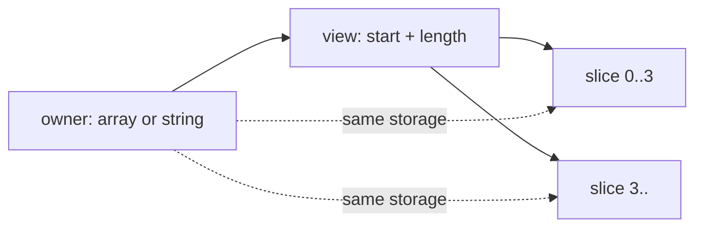

<TLDR>
  <TLDRCell label="what">
    <Term id="span">`Span<T>`</Term> and <Term id="memory">`Memory<T>`</Term> are type-safe views of contiguous memory. Slicing changes a view's start and length without copying elements.
  </TLDRCell>
  <TLDRCell label="trap">
    A view doesn't own its backing storage, and `ReadOnlySpan<T>` doesn't make the owner immutable. An old view can observe changed data or become invalid after the buffer is modified, returned to a pool, or released.
  </TLDRCell>
  <TLDRCell label="fix">
    Use `Span<T>` for short synchronous access. Pass `Memory<T>` when data must be stored in a field or survive an `await`, and document the owner, valid length, and lease.
  </TLDRCell>
</TLDR>

## What it is and why it exists

`Span<T>` is a writable view over a contiguous region of `T` elements. It can refer to part of an array, stack memory created by <Term id="stackalloc">`stackalloc`</Term>, or controlled unmanaged memory. The view describes a region but doesn't take ownership of it.

Slicing, protocol parsing, and buffer processing often need only part of existing data. Creating a subarray or substring at every step copies data and creates another object; a span lets a caller pass "this region of existing data" directly to synchronous code. You get an independent copy only when a later operation such as `ToArray()` or `ToString()` materializes one.

`ReadOnlySpan<T>` removes the ability to write through that view, which suits read-only parameters and string fragments. It expresses access permission, not deep immutability. Another alias can still change the same array, and an existing read-only view observes the change.

`Memory<T>` and `ReadOnlyMemory<T>` describe contiguous regions that can be stored. They aren't <Term id="ref-struct">`ref struct`</Term> types, so they can be class fields and survive asynchronous suspension points. Synchronous code obtains a short-lived view through `.Span` when it needs to read or write the region.

These four types express views and lifetimes; they don't manage ownership automatically. An array owns its storage, a string manages its characters, and an `IMemoryOwner<T>` controls a rented region. A `Span<T>` or `Memory<T>` merely borrows the corresponding region. The API must separately say who can modify it, who releases it, and when the borrow ends.

For an input parameter, first ask whether the method uses the data only during the current synchronous call. If it does, prefer `ReadOnlySpan<T>` or `Span<T>` so arrays, strings, and other contiguous sources can call it. If the method must retain the parameter or use it after an `await`, accept `ReadOnlyMemory<T>` or `Memory<T>` instead.

## How it works

### A region defines the view

You can model a view as backing storage plus a start and a length. `Slice(start, length)` and the range operator create another view, and both views still point to the same storage. A slice's indexes are relative to its current start, not to the start of the original owner.



The runtime still checks the view's boundaries. Construction or slicing outside the valid range throws, and indexed access can't cross the view's length. Type safety and bounds checks don't validate a business protocol, so code must still establish rules such as "a frame contains at least eight bytes."

An empty view is a normal value. `Span<T>.Empty`, `default(Span<T>)`, and a zero-length slice can all be checked with `IsEmpty`. Don't automatically treat an empty view as failure unless the API contract defines it that way.

### Writability is separate from the source

The view type says whether this caller can write; the source says whether another path might change the data. A `ReadOnlySpan<char>` over a string has an immutable source. The same view type over an array has an owner that can still mutate elements. You can't combine those facts from the parameter type alone.

| Type | Writable through view | Storable in an ordinary field | Can survive `await` | Typical use |
| --- | --- | --- | --- | --- |
| `Span<T>` | Yes | No | No | Synchronously modify a buffer region |
| `ReadOnlySpan<T>` | No | No | No | Synchronously parse or compare |
| `Memory<T>` | Yes, through `.Span` | Yes | Yes | Writable asynchronous buffer |
| `ReadOnlyMemory<T>` | No, read through `.Span` | Yes | Yes | Read-only asynchronous data |

`Span<T>` converts implicitly to `ReadOnlySpan<T>`, and `Memory<T>` converts to `ReadOnlyMemory<T>`. No reverse conversion exists because it would grant write access from nowhere. Code that needs writable access should obtain a writable view explicitly from the owner.

### `ref struct` prevents escape

`Span<T>` and `ReadOnlySpan<T>` are `ref struct` types. The compiler uses ref-safety analysis to stop a view from escaping the valid lifetime of its backing storage. For example, a span over the current method's `stackalloc` region can't be returned to the caller or boxed as `object`.

An ordinary class can't keep a span field, and a lambda can't capture a span, because either object might outlive the current stack frame. Store an array, string, `Memory<T>`, or the owning object instead, then obtain `.Span` again at each synchronous access site.

C# 13 relaxed some rules, and C# 14 retains those capabilities. A `ref struct` may appear in an async or iterator method when its use is confined to a block containing no `await` or `yield`, and generic code can admit one through the `allows ref struct` anti-constraint. The old claim that a span can never appear in an async method is no longer accurate, but keeping one alive across a suspension point is still illegal.

### `Memory<T>` crosses the async boundary

Async code should carry `Memory<T>` across suspension points and put synchronous processing in a helper that accepts `Span<T>`. The compiler then sees a span whose lifetime covers only one call that can't suspend, while the storable memory describes the region needed afterward.

That choice doesn't extend the backing owner's lifetime. If the `Memory<T>` comes from `IMemoryOwner<T>`, the owner must remain undisposed. If it comes from an array rented from `ArrayPool<T>`, the array can't be returned until every consumer finishes. Returning `Memory<T>` over an already returned array is a lifetime bug the type system doesn't automatically stop.

Async APIs must also separate capacity from valid data length. A pool may return a buffer larger than requested, and an I/O operation may fill only its prefix. Pass `memory[..written]` to the consumer instead of exposing the whole capacity.

### Ownership is a separate contract

Microsoft's usage guidelines describe memory management in terms of owner, consumer, and lease. The owner eventually releases or returns storage, the consumer reads or writes during the lease, and the lease defines when a view remains valid. One method can play all three roles, or components can split them.

A method that accepts `Memory<T>` shouldn't assume it gained disposal rights. Unless the API explicitly transfers ownership, the caller still owns the parameter and the callee only borrows it for the agreed period. As with streams, disposal responsibility can't be guessed from the type name.

A public API that retains caller memory after returning needs to document that behavior. If the caller can't guarantee the lifetime, the implementation can copy into storage it owns. That copy deliberately establishes an ownership boundary; it isn't a failure to use spans.

## Examples

These three examples progress from array aliasing to parsing without substrings, then carry `Memory<T>` across an asynchronous boundary. This environment has no .NET SDK or C# compiler, so each block carries the repository's non-execution marker and no console output is fabricated.

### Modify an array slice

An array slice still shares elements with the original array. Sorting is limited to the three-element view, but the result appears directly in the original array.

<Depth level="quick">

```csharp title="SliceWindow.cs"
// # not executed here: the .NET SDK and C# compilers are unavailable
using System;

int[] readings = [12, 18, 21, 30, 45];
Span<int> window = readings.AsSpan(1, 3);

window[0] = 20;
window.Sort();

Console.WriteLine(string.Join(", ", window.ToArray()));
Console.WriteLine(string.Join(", ", readings));
Console.WriteLine(window.Length);
```

```text
# not executed here: the .NET SDK and C# compilers are unavailable
```

<TryToBreak items={['change the slice length to 0', 'change the start to the array length', 'modify readings[2] after slicing']} />

</Depth>

`ToArray()` is present only to pass the current view to `string.Join` for display. It creates a copy, whereas slicing itself doesn't. Business code that only iterates or calls another span API shouldn't materialize first for convenience.

Declaring `window` as `ReadOnlySpan<int>` would prevent `window[0] = 20` and `Sort()`, but it wouldn't isolate `readings`. The original array remains a writable owner.

### Parse character regions

The parser locates the colon, then passes each side directly to `int.TryParse(ReadOnlySpan<char>, ...)`. The failure path resets both outputs to zero, so the caller doesn't receive a half-parsed result.

```csharp title="ParseReading.cs"
// # not executed here: the .NET SDK and C# compilers are unavailable
using System;

foreach (string record in new[] { "17:245", "bad", "8:x" })
{
    bool ok = TryParseReading(record.AsSpan(), out int sensorId, out int value);
    Console.WriteLine($"{record} -> {ok}, {sensorId}, {value}");
}

static bool TryParseReading(
    ReadOnlySpan<char> record,
    out int sensorId,
    out int value)
{
    int separator = record.IndexOf(':');
    if (separator <= 0 || separator == record.Length - 1)
    {
        sensorId = 0;
        value = 0;
        return false;
    }

    bool idOk = int.TryParse(record[..separator], out sensorId);
    bool valueOk = int.TryParse(record[(separator + 1)..], out value);
    return idOk && valueOk;
}
```

```text
# not executed here: the .NET SDK and C# compilers are unavailable
```

There is no `Substring()` call. The input string continues to own its characters, and both slices exist only during the synchronous `TryParseReading` call. The method doesn't retain any view after it returns.

A real protocol must also define whitespace, signs, numeric ranges, and extra separators. A span removes unnecessary intermediate copies; it doesn't define those input rules for you.

### Retain `Memory<T>` in async code

The `Memory<byte>` value can be obtained before the `await` and used afterward. Actual mutation belongs to a synchronous helper so no `Span<byte>` crosses the suspension point.

```csharp title="NormalizeAsync.cs"
// # not executed here: the .NET SDK and C# compilers are unavailable
using System;
using System.Text;
using System.Threading.Tasks;

byte[] payload = Encoding.ASCII.GetBytes("aBc-19");
await NormalizeAsciiAsync(payload.AsMemory());
Console.WriteLine(Encoding.ASCII.GetString(payload));

static async Task NormalizeAsciiAsync(Memory<byte> payload)
{
    await Task.Yield();
    NormalizeAscii(payload.Span);
}

static void NormalizeAscii(Span<byte> bytes)
{
    for (int index = 0; index < bytes.Length; index++)
    {
        byte current = bytes[index];
        if (current is >= (byte)'A' and <= (byte)'Z')
        {
            bytes[index] = (byte)(current + ('a' - 'A'));
        }
    }
}
```

```text
# not executed here: the .NET SDK and C# compilers are unavailable
```

The caller owns the array, so it remains valid until the task completes, and the mutation is visible through `payload`. If the method should only read, change the two parameters to `ReadOnlyMemory<byte>` and `ReadOnlySpan<byte>` so the signature states the permission.

If the source changes to pooled memory, the caller must wait for `NormalizeAsciiAsync` to finish before returning the buffer. Wrapping an array in `Memory<byte>` doesn't create a lease or reference count.

### Bound a temporary buffer

The same synchronous algorithm can use `stackalloc` for small input and rent an array for larger input. Both paths produce `Span<byte>`, so the summing logic doesn't need two implementations.

```csharp title="BoundedScratch.cs"
// # not executed here: the .NET SDK and C# compilers are unavailable
using System;
using System.Buffers;

byte[] small = [3, 1, 4, 1, 5];
byte[] large = new byte[80];
large.AsSpan().Fill(2);

Console.WriteLine(Checksum(small));
Console.WriteLine(Checksum(large));

static int Checksum(ReadOnlySpan<byte> source)
{
    const int StackLimit = 64; // This is an example policy, not a universal threshold.
    byte[]? rented = null;

    try
    {
        Span<byte> scratch = source.Length <= StackLimit
            ? stackalloc byte[source.Length]
            : (rented = ArrayPool<byte>.Shared.Rent(source.Length))
                .AsSpan(0, source.Length);

        source.CopyTo(scratch);
        int checksum = 0;
        foreach (byte value in scratch)
        {
            checksum += value;
        }
        return checksum;
    }
    finally
    {
        if (rented is not null)
        {
            ArrayPool<byte>.Shared.Return(rented, clearArray: true);
        }
    }
}
```

```text
# not executed here: the .NET SDK and C# compilers are unavailable
```

The rented array may be larger than `source.Length`, so the code immediately slices it to the exact logical length. `finally` returns the array on exception paths too. This example clears it because it treats the temporary contents as data that shouldn't reach the next renter.

`StackLimit` demonstrates the control flow, not a portable performance conclusion. Production code should derive a threshold from call depth, input limits, and benchmarks. If copying has no business purpose, compute directly over `source` instead of inventing a buffer merely to use a span.

## Pitfalls

### Treating a slice as a copy

> [!PITFALL]
> Generated or handwritten code may mutate `span[..count]` while assuming the original array is untouched. Slices share storage with the original view, and overlapping slices observe each other's writes.

**Fix:** call `ToArray()` explicitly when you need independent data, and make the copy visible in the variable name or API documentation. When borrowing is intended, keep the view and test whether writes through the slice should reach the owner.

### Treating a read-only view as immutable data

> [!PITFALL]
> `ReadOnlySpan<T>` and `ReadOnlyMemory<T>` prevent assignment only through the current view. The array owner, another writable alias, or the pool's next renter can still change the underlying elements.

**Fix:** copy into owned storage when a consumer needs a stable snapshot; otherwise document that shared changes are allowed. Don't use `ReadOnlyMemory<T>` as a substitute for ownership and concurrency design.

### Letting a span escape its safe region

> [!PITFALL]
> Putting `Span<T>` in a class field, capturing it in a lambda, or keeping it across `await` violates `ref struct` lifetime rules. AI also gives outdated explanations when it mixes old restrictions with the relaxations added in C# 13.

**Fix:** store the owner or `Memory<T>` and obtain `.Span` next to each synchronous use. Even when a local arrangement compiles in an async method, confirm that no span remains live at any suspension point.

### Returning released or returned memory

> [!PITFALL]
> A method may rent an array from `ArrayPool<T>` or create an `IMemoryOwner<T>`, return its `Memory<T>`, then immediately return the storage in `finally` or dispose it through `using`. The return type is legal, but the caller receives a region with no valid lease.

**Fix:** either complete consumption within the owner's scope or transfer the owner with the memory and state who disposes it. If an API returns only data and can't express a lease, return a caller-owned copy.

### Using `stackalloc` with an unbounded length

> [!PITFALL]
> A `stackalloc` length taken directly from a request can exhaust the thread stack, and allocations inside a loop can accumulate until the method returns. Stack data that wasn't explicitly initialized also can't be treated as zero-filled input.

**Fix:** set a reviewed small upper bound, switch to an array or pool above it, and initialize the required region before reading it. The threshold should follow real call depth and testing, not a copied universal constant.

<Depth level="deep">

## Lifetime and ownership contracts

The hard part of a memory API is usually not slicing but deciding how long a view may be retained. A synchronous method that reads a parameter only before returning gets a narrow lease from `ReadOnlySpan<T>`. If an object will store the input in a field, the signature must use a storable type and state whether it retains caller memory or copies it.

Owner and writer aren't synonyms. A method can own data that it publishes read-only, or borrow a caller-provided writable buffer. Good documentation answers "who releases it," "who may write," and "when does it expire" separately instead of saying only that a method "handles the memory."

For `IMemoryOwner<T>`, `Dispose()` ends the lease supplied by the owner. A consumer must not cache `.Memory` or `.Span` beyond that point. A later read that happens to return the old bytes still isn't supported behavior.

For `ArrayPool<T>`, a rented array may contain data from a previous renter and may be larger than requested. Process only the logical range, clear sensitive regions when the security boundary requires it, and return each rental exactly once. Clearing depends on data sensitivity; don't assume the pool zeroes arrays automatically.

If an API transfers rental ownership, an object that carries both `Memory<T>` and the `Dispose()` responsibility is more honest than returning `Memory<T>` alone. When the consumer shouldn't manage resources, the producer can finish a callback inside its lease or pay for a copy and return independent data.

Concurrency doesn't disappear when you switch to a read-only view. One thread can read an array through `ReadOnlyMemory<T>` while another writes through the original array. A protocol that needs a consistent snapshot requires synchronization, ownership transfer, or copying, not faith in the word `ReadOnly`.

## An API signature describes the lease

A parameter should request the weakest capability the caller must provide, not the concrete source the implementation happens to use. A read-only synchronous algorithm accepts `ReadOnlySpan<T>`, while a writable one accepts `Span<T>`. This limits permissions and avoids forcing callers to construct arrays first.

An API that retains input can't accept a span, silently copy it, and leave that behavior unexplained. Copying may be exactly right, but it changes cost and identity semantics. The method name, documentation, or return type should tell callers whether data is retained and whether later changes to the original buffer are visible.

| API behavior | Suitable shape | Contract still required |
| --- | --- | --- |
| Read only during a synchronous call | `ReadOnlySpan<T>` parameter | Empty-input and format rules |
| Modify only during a synchronous call | `Span<T>` parameter | Which positions may be written |
| Use caller data across `await` | `ReadOnlyMemory<T>` / `Memory<T>` parameter | Retention period and concurrent-mutation rules |
| Deliver a pooled result | Disposable owner carrying `Memory<T>` | Valid length and disposal responsibility |

Returning `ReadOnlyMemory<T>` doesn't mean returning independent data either. If it refers to an object's internal array, the caller gets a live window into that object's state, and later method calls may change its contents. Return independent storage when the contract promises a snapshot, and say so.

A callback can limit a lease to one call. A producer can invoke a custom synchronous delegate whose parameter is `ReadOnlySpan<T>` while the owner remains valid, and the callback can't safely store the span for later. Reentrancy, exceptions, and thread switching still need separate API rules.

Write down three concrete answers before designing the signature:

1. Who owns the backing storage, and who releases or returns it?
2. Which elements are valid, may the consumer mutate them, and who observes those writes?
3. Does the lease end on synchronous return, task completion, the next read, or explicit `Dispose()`?

Those answers translate directly into boundary tests. End the owner early, make I/O fill only part of the capacity, and mutate through another alias during the lease. Then verify whether the API rejects, copies, synchronizes, or explicitly allows each case.

That contract also determines naming. `Borrow`, `Rent`, `Copy`, and `Own` should correspond to real lifetimes instead of serving as performance-flavored suffixes.

## Stack allocation and boundary choices

`stackalloc` suits temporary contiguous buffers whose lifetime is strictly limited to the current call. Assign its result directly to `Span<T>` to use indexing, slicing, and common span APIs in safe code without exposing a pointer.

Stack space is limited, and allocations in one method generally remain until that method returns. Repeating `stackalloc` inside a loop can therefore overflow the stack even when each allocation is modest. Reuse one buffer outside the loop or choose different storage.

When a length comes from external input, validate that it is nonnegative and bounded. A small path can use `stackalloc` and a large path can use a new or pooled array. Once both paths produce `Span<T>`, the core algorithm doesn't need to know the storage source.

Don't equate "on the stack" with "faster." First satisfy lifetime, maximum-size, and initialization rules, then use a representative benchmark to decide whether a branch or pool management is worthwhile. Without measurements, stick to the semantic fact that slicing doesn't copy.

The compiler prevents obvious stack-reference escapes when you call a span-taking method, but it can't validate protocol-level length, encoding, or concurrency constraints. Tests still need empty input, boundary lengths, overlapping regions, and mutation of the backing owner during a call.

`Span<T>.CopyTo` defines correct behavior for overlapping source and destination regions, while a handwritten loop may overwrite data it hasn't read yet. Prefer the standard API for moving overlapping regions. When you need an independent snapshot, don't keep treating the old view as the sole source after the copy.

</Depth>

<Checkpoint id="csharp/span-memory" />

## Further reading

- [Memory&lt;T&gt; and Span&lt;T&gt; usage guidelines](https://learn.microsoft.com/en-us/dotnet/standard/memory-and-spans/memory-t-usage-guidelines)
- [Span&lt;T&gt; API](https://learn.microsoft.com/en-us/dotnet/api/system.span-1?view=net-10.0)
- [Memory&lt;T&gt; API](https://learn.microsoft.com/en-us/dotnet/api/system.memory-1?view=net-10.0)
- [Ref struct types](https://learn.microsoft.com/en-us/dotnet/csharp/language-reference/builtin-types/ref-struct)
- [The stackalloc expression](https://learn.microsoft.com/en-us/dotnet/csharp/language-reference/operators/stackalloc)
- [What's new in C# 14](https://learn.microsoft.com/en-us/dotnet/csharp/whats-new/csharp-14)
