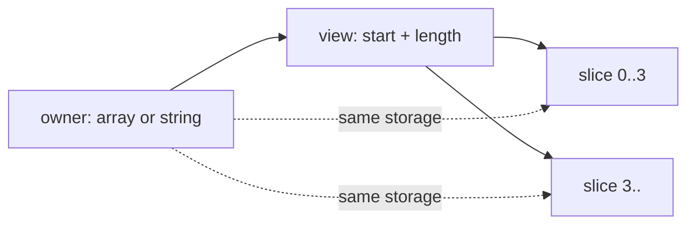

<TLDR>
  <TLDRCell label="what">
    <Term id="span">`Span<T>`</Term> 与 <Term id="memory">`Memory<T>`</Term> 是连续内存的类型安全视图；切片只调整视图的起点和长度，不复制元素。
  </TLDRCell>
  <TLDRCell label="trap">
    视图不拥有底层存储，`ReadOnlySpan<T>` 也不会让所有者变成不可变；底层缓冲区被修改、归还到池中或释放后，旧视图可能读到变化或失效的数据。
  </TLDRCell>
  <TLDRCell label="fix">
    同步、短生命周期的访问使用 `Span<T>`；需要存入字段或跨越 `await` 时传递 `Memory<T>`，并把所有者、有效长度与使用期限写进 API 契约。
  </TLDRCell>
</TLDR>

## 是什么，为什么存在

`Span<T>` 是连续 `T` 元素区域上的可读写视图。它可以引用数组的一段、由 <Term id="stackalloc">`stackalloc`</Term> 创建的栈内存，或者受控的非托管内存。视图本身只描述一段区域，不接管该区域的所有权。

切片、协议解析和缓冲区处理经常只需要原数据的一部分。若每一步都创建子数组或子字符串，代码会复制数据并产生新对象；span 让调用方把「这段现有数据」直接交给同步方法。只有后续显式调用 `ToArray()`、`ToString()` 等物化操作时，才会得到独立副本。

`ReadOnlySpan<T>` 去掉通过该视图写入的能力，适合只读参数和字符串片段。它表达的是访问权限，不是深层不可变性：另一个别名仍可修改同一数组，而已有的只读视图会观察到修改。

`Memory<T>` 与 `ReadOnlyMemory<T>` 表示可以存储的连续内存区域。它们不是 <Term id="ref-struct">`ref struct`</Term>，因此能作为类字段，也能跨异步暂停点保留；实际同步读写时，通过 `.Span` 取得短生命周期视图。

这四个类型解决的是视图和生命周期表达，不是自动的所有权管理。数组拥有自身存储，字符串管理自身字符，`IMemoryOwner<T>` 管理租用区域；`Span<T>` 或 `Memory<T>` 只借用相应区域。API 必须另外说明谁能修改、谁负责释放，以及借用何时结束。

选择入口参数时，先问方法是否只在当前同步调用内使用数据。答案为是时，优先接受 `ReadOnlySpan<T>` 或 `Span<T>`，这样数组、字符串和其他连续来源都能调用；若方法需要保存参数或在 `await` 后继续使用，则接受 `ReadOnlyMemory<T>` 或 `Memory<T>`。

## 工作原理

### 视图由区域决定

可以把一个视图理解为底层存储、起始位置和长度的组合。`Slice(start, length)` 或范围运算符创建新视图，新旧视图仍指向同一存储。切片的索引从当前视图起点计算，而不是从原始所有者的起点计算。



运行时仍会检查视图边界。构造或切片超出合法范围会抛出异常，索引访问也不能越过视图长度。类型安全和边界检查并不验证业务协议，例如「报文至少有 8 字节」仍应由代码先检查。

空视图是正常值。`Span<T>.Empty`、`default(Span<T>)` 以及长度为零的切片都可用 `IsEmpty` 检查；不要把空视图自动解释为失败，除非 API 契约明确这样规定。

### 可写性与来源分开

视图的类型决定当前调用方能否写入，来源决定数据是否可能由其他路径改变。`ReadOnlySpan<char>` 指向字符串时，字符串自身不可变；同一类型指向数组时，数组所有者仍可修改元素。这两个事实不能只从参数类型中合并推断。

| 类型 | 可通过视图写入 | 可存为普通字段 | 可跨 `await` 保留 | 常见用途 |
| --- | --- | --- | --- | --- |
| `Span<T>` | 是 | 否 | 否 | 同步修改一段缓冲区 |
| `ReadOnlySpan<T>` | 否 | 否 | 否 | 同步解析或比较 |
| `Memory<T>` | 是，通过 `.Span` | 是 | 是 | 异步可写缓冲区 |
| `ReadOnlyMemory<T>` | 否，通过 `.Span` 读取 | 是 | 是 | 异步只读数据 |

`Span<T>` 可以隐式转换为 `ReadOnlySpan<T>`，`Memory<T>` 也可以转换为 `ReadOnlyMemory<T>`。反向转换不存在，因为它会凭空增加写权限。需要可写访问时，应让所有者明确提供可写视图。

### `ref struct` 限制逃逸

`Span<T>` 和 `ReadOnlySpan<T>` 是 `ref struct`，编译器用引用安全分析阻止视图逃出底层存储的有效范围。例如，指向当前方法 `stackalloc` 区域的 span 不能返回给调用方，也不能装箱为 `object`。

普通类不能保存 span 字段，lambda 也不能捕获 span，因为这些对象可能比当前栈帧活得更久。需要保存区域时，保存数组、字符串、`Memory<T>` 或拥有该区域的对象，并在每次同步访问时重新取得 `.Span`。

C# 13 起放宽了部分规则，C# 14 延续这些能力：`ref struct` 可以出现在异步或迭代器方法中，但所有使用都必须局限在不含 `await` 或 `yield` 的代码块内；它也能用于带 `allows ref struct` 反约束的泛型。旧文章中的「span 绝不能出现在 async 方法」已经不准确，但把它保留到暂停点之后仍不合法。

### `Memory<T>` 穿过异步边界

异步方法应让 `Memory<T>` 穿过暂停点，再把同步处理放进接收 `Span<T>` 的辅助方法。这样，编译器看到的 span 生命周期只覆盖一次不会暂停的调用，而可存储的 memory 负责描述之后仍需访问的区域。

这并不延长底层所有者的寿命。若 `Memory<T>` 来自 `IMemoryOwner<T>`，所有者必须保持未释放状态；若来自 `ArrayPool<T>` 租出的数组，数组在所有消费者完成之前不能归还。返回一个指向已归还数组的 `Memory<T>` 是生命周期错误，不是类型系统能自动拦住的错误。

异步 API 还要区分容量与有效数据长度。池可能给出比请求更大的缓冲区，I/O 操作也可能只填充前一部分；应把 `memory[..written]` 传给消费者，而不是暴露整段容量。

### 所有权是额外契约

Microsoft 的使用指南把内存管理看作所有者、消费者与租期。所有者负责最终释放或归还存储，消费者在租期内读取或写入，租期规定视图何时仍有效。这三个角色可以由同一方法承担，也可以跨组件分开。

接受 `Memory<T>` 的方法不应默认获得释放权。除非 API 明确转移所有权，否则参数仍由调用方拥有；被调用方只能在约定期间借用。与流类似，是否释放不能靠类型名猜测。

公开 API 若要在返回后继续持有调用方内存，需要明确说明保留行为。调用方若无法保证生命周期，可先复制到自己拥有的数组；这次复制是有意建立所有权边界，而不是 span 使用失败。

## 示例

下面三个例子依次展示数组别名、无子字符串解析，以及跨异步边界保存 `Memory<T>`。本地环境没有 .NET SDK 或 C# 编译器，因此每个代码块都带有仓库约定的未执行标记，没有伪造控制台输出。

### 修改数组切片

数组切片仍与原数组共享元素。排序只发生在三元素视图范围内，但结果直接出现在原数组中。

<Depth level="quick">

```csharp title="SliceWindow.cs"
// # not executed here: the .NET SDK and C# compilers are unavailable
using System;

int[] readings = [12, 18, 21, 30, 45];
Span<int> window = readings.AsSpan(1, 3);

window[0] = 20;
window.Sort();

Console.WriteLine(string.Join(", ", window.ToArray()));
Console.WriteLine(string.Join(", ", readings));
Console.WriteLine(window.Length);
```

```text
# not executed here: the .NET SDK and C# compilers are unavailable
```

<TryToBreak items={['把切片长度改为 0', '把起始索引改为数组长度', '在切片后修改 readings[2]']} />

</Depth>

`ToArray()` 只用于把当前视图交给 `string.Join` 并显示；它会创建副本，不属于切片本身。业务代码若只需遍历或传给另一个 span API，就不应为了方便而先物化。

把 `window` 声明为 `ReadOnlySpan<int>` 会阻止 `window[0] = 20` 和 `Sort()`，但不会隔离 `readings`。原数组仍是可写所有者。

### 解析字符片段

解析器先定位冒号，再把左右两段直接交给 `int.TryParse(ReadOnlySpan<char>, ...)`。失败路径把两个输出重置为零，调用方不会收到半解析结果。

```csharp title="ParseReading.cs"
// # not executed here: the .NET SDK and C# compilers are unavailable
using System;

foreach (string record in new[] { "17:245", "bad", "8:x" })
{
    bool ok = TryParseReading(record.AsSpan(), out int sensorId, out int value);
    Console.WriteLine($"{record} -> {ok}, {sensorId}, {value}");
}

static bool TryParseReading(
    ReadOnlySpan<char> record,
    out int sensorId,
    out int value)
{
    int separator = record.IndexOf(':');
    if (separator <= 0 || separator == record.Length - 1)
    {
        sensorId = 0;
        value = 0;
        return false;
    }

    bool idOk = int.TryParse(record[..separator], out sensorId);
    bool valueOk = int.TryParse(record[(separator + 1)..], out value);
    return idOk && valueOk;
}
```

```text
# not executed here: the .NET SDK and C# compilers are unavailable
```

这里没有调用 `Substring()`。输入字符串仍然拥有字符，两个切片只在 `TryParseReading` 的同步调用中存在；方法返回后也没有保存任何视图。

真实协议通常还要规定空白、符号、数值范围和多余分隔符。span 只避免不需要的中间副本，不会替你定义这些输入规则。

### 在异步方法中保存 `Memory<T>`

`Memory<byte>` 可以在 `await` 前取得并在之后继续使用。实际修改交给同步辅助方法，避免任何 `Span<byte>` 跨越暂停点。

```csharp title="NormalizeAsync.cs"
// # not executed here: the .NET SDK and C# compilers are unavailable
using System;
using System.Text;
using System.Threading.Tasks;

byte[] payload = Encoding.ASCII.GetBytes("aBc-19");
await NormalizeAsciiAsync(payload.AsMemory());
Console.WriteLine(Encoding.ASCII.GetString(payload));

static async Task NormalizeAsciiAsync(Memory<byte> payload)
{
    await Task.Yield();
    NormalizeAscii(payload.Span);
}

static void NormalizeAscii(Span<byte> bytes)
{
    for (int index = 0; index < bytes.Length; index++)
    {
        byte current = bytes[index];
        if (current is >= (byte)'A' and <= (byte)'Z')
        {
            bytes[index] = (byte)(current + ('a' - 'A'));
        }
    }
}
```

```text
# not executed here: the .NET SDK and C# compilers are unavailable
```

数组由调用方拥有，所以在任务完成后仍有效，修改也能从 `payload` 观察到。若方法只应读取数据，把两个参数分别改为 `ReadOnlyMemory<byte>` 和 `ReadOnlySpan<byte>`，让签名表达权限。

如果来源改为池化内存，调用方必须等待 `NormalizeAsciiAsync` 完成后才能归还缓冲区。仅仅把数组包装为 `Memory<byte>` 不会建立租期或引用计数。

### 为临时缓冲区设置边界

同一个同步算法可以在小输入时使用 `stackalloc`，在较大输入时租用数组。两条路径都产生 `Span<byte>`，所以求和逻辑不需要复制两份。

```csharp title="BoundedScratch.cs"
// # not executed here: the .NET SDK and C# compilers are unavailable
using System;
using System.Buffers;

byte[] small = [3, 1, 4, 1, 5];
byte[] large = new byte[80];
large.AsSpan().Fill(2);

Console.WriteLine(Checksum(small));
Console.WriteLine(Checksum(large));

static int Checksum(ReadOnlySpan<byte> source)
{
    const int StackLimit = 64; // 这是示例策略，不是通用阈值。
    byte[]? rented = null;

    try
    {
        Span<byte> scratch = source.Length <= StackLimit
            ? stackalloc byte[source.Length]
            : (rented = ArrayPool<byte>.Shared.Rent(source.Length))
                .AsSpan(0, source.Length);

        source.CopyTo(scratch);
        int checksum = 0;
        foreach (byte value in scratch)
        {
            checksum += value;
        }
        return checksum;
    }
    finally
    {
        if (rented is not null)
        {
            ArrayPool<byte>.Shared.Return(rented, clearArray: true);
        }
    }
}
```

```text
# not executed here: the .NET SDK and C# compilers are unavailable
```

租出的数组可能大于 `source.Length`，因此代码立即切成准确的逻辑长度。`finally` 保证异常路径也归还数组；这里选择清除，是因为示例把临时内容视为不应泄漏给下一位租用者的数据。

`StackLimit` 只展示控制流，不是可移植的性能结论。生产代码应根据调用深度、输入上限和基准决定阈值；若复制本身没有业务需要，就应直接在 `source` 上计算，而不是为了使用 span 再造缓冲区。

## 陷阱

### 把切片当成副本

> [!PITFALL]
> 生成或手写代码可能修改 `span[..count]`，却假设原数组不受影响。切片与原视图共享存储，重叠切片之间也会互相观察到写入。

**修复方法：** 需要独立数据时显式调用 `ToArray()`，并把复制写进变量名或 API 文档。只需要借用时保留视图，同时测试对切片的写入是否应反映到所有者。

### 把只读视图当成不可变数据

> [!PITFALL]
> `ReadOnlySpan<T>` 和 `ReadOnlyMemory<T>` 只禁止通过当前视图赋值。数组所有者、其他可写别名或池的下一位租用者仍可能改变底层元素。

**修复方法：** 若消费者需要稳定快照，就复制到自己拥有的存储；若允许共享变化，则在契约中说明。不要用 `ReadOnlyMemory<T>` 代替所有权和并发同步设计。

### 让 span 逃出安全范围

> [!PITFALL]
> 把 `Span<T>` 放进类字段、捕获进 lambda，或让它跨越 `await`，都会违反 `ref struct` 的生命周期约束。旧规则与 C# 13 之后的放宽混在一起时，AI 还会给出过时解释。

**修复方法：** 保存所有者或 `Memory<T>`，在紧邻同步使用的位置取得 `.Span`。异步方法中即使某个局部写法能编译，也要确认 span 在任何暂停点都不再存活。

### 返回已经归还或释放的内存

> [!PITFALL]
> 方法可能从 `ArrayPool<T>` 租数组或创建 `IMemoryOwner<T>`，返回其 `Memory<T>`，随后在 `finally` 或 `using` 中立即归还底层存储。返回值类型合法，但调用方借到的区域已没有有效租期。

**修复方法：** 要么在所有者作用域内完成消费，要么把所有者连同内存一起转交，并明确由谁释放。若 API 只返回数据且不能表达租期，就返回调用方拥有的副本。

### 对不受限长度使用 `stackalloc`

> [!PITFALL]
> `stackalloc` 的长度若直接来自请求，过大的输入可能耗尽线程栈；放在循环里还会让多次分配累积到方法返回。未显式初始化的栈内容也不能当作零值数据使用。

**修复方法：** 设定经过评审的小型上限，超出时改用数组或池，并在读取前初始化所需区域。阈值应由真实调用深度与测试决定，不能照抄一个通用常数。

## AI 时代

**生成代码在这里常犯的错。** 模型常把 `Span<T>` 当作可保存对象，生成跨 `await` 的局部变量或类字段；也会在每次切片后调用 `ToArray()` 或 `ToString()`，悄悄恢复原本要删除的分配。更危险的版本从池中租出数组，返回 `Memory<T>` 后立刻归还数组，或者把整个池容量暴露给只应看到 `written` 字节的调用方。

**让 AI 检查。** 要求它标出每个视图的底层所有者、有效范围和最后一次使用；要求它逐个列出物化调用，并解释每次复制是否建立必要的所有权边界；要求它检查所有 `await`、`yield`、池归还和 `Dispose()` 前后是否还有别名存活。

**审查清单。**

- 每个 `Memory<T>` 或 span 都能追溯到仍然存活的所有者，并且有效数据长度不与容量混用。
- 没有 `Span<T>` 跨越暂停点、被捕获或存进普通堆对象，池化内存也不会在最后一个消费者结束前归还。
- `ReadOnly*` 只被解释为当前视图的只读权限；需要稳定快照时，代码显式复制并说明原因。

**提示词汇。** 用 `backing storage`（底层存储）、`aliasing`（别名共享）、`ref safety`（引用安全）、`escape analysis`（逃逸分析）、`owner / consumer / lease`（所有者／消费者／租期）、`valid data length versus capacity`（有效数据长度与容量）来描述约束。需要 AI 改写签名时，明确说 `Span<T> for synchronous access`（用 `Span<T>` 做同步访问）和 `Memory<T> across await`（用 `Memory<T>` 跨越 `await`）。

<Depth level="deep">

## 生命周期与所有权契约

内存 API 的难点通常不是如何切片，而是谁允许把视图保留多久。一个同步方法若只在返回前读取参数，`ReadOnlySpan<T>` 已经把租期限制得很窄；若对象要把输入存进字段，签名必须改为可存储类型，并说明它是保留调用方内存还是复制。

拥有者与可写者也不是同义词。方法可以拥有一块只读发布的数据，也可以借用调用方提供的可写缓冲区。文档最好分别回答「谁释放」「谁可写」「何时失效」，不要用含糊的「方法处理这块内存」代替。

对 `IMemoryOwner<T>`，`Dispose()` 结束所有者提供的租期。消费者不应缓存 `.Memory` 或 `.Span` 到该点之后；即使之后的读取碰巧仍返回旧字节，也不构成受支持行为。

对 `ArrayPool<T>`，租出的数组可能含有前一位使用者留下的数据，也可能大于请求长度。只处理逻辑范围，在安全边界需要时清除敏感部分，并保证一次租用只归还一次。清除策略取决于数据敏感性，不应假设池会自动清零。

API 若需要转移租用所有权，返回一个同时携带 `Memory<T>` 和 `Dispose()` 责任的对象，比单独返回 `Memory<T>` 更诚实。若消费方不适合管理资源，生产方应在自己的租期内完成回调，或者承担复制成本后返回独立数据。

并发不会因换成只读视图而消失。一个线程通过 `ReadOnlyMemory<T>` 读取数组时，另一个线程仍可经原数组写入；若协议需要一致快照，应使用同步、所有权转移或复制，而不是依赖类型名中的 `ReadOnly`。

## API 签名就是租期说明

参数类型应选择调用方必须满足的最弱能力，而不是实现当前碰巧使用的具体来源。只读同步算法接受 `ReadOnlySpan<T>`，可写同步算法接受 `Span<T>`；这既限制权限，也避免强迫调用方先构造数组。

需要保留输入的 API 不能接受 span 后偷偷复制却不说明。复制可能完全合理，但它改变了成本和身份语义；方法名、文档或返回类型应让调用方知道数据是否被保留，以及之后对原缓冲区的修改是否可见。

| API 行为 | 合适的形状 | 必须补充的契约 |
| --- | --- | --- |
| 仅在同步调用内读取 | `ReadOnlySpan<T>` 参数 | 空输入与格式规则 |
| 仅在同步调用内修改 | `Span<T>` 参数 | 哪些位置会被写入 |
| 跨 `await` 使用调用方数据 | `ReadOnlyMemory<T>`／`Memory<T>` 参数 | 保留期限与并发修改规则 |
| 交付池化结果 | 携带 `Memory<T>` 的可释放所有者 | 有效长度与释放责任 |

返回 `ReadOnlyMemory<T>` 也不意味着返回独立数据。如果它指向对象内部数组，调用方得到的是该对象状态的实时窗口；后续方法调用可能改变其内容。需要快照语义时，返回独立存储并明确这一点。

回调可以把租期限制在一次调用内。生产者可在拥有者仍有效时调用参数为 `ReadOnlySpan<T>` 的自定义同步委托，回调不能把 span 安全地保存到之后；但回调重入、异常与线程切换仍需由 API 单独规定。

设计签名前，写下三个具体答案：

1. 底层存储由谁拥有，又由谁负责释放或归还？
2. 哪一段元素有效，消费者能否修改，修改对谁可见？
3. 租期在同步返回、任务完成、下一次读取还是显式 `Dispose()` 时结束？

这三项能直接生成边界测试。让拥有者提前结束、让 I/O 只写入部分容量、让另一个别名在租期内修改，再确认 API 是拒绝、复制、同步还是明确允许这些情况。

这种契约也决定命名。`Borrow`、`Rent`、`Copy` 与 `Own` 应对应真实生命周期，不能只作为听起来高效的后缀。

## 栈分配与边界选择

`stackalloc` 适合生命周期严格局限在当前调用内的临时连续缓冲区。把结果直接赋给 `Span<T>`，可以在安全代码中使用索引、切片和常见 span API，无需暴露指针。

栈空间有限，而且同一方法中的分配通常到方法返回时才释放。在循环中反复 `stackalloc`，即使单次大小不大，也可能累积成栈溢出；应在循环外复用一个缓冲区，或改用其他存储。

长度来自外部输入时，先验证非负值和上限。小型路径可以使用 `stackalloc`，大型路径可使用新数组或池；两条路径都收敛成 `Span<T>` 后，核心算法无需知道存储来源。

不要把「在栈上」直接等同于「更快」。选择应先满足生命周期、最大尺寸和初始化规则，再由代表性基准判断是否值得增加分支或池管理。没有测量时，只陈述切片不复制这一语义事实。

调用接收 span 的方法时，编译器会防止明显的栈引用逃逸，但它无法验证协议层面的长度、编码或并发约束。仍要测试空输入、边界长度、重叠区域，以及底层所有者在调用期间被修改的情况。

`Span<T>.CopyTo` 正确定义了重叠源与目标的复制行为，但自写循环可能覆盖尚未读取的数据。需要搬移重叠区域时优先用标准 API；需要独立快照时，复制完成后也不要继续把原视图当作唯一数据源。

</Depth>

<Checkpoint id="csharp/span-memory" />

## 延伸阅读

- [Memory&lt;T&gt; 与 Span&lt;T&gt; 使用指南](https://learn.microsoft.com/en-us/dotnet/standard/memory-and-spans/memory-t-usage-guidelines)
- [Span&lt;T&gt; API](https://learn.microsoft.com/en-us/dotnet/api/system.span-1?view=net-10.0)
- [Memory&lt;T&gt; API](https://learn.microsoft.com/en-us/dotnet/api/system.memory-1?view=net-10.0)
- [ref struct 类型](https://learn.microsoft.com/en-us/dotnet/csharp/language-reference/builtin-types/ref-struct)
- [stackalloc 表达式](https://learn.microsoft.com/en-us/dotnet/csharp/language-reference/operators/stackalloc)
- [C# 14 新增功能](https://learn.microsoft.com/en-us/dotnet/csharp/whats-new/csharp-14)
