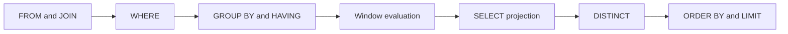

<TLDR>
  <TLDRCell label="what">
    Advanced SQL keeps partitioned analysis, staged transformations, graph traversal, and existence tests inside relational queries, where the database can optimize the whole expression.
  </TLDRCell>
  <TLDRCell label="trap">
    Default window frames, peer rows, recursive cycles, and a `NULL` inside `NOT IN` can make syntactically valid queries return the wrong result.
  </TLDRCell>
  <TLDRCell label="fix">
    Specify window order and frames, add stable ranking keys, maintain a recursion invariant, and prefer `NOT EXISTS` for anti-joins.
  </TLDRCell>
</TLDR>

## What it is and why it exists

“Advanced SQL” isn't a separate level of the SQL standard. It's a set of query capabilities for multistage relational problems. A <Term id="window-function">window function</Term> computes ranks, offsets, or cumulative values without discarding detail rows; common table expressions name the stages of a long query; recursion repeatedly expands a relation; and existence predicates express “at least one” or “none.” These tools keep work that might otherwise become an application loop inside one declarative query.

An ordinary aggregate collapses a group of input rows into one row; a window function doesn't. A CTE isn't a synonym for a temporary table, either. It is first a named query inside the current statement. A recursive CTE isn't an unrestricted loop: each round must derive new rows from the previous round, and the process needs a provable stopping condition.

You meet these structures in top-N-per-group reports, cumulative metrics, adjacent-event comparisons, organization trees, category paths, missing relationships, and exclusion lists. The hard part isn't memorizing keywords. It is defining the row set, order, boundaries, and `NULL` semantics precisely.

The executable examples target SQLite 3.45.1, bundled with the local Python runtime. Their core relational ideas also apply to databases such as PostgreSQL, but date functions, recursion limits, materialization behavior, and some window syntax vary by product. Rerun the tests against your target database before deployment.

## How it works

A `SELECT` can be understood as a logical pipeline that progressively forms the result relation. The database doesn't have to perform physical operations in this order, but logical phases determine name visibility and where expressions are legal. That is why a window result cannot appear directly in the same query level's `WHERE` clause.



The optimizer may push a filter down, rewrite a join, or choose a different access path as long as the result still follows SQL semantics. Use logical order to reason about correctness and an execution plan to explain actual work. Don't confuse the two.

### Partitions, order, and frames

A window function's `OVER` clause has three independent dimensions:

1. `PARTITION BY` divides the input into partitions that don't affect one another. Without it, all input rows form one partition.
2. The window's `ORDER BY` defines the logical order seen by ranking, offset, or cumulative calculations. It doesn't guarantee final output order.
3. A <Term id="window-frame">window frame</Term> selects the segment of the current partition used to calculate the current row. Boundaries have different meanings for `ROWS`, `GROUPS`, and `RANGE`.

`ROW_NUMBER()`, `RANK()`, and `DENSE_RANK()` all depend on the window order, but they handle ties differently. `ROW_NUMBER()` always assigns distinct positions. `RANK()` gives peers the same rank and leaves gaps; `DENSE_RANK()` leaves no gaps. `ROW_NUMBER()` selects the same row reliably only when its ordering keys are unique.

### Named intermediate relations

A <Term id="common-table-expression">common table expression (CTE)</Term> is defined with `WITH name AS (...)` and is visible only to the following statement. It is useful for naming query stages: first find eligible orders, then number them, then select the first two per group. Names improve reasoning boundaries, but they don't automatically save a result or improve performance.

A CTE's columns still form a relation. An outer query can refer only to columns that the CTE projects, and a filter cannot read a window value that its own query level hasn't computed yet. To filter on a window value, calculate it in a CTE and read the alias from an outer `WHERE`.

### Recursive relation expansion

A <Term id="recursive-cte">recursive CTE</Term> contains an anchor member and a recursive member. The anchor produces starting rows. The recursive member refers to the previous round's output and produces the next rows. `UNION ALL` or `UNION` combines the members, and evaluation stops when a round produces no more rows.

Reliable recursion needs a business endpoint and a defensive boundary. A tree normally stops at nodes without children, but dirty data can contain cycles, so the query should also record visited identifiers. A depth limit caps damage; it doesn't replace cycle detection. Tenant and authorization constraints must remain true in both the anchor and every recursive round.

### Existence and anti-joins

`EXISTS (subquery)` cares only whether its subquery returns at least one row. The projected columns and their values don't matter. A correlated subquery can refer to the current outer row, so `NOT EXISTS` directly expresses “there is no record matching this row,” which is an <Term id="anti-join">anti-join</Term>.

`NOT IN` looks equivalent, but three-valued logic changes its behavior. If the right-hand set contains `NULL`, comparing a nonmatching value with the whole list can produce `UNKNOWN`, and `WHERE` retains only `TRUE`. For exclusions over a nullable column, `NOT EXISTS` usually states the intention more clearly.

## Examples

These four runnable examples build through windows, staged queries, recursion, and null-safe exclusion logic. The visible `shop` fixture supplies data for the window, top-orders, and anti-join queries; the recursive example declares its category tree inline. The output came from SQLite 3.45.1; it wasn't calculated by hand.

```sql seed="shop"
CREATE TABLE sales(rep TEXT, sold_on TEXT, amount INTEGER);
INSERT INTO sales VALUES
  ('Ari', '2026-08-01', 120),
  ('Ari', '2026-08-02', 180),
  ('Ari', '2026-08-03', 180),
  ('Bo',  '2026-08-01', 90),
  ('Bo',  '2026-08-02', 140),
  ('Bo',  '2026-08-03', 110);

CREATE TABLE orders(
  order_id INTEGER PRIMARY KEY,
  customer TEXT,
  ordered_on TEXT,
  amount INTEGER
);
INSERT INTO orders VALUES
  (1, 'Acme', '2026-08-01', 90),
  (2, 'Acme', '2026-08-03', 150),
  (3, 'Acme', '2026-08-04', 120),
  (4, 'Nova', '2026-08-01', 200),
  (5, 'Nova', '2026-08-02', 80),
  (6, 'Nova', '2026-08-05', 140);

CREATE TABLE accounts(id INTEGER PRIMARY KEY, name TEXT);
CREATE TABLE suspensions(account_id INTEGER);
INSERT INTO accounts VALUES
  (1, 'Ari'),
  (2, 'Bo'),
  (3, 'Cy');
INSERT INTO suspensions VALUES (2), (NULL);
```

### Numbering, tied ranks, and running values

The first query calculates three results independently for each sales representative. Numbering uses the date as a second ordering key, so equal amounts still have a deterministic order. The cumulative amount uses an explicit `ROWS` frame ordered by sale date.

<Depth level="quick">

```sql run seed="shop" title="window_report.sql"
SELECT
  rep,
  sold_on,
  amount,
  ROW_NUMBER() OVER (
    PARTITION BY rep ORDER BY amount DESC, sold_on
  ) AS row_no,
  DENSE_RANK() OVER (
    PARTITION BY rep ORDER BY amount DESC
  ) AS amount_rank,
  SUM(amount) OVER (
    PARTITION BY rep
    ORDER BY sold_on
    ROWS BETWEEN UNBOUNDED PRECEDING AND CURRENT ROW
  ) AS running_amount
FROM sales
ORDER BY rep, sold_on;
```

```text
rep | sold_on    | amount | row_no | amount_rank | running_amount
----+------------+--------+--------+-------------+---------------
Ari | 2026-08-01 | 120    | 3      | 2           | 120
Ari | 2026-08-02 | 180    | 1      | 1           | 300
Ari | 2026-08-03 | 180    | 2      | 1           | 480
Bo  | 2026-08-01 | 90     | 3      | 3           | 90
Bo  | 2026-08-02 | 140    | 1      | 1           | 230
Bo  | 2026-08-03 | 110    | 2      | 2           | 340
```

</Depth>

Ari's two `180` rows share `amount_rank = 1`, but their `row_no` values are `1` and `2`. Displaying the final result in date order doesn't change the numbers already calculated by the amount-ordered window.

`running_amount` uses a different order from the rankings because every window function may have its own `OVER` clause. Putting several analytical values in one query doesn't force them to share partitions, orders, or frames.

### Filtering a window result through a CTE

The next query takes the two largest orders for each customer. It computes `position` inside `ranked_orders`, after which the outer query can legally use the alias in `WHERE`.

```sql run seed="shop" title="top_orders.sql"
WITH ranked_orders AS (
  SELECT
    order_id,
    customer,
    amount,
    ROW_NUMBER() OVER (
      PARTITION BY customer
      ORDER BY amount DESC, order_id
    ) AS position
  FROM orders
  WHERE ordered_on >= '2026-08-01'
)
SELECT customer, order_id, amount
FROM ranked_orders
WHERE position <= 2
ORDER BY customer, position;
```

```text
customer | order_id | amount
---------+----------+-------
Acme     | 2        | 150
Acme     | 3        | 120
Nova     | 4        | 200
Nova     | 6        | 140
```

`order_id` is the stable final ordering key. Even when two orders have equal amounts, the query still determines which one receives the smaller `position`, and tests don't depend on the scan order the database happens to choose.

If the requirement is “the top two distinct amounts, including ties,” this query should use `DENSE_RANK()` instead. Before choosing a ranking function, define whether “top two” means two rows, two competition positions, or two distinct value levels.

### Traversing a hierarchy with cycle defenses

The recursive example walks down from a root category. Its path uses delimited identifiers, which avoids treating identifier `1` as already present in `11`. A depth limit provides a second boundary for malformed data.

```sql run title="category_tree.sql"
CREATE TABLE categories(
  id INTEGER PRIMARY KEY,
  parent_id INTEGER,
  name TEXT
);
INSERT INTO categories VALUES
  (1, NULL, 'Store'),
  (2, 1, 'Data'),
  (3, 1, 'Tools'),
  (4, 2, 'SQL'),
  (5, 2, 'Python'),
  (6, 4, 'Window functions');

WITH RECURSIVE category_tree(id, name, depth, path) AS (
  SELECT id, name, 0, printf('/%d/', id)
  FROM categories
  WHERE id = 1

  UNION ALL

  SELECT c.id, c.name, t.depth + 1, t.path || c.id || '/'
  FROM categories AS c
  JOIN category_tree AS t ON c.parent_id = t.id
  WHERE t.depth < 10
    AND instr(t.path, printf('/%d/', c.id)) = 0
)
SELECT depth, name
FROM category_tree
ORDER BY depth, id;
```

```text
depth | name
------+-----------------
0     | Store
1     | Data
1     | Tools
2     | SQL
2     | Python
3     | Window functions
```

The anchor selects only `id = 1`. On each round, the recursive member joins children of the current level and appends the new identifier to the path. A branch stops expanding when that identifier is already in its path.

The path functions and string concatenation here are SQLite syntax. A production system should also prevent cycles from entering the data with foreign keys, uniqueness constraints, or write-time validation rather than relying on every read query to defend itself.

### Excluding a nullable relation with `NOT EXISTS`

The final example deliberately puts `NULL` in the suspension list and combines the results of `NOT IN` and `NOT EXISTS`. The `NOT IN` branch returns no rows. Only the anti-join branch keeps accounts without a suspension.

```sql run seed="shop" title="null_safe_anti_join.sql"
WITH methods(method, account_id, account_name) AS (
  SELECT 'NOT IN', a.id, a.name
  FROM accounts AS a
  WHERE a.id NOT IN (
    SELECT account_id FROM suspensions
  )

  UNION ALL

  SELECT 'NOT EXISTS', a.id, a.name
  FROM accounts AS a
  WHERE NOT EXISTS (
    SELECT 1
    FROM suspensions AS s
    WHERE s.account_id = a.id
  )
)
SELECT method, account_id, account_name
FROM methods
ORDER BY method, account_id;
```

```text
method     | account_id | account_name
-----------+------------+-------------
NOT EXISTS | 1          | Ari
NOT EXISTS | 3          | Cy
```

For account `1`, `1 <> 2` is true, but `1 <> NULL` is `UNKNOWN`. The complete `NOT IN` condition can't become `TRUE`. `NOT EXISTS` searches for an equality match per outer row; `NULL = 1` isn't a match, so it correctly retains Ari and Cy.

If the business treats `NULL` as another explicit category, put that rule in the data model or filter. Don't rely on a query author remembering that the right-hand column currently “shouldn't contain nulls.”

## Pitfalls

> [!PITFALL]
> A window orders by a nonunique value, but `ROW_NUMBER() = 1` is treated as a stable choice. Peers have no defined order, so a plan, index, or version change can select another row from the same data.

**Fix:** Add a unique, meaningful stable key at the end of the window `ORDER BY`, such as `created_at DESC, order_id DESC`. If the requirement preserves ties, use `RANK()` or `DENSE_RANK()` instead of secretly breaking them with an arbitrary key.

> [!PITFALL]
> An aggregate window omits its frame, and the default is assumed to mean “from the first physical row to this physical row.” In SQLite, a window order gives you a default `RANGE ... CURRENT ROW` frame, which includes the current row's peers.

**Fix:** Spell out `ROWS BETWEEN ...`, `GROUPS BETWEEN ...`, or a supported `RANGE` boundary for cumulative and moving calculations. Test repeated ordering values at the current row instead of testing only data where every value is unique.

> [!PITFALL]
> A query refers to a window alias, or calls a window function, in the same query level's `WHERE`. Filtering happens before window evaluation, so the alias doesn't exist yet and the expression isn't legal there.

**Fix:** Calculate the window value in a subquery or CTE, then filter in an outer query. Databases with `QUALIFY` can use that clause, but SQLite 3.45.1 doesn't support it, so portable code can't assume it exists.

> [!PITFALL]
> A recursive query increments a depth counter but doesn't track visited nodes. A depth cap stops unbounded expansion, but it can silently return a truncated tree and hide a cycle in the data.

**Fix:** Maintain a visited path with unambiguous delimiters, and either stop or report a branch when a node repeats. Keep the depth limit as resource protection, and enforce or validate acyclic data at write time.

> [!PITFALL]
> `NOT IN (subquery)` excludes a nullable column. One `NULL` on the right can turn every otherwise nonmatching outer row into `UNKNOWN` and remove all of them.

**Fix:** Use `NOT EXISTS` for a correlated exclusion. If `NOT IN` is required, explicitly remove `NULL` inside the subquery and add a regression test whose right-hand set contains a null.

> [!PITFALL]
> A CTE is treated as a cache that must run once, or as a barrier that must prevent optimizer rewrites. Different databases and versions can inline, materialize, or otherwise implement an ordinary CTE.

**Fix:** Write the correct relational query first, then inspect its behavior with the target database's execution plan. Use product-specific materialization hints, temporary tables, or indexes only after measurements show a real problem.

## In the AI era

**What generated code gets wrong here**

Models often generate `ROW_NUMBER()` ordered only by an amount, making the first row per group unstable. They also put a window alias directly into the same query level's `WHERE`. Generated recursion frequently lacks cycle detection, tenant constraints, or a real termination argument. Exclusion logic is prone to copying `NOT IN` from training examples without checking whether the subquery column is nullable; another recurring mistake is asserting that a CTE always materializes and offering unmeasured performance advice on that basis.

**Ask your AI to check**

- List every window's partition keys, complete ordering keys, frame, and intended treatment of peers.
- Prove the recursive member terminates, and check that tenant, authorization, and visited-set constraints survive every round.
- Compare the exclusion query when the right-hand set is empty, contains `NULL`, and contains duplicates.

**Review checklist**

- Confirm that window results are filtered only from an outer query and that final output has its own explicit `ORDER BY`.
- Run boundary tests for equal ordering values, empty and single-row partitions, cycles, and maximum depth.
- Inspect an execution plan on the target database; reject unsupported claims such as “CTEs are faster” or “correlated subqueries are slower.”

**Prompt vocabulary**

Use the precise terms `window function`, `partition`, `peer rows`, `window frame`, `stable tie-breaker`, `common table expression`, `anchor member`, `recursive member`, `cycle detection`, `three-valued logic`, and `anti-join`. Ask the AI to state the input and output row set for every stage. That exposes semantic mistakes more reliably than “optimize this SQL.”

<Depth level="deep">

## Window frames and peer rows

The window partition determines which rows a function can see, its window order determines their logical sequence, and its frame selects the segment used for the current row's calculation. These dimensions often appear in one `OVER` clause, but none substitutes for another. `PARTITION BY customer` doesn't imply date order, and `ORDER BY sold_on` doesn't automatically mean a fixed number of preceding rows.

Without a window `ORDER BY`, all rows in a partition are peers, and many aggregate windows see the entire partition. Once you add a window `ORDER BY`, the database dialect defines a default frame. In SQLite 3.45.1, that default is a `RANGE` frame from the partition start through the current peer group. Relying on that default hides an important business boundary.

### `ROWS`, `GROUPS`, and `RANGE`

`ROWS` moves boundaries by physical positions in the ordered rows. `ROWS BETWEEN 2 PRECEDING AND CURRENT ROW` contains at most the current row and two preceding rows, even if all three ordering values are equal. It fits windows defined as “the latest three events.”

`GROUPS` moves boundaries by peer groups. Rows for which every window `ORDER BY` expression is equal belong to one group, so the preceding group may contain several rows. It fits requirements such as “this price level and the previous price level.”

`RANGE` determines boundaries from ordering-expression values rather than simply counting rows. Databases differ in their support for multiple ordering expressions, date intervals, and boundary expressions. For a time-range window, verify syntax and boundary inclusion against the target dialect.

| Frame unit | What moves the boundary | Effect of duplicate ordering values | Typical requirement |
|---|---|---|---|
| `ROWS` | Row position | Each row may have a different frame | Latest N records |
| `GROUPS` | Peer group | A whole group enters or leaves | Latest N value levels |
| `RANGE` | Ordering-value range | Peers usually share a boundary | Numeric or time range |

Whichever frame you choose, decide the start, end, and whether boundaries are inclusive. Tests with duplicate values on a boundary are the most useful because the three units can appear to produce the same output when every value is unique.

### Ranking is separate from framing

Ranking functions determine positions or peer groups from the whole partition's window order. Frames mainly affect window functions evaluated per row, such as `SUM()`, `AVG()`, and `FIRST_VALUE()`. They don't restrict `ROW_NUMBER()` to numbering “inside the frame,” so adding a frame to a ranking function doesn't create a moving rank.

`LAG()` and `LEAD()` also locate offset rows by window order, and SQLite doesn't use the frame to exclude their targets. To take a previous value only within a recent time range, define the eligible input rows first or separately test the date difference in the offset result. Don't just narrow the frame and assume an offset function obeys it.

## CTE semantic boundaries

An ordinary CTE names the result of a query. It reduces nesting and gives relations such as “eligible orders,” “numbered orders,” and “final top two” names that can be discussed. Its primary value is semantic organization, not a guaranteed storage strategy.

When a CTE is referenced more than once, the database can choose an evaluation strategy under its own rules. SQLite supports `AS MATERIALIZED` and `AS NOT MATERIALIZED` as nonbinding hints; other products have different defaults and syntax. You cannot infer cost from the spelling of a CTE without an execution plan and measurements for the target version and data.

### Filter placement changes meaning

Filtering before a window calculation isn't equivalent to filtering after it. Exclude old orders inside the CTE and then calculate `ROW_NUMBER()`, and you get “the first recent order.” Number all orders first and exclude old ones outside, and you get “the overall first order, if it happens to be recent.” The second form can leave a customer with no result.

Aggregation has the same kind of boundary. `WHERE` filters detail rows entering a group, `HAVING` filters formed groups, and an outer query can filter aggregate or window results. During review, attach every filter condition to the row set it actually constrains.

### The recursive term computes a fixed point

A recursive CTE can be understood as expanding a result until a new round adds no rows: a fixed-point computation. The anchor defines the initial set, the recursive member defines one-step reachability, and the compound operator controls duplicate handling. `UNION` removes duplicate complete result rows, while `UNION ALL` preserves them. If results include a changing `depth` or `path`, `UNION` alone might not recognize repeated visits to one node.

A recursion review should answer at least four questions:

1. Does the anchor select only permitted roots and carry tenant or authorization context?
2. Does the recursive member move each round toward an endpoint instead of reproducing the same state?
3. Should repeated nodes, cycles, multiple parents, and orphan data be preserved, merged, rejected, or ignored?
4. Which layer limits resources with maximum depth, maximum rows, or a statement timeout?

Writing only `depth < 100` partially answers the fourth question; it doesn't prove correctness. A stronger design makes the path or a separate visited set part of the recursive state and makes exceptional branches observable.

## Three-valued logic and existence

An SQL condition can evaluate to `TRUE`, `FALSE`, or `UNKNOWN`. Ordinary equality or inequality with `NULL` usually produces `UNKNOWN`, and `WHERE` and `HAVING` retain only `TRUE`. This doesn't treat `NULL` as a hidden value; it says that the comparison lacks a determinate result.

`IN` can be understood as equality comparisons combined with `OR`, while `NOT IN` negates that result. When the list contains `NULL` and has no equal item, one comparison remains `UNKNOWN`, so the negated result remains `UNKNOWN`. The problem isn't limited to cases where the outer value is null.

### `EXISTS` tests only row existence

The result of `EXISTS` depends only on whether the subquery has a row. Writing `SELECT 1` communicates intent; it doesn't make the database read a special value. `SELECT NULL` would have the same existence semantics. The correlated condition `s.account_id = a.id` decides which rows count as matches.

`NOT EXISTS` searches for a matching suspension for every outer account. A null `account_id` in the suspension table isn't equal to a concrete account, so it doesn't incorrectly exclude that account. If the outer account identifier can also be null, define whether that is valid separately; don't use an anti-join as a substitute for data-quality rules.

### A join can also express an anti-join

`LEFT JOIN ... WHERE right.key IS NULL` is another common anti-join form, but the inspected right-hand column must be non-null on every matched row. If you inspect an attribute that is itself nullable, a real match may look unmatched. A join condition that isn't one-to-one can also enlarge the intermediate result before filtering.

`NOT EXISTS` puts “no matching row” directly in the predicate and is usually closer to the requirement. Performance cannot be determined from spelling alone. An optimizer may turn multiple forms into the same anti-join plan, or it may choose different paths because of statistics, indexes, and correlation conditions.

</Depth>

<Checkpoint id="data/sql-advanced" />

## Further reading

- [SQLite window functions](https://www.sqlite.org/windowfunctions.html)
- [SQLite `WITH` clause](https://www.sqlite.org/lang_with.html)
- [SQLite `SELECT` documentation](https://www.sqlite.org/lang_select.html)
- [PostgreSQL window functions tutorial](https://www.postgresql.org/docs/current/tutorial-window.html)
