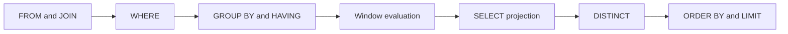

<TLDR>
  <TLDRCell label="what">
    高级 SQL 把分区分析、分步变换、图遍历和存在性判断放进关系查询，同时保留数据库优化整个表达式的机会。
  </TLDRCell>
  <TLDRCell label="trap">
    默认窗口框架、并列行、递归环路和 `NOT IN` 中的 `NULL` 都可能让语法正确的查询返回错误结果。
  </TLDRCell>
  <TLDRCell label="fix">
    明确写出窗口顺序与框架，为排名补上稳定键，为递归维护终止条件，并优先用 `NOT EXISTS` 表达反连接。
  </TLDRCell>
</TLDR>

## 是什么，为什么存在

“高级 SQL”不是标准中的独立语言层级，而是一组处理多步关系问题的查询能力。<Term id="window-function">窗口函数（window function）</Term>在保留明细行的同时计算排名、偏移和累计值；公共表表达式把长查询拆成命名关系；递归查询反复扩展一组行；存在性谓词则表达“至少有一个”或“一个也没有”。这些能力让原本需要应用代码循环处理的数据，继续留在一个声明式查询中。

普通聚合会把一组输入行折叠成一行，窗口函数不会。CTE 也不是临时表的同义词，它首先是当前语句中的命名查询。递归 CTE 更不是任意循环：每轮都必须从上一轮结果推导新行，并能证明过程会停止。

你会在按组取前几名、累计指标、相邻事件比较、组织树、类别路径、缺失关系和排除名单中遇到这些结构。它们的共同难点不是关键字记忆，而是精确定义行集、顺序、边界和 `NULL` 语义。

本文以本地 Python 运行时附带的 SQLite 3.45.1 为可执行方言。核心关系思想也适用于 PostgreSQL 等数据库，但日期函数、递归限制、物化策略和部分窗口语法会因产品而异，上线前应对目标数据库重新运行测试。

## 工作原理

一个 `SELECT` 可以看成逐步形成结果关系的逻辑管线。数据库不必按这个顺序执行物理操作，但名称可见性和表达式合法位置受逻辑阶段约束；这就是窗口结果不能直接出现在同层 `WHERE` 中的原因。



优化器可以把过滤下推、改写连接或选择不同访问路径，只要结果仍符合 SQL 语义。因此，逻辑顺序用于判断正确性，执行计划用于解释实际工作，两者不能混为一谈。

### 分区、顺序与框架

窗口函数的 `OVER` 子句有三个彼此独立的维度：

1. `PARTITION BY` 把输入分成互不影响的分区；省略时，全部输入行属于一个分区。
2. 窗口内的 `ORDER BY` 定义排名、偏移或累计计算所看到的逻辑顺序；它不保证最终输出顺序。
3. <Term id="window-frame">窗口框架（window frame）</Term>从当前分区中选择当前行参与计算的那一段；`ROWS`、`GROUPS` 和 `RANGE` 的边界含义不同。

`ROW_NUMBER()`、`RANK()` 和 `DENSE_RANK()` 都依赖窗口顺序，但处理并列值的方式不同。`ROW_NUMBER()` 总会编号为不同位置；`RANK()` 为并列行给出相同名次并留下空位；`DENSE_RANK()` 不留空位。只有排序键唯一时，`ROW_NUMBER()` 才能稳定选择同一行。

### 命名中间关系

<Term id="common-table-expression">公共表表达式（common table expression，CTE）</Term>由 `WITH name AS (...)` 定义，并只在随后的一条语句中可见。它适合给查询阶段命名，例如先筛选合格订单，再编号，最后选择每组前两条。名称改善了推理边界，却不自动保存结果或提升性能。

CTE 的列仍然构成关系。外层查询只能引用 CTE 实际投影出的列，而同层过滤不能引用尚未计算的窗口结果。需要按窗口值过滤时，先在 CTE 中计算，再由外层 `WHERE` 读取别名。

### 递归扩展行集

<Term id="recursive-cte">递归 CTE（recursive CTE）</Term>包含锚成员和递归成员。锚成员产生起始行；递归成员引用 CTE 的上一轮输出，并产生下一轮行。两部分通过 `UNION ALL` 或 `UNION` 组成一个复合查询，直到某一轮不再产生新行。

可靠的递归查询需要业务终点和防御边界。树结构通常以“没有子节点”为自然终点，但脏数据可能形成环，所以查询还应记录已经访问的标识；深度上限用于限制损害，不能代替环检测。租户或权限条件也必须在锚成员和递归成员中持续成立。

### 存在性与反连接

`EXISTS (subquery)` 只关心子查询是否至少返回一行，选出的具体列和值都不重要。相关子查询可以引用外层当前行，因此 `NOT EXISTS` 能直接表达“没有与此行匹配的记录”，也就是<Term id="anti-join">反连接（anti-join）</Term>。

`NOT IN` 看似表达同一意思，却受三值逻辑影响。只要右侧集合含有 `NULL`，一个不匹配的值与整个列表比较后也可能得到 `UNKNOWN`，而 `WHERE` 只保留 `TRUE`。排除可空列时，`NOT EXISTS` 的意图通常更清楚。

## 示例

下面四个示例都可以运行，并逐步覆盖窗口、分层查询、递归和空值安全的排除逻辑。下方可见的 `shop` 固定数据为窗口查询、最高订单查询和反连接查询提供共享数据；递归示例则在代码中声明自己的类别树。输出来自 SQLite 3.45.1，而不是手工推算。

```sql seed="shop"
CREATE TABLE sales(rep TEXT, sold_on TEXT, amount INTEGER);
INSERT INTO sales VALUES
  ('Ari', '2026-08-01', 120),
  ('Ari', '2026-08-02', 180),
  ('Ari', '2026-08-03', 180),
  ('Bo',  '2026-08-01', 90),
  ('Bo',  '2026-08-02', 140),
  ('Bo',  '2026-08-03', 110);

CREATE TABLE orders(
  order_id INTEGER PRIMARY KEY,
  customer TEXT,
  ordered_on TEXT,
  amount INTEGER
);
INSERT INTO orders VALUES
  (1, 'Acme', '2026-08-01', 90),
  (2, 'Acme', '2026-08-03', 150),
  (3, 'Acme', '2026-08-04', 120),
  (4, 'Nova', '2026-08-01', 200),
  (5, 'Nova', '2026-08-02', 80),
  (6, 'Nova', '2026-08-05', 140);

CREATE TABLE accounts(id INTEGER PRIMARY KEY, name TEXT);
CREATE TABLE suspensions(account_id INTEGER);
INSERT INTO accounts VALUES
  (1, 'Ari'),
  (2, 'Bo'),
  (3, 'Cy');
INSERT INTO suspensions VALUES (2), (NULL);
```

### 同时计算编号、并列名次与累计值

第一个查询对每位销售代表分别计算三种结果。编号使用日期作为第二排序键，所以相同金额下仍有确定顺序；累计金额则按销售日期使用显式的 `ROWS` 框架。

<Depth level="quick">

```sql run seed="shop" title="window_report.sql"
SELECT
  rep,
  sold_on,
  amount,
  ROW_NUMBER() OVER (
    PARTITION BY rep ORDER BY amount DESC, sold_on
  ) AS row_no,
  DENSE_RANK() OVER (
    PARTITION BY rep ORDER BY amount DESC
  ) AS amount_rank,
  SUM(amount) OVER (
    PARTITION BY rep
    ORDER BY sold_on
    ROWS BETWEEN UNBOUNDED PRECEDING AND CURRENT ROW
  ) AS running_amount
FROM sales
ORDER BY rep, sold_on;
```

```text
rep | sold_on    | amount | row_no | amount_rank | running_amount
----+------------+--------+--------+-------------+---------------
Ari | 2026-08-01 | 120    | 3      | 2           | 120
Ari | 2026-08-02 | 180    | 1      | 1           | 300
Ari | 2026-08-03 | 180    | 2      | 1           | 480
Bo  | 2026-08-01 | 90     | 3      | 3           | 90
Bo  | 2026-08-02 | 140    | 1      | 1           | 230
Bo  | 2026-08-03 | 110    | 2      | 2           | 340
```

</Depth>

Ari 的两笔 `180` 共享 `amount_rank = 1`，但 `row_no` 分别为 `1` 和 `2`。最终结果按日期展示，不会改变窗口函数先前按金额计算出的编号。

`running_amount` 的顺序与排名不同，因为每个窗口函数可以拥有自己的 `OVER` 子句。把多个分析值放在一个查询中，并不意味着它们必须共享分区、顺序或框架。

### 用 CTE 过滤窗口结果

下一个查询要取每位客户金额最高的两笔订单。`position` 在 `ranked_orders` 中计算，外层查询才能合法地在 `WHERE` 中使用它。

```sql run seed="shop" title="top_orders.sql"
WITH ranked_orders AS (
  SELECT
    order_id,
    customer,
    amount,
    ROW_NUMBER() OVER (
      PARTITION BY customer
      ORDER BY amount DESC, order_id
    ) AS position
  FROM orders
  WHERE ordered_on >= '2026-08-01'
)
SELECT customer, order_id, amount
FROM ranked_orders
WHERE position <= 2
ORDER BY customer, position;
```

```text
customer | order_id | amount
---------+----------+-------
Acme     | 2        | 150
Acme     | 3        | 120
Nova     | 4        | 200
Nova     | 6        | 140
```

`order_id` 是稳定的最终排序键。即使两笔订单金额相同，查询仍能确定哪一笔占据较小的 `position`，测试也不会依赖数据库碰巧采用的扫描顺序。

如果需求是“包含并列的前两种金额”，这里应改用 `DENSE_RANK()`。选择排名函数前必须先定义业务中的“前两名”指行数、竞赛名次，还是不同数值层级。

### 遍历带防环条件的层次结构

递归示例从根类别开始向下遍历。路径使用带分隔符的标识序列，避免把标识 `1` 误判为已经包含在 `11` 中；深度上限为异常数据提供第二道边界。

```sql run title="category_tree.sql"
CREATE TABLE categories(
  id INTEGER PRIMARY KEY,
  parent_id INTEGER,
  name TEXT
);
INSERT INTO categories VALUES
  (1, NULL, 'Store'),
  (2, 1, 'Data'),
  (3, 1, 'Tools'),
  (4, 2, 'SQL'),
  (5, 2, 'Python'),
  (6, 4, 'Window functions');

WITH RECURSIVE category_tree(id, name, depth, path) AS (
  SELECT id, name, 0, printf('/%d/', id)
  FROM categories
  WHERE id = 1

  UNION ALL

  SELECT c.id, c.name, t.depth + 1, t.path || c.id || '/'
  FROM categories AS c
  JOIN category_tree AS t ON c.parent_id = t.id
  WHERE t.depth < 10
    AND instr(t.path, printf('/%d/', c.id)) = 0
)
SELECT depth, name
FROM category_tree
ORDER BY depth, id;
```

```text
depth | name
------+-----------------
0     | Store
1     | Data
1     | Tools
2     | SQL
2     | Python
3     | Window functions
```

锚成员只选择 `id = 1`。递归成员每轮连接当前层的子类别，并把新标识追加到路径；如果新标识已经在路径中，该分支不再扩展。

这里的路径函数和字符串拼接属于 SQLite 方言。生产系统还应通过外键、唯一约束或写入验证阻止环进入数据，而不是只依靠每个读取查询自行防御。

### 用 `NOT EXISTS` 排除可空关系

最后一个示例故意在停用列表中放入 `NULL`，并把 `NOT IN` 与 `NOT EXISTS` 的结果合并展示。`NOT IN` 分支没有返回行，只有反连接分支保留未停用账户。

```sql run seed="shop" title="null_safe_anti_join.sql"
WITH methods(method, account_id, account_name) AS (
  SELECT 'NOT IN', a.id, a.name
  FROM accounts AS a
  WHERE a.id NOT IN (
    SELECT account_id FROM suspensions
  )

  UNION ALL

  SELECT 'NOT EXISTS', a.id, a.name
  FROM accounts AS a
  WHERE NOT EXISTS (
    SELECT 1
    FROM suspensions AS s
    WHERE s.account_id = a.id
  )
)
SELECT method, account_id, account_name
FROM methods
ORDER BY method, account_id;
```

```text
method     | account_id | account_name
-----------+------------+-------------
NOT EXISTS | 1          | Ari
NOT EXISTS | 3          | Cy
```

对于账户 `1`，`1 <> 2` 为真，但 `1 <> NULL` 是 `UNKNOWN`；整个 `NOT IN` 条件不能成为 `TRUE`。`NOT EXISTS` 逐行寻找等值匹配，`NULL = 1` 不会形成匹配，所以 Ari 和 Cy 被正确保留。

如果业务把 `NULL` 视为另一个明确类别，应先把这项规则写进数据模型或过滤条件。不要依靠某个查询作者记得右侧列当前“应该没有空值”。

## 陷阱

> [!PITFALL]
> 窗口内只按非唯一值排序，却把 `ROW_NUMBER() = 1` 当成稳定选择。并列行之间没有规定顺序，同一数据可能在计划、索引或版本改变后选中另一行。

**修复方法：** 在窗口 `ORDER BY` 末尾加入唯一且有业务意义的稳定键，例如 `created_at DESC, order_id DESC`。如果需求要求保留并列，使用 `RANK()` 或 `DENSE_RANK()`，不要用任意键偷偷打破并列。

> [!PITFALL]
> 省略聚合窗口的框架，默认行为却被理解成“从第一物理行到当前物理行”。在 SQLite 中，带窗口顺序时默认是 `RANGE ... CURRENT ROW`，当前行的同值行也属于框架。

**修复方法：** 累计或移动计算应显式写出 `ROWS BETWEEN ...`、`GROUPS BETWEEN ...` 或目标方言支持的 `RANGE` 边界。用重复排序值测试当前行的结果，而不只测试所有值都唯一的数据。

> [!PITFALL]
> 在同层 `WHERE` 中引用窗口别名或直接调用窗口函数。过滤阶段先于窗口求值，因此别名还不存在，窗口表达式也不允许出现在该位置。

**修复方法：** 在子查询或 CTE 中计算窗口值，再由外层查询过滤。支持 `QUALIFY` 的数据库可以使用该子句，但 SQLite 3.45.1 不支持，跨数据库代码不能假定它存在。

> [!PITFALL]
> 递归查询只增加深度，却没有跟踪访问节点。深度限制会截断无限扩展，但也可能静默返回一个不完整的树，并隐藏数据中的环。

**修复方法：** 维护带可靠分隔符的已访问路径，发现重复节点时停止或单独报告。把深度上限保留为资源保护，并在数据写入处执行无环约束或验证。

> [!PITFALL]
> 用 `NOT IN (subquery)` 排除一个可空列。右侧只要出现一个 `NULL`，原本不匹配的外层行也可能因结果为 `UNKNOWN` 而全部消失。

**修复方法：** 对相关排除条件使用 `NOT EXISTS`。如果必须使用 `NOT IN`，应在子查询中明确排除 `NULL`，并为右侧包含空值的情况添加回归测试。

> [!PITFALL]
> 把 CTE 当成一定只执行一次的缓存，或当成必然阻止优化器改写的屏障。不同数据库和版本可以内联、物化或用其他方式实现普通 CTE。

**修复方法：** 先按关系语义写出正确查询，再用目标数据库的执行计划检查实际行为。只有测量证明确有问题时，才使用该产品提供的物化提示、临时表或索引策略。

## AI 时代

**生成代码在这里常犯的错**

生成模型常写出只有金额排序的 `ROW_NUMBER()`，导致每组第一行不稳定；也常把窗口别名直接放进同层 `WHERE`。递归查询容易缺少环检测、租户条件或真正的终止证明。排除逻辑则经常从训练语料中套用 `NOT IN`，没有检查子查询列是否可空；另一类错误是断言 CTE 一定物化，并据此给出未经测量的性能建议。

**让 AI 检查**

- 列出每个窗口的分区键、完整排序键、框架，以及并列行的预期语义。
- 为递归成员证明终止条件，并检查租户、权限和已访问集合在每一轮都被保留。
- 用右侧集合为空、含 `NULL`、含重复值三种输入，比较排除查询的结果。

**审查清单**

- 确认窗口结果在外层查询中才被过滤，并为最终输出另写明确的 `ORDER BY`。
- 对相同排序值、空分区、单行分区、环和最大深度运行边界测试。
- 在目标数据库上查看执行计划；不接受“CTE 更快”或“相关子查询更慢”这类无证据结论。

**提示词词汇**

使用准确术语：`window function`（窗口函数）、`partition`（分区）、`peer rows`（同值行）、`window frame`（窗口框架）、`stable tie-breaker`（稳定的并列决胜键）、`common table expression`（公共表表达式）、`anchor member`（锚成员）、`recursive member`（递归成员）、`cycle detection`（环检测）、`three-valued logic`（三值逻辑）、`anti-join`（反连接）。要求 AI 给出每个阶段的输入行集与输出行集，比“优化这段 SQL”更容易暴露语义错误。

<Depth level="deep">

## 窗口框架与同值行

窗口分区决定函数能看到哪些行，窗口顺序决定这些行的逻辑排列，框架再决定当前行计算时包含其中哪一段。三个维度经常写在同一个 `OVER` 中，却不能互相替代。`PARTITION BY customer` 不表示按日期排列，`ORDER BY sold_on` 也不自动表示只看当前行之前的固定数量。

没有窗口 `ORDER BY` 时，分区中的所有行彼此同值，许多聚合窗口会看到整个分区。写出窗口 `ORDER BY` 后，默认框架由数据库方言规定；在 SQLite 3.45.1 中，它是从分区起点到当前同值组的 `RANGE` 框架。依赖默认值会把关键业务边界藏起来。

### `ROWS`、`GROUPS` 与 `RANGE`

`ROWS` 按排序后的物理行位置移动边界。`ROWS BETWEEN 2 PRECEDING AND CURRENT ROW` 最多包含当前行与之前两行，即使三行的排序值相同。它适合“最近三条事件”这种按记录数定义的窗口。

`GROUPS` 按同值组移动边界。窗口 `ORDER BY` 的所有表达式都相等的行属于同一组，因此前一个组可能包含多行。它适合“当前价格层级和前一个价格层级”这样的离散层级需求。

`RANGE` 根据排序表达式的值确定边界，而不是简单数行。各数据库对多列排序、日期间隔和边界表达式的支持不同；需要时间范围窗口时，必须按目标方言验证语法和边界包含规则。

| 框架单位 | 边界按什么移动 | 重复排序值的作用 | 典型需求 |
|---|---|---|---|
| `ROWS` | 行位置 | 每行可有不同框架 | 最近 N 条记录 |
| `GROUPS` | 同值组 | 整组进入或离开 | 最近 N 个层级 |
| `RANGE` | 排序值范围 | 同值行通常共享边界 | 数值或时间范围 |

无论选择哪种框架，都要同时决定起点、终点和边界是否包含。把重复值放在边界位置的测试最有价值，因为全是唯一值时，三种框架可能产生看似相同的输出。

### 排名与框架不是一回事

排名函数根据整个分区的窗口顺序确定位置或同值组。框架主要影响 `SUM()`、`AVG()`、`FIRST_VALUE()` 等逐行求值的窗口函数，并不会把 `ROW_NUMBER()` 限制为“框架内编号”。因此，给排名函数追加框架通常不能实现滑动排名。

`LAG()` 和 `LEAD()` 也按窗口顺序定位偏移行，在 SQLite 中不会用框架排除目标行。需要只在最近时间范围内取前值时，应先定义合格行集或对偏移结果额外检查日期差，不能仅缩小框架后假设偏移函数会遵守它。

## CTE 的语义边界

普通 CTE 为一段查询结果命名。它能减少嵌套层级，让“合格订单”“已编号订单”“最终前两名”等关系拥有可讨论的名称。它的价值首先是语义组织，而不是保证某种存储方式。

同一个 CTE 被引用多次时，数据库可以根据自身规则选择计算策略。SQLite 支持 `AS MATERIALIZED` 与 `AS NOT MATERIALIZED` 作为非强制提示；其他产品的默认策略和语法不同。没有目标版本的执行计划与数据测量，不能从 CTE 的拼写推断成本。

### 过滤位置改变含义

窗口计算前过滤与窗口计算后过滤不是等价改写。先在 CTE 内排除旧订单，再计算 `ROW_NUMBER()`，得到的是“近期订单中的第一名”；先对全部订单编号，再在外层排除旧订单，得到的是“总排名第一且恰好近期的订单”。第二种写法可能让某位客户完全没有结果。

聚合也存在相同边界。`WHERE` 过滤进入分组的明细行，`HAVING` 过滤已经形成的组，外层查询则可以过滤聚合或窗口结果。审查查询时，应把每个过滤条件标到它真正约束的行集上。

### 递归项是不动点计算

可以把递归 CTE 理解为不断扩展结果，直到新一轮没有新行的不动点计算。锚成员定义初始集合，递归成员定义一步可达关系，复合运算符决定重复行如何处理。`UNION` 会消除完整结果行的重复，`UNION ALL` 会保留重复；若结果还包含不断变化的 `depth` 或 `path`，单靠 `UNION` 也未必能识别同一节点。

递归查询的审查至少要回答四个问题：

1. 锚成员是否只选择允许的根，并带上租户或权限上下文？
2. 递归成员是否让每一轮朝终点前进，而不是重新产生同一状态？
3. 节点重复、环、多个父节点和孤儿数据分别应保留、合并、报错还是忽略？
4. 最大深度、最大行数或语句超时由哪一层负责限制资源？

只写 `depth < 100` 回答了第四个问题的一部分，没有回答正确性。更稳妥的设计让路径或独立的访问集合显式参与递归状态，并让异常分支能够被观测。

## 三值逻辑与存在性

SQL 条件的结果可能是 `TRUE`、`FALSE` 或 `UNKNOWN`。与 `NULL` 进行普通相等或不等比较通常得到 `UNKNOWN`，而 `WHERE` 与 `HAVING` 只保留 `TRUE`。这不是把 `NULL` 当成某个隐藏值，而是表示比较缺少确定结果。

`IN` 可以理解为一组相等比较通过 `OR` 组合，`NOT IN` 则相当于对结果取反。列表含 `NULL` 且没有找到相等项时，组合中仍有 `UNKNOWN`，取反后仍是 `UNKNOWN`。因此，问题不只出现在外层值为 `NULL` 时。

### `EXISTS` 只检查行是否存在

`EXISTS` 的结果只取决于子查询有没有行。写 `SELECT 1` 是为了表达意图，而不是让数据库读取一个特殊值；写 `SELECT NULL` 也具有相同存在性语义。相关条件 `s.account_id = a.id` 决定哪一行算作匹配。

`NOT EXISTS` 对每个外层账户寻找匹配的停用记录。停用表中的空 `account_id` 与具体账户不相等，因此不会错误排除该账户。外层账户标识若也可空，则应另行定义空标识是否合法，不能让反连接替代数据质量规则。

### 连接写法也能表达反连接

`LEFT JOIN ... WHERE right.key IS NULL` 也常用于反连接，但被检查的右侧列必须在匹配行中保证非空。若检查一个本来就可空的右侧属性，真实匹配行也可能被误当成未匹配。连接条件若不是一对一，还可能在过滤前放大中间结果。

`NOT EXISTS` 把“没有匹配行”直接写进谓词，通常更接近需求。性能不能只凭写法判断；优化器可能把不同语法转换成相同反连接计划，也可能因统计信息、索引和相关条件而选择不同路径。

</Depth>

<Checkpoint id="data/sql-advanced" />

## 延伸阅读

- [SQLite 窗口函数](https://www.sqlite.org/windowfunctions.html)
- [SQLite `WITH` 子句](https://www.sqlite.org/lang_with.html)
- [SQLite `SELECT` 文档](https://www.sqlite.org/lang_select.html)
- [PostgreSQL 窗口函数教程](https://www.postgresql.org/docs/current/tutorial-window.html)
