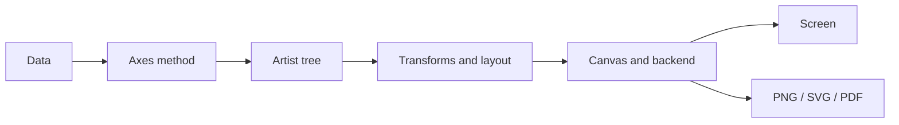

<TLDR>
  <TLDRCell label="what">
    Matplotlib organizes data, coordinate systems, and visible elements into an object tree, then asks a backend to render that tree to a window or file.
  </TLDRCell>
  <TLDRCell label="when">
    Use it when you need exact control over static plots, coordinated panels, or reliable PNG, SVG, and PDF output from batch jobs.
  </TLDRCell>
  <TLDRCell label="how">
    Create a `Figure` and `Axes` with `plt.subplots()`, add artists through `ax` methods, then call `fig.savefig()` and close the figure.
  </TLDRCell>
</TLDR>

## What it is and why it exists

Matplotlib is Python's general-purpose plotting library. It combines numeric, date, and categorical data with lines, bars, text, legends, and colorbars. It is particularly well suited to static analysis plots, report graphics, and files produced by scripts; interactive exploration is supported too, but browser-native interaction is not its central abstraction.

Drawing a bar is easy; managing data coordinates, layout, style, and output within one figure is the harder part. Matplotlib gives you explicit objects for that work. A quick experiment can use only `plt.plot(...)`, but reusable code needs clear object ownership. Otherwise, implicit state such as the current Axes, global style, and GUI backend gets mixed together.

The abstraction is low-level enough for pandas and several statistical plotting libraries to use Matplotlib as a rendering foundation. The trade-off is that Matplotlib does not decide the chart's semantics for you. Whether an axis begins at zero, a color encodes order, or two panels are comparable remains the author's responsibility.

The examples here were run with Python 3.14.3, Matplotlib 3.11.1, and NumPy 2.5.2. They select the non-interactive `Agg` backend explicitly, so they produce the same text results in CI and on servers without a display.

### Tasks that fit

These tasks fit Matplotlib's object model well:

- Generate repeatable PNG, SVG, or PDF files for analytical reports.
- Arrange several `Axes` in one `Figure` and share ticks or a color scale.
- Control labels, annotations, ticks, legends, and output dimensions precisely.
- Embed plotting in a desktop GUI, notebook, or batch program.

If the main requirement is browser-based tooltips, zooming, and filtering, first check whether an interactive plotting library is a better fit. Matplotlib has interactive backends and can be embedded in GUIs, but that is different from producing a native web chart.

Chart selection is not the library's job either. A time series often starts with a line, categorical comparisons often use bars, and the relationship between two continuous variables can use a scatter plot. Decide which relationship must be visible before choosing an API; working backward from an attractive template often hides what the data means.

## How it works

A Matplotlib figure is an object tree. The outer <Term id="matplotlib-figure">Figure</Term> stores canvas dimensions, layout, and one or more plotting areas. An <Term id="matplotlib-axes">Axes</Term> is where data graphics are added. An Axes usually contains x and y `Axis` objects, which manage scales, ticks, and tick labels.

Lines, rectangles, text, legends, and images are all <Term id="matplotlib-artist">Artists</Term>. `ax.plot()` creates and returns a `Line2D`; `ax.bar()` returns a group of rectangles; `ax.scatter()` returns a collection. Keeping those return values lets you update color, data, or visibility directly instead of searching global state for "the line I just drew."

After data enters an `Axes`, coordinate transforms map data coordinates to display coordinates. A layout engine calculates where each plotting area belongs, and a renderer walks the artist tree. Finally, a <Term id="matplotlib-backend">backend</Term> displays the result in a GUI or notebook, or writes a raster or vector file.



This pipeline explains a common misconception. When `ax.plot()` runs, the program mainly creates and configures objects; actual drawing can wait until display or save time. Tick placement, text bounds, and layout may not be fully determined until that draw happens.

### `Figure`, `Axes`, and `Axis`

A `Figure` is the complete output page, not "the data plot." It can hold a title, legend, colorbar, and several `Axes`. `fig.savefig()` renders this particular object tree, which is clearer than relying on the "current figure" used by `plt.savefig()`.

The name `Axes` is plural, but an `Axes` object represents one plotting area. It can own a title, data limits, legend, and several kinds of artist. Most everyday plotting starts from `ax`, through methods such as `ax.plot()`, `ax.set_xlabel()`, and `ax.grid()`.

An `Axis` is a tick-bearing object such as `ax.xaxis` or `ax.yaxis`. You work with it directly when customizing locators, formatters, or tick details. Confusing `Axes` with `Axis` often produces nonexistent method calls or puts a label at the wrong level.

### The object-oriented API and `pyplot`

`matplotlib.pyplot` creates figures, connects to a backend, and maintains "current figure/current Axes" state. That state is convenient at an interactive prompt. Inside functions, loops, and multi-panel plots, an implicit current object makes results depend on call order.

A reliable combination is to create objects with `plt.subplots()`, then operate through `fig` and `ax`. Pyplot still starts the backend and closes figures, while drawing and saving no longer depend on the current state. The stateful and explicit styles operate on the same Matplotlib objects.

A plotting helper should usually accept an `Axes` and leave the decision to create a `Figure` to its caller. The same helper can then draw a standalone plot or one panel in a dashboard, and a test can inspect exactly which artists it added.

### Data limits, scales, and color normalization

When you add a data artist, the `Axes` normally updates its data limits and autoscales. Calling `set_xlim()` or `set_ylim()` overrides that choice, so the range must follow an editorial intent rather than a wish to make the line fill the canvas. A truncated baseline on a bar chart can exaggerate a small difference.

Color mapping has two steps. <Term id="colormap-normalization">Colormap normalization</Term> first maps data values into a range that is usually zero to one; a colormap then maps that range to RGBA colors. Panels intended for comparison should share one `Normalize` object and one colorbar.

Sequential data suits a sequential colormap whose lightness changes monotonically. Deviations around a meaningful midpoint suit a diverging colormap, while unordered categories need discrete colors. Picking a color name you like does not establish ordering, color-vision accessibility, or comparability across panels.

### Layout and backends

`layout="constrained"` allocates room for axis labels, titles, and colorbars at draw time. It handles many routine overlaps, but it cannot repair overly long text or an overcrowded figure. You still need to inspect the output at its final delivery size.

Backends fall into interactive and file-oriented groups. An interactive backend connects a GUI event loop; a non-interactive backend such as `Agg` can write files without a display. Automatic selection is usually appropriate. Hard-code a backend only when the deployment environment or application architecture requires it.

The output format changes what happens downstream. PNG is a fixed-pixel raster whose dimensions depend on DPI. SVG and PDF primarily preserve vector drawing instructions and scale well, though a very large scatter plot can make them bulky. Choose based on the delivery channel and artist count.

## Examples

These four examples start with one plotting area, then add named panels, a shared color scale, and batch output. Each writes a file without opening a window, so it can run directly in CI.

### A minimal, complete file output

The first example keeps the returned `Line2D` and saves through its `Figure`. It also opens the generated PNG and checks the final pixel dimensions; a successful `savefig()` call alone does not establish those dimensions.

<Depth level="quick">

```python run title="monthly_signups.py"
from pathlib import Path

import matplotlib

matplotlib.use("Agg")
import matplotlib.pyplot as plt
from PIL import Image

months = ["Jan", "Feb", "Mar", "Apr", "May", "Jun"]
signups = [120, 138, 133, 162, 181, 205]

fig, ax = plt.subplots(figsize=(6.4, 3.6), layout="constrained")
(line,) = ax.plot(months, signups, marker="o", label="New accounts")
ax.set(title="Monthly signups", xlabel="Month", ylabel="Accounts")
ax.grid(axis="y", alpha=0.25)
ax.legend(frameon=False)

output = Path("monthly-signups.png")
fig.savefig(output, dpi=100)
with Image.open(output) as image:
    print(f"saved={output.name} size={image.size[0]}x{image.size[1]}")
print(f"backend={str(matplotlib.get_backend()).lower()}")
print(f"line_points={len(line.get_xdata())}")
plt.close(fig)
```

```text
saved=monthly-signups.png size=640x360
backend=agg
line_points=6
```

</Depth>

`figsize` is measured in inches. At save time, `dpi=100` turns 6.4 by 3.6 inches into 640 by 360 pixels. DPI does not create more detail in the data; it controls raster sampling density and pixel dimensions.

The code closes the `Figure` explicitly after saving. The operating system cleans up when a short script exits, but notebooks and batch loops keep pyplot's registered figures alive. In those environments, closing is part of the ownership contract.

### Named `Axes` for a multi-panel figure

`subplot_mosaic()` returns a dictionary of `Axes` indexed by name. Unlike `axes[1, 0]`, `axes["revenue"]` continues to state a panel's purpose after the layout changes.

```python run title="metric_panels.py"
from pathlib import Path

import matplotlib

matplotlib.use("Agg")
import matplotlib.pyplot as plt

months = ["Q1", "Q2", "Q3", "Q4"]
revenue = [84, 91, 97, 110]
orders = [420, 460, 445, 520]

fig, axes = plt.subplot_mosaic(
    [["trend", "trend"], ["revenue", "orders"]],
    figsize=(7.2, 5.0),
    layout="constrained",
)
axes["trend"].plot(months, revenue, marker="o")
axes["trend"].set(title="Revenue trend", ylabel="Revenue ($k)")
bars = axes["revenue"].bar(months, revenue, color="tab:blue")
axes["revenue"].set(title="Revenue", ylabel="$k")
points = axes["orders"].scatter(months, orders, color="tab:orange")
axes["orders"].set(title="Orders", ylabel="Count")

for ax in axes.values():
    ax.grid(axis="y", alpha=0.2)

output = Path("metric-panels.svg")
fig.savefig(output)
print(f"panels={','.join(axes)}")
print(f"lines={len(axes['trend'].lines)} bars={len(bars)} points={len(points.get_offsets())}")
print(f"saved={output.name}")
plt.close(fig)
```

```text
panels=trend,revenue,orders
lines=1 bars=4 points=4
saved=metric-panels.svg
```

The same quarterly revenue serves different purposes in the trend and bar panels. One stresses ordered change; the other stresses each quarter's magnitude. Orders use a separate y-axis because they have a different unit. Putting both units on one unlabeled scale would invite a false comparison.

The returned `bars` and `points` are artist containers. Code can inspect their count, as it does here, or update them in an interactive application. Panel names, data units, and artist handles form a clearer boundary than the idea of a current figure.

### One color scale across panels

The next two scatter plots share `Normalize(0, 400)`. A given latency therefore has the same color in both panels, and the common colorbar explains exactly one mapping.

```python run title="shared_color_scale.py"
from pathlib import Path

import matplotlib

matplotlib.use("Agg")
import matplotlib.pyplot as plt
from matplotlib.colors import Normalize

x = [1, 2, 3, 4]
throughput = [80, 140, 210, 260]
weekday_latency = [50, 120, 220, 400]
weekend_latency = [80, 160, 260, 320]
norm = Normalize(vmin=0, vmax=400)

fig, (left, right) = plt.subplots(1, 2, figsize=(7.2, 3.2), layout="constrained")
for ax, title, latency in [
    (left, "Weekday", weekday_latency),
    (right, "Weekend", weekend_latency),
]:
    points = ax.scatter(x, throughput, c=latency, cmap="viridis", norm=norm, s=60)
    ax.set(title=title, xlabel="Load", ylabel="Requests/s")

fig.colorbar(points, ax=[left, right], label="Latency (ms)")
output = Path("shared-color-scale.svg")
fig.savefig(output)
values = ",".join(f"{value:.3f}" for value in norm([50, 200, 400]))
print(f"normalized={values}")
print(f"axes={len(fig.axes)} shared_norm={left.collections[0].norm is right.collections[0].norm}")
print(f"saved={output.name}")
plt.close(fig)
```

```text
normalized=0.125,0.500,1.000
axes=3 shared_norm=True
saved=shared-color-scale.svg
```

There are three `Axes` in the output: two data areas and the colorbar's own area. `shared_norm=True` checks that both scatter collections refer to the same normalization object instead of stretching their colors independently to each panel's minimum and maximum.

The example makes 400 milliseconds an explicit upper bound. In a real project, derive that value from a domain threshold or a predefined comparison range. If every small sample chooses its own bounds, the meaning of color changes with the input and historical figures cannot be compared.

### Plotting as a reusable function

When producing figures in batches, a function should own the `Figure` it creates and close it on every path. A `try`/`finally` block also cleans up when saving fails.

```python run title="render_metrics.py"
from pathlib import Path

import matplotlib

matplotlib.use("Agg")
import matplotlib.pyplot as plt


def save_metric_chart(name, values, output):
    fig, ax = plt.subplots(figsize=(5.0, 2.8), layout="constrained")
    try:
        positions = range(len(values))
        ax.bar(positions, values, color="tab:blue")
        ax.set_xticks(positions, [f"Batch {index + 1}" for index in positions])
        ax.set(title=name, ylabel="Seconds", ylim=(0, max(values) * 1.15))
        fig.savefig(output, dpi=120)
        return output
    finally:
        plt.close(fig)


files = [
    save_metric_chart(
        "Import duration",
        [2.4, 2.1, 2.8],
        Path("import-duration.png"),
    ),
    save_metric_chart(
        "Export duration",
        [1.3, 1.1, 1.4],
        Path("export-duration.png"),
    ),
]
print("saved=" + ",".join(path.name for path in files))
print(f"open_figures={plt.get_fignums()}")
```

```text
saved=import-duration.png,export-duration.png
open_figures=[]
```

This function supplies positions and labels together to `set_xticks()`, so labels are not forced onto an automatic locator that may later change. The bars begin at zero and leave 15 percent headroom. Here, the range states an intentional comparison of durations.

The empty result from `plt.get_fignums()` proves that both figures were removed from pyplot's registry. Tests need not compare every image pixel. Start by asserting file existence, artist count, axis limits, labels, and the open-figure list, then reserve baseline-image tests for a small set of critical plots.

## Pitfalls

> [!PITFALL]
> Mixing `plt.plot()` with several `ax` objects in one function adds an artist to whichever Axes is current at that moment. It may not be the panel a reader expects from the surrounding code.

**Fix:** Once objects exist, use `ax.plot()`, `ax.set_*()`, and `fig.savefig()`. Have plotting helpers accept an `Axes`; depend on pyplot's current state only for disposable interactive exploration.

> [!PITFALL]
> Creating figures in a loop without closing them leaves the pyplot registry and artist trees holding objects. A long-running notebook, worker, or report process accumulates memory, and Matplotlib eventually warns that too many figures are open.

**Fix:** Whoever creates a `Figure` closes that exact object in a `finally` block. Do not hide unclear ownership with `plt.close("all")`, which can close figures that another component in the same process still uses.

> [!PITFALL]
> If each panel normalizes color independently, the same color can represent different values. Generated code often gives each `scatter()` call a separate colorbar, producing a complete-looking figure that cannot be compared horizontally.

**Fix:** Comparison panels share one `Normalize`, one colormap, and one colorbar labeled with a unit. Derive `vmin`, `vmax`, and any midpoint from the domain, and test whether out-of-range values should clip, extend, or fail.

> [!PITFALL]
> Calling only `set_xticklabels()` attaches text to the current tick positions. If the automatic locator later changes those positions, labels can drift and Matplotlib can emit a `FixedFormatter` warning.

**Fix:** Set locations and labels together, for example with `ax.set_xticks(positions, labels)`. Prefer the relevant locator and formatter for dates or continuous numeric axes instead of reducing them to a handwritten string list.

> [!PITFALL]
> Truncating a bar chart's baseline to "show the difference" can make a small numerical change look large. Conversely, forcing every chart to start at zero can flatten a line whose purpose is to show variation around a baseline.

**Fix:** Make the range follow the chart's semantics. Bars that encode absolute magnitude should usually begin at zero. A line may use a narrower range, but it needs clear ticks and a consistent scale when readers compare it with another chart.

> [!PITFALL]
> Hard-coding `TkAgg` or `QtAgg` in server code introduces a GUI dependency and a display requirement. Forcing `Agg` in a desktop program that needs window interaction instead produces files without a GUI event loop.

**Fix:** Library code should not select a backend globally. Let the application entry point configure it for the runtime. CI and batch jobs can select `Agg` before importing `pyplot`; a desktop application should use the backend for its GUI framework.

<Depth level="deep">

## Rendering, transforms, and output

### Deferred drawing and the artist tree

Matplotlib converts high-level plotting calls into artists attached to containers. `Line2D`, `Rectangle`, `Text`, and collection objects hold drawing properties, while `Axes` and `Figure` organize them. When a backend requests a draw, the renderer walks this tree rather than rerunning data-analysis logic.

Some geometry cannot be finalized until a renderer is available. Text bounds depend on fonts and the renderer, automatic ticks depend on final axis limits, and layout depends on those bounds. If a test must read exact bounds, call `fig.canvas.draw()` first; ordinary save operations trigger a draw themselves.

Keeping artist handles allows targeted updates. An interactive program can call `set_ydata()` on one line and request a canvas redraw without clearing the entire `Axes`. That approach requires the application to own the figure lifecycle and event loop explicitly.

### Coordinate systems and transforms

Data points begin in data coordinates. They pass through axis scales and limits, then through the position of the `Axes` inside its `Figure`, and finally reach display coordinates. Text and annotations need not use data coordinates; a panel label, for example, often fits the zero-to-one coordinates of `ax.transAxes`.

Blended coordinates can express requirements such as "x follows the data while y stays at a fixed place in the Axes," but they are easier to misuse. When reviewing annotation code, check the semantics of `transform`, `xycoords`, and `textcoords` instead of trusting that one screenshot happens to line up.

Transforms also explain why artists move when axis limits change while a title stays at the top of its panel. The two belong to different coordinate systems. Hard-coded display pixels are usually the most fragile choice because dimensions, DPI, or fonts can move them.

### Raster, vector, and DPI

PNG samples the result into pixels. `figsize=(6.4, 3.6)` with `dpi=100` normally produces a 640 by 360 canvas. Higher DPI increases pixel count and file work, but does not repair weak data or a poor layout.

SVG and PDF preserve vector descriptions for many artists, so lines and text continue to scale. With hundreds of thousands of separate markers, a vector file can become heavier than a raster image. Matplotlib can rasterize selected artists inside vector output, but that choice should follow inspection of the real file and use case, not a fixed performance claim.

`bbox_inches="tight"` crops output to artist bounds and can change the final pixel dimensions. A pipeline that requires an exact canvas must not also assume tight-cropped output remains `figsize × dpi`. Read the generated file and test the actual delivery contract.

### Backends and process boundaries

A backend connects a `FigureCanvas`, a renderer, and optionally a GUI event loop. Interactive backends need the corresponding toolkit; file backends only write formats. If business logic depends on one backend, place that dependency at the application entry point or in deployment configuration.

`matplotlib.use()` must run before any figure is created. Switching backends in a process where pyplot, windows, or an event loop already exist is constrained by that state. A server worker has a simpler contract when it chooses a non-interactive backend at process start and each request creates, saves, and closes its own figure.

Matplotlib's global `rcParams` also affect later figures. A library function that mutates them changes subsequent callers. Keep temporary styles inside `matplotlib.rc_context()` or `plt.style.context()`. Explicit `Figure` ownership plus bounded style scopes makes concurrency and test boundaries easier to reason about.

</Depth>

<Checkpoint id="datascience/matplotlib" />

## Further reading

- [Matplotlib: Introduction to Figures](https://matplotlib.org/stable/users/explain/figure/figure_intro.html)
- [Matplotlib: Introduction to Axes](https://matplotlib.org/stable/users/explain/axes/axes_intro.html)
- [Matplotlib: Backends](https://matplotlib.org/stable/users/explain/figure/backends.html)
- [Matplotlib: Choosing colormaps](https://matplotlib.org/stable/tutorials/colors/colormaps.html)
- [Matplotlib API: `Figure.savefig`](https://matplotlib.org/stable/api/_as_gen/matplotlib.figure.Figure.savefig.html)
