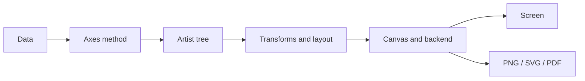

<TLDR>
  <TLDRCell label="what">
    Matplotlib 把数据、坐标系和可见元素组织成一棵对象树，再由后端把它渲染到窗口或文件。
  </TLDRCell>
  <TLDRCell label="when">
    需要精确控制静态图、组合多个坐标区，或在批处理任务中稳定导出 PNG、SVG、PDF 时使用它。
  </TLDRCell>
  <TLDRCell label="how">
    用 `plt.subplots()` 创建 `Figure` 和 `Axes`，通过 `ax` 方法添加图元，最后调用 `fig.savefig()` 并关闭图形。
  </TLDRCell>
</TLDR>

## 是什么，为什么存在

Matplotlib 是 Python 的通用绘图库。它接受数值、日期和类别等数据，把折线、柱形、文字、图例与颜色条组合成图形。它尤其适合静态分析图、报告插图和由脚本批量生成的文件；交互式探索也受支持，但网页原生交互不是它的主要抽象。

画出柱形并不难，更难的是在一张图里明确管理数据坐标、布局、样式和输出。Matplotlib 为这些工作提供了显式对象。快速试验可以只写 `plt.plot(...)`，可复用代码则需要知道对象归谁所有。否则，当前坐标区、全局样式和 GUI 后端等隐式状态会混在一起。

Matplotlib 的抽象足够底层，因此 pandas 和一些统计绘图库可以把它当作渲染基础。代价是它不会替你决定图表语义：轴是否从零开始、颜色是否表达顺序、不同面板能否比较，都仍由作者负责。

这里的示例已经在 Python 3.14.3、Matplotlib 3.11.1 和 NumPy 2.5.2 环境中运行。示例显式选择非交互式 `Agg` 后端，因此在没有显示器的 CI 或服务器上也能得到相同的文本结果。

### 适合与不适合的任务

以下任务与 Matplotlib 的对象模型很合拍：

- 为分析报告生成可重复的 PNG、SVG 或 PDF。
- 在同一 `Figure` 中排列多个 `Axes`，并共享刻度或颜色尺度。
- 精确控制标签、注释、刻度、图例和输出尺寸。
- 把绘图嵌入桌面 GUI、Notebook 或批处理程序。

如果主要需求是浏览器中的工具提示、缩放和筛选，应先确认交互库是否更合适。Matplotlib 可以提供交互后端，也可以嵌入 GUI，但这与生成一个原生 Web 图表不是同一件事。

图表类型的选择也不属于库本身。时间序列通常从折线图开始，类别比较常用柱形图，两个连续变量之间的关系可用散点图。先确定要表达的关系，再选择 API；从一个看起来漂亮的模板反推问题，往往会隐藏数据含义。

## 工作原理

Matplotlib 图形是一棵对象树。最外层的<Term id="matplotlib-figure">图形（Figure）</Term>保存画布大小、布局和一个或多个坐标区；<Term id="matplotlib-axes">坐标区（Axes）</Term>是实际添加数据图形的位置。`Axes` 通常包含 x、y 两个 `Axis` 对象，后者管理刻度、刻度标签和尺度。

折线、矩形、文字、图例和图像都是<Term id="matplotlib-artist">图元（Artist）</Term>。`ax.plot()` 会创建并返回 `Line2D`，`ax.bar()` 返回一组矩形，`ax.scatter()` 返回集合对象。保留这些返回值，之后就能直接更新颜色、数据或可见性，而不必在全局状态里寻找“刚才那条线”。

数据进入 `Axes` 后，坐标变换会把数据坐标映射为显示坐标。布局引擎计算各个坐标区的位置，渲染器再遍历图元树。最终，<Term id="matplotlib-backend">后端（backend）</Term>把结果显示在 GUI、Notebook 中，或写成位图和矢量文件。



这条流水线解释了一个常见误会：调用 `ax.plot()` 时，程序主要是在创建和配置对象，真正的绘制可以推迟到显示或保存时。刻度定位、文本边界和布局也可能到绘制阶段才完整确定。

### `Figure`、`Axes` 与 `Axis`

`Figure` 是整个输出页面，不是“数据图”。它可以有标题、图例、颜色条和多个 `Axes`。`fig.savefig()` 保存这棵对象树的渲染结果，所以比依赖“当前图形”的 `plt.savefig()` 更明确。

`Axes` 名称是复数形式，但它表示单个绘图区。一个 `Axes` 可以有标题、数据范围、图例和多种图元。日常绘图的大多数操作都从 `ax` 开始，例如 `ax.plot()`、`ax.set_xlabel()` 和 `ax.grid()`。

`Axis` 则是 `ax.xaxis` 或 `ax.yaxis` 这样的刻度轴对象。需要自定义 locator、formatter 或刻度细节时才直接操作它。把 `Axes` 与 `Axis` 混淆，常会生成不存在的方法或把标签设置到错误层级。

### 面向对象接口与 `pyplot`

`matplotlib.pyplot` 同时负责创建图形、连接后端和维护“当前图形／当前坐标区”状态。交互式命令行中，这种状态很方便。函数、循环和多面板图中，隐式当前对象会让调用顺序影响结果。

稳妥的组合方式是用 `plt.subplots()` 创建对象，然后只通过 `fig` 与 `ax` 操作它们。`pyplot` 仍负责启动后端和关闭图形，数据绘制与保存则不再依赖当前状态。状态式与显式写法操作的是同一批 Matplotlib 对象。

绘图函数最好接收一个 `Axes`，把创建 `Figure` 的决定留给调用者。这样同一个函数既能画独立图，也能画进仪表板的某个面板，还便于测试它添加了哪些图元。

### 数据范围、尺度与颜色归一化

添加数据图元时，`Axes` 通常会更新数据范围并自动缩放。手动调用 `set_xlim()` 或 `set_ylim()` 会覆盖自动选择，因此必须来自表达意图，而不能只是为了让线条“铺满”画布。尤其对柱形图，截断基线可能夸大差异。

颜色映射分两步完成。<Term id="colormap-normalization">颜色归一化（colormap normalization）</Term>先把数据值映射到通常为 0 到 1 的区间，colormap 再把这个区间映射成 RGBA 颜色。多个面板需要互相比较时，应共享同一个 `Normalize` 和同一根颜色条。

顺序数据适合亮度单调变化的 sequential colormap；围绕有意义中点的偏差适合 diverging colormap；无序类别需要离散颜色。只写一个喜欢的颜色名称并不能保证图例、色盲可读性或跨面板可比性。

### 布局与后端

`layout="constrained"` 会在绘制阶段为轴标签、标题和颜色条分配空间。它能处理许多常见重叠，但不能修复过长文本或塞得太满的图。输出尺寸仍要按最终媒介检查。

后端分成交互式后端和文件后端。交互式后端连接 GUI 事件循环；`Agg` 等非交互式后端可以在无显示环境中写文件。通常让 Matplotlib 自动选择即可，只有部署环境或应用架构明确要求时才应硬编码后端。

输出格式决定后续行为。PNG 是固定像素的位图，DPI 会改变其像素尺寸；SVG 和 PDF 主要保存矢量绘制指令，适合继续缩放，但大量散点可能让文件变大。格式应由分发渠道和图元数量决定。

## 示例

下面四个示例从单一坐标区开始，逐步加入多面板、共享颜色尺度和批量输出。每段代码都写文件而不打开窗口，因此能直接在 CI 中执行。

### 最小但完整的文件输出

第一个例子保留 `Line2D` 返回值，并通过 `Figure` 保存图形。它还会读取生成的 PNG 并检查最终像素尺寸；`savefig()` 调用成功，并不能单独证明尺寸正确。

<Depth level="quick">

```python run title="monthly_signups.py"
from pathlib import Path

import matplotlib

matplotlib.use("Agg")
import matplotlib.pyplot as plt
from PIL import Image

months = ["Jan", "Feb", "Mar", "Apr", "May", "Jun"]
signups = [120, 138, 133, 162, 181, 205]

fig, ax = plt.subplots(figsize=(6.4, 3.6), layout="constrained")
(line,) = ax.plot(months, signups, marker="o", label="New accounts")
ax.set(title="Monthly signups", xlabel="Month", ylabel="Accounts")
ax.grid(axis="y", alpha=0.25)
ax.legend(frameon=False)

output = Path("monthly-signups.png")
fig.savefig(output, dpi=100)
with Image.open(output) as image:
    print(f"saved={output.name} size={image.size[0]}x{image.size[1]}")
print(f"backend={str(matplotlib.get_backend()).lower()}")
print(f"line_points={len(line.get_xdata())}")
plt.close(fig)
```

```text
saved=monthly-signups.png size=640x360
backend=agg
line_points=6
```

</Depth>

`figsize` 的单位是英寸，保存时的 `dpi=100` 把 6.4 × 3.6 英寸转换为 640 × 360 像素。DPI 不会为数据创造更多细节，它只决定位图采样密度和像素尺寸。

保存后显式关闭 `Figure`。单个短脚本退出时操作系统会回收资源，但 Notebook 或批处理循环会持续持有 pyplot 注册的图形；在这些环境中，关闭是所有权协议的一部分。

### 用命名 `Axes` 组织多面板图

`subplot_mosaic()` 返回按名称索引的 `Axes` 字典。与 `axes[1, 0]` 相比，`axes["revenue"]` 能在布局调整后继续表达面板用途。

```python run title="metric_panels.py"
from pathlib import Path

import matplotlib

matplotlib.use("Agg")
import matplotlib.pyplot as plt

months = ["Q1", "Q2", "Q3", "Q4"]
revenue = [84, 91, 97, 110]
orders = [420, 460, 445, 520]

fig, axes = plt.subplot_mosaic(
    [["trend", "trend"], ["revenue", "orders"]],
    figsize=(7.2, 5.0),
    layout="constrained",
)
axes["trend"].plot(months, revenue, marker="o")
axes["trend"].set(title="Revenue trend", ylabel="Revenue ($k)")
bars = axes["revenue"].bar(months, revenue, color="tab:blue")
axes["revenue"].set(title="Revenue", ylabel="$k")
points = axes["orders"].scatter(months, orders, color="tab:orange")
axes["orders"].set(title="Orders", ylabel="Count")

for ax in axes.values():
    ax.grid(axis="y", alpha=0.2)

output = Path("metric-panels.svg")
fig.savefig(output)
print(f"panels={','.join(axes)}")
print(f"lines={len(axes['trend'].lines)} bars={len(bars)} points={len(points.get_offsets())}")
print(f"saved={output.name}")
plt.close(fig)
```

```text
panels=trend,revenue,orders
lines=1 bars=4 points=4
saved=metric-panels.svg
```

同一组季度收入在趋势面板和柱形面板中承担不同任务：前者强调顺序变化，后者强调各季度数值。订单使用独立的 y 轴，因为它与收入单位不同；把两种单位叠到一个未说明的轴上会产生错误比较。

返回的 `bars` 与 `points` 是图元容器。代码可以据此检查数量，也可以在交互应用中更新它们。面板名称、数据单位和图元句柄共同构成一个比“当前图形”更清楚的边界。

### 让多个面板共享颜色尺度

下面两个散点图共享一个 `Normalize(0, 400)`。因此，相同延迟在两个面板中一定得到相同颜色，公共颜色条也只解释一种映射。

```python run title="shared_color_scale.py"
from pathlib import Path

import matplotlib

matplotlib.use("Agg")
import matplotlib.pyplot as plt
from matplotlib.colors import Normalize

x = [1, 2, 3, 4]
throughput = [80, 140, 210, 260]
weekday_latency = [50, 120, 220, 400]
weekend_latency = [80, 160, 260, 320]
norm = Normalize(vmin=0, vmax=400)

fig, (left, right) = plt.subplots(1, 2, figsize=(7.2, 3.2), layout="constrained")
for ax, title, latency in [
    (left, "Weekday", weekday_latency),
    (right, "Weekend", weekend_latency),
]:
    points = ax.scatter(x, throughput, c=latency, cmap="viridis", norm=norm, s=60)
    ax.set(title=title, xlabel="Load", ylabel="Requests/s")

fig.colorbar(points, ax=[left, right], label="Latency (ms)")
output = Path("shared-color-scale.svg")
fig.savefig(output)
values = ",".join(f"{value:.3f}" for value in norm([50, 200, 400]))
print(f"normalized={values}")
print(f"axes={len(fig.axes)} shared_norm={left.collections[0].norm is right.collections[0].norm}")
print(f"saved={output.name}")
plt.close(fig)
```

```text
normalized=0.125,0.500,1.000
axes=3 shared_norm=True
saved=shared-color-scale.svg
```

输出中有三个 `Axes`：两个数据坐标区和颜色条自己的坐标区。`shared_norm=True` 检查两个散点集合引用同一个归一化对象，而不是各自按本面板最小值和最大值拉伸颜色。

示例把 400 毫秒作为明确上界；真实项目应从领域阈值或预先定义的比较范围确定它。若每次根据当前小样本自动选上下界，颜色含义会随输入改变，历史图也难以比较。

### 把绘图变成可复用函数

批量生成图形时，函数应拥有自己创建的 `Figure`，并在所有路径上关闭它。`try`／`finally` 能让保存失败时也执行清理。

```python run title="render_metrics.py"
from pathlib import Path

import matplotlib

matplotlib.use("Agg")
import matplotlib.pyplot as plt


def save_metric_chart(name, values, output):
    fig, ax = plt.subplots(figsize=(5.0, 2.8), layout="constrained")
    try:
        positions = range(len(values))
        ax.bar(positions, values, color="tab:blue")
        ax.set_xticks(positions, [f"Batch {index + 1}" for index in positions])
        ax.set(title=name, ylabel="Seconds", ylim=(0, max(values) * 1.15))
        fig.savefig(output, dpi=120)
        return output
    finally:
        plt.close(fig)


files = [
    save_metric_chart(
        "Import duration",
        [2.4, 2.1, 2.8],
        Path("import-duration.png"),
    ),
    save_metric_chart(
        "Export duration",
        [1.3, 1.1, 1.4],
        Path("export-duration.png"),
    ),
]
print("saved=" + ",".join(path.name for path in files))
print(f"open_figures={plt.get_fignums()}")
```

```text
saved=import-duration.png,export-duration.png
open_figures=[]
```

这个函数用位置和标签一起调用 `set_xticks()`，不会把标签硬套到一个可能变化的自动 locator 上。柱形图从零开始，顶部留出 15% 空间；这里的轴范围表达的是比较持续时间的意图。

`plt.get_fignums()` 为空，证明两个图形都已从 pyplot 的注册表移除。测试不必逐像素比较图片，可以先断言文件存在、图元数量、轴范围、标签和开放图形列表，再为少量关键图使用基准图测试。

## 陷阱

> [!PITFALL]
> 在一个函数里混用 `plt.plot()` 与多个 `ax` 对象，会把图元添加到当时的“当前坐标区”，它未必是读代码时以为的那个面板。

**修复方法：** 创建图形后，用 `ax.plot()`、`ax.set_*()` 与 `fig.savefig()` 完成工作。绘图辅助函数接收 `Axes`；只有交互式临时探索才依赖 pyplot 当前状态。

> [!PITFALL]
> 循环中不断创建 `Figure` 而不关闭，会让 pyplot 注册表和图元树持续保留对象。长时间运行的 Notebook、worker 或报告任务最终会积累内存，Matplotlib 也会发出打开图形过多的警告。

**修复方法：** 谁创建 `Figure`，谁负责在 `finally` 中调用 `plt.close(fig)`。不要用 `plt.close("all")` 掩盖所有权不清，因为它可能关闭同一进程中别的组件仍在使用的图。

> [!PITFALL]
> 每个面板单独自动归一化颜色时，同一种颜色可能表示不同数值。生成代码常为两个 `scatter()` 调用各建一根颜色条，看起来完整，却无法横向比较。

**修复方法：** 比较型面板共享一个 `Normalize`、同一个 colormap 和一根有单位的颜色条。根据领域范围确定 `vmin`、`vmax` 与中点，并测试越界值该裁剪、扩展还是报错。

> [!PITFALL]
> 只调用 `set_xticklabels()` 会把文字附着到当前刻度位置；自动 locator 之后改变刻度时，标签可能错位，并触发 `FixedFormatter` 相关警告。

**修复方法：** 同时设置位置与标签，例如 `ax.set_xticks(positions, labels)`。日期和连续数值轴优先使用对应的 locator 与 formatter，不要把它们降级成手写字符串列表。

> [!PITFALL]
> 为了“放大差异”而截断柱形图基线，会让很小的数值变化看起来巨大；反过来，机械地强制所有图从零开始，也会压扁围绕基准波动的折线。

**修复方法：** 让轴范围服从图表语义。柱长编码绝对大小时通常从零开始；折线关注变化时可以使用窄范围，但必须显示清楚的刻度，并在跨图比较时保持一致尺度。

> [!PITFALL]
> 在服务器代码里硬编码 `TkAgg` 或 `QtAgg`，会引入 GUI 依赖和显示环境要求。反过来，在需要窗口交互的桌面程序里强制 `Agg`，则只会得到文件而没有事件循环。

**修复方法：** 库代码不要全局指定后端。应用入口根据运行环境配置后端；CI 和批处理可在导入 `pyplot` 前选择 `Agg`，桌面应用则使用与其 GUI 框架匹配的后端。

## AI 时代

**生成代码在这里常犯的错**

模型经常把 pyplot 状态式调用与面向对象调用混在同一个多面板函数里，导致标题、图例或颜色条落到错误的 `Axes`。它们还会为每个面板独立选择颜色范围，把 `set_xticklabels()` 用在自动刻度上，或在批量循环里遗漏 `plt.close(fig)`。另一个真实故障是把 Notebook 中的 `%matplotlib` magic 原样放进 `.py` 文件，代码随即出现语法错误。

生成的绘图代码也容易“修饰”数据含义。常见例子包括无要求地截断 y 轴、对类别排序后忘记同步重排数值、静默丢弃 NaN，以及把不同单位画在同一轴上。代码能运行并不能证明图形仍表达输入数据。

**让 AI 检查**

- 列出每个图元所属的 `Figure` 和 `Axes`，并指出所有依赖 pyplot 当前状态的调用。
- 验证每组 x、y、颜色和尺寸数组长度相同，类别排序使用同一索引重排所有关联列。
- 说明轴范围、缺失值、颜色归一化、后端、保存顺序与 `Figure` 关闭策略，并为每项给出可执行断言。

**审查清单**

- 用小型已知数据检查图元数量、数据顺序、轴单位、范围和共享颜色尺度。
- 在无显示环境运行保存路径，确认输出文件非空、尺寸正确，且异常后没有遗留开放图形。
- 把生成图与任务要求逐项对照，检查它是否自行添加了聚合、排序、过滤或视觉夸张。

**提示词词汇**

使用 `Figure`（图形）、`Axes`（坐标区）、`Axis`（刻度轴）、`Artist`（图元）、`object-oriented API`（面向对象 API）、`current Axes state`（当前坐标区状态）、`backend`（后端）、`layout engine`（布局引擎）、`colormap normalization`（颜色归一化）、`shared Normalize`（共享归一化对象）和 `headless rendering`（无显示渲染）。要求模型说明对象所有权与数据到图元的映射；“画得专业一点”不会暴露这些约束。

<Depth level="deep">

## 渲染、变换与输出

### 延迟绘制与图元树

Matplotlib 把高层绘图调用转换为图元并挂到容器上。`Line2D`、`Rectangle`、`Text` 和集合保存绘制所需的属性，`Axes` 与 `Figure` 负责组织它们。后端请求绘制时，渲染器遍历这棵树，而不是重新执行数据分析逻辑。

部分几何信息要在渲染器可用后才能确定。文字边界取决于字体与渲染器，自动刻度取决于最终轴范围，布局又依赖这些边界。如果测试必须读取精确边界，可先调用 `fig.canvas.draw()`，但一般保存操作会自行触发绘制。

保留图元句柄可以进行局部更新。交互程序可以对一条线调用 `set_ydata()`，然后请求画布重绘，而不必清空整个 `Axes`。这种做法要求应用明确管理图形生命周期与事件循环。

### 坐标系统与变换

数据点首先位于数据坐标系中，随后经过轴尺度、限制和 `Axes` 在 `Figure` 中的位置，最终进入显示坐标。文字和注释不一定使用数据坐标；例如，面板角标常适合使用从 0 到 1 的 `ax.transAxes` 坐标。

混合坐标能表达“x 跟随数据、y 固定在轴内某处”这类需求，但也更容易写错。审查注释代码时，要确认 `transform`、`xycoords` 与 `textcoords` 的语义，而不是只看屏幕截图是否暂时对齐。

变换还解释了为什么改变轴范围后图元会移动，而标题仍留在面板顶部。两者属于不同坐标系统。直接写死显示像素通常最脆弱，因为尺寸、DPI 或字体一变就会错位。

### 位图、矢量图与 DPI

PNG 把结果采样成像素。`figsize=(6.4, 3.6)` 配合 `dpi=100` 通常得到 640 × 360 的画布；更高 DPI 会增加像素数和文件工作量，但不会修复低质量数据或不合理布局。

SVG 与 PDF 保存许多图元的矢量描述，线条和文字可以继续缩放。包含几十万个独立标记时，矢量文件可能比位图更重；Matplotlib 也允许在矢量输出里把选定图元栅格化。是否这样做应由实际文件与使用场景决定，不应声称固定的性能收益。

`bbox_inches="tight"` 会根据图元边界裁剪输出，可能改变最终像素尺寸。需要精确画布大小的流水线不应同时假设 tight 裁剪后尺寸仍等于 `figsize × dpi`。应读取生成文件并测试真正的交付契约。

### 后端与进程边界

后端把 `FigureCanvas`、渲染器以及可选的 GUI 事件循环连接起来。交互式后端需要相应工具包，文件后端只负责写出格式。业务逻辑如果依赖某个后端，就应把这项依赖放在应用入口或部署配置中。

`matplotlib.use()` 必须在创建图形之前调用。在已导入 pyplot、已有窗口或事件循环的进程中切换后端，行为会受现有状态限制。服务端 worker 最简单的策略是在进程启动时选定非交互式后端，并让每个请求独立创建、保存和关闭自己的图形。

Matplotlib 的全局 `rcParams` 也跨图形生效。库函数直接修改它们会影响后续调用者；临时样式应放进 `matplotlib.rc_context()` 或 `plt.style.context()`。显式 `Figure` 所有权加上有界样式作用域，能让并发与测试边界更容易推理。

</Depth>

<Checkpoint id="datascience/matplotlib" />

## 延伸阅读

- [Matplotlib：Figure 简介](https://matplotlib.org/stable/users/explain/figure/figure_intro.html)
- [Matplotlib：Axes 简介](https://matplotlib.org/stable/users/explain/axes/axes_intro.html)
- [Matplotlib：后端](https://matplotlib.org/stable/users/explain/figure/backends.html)
- [Matplotlib：选择 colormap](https://matplotlib.org/stable/tutorials/colors/colormaps.html)
- [Matplotlib API：`Figure.savefig`](https://matplotlib.org/stable/api/_as_gen/matplotlib.figure.Figure.savefig.html)
