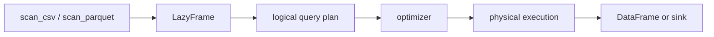

<TLDR>
  <TLDRCell label="what">
    Polars is a DataFrame library for columnar tabular data. It describes transformations with expressions and offers both eager and lazy execution.
  </TLDRCell>
  <TLDRCell label="when">
    Use Polars in Python to read CSV or Parquet, transform typed columns, aggregate, or join data. It is a poor fit when you need pandas index semantics.
  </TLDRCell>
  <TLDRCell label="how">
    Declare the schema and data constraints first, then compose native expressions. Start file pipelines with `scan_*` and call `collect()` or `sink_*` at an explicit boundary.
  </TLDRCell>
</TLDR>

## What it is and why it exists

Polars is a tabular data processing library implemented in Rust with a Python API. Its central <Term id="dataframe">DataFrame</Term> holds materialized data, while a `LazyFrame` holds a query that has not run. Both use the same column expression API, so interactive work and file pipelines do not require two unrelated styles.

Python lists and dictionaries can hold records, but they do not supply one set of rules for column types, grouped aggregation, and relational joins. Polars provides a columnar execution model for those operations and represents a chain of transformations as expressions the engine can inspect. Your code says what to calculate; the executor decides how to schedule work that can run in parallel.

Polars fits structured-data cleaning, feature preparation, log aggregation, and analysis pipelines on one machine. Lazy scans are particularly useful when a CSV or Parquet task reads only some columns and filters rows early, because those requirements remain in the query plan. Polars does not replace a database when the data needs database-managed transactions and constraints.

Polars has no pandas-style row index. Row position and order still exist, but column operations do not automatically align on a hidden set of row labels. This difference matters more than method spelling during a migration: logic that depends on index alignment needs an explicit join or an explicit key check.

The examples here were run with Python 3.14.3 and Polars 1.44.1. They convert output to lists of Python dictionaries so table width and terminal configuration do not alter the display.

## How it works

### Schemas and columns

Every DataFrame has a schema: a mapping from column names to <Term id="dtype">data types (`dtype`)</Term>. Values in one column follow one Polars type, such as `Int64`, `Float64`, `String`, `Boolean`, `Date`, or a nested `List` or `Struct`. Specify the types of important columns when constructing data or reading external files instead of asking a small sample to predict production data.

The schema is also the contract between pipeline stages. Downstream code depends on more than a column name; it depends on the type, null policy, key uniqueness, and unit. `DataFrame.schema` inspects materialized data, while `collect_schema()` on a lazy query lets you inspect the planned columns and types before materializing the result.

Polars stores data by column. Native expressions keep whole-column operations inside the engine; converting rows to Python objects crosses that boundary. Keep a rule as an expression when the expression API can describe it, and consider a Python user-defined function only when the domain logic genuinely cannot be composed.

### Expressions and contexts

`pl.col("amount") * 1.2` is an expression, not an already computed Series. It describes how to derive a result from an input column and gains meaning such as row count and output name only inside a context. Do not read an expression as an eager method call.

The common contexts are listed below. `select()` returns only the selected expressions, `with_columns()` retains existing columns and adds or replaces columns, `filter()` keeps rows selected by a Boolean expression, and `group_by().agg()` reduces rows into results per key.

| Context | Effect on rows and columns | Typical use |
|---|---|---|
| `select()` | Return columns produced by expressions | Select, rename, derive |
| `with_columns()` | Keep existing columns and add or replace | Extend a schema |
| `filter()` | Keep rows whose predicate is `true` | Select records |
| `group_by().agg()` | Produce aggregate results per group | Summaries and group statistics |

Expressions can be composed, named, and reused across contexts. Use `.alias()` to fix an output name, `pl.when().then().otherwise()` for conditional branches, and `.over()` to map aggregate results back to rows in a window. The engine can see these operators, so it can type-check and rewrite the query.

Sibling expressions in one `with_columns()` call all see that call's input schema. One expression cannot read an alias that another sibling has just created. Chain two `with_columns()` calls when there is a dependency, or define one expression object and reuse it in both outputs.

### Eager and lazy execution

The eager API takes a DataFrame and immediately returns materialized results. It suits small tables already in memory and step-by-step inspection. `read_csv()` and `read_parquet()` are eager readers too: the file data has been read when the call returns.

The lazy API uses a <Term id="lazyframe">LazyFrame</Term>. `scan_csv()`, `scan_parquet()`, or `df.lazy()` returns a LazyFrame; later calls build a <Term id="query-plan">query plan</Term>, and `collect()` finally produces a DataFrame. Methods such as `sink_parquet()` write the planned result to a target without returning the complete result as a DataFrame to the caller.



A lazy plan lets the optimizer inspect the whole data flow before execution. <Term id="predicate-pushdown">Predicate pushdown</Term> moves filters toward the source, while <Term id="projection-pushdown">projection pushdown</Term> asks a scan for only the columns required downstream. Both mechanisms depend on keeping the scan node in the plan; an eager read followed by `.lazy()` cannot turn the completed read back into a lazy scan.

`collect()` is an important execution boundary. Hiding it inside a helper makes it hard for callers to see when files are read, memory is committed, or data errors can surface. Reusable transformations usually accept and return a LazyFrame, leaving collection or output to the application layer.

### Nulls, ordering, and joins

Polars treats `null` and floating-point `NaN` as different states. A `null` means a missing value in any type and is recorded in a validity bitmap; `NaN` is a floating-point value. `fill_null()` does not replace `NaN`, and `fill_nan()` does not replace ordinary nulls, so the input contract must say what each state means.

A row whose filter predicate evaluates to `null` is not retained. If an unknown condition must remain in the result, first use `fill_null(True)` or write an explicit branch; do not wait until after filtering to discover missing rows. Test aggregation null behavior with a small input that actually contains nulls.

Grouping and joining are not implicit sort operations. Call `sort()` at the final boundary when output must be stable. When group order must follow first appearance, `maintain_order=True` can express that semantic requirement, but it is not the default guarantee.

Joins also need a cardinality contract. Joining orders to customers is normally many-to-one, so `validate="m:1"` can require unique keys on the right; a duplicate customer key then fails before it silently multiplies rows. Unmatched keys in a left join create nulls in right-side columns, and the pipeline must deliberately retain, fill, isolate, or reject them.

A reviewable Polars pipeline usually follows this sequence:

1. Declare required columns, types, null policy, and key constraints at the input boundary.
2. Build transformations with native expressions so the execution plan remains visible.
3. Call `collect()` or `sink_*` at an application boundary instead of repeatedly materializing intermediates.
4. Check row counts, unmatched keys, schemas, and business totals that should be conserved.

## Examples

The four examples use order and sales data to show eager expressions, a lazy scan, a validated join, and the difference between `null` and `NaN`. Every output comes from the local versions named above.

### 1. Filter and derive columns with expressions

Start with an explicit schema, then compose a filter and a column calculation. `pl.col()` refers to a column, and `&` combines Boolean conditions; keep each comparison clear with parentheses or method calls.

<Depth level="quick">

```python run title="select_orders.py"
import polars as pl

orders = pl.DataFrame(
    {
        "order_id": [1001, 1002, 1003, 1004],
        "region": ["East", "West", "East", "West"],
        "quantity": [2, 1, 4, 3],
        "unit_price": [60.0, 75.5, None, 70.0],
        "paid": [True, False, True, True],
    },
    schema={
        "order_id": pl.Int64,
        "region": pl.String,
        "quantity": pl.Int64,
        "unit_price": pl.Float64,
        "paid": pl.Boolean,
    },
)

ready = (
    orders.filter(pl.col("paid") & pl.col("unit_price").is_not_null())
    .with_columns(
        (pl.col("quantity") * pl.col("unit_price")).alias("revenue")
    )
    .select("order_id", "region", "revenue")
)

print({name: str(dtype) for name, dtype in orders.schema.items()})
print(ready.to_dicts())
```

```text
{'order_id': 'Int64', 'region': 'String', 'quantity': 'Int64', 'unit_price': 'Float64', 'paid': 'Boolean'}
[{'order_id': 1001, 'region': 'East', 'revenue': 120.0}, {'order_id': 1004, 'region': 'West', 'revenue': 210.0}]
```

</Depth>

Order `1003` is paid but has a null unit price, so it does not pass the filter; order `1002` is excluded because it is unpaid. The derived column exists only in `ready`, and the original `orders` schema is unchanged.

The explicit schema settles the integer, floating-point, and Boolean types before transformation begins. A real file pipeline should also validate amount ranges and order-key uniqueness; correct types do not make business data valid.

### 2. Build a lazy plan from Parquet

The example first writes a self-contained Parquet file and then creates a query with `scan_parquet()`. The `query` variable is a LazyFrame; only the final `collect()` materializes the summary.

```python run title="lazy_sales.py"
from pathlib import Path

import polars as pl

sales_path = Path("/tmp/codewiki-run/polars/sales.parquet")
pl.DataFrame(
    {
        "region": ["West", "East", "West", "East"],
        "units": [3, 1, 2, 4],
        "unit_price": [20.0, 15.0, 30.0, 10.0],
        "note": ["rush", "", "gift", ""],
    }
).write_parquet(sales_path)

query = (
    pl.scan_parquet(sales_path)
    .filter(pl.col("units") >= 2)
    .with_columns(
        (pl.col("units") * pl.col("unit_price")).alias("revenue")
    )
    .group_by("region")
    .agg(
        pl.col("revenue").sum(),
        pl.len().alias("orders"),
    )
    .sort("region")
)

print(type(query).__name__)
print(query.collect().to_dicts())
```

```text
LazyFrame
[{'region': 'East', 'revenue': 40.0, 'orders': 1}, {'region': 'West', 'revenue': 120.0, 'orders': 2}]
```

The final result has no `note` column. Because the scan remains part of the plan, the optimizer can derive that the downstream query does not need that column and move the `units >= 2` filter toward the scan. Code should not depend on one physical plan forever, but it can check that the required pushdowns remain present.

The result is sorted by `region` before output, so the example does not depend on default group order. If a later stage consumes a LazyFrame, return `query` directly instead of collecting it for inspection and converting it back to lazy mode.

### 3. Validate join cardinality

The order table may contain a customer more than once, while the customer dimension must contain one row per customer. That is `m:1`; putting the constraint on the join makes a duplicate dimension key fail before it multiplies data.

```python run title="validated_join.py"
import polars as pl

orders = pl.DataFrame(
    {
        "order_id": [1001, 1002, 1003, 1004],
        "customer_id": [7, 8, 7, 99],
        "amount": [120.0, 80.0, 30.0, 50.0],
    }
)
customers = pl.DataFrame(
    {
        "customer_id": [7, 8],
        "segment": ["business", "consumer"],
    }
)

report = (
    orders.join(
        customers,
        on="customer_id",
        how="left",
        validate="m:1",
    )
    .with_columns(pl.col("segment").fill_null("unmatched"))
    .group_by("segment")
    .agg(
        pl.col("amount").sum().alias("revenue"),
        pl.len().alias("orders"),
    )
    .sort("segment")
)

print(report.to_dicts())
```

```text
[{'segment': 'business', 'revenue': 150.0, 'orders': 2}, {'segment': 'consumer', 'revenue': 80.0, 'orders': 1}, {'segment': 'unmatched', 'revenue': 50.0, 'orders': 1}]
```

Customer `99` has no dimension record. The left join keeps that order and names its missing group `unmatched`; if the business rule rejects unknown customers, check that group and raise an error before aggregation.

Revenue is `280.0` both before and after the join. This conservation check does not replace cardinality validation, but together they catch different failures: one restricts the key relationship, while the other detects accidentally lost or duplicated business amounts.

### 4. Handle `null` and `NaN` separately

A floating-point column can contain ordinary nulls and `NaN` at the same time. Count them separately, then convert `NaN` to null before applying one explicit policy to the cleaned column.

```python run title="null_and_nan.py"
import polars as pl

metrics = pl.DataFrame(
    {
        "sensor": ["a", "b", "c", "d"],
        "value": [1.0, None, float("nan"), 4.0],
    }
)

counts = metrics.select(
    pl.col("value").null_count().alias("null_count"),
    pl.col("value").is_nan().fill_null(False).sum().alias("nan_count"),
)
cleaned = metrics.with_columns(
    pl.col("value").fill_nan(None).fill_null(0.0).alias("clean_value")
)

print(counts.to_dicts())
print(cleaned.to_dicts())
```

```text
[{'null_count': 1, 'nan_count': 1}]
[{'sensor': 'a', 'value': 1.0, 'clean_value': 1.0}, {'sensor': 'b', 'value': None, 'clean_value': 0.0}, {'sensor': 'c', 'value': nan, 'clean_value': 0.0}, {'sensor': 'd', 'value': 4.0, 'clean_value': 4.0}]
```

`null_count()` sees only sensor `b`, while `is_nan()` sees only sensor `c`. `fill_nan(None)` first unifies the missing representation, and the following `fill_null(0.0)` then handles both sources.

Changing missing readings to zero is this example's policy, not a universal cleaning rule. Real sensor data may need to preserve the missing value, interpolate it, or reject the batch; the domain constraint decides.

## Pitfalls

> [!PITFALL]
> Calling `read_parquet()` and then `.lazy()` looks like lazy I/O, but the read has already finished and the scan stage is no longer part of the query plan.

**Fix:** Start a file pipeline with `scan_parquet()` or `scan_csv()`. Use `df.lazy()` only when the data is already in memory and you want to compose the remaining operations.

> [!PITFALL]
> One expression creates `revenue` inside `with_columns()`, while a sibling expression tries to read `pl.col("revenue")`. Both expressions see the same input schema, where the new alias does not exist yet.

**Fix:** Chain two `with_columns()` calls to express the dependency, or save the revenue formula as an expression and reuse it in both outputs. Do not switch to a Python user-defined function merely to work around the alias.

> [!PITFALL]
> Calling only `fill_null()` is treated as complete floating-point cleanup. Any `NaN` values remain in the column and may propagate through later calculations.

**Fix:** Define separate policies for `null`, `NaN`, and infinity in the input contract. Build boundary tests with `is_null()`, `is_nan()`, and `is_finite()`, then choose the matching fill or rejection rule.

> [!PITFALL]
> A join states only `on` and `how`, with no key cardinality. If duplicate keys appear on the right, a legal many-to-many join multiplies orders and leaves an aggregate that looks plausible but is wrong.

**Fix:** Name the expected relationship first, then use `validate="1:1"`, `"1:m"`, or `"m:1"`. Count unmatched keys after the join and compare row counts or amount totals that should remain unchanged.

> [!PITFALL]
> The current row order from a group or join is treated as an API contract. A change in thread scheduling, input partitioning, or execution strategy can produce a different order in tests and exports.

**Fix:** Use `maintain_order` only when the business semantics require it, and call `sort()` at the end for deterministic external output. Tests comparing sets should not accidentally turn order into a requirement.

<Depth level="deep">

## What the optimizer can see

A lazy query first forms a logical plan, which the optimizer rewrites before handing it to the physical executor. `LazyFrame.explain(optimized=True)` displays the optimized plan, while `collect_schema()` shows the schema the plan expects to produce. Plan text is diagnostic output that can change between Polars versions; business code should not parse it.

Predicate pushdown concerns rows, while projection pushdown concerns columns. When a query scans Parquet, selects three columns, and filters a date, the plan can carry those requirements back to the scan node. Once code has called `read_parquet()`, the optimizer can work only on the part after the in-memory DataFrame and cannot undo the completed file read.

Native expressions keep operators, input columns, and output types in the plan. A Python function passed to `map_elements()` is opaque to the optimizer, and its return type and exception behavior need an explicit contract. Use it only when Polars expressions cannot state the rule, and pin the contract with `return_dtype` and boundary examples.

Shared subplans need care too. Referring to one LazyFrame more than once reuses a logical description; it does not promise that the result is automatically cached as a DataFrame. Common-subplan elimination depends on the optimizer and the concrete plan. If separate executions need to reuse a materialized result, the application must manage that result explicitly.

## Input schemas are executable contracts

Parquet stores field names and types in file metadata, while CSV contains text with no native column schema. A CSV scan must therefore infer types from inspected records or receive them from the caller. If a later record violates an inferred type, the failure appears when the lazy query executes, not necessarily when the LazyFrame is created.

For fields with known meaning, pass a complete `schema` or targeted `schema_overrides` to `scan_csv()`. Also declare which input spellings represent null and whether dates should be parsed. These options belong at the reader because parsing a value incorrectly and repairing it later can erase the distinction between malformed, missing, and legitimate text.

Schema checks should cover properties that affect later semantics:

| Property | Boundary check | Failure to prevent |
|---|---|---|
| Column names | Required, optional, and unexpected fields | Using the wrong export version |
| Data types | Exact or allowed type family | Numeric and date operations on text |
| Null policy | Allowed columns and input markers | Silent row loss or invented defaults |
| Key rules | Nullability and uniqueness | Unmatched or multiplied joins |

`cast()` is another contract boundary. Its default `strict=True` rejects values that cannot be converted, which is usually appropriate for required fields. `strict=False` converts conversion failures to null; use it only when the pipeline records and handles those failures rather than quietly treating them as ordinary missing data.

After parsing, compare the observed schema with the declared one before expensive transformations. A schema match still does not validate ranges, units, or relationships between columns, so checks such as nonnegative quantity and unique customer IDs remain separate. Types catch representational mistakes; domain rules catch meaningful but invalid values.

### Schema drift across files

A glob scan can combine files produced at different times. One partition may omit a recently added column, change an integer to text, or encode the same null with a different marker. Test the file set as a set instead of assuming that one representative file establishes the contract for every partition.

Decide whether a missing optional column should be inserted, whether extra columns are allowed, and which type changes require a migration. Make those choices visible in reader configuration and validation code. Automatic coercion is convenient only when it matches a documented compatibility rule.

Keep a small fixture for each accepted schema version and one fixture for each rejected change. Run them through the same lazy entry point used in production and force execution, because constructing a LazyFrame alone does not parse every record. This turns schema drift from a late data incident into a boundary test.

## Streaming execution and output

`collect(engine="streaming")` asks the streaming engine to process a query in batches, while methods such as `sink_parquet()` and `sink_csv()` write results to a target. Streaming is a physical execution strategy; it does not change LazyFrame column semantics, join cardinality, or null rules.

The mere use of a streaming engine does not prove that an arbitrary plan fits within limited memory. The state required by sorts, joins, and groups depends on the operators and data distribution. Inspect the execution plan and measure peak memory at the target scale on the target machine; without that measurement, do not promise fixed multipliers or capacities.

Output is another data-contract boundary. Fix column order, data types, sorting, and partitioning before writing, then reload a small result and compare its schema and important totals. A successful return says that the write call completed, not that downstream code will interpret dates, categories, or nulls as intended.

</Depth>

<Checkpoint id="datascience/polars" />

## Further reading

- [Polars User Guide: Expressions and contexts](https://docs.pola.rs/user-guide/concepts/expressions-and-contexts/)
- [Polars User Guide: Lazy API](https://docs.pola.rs/user-guide/concepts/lazy-api/)
- [Polars User Guide: Query optimizations](https://docs.pola.rs/user-guide/lazy/optimizations/)
- [Polars User Guide: Missing data](https://docs.pola.rs/user-guide/expressions/missing-data/)
- [Polars User Guide: Joins](https://docs.pola.rs/user-guide/transformations/joins/)
- [Polars Python API: `LazyFrame.collect`](https://docs.pola.rs/api/python/stable/reference/lazyframe/api/polars.LazyFrame.collect.html)
