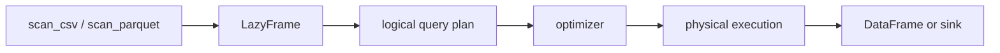

<TLDR>
  <TLDRCell label="what">
    Polars 是面向列式表格数据的 DataFrame 库；它以表达式描述转换，并提供即时执行与惰性执行两套入口。
  </TLDRCell>
  <TLDRCell label="when">
    需要在 Python 中读取 CSV 或 Parquet、转换带类型的列、聚合或连接数据时，可以使用 Polars；需要 pandas 索引语义时则不合适。
  </TLDRCell>
  <TLDRCell label="how">
    先声明模式与数据约束，再组合原生表达式；文件流程用 `scan_*` 构建查询计划，最后在明确的边界调用 `collect()` 或 `sink_*`。
  </TLDRCell>
</TLDR>

## 是什么，为什么存在

Polars 是一个用 Rust 实现、提供 Python API 的表格数据处理库。核心对象 <Term id="dataframe">DataFrame（数据帧）</Term>保存已经物化的数据，`LazyFrame` 则保存尚未执行的查询。两者使用同一套列表达式，因此交互式探索与文件处理流程不必采用两种完全不同的写法。

Python 的列表和字典能保存记录，却没有统一的列类型、分组聚合与关系连接规则。Polars 为这些操作提供列式执行模型，并把一串转换表示成引擎可以检查的表达式。代码说明“算什么”，执行器再决定如何安排可并行的工作。

Polars 适合结构化数据清洗、特征准备、日志汇总和单机分析流程。尤其是从 CSV 或 Parquet 读取部分列、尽早过滤行的任务，惰性扫描能把选择条件保留在查询计划里。数据必须由数据库维护事务和约束时，Polars 不能替代数据库。

Polars 没有 pandas 那样的行索引。行的位置和顺序仍然存在，但列运算不会根据一套隐藏的行标签自动对齐。迁移代码时，这个差异比方法名更重要：依赖索引对齐的逻辑必须改成显式连接或显式键检查。

这里的示例使用 Python 3.14.3 与 Polars 1.44.1 实际运行。输出转换成 Python 字典列表，避免表格显示宽度和终端配置改变排版。

## 工作原理

### 模式与列

每个 DataFrame 都有模式（schema）：列名映射到 <Term id="dtype">数据类型（dtype）</Term>。同一列中的值遵循一种 Polars 类型，例如 `Int64`、`Float64`、`String`、`Boolean`、`Date` 或嵌套的 `List` 与 `Struct`。构造数据或读取外部文件时，关键列应显式指定类型，而不是把生产数据交给小样本推断。

模式也是流程阶段之间的契约。下游代码不仅需要某个列名，还会依赖它的类型、是否允许空值、键是否唯一以及单位含义。`DataFrame.schema` 可以检查已物化数据；对惰性查询调用 `collect_schema()`，可以在物化结果前检查计划得到的列与类型。

Polars 的数据按列组织。对整列执行原生表达式时，运算留在引擎内部；逐行转换成 Python 对象会越过这个边界。表达式能表达的规则应继续用表达式表示，只有领域逻辑确实无法组合出来时才考虑 Python 用户函数。

### 表达式与上下文

`pl.col("amount") * 1.2` 是表达式，不是已经算出的 Series。它描述如何从输入列得到结果，直到被放入某个上下文后才获得行数和输出名称等含义。别把表达式当作一次立即执行的方法调用。

常见上下文如下。`select()` 只返回选中的表达式，`with_columns()` 保留现有列并新增或替换列，`filter()` 按布尔表达式保留行，`group_by().agg()` 则按键把多行归约成每组结果。

| 上下文 | 对行和列的作用 | 常见用途 |
|---|---|---|
| `select()` | 返回表达式生成的列 | 选择、改名、派生列 |
| `with_columns()` | 保留原列并新增或替换列 | 扩充模式 |
| `filter()` | 只保留谓词为 `true` 的行 | 筛选记录 |
| `group_by().agg()` | 每个分组生成聚合结果 | 汇总与组内统计 |

表达式可以组合、命名并在不同上下文中复用。用 `.alias()` 固定输出列名，用 `pl.when().then().otherwise()` 表达条件分支，用 `.over()` 把聚合结果映射回窗口中的各行。引擎能看到这些算子，因而可以进行类型检查和查询改写。

同一次 `with_columns()` 中的多个表达式都以该调用的输入模式为准。一个表达式不能读取旁边另一个表达式刚创建的别名。确有依赖时应串联两次 `with_columns()`，或者先保存并复用同一个表达式对象。

### 即时执行与惰性执行

即时 API 的操作接收 DataFrame，并立即返回物化结果。它适合内存中已有的小表和逐步检查。`read_csv()` 与 `read_parquet()` 也属于即时读取：调用返回时，文件数据已经读入。

惰性 API 使用 <Term id="lazyframe">LazyFrame（惰性数据帧）</Term>。`scan_csv()`、`scan_parquet()` 或 `df.lazy()` 返回 LazyFrame；之后的调用构建 <Term id="query-plan">查询计划（query plan）</Term>，直到 `collect()` 才产生 DataFrame。`sink_parquet()` 等方法则把计划的结果写到目标，而不把完整结果作为 DataFrame 返回给调用者。



惰性计划让优化器在执行前看到完整的数据流。<Term id="predicate-pushdown">谓词下推（predicate pushdown）</Term>把过滤条件移近数据源，<Term id="projection-pushdown">投影下推（projection pushdown）</Term>让扫描只请求后续需要的列。这两个机制依赖扫描节点仍在计划里；先即时读取再调用 `.lazy()`，无法把读取阶段重新变成惰性扫描。

`collect()` 是重要的执行边界。把它藏在辅助函数内部，会让调用方误判何时读取文件、占用内存或抛出数据错误。可复用的转换函数通常接收并返回 LazyFrame，由应用层决定在哪里收集或写出。

### 空值、顺序与连接

Polars 把 `null` 与浮点 `NaN` 视为不同状态。`null` 表示任意类型中缺少值，并由有效性位图记录；`NaN` 是浮点值。`fill_null()` 不会替换 `NaN`，`fill_nan()` 也不会替换普通空值，因此输入契约要说明两者各自的含义。

过滤谓词为 `null` 的行不会被保留。若未知条件需要留在结果中，应先用 `fill_null(True)` 或另写明确分支；不要等过滤后才发现数据少了。聚合函数对空值的处理也应通过一个含空值的小样本确认。

分组和连接不应被当成隐式排序操作。需要稳定输出时，在最终边界明确调用 `sort()`；需要保留分组首次出现的顺序时，可以选择 `maintain_order=True`，并理解这是语义要求，而不是默认保证。

连接还需要基数契约。订单连接客户通常是多对一，可用 `validate="m:1"` 检查右侧键唯一；一旦客户表包含重复键，验证会拒绝静默扩增行数。左连接后的未匹配键会在右侧列产生空值，必须明确保留、填充、隔离还是报错。

一个可审查的 Polars 流程通常遵循以下顺序：

1. 在输入边界声明必需列、类型、空值策略与键约束。
2. 用原生表达式构建转换，保持执行计划可见。
3. 在应用边界调用 `collect()` 或 `sink_*`，不要反复物化中间结果。
4. 检查行数、未匹配键、模式和应守恒的业务总量。

## 示例

下面四个示例使用订单与销售数据，依次展示即时表达式、惰性扫描、经过验证的连接，以及 `null` 与 `NaN` 的区别。所有输出都来自上面注明的本地版本。

### 1. 用表达式筛选并派生列

先用显式模式构造订单表，再组合过滤与列计算。`pl.col()` 引用列，布尔条件使用 `&` 组合；每个比较式都放在清楚的括号或方法调用中。

<Depth level="quick">

```python run title="select_orders.py"
import polars as pl

orders = pl.DataFrame(
    {
        "order_id": [1001, 1002, 1003, 1004],
        "region": ["East", "West", "East", "West"],
        "quantity": [2, 1, 4, 3],
        "unit_price": [60.0, 75.5, None, 70.0],
        "paid": [True, False, True, True],
    },
    schema={
        "order_id": pl.Int64,
        "region": pl.String,
        "quantity": pl.Int64,
        "unit_price": pl.Float64,
        "paid": pl.Boolean,
    },
)

ready = (
    orders.filter(pl.col("paid") & pl.col("unit_price").is_not_null())
    .with_columns(
        (pl.col("quantity") * pl.col("unit_price")).alias("revenue")
    )
    .select("order_id", "region", "revenue")
)

print({name: str(dtype) for name, dtype in orders.schema.items()})
print(ready.to_dicts())
```

```text
{'order_id': 'Int64', 'region': 'String', 'quantity': 'Int64', 'unit_price': 'Float64', 'paid': 'Boolean'}
[{'order_id': 1001, 'region': 'East', 'revenue': 120.0}, {'order_id': 1004, 'region': 'West', 'revenue': 210.0}]
```

</Depth>

订单 `1003` 已付款，但单价为空，所以不会通过过滤；订单 `1002` 则因为未付款被排除。派生列只出现在 `ready` 中，原始 `orders` 的模式没有改变。

显式模式让整数、浮点与布尔列在进入转换前就确定下来。实际文件流程还应验证金额范围和订单键唯一性；类型正确并不等于业务数据有效。

### 2. 从 Parquet 构建惰性计划

示例先生成一个自包含的 Parquet 文件，再用 `scan_parquet()` 创建查询。变量 `query` 是 LazyFrame；只有最后一行的 `collect()` 才物化汇总结果。

```python run title="lazy_sales.py"
from pathlib import Path

import polars as pl

sales_path = Path("/tmp/codewiki-run/polars/sales.parquet")
pl.DataFrame(
    {
        "region": ["West", "East", "West", "East"],
        "units": [3, 1, 2, 4],
        "unit_price": [20.0, 15.0, 30.0, 10.0],
        "note": ["rush", "", "gift", ""],
    }
).write_parquet(sales_path)

query = (
    pl.scan_parquet(sales_path)
    .filter(pl.col("units") >= 2)
    .with_columns(
        (pl.col("units") * pl.col("unit_price")).alias("revenue")
    )
    .group_by("region")
    .agg(
        pl.col("revenue").sum(),
        pl.len().alias("orders"),
    )
    .sort("region")
)

print(type(query).__name__)
print(query.collect().to_dicts())
```

```text
LazyFrame
[{'region': 'East', 'revenue': 40.0, 'orders': 1}, {'region': 'West', 'revenue': 120.0, 'orders': 2}]
```

最终结果没有 `note` 列。由于扫描仍是计划的一部分，优化器可以从下游列依赖中得知不需要该列，并把 `units >= 2` 的过滤移近扫描。代码不应假定具体物理计划永远不变，但可以检查所需的下推是否存在。

结果在输出前按 `region` 排序，所以示例不依赖分组的默认顺序。若后续只消费 LazyFrame，应直接返回 `query`，不要为了查看它而提前收集再转回惰性模式。

### 3. 验证连接基数

订单表允许同一客户出现多次，客户维表则必须每个客户一行。这正是 `m:1`；把约束写进连接后，重复的维表键会在数据扩增前触发错误。

```python run title="validated_join.py"
import polars as pl

orders = pl.DataFrame(
    {
        "order_id": [1001, 1002, 1003, 1004],
        "customer_id": [7, 8, 7, 99],
        "amount": [120.0, 80.0, 30.0, 50.0],
    }
)
customers = pl.DataFrame(
    {
        "customer_id": [7, 8],
        "segment": ["business", "consumer"],
    }
)

report = (
    orders.join(
        customers,
        on="customer_id",
        how="left",
        validate="m:1",
    )
    .with_columns(pl.col("segment").fill_null("unmatched"))
    .group_by("segment")
    .agg(
        pl.col("amount").sum().alias("revenue"),
        pl.len().alias("orders"),
    )
    .sort("segment")
)

print(report.to_dicts())
```

```text
[{'segment': 'business', 'revenue': 150.0, 'orders': 2}, {'segment': 'consumer', 'revenue': 80.0, 'orders': 1}, {'segment': 'unmatched', 'revenue': 50.0, 'orders': 1}]
```

客户 `99` 没有维表记录。左连接保留这笔订单，并把缺失分组明确命名为 `unmatched`；若业务规则要求拒绝未知客户，应在聚合前检查该组并报错。

连接前后的总收入都是 `280.0`。这种守恒检查不能代替基数验证，但两者结合能捕获不同错误：一个限制键关系，另一个检查业务量是否意外丢失或重复。

### 4. 分开处理 `null` 与 `NaN`

浮点列可以同时包含普通空值和 `NaN`。先分别计数，再把 `NaN` 转成空值，才能用一条明确的空值策略得到清洗列。

```python run title="null_and_nan.py"
import polars as pl

metrics = pl.DataFrame(
    {
        "sensor": ["a", "b", "c", "d"],
        "value": [1.0, None, float("nan"), 4.0],
    }
)

counts = metrics.select(
    pl.col("value").null_count().alias("null_count"),
    pl.col("value").is_nan().fill_null(False).sum().alias("nan_count"),
)
cleaned = metrics.with_columns(
    pl.col("value").fill_nan(None).fill_null(0.0).alias("clean_value")
)

print(counts.to_dicts())
print(cleaned.to_dicts())
```

```text
[{'null_count': 1, 'nan_count': 1}]
[{'sensor': 'a', 'value': 1.0, 'clean_value': 1.0}, {'sensor': 'b', 'value': None, 'clean_value': 0.0}, {'sensor': 'c', 'value': nan, 'clean_value': 0.0}, {'sensor': 'd', 'value': 4.0, 'clean_value': 4.0}]
```

`null_count()` 只数到传感器 `b`，`is_nan()` 只数到传感器 `c`。`fill_nan(None)` 先统一缺失表示，后面的 `fill_null(0.0)` 才会处理两种来源。

把缺失读数改成零只是这个示例的策略，不是普遍正确的清洗规则。真实传感器数据可能需要保留缺失、插值或拒绝整批数据，决定应来自领域约束。

## 陷阱

> [!PITFALL]
> 先用 `read_parquet()` 读取，再调用 `.lazy()`，看起来采用了惰性 API，实际读取已经完成，扫描阶段也不再属于查询计划。

**修复方法：** 文件流程从 `scan_parquet()` 或 `scan_csv()` 开始。只有数据原本就在内存中，而且你只是希望组合后续操作时，`df.lazy()` 才表达了真实边界。

> [!PITFALL]
> 在同一次 `with_columns()` 中创建 `revenue`，又让旁边的表达式读取 `pl.col("revenue")`。这些表达式面对的是同一份输入模式，新别名此时还不可见。

**修复方法：** 串联两次 `with_columns()` 来表达依赖顺序，或把收入公式保存为表达式变量并在两个输出中复用。不要仅为绕过别名问题改成 Python 用户函数。

> [!PITFALL]
> 只调用 `fill_null()` 就认为浮点缺失值已经全部处理。`NaN` 仍会留在列中，并可能继续传播到后续计算。

**修复方法：** 在输入契约中分别定义 `null`、`NaN` 与无穷值的策略。使用 `is_null()`、`is_nan()` 和 `is_finite()` 建立边界测试，再选择对应的填充或拒绝规则。

> [!PITFALL]
> 连接只写 `on` 与 `how`，没有声明键基数。右侧意外出现重复键时，合法的多对多连接会扩增订单，并让聚合结果看似正常但数值错误。

**修复方法：** 先命名预期关系，再使用 `validate="1:1"`、`"1:m"` 或 `"m:1"`。连接后统计未匹配键，并比较应保持不变的行数或金额总量。

> [!PITFALL]
> 把分组或连接当前碰巧得到的行序当作 API 契约。线程调度、输入分片或执行策略改变后，测试和导出文件可能出现不同顺序。

**修复方法：** 只有业务语义要求时才用 `maintain_order`，面向外部的确定性结果应在最后显式 `sort()`。测试比较集合时不要无意中把顺序也变成要求。

## AI 时代

**生成代码在这里常犯的错**

生成代码常把 pandas 与 Polars 拼在一起，例如写出布尔索引、`axis=1`、`inplace=True` 或逐行 `apply`。模型也会在 `read_parquet().lazy()` 之后声称获得了扫描下推，在同一次 `with_columns()` 中读取刚创建的别名，或者把 `fill_null()` 当成 `NaN` 清洗。另一些片段仍使用旧式 `collect(streaming=True)`，而当前接口用 `collect(engine="streaming")` 选择流式引擎。

**让 AI 检查**

- 列出每个输入的模式、连接键基数、空值策略，并说明哪些不变量应在 `collect()` 后验证。
- 展示优化后的查询计划，确认文件入口是 `scan_*`，且所需谓词下推与投影下推仍然可见。
- 找出所有 Python 用户函数、同一上下文中的别名依赖，以及没有显式排序却依赖行序的输出。

**审查清单**

- 用含重复键、未匹配键、`null`、`NaN` 和空输入的小数据运行流程。
- 确认 `collect()` 与 `sink_*` 只出现在调用方能够看见的执行边界。
- 比较转换前后的模式、行数和领域总量，不只检查几行示例输出。

**提示词词汇**

使用准确术语：`expression context`（表达式上下文）、`LazyFrame`（惰性数据帧）、`logical query plan`（逻辑查询计划）、`predicate pushdown`（谓词下推）、`projection pushdown`（投影下推）、`join cardinality`（连接基数）、`schema validation`（模式验证）、`streaming engine`（流式引擎）。要求 AI 标出物化边界和数据不变量，比“把这段 pandas 改成更快的 Polars”更容易得到可审查的结果。

<Depth level="deep">

## 优化器能看到什么

惰性查询先形成逻辑计划，再由优化器改写并交给物理执行器。`LazyFrame.explain(optimized=True)` 可以显示优化后的计划，`collect_schema()` 则显示计划预期产生的模式。计划文本是诊断输出，会随 Polars 版本变化，不应被业务代码解析。

谓词下推关注行，投影下推关注列。例如先扫描 Parquet，后续只选择三个列并过滤日期时，计划可以把这些要求带回扫描节点。若代码已经调用 `read_parquet()`，优化器只能处理内存中 DataFrame 之后的部分，无法撤销已经完成的文件读取。

原生表达式把算子、输入列和输出类型留在计划中。`map_elements()` 接收的 Python 函数对优化器是不透明的，返回类型和异常行为也需要调用方说明。只有无法用 Polars 表达式表达规则时才使用它，并用 `return_dtype` 与边界样本固定契约。

共享子计划也需要小心。重复引用同一个 LazyFrame 表示复用一份逻辑描述，不等于把结果自动缓存成 DataFrame。是否消除公共子计划由优化器与具体计划决定；需要跨多次独立执行复用物化结果时，应由应用明确管理该结果。

## 输入模式是可执行契约

Parquet 会在文件元数据中保存字段名与类型，CSV 则只有文本，没有原生列模式。因此，CSV 扫描要么从检查到的记录推断类型，要么由调用方提供类型。后面的记录若违反推断类型，错误会在惰性查询执行时出现，不一定在创建 LazyFrame 时出现。

已知含义的字段应通过完整 `schema` 或有针对性的 `schema_overrides` 传给 `scan_csv()`。还要声明哪些输入写法表示空值，以及是否解析日期。这些选项属于读取边界，因为先把值解析错再修复，可能抹去格式错误、缺失值与合法文本之间的区别。

模式检查应覆盖会影响后续语义的属性：

| 属性 | 边界检查 | 要防止的错误 |
|---|---|---|
| 列名 | 必需、可选与意外字段 | 使用了错误版本的导出文件 |
| 数据类型 | 精确类型或允许的类型族 | 对文本执行数值或日期运算 |
| 空值策略 | 允许空值的列与输入标记 | 静默丢行或编造默认值 |
| 键规则 | 是否可空与是否唯一 | 连接未匹配或扩增 |

`cast()` 也是契约边界。默认的 `strict=True` 会拒绝无法转换的值，通常适合必需字段。`strict=False` 会把转换失败变成空值；只有流程会记录并处理这些失败，而不是悄悄把它们当作普通缺失数据时，才应使用这种方式。

解析后，应在昂贵转换前比较实际模式与声明模式。模式吻合仍不能验证范围、单位或列间关系，所以非负数量、客户 ID 唯一等检查仍要单独执行。类型能捕获表示错误，领域规则则捕获形式正确但含义无效的值。

### 多文件之间的模式漂移

glob 扫描可能组合不同时间生成的文件。某个分区可能缺少新加入的列、把整数改成文本，或用另一种标记表示同一个空值。测试时要把文件集当成整体，不能假定一个代表文件就能确定所有分区的契约。

应明确决定：缺失的可选列是否补入，额外列是否允许，哪些类型变化必须迁移。把这些决定写进读取配置和验证代码。只有自动类型转换符合记录在案的兼容规则时，它才真正方便。

为每个接受的模式版本保存一个小型夹具，也为每种拒绝的变化保存夹具。让它们经过生产环境使用的同一个惰性入口，并强制执行查询，因为只创建 LazyFrame 不会解析每条记录。这样，模式漂移会在边界测试中暴露，而不是拖到数据事故发生时才发现。

## 流式执行与输出

`collect(engine="streaming")` 请求流式引擎按批次处理查询，`sink_parquet()`、`sink_csv()` 等方法把结果直接写到目标。流式执行是物理策略，不会改变 LazyFrame 的列语义、连接基数或空值规则。

不能仅凭“使用了流式引擎”断言任意计划都适合有限内存。排序、连接和分组的状态需求取决于算子与数据分布。检查执行计划，并在目标规模与目标机器上测量峰值内存；没有测量就不要写出固定倍数或容量承诺。

输出也是数据契约边界。写文件前固定列顺序、数据类型、排序与分区策略，写完后重新读取一个小结果并核对模式和关键总量。成功返回只说明写入调用完成，不说明下游会按预期解释日期、分类或空值。

</Depth>

<Checkpoint id="datascience/polars" />

## 延伸阅读

- [Polars 用户指南：表达式与上下文](https://docs.pola.rs/user-guide/concepts/expressions-and-contexts/)
- [Polars 用户指南：惰性 API](https://docs.pola.rs/user-guide/concepts/lazy-api/)
- [Polars 用户指南：查询优化](https://docs.pola.rs/user-guide/lazy/optimizations/)
- [Polars 用户指南：缺失数据](https://docs.pola.rs/user-guide/expressions/missing-data/)
- [Polars 用户指南：连接](https://docs.pola.rs/user-guide/transformations/joins/)
- [Polars Python API：`LazyFrame.collect`](https://docs.pola.rs/api/python/stable/reference/lazyframe/api/polars.LazyFrame.collect.html)
