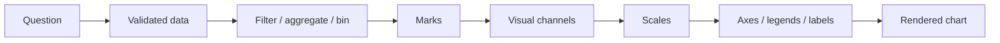

<TLDR>
  <TLDRCell label="what">
    Data visualization maps fields to visual channels such as position, length, and color so comparisons, trends, distributions, and relationships become visible.
  </TLDRCell>
  <TLDRCell label="trap">
    Plotting code can run while mismatching labels and values, connecting across missing observations, or using inconsistent scales that imply a false conclusion.
  </TLDRCell>
  <TLDRCell label="fix">
    Define the analytical question, data grain, and scale contract before choosing a chart; test the mapping with boundary data and inspect the real artifact at delivery size.
  </TLDRCell>
</TLDR>

## What it is and why it exists

<Term id="data-visualization">Data visualization</Term> is a mapping from data to graphics. Records become marks such as points, lines, and rectangles, while position, length, color, or shape represents fields. A chart earns its place by helping a reader make a specific comparison or judgment, not by decorating a report.

A table preserves exact values but makes an overall shape hard to see quickly. A graphic delegates repeated numeric comparisons to the visual system, exposing trends, outliers, clusters, and differences in magnitude. The trade-off is that a mapping discards detail and can amplify assumptions its author did not notice.

You encounter visualization in exploratory analysis, experiment results, operational reports, model diagnostics, and monitoring dashboards. The same data may need two views: an analyst uses a dense graphic to find anomalies, while a decision-maker needs a concise comparison with context. Different audiences and decisions require different charts.

Data visualization is not a synonym for a Python library. Matplotlib, Seaborn, and browser charting libraries construct and render graphics, but they do not decide whether an aggregation is valid, an axis is honest, or missing data is concealed. This topic covers those tool-independent choices; see the related topic for Matplotlib objects and file output.

### Start with the question

Before plotting, write a testable sentence such as “How much does quarterly profit differ by region?” or “Does the latency distribution have a long tail?” “Look at this data” names no relationship, so a model or person will often reach for a familiar template. The verb in a good question usually points toward comparison, trend, distribution, or relationship.

Write down the data contract too. Confirm at least these four things:

- What one row represents, including duplicate entities or timestamps.
- The numeric units, time window, and denominator.
- How missing, infinite, censored, and below-detection-limit values are represented.
- Whether the chart serves exploration, a static report, or an interactive interface, and its final display size.

The data grain determines whether one mark represents an observation, a daily total, or a group mean. Without an explicit grain, duplicate keys may silently overlap and automatic aggregation may hide sample-size differences. Validate record counts and unique keys before deciding how to encode them.

### The relationship determines the chart

Choose a chart first by the relationship the reader must compare, not by the number of fields. These are reliable starting points, not mechanical rules:

- To compare a number across categories, use position-aligned bars or dots and give categories a stable order.
- For change over continuous time, use a line and break it where observations are missing instead of implying a path through the gap.
- For the shape of one numeric variable, use a histogram, empirical distribution, or box plot and disclose binning or summary rules.
- For the relationship between two numeric variables, use a scatter plot; consider two-dimensional bins or density when overlap becomes severe.
- For composition, start with stacked bars; use ordinary bars or dots when accurate comparison between parts matters more.

Pie, radar, and three-dimensional charts are not universally wrong, but they often turn a length comparison into a judgment of angle, area, or perspective. Use that trade-off only when it serves a concrete task. Familiarity alone does not justify sacrificing comparability.

## How it works

A chart can be decomposed into data, transformations, marks, channels, scales, and guides. Data supplies fields; transformations filter, aggregate, or bin; marks create geometry; channels encode fields as visible properties; scales map a domain into screen ranges; axes, legends, and labels let the reader reverse that mapping.



That pipeline is also the order in which to review a chart. When a rendering looks wrong, do not begin by tuning colors and margins; return to the question and data, then inspect each transformation and mapping. Styling downstream cannot repair a semantic error upstream.

### Marks and visual channels

<Term id="visual-encoding">Visual encoding</Term> is the rule that maps field values to graphical properties. Points, lines, rectangles, and areas are common marks; a <Term id="visual-channel">visual channel</Term> can be x or y position, length, size, color, shape, or opacity. One mark can carry several channels, but every added channel makes decoding harder.

Position and length generally suit accurate numeric comparisons because readers can align them on a common scale. Area and color lightness can convey approximate magnitude, but they are poor choices when exact reading matters. Shape and discrete hue suit a small number of unordered categories; they should not substitute for a continuous quantity.

A channel must match field semantics. Unordered categories should not use a gradient that implies rank; a continuous value should not be split into arbitrary pseudo-categories with random hues. Size encoding should scale area, not radius, to the quantity, or circles will exaggerate differences.

### Chart selection table

| Relationship | Data shape | Common starting point | Checks |
|---|---|---|---|
| Comparison | Category + number | Bar, dot plot | Order, zero baseline, units |
| Trend | Time + number | Line | Interval, missing values, time zone |
| Distribution | One numeric field | Histogram, box plot | Bins, sample size, outliers |
| Relationship | Two numeric fields | Scatter | Overplotting, scales, confounders |
| Composition | Category + total | Stacked bar | Denominator, sum, category order |

“Starting point” deliberately leaves room for judgment. Time can use dots, and categories may need a distribution plot. Departing from the table is reasonable when you can name the reader's task, the encoding choice, and the information you gave up.

### Scales and baselines

A scale maps a data domain to a visible range. A linear scale preserves equal differences; consider a logarithmic scale only when ratios matter more and every value belongs to its domain. Axis titles must state units, and any standardization, percentage conversion, or indexing must be visible too.

Bar length begins at a baseline, so truncating zero directly changes length ratios. Lines primarily encode position and slope and need not always start at zero, but narrowing the range changes perceived variation; show complete ticks and never hide an axis break. If a break is necessary, mark it clearly and consider whether adjacent small multiples are easier to interpret.

Comparisons across panels require shared scales. Allowing each panel to infer its own minimum and maximum makes equal heights or colors represent different values. A shared domain sacrifices local detail but preserves global comparability; when both matter, provide an overview and a separate local view.

### Color and accessibility

Color mapping usually has two steps: <Term id="colormap-normalization">colormap normalization</Term> maps domain values into a fixed interval, then a colormap maps positions in that interval to colors. Use a lightness-ordered sequential palette for continuous amounts, a diverging palette for deviation around a meaningful midpoint, and distinct discrete colors for unordered categories.

Color cannot be the only way to communicate status or category. Add direct labels, line styles, shapes, or patterns to important series, then inspect the result in grayscale and under common color-vision differences. Text and background also need adequate contrast; a “colorblind-safe” palette does not automatically make small labels readable.

A legend explains a mapping; it is not decoration. Its order should follow the spatial or data order in the plot, and labels should use domain names rather than abbreviated column names. When there are few series and room permits, labeling marks directly often removes unnecessary lookup.

### Transformations and uncertainty

Filtering, aggregation, sorting, and binning change what the reader sees. Treat these operations as part of the chart and retain their parameters in code and annotations. In particular, do not write only “average”: the grouping, weighting, and number of omitted records may change the conclusion.

Error bars also need a definition. Standard deviation describes variation in observations, standard error describes uncertainty in an estimated mean, and a confidence interval depends on its method and assumptions. Their shapes may look alike, but their meanings differ; a label that says only “error” is not interpretable.

When sample sizes differ, identical summary marks can imply equal reliability. Label each group with `n`, show raw points, or provide a distribution summary. If privacy or density prevents raw-point display, state aggregation thresholds and suppression rules.

## Examples

These examples express semantic decisions as ordinary Python data structures for a rendering library to consume later. That lets you test the question, ordering, missingness, and scales before dealing with pixels. Every output shown here was produced locally with Python 3.14.3.

### Choose a starting point from the relationship

The first example makes the analytical relationship and field types a small contract. An unknown combination asks for a clearer question instead of guessing an attractive chart.

<Depth level="quick">

```python run title="choose_chart.py"
from dataclasses import dataclass


@dataclass(frozen=True)
class Question:
    relationship: str
    fields: tuple[str, ...]


def choose_chart(question: Question) -> str:
    match question.relationship, question.fields:
        case "comparison", ("category", "number"):
            return "ordered bar"
        case "trend", ("time", "number"):
            return "line with explicit gaps"
        case "distribution", ("number",):
            return "histogram"
        case "relationship", ("number", "number"):
            return "scatter"
        case _:
            return "clarify the analytical question"


questions = [
    Question("comparison", ("category", "number")),
    Question("trend", ("time", "number")),
    Question("distribution", ("number",)),
    Question("relationship", ("number", "number")),
]

for question in questions:
    print(f"{question.relationship}: {choose_chart(question)}")
```

```text
comparison: ordered bar
trend: line with explicit gaps
distribution: histogram
relationship: scatter
```

</Depth>

The mapping supplies starting points rather than final decisions. Comparing distributions, for example, may need faceted histograms or box plots instead of a single histogram. The important behavior is that an unrecognized relationship fails visibly rather than silently falling back to an arbitrary default.

### Keep labels and values paired while sorting

Category comparisons often benefit from sorting, but labels and values must move as one record. This example also validates empty input, duplicate labels, and non-finite values, then makes the numeric domain include the zero baseline.

```python run title="prepare_bars.py"
from dataclasses import dataclass
from math import isfinite


@dataclass(frozen=True)
class Bar:
    region: str
    profit_millions: float


def prepare_bars(rows: list[Bar]) -> tuple[list[Bar], tuple[float, float]]:
    if not rows:
        raise ValueError("at least one row is required")
    if len({row.region for row in rows}) != len(rows):
        raise ValueError("region labels must be unique")
    if not all(isfinite(row.profit_millions) for row in rows):
        raise ValueError("values must be finite")

    ordered = sorted(rows, key=lambda row: row.profit_millions, reverse=True)
    values = [row.profit_millions for row in ordered]
    domain = (min(0.0, min(values)), max(0.0, max(values)))
    return ordered, domain


rows = [
    Bar("North", 8.1),
    Bar("West", -2.5),
    Bar("South", 5.4),
    Bar("East", 14.2),
]
ordered, domain = prepare_bars(rows)
print("order:", [row.region for row in ordered])
print("values:", [row.profit_millions for row in ordered])
print("domain:", domain, "baseline: 0.0")
```

```text
order: ['East', 'North', 'South', 'West']
values: [14.2, 8.1, 5.4, -2.5]
domain: (-2.5, 14.2) baseline: 0.0
```

The sorted regions and profits still correspond row by row. Because profit contains a negative value, the domain extends from `-2.5` to `14.2`, with zero in between. A renderer should extend positive and negative bars in opposite directions from that one baseline.

No visual padding is added here. A renderer can add it later, but the data domain and display domain should have different names so padding logic cannot change the baseline accidentally. A test should assert that the final scale still contains zero.

### Break a line at a missing observation

Dropping a missing row and connecting the remaining points draws a path through a date with no observation. This preprocessing splits observations into contiguous segments and retains the missing date separately.

```python run title="break_missing_lines.py"
from collections.abc import Iterable


Point = tuple[str, float | None]


def contiguous_segments(points: Iterable[Point]) -> list[list[tuple[str, float]]]:
    segments: list[list[tuple[str, float]]] = []
    current: list[tuple[str, float]] = []

    for day, value in points:
        if value is None:
            if current:
                segments.append(current)
                current = []
            continue
        current.append((day, value))

    if current:
        segments.append(current)
    return segments


observations = [
    ("2026-08-01", 18.2),
    ("2026-08-02", 18.7),
    ("2026-08-03", None),
    ("2026-08-04", 21.1),
    ("2026-08-05", 20.6),
]

for index, segment in enumerate(contiguous_segments(observations), start=1):
    print(f"segment {index}: {segment[0][0]} -> {segment[-1][0]} ({len(segment)} points)")
print("missing:", [day for day, value in observations if value is None])
```

```text
segment 1: 2026-08-01 -> 2026-08-02 (2 points)
segment 2: 2026-08-04 -> 2026-08-05 (2 points)
missing: ['2026-08-03']
```

Neither segment crosses `2026-08-03`. A real system should also distinguish “not collected,” “not applicable,” and “collection failed,” because those states may need different marks. Converting all three to zero creates an observation that did not happen.

The function assumes time-sorted input. A production boundary should parse timestamps, validate uniqueness, and sort explicitly; otherwise duplicate or out-of-order values can produce a plausible line with the wrong sequence.

### Share a color domain across panels

If two panels autoscale independently, the same value of `32` may receive different colors. This example derives one domain from all comparable data, then calculates consistent normalized positions.

```python run title="shared_color_scale.py"
from math import isfinite


def normalize(value: float, low: float, high: float) -> float:
    if not all(isfinite(number) for number in (value, low, high)):
        raise ValueError("scale values must be finite")
    if low >= high:
        raise ValueError("scale requires low < high")
    return (value - low) / (high - low)


panels = {
    "control": [18.0, 25.0, 32.0],
    "candidate": [22.0, 32.0, 40.0],
}
all_values = [value for values in panels.values() for value in values]
shared_domain = (min(all_values), max(all_values))

print(f"shared domain: {shared_domain[0]:.0f}..{shared_domain[1]:.0f}")
for panel, values in panels.items():
    encoded = ", ".join(
        f"{value:.0f}->{normalize(value, *shared_domain):.2f}"
        for value in values
    )
    print(f"{panel}: {encoded}")
```

```text
shared domain: 18..40
control: 18->0.00, 25->0.32, 32->0.64
candidate: 22->0.18, 32->0.64, 40->1.00
```

The value `32` maps to `0.64` in both panels. A renderer should give them the same colormap and a shared colorbar with units. When business rules supply thresholds, prefer a fixed domain so each batch cannot redefine what a color means.

When every value is equal, `low >= high` fails explicitly. The caller can supply a domain for constant data or use one color and label the value directly, but it should not allow a division-by-zero result to enter the chart silently.

## Pitfalls

> [!PITFALL]
> Sorting labels and values separately breaks record identity. The bars still look orderly, but one category can be displayed with another category's value.
>
> **Fix:** Sort complete records or their indices, and verify the first and last marks with unique categories and a hand-checkable example.

> [!PITFALL]
> Autoscaling can make every small multiple fill its panel while equal heights or colors represent different values.
>
> **Fix:** Share numeric domains, ticks, and color normalization across comparable panels; label any separate local view with its range.

> [!PITFALL]
> Connecting a line after dropping `None` or `NaN` implies continuous observations across the missing interval; replacing missing values with zero invents a plunge.
>
> **Fix:** Preserve missing states and break segments. Interpolate only when domain rules justify it, and state the method and interval.

> [!PITFALL]
> Red and green alone make success and failure indistinguishable for some readers and lose meaning in grayscale output.
>
> **Fix:** Add text labels, shapes, line styles, or patterns, then inspect the artifact at final size, in grayscale, and through its keyboard path.

> [!PITFALL]
> A mean bar without sample size or variation presents a sparse, unstable group as if it were as certain as a large sample.
>
> **Fix:** Label `n`; show raw points, a distribution, or a defined uncertainty interval appropriate to the task; and disclose the aggregation rule.

<Depth level="deep">

## What the picture cannot recover

A chart is a lossy representation. Filtered records, within-group variation before aggregation, precise positions before binning, and clipped extremes cannot be recovered from the final pixels. A reliable pipeline therefore stores the chart specification, transformation parameters, and data version outside the artifact.

### Aggregation changes the estimand

A per-user average and a per-request average answer different questions. The former gives every user equal weight, while the latter gives more weight to users making more requests. Either calculation can be valid, but an axis labeled only “average latency” does not identify the estimand.

Averaging after aggregation can also produce an unweighted mean of group means. When group sizes differ, it generally differs from the mean over all records. While reviewing generated code, write the numerator, denominator, and weights explicitly, then check them by hand with two unequal groups.

Time aggregation also depends on window boundaries, time zone, and the policy for late-arriving data. A daily series can assign observations to different dates in UTC and the business's local zone. Two versions must share these rules or an apparent change may only be a change in buckets.

### Binning creates boundaries

A histogram maps continuous values into discrete intervals. Bins that are too wide can hide modes or gaps; bins that are too narrow can make random variation look structural. Do not claim a shape unless it remains visible across reasonable bin widths or a domain threshold supports the boundary.

Bin boundaries also decide where a value exactly on an edge belongs. Tools may use left-closed, right-closed, or special last-bin rules. For reproducibility, store the complete boundary array rather than only “20 bins.”

Two-dimensional bins and density plots can reduce scatter-plot overlap while further hiding individual records. The colorbar must say whether it represents a count, proportion, or transformed density. If the color scale is logarithmic, explain how zero counts are handled.

### Scales determine visible differences

A linear scale preserves ratios of differences; a logarithmic scale preserves ratios of values. A growth process on a log axis may make relative rates easier to compare, but readers can no longer interpret equal screen distances as equal absolute differences. Titles, ticks, and annotations must make the transformation visible.

Dual y-axes overlay two independent scales, making it possible to create almost any visual correlation by changing their ranges. Prefer vertically aligned panels with a shared x-axis, indexed values on one scale, or the business-relevant difference. If dual axes are unavoidable, fix the domains and color each axis unambiguously.

Clipping extreme values can clarify the main body, but it must leave evidence. Use overflow marks, a separate panel, or a textual count of records outside the range. Silent deletion changes both distribution shape and sample size.

### Uncertainty is not a decorative band

A band can represent an observation range, an interquartile range, a model prediction interval, or a confidence interval for a mean. Those answer different questions. The legend should name the interval, level, and calculation unit—for example, resampling by user—instead of saying only “95%.”

Repeated measures and time-correlated observations cannot automatically be treated as independent samples. Generated code often calls a default confidence-interval API without checking the sampling unit. When inferential methods fall outside the topic, at least show the raw distribution and sample size and avoid an unverified interval.

When error bars are obscured or extend beyond the plotting area, transparency is not the first fix. Confirm that bounds and point estimates use the same unit and transformation, then choose the axis range. Symmetric data errors usually do not remain visually symmetric on a logarithmic axis.

### The final artifact is the interface

A large notebook chart can develop overlapping ticks and direct labels when reduced to a report column. Interactive tooltips may disappear in static export, a screen reader, or print. Acceptance should inspect the final PNG, SVG, PDF, or web state, not merely observe that the plotting function returned without an exception.

Accessible alternative content states the chart's purpose and main conclusion and provides a data table or download route for precise reading. Alt text need not recite every point, but “line chart” is insufficient. Interactive charts also need keyboard access, visible focus, and status changes that do not depend only on color.

Reproducibility requires the chart transformation and analysis to consume the same data snapshot. If a report query and numeric summary run separately, late data can make the number in the title disagree with the graphic. Build one validated intermediate table and let both the summary and chart consume it.

</Depth>

<Checkpoint id="datascience/visualization" />

## Further reading

- [Vega-Lite: Encoding](https://vega.github.io/vega-lite/docs/encoding.html)
- [Vega-Lite: Marks](https://vega.github.io/vega-lite/docs/mark.html)
- [Matplotlib: Choosing colormaps](https://matplotlib.org/stable/users/explain/colors/colormaps.html)
- [Matplotlib: Broken-axis example](https://matplotlib.org/stable/gallery/subplots_axes_and_figures/broken_axis.html)
- [WCAG 2.2: Use of color](https://www.w3.org/WAI/WCAG22/Understanding/use-of-color.html)
