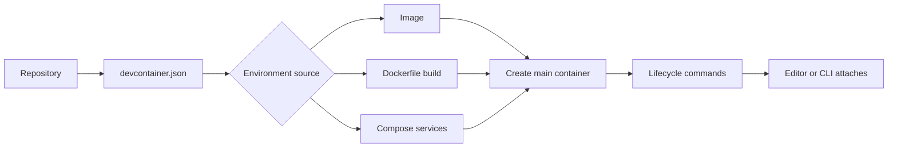

<TLDR>
  <TLDRCell label="what">
    A Dev Container is a container plus development metadata: the image, tools, user, mounts, ports, and setup commands can travel with the code.
  </TLDRCell>
  <TLDRCell label="when">
    Use one when a team needs a shared toolchain, faster environment setup, or the same environment definition in local development and CI.
  </TLDRCell>
  <TLDRCell label="how">
    Commit `.devcontainer/devcontainer.json`, pin external inputs, run as a non-root user, and build and test the environment in CI.
  </TLDRCell>
</TLDR>

## What it is and why it exists

A <Term id="dev-container">Dev Container</Term> is a container environment for developing an
application. It is not necessarily the package you deploy. It adds development metadata to a
container image or Docker Compose project: how an editor connects, where the workspace lives,
which ports to forward, and which commands to run after creation.

It fixes a problem of scattered environment definitions. With only a `README`, installation steps
diverge by operating system, execution order, and date. Once the definition lives in the repository,
a tool can create a local environment, cloud workspace, or CI job from the same declaration.
That reduces variation; it does not make builds byte-identical when tags, Features, registries, and hosts can change.

You meet Dev Containers when a project needs a particular runtime, system package, database, or set
of editor extensions. If a mature version manager is enough, the container's build, disk, and
permission costs may not pay off. Hardware devices, desktop applications, and complex corporate
networks also require you to check what the implementing tool can pass through from the host.

## How it works

The specification normally reads `.devcontainer/devcontainer.json` under the repository root; it
also accepts `.devcontainer.json` at the root. The configuration chooses a base: refer to an
`image`, point `build` at a Dockerfile, or select services with `dockerComposeFile`. All three
describe a development environment. The Compose form also uses `service` to name the main service
to which the editor and lifecycle commands connect.



The creating tool parses the file, substitutes variables such as `${localEnv:...}`, and combines
repository settings with image metadata and metadata from each
<Term id="dev-container-feature">Dev Container Feature</Term>. A Feature is a reusable installation
unit, commonly a `devcontainer-feature.json` plus an installation script. It executes code while
the image is built, so review its source and version as you would any build dependency.

After an environment is created for the first time, commands inside the container run in this order:
`onCreateCommand`, `updateContentCommand`, then `postCreateCommand`. Resuming an existing container
runs `postStartCommand`; every successful tool attachment runs `postAttachCommand`.
`initializeCommand` is different: it runs where the source is located on the host and may run more
than once in one session.

These properties are <Term id="lifecycle-command">lifecycle commands</Term>. A string value runs
through `/bin/sh`; an array invokes the program directly without a shell. Members of an object value
run in parallel, and every member must succeed. A failure in one lifecycle stage prevents later
stages from running.

`containerUser` selects the user for all operations in the container. The
<Term id="remote-user">remote user</Term>, selected by `remoteUser`, runs lifecycle scripts and the
processes launched by an editor or supporting tool. If `remoteUser` is absent, it defaults to the
container user. Keeping the two separate lets an entrypoint use one identity while ordinary
development processes use another.

`containerEnv` enters the container environment at creation time and is visible to its entrypoint.
`remoteEnv` is added to remote processes by the supporting tool and can change during the
container's lifetime. `workspaceMount` determines how the source enters the container, while
`workspaceFolder` selects the working directory for remote processes. `forwardPorts` asks the tool
to forward container ports to the user; it is not a Docker port-publishing rule.

Dev Containers keep Docker's boundaries. A bind mount still exposes a host path. Mounting the
Docker socket usually gives the container control of the host's Docker engine, while `privileged`
and extra capabilities expand access further. A Dev Container is primarily environment management,
not a security sandbox for untrusted code.

## Examples

### Start with one image

This configuration selects a Node 24 image and uses its `node` account for both container operations
and remote tools. The array form of `postCreateCommand` bypasses the shell. The port attribute only
tells a supporting tool what to do with port `3000`. Because the configuration is committed,
changes to environment permissions and setup behavior appear in code review.

<Depth level="quick">

```jsonc title=".devcontainer/devcontainer.json"
{
  "name": "node-api",
  "image": "node:24-bookworm-slim",
  "containerUser": "node",
  "remoteUser": "node",
  "containerEnv": {
    "NODE_ENV": "development"
  },
  "forwardPorts": [3000],
  "portsAttributes": {
    "3000": {
      "label": "API",
      "onAutoForward": "notify"
    }
  },
  "postCreateCommand": ["node", ".devcontainer/setup.mjs"]
}
```

```javascript run title="inspect-config.mjs"
import { readFile } from "node:fs/promises";

const source = await readFile(".devcontainer/devcontainer.json", "utf8");
const config = JSON.parse(source);

console.log(`image=${config.image}`);
console.log(`users=${config.containerUser}/${config.remoteUser}`);
console.log(`ports=${config.forwardPorts.join(",")}`);
```

```text
image=node:24-bookworm-slim
users=node/node
ports=3000
```

</Depth>

The inspection script reads the committed configuration rather than a separately maintained
description. It proves that the JSON parses and exposes a few important fields. A publication gate
should still run `devcontainer build` or `devcontainer up`; only a real build resolves the combined
image, Feature, user, and mount behavior.

### Fail fast during creation

The first configuration calls this creation script. It checks the runtime before project setup;
the example prints a short marker instead of installing anything, so it stays self-contained.
A real Node project would run `npm ci` after the check and commit its `package-lock.json`.

```javascript run title=".devcontainer/setup.mjs"
const expectedMajor = 24;
const actualMajor = Number(process.versions.node.split(".")[0]);

if (actualMajor !== expectedMajor) {
  throw new Error(`expected Node ${expectedMajor}, got ${process.version}`);
}

console.log(`runtime=${process.version}`);
console.log("setup=ready");
```

```text
runtime=v24.14.0
setup=ready
```

A failure stops later lifecycle stages instead of being hidden behind `|| true`. Keeping the setup
in a source file is easier to test and review than extending one shell string indefinitely.
If the tool must wait for setup before attaching, set `waitFor: "postCreateCommand"` explicitly.
The default wait point is `updateContentCommand`, so attachment need not wait for `postCreateCommand`.

### Add a database with Compose

A multi-service environment puts the development container and database in one Compose project.
`app` reaches PostgreSQL as `db:5432`; the database has no `ports`, so this does not publish it to
the host. The health check makes `depends_on` wait until the database accepts connections rather
than only until its container process starts.

```yaml title=".devcontainer/compose.yaml"
services:
  app:
    image: node:24-bookworm-slim
    user: node
    command: sleep infinity
    volumes:
      - ..:/workspace
    depends_on:
      db:
        condition: service_healthy

  db:
    image: postgres:17-alpine
    environment:
      POSTGRES_DB: app
      POSTGRES_USER: app
      POSTGRES_PASSWORD: local-only
    healthcheck:
      test: ["CMD-SHELL", "pg_isready -U app -d app"]
      interval: 2s
      timeout: 2s
      retries: 10
    volumes:
      - postgres-data:/var/lib/postgresql/data

volumes:
  postgres-data:
```

```jsonc title=".devcontainer/devcontainer.json"
{
  "name": "node-with-postgres",
  "dockerComposeFile": "compose.yaml",
  "service": "app",
  "workspaceFolder": "/workspace",
  "remoteUser": "node",
  "shutdownAction": "stopCompose",
  "forwardPorts": [3000]
}
```

```bash title="validate-compose.sh"
docker compose -f .devcontainer/compose.yaml config --quiet
docker compose -f .devcontainer/compose.yaml config --services
```

```text
db
app
```

`docker compose config --quiet` validates and resolves the Compose file; the second command lists
services in dependency order. That does not prove the database can start. CI must create the
environment and make a real connection from `app`. The sample password belongs only to a disposable
local database; production credentials must not enter this configuration.

## Pitfalls

> [!PITFALL]
> Putting an untrusted repository in a Dev Container does not make its code safe to execute.
> `initializeCommand` runs directly on the host, lifecycle scripts execute repository code, and an
> editor may forward credential agents or sockets.
>
> **Fix:** Review `.devcontainer`, Dockerfiles, Compose files, and Feature sources before opening the
> environment. Do not mount the whole home directory or Docker socket. Reject `privileged`, devices,
> and extra capabilities unless the task specifically needs them.

> [!PITFALL]
> `containerEnv`, Compose `environment`, and Dockerfile `ENV` are not secret stores. Values enter
> configuration, container metadata, process environments, or image layers. Placeholder passwords
> committed for local use also tend to escape into shared environments.
>
> **Fix:** Inject credentials at runtime through the supporting platform's secret mechanism and
> expose them only to the process that needs them. Prefer short-lived credentials, check logs and
> process arguments for leaks, and keep fixed local passwords clearly separate from real environments.

> [!PITFALL]
> `node:24-bookworm-slim`, a Feature at `:1`, and operating-system repositories can all change over
> time. Committing one configuration file does not guarantee the same bits on a future rebuild.
>
> **Fix:** Use an image digest when strict reproduction matters, commit language package-manager
> lockfiles, and commit the CLI-generated `.devcontainer-lock.json`. Build with `--frozen-lockfile`
> in CI, and use a controlled process to update images and Features.

> [!PITFALL]
> Installing dependencies in `postStartCommand` slows every start. Putting host preparation in
> `postCreateCommand` looks for host tools inside the container. A string command ending in
> `|| true` can turn a real setup failure into apparent success.
>
> **Fix:** Put repeatable host preparation in `initializeCommand`, first-creation container work in
> `onCreateCommand` through `postCreateCommand`, and only lightweight per-start work in
> `postStartCommand`. Prefer argument arrays or tested scripts and let failures stop the stage.

> [!PITFALL]
> Setting only `remoteUser` does not change the entrypoint or every container operation. Generated
> configurations often assume a user named `vscode`, although an image may provide `node`, `ubuntu`,
> or a custom account instead.
>
> **Fix:** Inspect the actual image user and understand the separate scopes of `containerUser` and
> `remoteUser`. Create files and run package managers as that account. On Linux bind mounts, test
> UID/GID and write access instead of recursively changing ownership of the whole workspace.

> [!PITFALL]
> The simple form of `depends_on` orders container starts but does not prove a service is ready.
> `forwardPorts` also does not make separate containers communicate through `localhost`; Compose
> services have separate network namespaces.
>
> **Fix:** Give dependencies health checks and connect through their Compose service names. Test the
> in-container connection and the host-side forwarding separately, and expose only ports a developer
> actually needs to reach.

<Depth level="deep">

## Reproducibility has several layers

The Dev Container file is only part of the input graph. An image tag can move, a Dockerfile URL or
package repository can return new content, a Feature major version can resolve to a later patch,
and project dependencies have their own resolution rules. If any layer floats, builds at two points
in time can differ.

An image digest fixes repository content to one OCI manifest, but it also prevents security fixes
from arriving automatically. A sensible process does not freeze dependencies forever. Automation
proposes digest or lockfile changes, builds the environment, runs project tests, and submits the
update for review like any other dependency change. That gives rollback without claiming that
"reproducible" means "permanently safe."

Dev Container CLI 0.89.0 generates `.devcontainer-lock.json` by default during `build` or `up`.
The file records each Feature's resolved version, content address, and integrity. In CI,
`--frozen-lockfile` requires the file to exist and remain unchanged. It constrains Features; it does
not pin the base image, APT repositories, or `npm` dependencies for you.

The host remains an input. Its Linux kernel, CPU architecture, container engine, Compose
implementation, proxy, and certificates can affect the result. If a project supports both `amd64`
and `arm64`, build and test on both or declare an explicit `hostRequirements` constraint. A clean
build on one machine is not proof that all hosts are equivalent.

## Configuration merging changes the effective environment

A supporting tool reads more than the repository JSON. A base image can carry settings in a
`devcontainer.metadata` label, and each Feature can contribute metadata before the tool combines it
with user configuration. Ports, mounts, entrypoints, or editor settings that are absent from the
source file can therefore appear in the effective configuration.

When diagnosing a problem, capture the configuration resolved by the implementing tool and its
final Docker or Compose invocation instead of copying only `devcontainer.json`.
`devcontainer read-configuration --include-merged-configuration` helps inspect the merged result,
but Feature behavior in the final image still requires a real build.

Do not infer Feature installation order from object order. Features can declare dependencies and
installation-order hints, which the implementing tool uses to compute an order. If two Features
modify the same file or tool version, reduce the overlap or move the installation that needs exact
control into a Dockerfile you maintain.

## A cache does not prove the definition is complete

Prebuilt images and BuildKit caches shorten startup, but they can conceal a missing dependency
declaration. If an old developer image happens to contain a tool that the Dockerfile never installs,
daily tests pass until another machine or a clean cache exposes the omission.

CI should keep a fast warm-cache path and run a cold-cache build periodically. The cold build proves
that the repository contains enough information to recreate the environment; the warm build checks
that the common path has not become needlessly slow. Both paths should run the same version checks
and project tests, rather than checking only the build exit status.

Key dependency caches by a lockfile or content hash rather than by branch name alone. After restoration,
let the package manager verify their contents and refill an inconsistent cache. Do not weaken file
permissions or skip integrity checks merely to keep stale cached data usable.

## The lifecycle is a state machine

First creation and resuming an existing environment are different paths. Creation runs
`onCreateCommand`, `updateContentCommand`, and `postCreateCommand` in order. Resume skips those
three and runs the start and attachment stages. A rebuild creates a new container, so dependencies
kept only in the old writable layer disappear.

`waitFor` selects the creation stage that must finish before a tool attaches. It defaults to
`updateContentCommand`, which means `postCreateCommand` can continue after the tool reports the
environment as available. If an editor extension or test needs a generated file, move that work to
an earlier stage or explicitly choose `postCreateCommand` as the wait point.

The object form of a lifecycle property runs its members in parallel. That works for independent
cache warmups, not when one command produces a file consumed by another. Put dependent work in one
ordered script and fail explicitly. Otherwise, the race tends to appear only with a cold cache or a
slow network.

Treat lifecycle scripts as a state machine that may stop, resume, and rebuild. A creation script
must produce the required result from a clean state, a start script must be short and repeatable,
and an attachment script must not quietly mutate shared project state. Test first creation, a
second start, and a rebuild after deletion.

## A development environment is not a production image

A development image commonly includes compilers, debuggers, a shell, an editor service, and a
source mount. Its attack surface and size exceed what the running application needs. Production
also requires its own user, entrypoint, secret injection, and release policy. Shared base stages can
reduce version drift, but the Dev Container itself should not be published as the production artifact.

A better relationship is for the development environment to contain the tools that build the
production artifact, while CI calls the same build entry point. For example, both `devcontainer exec`
and CI can run `npm test` and `docker build`, while a multi-stage production Dockerfile copies only
runtime files. The shared parts are commands and dependency constraints, not development privileges.

</Depth>

<Checkpoint id="devops/dev-containers" />

## Further reading

- [Development Container Specification](https://raw.githubusercontent.com/devcontainers/spec/main/docs/specs/devcontainer-reference.md)
- [`devcontainer.json` metadata reference](https://raw.githubusercontent.com/devcontainers/spec/main/docs/specs/devcontainerjson-reference.md)
- [Dev Container Features specification](https://raw.githubusercontent.com/devcontainers/spec/main/docs/specs/devcontainer-features.md)
- [Dev Container lockfile specification](https://raw.githubusercontent.com/devcontainers/spec/main/docs/specs/devcontainer-lockfile.md)
- [Dev Container CLI](https://raw.githubusercontent.com/devcontainers/cli/main/README.md)
- [VS Code Dev Containers documentation](https://code.visualstudio.com/docs/devcontainers/containers)
