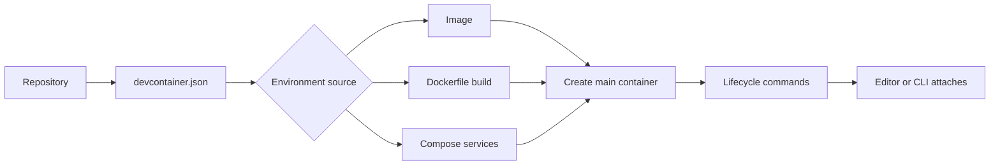

<TLDR>
  <TLDRCell label="what">
    开发容器（Dev Container）是容器及其开发期元数据：镜像、工具、用户、挂载、端口和初始化命令都可随代码版本化。
  </TLDRCell>
  <TLDRCell label="when">
    团队需要统一工具链、缩短环境配置时间，或让本地开发与 CI 共用同一套环境定义时使用它。
  </TLDRCell>
  <TLDRCell label="how">
    提交 `.devcontainer/devcontainer.json`，固定外部输入，使用非 root 用户，并在 CI 中实际构建和测试该环境。
  </TLDRCell>
</TLDR>

## 是什么，为什么存在

<Term id="dev-container">开发容器（Dev Container）</Term>是用来开发应用的容器环境，
而不是应用最终部署时必须采用的打包格式。它在容器镜像或 Docker Compose 的基础上增加开发期元数据，
例如编辑器如何连接、工作区放在哪里、要转发哪些端口，以及创建后执行哪些命令。

它解决的是环境定义散落的问题。只有 `README` 时，安装步骤会随着操作系统、执行顺序和时间而分叉；
把环境定义提交到仓库后，工具可以从同一个声明创建本地环境、云端工作区或 CI 任务。
这会减少差异，但不会自动得到字节级相同的环境，因为镜像标签、Feature、软件源和宿主机仍可能变化。

当项目依赖特定运行时、系统包、数据库或编辑器扩展时，你会遇到开发容器。
只有一个成熟的版本管理器就能满足需求时，容器的构建、磁盘和权限成本可能不划算；
需要硬件设备、桌面应用或复杂企业网络时，也要先确认实现工具是否能传递这些宿主机能力。

## 工作原理

规范通常从仓库根目录下的 `.devcontainer/devcontainer.json` 读取配置，也支持根目录的
`.devcontainer.json`。配置选择一个基础：直接引用 `image`、用 `build` 指向 Dockerfile，
或用 `dockerComposeFile` 选择一组服务。三种形式都描述开发环境，只有 Compose 形式还要用
`service` 指定编辑器和生命周期命令连接的主服务。



创建工具会解析配置、替换 `${localEnv:...}` 等变量，并把镜像元数据、
<Term id="dev-container-feature">Dev Container Feature</Term> 提供的元数据与仓库配置合并。
Feature 是可复用的安装单元，通常包含 `devcontainer-feature.json` 和安装脚本。
它会在镜像构建阶段执行代码，因此引用 Feature 与引用构建依赖一样需要版本和来源审查。

环境首次创建后，容器内命令按 `onCreateCommand`、`updateContentCommand`、
`postCreateCommand` 的顺序运行。恢复已经存在的容器时会运行 `postStartCommand`；
工具每次成功连接后会运行 `postAttachCommand`。`initializeCommand` 不在容器中运行，
它在源码所在的宿主机上执行，而且一次会话中可能执行多次。

这些属性统称为<Term id="lifecycle-command">生命周期命令（lifecycle command）</Term>。
字符串值通过 `/bin/sh` 运行，数组值直接执行程序，不经过 shell；对象中的多个命令并行运行，
且每个命令都必须成功。某一阶段失败后，后续生命周期阶段不会继续执行。

`containerUser` 决定容器中所有操作采用的用户；
<Term id="remote-user">远程用户（remote user）</Term>由 `remoteUser` 指定，
用于生命周期脚本以及编辑器或工具启动的进程。没有设置 `remoteUser` 时，它默认跟随容器用户。
两者分开后，容器入口点可以使用一种身份，日常开发进程使用另一种身份。

`containerEnv` 在创建容器时写入环境，容器入口点也能看到；`remoteEnv` 由支持工具添加到远程进程，
可以在容器存活期间改变。`workspaceMount` 决定源码如何进入容器，`workspaceFolder` 决定远程进程的工作目录。
`forwardPorts` 请求支持工具把容器端口转发给使用者，但它不是 Docker 的端口发布规则。

开发容器保留 Docker 的边界。绑定挂载仍把宿主机路径暴露给容器，挂载 Docker 套接字通常等价于把宿主机
Docker 控制权交给容器，`privileged` 和额外 capability 会进一步扩大权限。
所以开发容器首先是环境管理机制，不能默认视为处理不可信代码的安全沙箱。

## 示例

### 从单镜像配置开始

下面的配置选择 Node 24 镜像，并让容器进程和远程工具都使用镜像中的 `node` 用户。
数组形式的 `postCreateCommand` 不经过 shell；端口属性只告诉支持工具如何处理端口 `3000`。
配置保留在仓库中，因此代码评审能看到环境权限和初始化行为的变化。

<Depth level="quick">

```jsonc title=".devcontainer/devcontainer.json"
{
  "name": "node-api",
  "image": "node:24-bookworm-slim",
  "containerUser": "node",
  "remoteUser": "node",
  "containerEnv": {
    "NODE_ENV": "development"
  },
  "forwardPorts": [3000],
  "portsAttributes": {
    "3000": {
      "label": "API",
      "onAutoForward": "notify"
    }
  },
  "postCreateCommand": ["node", ".devcontainer/setup.mjs"]
}
```

```javascript run title="inspect-config.mjs"
import { readFile } from "node:fs/promises";

const source = await readFile(".devcontainer/devcontainer.json", "utf8");
const config = JSON.parse(source);

console.log(`image=${config.image}`);
console.log(`users=${config.containerUser}/${config.remoteUser}`);
console.log(`ports=${config.forwardPorts.join(",")}`);
```

```text
image=node:24-bookworm-slim
users=node/node
ports=3000
```

</Depth>

检查脚本读取的就是提交后的配置，不是另外维护的一份说明。
它只能证明 JSON 能解析并确认几个关键字段；真正的发布门禁还应运行 `devcontainer build` 或
`devcontainer up`，因为只有构建过程会解析镜像、Feature、用户和挂载的组合。

### 让创建命令快速失败

第一份配置引用了这个创建脚本。它先验证实际运行时，再执行项目安装步骤；这里用短输出代替安装，
让示例保持自包含。真实 Node 项目应在验证通过后运行 `npm ci`，并把 `package-lock.json` 提交到仓库。

```javascript run title=".devcontainer/setup.mjs"
const expectedMajor = 24;
const actualMajor = Number(process.versions.node.split(".")[0]);

if (actualMajor !== expectedMajor) {
  throw new Error(`expected Node ${expectedMajor}, got ${process.version}`);
}

console.log(`runtime=${process.version}`);
console.log("setup=ready");
```

```text
runtime=v24.14.0
setup=ready
```

命令失败会阻止后续生命周期阶段，错误不会被 `|| true` 隐藏。
脚本放在源码树中，比一条不断增长的 shell 字符串更容易测试和评审。
如果工具必须等到依赖安装完成后再连接，可以显式设置 `waitFor: "postCreateCommand"`；
默认等待点是 `updateContentCommand`，所以不能假设连接一定晚于 `postCreateCommand`。

### 用 Compose 增加数据库

多服务环境把开发主容器与数据库放在同一个 Compose 项目中。
`app` 通过服务名 `db` 和端口 `5432` 访问 PostgreSQL；数据库没有 `ports`，因此不会因此直接发布到宿主机。
健康检查让 `depends_on` 等待数据库可接受连接，而不只是等待容器进程启动。

```yaml title=".devcontainer/compose.yaml"
services:
  app:
    image: node:24-bookworm-slim
    user: node
    command: sleep infinity
    volumes:
      - ..:/workspace
    depends_on:
      db:
        condition: service_healthy

  db:
    image: postgres:17-alpine
    environment:
      POSTGRES_DB: app
      POSTGRES_USER: app
      POSTGRES_PASSWORD: local-only
    healthcheck:
      test: ["CMD-SHELL", "pg_isready -U app -d app"]
      interval: 2s
      timeout: 2s
      retries: 10
    volumes:
      - postgres-data:/var/lib/postgresql/data

volumes:
  postgres-data:
```

```jsonc title=".devcontainer/devcontainer.json"
{
  "name": "node-with-postgres",
  "dockerComposeFile": "compose.yaml",
  "service": "app",
  "workspaceFolder": "/workspace",
  "remoteUser": "node",
  "shutdownAction": "stopCompose",
  "forwardPorts": [3000]
}
```

```bash title="validate-compose.sh"
docker compose -f .devcontainer/compose.yaml config --quiet
docker compose -f .devcontainer/compose.yaml config --services
```

```text
db
app
```

`docker compose config --quiet` 验证并解析 Compose 文件，第二条命令列出依赖排序后的服务。
这还没有证明数据库能启动；CI 必须继续创建环境，并从 `app` 内部做一次实际连接检查。
示例密码只适用于可丢弃的本地数据库，生产凭据不能写进配置。

## 陷阱

> [!PITFALL]
> 把不可信仓库放进开发容器，并不等于安全地执行它。`initializeCommand` 直接在宿主机运行，
> 生命周期脚本会执行仓库代码，编辑器还可能转发凭据代理或套接字。
>
> **修复：** 打开环境前先评审 `.devcontainer`、Dockerfile、Compose 文件和 Feature 来源。
> 不挂载整个主目录或 Docker 套接字；除非任务确实需要，否则拒绝 `privileged`、设备和额外 capability。

> [!PITFALL]
> `containerEnv`、Compose `environment` 和 Dockerfile 的 `ENV` 都不是秘密存储。
> 值会进入配置、容器元数据、进程环境或镜像层，仓库中的占位密码也常被误用到共享环境。
>
> **修复：** 由支持平台的秘密机制在运行时注入凭据，只向需要的进程暴露它们。
> 使用短期凭据，并在日志、错误输出和进程参数中检查泄漏；本地固定测试密码要与真实环境明确隔离。

> [!PITFALL]
> `node:24-bookworm-slim`、Feature 的 `:1` 以及操作系统软件源都会随时间变化。
> 提交一个配置文件并不能自动保证未来重建得到相同位。
>
> **修复：** 对要求严格复现的镜像使用摘要，提交语言包管理器锁文件，并提交 CLI 生成的
> `.devcontainer-lock.json`。在 CI 中用 `--frozen-lockfile` 构建，另设受控流程更新镜像和 Feature。

> [!PITFALL]
> 把依赖安装放在 `postStartCommand` 会让每次启动都变慢；把宿主机准备误放进 `postCreateCommand`
> 又会在容器里查找宿主机工具。字符串命令中的 `|| true` 还会把真实失败变成成功。
>
> **修复：** 宿主机准备放进可重复执行的 `initializeCommand`，容器首次创建步骤放进
> `onCreateCommand` 到 `postCreateCommand`，每次启动所需的轻量动作才放进 `postStartCommand`。
> 优先使用数组或已测试的脚本，并让错误直接终止阶段。

> [!PITFALL]
> 只设置 `remoteUser` 不会改变容器入口点和所有容器操作的身份。
> 生成配置常假设用户名一定是 `vscode`，但基础镜像可能只有 `node`、`ubuntu` 或自定义用户。
>
> **修复：** 检查镜像中的真实用户，同时理解 `containerUser` 与 `remoteUser` 的作用域。
> 用该身份创建文件和运行包管理器，并在 Linux 绑定挂载上测试 UID/GID 与写权限，而不是递归 `chown` 整个工作区。

> [!PITFALL]
> `depends_on` 的简单形式只保证按顺序启动容器，不保证服务已经可用。
> `forwardPorts` 也不会让容器之间通过 `localhost` 通信；Compose 服务有自己的网络命名空间。
>
> **修复：** 为依赖服务定义健康检查，并让主服务通过 Compose 服务名连接。
> 分别测试容器内连接和宿主机转发，只暴露开发者确实需要访问的端口。

<Depth level="deep">

## 可复现性来自多层约束

开发容器配置只是输入图的一部分。基础镜像可能通过标签移动，Dockerfile 下载的 URL 或软件源可能返回新内容，
Feature 的主版本引用会解析到新的补丁版本，项目自己的依赖也有另一组解析规则。
任何一层浮动，两个时间点的构建结果都可能不同。

镜像摘要把仓库内容固定到一个 OCI 清单，但它也会阻止安全修复自动进入环境。
合理流程不是永远不更新，而是由自动化提出摘要或锁文件变更，构建环境，运行项目测试，
再把依赖更新与代码变更一样审查。这样既保留可回滚性，也不会把“可复现”误写成“永远安全”。

Dev Container CLI 0.89.0 在 `build` 或 `up` 时默认生成 `.devcontainer-lock.json`，
记录 Feature 的解析版本、内容地址和完整性。`--frozen-lockfile` 要求锁文件存在且保持不变，适合 CI；
它只约束 Feature，不会替你固定基础镜像、APT 仓库或 `npm` 依赖。

宿主机仍是输入。Linux 内核、CPU 架构、容器引擎、Compose 实现、代理与证书都会影响结果。
需要支持 `amd64` 和 `arm64` 时，应在两种架构上构建和测试，或明确限制 `hostRequirements`；
不能用一台机器上的成功构建推断所有宿主机都等价。

## 配置合并会改变有效环境

支持工具不仅读取仓库中的 JSON。基础镜像可以通过 `devcontainer.metadata` 标签携带配置，
每个 Feature 也能贡献元数据，最后再与用户配置组合。评审源文件时看不到的端口、挂载、入口点或编辑器设置，
可能出现在合并后的有效配置中。

因此，排查问题时要记录实现工具解析后的配置和最终 Docker/Compose 调用，而不是只复制
`devcontainer.json`。`devcontainer read-configuration --include-merged-configuration` 可以帮助检查合并结果，
但包含 Feature 的最终镜像行为仍要通过实际构建验证。

Feature 的安装顺序也不应靠对象书写顺序猜测。Feature 可以声明依赖关系或安装顺序提示，
实现工具会据此计算顺序。两个 Feature 同时修改相同文件或工具版本时，应减少重叠职责，
或把需要完全控制的安装逻辑移入自己维护的 Dockerfile。

## 缓存不能证明配置完整

预构建镜像和 BuildKit 缓存能缩短启动时间，却可能遮住缺失的依赖声明。
如果开发者的旧镜像恰好已有某个工具，即使 Dockerfile 没有安装它，日常测试也会成功；
换一台机器或清空缓存后，问题才会出现。

CI 应同时保留快速的热缓存路径和定期执行的冷缓存构建。
冷构建证明仓库中的声明足以重建环境，热构建则检查常用路径没有被无谓拖慢。
两条路径都要运行相同的版本检查和项目测试，不能只比较构建是否退出为零。

依赖缓存应与锁文件或内容哈希关联，而不是只用分支名作为键。
缓存恢复后还要由包管理器验证内容；发现不一致时重新填充缓存，
不要修改权限或跳过完整性检查来让旧缓存继续工作。

## 生命周期是状态机

首次创建与恢复已有环境是两条不同路径。首次创建依次经过 `onCreateCommand`、
`updateContentCommand` 和 `postCreateCommand`；恢复环境不会重跑这三步，只运行启动和连接阶段。
重建会创建新容器，所以依赖只存在于旧容器可写层时会丢失。

`waitFor` 决定工具连接前等待到哪一个创建阶段，默认值是 `updateContentCommand`。
这意味着 `postCreateCommand` 可能在工具宣布环境可用后继续运行。
如果编辑器扩展或测试依赖它生成的文件，应把工作移到较早阶段，或把等待点显式改为 `postCreateCommand`。

对象形式的生命周期属性会并行执行各成员。并行适合相互独立的缓存预热，
不适合一个命令产生另一个命令要读取的文件。存在依赖时应在一个脚本中顺序执行并明确失败，
否则竞态只会在冷缓存或慢网络上偶发出现。

生命周期脚本应把容器视为可能停止、恢复和重建的状态机。
创建脚本要能从干净状态得到所需结果，启动脚本要短且可重复，连接脚本不能偷偷修改共享项目状态。
测试至少覆盖首次创建、第二次启动和删除后重建三条路径。

## 开发环境不等于生产镜像

开发镜像通常包含编译器、调试器、shell、编辑器服务和源码挂载，攻击面与体积都大于运行应用所需。
生产镜像还需要不同的用户、入口点、秘密注入和发布策略。
共享基础阶段可以减少版本偏差，但不应直接把开发容器当作生产制品发布。

更稳妥的关系是让开发环境包含构建生产制品所需的工具，并在 CI 中调用同一个构建入口。
例如，仓库可以让 `devcontainer exec` 和 CI 都运行 `npm test` 与 `docker build`，
而生产 Dockerfile 用多阶段构建只复制运行文件。这样复用的是命令和依赖约束，不是开发权限。

</Depth>

<Checkpoint id="devops/dev-containers" />

## 延伸阅读

- [Development Container 规范](https://raw.githubusercontent.com/devcontainers/spec/main/docs/specs/devcontainer-reference.md)
- [`devcontainer.json` 元数据参考](https://raw.githubusercontent.com/devcontainers/spec/main/docs/specs/devcontainerjson-reference.md)
- [Dev Container Features 规范](https://raw.githubusercontent.com/devcontainers/spec/main/docs/specs/devcontainer-features.md)
- [Dev Container 锁文件规范](https://raw.githubusercontent.com/devcontainers/spec/main/docs/specs/devcontainer-lockfile.md)
- [Dev Container CLI](https://raw.githubusercontent.com/devcontainers/cli/main/README.md)
- [VS Code Dev Containers 文档](https://code.visualstudio.com/docs/devcontainers/containers)
