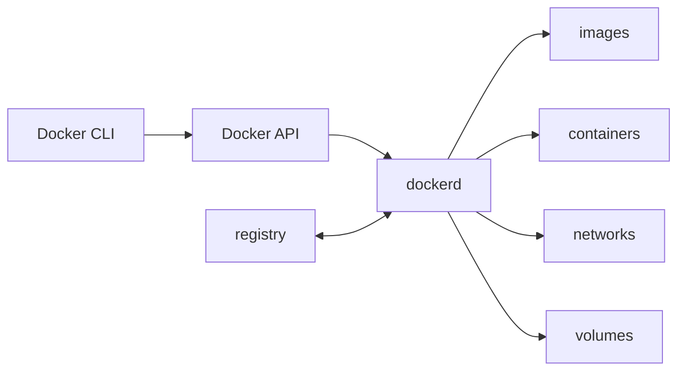

<TLDR>
  <TLDRCell label="what">
    Docker describes a filesystem and default runtime configuration in an image, then its engine starts that image as an isolated process called a container.
  </TLDRCell>
  <TLDRCell label="when">
    Use Docker when an application must carry the same runtime dependencies across developer machines, CI, and servers, or when several services need a repeatable environment.
  </TLDRCell>
  <TLDRCell label="how">
    Keep the build context narrow, pin and regularly update base images, run as a non-root user, put state in volumes, and build and test from a clean environment.
  </TLDRCell>
</TLDR>

## What it is and why it exists

Docker is a platform for building, distributing, and running containerized applications.
A <Term id="container-image">container
image</Term> is a read-only template containing application files and default runtime configuration; a
<Term id="container">container</Term> is the process created from that image plus runtime configuration. One image can create many containers, and deleting a container does not delete its image.

It solves the problem of delivering a runtime environment.
Copying source code alone does not guarantee that the target machine has the same system libraries, runtime, and startup configuration.
A Dockerfile expresses those inputs as reviewable build steps, a registry distributes the result, and the Docker engine creates containers from that same image.

That consistency has limits.
An image does not pin the host kernel, CPU architecture, external services, runtime secrets, or mounted data; floating tags and networked package installations can also make two builds differ.
Containerization is therefore more repeatable than an installation note, but it is not automatically byte-for-byte reproducible.

A container is not synonymous with a lightweight virtual machine.
On Linux, containers are usually ordinary processes isolated with namespaces, control groups, and other kernel mechanisms, and they share the host kernel.
Docker Desktop provides this environment through a Linux virtual machine on supported platforms.
In either deployment, do not treat the container boundary as an absolute security boundary for untrusted code.

You encounter Docker in local dependency environments, CI builds, release artifacts, and server workloads.
A single-file program that needs only a stable runtime already present on the target may not justify the extra build and operations cost.
When you need cross-host scheduling, automatic scaling, and service discovery, use an orchestrator on top of Docker concepts instead of managing a large fleet with hand-written commands.

## How it works

The `docker` command is a client.
It sends requests to `dockerd` through the Docker API; the daemon manages images, containers, networks, and volumes.
A client can connect to a local or remote daemon, so “the CLI parsed this command” and “the target engine completed the operation” are separate verification stages.



Instructions such as `FROM`, `COPY`, `RUN`, `USER`, and `ENTRYPOINT` define an image in a Dockerfile.
Each `FROM` starts a build stage; the builder executes instructions according to their dependencies and reuses cached results when the inputs have not changed.
The <Term id="build-context">build context</Term> is the set of files that the builder allows `COPY` and `ADD` to read, not any arbitrary path on the host.

An image consists of content-addressed <Term id="image-layer">image layers</Term> and configuration.
Images can share identical layers, and a registry only needs to transfer missing content.
A tag such as `node:24-bookworm-slim` is a mutable name pointing to a manifest; a digest identifies a manifest by content.
Tags are readable, while digests record the exact content reviewed and deployed.

`docker create` combines an image with a command, environment variables, mounts, networks, and resource limits to make a container configuration.
`docker start` starts that container's main process, while `docker run` combines creation and startup.
The container filesystem adds a writable layer over the read-only image layers; unmounted data in that layer disappears when the container is removed.

A user-defined network gives containers separate network interfaces and embedded DNS.
Containers on the same network communicate by container name or Compose service name without publishing a port to the host.
`EXPOSE 3000` only documents the port the image expects to listen on; only `-p` or Compose `ports` creates a host-to-container publishing rule.

Mounts connect data outside a container's lifecycle to its filesystem.
A bind mount exposes a chosen host path directly, which suits development source code but couples the container to host layout and permissions.
A <Term id="named-volume">named volume</Term> is managed by Docker and suits persistent state such as a database.
Use `tmpfs` for temporary data that should not reach disk and the container writable layer for disposable runtime files.

An image registry stores and distributes images.
`docker pull` fetches a manifest and missing layers, `docker push` uploads local content, and `docker run` can trigger a pull when the image is absent.
A registry, a repository within that registry, a tag, and a digest are different levels.
Production deployment should record the complete image reference and update it through a reviewed process.

## Examples

### Package a minimal service

This service depends only on the Node standard library.
In normal operation it listens on `PORT`; with `SELF_TEST=1`, it chooses an available port, requests its health endpoint once, and exits.
That test path verifies application behavior before a Docker daemon is available.

<Depth level="quick">

```javascript run title="app.mjs"
import { createServer } from "node:http";

const port = Number(process.env.PORT ?? 3000);
const server = createServer((request, response) => {
  if (request.url !== "/health") {
    response.writeHead(404).end("not found");
    return;
  }

  response.setHeader("content-type", "application/json");
  response.end(JSON.stringify({ service: "catalog", status: "ok" }));
});

server.listen(port, async () => {
  const address = server.address();
  if (process.env.SELF_TEST === "1" && typeof address === "object" && address) {
    const response = await fetch(`http://127.0.0.1:${address.port}/health`);
    console.log(`status=${response.status}`);
    console.log(`body=${await response.text()}`);
    server.close();
  }
});
```

```text
status=200
body={"service":"catalog","status":"ok"}
```

</Depth>

The release Dockerfile copies only the files needed at runtime.
Its base image includes both a readable tag and the multi-platform manifest digest verified on 2026-09-04, preventing the tag from drifting without review.
The official Node image supplies the `node` account; the exec-form `ENTRYPOINT` makes Node the container's main process directly.

```dockerfile title="Dockerfile"
# not executed here: Docker daemon unavailable
# syntax=docker/dockerfile:1
FROM node:24-bookworm-slim@sha256:ba849c60be29959425b8734d57b8b4b7d56f98edd9504c9af091d5281095a71e
WORKDIR /app
ENV NODE_ENV=production
ENV PORT=3000
COPY --chown=node:node app.mjs ./
USER node
EXPOSE 3000
HEALTHCHECK CMD ["node", "-e", "fetch('http://127.0.0.1:3000/health').then(r=>{if(!r.ok)process.exit(1)}).catch(()=>process.exit(1))"]
ENTRYPOINT ["node", "app.mjs"]
```

The build context should also exclude irrelevant files and secrets.
`.dockerignore` filters paths before the context is sent to the builder; it cannot safely undo a `COPY` that already happened, so secrets should never enter the context in the first place.

```dockerignore title=".dockerignore"
.git
.env*
node_modules
reports
```

On a machine with an available engine, build with `docker build -t catalog:local .`, then start it with
`docker run --rm -p 127.0.0.1:3000:3000 catalog:local`. Binding the published address to
`127.0.0.1` restricts access to the local host; when the host address is omitted, Docker may publish the port on all interfaces by default.

### Connect services and persistent data with Compose

Compose extends the same application into two services.
`catalog` reaches PostgreSQL by the service name `db`; the database port does not need to be published to the host.
`catalog-data` outlives any one database container, while the application root filesystem is read-only and temporary writes are restricted to `/tmp`.

```yaml title="compose.yaml"
name: catalog-stack

services:
  catalog:
    build:
      context: .
    environment:
      PORT: "3000"
      DATABASE_URL: postgresql://catalog:local-only@db:5432/catalog
    ports:
      - "127.0.0.1:3000:3000"
    depends_on:
      db:
        condition: service_healthy
    read_only: true
    tmpfs:
      - /tmp
    init: true

  db:
    image: postgres:18-alpine@sha256:d3e1620b530c944afa6e887d22eb899824da68e19c52024bf98f5220c88a65b2
    environment:
      POSTGRES_DB: catalog
      POSTGRES_USER: catalog
      POSTGRES_PASSWORD: local-only
    healthcheck:
      test: ["CMD-SHELL", "pg_isready -U $${POSTGRES_USER} -d $${POSTGRES_DB}"]
      interval: 2s
      timeout: 2s
      retries: 15
    volumes:
      - catalog-data:/var/lib/postgresql/data

volumes:
  catalog-data:
```

Startup order from `depends_on` alone does not mean that the database can accept requests.
`service_healthy` tells Compose to wait for the `db` health check before creating the dependent service.
The doubled dollar signs leave variable expansion to the shell in the container instead of letting Compose expand the variables while reading the file.

These commands only parse and normalize the configuration; they create no containers and therefore run without a daemon.
The output confirms that Compose sees both services in dependency order.

```bash title="validate-compose.sh"
docker compose -f compose.yaml config --quiet
docker compose -f compose.yaml config --services
```

```text
db
catalog
```

`POSTGRES_PASSWORD` is only for this disposable local database.
Inject secrets at runtime in shared or production environments.
After validating the configuration, CI with an engine must still run `docker compose up --build --wait` and make a real database connection from `catalog`; static parsing cannot prove that images build or services become ready.

### Check the digest behind a tag

Tags express update channels well; digests audit exact content.
`imagetools inspect` queries a registry manifest without running the image.
The following output was retrieved with the local Docker CLI 29.7.2 on the verification date.

```bash title="resolve-images.sh"
docker buildx imagetools inspect node:24-bookworm-slim --format '{{.Manifest.Digest}}'
docker buildx imagetools inspect postgres:18-alpine --format '{{.Manifest.Digest}}'
```

```text
sha256:ba849c60be29959425b8734d57b8b4b7d56f98edd9504c9af091d5281095a71e
sha256:d3e1620b530c944afa6e887d22eb899824da68e19c52024bf98f5220c88a65b2
```

A multi-platform tag usually resolves to the digest of an image index or manifest list, from which the platform-specific manifest is selected.
Deployment records should retain the image reference, target platform, and build attestation.
Update the digest regularly, then rebuild, scan, and test; digest pinning must not defer security fixes indefinitely.

## Pitfalls

> [!PITFALL]
> Treating `latest` or a version tag as immutable lets the same Dockerfile resolve to different base content on different dates.
> Testing only with the cache can keep reusing an old layer and hide that change.
>
> **Fix:** Record digests for release artifacts, and keep both warm-cache builds and periodic cold builds in CI.
> Let dependency tooling propose tag and digest changes, then scan and test them; “pinned” must not mean “never updated.”

> [!PITFALL]
> Passing a token through `ARG`, `ENV`, or `COPY` can place the secret in image configuration, build history, or a layer.
> A later `RUN rm` only deletes the path in a new layer; it does not erase content already saved in an older one.
>
> **Fix:** Use a BuildKit secret mount during builds and the deployment platform's secret facility at runtime.
> Limit scope and lifetime, then inspect build logs, image history, and the final filesystem for leftover copies.

> [!PITFALL]
> Running as root and adding `--privileged`, capabilities, or the Docker socket to fix permission errors greatly expands the impact of a container compromise.
> Bind-mounting the host root bypasses much of the filesystem isolation as well.
>
> **Fix:** Create and select a non-root image user, and add only the capabilities, devices, and read-only paths the task requires.
> Justify every mount and privilege.
> Untrusted workloads that need strong isolation require an additional sandbox or virtual-machine boundary.

> [!PITFALL]
> `EXPOSE` does not publish a port, and `localhost` inside a container refers only to that container.
> Generated Compose files often configure a database at `localhost` or expose the database to the host merely for container-to-container traffic.
>
> **Fix:** Connect services on the same Compose network by service name, such as `db:5432`.
> Use `ports` only for access from the host or an external client, bind to an explicit address, and test inter-container connectivity separately from host publishing.

> [!PITFALL]
> Writing database data into the container's writable layer loses it when the container is replaced.
> Conversely, `docker compose down -v` explicitly deletes project volumes, so a named volume is not an automatic backup.
>
> **Fix:** Declare a named volume or external store for persistent state and test recovery after replacing the container.
> Define backup, verification, and restore drills separately; inspect which volumes a cleanup command will remove before running it.

> [!PITFALL]
> Shell-form `CMD node app.mjs` starts `/bin/sh -c` first.
> If the shell does not forward signals correctly, the application may miss the stop signal and eventually be killed; generated health checks also often call `curl` in an image that does not contain it.
>
> **Fix:** Prefer JSON exec form for the main process and use `exec` explicitly when a shell is necessary.
> Health checks must call tools present in the final image, and tests must cover startup, failure, timeout, and graceful shutdown.

## In the AI era

**What generated code gets wrong here**

Models often splice together `FROM node:latest`, `COPY . .`, `npm install`, and shell-form `CMD` from old tutorials.
The base then drifts, caches invalidate too often, lockfiles are not enforced, and stop signals may terminate at a shell.
They also treat build arguments as a secret channel, copy `.env` before deleting it, or jump straight to root and `--privileged` to bypass a permission error.

Compose failures are more likely to pass a static syntax check.
Generated files make an application reach its database through `localhost`, use short-form `depends_on` while claiming readiness, publish a database port twice, or define a health check around a command absent from the final image.
Models also ignore `linux/amd64` versus `linux/arm64` and copy a single-platform binary into a purported multi-platform image.

**Ask your AI to check**

- List every Dockerfile instruction's inputs, cache invalidation conditions, and files entering the final image; flag every secret and unnecessary build tool.
- Resolve image tags to digests and target platforms, then verify that the base-image user, health-check tool, entry command, and lockfile actually exist.
- Draw the access path for every port, network, mount, capability, and Docker socket; state the least-privilege alternative and the command that verifies it.

**Review checklist**

- Build from an empty cache, scan the final artifact, and run the health check and application tests as the user declared by the image.
- Inspect image history and an exported filesystem for secrets, package-manager caches, compilers, or source files that the runtime does not need.
- Create, stop, replace, and remove containers to verify signal handling, service readiness, network name resolution, and volume recovery.

**Prompt vocabulary**

Use precise terms: `build context`（构建上下文）, `layer cache invalidation`（层缓存失效）, `multi-stage build`（多阶段构建）, `OCI manifest digest`（OCI 清单摘要）, `exec-form ENTRYPOINT`（exec 形式入口点）, `PID 1 signal forwarding`（PID 1 信号转发）, `user-defined bridge network`（用户自定义桥接网络）, `named volume`（命名卷）, `read-only root filesystem`（只读根文件系统）, and `least privilege`（最小权限）.
Also name the Docker, Compose, target-platform, and base-image versions; “generate a production Dockerfile” does not constrain the supply chain or permission model.

<Depth level="deep">

## The build cache is a dependency graph

The builder does not decide cache reuse solely by asking whether one line's text changed.
`COPY` depends on metadata and content from selected context files; `RUN` depends on its parent layer, instruction, mounts, and some build arguments.
Remote content returned by a networked command is generally not part of the cache key.
A cache hit says known inputs match, not that a package repository would still return the same package.

Copy dependency manifests and lockfiles first, perform a frozen installation, then copy source that changes more often.
An application edit then does not invalidate the dependency layer automatically.
`.dockerignore` reduces context transfer, irrelevant cache invalidations, and opportunities to copy secrets, but it does not replace narrow `COPY` paths.

A multi-stage build puts build and runtime environments in separate stages of one Dockerfile.
The final stage copies artifacts from the build stage without automatically inheriting that stage's filesystem, environment, or tools.
You must still inspect the copy boundary: `COPY --from=build /app /app` may carry source, tests, and development dependencies into the final image.

A cold-cache build demonstrates declaration completeness, while a warm-cache build exercises the common path.
Both should run the same artifact tests.
If only the warm build succeeds, a dependency probably lives in an old layer, a mutable download, or a developer machine instead of being fully expressed by the current build definition.

## Container configuration and image state are separate

Image configuration supplies default `USER`, environment, working directory, entrypoint, and command values.
Container creation can override those defaults and add networks, mounts, published ports, and resource limits.
A diagnosis cannot stop at the Dockerfile; use `docker inspect` to check the actual container configuration and final execution arguments.

`ENTRYPOINT` defines a stable executable, while `CMD` can supply its default arguments.
`docker run IMAGE args` replaces `CMD` but retains an exec-form `ENTRYPOINT`.
That pairing is clear when an image behaves like one executable.
Images that require process supervision or complex initialization need an explicit entry program that forwards signals and reaps child processes correctly.

The container's main process has PID 1 responsibilities.
When stopping a container, the engine sends its stop signal and waits for a timeout; if the process remains, it is forcibly terminated.
The application must handle termination, stop accepting new work, and complete bounded cleanup.
Container deletion is not a substitute for an application-level shutdown protocol.

Health state and process state are also separate.
The main process can still run while the application can no longer serve requests.
A health check reports status through its exit code, but Docker Engine itself does not automatically restart a container merely because it becomes `unhealthy`; an orchestrator or monitoring layer must define the response.

## Reproducibility crosses the image boundary

A digest only pins the referenced image manifest.
Package repositories, remote downloads, language dependencies, and build arguments in a Dockerfile can still drift; external networks, secrets, and volume data in Compose also sit outside the image.
A reproducible process records the whole input graph instead of pinning only the `FROM` line.

A multi-platform image reference may point to an index listing distinct manifests for operating systems and CPU architectures.
The same tag can select different platform artifacts on two machines.
A release pipeline should declare its target platforms, test on each, and record the relationship between the index digest and platform-manifest digests.

Pinning a digest stops automatic base-image updates.
That is both an audit feature and a maintenance obligation.
Automation should propose new tags and digests; the pipeline rebuilds, scans, and runs regression tests; a person reviews the change.
Rolling back to a known digest restores an old artifact but does not prove that artifact remains safe.

The runtime environment remains an input.
The host kernel, daemon configuration, CPU features, DNS, proxies, and mount permissions can all change container behavior.
Record client, engine, Compose, and target-platform versions in build attestations so you can separate an image defect from an environment difference.

</Depth>

<Checkpoint id="devops/docker-guide" />

## Further reading

- [Docker overview](https://docs.docker.com/get-started/docker-overview/)
- [Dockerfile reference](https://docs.docker.com/reference/dockerfile/)
- [Build context](https://docs.docker.com/build/concepts/context/)
- [Networking overview](https://docs.docker.com/engine/network/)
- [Volumes](https://docs.docker.com/engine/storage/volumes/)
- [Compose startup order](https://docs.docker.com/compose/how-tos/startup-order/)
