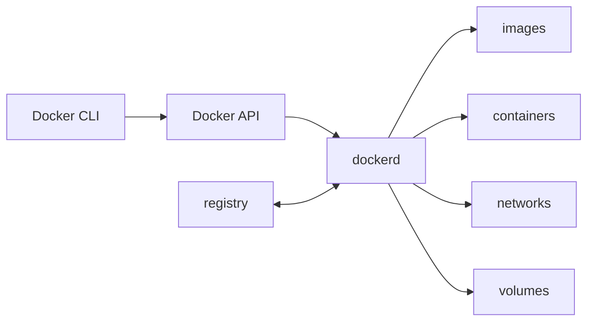

<TLDR>
  <TLDRCell label="what">
    Docker 用镜像描述文件系统与默认运行配置，再由引擎把镜像启动为隔离进程，也就是容器。
  </TLDRCell>
  <TLDRCell label="when">
    当应用需要跨开发机、CI 和服务器复用同一套运行依赖，或需要把多个服务组成可重复创建的环境时使用 Docker。
  </TLDRCell>
  <TLDRCell label="how">
    缩小构建上下文，固定并持续更新基础镜像，使用非 root 用户，把状态放进卷，并在干净环境中构建和测试镜像。
  </TLDRCell>
</TLDR>

## 是什么，为什么存在

Docker 是构建、分发和运行容器化应用的平台。<Term id="container-image">容器镜像（container
image）</Term>是只读模板，包含应用文件和默认运行配置；<Term id="container">容器
（container）</Term>则是镜像加上一组运行时配置后形成的进程。一个镜像可以创建多个容器，删除容器也不会删除镜像。

它解决的是运行环境难以交付的问题。只复制源码并不能保证目标机器拥有相同的系统库、运行时和启动配置。Dockerfile 把这些输入写成可审查的构建步骤，
镜像仓库负责分发结果，Docker 引擎则根据同一份镜像创建容器。

这种一致性有边界。镜像不会固定宿主机内核、CPU 架构、外部服务、运行时秘密或挂载的数据；浮动标签和联网安装也会让两次构建得到不同内容。因此，
容器化比一份安装说明更可重复，但不自动等于逐字节可复现。

容器也不是轻量虚拟机的同义词。
在 Linux 上，容器通常是由命名空间、控制组和其他内核机制隔离的普通进程，共享宿主机内核。
Docker Desktop 会在受支持的平台上通过 Linux 虚拟机提供该环境。
无论哪种部署，容器边界都不应被当作运行不可信代码的绝对安全边界。

你会在本地依赖环境、CI 构建、发布制品和服务器工作负载中遇到 Docker。
单文件脚本若只依赖目标机器已有的稳定运行时，容器可能增加不必要的构建与运维成本。
需要跨主机调度、自动扩缩和服务发现时，则应在 Docker 基础上使用编排系统，而不是用手工命令管理大量容器。

## 工作原理

`docker` 命令是客户端。
它通过 Docker API 向 `dockerd` 发送请求；守护进程管理镜像、容器、网络和卷。
客户端可以连接本机或远程守护进程，所以“CLI 命令成功解析”与“目标引擎完成操作”是两个不同的验证阶段。



Dockerfile 中的 `FROM`、`COPY`、`RUN`、`USER`、`ENTRYPOINT` 等指令定义镜像。
每个 `FROM` 开始一个构建阶段；构建器按依赖关系执行指令，并在输入没有变化时复用缓存结果。
<Term id="build-context">构建上下文（build context）</Term>是构建器允许 `COPY` 和 `ADD` 读取的文件集合，不是宿主机上的任意路径。

镜像由内容寻址的<Term id="image-layer">镜像层（image layer）</Term>和配置组成。
多个镜像可以共享相同层，仓库也只需传输缺失内容。
标签是指向清单的可变名称，例如 `node:24-bookworm-slim`；摘要则按内容标识清单。
标签便于阅读，摘要适合记录实际审查和部署的内容。

`docker create` 把镜像与命令、环境变量、挂载、网络和资源限制组合成容器配置。
`docker start` 启动该容器的主进程，`docker run` 则把创建与启动合成一次操作。
容器文件系统在只读镜像层之上增加可写层；容器被删除时，这个可写层中的未挂载数据也随之消失。

用户自定义网络给容器提供独立网络接口与内置 DNS。
同一网络中的容器可以按容器名或 Compose 服务名通信，不需要把端口发布到宿主机。
`EXPOSE 3000` 只描述镜像预期监听的端口；只有 `-p` 或 Compose 的 `ports` 才建立宿主机到容器的发布规则。

挂载把容器生命周期之外的数据接入文件系统。
绑定挂载直接暴露指定宿主机路径，适合开发源码，但会耦合宿主机布局和权限。
<Term id="named-volume">命名卷（named volume）</Term>由 Docker 管理，适合数据库等持久状态。
`tmpfs` 适合无需落盘的临时数据；容器可写层适合可丢弃的运行时文件。

镜像仓库存储和分发镜像。
`docker pull` 取得清单与缺失层，`docker push` 上传本地内容，
`docker run` 在镜像缺失时也可以触发拉取。
仓库、仓库中的 repository、标签和摘要是不同层次；生产部署应记录完整镜像引用，并由受审查的流程更新它。

## 示例

### 打包一个最小服务

下面的服务只依赖 Node 标准库。
正常启动时它监听 `PORT`，而 `SELF_TEST=1` 会让它随机选择空闲端口，请求一次健康端点后退出。
这个测试路径让应用逻辑可以在没有 Docker 守护进程的环境中先得到验证。

<Depth level="quick">

```javascript run title="app.mjs"
import { createServer } from "node:http";

const port = Number(process.env.PORT ?? 3000);
const server = createServer((request, response) => {
  if (request.url !== "/health") {
    response.writeHead(404).end("not found");
    return;
  }

  response.setHeader("content-type", "application/json");
  response.end(JSON.stringify({ service: "catalog", status: "ok" }));
});

server.listen(port, async () => {
  const address = server.address();
  if (process.env.SELF_TEST === "1" && typeof address === "object" && address) {
    const response = await fetch(`http://127.0.0.1:${address.port}/health`);
    console.log(`status=${response.status}`);
    console.log(`body=${await response.text()}`);
    server.close();
  }
});
```

```text
status=200
body={"service":"catalog","status":"ok"}
```

</Depth>

发布用 Dockerfile 只复制运行所需文件。
基础镜像同时写标签与 2026-09-04 验证过的多平台清单摘要，便于人理解版本，也防止标签在未审查时漂移。
`node` 用户来自官方 Node 镜像；exec 形式的 `ENTRYPOINT` 让 Node 直接成为容器主进程。

```dockerfile title="Dockerfile"
# not executed here: Docker daemon unavailable
# syntax=docker/dockerfile:1
FROM node:24-bookworm-slim@sha256:ba849c60be29959425b8734d57b8b4b7d56f98edd9504c9af091d5281095a71e
WORKDIR /app
ENV NODE_ENV=production
ENV PORT=3000
COPY --chown=node:node app.mjs ./
USER node
EXPOSE 3000
HEALTHCHECK CMD ["node", "-e", "fetch('http://127.0.0.1:3000/health').then(r=>{if(!r.ok)process.exit(1)}).catch(()=>process.exit(1))"]
ENTRYPOINT ["node", "app.mjs"]
```

构建上下文还需要排除无关文件和秘密。`.dockerignore` 在上下文发给构建器之前过滤路径；它不是安全地撤销一次已经发生的 `COPY`，
所以秘密一开始就不应进入上下文。

```dockerignore title=".dockerignore"
.git
.env*
node_modules
reports
```

在有可用引擎的机器上，用 `docker build -t catalog:local .` 构建，再用
`docker run --rm -p 127.0.0.1:3000:3000 catalog:local` 启动。发布地址绑定到
`127.0.0.1`，只允许本机访问；若省略宿主机地址，Docker 默认可能把端口发布到所有接口。

### 用 Compose 连接服务与持久数据

Compose 把同一应用扩展成两个服务。
`catalog` 通过服务名 `db` 访问 PostgreSQL；数据库端口不必发布到宿主机。
`catalog-data` 独立于某个数据库容器存在，而应用根文件系统是只读的，临时写入只允许进入 `/tmp`。

```yaml title="compose.yaml"
name: catalog-stack

services:
  catalog:
    build:
      context: .
    environment:
      PORT: "3000"
      DATABASE_URL: postgresql://catalog:local-only@db:5432/catalog
    ports:
      - "127.0.0.1:3000:3000"
    depends_on:
      db:
        condition: service_healthy
    read_only: true
    tmpfs:
      - /tmp
    init: true

  db:
    image: postgres:18-alpine@sha256:d3e1620b530c944afa6e887d22eb899824da68e19c52024bf98f5220c88a65b2
    environment:
      POSTGRES_DB: catalog
      POSTGRES_USER: catalog
      POSTGRES_PASSWORD: local-only
    healthcheck:
      test: ["CMD-SHELL", "pg_isready -U $${POSTGRES_USER} -d $${POSTGRES_DB}"]
      interval: 2s
      timeout: 2s
      retries: 15
    volumes:
      - catalog-data:/var/lib/postgresql/data

volumes:
  catalog-data:
```

`depends_on` 的启动顺序本身不代表数据库已能接受请求。
`service_healthy` 让 Compose 等待 `db` 的健康检查成功后再创建依赖服务。
双美元符号把变量展开留给容器内的 shell，而不是让 Compose 在读取文件时展开。

下面的命令只解析和规范化配置，不会创建容器，
因此可以在没有守护进程的环境中执行。输出确认了 Compose 识别到依赖顺序中的两个服务。

```bash title="validate-compose.sh"
docker compose -f compose.yaml config --quiet
docker compose -f compose.yaml config --services
```

```text
db
catalog
```

`POSTGRES_PASSWORD` 这里只用于一次性的本地数据库。
共享或生产环境应在运行时注入秘密。
验证配置之后，
仍需在有引擎的 CI 中执行 `docker compose up --build --wait`，
再从 `catalog` 发起真实数据库连接；静态解析不能证明镜像可构建或服务可就绪。

### 核对标签解析出的摘要

标签适合表达更新通道，
摘要适合审计确切内容。`imagetools inspect` 可以不运行镜像就查询仓库清单；以下结果由本地 Docker CLI 29.7.2 在验证日期实际取得。

```bash title="resolve-images.sh"
docker buildx imagetools inspect node:24-bookworm-slim --format '{{.Manifest.Digest}}'
docker buildx imagetools inspect postgres:18-alpine --format '{{.Manifest.Digest}}'
```

```text
sha256:ba849c60be29959425b8734d57b8b4b7d56f98edd9504c9af091d5281095a71e
sha256:d3e1620b530c944afa6e887d22eb899824da68e19c52024bf98f5220c88a65b2
```

多平台标签通常解析到镜像索引或清单列表的摘要，
再由平台选择具体清单。部署记录应同时保留镜像引用、目标平台和构建证明。定期更新摘要并重新构建、扫描、测试，
不能因为固定摘要而无限期错过安全修复。

## 陷阱

> [!PITFALL]
> 把 `latest` 或版本标签当成不可变版本，
> 会让相同 Dockerfile 在不同日期解析到不同基础内容。只使用缓存测试还可能继续复用旧层，
> 掩盖这种变化。
>
> **修复：** 对发布制品记录摘要，在 CI 中同时保留热缓存构建和定期冷构建。由依赖更新工具提交标签与摘要变更，
> 再经过扫描和测试；不要把“固定”理解成“永不更新”。

> [!PITFALL]
> 用 `ARG`、`ENV` 或 `COPY` 传入令牌，
> 会让秘密进入镜像配置、构建历史或层。后续 `RUN rm` 只在新层删除路径，
> 不能抹掉旧层已经保存的内容。
>
> **修复：** 构建时使用 BuildKit secret mount，
> 运行时使用部署平台的秘密机制。限制秘密的作用域与有效期，
> 并检查构建日志、镜像历史和最终文件系统中是否仍有副本。

> [!PITFALL]
> 以 root 运行，再用 `--privileged`、额外 capability 或 Docker socket 解决权限问题，
> 会显著扩大容器突破后的影响范围。把宿主机根目录绑定挂载进去同样会绕过大部分文件系统隔离。
>
> **修复：** 在镜像中创建并选择非 root 用户，
> 只添加任务必需的 capability、设备和只读路径。逐项说明挂载与权限的理由；需要强隔离的不可信工作负载应采用额外的沙箱或虚拟机边界。

> [!PITFALL]
> `EXPOSE` 不会发布端口，
> 容器中的 `localhost` 也只指向该容器自身。生成的 Compose 文件常把数据库地址写成 `localhost`，
> 或为了容器间通信而把数据库暴露到宿主机。
>
> **修复：** 同一 Compose 网络中的服务按服务名连接，
> 例如 `db:5432`。只有宿主机或外部客户端需要访问的端口才使用 `ports`，
> 并明确绑定地址；把容器间连接与宿主机发布分别测试。

> [!PITFALL]
> 把数据库写入容器可写层，会在重建容器时丢失数据。另一方面，
> `docker compose down -v` 会明确删除项目卷，不能把命名卷误认为自动备份。
>
> **修复：** 为持久状态声明命名卷或外部存储，测试容器替换后的恢复路径。另行制定备份、校验和恢复演练；运行清理命令前先检查它将删除哪些卷。

> [!PITFALL]
> shell 形式的 `CMD node app.mjs` 会先启动 `/bin/sh -c`。
> 如果 shell 没有正确转发信号，应用可能收不到停止信号，最终被强制终止；自动生成的健康检查还常调用镜像中不存在的 `curl`。
>
> **修复：** 主进程优先使用 JSON exec 形式，
> 确实需要 shell 时显式使用 `exec`。健康检查只调用最终镜像中存在的工具，
> 并实际测试启动期、失败状态、超时与优雅停止。

## AI 时代

**生成代码在这里常犯的错**

模型常从旧教程拼出 `FROM node:latest`、`COPY . .`、`npm install` 和 shell 形式 `CMD`，
于是基础内容漂移、缓存频繁失效、锁文件没有被强制使用，停止信号还可能停在 shell。
它也会把构建参数当作秘密通道，先复制 `.env` 再删除，或者为了绕过权限错误直接改成 root 与 `--privileged`。

Compose 方面的错误更容易通过静态语法检查。
生成文件会让应用通过 `localhost` 连接数据库，
只写短格式 `depends_on` 却声称服务已就绪，重复发布数据库端口，
或者健康检查依赖最终镜像中没有的命令。
模型还会忽略 `linux/amd64` 与 `linux/arm64` 的差异，把仅在一个平台存在的二进制复制到多平台镜像。

**让 AI 检查**

- 列出每条 Dockerfile 指令的输入、缓存失效条件和进入最终镜像的文件，并标出任何秘密或无关构建工具。
- 展开镜像标签为摘要和目标平台，核对基础镜像用户、健康检查工具、入口命令与锁文件是否真实存在。
- 绘制每个端口、网络、挂载、capability 和 Docker socket 的访问路径，说明最小权限方案以及实际验证命令。

**审查清单**

- 从空缓存构建镜像，扫描最终制品，并以镜像声明的用户运行健康检查与应用测试。
- 检查镜像历史和导出文件系统，确认没有秘密、包管理器缓存、编译器或不需要的源码。
- 创建、停止、替换并删除容器，验证信号处理、服务就绪、网络名称解析和卷恢复行为。

**提示词词汇**

使用精确词汇：`build context`（构建上下文）、`layer cache invalidation`（层缓存失效）、`multi-stage build`（多阶段构建）、`OCI manifest digest`（OCI 清单摘要）、`exec-form ENTRYPOINT`（exec 形式入口点）、`PID 1 signal forwarding`（PID 1 信号转发）、`user-defined bridge network`（用户自定义桥接网络）、`named volume`（命名卷）、`read-only root filesystem`（只读根文件系统）和 `least privilege`（最小权限）。
还要给出 Docker、Compose、目标平台和基础镜像版本；“生成生产级 Dockerfile”并没有约束供应链或权限模型。

<Depth level="deep">

## 构建缓存是一张依赖图

构建器不是简单按“这一行文本是否变化”决定缓存。
`COPY` 依赖所选上下文文件的元数据与内容，
`RUN` 依赖父层、指令、挂载和部分构建参数；联网命令返回的远程内容通常不在缓存键中。
一次缓存命中只说明已知输入相同，不证明软件仓库仍会返回相同包。

因此，应先复制依赖清单与锁文件，执行冻结安装，再复制变化更频繁的源码。
这样修改应用文件不会自动使依赖层失效。
`.dockerignore` 同时减少上下文传输、无关缓存失效和误复制秘密的机会，但它不能替代精确的 `COPY` 路径。

多阶段构建把编译环境和运行环境放在同一个 Dockerfile 的不同阶段。
最终阶段只从构建阶段复制制品，不会自动继承构建阶段的文件系统、环境变量或工具。
仍需检查复制边界：`COPY --from=build /app /app` 可能把源码、测试文件和开发依赖一起带入最终镜像。

冷缓存构建用于证明声明完整，热缓存构建用于验证常用路径。两者都应运行同一套制品测试。若只有热缓存能成功，
通常说明某个依赖只存在于旧层、可变下载或开发者机器，而没有被当前构建定义完整表达。

## 容器配置与镜像是两层状态

镜像配置提供默认 `USER`、环境变量、工作目录、入口点和命令。
创建容器时可以覆盖这些默认值，并额外加入网络、挂载、端口发布与资源限制。
排查问题时只看 Dockerfile 不够，还要用 `docker inspect` 检查实际容器配置与最终执行参数。

`ENTRYPOINT` 定义稳定的可执行程序，
`CMD` 可以为它提供默认参数；`docker run IMAGE args` 会替换 `CMD`，
但保留 exec 形式的 `ENTRYPOINT`。
如果镜像只是一个可执行工具，这种组合很清楚。
对于需要多进程监督或复杂初始化的镜像，应使用能正确转发信号并回收子进程的明确入口程序。

容器的主进程承担 PID 1 的职责。停止容器时，引擎向它发送停止信号并等待超时；进程若不退出，
随后会被强制终止。应用必须处理终止信号、停止接受新工作并完成有限时间内的清理，不能依赖容器删除来替代应用级关闭协议。

健康状态与进程状态也是两件事。
主进程仍在运行时，应用可能已无法处理请求。
健康检查通过退出码报告状态，
但 Docker Engine 本身不会因为容器变为 `unhealthy` 就自动重启它；编排或监控层需要明确决定如何响应。

## 可复现性跨越镜像边界

摘要只能固定所引用的镜像清单。
Dockerfile 中的包仓库、远程下载、语言依赖和构建参数仍可能漂移；Compose 中的外部网络、秘密与卷内容也在镜像之外。
可复现流程要记录完整输入图，而不是只固定 `FROM` 行。

多平台镜像引用可能指向一个索引，
其中为不同操作系统和 CPU 架构列出不同清单。同一标签在两台机器上可以选择不同平台制品。发布流水线应声明目标平台，
在每个平台上运行测试，
并记录索引摘要与平台清单摘要之间的关系。

固定摘要会停止自动接收基础镜像更新，这既是审计能力，也是维护义务。自动化应提出新的标签与摘要，
流水线重新构建、扫描并执行回归测试，人再审查变更。回滚到已知摘要能恢复旧制品，但不能证明旧制品仍然安全。

运行环境仍是输入。宿主机内核、Docker 守护进程配置、CPU 特性、DNS、代理和挂载权限都可能改变容器行为。把客户端、引擎、Compose 和目标平台版本记录在构建证明中，
才能区分镜像缺陷与环境差异。

</Depth>

<Checkpoint id="devops/docker-guide" />

## 延伸阅读

- [Docker overview](https://docs.docker.com/get-started/docker-overview/)
- [Dockerfile reference](https://docs.docker.com/reference/dockerfile/)
- [Build context](https://docs.docker.com/build/concepts/context/)
- [Networking overview](https://docs.docker.com/engine/network/)
- [Volumes](https://docs.docker.com/engine/storage/volumes/)
- [Compose startup order](https://docs.docker.com/compose/how-tos/startup-order/)
