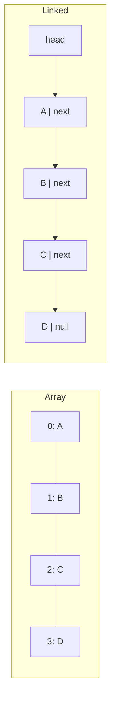

<TLDR>
  <TLDRCell label="what">
    An array stores indexed slots as one logical block; a linked list stores separate nodes connected by links.
  </TLDRCell>
  <TLDRCell label="trap">
    A linked list does not make insertion anywhere constant-time: locating the position is still linear unless you already hold the right node.
  </TLDRCell>
  <TLDRCell label="fix">
    Start from the dominant operations and memory budget. Prefer arrays for indexing and traversal; use linked nodes when stable node handles and frequent local rewiring matter.
  </TLDRCell>
</TLDR>

## What it is and why it exists

An array and a <Term id="linked-list">linked list</Term> can both represent an ordered sequence, but they organize storage differently. An array gives each element an integer position in one logical run of slots. A linked list puts each element in a node that names the next node and, in a doubly linked list, the previous one as well.

That representation decides which work is direct and which work must walk or move data. Given a valid index, an array can calculate the target slot without visiting earlier elements. A linked list starts from a known node and follows links, so reaching position `i` normally visits every preceding node.

Mutation reverses part of the tradeoff. Inserting into the middle of an array preserves index order by shifting later elements. If a linked-list predecessor or node is already known, insertion or removal changes only a fixed number of links; if it is not known, finding it can dominate the operation.

The word “array” covers two related forms. A fixed array has a length chosen when its storage is allocated. A <Term id="dynamic-array">dynamic array</Term>, such as the common implementation behind a growable vector, tracks a logical length and a capacity, then occasionally allocates a larger backing area.

A linked list can be singly linked, doubly linked, or circular. Singly linked nodes use less link storage and naturally move forward. Doubly linked nodes spend another link per node so a known node can be detached or traversed in either direction.

You meet this choice inside queues, editors, schedulers, caches, adjacency lists, and runtime collections. Most application code should first use its language's standard collection, because that collection already defines edge cases and iteration behavior. The underlying model still matters when an operation becomes hot, latency-sensitive, or memory-heavy.

The same abstract sequence can also use a deque, ring buffer, tree, gap buffer, or chunked representation. “Array versus linked list” is a starting cost model, not a rule that excludes those alternatives. Choose from an observed workload rather than from the collection's name.

The runnable examples use JavaScript because Node 24 is available locally. JavaScript `Array` specifies indexed behavior, not a permanent raw-memory layout; engines may change internal representations. The linked nodes are ordinary objects, so the examples demonstrate access paths and invariants rather than promising exact byte layouts.

## How it works

For a conventional contiguous array with fixed-width slots, the address of element `i` follows `base + i × stride`. The calculation takes the same number of steps for an early or late valid index. Bounds checking may surround it, but no traversal through elements `0` to `i - 1` is required.

An array therefore supports random access in `O(1)` time. Reading or replacing one known slot is also `O(1)`. Searching an unsorted array by value remains `O(n)`, because direct indexing does not tell you which index contains an unknown value.

A linked list stores navigation information with the data. Its head identifies the first node, and each `next` link identifies the following node. Position is implicit in the path: to reach the fourth node from the head, traversal follows three links.



The diagram shows logical adjacency. Array slots form an indexable run. Linked nodes only need valid links, so an allocator may place them far apart even though traversal presents them as one sequence.

### Access and search

The access question must name its key. “Get item 500” favors an array because `500` is already an index. “Get the node for order A-107” requires a scan in either an unsorted array or a plain linked list unless another index, such as a hash map, maps the order ID to a position or node.

Sequential traversal is `O(n)` for both structures. The asymptotic result hides <Term id="cache-locality">cache locality</Term>: nearby array slots are commonly fetched together, while separately allocated nodes can require unrelated memory reads. Actual behavior depends on element size, runtime representation, allocator, and hardware, so measure the deployed implementation before making a latency claim.

Binary search needs efficient access to the middle position. It takes `O(log n)` comparisons on a sorted array and can jump directly to each midpoint. A linked list cannot make those jumps by index, so binary search does not turn its ordinary positional traversal into `O(log n)` time.

### Insertion and removal

Inserting at array index `i` requires positions from `i` onward to retain their order at new indices. The number of affected slots grows with the suffix length, making middle and front insertion `O(n)`. Removing an element has the corresponding leftward shift.

Linked insertion changes a small neighborhood. For a singly linked list, inserting after a known node creates a new node, points it at the old successor, and points the predecessor at it. Those link updates are `O(1)`, independent of total list length.

The phrase “known node” is essential. If the API receives only a numeric position or value, it may first spend `O(n)` walking from the head. A complexity statement should include both lookup and mutation instead of quoting only the last pointer assignments.

Removing a known node from a doubly linked list reconnects its predecessor and successor in `O(1)`. A singly linked list usually needs the predecessor, not only the node being removed, because it must change the predecessor's `next` link. Storing a handle does not erase that difference.

### Growth and amortization

A fixed array cannot grow in place beyond its allocation. A dynamic array holds spare capacity so many appends fill the next unused slot. When capacity is exhausted, it allocates a larger area, copies or moves existing elements, and then appends.

One resizing append can therefore cost `O(n)`. Across a long sequence with geometric capacity growth, the total copying is proportional to the number of appends, giving `O(1)` <Term id="amortized-complexity">amortized complexity</Term> per append. “Amortized” does not mean every individual append has constant latency.

A linked list allocates a node for each insertion unless nodes come from a pool or arena. It does not copy the rest of the sequence when it grows, but it pays allocation bookkeeping and link storage for each node. Many small allocations can matter more than avoided copying.

### Heads, tails, and invariants

A useful linked collection stores the endpoints its operations need. A queue with both `head` and `tail` can enqueue at the tail and dequeue at the head in `O(1)`. With only a head, appending to a singly linked list requires walking to the end unless the interface chooses front insertion.

Empty and one-node transitions deserve explicit rules. After removing the last queue node, both `head` and `tail` must be `null`. When adding to an empty queue, both endpoints must identify the new node.

For a doubly linked list, every forward link should agree with the corresponding backward link. If `a.next` is `b`, then `b.previous` should be `a`, except at documented sentinel boundaries. Length metadata must change exactly once per successful insertion or removal.

### A first decision table

| Requirement | Array tendency | Linked-list tendency |
| --- | --- | --- |
| Frequent access by integer index | Direct `O(1)` lookup | `O(n)` traversal from an endpoint |
| Sequential scan | Compact access path | Link-following access path |
| Insert at a numeric middle position | Locate directly, then shift `O(n)` | Traverse `O(n)`, then rewire `O(1)` |
| Insert after an existing node handle | Position conversion may be needed | Rewire `O(1)` |
| Append | Amortized `O(1)` for a dynamic array | `O(1)` with a stored tail |
| Per-element metadata | Usually no link per element | One or two links per node |
| Stable node identity across neighbors' edits | Representation-dependent | Natural while the node remains attached |

These are tendencies, not complete implementation contracts. A deque may avoid array front shifts, a packed linked structure may improve locality, and a runtime may optimize special cases. Read the chosen collection's documentation and profile the real access distribution.

## Examples

The examples progress from positional access to local insertion and then a queue with explicit endpoint invariants. Each file was run with local Node 24, and each output block is the process's actual output.

### Comparing positional access paths

The array expression goes straight to index `3`. `linkedAt()` must start at `head` and count the nodes it visits, making the hidden traversal visible.

<Depth level="quick">

```javascript run title="index_access.js"
class Node {
  constructor(value, next = null) {
    this.value = value;
    this.next = next;
  }
}

function linkedAt(head, index) {
  let node = head;
  let hops = 0;

  while (node !== null && hops < index) {
    node = node.next;
    hops += 1;
  }

  if (node === null) throw new RangeError("index out of range");
  return { value: node.value, visited: hops + 1 };
}

const orderIds = ["A-104", "A-105", "A-106", "A-107"];
const head = new Node(
  "A-104",
  new Node("A-105", new Node("A-106", new Node("A-107"))),
);

const linkedResult = linkedAt(head, 3);
console.log(`array[3]: ${orderIds[3]}`);
console.log(`linked at 3: ${linkedResult.value}`);
console.log(`linked nodes visited: ${linkedResult.visited}`);
```

```text
array[3]: A-107
linked at 3: A-107
linked nodes visited: 4
```

<TryToBreak items={['index 0', 'index equal to the collection length', 'a negative index']} />

</Depth>

Both structures return the same order ID, but they do not perform the same work. The linked function visits four nodes for position `3`; a larger index extends the walk. Its range check also demonstrates why an API must define negative indices instead of silently treating them like zero.

The example constructs immutable links only for brevity; the node properties themselves are mutable. Production code should hide link mutation behind collection methods so callers cannot create a cycle or disconnect a suffix accidentally.

### Separating lookup cost from rewiring

Both collections insert `"paused"` between `"running"` and `"done"`. The array already knows numeric index `2`; the linked version already holds the `running` node, which is the exact condition behind constant-time insertion.

```javascript run title="middle_insert.js"
function insertIntoArray(items, index, value) {
  const shiftedSlots = items.length - index;
  items.splice(index, 0, value);
  return shiftedSlots;
}

function insertAfter(node, value) {
  const inserted = { value, next: node.next };
  node.next = inserted;
  return inserted;
}

function linkedValues(head) {
  const values = [];
  for (let node = head; node !== null; node = node.next) {
    values.push(node.value);
  }
  return values;
}

const arrayJobs = ["queued", "running", "done"];
const shifted = insertIntoArray(arrayJobs, 2, "paused");

const done = { value: "done", next: null };
const running = { value: "running", next: done };
const linkedJobs = { value: "queued", next: running };
insertAfter(running, "paused");

console.log(`array: ${arrayJobs.join(" -> ")}`);
console.log(`array indexed slots changed: ${shifted}`);
console.log(`linked: ${linkedValues(linkedJobs).join(" -> ")}`);
console.log("linked predecessor already known: yes");
```

```text
array: queued -> running -> paused -> done
array indexed slots changed: 1
linked: queued -> running -> paused -> done
linked predecessor already known: yes
```

The returned array count describes the indexed suffix affected by this call, not Node's physical copying strategy. JavaScript's `splice()` preserves ordered indexed behavior, while the engine remains free to represent the array internally. At the logical level, one old slot changes index in this three-item example.

The linked insertion assigns two `next` references regardless of list length. If the caller had supplied only `"running"` rather than the node object, a plain list would still need a scan to find that predecessor. A separate map from job ID to node could remove the scan while adding its own memory and consistency costs.

### Maintaining a linked queue

This queue keeps both endpoints and its size. The last removal resets the tail, so the next enqueue would start from a valid empty state instead of attaching to a detached node.

```javascript run title="job_queue.js"
class LinkedQueue {
  #head = null;
  #tail = null;
  size = 0;

  enqueue(value) {
    const node = { value, next: null };
    if (this.#tail === null) {
      this.#head = node;
    } else {
      this.#tail.next = node;
    }
    this.#tail = node;
    this.size += 1;
  }

  dequeue() {
    if (this.#head === null) return undefined;
    const value = this.#head.value;
    this.#head = this.#head.next;
    this.size -= 1;
    if (this.#head === null) this.#tail = null;
    return value;
  }

}

const jobs = new LinkedQueue();
for (const job of ["thumbnail", "search-index", "receipt"]) {
  jobs.enqueue(job);
}

console.log(`next: ${jobs.dequeue()}`);
console.log(`remaining: ${jobs.size}`);
console.log(`next: ${jobs.dequeue()}`);
console.log(`next: ${jobs.dequeue()}`);
console.log(`empty: ${jobs.dequeue()}`);
console.log(`remaining: ${jobs.size}`);
```

```text
next: thumbnail
remaining: 2
next: search-index
next: receipt
empty: undefined
remaining: 0
```

`enqueue()` and `dequeue()` touch a fixed number of links because both endpoints are available. The implementation defines empty removal as `undefined`; an API could instead throw or return a tagged result, but it must make the choice explicit when `undefined` can also be a stored value.

A linked list is not the only efficient queue representation. A circular buffer uses array storage plus head and tail indices, avoiding repeated front deletion while retaining locality. Choose between them using maximum size, growth behavior, element representation, and measurements from the target runtime.

## Pitfalls

### Choosing from Big-O alone

> [!PITFALL]
> A linked list can look better because insertion after a known node is `O(1)`, yet the workload may mostly scan, index, or allocate nodes. Asymptotic notation omits cache behavior, allocation overhead, and the constant factors on every element.

**Fix:** record the operation mix, collection sizes, and latency requirements. Benchmark representative data on the target runtime, and include allocation or memory profiles when the collection is large.

### Hiding the search before insertion

> [!PITFALL]
> “Linked-list insertion is constant-time” is incomplete when the API accepts an index or value. Walking to the predecessor is `O(n)`, and removing from a singly linked list may need that predecessor even when the target node is known.

**Fix:** state the input to each operation: index, value, predecessor, node handle, or iterator. Report lookup and rewiring separately, then combine them for the caller's actual API.

### Breaking endpoint and link invariants

> [!PITFALL]
> Generated list code often removes the last node but leaves `tail` pointing at it, updates `next` without the matching `previous`, or decrements length twice. The error may stay hidden until the list becomes empty or a reverse traversal runs.

**Fix:** centralize link changes and assert invariants after every mutation in tests. Cover empty-to-one, one-to-empty, head, tail, middle, and repeated-removal transitions.

### Using front deletion as an array queue

> [!PITFALL]
> Repeatedly removing index `0` from an array exposes renumbering work and can turn a long queue drain into quadratic logical work. Small test queues rarely reveal the growth pattern.

**Fix:** keep a head index, use a circular buffer or deque, or use a linked queue with a tail. Compact an indexed buffer occasionally under a measured policy rather than shifting it on every dequeue.

### Assuming every language array has one physical layout

> [!PITFALL]
> A language's “array” may store values inline, references in a backing area, sparse properties, or several optimized element kinds. Treating JavaScript `Array` as a stable C-style byte buffer makes memory and locality claims unreliable.

**Fix:** distinguish the abstract indexed interface from the implementation. Use a typed array when the contract needs fixed-width numeric storage, consult runtime documentation, and measure the exact element shapes used in production.

### Keeping stale node handles

> [!PITFALL]
> An external map or caller can retain a node after the collection detaches it. Reusing that handle for another insertion can reconnect dead structure, bypass ownership checks, or corrupt size metadata.

**Fix:** make node handles opaque, invalidate or mark detached nodes, and keep index updates inside the same mutation boundary. Test a second operation on a removed handle and define whether it rejects or does nothing.

<Depth level="deep">

## Cost models beyond Big-O

Big-O describes how work grows, but a collection decision also needs ownership, layout, and latency constraints. Two `O(n)` traversals can interact with memory very differently, and two `O(1)` updates can have different allocation or synchronization costs. A useful model states what is counted and which facts remain runtime-dependent.

### A concrete storage budget

Suppose a simplified machine model uses an 8-byte value and an 8-byte reference. A flat array holding 100,000 values needs 800,000 bytes for those value slots, excluding its header and unused capacity. This is arithmetic under stated assumptions, not a measurement of JavaScript objects.

In the same simplified model, a separately allocated singly linked node needs at least the 8-byte value plus one 8-byte link. The node fields total 1,600,000 bytes across 100,000 nodes before allocator metadata, alignment, object headers, or an external head reference. A doubly linked version adds another 800,000 bytes of link fields.

Real runtimes can store references rather than inline values, compress some pointers, align objects, pool nodes, or represent sparse arrays differently. The budget is still useful because it forces every assumed field into view. Replace the assumptions with measured object sizes or heap profiles before using the totals for capacity planning.

Spare array capacity is also memory overhead. If a dynamic array has length 60,000 and capacity 100,000 under the same 8-byte slot model, 320,000 bytes of its slots are unused. That slack buys appends without immediate reallocation; it is not a leak by itself.

### Why locality changes traversal

Processors move memory in cache lines rather than fetching an isolated language-level value on every instruction. When sequential array slots share nearby addresses, one fetch can make later slots available to the processor. Hardware prefetching can also recognize a regular forward pattern.

Separately allocated nodes may not share a cache line, and the next address is not known until the current node's link is read. This dependent chain limits how far execution can look ahead. It explains why equal `O(n)` labels do not imply equal traversal time, but it does not supply a universal speed ratio.

Element size can alter the outcome. Very large inline records may make shifting expensive, while an array of references keeps slots small but sends later code to separate objects. A node pool or unrolled linked list can place multiple logical nodes together and recover some locality.

Benchmark design must preserve the operations the application performs. A benchmark that sums one million numbers measures traversal but says nothing about inserting known nodes. A benchmark that repeatedly inserts at the head says nothing about random lookup or memory retained after deletions.

### Resize latency versus amortized cost

Consider geometric capacities `1, 2, 4, 8`. Appending eight items can trigger moves of `1 + 2 + 4 = 7` existing items across its resize events. Although one append moves four old items, total movement remains proportional to the eight successful appends.

This is the basis of amortized constant-time append for geometric growth. A growth factor too close to one reallocates and copies more often; a larger factor can leave more unused capacity. Exact policies belong to the concrete collection implementation, not to the abstract dynamic-array definition.

Amortized cost may be unacceptable in a tight latency budget because the expensive resize still occurs in one operation. Reserving known capacity, using fixed chunks, or choosing a bounded ring buffer can move that risk. Each alternative trades memory, maximum size, or implementation complexity for a different latency shape.

### Handle and iterator stability

Array insertion can change the numeric position of every later element. In systems languages, reallocation may also invalidate pointers, references, or iterators into the old backing area according to that container's contract. JavaScript does not expose raw element addresses, but saved numeric indices can still identify a different logical element after insertion or sorting.

A linked node's identity can remain stable while neighbors are inserted or removed, which is useful when another structure stores node handles. Stability lasts only while ownership rules permit that node to be used. Once detached, a handle needs a defined invalidation policy.

External handles also constrain implementation changes. A collection cannot freely compact or replace nodes if callers rely on object identity. Hiding handles behind an API leaves room to add pooling, generation counters, or a different representation later.

### Variants change the operation table

A circular buffer stores elements in an array while interpreting head and tail indices modulo capacity. It avoids shifting on each queue operation and retains array-style storage. A bounded queue often benefits because maximum capacity is already a domain rule.

A deque typically uses a segmented or circular representation so both ends are efficient. A gap buffer keeps unused space near an editing cursor, making local text insertion cheap until the cursor moves far. An unrolled linked list puts several elements in each node, reducing link overhead and increasing locality.

An intrusive list stores links inside objects that already exist instead of allocating wrapper nodes. It can reduce allocation overhead, but it couples the object to list membership and complicates multiple simultaneous memberships. Ownership and lifetime rules become part of the data structure's safety contract.

No variant removes every tradeoff. Adding an index map to a linked list speeds lookup by key but duplicates state that every insertion and removal must update. Adding chunks improves locality but makes split, merge, and within-chunk indexing more complex.

### Deriving a choice from a workload

Start with an operation trace rather than a generic preference. Count reads by index, full scans, searches by value, appends, front operations, middle mutations, and the number of times a caller already owns a node handle. Record typical and high-percentile collection sizes.

Then state non-time constraints. These include a hard memory budget, stable handles, bounded capacity, predictable single-operation latency, serialization format, concurrency ownership, and the standard collections available in the language. A theoretically attractive structure may fail one of these contracts immediately.

Use a representative benchmark only after the candidates and constraints are explicit. Include construction and cleanup if production pays for them, prevent the optimizer from discarding results, warm up a JIT when appropriate, and report distributions rather than one best run. Retain the benchmark with the decision so later runtime upgrades can repeat it.

The default often remains a dynamic array because it is simple, indexable, compact, and well supported. That is a starting hypothesis, not proof. A linked representation earns its extra links when the application really has stable node locations, local mutations, or splicing patterns that avoid repeated searches.

### Testing structural correctness

An array wrapper should test bounds, length and capacity relationships, ordering after shifts, and behavior when growth occurs. Tests should not assume a particular capacity policy unless the public contract promises it. Otherwise an implementation improvement becomes a false failure.

A singly linked list can be checked by walking from the head, counting reachable nodes, and detecting cycles when cycles are forbidden. The reachable count should equal stored length, and the last reachable node should match `tail` when a tail exists. An empty list should have no live endpoint.

A doubly linked list needs the same forward checks plus a reverse walk. For every adjacent pair, forward and backward links must agree. Removing a node should detach or invalidate its links according to the chosen handle policy.

Property-based tests can generate sequences of insertions and removals, compare visible results with a simple reference sequence, and check invariants after every operation. This catches transition combinations that hand-picked happy paths miss, especially repeated removal and empty-boundary bugs.

</Depth>

<Checkpoint id="foundations/arrays-and-linked-lists" />

## Further reading

- [ECMAScript language specification: Array objects](https://tc39.es/ecma262/multipage/indexed-collections.html#sec-array-objects)
- [MDN Web Docs: `Array`](https://developer.mozilla.org/en-US/docs/Web/JavaScript/Reference/Global_Objects/Array)
- [V8: elements kinds](https://v8.dev/blog/elements-kinds)
- [NIST Dictionary of Algorithms and Data Structures: array](https://xlinux.nist.gov/dads/HTML/array.html)
- [NIST Dictionary of Algorithms and Data Structures: linked list](https://xlinux.nist.gov/dads/HTML/linkedList.html)
