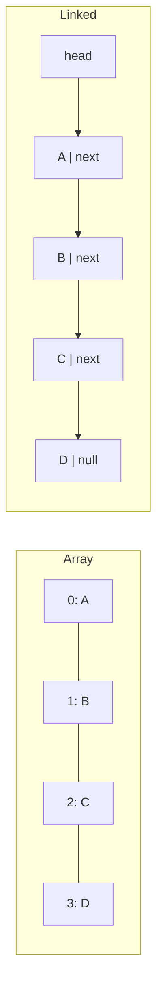

<TLDR>
  <TLDRCell label="what">
    数组把带索引的槽位放在一个逻辑连续块中；链表则用链接连接彼此独立的节点。
  </TLDRCell>
  <TLDRCell label="trap">
    链表不能让任意位置的插入都变成常数时间：除非已经持有正确节点，否则定位位置仍需要线性遍历。
  </TLDRCell>
  <TLDRCell label="fix">
    先确定主要操作与内存预算。按索引访问和遍历通常优先选数组；若稳定节点句柄和频繁局部改链更重要，再使用链式节点。
  </TLDRCell>
</TLDR>

## 是什么，为什么存在

数组与<Term id="linked-list">链表（linked list）</Term>都能表示有序序列，但两者组织存储的方式不同。数组为每个元素提供一个整数位置，所有槽位在逻辑上连续。链表把每个元素放入节点，节点记录下一个节点；双向链表还会记录前一个节点。

这种表示方式决定了哪些工作可以直接完成，哪些工作必须遍历或搬移数据。给定有效索引后，数组不必访问之前的元素就能算出目标槽位。链表要从已知节点开始沿链接前进，因此到达位置`i`通常需要访问前面的每个节点。

修改操作会反转部分取舍。数组在中间插入元素时，为了保持索引顺序，需要移动后面的元素。若已经知道链表的前驱或目标节点，插入与删除只需修改固定数量的链接；若节点未知，查找成本可能成为整个操作的主要成本。

“数组”包含两种紧密相关的形式。固定数组在分配存储时确定长度。<Term id="dynamic-array">动态数组（dynamic array）</Term>常用作可增长向量的底层实现，它同时记录逻辑长度与容量，并在必要时分配更大的底层区域。

链表可以是单向、双向或循环结构。单向节点使用较少的链接存储，适合向前移动。双向节点为每个节点多付出一个链接，使已知节点可以脱离链表，也允许双向遍历。

队列、编辑器、调度器、缓存、邻接表和运行时集合中都会遇到这种选择。多数应用代码应先使用语言提供的标准集合，因为标准集合已经定义边界情况与迭代行为。当某项操作成为热点、对延迟敏感或占用大量内存时，底层模型仍会直接影响结果。

同一种抽象序列也可以使用双端队列、环形缓冲区、树、间隙缓冲区或分块结构。“数组还是链表”只是一套初始成本模型，并不会排除这些替代方案。选择应来自实际工作负载，而不是集合名称。

可运行示例使用JavaScript，因为本地提供Node 24。JavaScript `Array`规定的是索引行为，不保证永久不变的原始内存布局；引擎可以切换内部表示。链表节点则是普通对象，因此示例展示的是访问路径与不变量，不承诺精确字节布局。

## 工作原理

对于使用固定宽度槽位的传统连续数组，元素`i`的地址可由`base + i × stride`得到。访问前部或后部的有效索引，需要的计算步骤相同。实现可以在外层执行边界检查，但不必遍历元素`0`到`i - 1`。

因此，数组支持`O(1)`随机访问。读取或替换一个已知槽位同样是`O(1)`。在无序数组中按值查找仍为`O(n)`，因为能直接访问索引，不等于知道某个未知值位于哪个索引。

链表把导航信息与数据一起存储。它的头部标识第一个节点，每个`next`链接再标识后继节点。位置隐含在路径之中：从头部到达第四个节点，需要跟随三次链接。



图中表示的是逻辑相邻关系。数组槽位组成可按索引访问的连续序列。链式节点只要求链接有效，所以即使遍历时表现为一个序列，分配器也可能把节点放在相距很远的位置。

### 访问与查找

讨论访问时，必须说明使用哪种键。“取得第500项”已经给出索引，因此数组占优。“取得订单A-107的节点”则需要在无序数组或普通链表中扫描，除非另一个索引结构把订单ID映射到位置或节点，例如哈希映射。

两种结构的顺序遍历都是`O(n)`。这个渐进结果隐藏了<Term id="cache-locality">缓存局部性（cache locality）</Term>：处理器通常会一起取回相邻的数组槽位，而单独分配的节点可能需要访问互不相邻的内存。实际行为取决于元素大小、运行时表示、分配器与硬件，所以在声称具体延迟前，应测量部署环境中的实现。

二分查找需要高效访问中间位置。它在已排序数组中进行`O(log n)`次比较，而且每次都能直接跳到中点。链表不能按索引完成这些跳转，因此二分查找不会把普通链表的按位置遍历变成`O(log n)`。

### 插入与删除

在数组索引`i`插入元素时，从`i`开始的元素需要以新索引保持原顺序。受影响槽位的数量会随尾部长度增加，因此中部与头部插入是`O(n)`。删除元素会产生相应的左移。

链表插入只修改一个很小的局部范围。对于单向链表，在已知节点后插入时，先让新节点指向原后继，再让前驱指向新节点。这些链接更新是`O(1)`，与链表总长度无关。

“已知节点”是关键条件。如果API只收到数字位置或元素值，它可能要先花`O(n)`从头部开始遍历。复杂度说明应同时包含查找与修改，不能只引用最后几次指针赋值。

从双向链表移除已知节点时，可以在`O(1)`内重新连接其前驱与后继。单向链表通常需要前驱，而不仅是目标节点，因为它必须修改前驱的`next`链接。保存节点句柄不会消除这种区别。

### 增长与摊还

固定数组无法原地增长到超过已分配区域。动态数组保留空余容量，因此许多追加操作只需填入下一个空槽位。容量耗尽时，它会分配更大的区域，复制或移动已有元素，然后再追加新元素。

因此，某一次触发扩容的追加可能耗费`O(n)`。如果容量按几何比例增长，那么在很长的操作序列中，总复制量与追加次数成正比，从而使每次追加得到`O(1)`的<Term id="amortized-complexity">摊还复杂度（amortized complexity）</Term>。“摊还”不表示每一次追加的延迟都是常数。

链表通常为每次插入单独分配节点，除非节点来自对象池或区域分配器。增长时它不必复制序列的其他部分，却要为每个节点支付分配管理成本和链接存储。大量小型分配的成本可能超过省下的复制成本。

### 头部、尾部与不变量

实用的链式集合会保存操作所需的端点。同时持有`head`与`tail`的队列，可以在尾部入队并在头部出队，两项操作都是`O(1)`。若单向链表只有头部，追加到末尾就需要遍历整个链表，除非接口选择在头部插入。

空链表与单节点链表之间的转换需要明确规则。移除队列的最后一个节点后，`head`与`tail`都必须为`null`。向空队列添加节点时，两个端点都必须指向新节点。

对于双向链表，每条前向链接都应与相应的后向链接一致。若`a.next`是`b`，则除非位于有明确约定的哨兵边界，`b.previous`应为`a`。每次成功插入或删除都必须让长度元数据恰好变化一次。

### 初步决策表

| 需求 | 数组倾向 | 链表倾向 |
| --- | --- | --- |
| 频繁按整数索引访问 | 直接`O(1)`查找 | 从端点开始`O(n)`遍历 |
| 顺序扫描 | 紧凑的访问路径 | 逐个跟随链接的访问路径 |
| 在数字表示的中间位置插入 | 直接定位，再用`O(n)`移动 | 用`O(n)`遍历，再以`O(1)`改链 |
| 在已有节点句柄后插入 | 可能需要转换位置 | 以`O(1)`改链 |
| 追加 | 动态数组摊还为`O(1)` | 保存尾部时为`O(1)` |
| 每个元素的元数据 | 通常没有逐元素链接 | 每个节点带一或两个链接 |
| 相邻位置修改后的稳定节点身份 | 取决于具体表示 | 节点仍在链上时自然稳定 |

这些只是倾向，不是完整实现契约。双端队列可以避免数组头部移动，紧凑链式结构可以改善局部性，运行时也可能优化特殊情况。应阅读所选集合的文档，并分析真实访问分布。

## 示例

下面的示例从按位置访问开始，再展示局部插入，最后实现带有明确端点不变量的队列。每个文件都用本地Node 24运行，输出块来自对应进程的实际输出。

### 对比按位置访问的路径

数组表达式直接访问索引`3`。`linkedAt()`必须从`head`开始并统计访问的节点，使隐藏的遍历过程变得可见。

<Depth level="quick">

```javascript run title="index_access.js"
class Node {
  constructor(value, next = null) {
    this.value = value;
    this.next = next;
  }
}

function linkedAt(head, index) {
  let node = head;
  let hops = 0;

  while (node !== null && hops < index) {
    node = node.next;
    hops += 1;
  }

  if (node === null) throw new RangeError("index out of range");
  return { value: node.value, visited: hops + 1 };
}

const orderIds = ["A-104", "A-105", "A-106", "A-107"];
const head = new Node(
  "A-104",
  new Node("A-105", new Node("A-106", new Node("A-107"))),
);

const linkedResult = linkedAt(head, 3);
console.log(`array[3]: ${orderIds[3]}`);
console.log(`linked at 3: ${linkedResult.value}`);
console.log(`linked nodes visited: ${linkedResult.visited}`);
```

```text
array[3]: A-107
linked at 3: A-107
linked nodes visited: 4
```

<TryToBreak items={['索引0', '等于集合长度的索引', '负数索引']} />

</Depth>

两种结构返回了同一个订单ID，但完成的工作不同。链式函数为了取得位置`3`，访问了四个节点；索引越大，遍历越长。它的范围检查还表明，API必须明确负数索引的语义，不能悄悄把负数当成零。

为了保持示例简短，构造链表后没有再修改链接；节点属性本身仍然可变。生产代码应把改链操作隐藏在集合方法之后，避免调用方意外创建环或断开后半段链表。

### 分离查找成本与改链成本

两种集合都在`"running"`与`"done"`之间插入`"paused"`。数组已经知道数字索引`2`；链式版本则已经持有`running`节点，这正是常数时间插入成立的条件。

```javascript run title="middle_insert.js"
function insertIntoArray(items, index, value) {
  const shiftedSlots = items.length - index;
  items.splice(index, 0, value);
  return shiftedSlots;
}

function insertAfter(node, value) {
  const inserted = { value, next: node.next };
  node.next = inserted;
  return inserted;
}

function linkedValues(head) {
  const values = [];
  for (let node = head; node !== null; node = node.next) {
    values.push(node.value);
  }
  return values;
}

const arrayJobs = ["queued", "running", "done"];
const shifted = insertIntoArray(arrayJobs, 2, "paused");

const done = { value: "done", next: null };
const running = { value: "running", next: done };
const linkedJobs = { value: "queued", next: running };
insertAfter(running, "paused");

console.log(`array: ${arrayJobs.join(" -> ")}`);
console.log(`array indexed slots changed: ${shifted}`);
console.log(`linked: ${linkedValues(linkedJobs).join(" -> ")}`);
console.log("linked predecessor already known: yes");
```

```text
array: queued -> running -> paused -> done
array indexed slots changed: 1
linked: queued -> running -> paused -> done
linked predecessor already known: yes
```

数组函数返回的数量表示本次调用影响的索引后缀，不描述Node内部采取的物理复制策略。JavaScript的`splice()`保证有序索引行为，引擎仍可自由选择数组内部表示。在逻辑层面，这个三元素示例中有一个旧槽位改变了索引。

无论链表多长，链式插入都只赋值两个`next`引用。如果调用方给出的只是`"running"`，而不是节点对象，普通链表仍需扫描才能找到前驱。可以另外建立从任务ID到节点的映射来消除扫描，但它会增加内存占用和一致性维护成本。

### 维护链式队列

这个队列同时保存两个端点和当前大小。最后一次移除会重置尾部，因此下一次入队可以从有效的空状态开始，不会连接到已经脱离队列的节点。

```javascript run title="job_queue.js"
class LinkedQueue {
  #head = null;
  #tail = null;
  size = 0;

  enqueue(value) {
    const node = { value, next: null };
    if (this.#tail === null) {
      this.#head = node;
    } else {
      this.#tail.next = node;
    }
    this.#tail = node;
    this.size += 1;
  }

  dequeue() {
    if (this.#head === null) return undefined;
    const value = this.#head.value;
    this.#head = this.#head.next;
    this.size -= 1;
    if (this.#head === null) this.#tail = null;
    return value;
  }

}

const jobs = new LinkedQueue();
for (const job of ["thumbnail", "search-index", "receipt"]) {
  jobs.enqueue(job);
}

console.log(`next: ${jobs.dequeue()}`);
console.log(`remaining: ${jobs.size}`);
console.log(`next: ${jobs.dequeue()}`);
console.log(`next: ${jobs.dequeue()}`);
console.log(`empty: ${jobs.dequeue()}`);
console.log(`remaining: ${jobs.size}`);
```

```text
next: thumbnail
remaining: 2
next: search-index
next: receipt
empty: undefined
remaining: 0
```

因为两个端点都可直接访问，`enqueue()`与`dequeue()`只接触固定数量的链接。这里把空队列移除定义为返回`undefined`；API也可以选择抛出异常或返回带标签的结果，但如果`undefined`本身也可作为存储值，就必须明确区分两种情况。

链表不是高效队列的唯一表示。环形缓冲区使用数组存储和头尾索引，既避免反复删除头部，也保留局部性。应根据最大大小、增长方式、元素表示和目标运行时中的测量结果，在两者之间选择。

## 陷阱

### 只根据Big-O选择

> [!PITFALL]
> 已知节点后的链表插入是`O(1)`，因此链表看起来可能更好，但实际工作负载也许主要在扫描、按索引访问或分配节点。渐进记号不会体现缓存行为、分配开销和每个元素上的常数成本。

**修复方法：** 记录操作比例、集合大小与延迟要求。在目标运行时中使用代表性数据做基准测试；若集合很大，还要检查分配次数或内存剖析结果。

### 隐藏插入前的查找

> [!PITFALL]
> 如果API接收的是索引或元素值，“链表插入是常数时间”就不完整。走到前驱需要`O(n)`；对于单向链表，即使目标节点已知，删除时也可能仍需前驱。

**修复方法：** 明确每项操作的输入是索引、值、前驱、节点句柄还是迭代器。分别报告查找与改链成本，再按调用方实际使用的API合并成本。

### 破坏端点与链接不变量

> [!PITFALL]
> 生成的链表代码经常在移除最后一个节点后仍让`tail`指向旧节点，只更新`next`而不更新对应的`previous`，或者把长度减去两次。错误可能一直隐藏到链表变空或执行反向遍历时才出现。

**修复方法：** 集中管理改链操作，并在测试中的每次修改后断言不变量。覆盖空到单节点、单节点到空、头部、尾部、中部与重复删除等转换。

### 用数组头部删除实现队列

> [!PITFALL]
> 反复删除数组的索引`0`会暴露重新编号成本，并可能让长队列的完整排空产生二次方级别的逻辑工作。规模很小的测试队列通常发现不了这种增长趋势。

**修复方法：** 保存头部索引，使用环形缓冲区或双端队列，或者使用带尾部的链式队列。应按测量得到的策略偶尔压缩索引缓冲区，不要在每次出队时移动元素。

### 假定所有语言的数组都有同一种物理布局

> [!PITFALL]
> 某种语言的“数组”可能内联存值，也可能在底层区域保存引用、使用稀疏属性或采用多种优化元素类型。把JavaScript `Array`当成布局稳定的C风格字节缓冲区，会让内存与局部性结论失去依据。

**修复方法：** 区分抽象索引接口与具体实现。契约需要定宽数字存储时使用类型化数组，查阅运行时文档，并测量生产环境中的确切元素形状。

### 保留失效节点句柄

> [!PITFALL]
> 外部映射或调用方可能在节点脱离集合后继续保留它。再次用这个句柄插入，可能重新连接已经废弃的结构、绕过所有权检查或破坏长度元数据。

**修复方法：** 让节点句柄保持不透明，使脱离节点失效或留下明确标记，并在同一个修改边界内更新索引。测试对已删除句柄执行第二次操作，并规定它应该拒绝还是不做任何事。

<Depth level="deep">

## 超越Big-O的成本模型

Big-O描述工作量怎样增长，但集合选择还需要考虑所有权、布局和延迟约束。两个`O(n)`遍历可能以完全不同的方式访问内存，两个`O(1)`更新也可能具有不同的分配或同步成本。实用模型要说明计算了什么，并标出哪些事实取决于运行时。

### 一份具体的存储预算

假设一种简化机器模型使用8字节的值和8字节的引用。保存100,000个值的平面数组需要800,000字节的值槽位，不包含数组头与空余容量。这是建立在明确假设上的算术结果，不是对JavaScript对象的测量。

在同一个简化模型中，单独分配的单向链表节点至少需要一个8字节值与一个8字节链接。100,000个节点的这些字段共占1,600,000字节，还没有计算分配器元数据、对齐、对象头或外部头部引用。双向链表还会再增加800,000字节的链接字段。

真实运行时可能保存引用而不是内联值，压缩部分指针，对对象进行对齐，从对象池分配节点，或者以其他方式表示稀疏数组。这份预算仍然有用，因为它迫使设计者写出每个假定字段。在把总数用于容量规划前，应把假设替换成测得的对象大小或堆剖析数据。

数组空余容量同样属于内存开销。在相同的8字节槽位模型下，如果动态数组长度为60,000、容量为100,000，那么空槽位占320,000字节。这部分余量能让后续追加暂时不触发重新分配，本身不属于泄漏。

### 局部性为什么会影响遍历

处理器按缓存行搬运内存，不会在每条指令中只取一个孤立的语言级值。如果连续数组槽位位于相邻地址，一次取回就可能让后续槽位进入处理器缓存。硬件预取也能识别有规律的前向访问模式。

单独分配的节点可能不在同一个缓存行中，而且只有读到当前节点的链接后，才能知道下一个地址。这条依赖链会限制执行过程提前读取数据。它解释了为什么相同的`O(n)`标签不表示相同遍历时间，但不能给出普遍适用的速度比例。

元素大小可能改变结果。很大的内联记录会增加移动成本；引用数组的槽位较小，但之后的代码仍需访问分散对象。节点池或展开链表可以把多个逻辑节点放在一起，从而恢复部分局部性。

基准测试必须保留应用真正执行的操作。对一百万个数字求和只测量遍历，不能说明插入已知节点的情况。反复在头部插入也不能说明随机查找成本，或删除后仍然保留多少内存。

### 扩容延迟与摊还成本

考虑按`1, 2, 4, 8`几何增长的容量。追加八个元素时，各次扩容可能总共移动`1 + 2 + 4 = 7`个已有元素。虽然其中一次追加移动了四个旧元素，但总移动量仍与八次成功追加成正比。

这就是几何增长下追加操作具有摊还常数成本的依据。增长系数太接近一，会更频繁地重新分配和复制；较大的系数则可能留下更多未用容量。具体策略属于所用集合的实现，不属于抽象动态数组定义。

如果系统有严格的单次延迟预算，摊还成本可能仍不可接受，因为高成本扩容依然集中在一次操作中。预留已知容量、使用定长分块或选择有界环形缓冲区，可以转移这种风险。每种方案都会用内存、最大大小或实现复杂度换取不同的延迟形态。

### 句柄与迭代器稳定性

数组插入会改变所有后续元素的数字位置。在系统语言中，重新分配还可能按照容器契约，使指向旧底层区域的指针、引用或迭代器失效。JavaScript不暴露元素的原始地址，但插入或排序后，已保存的数字索引仍可能指向另一个逻辑元素。

相邻位置插入或删除后，链式节点的身份仍可保持稳定，这对需要在其他结构中保存节点句柄的设计很有用。只有所有权规则仍允许使用该节点时，这种稳定性才成立。节点脱离链表后，句柄需要明确的失效策略。

外部句柄也会限制实现变更。如果调用方依赖对象身份，集合就不能随意压缩或替换节点。把句柄隐藏在API后，可以为以后加入对象池、代际计数器或不同表示留下空间。

### 变体会改变操作表

环形缓冲区把元素放在数组中，同时对头尾索引按容量取模。它避免每次队列操作都移动元素，也保留数组式存储。如果最大容量已经是领域规则，有界队列往往适合这种结构。

双端队列通常使用分段或环形表示，让两个端点都能高效操作。间隙缓冲区把空闲空间留在编辑光标附近，在光标没有长距离移动时可以低成本插入文本。展开链表在每个节点中存放多个元素，能够减少链接开销并提高局部性。

侵入式链表把链接放进已经存在的对象，而不是额外分配包装节点。它可以减少分配开销，却让对象与链表成员关系耦合，也使同时加入多个链表变得复杂。所有权与生命周期规则会成为数据结构安全契约的一部分。

没有任何变体能消除所有取舍。为链表增加索引映射可以加快按键查找，但它复制了一份状态，每次插入与删除都必须更新。分块可以改善局部性，却会让块的拆分、合并与块内索引变复杂。

### 从工作负载推导选择

先记录操作轨迹，不要先表达通用偏好。统计按索引读取、完整扫描、按值查找、追加、端点操作、中部修改，以及调用方已经持有节点句柄的次数。同时记录集合大小的典型值与高百分位值。

接着写出非时间约束，包括严格内存预算、稳定句柄、有界容量、可预测的单次延迟、序列化格式、并发所有权，以及语言中可用的标准集合。一个理论上有吸引力的结构，可能会立刻违反其中某项契约。

只有在候选结构与约束都明确后，才使用代表性基准测试。若生产环境需要承担构造与清理成本，测试也要包含它们；同时要防止优化器丢弃结果，并在需要时预热JIT。应报告结果分布，而不是只报告最好的一次运行，并把基准测试与决策一起保留，方便运行时升级后复测。

默认选择往往仍是动态数组，因为它简单、可索引、紧凑，而且标准库支持良好。这只是一项初始假设，不是证明。只有应用确实具有稳定节点位置、局部修改或无需重复查找的拼接模式时，链式表示多付出的链接成本才可能有回报。

### 测试结构正确性

数组封装应测试边界、长度与容量关系、移动后的顺序，以及增长发生时的行为。除非公开契约承诺具体容量策略，否则测试不应依赖它。否则，实现改进反而会造成错误的测试失败。

检查单向链表时，可以从头部开始遍历，统计可达节点，并在不允许环时检测循环。可达数量应等于存储的长度；如果保存了尾部，最后一个可达节点应与`tail`相同。空链表不应保留任何有效端点。

双向链表需要执行相同的前向检查，并增加反向遍历。每一对相邻节点的前向与后向链接都必须一致。移除节点后，应根据选定句柄策略断开链接或使句柄失效。

基于属性的测试可以生成一系列插入与删除，把可见结果同简单参考序列比较，并在每次操作后检查不变量。这种方法能捕获手工挑选的正常路径遗漏的转换组合，尤其适合发现重复删除与空边界错误。

</Depth>

<Checkpoint id="foundations/arrays-and-linked-lists" />

## 延伸阅读

- [ECMAScript语言规范：Array对象](https://tc39.es/ecma262/multipage/indexed-collections.html#sec-array-objects)
- [MDN Web Docs：`Array`](https://developer.mozilla.org/en-US/docs/Web/JavaScript/Reference/Global_Objects/Array)
- [V8：元素类型](https://v8.dev/blog/elements-kinds)
- [NIST算法与数据结构词典：数组](https://xlinux.nist.gov/dads/HTML/array.html)
- [NIST算法与数据结构词典：链表](https://xlinux.nist.gov/dads/HTML/linkedList.html)
