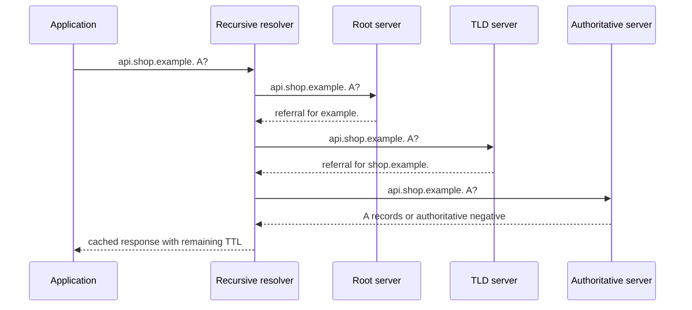

<TLDR>
  <TLDRCell label="what">
    DNS resolution turns a name and record type into a bounded answer by consulting caches and, when needed, the DNS hierarchy.
  </TLDRCell>
  <TLDRCell label="trap">
    An address is not permanent, `NXDOMAIN` is not a timeout, and a successful DNS answer does not prove that an application service is reachable.
  </TLDRCell>
  <TLDRCell label="fix">
    Preserve record type, response code, TTL, and resolver identity in diagnostics; retry only transient failures and let caches expire answers by policy.
  </TLDRCell>
</TLDR>

## What it is and why it exists

DNS resolution maps a domain name and query type to DNS data. Most applications ask for addresses, but DNS also carries delegation, mail-routing, service, verification, and alias information. The result is a set of records with a lifetime and a status, not a permanent name-to-IP dictionary entry.

A typical application does not walk the public hierarchy itself. Its stub resolver sends a question to a <Term id="dns-resolver">recursive resolver</Term>, often supplied by an operating system, local network, cloud platform, or public DNS service. That resolver returns a cached result or performs the upstream work needed to produce one.

An <Term id="authoritative-dns-server">authoritative DNS server</Term> answers from data for zones it serves. It does not normally search the hierarchy on behalf of arbitrary clients. Separating recursive lookup from authoritative publication lets many clients share caches while each zone owner controls its own namespace.

You encounter resolution before an HTTP request, TLS handshake, database connection, mail delivery, or service discovery attempt. If resolution fails, no transport connection to the intended host starts. If it returns an old or unintended address, later failures can look like a TCP, TLS, proxy, or application defect.

### Names and zones

A DNS name is a sequence of labels. The absolute form ends at the root and is often written with a trailing dot, such as `api.shop.example.`. User-facing tools commonly omit that final dot and may apply a search suffix, so diagnostic output should distinguish the name typed by a user from the absolute name actually queried.

The namespace is divided into zones, not one zone per label. A parent zone can delegate a child by publishing `NS` records. The child zone's authoritative servers then publish records below that delegation until another delegation or the end of the name is reached.

A zone boundary is an administrative boundary. It does not imply a network hop, a distinct organization, or a separate server process. One server can be authoritative for many zones, and one zone should have multiple authoritative servers.

### Questions and resource records

A DNS question includes at least a name, type, and class. Internet DNS usually uses class `IN`. The name `api.shop.example.` queried as type `A` is therefore a different cache key from the same name queried as `AAAA`.

A <Term id="dns-resource-record">DNS resource record</Term> has an owner name, type, class, TTL, and type-specific data. A response can contain answer, authority, and additional sections. Records with the same owner, type, and class form a record set whose members are normally cached together.

Common types have different meanings:

| Type | Data | Typical use |
| --- | --- | --- |
| `A` | IPv4 address | IPv4 connection candidate |
| `AAAA` | IPv6 address | IPv6 connection candidate |
| `CNAME` | Canonical target name | Alias one owner name to another |
| `NS` | Authoritative server name | Delegate or describe a zone |
| `MX` | Preference and mail server | Route mail for a domain |
| `TXT` | One or more text strings | Publish protocol-specific metadata |
| `SOA` | Zone authority and timing data | Mark zone authority and support negative caching |

DNS transports structured records; their interpretation belongs to the client protocol. A `TXT` value does not become trustworthy merely because DNS delivered it. Protocols that need authenticity require DNSSEC validation or another authenticated channel, depending on their threat model.

### Resolution is one stage

Name resolution supplies candidates to the next networking stage. A client may receive IPv6 and IPv4 addresses, order them according to local policy, and try more than one under an overall connection deadline. DNS success therefore does not guarantee that a socket can connect, TLS can validate the hostname, or the server will accept an application request.

The reverse distinction matters too. A connection to a literal IP address can work while a name fails to resolve, but replacing the name with that address is not a general fix. It bypasses DNS-based routing changes and may break TLS Server Name Indication, certificate checks, HTTP virtual hosting, or provider failover.

## How it works

### Stub, recursive, and authoritative roles

The application usually calls an operating-system or runtime API. A system lookup API may consult `/etc/hosts`, multicast mechanisms, enterprise directories, and DNS according to local configuration. A DNS-specific API sends DNS questions and does not necessarily behave like the system lookup path.

On a cache miss, a recursive resolver can start with a root-server address it already knows. The root returns a referral toward the relevant top-level domain. That server returns a referral toward the child zone, and an authoritative server for the child finally returns an answer or an authoritative negative result.



A referral contains `NS` records in the authority section. It may also include address records for those server names in the additional section. Such glue is necessary when resolving the server's name would otherwise depend on entering the very child zone being delegated.

Resolvers must treat referrals and glue according to their delegation context. Additional data is not a blanket authorization to cache arbitrary answers. Bailiwick rules and DNSSEC validation constrain which data may influence later resolution.

### Aliases and address candidates

A `CNAME` says that its owner is an alias for another name. A resolver follows the target until it reaches data for the requested type, an error, or a safety limit. Every alias hop can have its own TTL, and loops or excessive chains must fail instead of consuming unbounded work.

The canonical target can have several `A` or `AAAA` records. Clients should not assume the first address is permanent or universally best. Record ordering can vary, and an address can remain valid DNS data while the service behind it is temporarily unreachable.

Other record types have their own selection rules. `MX` includes a preference value; `SRV` includes priority and weight. Treating every answer as an unordered string list discards protocol semantics.

### Cache entries and TTLs

The <Term id="dns-time-to-live">DNS time to live</Term> is the maximum time, in seconds, that a received record may normally remain cached. A resolver decreases the TTL as time passes. When the entry expires, it must refresh before serving it as a current answer, unless an explicitly bounded stale-answer policy applies.

TTL is not a promise that every client will observe a change after exactly that many seconds. Caches receive an answer at different times, applications may add their own caches, and long-lived connections keep using an already selected endpoint. A rollout must account for all of those layers.

A cache key includes the question name, type, and class, along with resolver-specific policy context. An `A` answer cannot satisfy an `AAAA` question. Similarly, an answer obtained through one split-horizon view must not leak into another tenant or network view.

### Negative answers

<Term id="negative-dns-caching">Negative DNS caching</Term> stores authoritative evidence that a name or requested data does not exist. `NXDOMAIN` means the queried name does not exist. A `NOERROR` response with no requested records, often called NODATA, means the name exists but has no data of that type.

Those outcomes are not interchangeable. `NXDOMAIN` can apply across record types for the name, while NODATA is specific to the requested type. Authoritative negative responses use the zone's `SOA` information to bound their negative cache lifetime.

`SERVFAIL`, refusal, malformed responses, and timeouts do not prove non-existence. They describe failure to obtain a usable answer. A retry policy may try another configured recursive resolver or authoritative server, but it must stay within an operation deadline and avoid turning a dependency failure into a retry storm.

### Transport and validation

Classic DNS commonly uses UDP for compact questions and responses, with TCP available when needed. Modern deployments may also carry DNS over TLS or HTTPS between a client and recursive resolver. Changing the transport protects a different boundary; it does not make an unsigned authoritative answer intrinsically authentic.

DNSSEC adds signatures and a chain of trust that a validating resolver can check. Validation can produce secure, insecure, or bogus outcomes depending on delegation and signatures. A DNSSEC validation failure is commonly surfaced as `SERVFAIL`, so useful resolver diagnostics preserve the extended reason when available.

## Examples

The examples use documentation-only `.test` names and reserved address ranges. They model actual DNS fields without sending traffic, which keeps the output repeatable and makes every cache transition visible.

### Inspect an alias answer

This response contains a `CNAME` followed by IPv4 and IPv6 records for its target. The summary retains both candidates and uses the smallest TTL across the data it depends on.

<Depth level="quick">

```javascript run title="inspect_answer.js"
const response = {
  rcode: "NOERROR",
  answers: [
    { name: "www.shop.test.", type: "CNAME", ttl: 300, data: "edge.shop.test." },
    { name: "edge.shop.test.", type: "A", ttl: 120, data: "192.0.2.44" },
    { name: "edge.shop.test.", type: "AAAA", ttl: 60, data: "2001:db8::44" },
  ],
};

function summarize(message, originalName) {
  if (message.rcode !== "NOERROR") throw new Error(message.rcode);
  let canonicalName = originalName;
  const chainTtls = [];

  for (const record of message.answers) {
    if (record.type === "CNAME" && record.name === canonicalName) {
      canonicalName = record.data;
      chainTtls.push(record.ttl);
    }
  }

  const addresses = message.answers.filter(
    (record) => record.name === canonicalName && ["A", "AAAA"].includes(record.type),
  );
  const effectiveTtl = Math.min(...chainTtls, ...addresses.map((record) => record.ttl));
  return { canonicalName, addresses, effectiveTtl };
}

const result = summarize(response, "www.shop.test.");
console.log(`canonical=${result.canonicalName}`);
console.log(`addresses=${result.addresses.map((record) => record.data).join(", ")}`);
console.log(`effective ttl=${result.effectiveTtl}s`);
```

```text
canonical=edge.shop.test.
addresses=192.0.2.44, 2001:db8::44
effective ttl=60s
```

<TryToBreak items={['a CNAME loop', 'an answer with no address records', 'a zero-second TTL']} />

</Depth>

The smallest dependent TTL is conservative for this combined application result. A production DNS library often exposes `A` and `AAAA` lookups separately, and a client may cache each record set independently. The example also needs a loop limit before accepting untrusted response data.

### Follow referrals

This miniature iterative resolver starts from a root address, follows two referrals, and stops at an authoritative answer. The maps stand in for wire responses so the control flow is visible without relying on public DNS.

```javascript run title="follow_referrals.js"
const replies = new Map([
  ["198.41.0.4", { kind: "referral", zone: "test.", ns: "ns.test.", address: "192.0.2.53" }],
  ["192.0.2.53", { kind: "referral", zone: "shop.test.", ns: "ns.shop.test.", address: "198.51.100.53" }],
  ["198.51.100.53", { kind: "answer", name: "api.shop.test.", type: "A", data: "203.0.113.80", ttl: 30 }],
]);

function resolveIteratively(name, type) {
  let server = "198.41.0.4";

  for (let hop = 0; hop < 8; hop += 1) {
    console.log(`ask ${server} for ${name} ${type}`);
    const reply = replies.get(server);
    if (!reply) throw new Error("no response configured");

    if (reply.kind === "answer") {
      console.log(`answer ${reply.data} ttl=${reply.ttl}`);
      return reply;
    }

    console.log(`referral ${reply.zone} via ${reply.ns}`);
    server = reply.address;
  }

  throw new Error("referral limit exceeded");
}

resolveIteratively("api.shop.test.", "A");
```

```text
ask 198.41.0.4 for api.shop.test. A
referral test. via ns.test.
ask 192.0.2.53 for api.shop.test. A
referral shop.test. via ns.shop.test.
ask 198.51.100.53 for api.shop.test. A
answer 203.0.113.80 ttl=30
```

Real resolvers cache referrals, try multiple server addresses, match replies to questions, validate message structure, and enforce deadlines. The eight-hop guard illustrates one required bound; it is not a DNS protocol constant.

### Expire positive and negative entries

The cache stores positive answers by name and type, but stores `NXDOMAIN` by name. Advancing the manual clock shows a positive hit, positive expiry, cross-type negative hit, and negative expiry.

```javascript run title="ttl_cache.js"
let now = 0;
let upstreamQueries = 0;
const positive = new Map();
const negative = new Map();
function upstream(name, type) {
  upstreamQueries += 1;
  if (name === "missing.shop.test.") return { rcode: "NXDOMAIN", ttl: 10 };
  return { rcode: "NOERROR", value: "192.0.2.44", type, ttl: 30 };
}
function resolve(name, type) {
  const negativeHit = negative.get(name);
  if (negativeHit && negativeHit.expiresAt > now) {
    return { ...negativeHit.response, source: "cache" };
  }
  const key = `${name}|${type}`;
  const positiveHit = positive.get(key);
  if (positiveHit && positiveHit.expiresAt > now) {
    return { ...positiveHit.response, source: "cache" };
  }
  const response = upstream(name, type);
  const entry = { response, expiresAt: now + response.ttl };
  if (response.rcode === "NXDOMAIN") negative.set(name, entry);
  else positive.set(key, entry);
  return { ...response, source: "upstream" };
}
function show(name, type) {
  const result = resolve(name, type);
  console.log(`t=${now} ${name} ${type}: ${result.rcode} ${result.source}`);
}
show("api.shop.test.", "A");
now = 20;
show("api.shop.test.", "A");
now = 31;
show("api.shop.test.", "A");
show("missing.shop.test.", "A");
now = 36;
show("missing.shop.test.", "AAAA");
now = 42;
show("missing.shop.test.", "AAAA");
console.log(`upstream queries=${upstreamQueries}`);
```

```text
t=0 api.shop.test. A: NOERROR upstream
t=20 api.shop.test. A: NOERROR cache
t=31 api.shop.test. A: NOERROR upstream
t=31 missing.shop.test. A: NXDOMAIN upstream
t=36 missing.shop.test. AAAA: NXDOMAIN cache
t=42 missing.shop.test. AAAA: NXDOMAIN upstream
upstream queries=4
```

The example uses an already-derived negative TTL. A real resolver derives the permitted lifetime from an authoritative negative response and caps it by local policy. NODATA would need a different key because absence of `A` data does not imply absence of `AAAA` data.

## Pitfalls

> [!PITFALL]
> Treating every resolution failure as “host not found.” `NXDOMAIN`, NODATA, `SERVFAIL`, `REFUSED`, timeout, and local configuration errors describe different states and have different retry behavior.
>
> **Fix:** log the queried absolute name, type, resolver, response code, latency, and extended error when available. Retry bounded transient failures; do not retry authoritative non-existence as if it were packet loss.

> [!PITFALL]
> Caching an address forever in application state. A process can outlive a deployment's DNS TTL and keep sending traffic to a retired endpoint even though the shared resolver has fresh data.
>
> **Fix:** prefer runtime connection APIs that resolve according to system policy, or implement an explicit <Term id="cache-policy">cache policy</Term> that preserves TTLs, negative states, scope, and eviction. Re-resolve when the policy expires, not on every packet and not never.

> [!PITFALL]
> Assuming a low TTL makes a migration instantaneous. Existing cache entries expire at different times, and connection pools, HTTP keep-alive, and application caches may continue using old endpoints.
>
> **Fix:** lower TTL before the migration, wait through the previous TTL, keep old and new endpoints healthy during overlap, and measure queries plus traffic at both destinations. Include long-lived connection lifetime in the cutover plan.

> [!PITFALL]
> Replacing a hostname with an IP address when debugging. The direct connection may bypass a DNS fault but can also change TLS SNI, certificate hostname validation, HTTP `Host`, load-balancer routing, and failover behavior.
>
> **Fix:** isolate each stage while preserving the original hostname semantics. Query the intended resolver, then connect to a chosen address while still sending the correct SNI and application host only in a controlled diagnostic tool.

> [!PITFALL]
> Accepting an IP once and using it later for a security decision. DNS rebinding or an ordinary record change can make validation inspect one destination while the connection reaches another.
>
> **Fix:** resolve and validate every candidate at the connection boundary, pin the validated address to that connection, and apply network egress controls. Reject private, loopback, link-local, and otherwise forbidden ranges after parsing IPv4 and IPv6 forms.

> [!PITFALL]
> Publishing an incomplete delegation or changing authoritative data without checking the parent. Correct records on one server do not help if the parent lists different name servers, glue is stale, or authoritative replicas disagree.
>
> **Fix:** query the parent and every authoritative server directly for `NS`, `SOA`, and changed records. Confirm serial progression, glue, DNSSEC state, and answers from multiple networks before declaring the rollout complete.

<Depth level="deep">

## Cache correctness under change

A resolver cache is a set of timed claims, not a copy of a zone. Each entry records the question, response data or negative state, expiry, and policy context. Correctness depends on how those entries interact when aliases, delegations, or views change.

### TTL is an upper bound on current data

If an answer arrives with TTL 300, a cache can normally serve it for at most 300 seconds from receipt. A downstream cache receives the remaining TTL, not a fresh 300 seconds. Resetting the original TTL at every hop would let stale data survive indefinitely.

TTL zero permits use for the current transaction but prevents ordinary reuse. Very low TTLs increase upstream query load and make resolver availability more visible. Very high TTLs reduce query load but lengthen planned and accidental changes, so the value is an operational tradeoff rather than a universal constant.

An alias-derived result can depend on several record sets. A cache can store each set with its own expiry and reconstruct an answer from current pieces. An application that flattens the chain into one endpoint list needs an expiry no later than the earliest dependency.

### Negative state has scope

An authoritative `NXDOMAIN` denies the existence of the queried name, while NODATA denies one requested record type at an existing name. Caching both as `name -> no address` makes a later `AAAA` question incorrectly reuse an `A` NODATA result. Caching neither makes missing names repeatedly hit authoritative infrastructure.

Negative responses require authority evidence and a bounded lifetime. A timeout or `SERVFAIL` lacks that evidence and must not be promoted into `NXDOMAIN`. Some implementations briefly cache transient failures to dampen traffic, but that is a separate local failure-cache policy and must not be reported as authoritative non-existence.

### Stale answers are an availability choice

Serving stale data can preserve service when authoritative servers are temporarily unreachable. The resolver must first have a previously valid answer, recognize a qualifying resolution failure, and enforce explicit stale-retention and client-TTL bounds. It should attempt refresh and expose that stale data was used.

Stale serving changes the failure tradeoff; it does not make expired data current. It can direct clients to retired infrastructure or extend a bad record, so operators need a way to purge harmful entries and observe stale-answer rates. Security policy and validated DNSSEC state also constrain what may be served.

### Split views are part of the key

Split-horizon DNS returns different data according to network, tenant, or resolver context. A cache shared across those contexts can disclose internal names or route public users to private addresses. The view identity therefore belongs beside the DNS question in the effective cache key.

The same rule applies to policy that changes answers, such as filtering, synthesis, or search-domain expansion. Diagnostics should name the resolver and resulting absolute question. Comparing answers from two tools is meaningful only after confirming they used the same lookup path and view.

Useful cache metrics separate fresh hits, negative hits, refreshes, stale answers, and upstream failure classes. One combined “DNS cache hit” counter hides the state needed to explain a rollout or outage.

</Depth>

<Checkpoint id="foundations/dns-resolution" />

## Further reading

- [RFC 1034 — Domain Names: Concepts and Facilities](https://www.rfc-editor.org/rfc/rfc1034.html)
- [RFC 1035 — Domain Names: Implementation and Specification](https://www.rfc-editor.org/rfc/rfc1035.html)
- [RFC 2308 — Negative Caching of DNS Queries](https://www.rfc-editor.org/rfc/rfc2308.html)
- [RFC 8767 — Serving Stale Data to Improve DNS Resiliency](https://www.rfc-editor.org/rfc/rfc8767.html)
- [Node.js v24 DNS documentation](https://nodejs.org/docs/latest-v24.x/api/dns.html)
