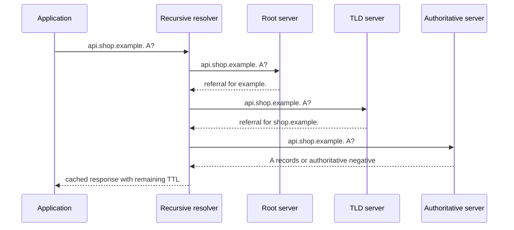

<TLDR>
  <TLDRCell label="what">
    DNS 解析根据名称和记录类型查询缓存，并在必要时访问 DNS 层级，最终得到有明确边界的答案。
  </TLDRCell>
  <TLDRCell label="trap">
    地址并非永久不变，`NXDOMAIN` 不等于超时，DNS 成功返回也不能证明应用服务可以访问。
  </TLDRCell>
  <TLDRCell label="fix">
    诊断时保留记录类型、响应码、TTL 和解析器身份；只重试暂时性故障，并按策略让缓存答案过期。
  </TLDRCell>
</TLDR>

## 是什么，为什么存在

DNS 解析把域名和查询类型映射为 DNS 数据。应用最常查询地址，但 DNS 还承载委派、邮件路由、服务、验证和别名信息。结果是一组带有生存时间和状态的记录，不是永久不变的域名到 IP 字典条目。

普通应用不会自行遍历公共 DNS 层级。它的存根解析器（stub resolver）把问题交给 <Term id="dns-resolver">递归解析器（recursive resolver）</Term>，后者通常由操作系统、局域网、云平台或公共 DNS 服务提供。递归解析器会返回缓存结果，或执行得到答案所需的上游查询。

<Term id="authoritative-dns-server">权威 DNS 服务器（authoritative DNS server）</Term> 根据自身负责区域的数据回答问题，通常不会代替任意客户端搜索整个层级。递归查询与权威发布分离后，许多客户端可以共享缓存，而每个区域的所有者仍能控制自己的命名空间。

HTTP 请求、TLS 握手、数据库连接、邮件投递或服务发现开始前，都会遇到解析。解析失败时，客户端不会向目标主机发起传输连接。解析返回过期或非预期地址时，后续故障又很像 TCP、TLS、代理或应用缺陷。

### 名称与区域

DNS 名称由一组标签组成。绝对形式终止于根，书写时常带末尾点，例如 `api.shop.example.`。面向用户的工具往往省略最后的点，还可能追加搜索后缀，因此诊断输出应区分用户输入的名称与实际查询的绝对名称。

命名空间按区域划分，并非每个标签对应一个区域。父区域可以发布 `NS` 记录来委派子区域。此后，子区域的权威服务器负责发布该委派以下的记录，直到遇到另一项委派或名称末端。

区域边界是管理边界，并不表示一次网络跳转、一个独立组织或一个单独的服务器进程。一台服务器可以为多个区域提供权威服务，一个区域也应配置多台权威服务器。

### 问题与资源记录

DNS 问题至少包含名称、类型和类别。互联网 DNS 通常使用 `IN` 类别。因此，查询 `api.shop.example.` 的 `A` 类型与查询同一名称的 `AAAA` 类型使用不同缓存键。

一条 <Term id="dns-resource-record">DNS 资源记录（DNS resource record）</Term> 包含所有者名称、类型、类别、TTL 和类型专用数据。响应可以包含答案、权威和附加三个部分。所有者、类型和类别相同的记录构成一个记录集，通常作为整体缓存。

常见类型的含义各不相同：

| 类型 | 数据 | 常见用途 |
| --- | --- | --- |
| `A` | IPv4 地址 | IPv4 连接候选地址 |
| `AAAA` | IPv6 地址 | IPv6 连接候选地址 |
| `CNAME` | 规范目标名称 | 把一个所有者名称设为另一名称的别名 |
| `NS` | 权威服务器名称 | 委派或描述一个区域 |
| `MX` | 优先级与邮件服务器 | 为域名路由邮件 |
| `TXT` | 一个或多个文本字符串 | 发布协议专用元数据 |
| `SOA` | 区域权威与计时数据 | 标记区域权威并支持否定缓存 |

DNS 传送结构化记录，如何解释记录由客户端协议决定。`TXT` 值不会因为由 DNS 交付就自然可信。需要真实性的协议应按威胁模型使用 DNSSEC 验证或其他经过认证的通道。

### 解析只是一个阶段

名称解析为下一网络阶段提供候选地址。客户端可能同时收到 IPv6 与 IPv4 地址，按本地策略排序，并在一个总体连接截止时间内尝试多个地址。因此，DNS 成功不保证套接字能够连接、TLS 能够验证主机名，也不保证服务器会接受应用请求。

反向情况同样需要区分。直接连接 IP 地址可能成功，而名称解析失败，但用 IP 取代名称不是通用修复。这样会绕过基于 DNS 的路由变化，还可能破坏 TLS 服务器名称指示、证书检查、HTTP 虚拟主机或服务商故障转移。

## 工作原理

### 存根、递归与权威角色

应用通常调用操作系统或运行时 API。系统查找 API 可能根据本地配置查询 `/etc/hosts`、组播机制、企业目录和 DNS。DNS 专用 API 直接发送 DNS 问题，其行为不一定与系统查找路径相同。

缓存未命中时，递归解析器可以从预先掌握的根服务器地址开始。根服务器返回指向相关顶级域的转介，顶级域服务器再返回指向子区域的转介，最后由子区域的权威服务器返回答案或权威否定结果。



转介在权威部分包含 `NS` 记录，还可能在附加部分带上这些服务器名称的地址记录。如果解析服务器名称本身必须先进入正在委派的子区域，这类胶水记录（glue record）就是必需的。

解析器必须按照委派上下文处理转介和胶水记录。附加数据并不等于可以无条件缓存任意答案。域内规则（bailiwick rules）与 DNSSEC 验证会限制哪些数据能够影响后续解析。

### 别名与候选地址

`CNAME` 表示其所有者是另一名称的别名。解析器会沿目标继续查询，直到取得所需类型的数据、遇到错误或达到安全上限。每一跳别名都可以拥有自己的 TTL；遇到环或过长链条时必须失败，不能消耗无界资源。

规范目标可以有多条 `A` 或 `AAAA` 记录。客户端不能假定第一个地址永久不变或对所有位置都最优。记录顺序可能变化，而且地址在 DNS 中仍然有效时，其背后的服务也可能暂时无法访问。

其他记录类型有自己的选择规则。`MX` 带有优先级，`SRV` 带有优先级与权重。把所有答案都当成无序字符串列表会丢失协议语义。

### 缓存条目与 TTL

<Term id="dns-time-to-live">DNS 生存时间（DNS time to live）</Term> 以秒为单位，表示收到的记录通常最多可以缓存多久。解析器会随时间递减 TTL。条目过期后，必须刷新才能作为当前答案返回，除非存在明确且有界的过期数据策略。

TTL 并不承诺所有客户端恰好在相同秒数后看到变化。各级缓存在不同时间收到答案，应用可能另设缓存，长连接也会继续使用已经选定的端点。发布变更必须把这些层次全部纳入考虑。

缓存键包含问题名称、类型和类别，以及解析器的策略上下文。`A` 答案不能满足 `AAAA` 问题。同样，从一套分割视图取得的答案不能泄漏到另一个租户或网络视图。

### 否定答案

<Term id="negative-dns-caching">DNS 否定缓存（negative DNS caching）</Term> 保存名称不存在或所请求数据不存在的权威证据。`NXDOMAIN` 表示被查询名称不存在。响应码为 `NOERROR` 但不含所需记录的结果常称为 NODATA，表示名称存在，但没有该类型的数据。

两种结果不能互换。`NXDOMAIN` 可以跨记录类型作用于该名称，NODATA 则只针对请求的类型。权威否定响应利用区域的 `SOA` 信息限制否定缓存时间。

`SERVFAIL`、拒绝、畸形响应和超时都不能证明名称不存在。它们表示解析器未能取得可用答案。重试策略可以尝试另一台已配置的递归解析器或权威服务器，但必须服从操作截止时间，避免把依赖故障放大成重试风暴。

### 传输与验证

经典 DNS 通常用 UDP 承载较小的问题和响应，并在需要时使用 TCP。现代部署还可能在客户端与递归解析器之间使用 DNS over TLS 或 HTTPS。改变传输方式保护的是特定链路，并不会让未签名的权威答案天然具备真实性。

DNSSEC 增加签名和信任链，验证解析器可以检查它们。根据委派和签名状态，验证结果可能是安全、不安全或错误。DNSSEC 验证失败通常表现为 `SERVFAIL`，因此有条件时，解析器诊断应保留更具体的扩展原因。

## 示例

这些示例使用仅供文档使用的 `.test` 名称和保留地址段。它们对真实 DNS 字段建模，但不发送网络流量，使输出能够重复，也让每次缓存状态变化都清晰可见。

### 检查别名答案

这个响应包含一条 `CNAME`，以及其目标的 IPv4 和 IPv6 记录。摘要会保留两个候选地址，并采用全部依赖数据中的最小 TTL。

<Depth level="quick">

```javascript run title="inspect_answer.js"
const response = {
  rcode: "NOERROR",
  answers: [
    { name: "www.shop.test.", type: "CNAME", ttl: 300, data: "edge.shop.test." },
    { name: "edge.shop.test.", type: "A", ttl: 120, data: "192.0.2.44" },
    { name: "edge.shop.test.", type: "AAAA", ttl: 60, data: "2001:db8::44" },
  ],
};

function summarize(message, originalName) {
  if (message.rcode !== "NOERROR") throw new Error(message.rcode);
  let canonicalName = originalName;
  const chainTtls = [];

  for (const record of message.answers) {
    if (record.type === "CNAME" && record.name === canonicalName) {
      canonicalName = record.data;
      chainTtls.push(record.ttl);
    }
  }

  const addresses = message.answers.filter(
    (record) => record.name === canonicalName && ["A", "AAAA"].includes(record.type),
  );
  const effectiveTtl = Math.min(...chainTtls, ...addresses.map((record) => record.ttl));
  return { canonicalName, addresses, effectiveTtl };
}

const result = summarize(response, "www.shop.test.");
console.log(`canonical=${result.canonicalName}`);
console.log(`addresses=${result.addresses.map((record) => record.data).join(", ")}`);
console.log(`effective ttl=${result.effectiveTtl}s`);
```

```text
canonical=edge.shop.test.
addresses=192.0.2.44, 2001:db8::44
effective ttl=60s
```

<TryToBreak items={['CNAME 环', '不含地址记录的答案', '零秒 TTL']} />

</Depth>

对这个组合后的应用结果采用最小依赖 TTL 是一种保守做法。生产环境的 DNS 库通常分别暴露 `A` 与 `AAAA` 查询，客户端也可以单独缓存每个记录集。示例还需要加入别名环上限，才能安全处理不可信响应数据。

### 跟随转介

这个微型迭代解析器从根地址开始，跟随两次转介，最终停在权威答案上。映射表代替线上响应，让控制流保持可见，又不依赖公共 DNS。

```javascript run title="follow_referrals.js"
const replies = new Map([
  ["198.41.0.4", { kind: "referral", zone: "test.", ns: "ns.test.", address: "192.0.2.53" }],
  ["192.0.2.53", { kind: "referral", zone: "shop.test.", ns: "ns.shop.test.", address: "198.51.100.53" }],
  ["198.51.100.53", { kind: "answer", name: "api.shop.test.", type: "A", data: "203.0.113.80", ttl: 30 }],
]);

function resolveIteratively(name, type) {
  let server = "198.41.0.4";

  for (let hop = 0; hop < 8; hop += 1) {
    console.log(`ask ${server} for ${name} ${type}`);
    const reply = replies.get(server);
    if (!reply) throw new Error("no response configured");

    if (reply.kind === "answer") {
      console.log(`answer ${reply.data} ttl=${reply.ttl}`);
      return reply;
    }

    console.log(`referral ${reply.zone} via ${reply.ns}`);
    server = reply.address;
  }

  throw new Error("referral limit exceeded");
}

resolveIteratively("api.shop.test.", "A");
```

```text
ask 198.41.0.4 for api.shop.test. A
referral test. via ns.test.
ask 192.0.2.53 for api.shop.test. A
referral shop.test. via ns.shop.test.
ask 198.51.100.53 for api.shop.test. A
answer 203.0.113.80 ttl=30
```

真实解析器会缓存转介、尝试多个服务器地址、匹配响应与问题、验证消息结构并执行截止时间。八跳保护展示了必须设置的一项边界，但它不是 DNS 协议常量。

### 让肯定与否定条目过期

缓存按名称和类型保存肯定答案，却按名称保存 `NXDOMAIN`。推进手动时钟后，可以看到肯定命中、肯定过期、跨类型否定命中与否定过期。

```javascript run title="ttl_cache.js"
let now = 0;
let upstreamQueries = 0;
const positive = new Map();
const negative = new Map();
function upstream(name, type) {
  upstreamQueries += 1;
  if (name === "missing.shop.test.") return { rcode: "NXDOMAIN", ttl: 10 };
  return { rcode: "NOERROR", value: "192.0.2.44", type, ttl: 30 };
}
function resolve(name, type) {
  const negativeHit = negative.get(name);
  if (negativeHit && negativeHit.expiresAt > now) {
    return { ...negativeHit.response, source: "cache" };
  }
  const key = `${name}|${type}`;
  const positiveHit = positive.get(key);
  if (positiveHit && positiveHit.expiresAt > now) {
    return { ...positiveHit.response, source: "cache" };
  }
  const response = upstream(name, type);
  const entry = { response, expiresAt: now + response.ttl };
  if (response.rcode === "NXDOMAIN") negative.set(name, entry);
  else positive.set(key, entry);
  return { ...response, source: "upstream" };
}
function show(name, type) {
  const result = resolve(name, type);
  console.log(`t=${now} ${name} ${type}: ${result.rcode} ${result.source}`);
}
show("api.shop.test.", "A");
now = 20;
show("api.shop.test.", "A");
now = 31;
show("api.shop.test.", "A");
show("missing.shop.test.", "A");
now = 36;
show("missing.shop.test.", "AAAA");
now = 42;
show("missing.shop.test.", "AAAA");
console.log(`upstream queries=${upstreamQueries}`);
```

```text
t=0 api.shop.test. A: NOERROR upstream
t=20 api.shop.test. A: NOERROR cache
t=31 api.shop.test. A: NOERROR upstream
t=31 missing.shop.test. A: NXDOMAIN upstream
t=36 missing.shop.test. AAAA: NXDOMAIN cache
t=42 missing.shop.test. AAAA: NXDOMAIN upstream
upstream queries=4
```

示例使用了已经推导出的否定 TTL。真实解析器会从权威否定响应中推导允许的生存时间，并受本地策略上限约束。NODATA 需要使用不同的键，因为没有 `A` 数据不表示没有 `AAAA` 数据。

## 陷阱

> [!PITFALL]
> 把所有解析故障都当成「找不到主机」。`NXDOMAIN`、NODATA、`SERVFAIL`、`REFUSED`、超时和本地配置错误表示不同状态，重试方式也不同。
>
> **修复：** 记录实际查询的绝对名称、类型、解析器、响应码、延迟，以及可用的扩展错误。对暂时性故障执行有界重试；不要把权威不存在当作丢包反复重试。

> [!PITFALL]
> 在应用状态中永久缓存地址。进程可能比部署使用的 DNS TTL 活得更久，即使共享解析器已有新数据，它仍会向退役端点发送流量。
>
> **修复：** 优先使用按系统策略解析的运行时连接 API；如果必须自行缓存，就实现明确的 <Term id="cache-policy">缓存策略（cache policy）</Term>，保留 TTL、否定状态、作用域和淘汰规则。策略到期时重新解析，不能每个数据包都查，也不能永不查询。

> [!PITFALL]
> 以为低 TTL 能让迁移瞬间完成。已有缓存条目在不同时间过期，连接池、HTTP keep-alive 和应用缓存也可能继续使用旧端点。
>
> **修复：** 迁移前降低 TTL，等待旧 TTL 完整经过，并在重叠期保持新旧端点都健康，同时测量两端的查询与流量。切换计划还要纳入长连接的生存时间。

> [!PITFALL]
> 调试时用 IP 地址代替主机名。直连可能绕过 DNS 故障，却也可能改变 TLS SNI、证书主机名验证、HTTP `Host`、负载均衡路由和故障转移行为。
>
> **修复：** 在保留原始主机名语义的前提下隔离每个阶段。先查询目标解析器，再在受控诊断工具中连接指定地址，同时继续发送正确的 SNI 与应用主机名。

> [!PITFALL]
> 只验证一次 IP 地址，之后再用它做安全决策。DNS 重绑定或普通记录变化都可能让校验检查一个目标，而真正连接时到达另一个目标。
>
> **修复：** 在连接边界解析并验证每个候选地址，把通过验证的地址固定到该连接，并实施网络出口控制。解析 IPv4 和 IPv6 的所有形式后，拒绝私有、环回、链路本地及其他禁用范围。

> [!PITFALL]
> 发布不完整的委派，或修改权威数据却不检查父区域。即使某台服务器上的记录正确，如果父区域列出的名称服务器不同、胶水记录过期或各权威副本答案不一致，解析仍会失败。
>
> **修复：** 直接向父区域和每台权威服务器查询 `NS`、`SOA` 及变更记录。确认序列号推进、胶水记录、DNSSEC 状态以及来自多个网络的答案后，再宣布发布完成。

<Depth level="deep">

## 变化中的缓存正确性

解析器缓存是一组带时间限制的断言，不是区域副本。每个条目记录问题、响应数据或否定状态、过期时间与策略上下文。别名、委派或视图变化时，这些条目如何交互决定了正确性。

### TTL 是当前数据的上限

如果答案到达时 TTL 为 300，缓存通常最多只能从接收时刻起供应 300 秒。下游缓存收到的是剩余 TTL，而不是重新开始的 300 秒。如果每一跳都重置原始 TTL，过期数据就可能永远存活。

TTL 为零允许数据用于当前事务，但禁止普通复用。极低 TTL 会增加上游查询负载，让解析器可用性更直接地影响应用。极高 TTL 会减少查询，却拉长计划内和意外变更的传播时间，因此这个值是运营取舍，不是通用常量。

从别名得到的结果可能依赖多个记录集。缓存可以按各自的过期时间保存每个集合，再用仍然有效的部分重建答案。若应用把整条链压成一个端点列表，其过期时间不能晚于最早到期的依赖项。

### 否定状态有作用域

权威 `NXDOMAIN` 否定被查询名称的存在，NODATA 则否定现有名称上的一种记录类型。把两者都缓存为 `name -> no address`，会让后续 `AAAA` 问题错误复用 `A` 的 NODATA 结果。完全不缓存又会让缺失名称反复冲击权威基础设施。

否定响应需要权威证据和有界生存时间。超时或 `SERVFAIL` 缺少这种证据，不能提升为 `NXDOMAIN`。一些实现会短暂缓存暂时性故障以抑制流量，但那是独立的本地故障缓存策略，不能报告为权威不存在。

### 过期答案是一项可用性选择

权威服务器暂时不可达时，供应过期数据可以维持服务。解析器必须先拥有一条曾经有效的答案，识别出符合策略的解析故障，并执行明确的过期保留上限和客户端 TTL 上限。它还应尝试刷新，并暴露使用了过期数据这一事实。

供应过期数据改变的是故障取舍，不会让已过期数据重新成为当前数据。它可能把客户端导向退役基础设施，或延长错误记录的影响，因此运营方需要能够清除有害条目，并观测过期答案比例。安全策略与经过验证的 DNSSEC 状态也会限制可供应的内容。

### 分割视图属于缓存键

分割视图 DNS 会按网络、租户或解析器上下文返回不同数据。若缓存跨这些上下文共享，就可能泄漏内部名称，或把公共用户路由到私有地址。因此，视图身份与 DNS 问题一样，属于实际缓存键的一部分。

会改变答案的策略也遵守同一规则，例如过滤、合成或搜索域扩展。诊断信息应指出解析器与最终绝对问题。比较两个工具的答案前，必须先确认它们使用的是同一查找路径和视图。

有效的缓存指标应区分新鲜命中、否定命中、刷新、过期答案和上游故障类别。单一的「DNS 缓存命中」计数器会隐藏解释发布或故障所需的状态。

</Depth>

<Checkpoint id="foundations/dns-resolution" />

## 延伸阅读

- [RFC 1034 — 域名：概念与设施](https://www.rfc-editor.org/rfc/rfc1034.html)
- [RFC 1035 — 域名：实现与规范](https://www.rfc-editor.org/rfc/rfc1035.html)
- [RFC 2308 — DNS 查询的否定缓存](https://www.rfc-editor.org/rfc/rfc2308.html)
- [RFC 8767 — 供应过期数据以提高 DNS 韧性](https://www.rfc-editor.org/rfc/rfc8767.html)
- [Node.js v24 DNS 文档](https://nodejs.org/docs/latest-v24.x/api/dns.html)
