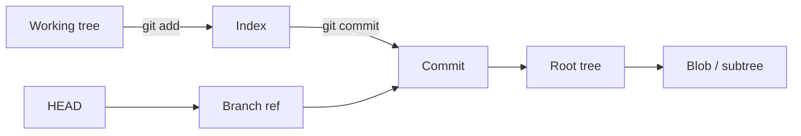

<TLDR>
  <TLDRCell label="what">
    Git stores project states as immutable objects, then names objects with references such as branches, tags, and `HEAD`; the index describes the snapshot prepared for the next commit.
  </TLDRCell>
  <TLDRCell label="when">
    When you need to explain staged content, compare merges with rebases, undo a mistake, or recover a commit, the object graph is more reliable than memorized commands.
  </TLDRCell>
  <TLDRCell label="how">
    First identify which reference, index, or working-tree state a command changes, then verify the result with `status`, `diff`, `show`, and `reflog`.
  </TLDRCell>
</TLDR>

## What it is and why it exists

Git is a distributed version control system, but it is also a snapshot-and-reference system built on content-addressed storage. A commit records a project tree, parent commits, and authorship metadata rather than a file-edit instruction that must be replayed from the beginning. Each full clone normally has the commit history and objects, so most inspection, comparison, and commit operations need no network.

Git's central job is to let people name, exchange, and combine project states while preserving causal relationships between those states. A branch is a movable name, not another directory; a commit does not belong exclusively to one branch. Once those facts are clear, switching, merging, rebasing, and recovery become different edits to the same graph.

You encounter Git at three levels: files being edited in the working tree, the snapshot prepared in the index, and content already written to the object database. `HEAD` additionally identifies the checked-out branch or points directly at a commit. Most dangerous misconceptions collapse these layers into one state, such as assuming that `git add` keeps tracking later edits or that deleting a branch immediately deletes its commits.

This topic focuses on Git's local data model and history transformations. Hosting-platform pull requests, prescribed branching workflows, hooks, and large-repository tuning each need their own policies and are not required to explain these core mechanics.

## How it works

### Snapshots and content addressing

A <Term id="git-object">Git object</Term> is an immutable record in the object database. Its identifier is calculated from the object's type, length, and content using the repository's selected hash format, so the same type and content produce the same identifier; changing one byte will normally change it completely. The identifier provides addressing and integrity checking, but not proof of origin—trusting a publisher still requires signatures or another verification mechanism.

An ordinary repository primarily uses four object types. A blob stores file content without a path; a tree associates names and file modes with blobs, subtrees, or submodule commits; a commit points to one root tree and zero or more parents and records author, committer, and message data; an annotated tag adds a tag name, tagger, message, and optional signature to a target object.

A rename does not leave a permanent rename marker in a blob. Git infers renames from path and content similarity when it compares two snapshots, which is why commands or thresholds can present renames differently. The historical facts are the entries in the two trees, not a stored move operation.



The diagram separates two relationships: `git add` and `git commit` advance snapshots, while references provide movable entry points to commits. A commit describes a snapshot through its tree and connects history through its parents. `HEAD` is normally a symbolic reference to the current branch, but in detached state it directly records a commit identifier.

### References and the commit graph

A <Term id="git-reference">Git reference</Term> maps a name to an object identifier. Branches and remote-tracking branches normally point to commits; tags can point directly to an object or indirectly through an annotated tag. References can live in individual files, be packed, or use another ref backend, so applications should not assume `.git/refs/heads/main` is always an editable plain file.

The parent links in commits make history a directed acyclic graph. An ordinary commit has one parent, a root commit has none, and a merge commit normally has two. Edges point from newer commits to older ones, so a commit is reachable when a reference or another retention root can follow parent links to it.

The <Term id="merge-base">merge base</Term> of two commits is a common ancestor that is not itself an ancestor of another common ancestor—a best common ancestor. Simple histories usually have one merge base, while criss-cross merges can have more than one. A three-way merge compares each tip's changes relative to the merge base instead of comparing only the two tip files.

### The index is a tree in preparation

The <Term id="git-index">Git index</Term>, also called the staging area, is a binary data structure containing paths, modes, object identifiers, and auxiliary state for the proposed next snapshot. `git add path` reads the working-tree content at that moment, writes the corresponding blob, and updates the path's index entry. Editing the file again does not automatically change the staged blob.

Normal entries occupy stage 0. During an unresolved merge conflict, one path can have stage 1, 2, and 3 entries representing the merge base, the current side, and the other side. Running `git add` after resolving the file replaces those unmerged entries with one stage 0 entry.

`git diff` compares the working tree with the index by default, so it shows unstaged changes. `git diff --cached` compares the index with `HEAD`, so it shows what the next commit would contain. `git diff HEAD` bypasses that distinction and compares the working tree with `HEAD`; when reviewing a commit boundary, the first two views usually explain which layer owns each change more clearly.

### Merge preserves the graph; rebase rebuilds a path

A merge finds the merge base and combines each side's changes relative to it. When a fast-forward is possible, Git only moves the current branch reference; a true merge instead creates a new commit with multiple parents. Existing commits retain their identifiers and parent relationships, and history explicitly records where the development lines joined.

A rebase finds commits unique to the current branch and applies their corresponding changes on a new base in sequence. The new commits have different parents, and parent identifiers are part of commit content, so object identifiers normally change even when the final files match. Old commits are not edited in place; branch references may simply stop pointing to them.

This is not a simple choice between clean and messy history. Merge preserves real divergence and convergence, which suits collaboration that has already been shared; rebase can organize private work that has not been shared so each commit builds on the current baseline. A team must decide which references permit rewriting and how the server protects them before choosing a command.

### Remotes transfer objects and references

A remote name is only shorthand in local configuration, normally carrying fetch and push URLs plus refspecs. `origin/main` is a locally stored remote-tracking reference from the last fetch, not a live query of the server's branch. Fetch and inspect the actual configuration before judging remote state rather than assuming the remote is named `origin`.

`git fetch` negotiates and downloads missing objects, then updates remote-tracking refs according to refspecs; it normally does not integrate those commits into the current branch or replace the working tree. `git pull` fetches and then runs the integration method selected by arguments or configuration, which may be merge, rebase, or fast-forward only. Automation should spell out the intended two steps rather than let user-level configuration change the meaning.

`git push` sends missing objects and asks the receiver to update one or more remote refs. The server can reject an update through fast-forward rules, protected branches, permissions, or hooks, so having an object locally does not mean the remote will accept the ref change. A successful result confirms only the ref updates reported by the protocol, not deployment or downstream automation.

A refspec names a source and destination ref and can also express deletion or forced update. Before a bulk fetch or push, inspect `git remote -v`, `git config --get-all remote.<name>.fetch`, and dry-run output to confirm the mapping. When several refs must publish consistently, also confirm that the server supports and accepts an atomic push.

## Examples

### Inspect the object chain

The first example creates a minimal repository and uses plumbing commands to inspect the relationship among a blob, tree, and commit. Its temporary directory is removed when the script exits, so it does not change an existing repository.

<Depth level="quick">

```bash title="object-model.sh"
#!/bin/sh
set -eu

repo=$(mktemp -d)
trap 'rm -rf "$repo"' EXIT

git -C "$repo" init -q --initial-branch=main
git -C "$repo" config user.name 'CodeWiki'
git -C "$repo" config user.email 'editor@example.com'

printf 'approve invoice\n' > "$repo/plan.txt"
git -C "$repo" add plan.txt
blob=$(git -C "$repo" rev-parse :plan.txt)
tree=$(git -C "$repo" write-tree)
git -C "$repo" commit -qm 'Add payment plan'
commit=$(git -C "$repo" rev-parse HEAD)

again=$(printf 'approve invoice\n' | git -C "$repo" hash-object --stdin)
test "$blob" = "$again" && echo 'same content: same object id'
printf 'index entry: %s\n' "$(git -C "$repo" cat-file -t "$blob")"
printf 'root object: %s\n' "$(git -C "$repo" cat-file -t "$tree")"
printf 'HEAD object: %s\n' "$(git -C "$repo" cat-file -t "$commit")"
printf 'snapshot path: %s\n' "$(git -C "$repo" ls-tree --name-only HEAD)"
```

```text
same content: same object id
index entry: blob
root object: tree
HEAD object: commit
snapshot path: plan.txt
```

</Depth>

Both `hash-object` calls receive the same content and therefore produce the same blob identifier. The index names the blob, `write-tree` constructs a tree from the index, and the commit ultimately references that tree. The file name appears only in the tree entry, so inspecting the blob alone cannot tell you that its content came from `plan.txt`.

### Observe three states separately

One path can have three versions at once. The next script commits `10`, stages `20`, changes the working tree to `30`, and then reads from all three data sources.

```bash title="three-states.sh"
#!/bin/sh
set -eu

repo=$(mktemp -d)
trap 'rm -rf "$repo"' EXIT

git -C "$repo" init -q --initial-branch=main
git -C "$repo" config user.name 'CodeWiki'
git -C "$repo" config user.email 'editor@example.com'

printf 'timeout=10\n' > "$repo/app.conf"
git -C "$repo" add app.conf
git -C "$repo" commit -qm 'Add timeout'

printf 'timeout=20\n' > "$repo/app.conf"
git -C "$repo" add app.conf
printf 'timeout=30\n' > "$repo/app.conf"

printf 'HEAD: '
git -C "$repo" show HEAD:app.conf
printf 'index: '
git -C "$repo" show :app.conf
printf 'working tree: '
sed -n '1p' "$repo/app.conf"
```

```text
HEAD: timeout=10
index: timeout=20
working tree: timeout=30
```

`git show HEAD:app.conf` reads the committed tree, `git show :app.conf` reads the stage 0 index entry, and the ordinary file read sees the latest edit. At this point, `git commit` would contain `20`; committing `30` requires another `git add app.conf`.

### Observe merge and rebase

This example first diverges `feature` from `main`, then rebases the feature commit onto `main`. It then creates another branch and forces a merge commit, using the parent count to verify the graph shape.

```bash title="graph-changes.sh"
#!/bin/sh
set -eu

repo=$(mktemp -d)
trap 'rm -rf "$repo"' EXIT

git -C "$repo" init -q --initial-branch=main
git -C "$repo" config user.name 'CodeWiki'
git -C "$repo" config user.email 'editor@example.com'
printf 'base\n' > "$repo/base.txt"
git -C "$repo" add base.txt
git -C "$repo" commit -qm 'Base'

git -C "$repo" switch -qc feature
printf 'feature\n' > "$repo/feature.txt"
git -C "$repo" add feature.txt
git -C "$repo" commit -qm 'Feature'
before=$(git -C "$repo" rev-parse feature)

git -C "$repo" switch -q main
printf 'main\n' > "$repo/main.txt"
git -C "$repo" add main.txt
git -C "$repo" commit -qm 'Main change'
git -C "$repo" switch -q feature
git -C "$repo" rebase -q main
after=$(git -C "$repo" rev-parse feature)

test "$before" != "$after" && echo 'rebase changed the feature commit id'
git -C "$repo" merge-base --is-ancestor main feature
echo 'feature now descends from main'

git -C "$repo" switch -qc release main
printf 'release\n' > "$repo/release.txt"
git -C "$repo" add release.txt
git -C "$repo" commit -qm 'Release change'
git -C "$repo" switch -q main
git -C "$repo" merge -q --no-ff release -m 'Merge release'
parents=$(git -C "$repo" rev-list --parents -n 1 HEAD | awk '{print NF - 1}')
printf 'merge commit parents: %s\n' "$parents"
```

```text
rebase changed the feature commit id
feature now descends from main
merge commit parents: 2
```

The rebased feature commit has a new parent, so its identifier changes and `main` becomes an ancestor of `feature`. `--no-ff` makes the final step create a merge commit with two parents even though it could fast-forward. Real work should not choose one operation mechanically just to produce a particular graph shape.

### Create a recovery ref with reflog

The final example deliberately hard-resets the current branch to its previous commit, then locates the pre-reset state in `HEAD`'s reflog. It creates a branch first instead of moving the current branch again, leaving room to inspect the recovered state before deciding how to integrate it.

```bash title="reflog-recovery.sh"
#!/bin/sh
set -eu

repo=$(mktemp -d)
trap 'rm -rf "$repo"' EXIT

git -C "$repo" init -q --initial-branch=main
git -C "$repo" config user.name 'CodeWiki'
git -C "$repo" config user.email 'editor@example.com'

printf 'draft\n' > "$repo/notes.txt"
git -C "$repo" add notes.txt
git -C "$repo" commit -qm 'Add draft'
printf 'approved\n' > "$repo/notes.txt"
git -C "$repo" commit -qam 'Approve notes'

git -C "$repo" reset -q --hard HEAD^
printf 'after reset: '
git -C "$repo" show HEAD:notes.txt
lost=$(git -C "$repo" rev-parse HEAD@{1})
git -C "$repo" branch rescued "$lost"
printf 'rescued branch: '
git -C "$repo" show rescued:notes.txt
```

```text
after reset: draft
rescued branch: approved
```

A <Term id="reflog">reference log (reflog)</Term> records changes to local reference values, and `HEAD@{1}` happens to be the pre-reset position in this newly created repository. In a real repository, first run `git reflog --date=iso` and choose an entry by its operation, time, and commit content rather than guessing an ordinal. Reflogs are local and entries expire under configurable policies, so they are not backups.

## Pitfalls

### Editing after staging

> [!PITFALL]
> Treating `git add` as continuous tracking makes a commit omit later edits. The index only holds content read when the command ran.

**Fix:** Before committing, inspect `git status --short`, `git diff`, and `git diff --cached`. Prefer path-specific or interactive staging and review the staged diff as the actual commit boundary; do not use `git add .` to hide changes you have not inspected.

### Rebasing a shared reference

> [!PITFALL]
> Rebasing commits that other people use creates replacement commits, and the subsequent force push can remove the remote reference's path to their work. `--force-with-lease` only checks that a remote reference matches an expected value; it does not prove that the team authorized the rewrite.

**Fix:** Limit rebasing to private branches whose rewrite policy is explicit, and run `git fetch` plus `git log --graph --oneline --decorate --all` before pushing. Prefer `git revert` to undo a shared branch; when rewriting is necessary, agree on a freeze window, backup references, and recovery steps for every collaborator.

### Treating undo commands as synonyms

> [!PITFALL]
> `reset`, `restore`, and `revert` operate on different layers. In particular, `git reset --hard` makes the current branch, index, and affected tracked working-tree content match the target commit, and uncommitted content may be unrecoverable.

**Fix:** State the desired end state first. Consider `reset --soft` to move only the branch, `restore --staged` to unstage, and `revert` to create an inverse change in shared history; capture `status` and both diffs before acting, and create a branch or commit first when an experiment matters.

### Treating reflog as a permanent backup

> [!PITFALL]
> A commit object may remain locally after its last branch is deleted, but reflogs expire and garbage collection may remove the object. Other clones, CI workspaces, and hosting services each have separate references and retention policies.

**Fix:** As soon as you discover an accidental deletion, create a `rescue/...` reference from the verified object identifier, then inspect its tree and parent chain. Push important history to a protected reference or independent backup; do not run aggressive cleanup to test recovery, and do not promise that every uncommitted change can be restored.

### Deleting a secret only from the tip

> [!PITFALL]
> Removing a token from the current file does not remove its blob from older commits, remote references, pull-request caches, or other clones. Rewriting history cannot make an already exposed credential safe again.

**Fix:** Revoke and rotate the credential first, then assess access and logs. If history must be cleaned, use a team-approved rewrite tool with an explicit mapping, coordinate every reference and clone, and verify reachability afterward; secret-management policy should also stop equivalent content from entering the index again.

<Depth level="deep">

## Objects and reachability in depth

### Loose-object encoding

To write a loose object, Git constructs a header from the type, decimal content length, and a NUL byte, appends the raw content, and stores a compressed representation. The object identifier hashes the uncompressed header and content, not the compressed file on disk. `git cat-file` provides a stable interface for parsing objects; production tools should not guess the `.git/objects` layout because objects may instead be in packfiles or alternate object databases.

Traditional repositories use the SHA-1 object format, and Git also supports repositories initialized with the SHA-256 format. Code should therefore not hard-code object identifiers as 40 hexadecimal characters, and protocols may require compatibility mappings between storage formats. Scripts that only need Git's interpretation should prefer `rev-parse`, `for-each-ref`, and plumbing commands with explicit format arguments.

A blob identifier excludes path and file mode. Identical content at several paths can reuse one blob; changing only the executable bit changes a tree entry without requiring a different blob. Trees add path structure recursively, so the root tree is enough to describe a commit's complete snapshot.

### Commit identity includes parentage

A commit object records its root tree, ordered parent headers, author and committer data, message, and any additional headers. Parent identifiers are part of the commit content, so attaching the same file snapshot to a different parent still creates a different commit identifier. Changing a message, committer time, or parent order also creates a new object.

That explains why amend, cherry-pick, and rebase rebuild commits instead of editing existing objects. Old objects may stay reachable through another branch, tag, or reflog, or may eventually lose every retention root. `git fsck --unreachable` can help diagnose the graph, but seeing an object in its output is not a durable retention guarantee.

### Ref updates and detached HEAD

When a branch is checked out normally, `HEAD` stores a symbolic relationship to that branch reference. Creating a commit writes new objects and then updates the current branch ref to the new commit, so `HEAD` resolves to the new position. Ref updates use locking and atomic replacement mechanisms; scripts should use `git update-ref`, which can also supply the old value as a compare-and-swap condition.

In detached HEAD state, `HEAD` points directly to a commit. New commits made there are valid, but after switching away no branch name may continue to reference them. Preserve a useful experiment before leaving with `git switch -c experiment-name`; after leaving, promptly confirm its position through reflog and create a reference.

### Reachability, reflogs, and garbage collection

Reachability is a graph relationship, not a synonym for a file existing on disk. Branches, tags, and other refs form the primary roots; reflogs and in-progress operations may temporarily retain more objects. Deleting a ref normally removes only an entry point rather than synchronously erasing its entire object subgraph, which creates a recovery window whose duration depends on configuration and later maintenance.

Garbage collection packs objects and can prune them after they satisfy expiration and unreachability rules. Exact behavior depends on `gc.*`, `reflogExpire*`, command arguments, and hosting-service implementation, so a fixed number of days is not a reliable contract. A real backup needs an independent copy, an explicit retention scope, and a tested restore process.

### Ref updates need conditional protection

Because refs are movable names, reading and then writing one unconditionally creates a race: another process may have advanced the same ref. `git update-ref <ref> <new> <old>` updates only while the ref still equals the expected old value, giving scripts compare-and-swap semantics. Writing `.git/refs` directly bypasses locking, reflogs, and the ref-backend abstraction.

`--force-with-lease` carries a similar condition into a push, but its protection depends on the expected value used for the lease. Background fetches, stale remote-tracking refs, and explicit lease configuration all affect that basis. A script should specify a reviewed full old identifier where practical and treat lease failure as a signal to re-inspect, not to retry automatically with a stronger force.

When one ordinary push updates several refs, the server may accept some and reject others. If all-or-nothing behavior is required, request `git push --atomic`; if the remote lacks support, stop instead of silently degrading to non-atomic updates. Release tooling must also verify returned status and final refs rather than checking only that the process started.

Multiple worktrees share the object database and most refs but have separate `HEAD`, index, and working-tree administration state. Git prevents one branch from being checked out normally in two worktrees, yet scripts should still obtain the true layout with `git worktree list --porcelain`. Deleting another worktree as if it were an ordinary directory can leave administration records or destroy its uncommitted work.

### Index stages during conflicts

When a three-way merge cannot select a result automatically, the working tree gets conflict markers and the index retains multiple participating versions. `git ls-files --unmerged` shows stage 1 for the base, stage 2 for the current side, and stage 3 for the other side. The meaning of `ours` and `theirs` can also shift with the perspective of operations such as rebase, so bulk selection by label alone is unsafe.

Correct conflict resolution understands both intentions and validates the combined behavior instead of merely deleting markers. After editing, `git add` writes the resolved blob and a stage 0 entry; before continuing, use `git diff --check` to detect leftover markers and tests to check semantics. `rerere` can reuse a previously recorded resolution, but its result still needs review.

### Revision expressions are a query language

Git accepts more than complete object identifiers. `main~2` follows the first-parent chain twice, `HEAD^2` selects the second parent of a merge commit, `topic^{tree}` dereferences to its tree, and `A..B` selects commits reachable from `B` but not `A`. `A...B` does not have exactly the same meaning in log queries and the diff command, so scripts should check the relevant command's documentation and test the result.

Pass a revision expression to `git rev-parse --verify` before a mutation to confirm that it resolves to one expected object. Use `--` to separate revisions from paths in mixed commands, avoiding ambiguity between a branch name and file name. Automation should also record the resolved full identifier rather than logging only a branch name that can move later.

</Depth>

<Checkpoint id="foundations/git-deep-dive" />

## Further reading

- [Git glossary](https://git-scm.com/docs/gitglossary)
- [Pro Git: Git objects](https://git-scm.com/book/en/v2/Git-Internals-Git-Objects)
- [`git rebase` documentation](https://git-scm.com/docs/git-rebase)
- [`git reflog` documentation](https://git-scm.com/docs/git-reflog)
- [`git reset` documentation](https://git-scm.com/docs/git-reset)
