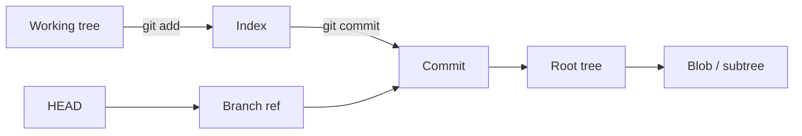

<TLDR>
  <TLDRCell label="what">
    Git 把项目状态保存为不可变对象，再用分支、标签和 `HEAD` 等引用为对象命名；索引则描述下一次提交准备采用的快照。
  </TLDRCell>
  <TLDRCell label="when">
    当你要解释暂存内容、比较合并与变基、撤销误操作或找回提交时，对象图比命令口诀更可靠。
  </TLDRCell>
  <TLDRCell label="how">
    先确认命令会移动哪个引用、改动索引还是工作树，再用 `status`、`diff`、`show` 和 `reflog` 验证实际状态。
  </TLDRCell>
</TLDR>

## 是什么，为什么存在

Git 是分布式版本控制系统，也可以理解为一套建立在内容寻址存储之上的快照与引用机制。一次提交记录项目树、父提交和作者等元数据，而不是保存一条必须从头重放的文件修改指令。每个完整克隆通常都拥有提交历史与对象，因此多数查看、比较和提交操作不依赖网络。

Git 解决的核心问题，是让多人能够命名、交换并合并项目状态，同时保留状态之间的因果关系。分支只是一个可移动名称，不是另一份目录；提交也不是某个分支私有的。先理解这两点，切换分支、合并、变基和恢复操作就会变成对同一张图的不同修改。

你会在三个层面遇到 Git：工作树中正在编辑的文件、索引中准备提交的快照，以及对象数据库中已经写入的内容。`HEAD` 再指出当前检出的分支，或直接指出某个提交。大多数危险误解都来自把这些层混成一个状态，例如以为 `git add` 会持续跟踪之后的编辑，或以为删除分支就立即删除了提交。

本主题聚焦 Git 的本地数据模型与历史变换。托管平台的 Pull Request、具体分支流程、钩子和大型仓库优化各有独立策略，不属于解释这些基础机制所必需的内容。

## 工作原理

### 快照与内容寻址

<Term id="git-object">Git 对象（Git object）</Term>是对象数据库中的不可变记录。对象标识由对象类型、长度和内容按仓库选择的哈希格式计算，因此相同类型与相同内容会得到相同标识；改变一个字节，标识通常就完全不同。标识负责寻址与完整性检查，但这不等于来源认证，信任发布者仍要依靠签名和其他验证机制。

普通仓库主要使用四类对象。Blob 保存文件内容，不保存路径；tree 把名称和文件模式关联到 blob、子 tree 或子模块提交；commit 指向一个根 tree、零个或多个父提交，并保存作者、提交者和消息；annotated tag 则为目标对象附加标签名称、标签创建者、消息和可选签名。

文件重命名不会在 blob 中留下重命名标记。Git 比较两个快照时，根据路径和内容相似度推断重命名，这也是不同命令或阈值可能给出不同重命名展示的原因。历史的事实是两个 tree 分别包含什么，而不是一条永久保存的移动记录。



这张图把两种关系分开：`git add` 与 `git commit` 推进快照，引用则为提交提供可移动的入口。commit 通过 tree 描述快照，通过 parent 连接历史。`HEAD` 通常是指向当前分支的符号引用，也可以在分离状态下直接记录提交标识。

### 引用与提交图

<Term id="git-reference">Git 引用（Git reference）</Term>是一个名称到对象标识的映射，分支与远程跟踪分支通常指向提交，标签可以直接或通过 annotated tag 间接指向对象。引用可能以单独文件保存，也可能被压缩或交给其他引用后端管理，所以应用不应假设 `.git/refs/heads/main` 一定是可直接编辑的普通文件。

每个 commit 的父链接让历史形成有向无环图。普通提交有一个父提交，根提交没有父提交，合并提交通常有两个父提交。图中的方向从新提交指向旧提交，所以一个提交可达，表示从某个引用或其他保留根沿父链接能够访问到它。

两个提交的<Term id="merge-base">合并基点（merge base）</Term>是它们共同祖先中不再是另一个共同祖先的祖先者，也就是最佳共同祖先。简单历史通常只有一个合并基点，复杂的交叉合并可能有多个。三方合并比较两个分支端点相对合并基点的变化，而不是只比较端点文件。

### 索引是准备中的 tree

<Term id="git-index">Git 索引（Git index）</Term>也叫暂存区，它是一份二进制数据结构，记录下一次提交候选快照中的路径、模式、对象标识和辅助状态。`git add path` 会读取当时的工作树内容，写入相应 blob，并更新该路径的索引条目。之后继续编辑同一文件，不会自动改变已经暂存的 blob。

正常条目处于 stage 0。发生未解决的合并冲突时，同一路径可以同时带有 stage 1、2 和 3 条目，分别表示合并基点、当前一侧与另一侧。解决文件后再次执行 `git add`，会用一个 stage 0 条目替换这些未合并条目。

`git diff` 默认比较工作树与索引，所以显示尚未暂存的变化。`git diff --cached` 比较索引与 `HEAD`，所以显示将进入下一次提交的变化。`git diff HEAD` 则跨过索引，比较工作树与 `HEAD`；在审查提交边界时，前两个视角通常更能说明变化处在哪一层。

### 合并保留图，变基重建路径

合并先寻找合并基点，再组合两侧相对基点的变化。能够快进时，Git 只需移动当前分支引用；需要真正合并时，则创建拥有多个父提交的新 commit。原有提交保持原标识与父关系，历史明确记录两条开发线汇合的位置。

变基会找出当前分支相对上游独有的提交，并把相应变化依次应用到新基点上。新提交拥有不同的父提交，commit 内容也包含父标识，因此即使最终文件相同，对象标识通常仍会变化。旧提交不会被就地修改；它们只是可能不再被分支引用。

这种差异不是整洁历史与脏乱历史之间的简单选择。合并保留真实分叉和汇合，适合已经共享的协作事实；变基可以整理尚未共享的本地工作，让每个提交建立在当前基线上。团队必须先约定哪些引用允许重写，以及推送端怎样保护这些引用。

### 远程通信传输对象与引用

远端名称只是本地配置中的简称，通常包含获取 URL、推送 URL 和 refspec。`origin/main` 是上一次获取后本地保存的远程跟踪引用，不是对服务器分支的实时查询。判断远端当前状态前要先获取，并检查实际配置，而不是假定远端一定名为 `origin`。

`git fetch` 协商并下载缺少的对象，再按 refspec 更新远程跟踪引用；它通常不会把这些提交合并进当前分支，也不会替换工作树。`git pull` 则先获取，再执行配置或参数选择的集成方式，可能是 merge、rebase 或仅允许快进。自动化脚本应明确写出需要的两步，避免依赖用户级配置改变语义。

`git push` 向接收端发送缺少的对象并请求更新一个或多个远端引用。服务端可以用快进规则、受保护分支、权限和钩子拒绝更新，所以本地有对象不代表远端会接受引用变更。成功结果也只确认协议报告的引用更新，不等同于部署或下游自动化成功。

Refspec 明确源引用和目标引用，也能表达删除或强制更新。执行批量获取或推送前，用 `git remote -v`、`git config --get-all remote.<name>.fetch` 和 dry-run 输出确认映射。涉及多个引用的一致发布时，还要确认服务端是否支持并接受原子推送。

## 示例

### 检查对象链

第一个示例建立最小仓库，并用 plumbing 命令检查 blob、tree 与 commit 的关系。临时目录会在脚本退出时删除，示例不会改动现有仓库。

<Depth level="quick">

```bash title="object-model.sh"
#!/bin/sh
set -eu

repo=$(mktemp -d)
trap 'rm -rf "$repo"' EXIT

git -C "$repo" init -q --initial-branch=main
git -C "$repo" config user.name 'CodeWiki'
git -C "$repo" config user.email 'editor@example.com'

printf 'approve invoice\n' > "$repo/plan.txt"
git -C "$repo" add plan.txt
blob=$(git -C "$repo" rev-parse :plan.txt)
tree=$(git -C "$repo" write-tree)
git -C "$repo" commit -qm 'Add payment plan'
commit=$(git -C "$repo" rev-parse HEAD)

again=$(printf 'approve invoice\n' | git -C "$repo" hash-object --stdin)
test "$blob" = "$again" && echo 'same content: same object id'
printf 'index entry: %s\n' "$(git -C "$repo" cat-file -t "$blob")"
printf 'root object: %s\n' "$(git -C "$repo" cat-file -t "$tree")"
printf 'HEAD object: %s\n' "$(git -C "$repo" cat-file -t "$commit")"
printf 'snapshot path: %s\n' "$(git -C "$repo" ls-tree --name-only HEAD)"
```

```text
same content: same object id
index entry: blob
root object: tree
HEAD object: commit
snapshot path: plan.txt
```

</Depth>

两次 `hash-object` 输入相同内容，因此得到相同 blob 标识。索引引用 blob，`write-tree` 根据索引生成 tree，而 `commit` 最终引用该 tree。文件名只出现在 tree 条目中，所以单独查看 blob 无法知道内容来自 `plan.txt`。

### 分开观察三种状态

同一路径可以同时存在三个版本。下面依次提交 `10`、暂存 `20`，再把工作树改成 `30`，最后从三个数据源读取内容。

```bash title="three-states.sh"
#!/bin/sh
set -eu

repo=$(mktemp -d)
trap 'rm -rf "$repo"' EXIT

git -C "$repo" init -q --initial-branch=main
git -C "$repo" config user.name 'CodeWiki'
git -C "$repo" config user.email 'editor@example.com'

printf 'timeout=10\n' > "$repo/app.conf"
git -C "$repo" add app.conf
git -C "$repo" commit -qm 'Add timeout'

printf 'timeout=20\n' > "$repo/app.conf"
git -C "$repo" add app.conf
printf 'timeout=30\n' > "$repo/app.conf"

printf 'HEAD: '
git -C "$repo" show HEAD:app.conf
printf 'index: '
git -C "$repo" show :app.conf
printf 'working tree: '
sed -n '1p' "$repo/app.conf"
```

```text
HEAD: timeout=10
index: timeout=20
working tree: timeout=30
```

`git show HEAD:app.conf` 读取已提交 tree，`git show :app.conf` 读取 stage 0 索引条目，普通文件读取则看到最新编辑。此时 `git commit` 只会提交 `20`；要提交 `30`，必须再次执行 `git add app.conf`。

### 观察合并与变基

这个示例先让 `feature` 与 `main` 分叉，再把 feature commit 变基到 `main`。随后它建立另一条分支并强制创建 merge commit，用父提交数量验证图结构。

```bash title="graph-changes.sh"
#!/bin/sh
set -eu

repo=$(mktemp -d)
trap 'rm -rf "$repo"' EXIT

git -C "$repo" init -q --initial-branch=main
git -C "$repo" config user.name 'CodeWiki'
git -C "$repo" config user.email 'editor@example.com'
printf 'base\n' > "$repo/base.txt"
git -C "$repo" add base.txt
git -C "$repo" commit -qm 'Base'

git -C "$repo" switch -qc feature
printf 'feature\n' > "$repo/feature.txt"
git -C "$repo" add feature.txt
git -C "$repo" commit -qm 'Feature'
before=$(git -C "$repo" rev-parse feature)

git -C "$repo" switch -q main
printf 'main\n' > "$repo/main.txt"
git -C "$repo" add main.txt
git -C "$repo" commit -qm 'Main change'
git -C "$repo" switch -q feature
git -C "$repo" rebase -q main
after=$(git -C "$repo" rev-parse feature)

test "$before" != "$after" && echo 'rebase changed the feature commit id'
git -C "$repo" merge-base --is-ancestor main feature
echo 'feature now descends from main'

git -C "$repo" switch -qc release main
printf 'release\n' > "$repo/release.txt"
git -C "$repo" add release.txt
git -C "$repo" commit -qm 'Release change'
git -C "$repo" switch -q main
git -C "$repo" merge -q --no-ff release -m 'Merge release'
parents=$(git -C "$repo" rev-list --parents -n 1 HEAD | awk '{print NF - 1}')
printf 'merge commit parents: %s\n' "$parents"
```

```text
rebase changed the feature commit id
feature now descends from main
merge commit parents: 2
```

变基后的 feature commit 连接到新的父提交，因此标识改变，而且 `main` 成为 `feature` 的祖先。`--no-ff` 让最后一步即使可能快进，也创建具有两个父提交的 merge commit。实际工作不应仅为追求直线图而机械使用其中一种方式。

### 用 reflog 建立恢复引用

最后一个示例故意把当前分支硬重置到上一提交，再从 `HEAD` 的 reflog 找到重置前的位置。恢复时先创建分支，不直接再次移动当前分支，这样检查无误后再决定如何整合。

```bash title="reflog-recovery.sh"
#!/bin/sh
set -eu

repo=$(mktemp -d)
trap 'rm -rf "$repo"' EXIT

git -C "$repo" init -q --initial-branch=main
git -C "$repo" config user.name 'CodeWiki'
git -C "$repo" config user.email 'editor@example.com'

printf 'draft\n' > "$repo/notes.txt"
git -C "$repo" add notes.txt
git -C "$repo" commit -qm 'Add draft'
printf 'approved\n' > "$repo/notes.txt"
git -C "$repo" commit -qam 'Approve notes'

git -C "$repo" reset -q --hard HEAD^
printf 'after reset: '
git -C "$repo" show HEAD:notes.txt
lost=$(git -C "$repo" rev-parse HEAD@{1})
git -C "$repo" branch rescued "$lost"
printf 'rescued branch: '
git -C "$repo" show rescued:notes.txt
```

```text
after reset: draft
rescued branch: approved
```

<Term id="reflog">引用日志（reflog）</Term>记录本地引用值的变化，`HEAD@{1}` 在这个刚创建的仓库中正好是重置前的位置。实际仓库里应先运行 `git reflog --date=iso`，根据操作说明、时间和提交内容选择条目，不要猜测序号。Reflog 只属于本地仓库，而且条目会按可配置策略过期，所以它不是备份。

## 陷阱

### 暂存后继续编辑

> [!PITFALL]
> 把 `git add` 理解为开始跟踪文件之后的所有变化，会让提交遗漏最新编辑。索引只保存执行命令时读到的内容。

**修复方法：** 提交前同时查看 `git status --short`、`git diff` 和 `git diff --cached`。优先按路径或交互式暂存，并从暂存差异审查真正的提交边界；不要用 `git add .` 掩盖自己尚未看过的变化。

### 在共享引用上变基

> [!PITFALL]
> 变基已被其他人使用的提交会产生一组替代提交，之后的强制推送可能移除远端引用对同事工作的可达路径。`--force-with-lease` 只检查远端引用是否符合预期，不会证明重写获得团队授权。

**修复方法：** 把变基限制在明确允许重写的私有分支，并在推送前执行 `git fetch` 与 `git log --graph --oneline --decorate --all`。共享分支需要撤销时优先使用 `git revert`；必须重写时，先约定冻结窗口、备份引用与每位协作者的恢复步骤。

### 把撤销命令当作同义词

> [!PITFALL]
> `reset`、`restore` 与 `revert` 作用层不同。尤其是 `git reset --hard` 会让当前分支、索引和受影响的已跟踪工作树内容一起匹配目标提交，未提交内容可能无法恢复。

**修复方法：** 先写明目标状态。只移动分支可考虑 `reset --soft`，取消暂存可用 `restore --staged`，共享历史中的反向修改使用 `revert`；执行前保存 `status` 与两种 `diff`，需要保留实验时先创建分支或提交。

### 把 reflog 当永久备份

> [!PITFALL]
> 删除最后一个分支后，提交对象可能暂时仍在本地，但 reflog 会过期，对象也可能被垃圾回收。其他克隆、CI 工作区和托管服务还各自维护不同的引用与保留策略。

**修复方法：** 一发现误删就从已确认的对象标识创建 `rescue/...` 引用，再验证 tree 和父链。重要历史要推送到受保护引用或独立备份；不要运行激进清理来测试恢复方案，也不要承诺所有未提交内容都能找回。

### 只删除最新提交中的密钥

> [!PITFALL]
> 从当前文件删除令牌，不会从旧 commit、远端引用、Pull Request 缓存或其他克隆中删除相应 blob。历史重写也不能使已经泄露的凭据重新安全。

**修复方法：** 先撤销并轮换凭据，再评估可访问范围和日志。确需清理历史时，使用团队认可的重写工具与明确映射，协调所有引用和克隆，最后验证对象可达性；密钥管理策略应阻止同类内容再次进入索引。

<Depth level="deep">

## 深入理解对象与可达性

### 松散对象的编码

写入松散对象时，Git 先构造由类型、十进制内容长度和 NUL 字节组成的头，再拼接原始内容并压缩保存。对象标识是未压缩头与内容的哈希，而不是磁盘压缩文件的哈希。`git cat-file` 会通过稳定接口解析对象；生产工具不应自行猜测 `.git/objects` 的布局，因为对象也可能位于 packfile 或替代对象数据库中。

传统仓库使用 SHA-1 对象格式，Git 也支持使用 SHA-256 格式初始化的仓库。对象标识的具体长度因此不应硬编码为 40 个十六进制字符，协议与存储之间还可能需要兼容映射。脚本如果只需要解析 Git 输出，应优先使用 `rev-parse`、`for-each-ref` 和带格式参数的 plumbing 命令。

Blob 的标识不含路径和文件模式。同一内容出现在多个路径时可以复用同一 blob；可执行位变化则改变 tree 条目，不必改变 blob。Tree 递归地给内容加上路径结构，因此根 tree 足以描述一次提交的完整快照。

### Commit 身份包含父关系

Commit 对象保存根 tree、按顺序排列的 parent 头、作者与提交者信息、消息，以及可能存在的附加头。父提交标识属于 commit 内容，所以把相同文件快照接到不同父提交上仍会得到不同 commit 标识。修改提交消息、提交者时间或父顺序也会建立新对象。

这一点解释了 amend、cherry-pick 和 rebase 为什么重建提交，而不是编辑原对象。旧对象可能继续通过其他分支、标签或 reflog 可达，也可能最终失去所有保留根。`git fsck --unreachable` 可以帮助诊断对象图，但输出是否存在并不构成持久保留保证。

### 引用更新与分离 HEAD

正常检出分支时，`HEAD` 保存对分支引用的符号关系。创建 commit 会写入新对象，再把当前分支引用更新到新 commit；`HEAD` 随之解析到新位置。引用更新采用锁与原子替换等机制，脚本应使用 `git update-ref`，这样还能提供旧值作为比较交换条件。

分离 HEAD 时，`HEAD` 直接指向 commit。此时创建新提交完全有效，但切换离开后没有分支名继续指向它。实验有价值就应在离开前执行 `git switch -c experiment-name`，离开后则尽快通过 reflog 确认位置并建立引用。

### 可达性、reflog 与垃圾回收

可达性是图关系，不是文件存在性的同义词。分支、标签和其他引用形成主要根，reflog 与正在进行的操作还可能临时保留对象。删除引用通常只删除入口，不会同步擦除整个对象子图，这为恢复提供了窗口，但窗口长度取决于仓库配置与后续维护。

垃圾回收会打包对象，并在满足过期与不可达条件时清理对象。精确策略受 `gc.*`、`reflogExpire*`、命令参数以及托管端实现影响，因此固定天数不是可靠契约。真正的备份需要独立副本、明确保留范围和经过演练的恢复流程。

### 引用更新需要条件保护

引用是可移动名称，因此读取后再无条件写入会有竞态：另一个进程可能已经推进同一引用。`git update-ref <ref> <new> <old>` 只有在引用仍等于预期旧值时才更新，这种比较交换语义适合脚本。直接写 `.git/refs` 会绕过锁、reflog 与后端抽象。

`--force-with-lease` 把类似条件带到推送，但其保护强度取决于租约采用的预期值。后台 fetch、过时的远程跟踪引用或显式租约配置都会影响判断依据。脚本应尽可能指定已审查的完整旧标识，并把租约失败当作重新检查的信号，而不是自动重试更强的 force。

一次普通 push 更新多个引用时，服务端可能接受其中一部分而拒绝另一部分。需要全有或全无时，可以请求 `git push --atomic`，但远端不支持就应停止，而不是悄悄退化为非原子更新。发布工具还要验证返回状态与最终引用，而不能只检查进程是否启动成功。

多个 worktree 共享对象数据库和大部分引用，却各自拥有 `HEAD`、索引与工作树管理状态。Git 会阻止同一分支被普通方式同时检出，但脚本仍应通过 `git worktree list --porcelain` 获取真实布局。把另一个 worktree 当作普通目录删除，可能留下管理记录或破坏其中未提交的工作。

### 冲突时的索引阶段

三方合并无法自动选择结果时，工作树会出现冲突标记，索引则保留参与合并的多个版本。`git ls-files --unmerged` 可以查看 stage 1 的基点、stage 2 的当前一侧与 stage 3 的另一侧。`ours` 和 `theirs` 的含义还会随 rebase 等操作的视角变化，所以不应只凭词义批量选择。

正确的冲突解决要理解两侧意图，并验证组合后的行为，而不是单纯删除标记。编辑完成后，`git add` 写入解决后的 blob 和 stage 0 条目；继续操作前用 `git diff --check` 查残留标记，用测试验证语义。`rerere` 可以复用此前记录的解决方案，但复用结果仍需审查。

### 修订表达式是查询语言

Git 接受的不只是完整对象标识。`main~2` 沿第一父链走两步，`HEAD^2` 选择合并提交的第二个父提交，`topic^{tree}` 解引用到相应 tree，`A..B` 选择从 `B` 可达而从 `A` 不可达的提交。`A...B` 在日志查询与 diff 命令中的语义并不完全相同，脚本应针对具体命令查阅文档并测试结果。

把修订表达式先交给 `git rev-parse --verify`，可以在执行修改前确认它解析到单一预期对象。对路径与修订混合的命令使用 `--` 分隔两者，避免分支名与文件名歧义。自动化工具还应记录解析后的完整标识，而不是只在日志里保存可能随后移动的分支名。

</Depth>

<Checkpoint id="foundations/git-deep-dive" />

## 延伸阅读

- [Git 术语表](https://git-scm.com/docs/gitglossary)
- [Pro Git：Git 对象](https://git-scm.com/book/en/v2/Git-Internals-Git-Objects)
- [`git rebase` 文档](https://git-scm.com/docs/git-rebase)
- [`git reflog` 文档](https://git-scm.com/docs/git-reflog)
- [`git reset` 文档](https://git-scm.com/docs/git-reset)
