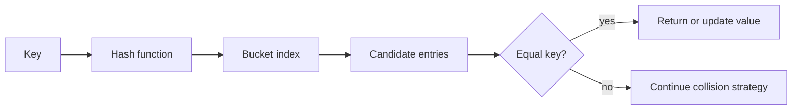

<TLDR>
  <TLDRCell label="what">
    A <Term id="hash-table">hash map</Term> turns a key into a bucket location, then uses key equality to identify the right entry among possible collisions.
  </TLDRCell>
  <TLDRCell label="trap">
    Lookup is expected `O(1)`, not an unconditional worst-case guarantee; weak hashes, high load, or broken key equality can make it slow or incorrect.
  </TLDRCell>
  <TLDRCell label="fix">
    Keep hashing and equality consistent, handle collisions explicitly, resize before buckets become crowded, and test adversarial as well as ordinary keys.
  </TLDRCell>
</TLDR>

## What it is and why it exists

A hash map stores key-value entries and supports lookup by exact key. Instead of scanning every entry, it computes a hash from the key and uses that number to choose a small part of its storage. Equality checks within that part confirm whether an entry is the requested one.

The structure exists because many programs ask the same shape of question repeatedly: which customer owns this ID, whether a token has been seen, or how many times a word occurs. A linear scan takes `O(n)` comparisons per query. A well-behaved hash map makes insertion, lookup, and deletion expected `O(1)` operations, so the work does not normally grow with the total number of entries.

The word “expected” carries the real contract. Multiple keys can choose the same storage location, and an implementation must still distinguish them. Storage also has finite capacity, so the table periodically grows and redistributes its entries.

A map is appropriate when the operation is exact-key lookup and useful ordering is absent. A sorted array or balanced tree is usually a better fit for predecessor queries, ranges, and ordered traversal. A direct array index is simpler when keys are already dense non-negative integers in a small known range.

Most languages expose a dictionary-like interface while hiding its representation. Python `dict`, Java `HashMap`, and many other collections use hash-table techniques, but their detailed layouts differ. ECMAScript requires `Map` to provide average sublinear access, yet does not require an engine to implement it as a hash table; this topic uses JavaScript `Map` only for its specified key behavior and builds a teaching table when internal mechanics matter.

### The contract behind the interface

Every key passes through two decisions. The hash function chooses where to search, while equality decides whether a candidate is the same logical key. Neither decision can safely replace the other.

A <Term id="hashable">hashable</Term> key has hash and equality behavior stable enough for the collection's rules. The core consistency rule is one-way: if two keys are equal, they must produce the same hash. Unequal keys are allowed to produce the same hash, because the table has a collision strategy.

Hash maps are not merely caches. They implement indexes, symbol tables, adjacency maps, frequency counters, joins, deduplication sets, and registries. In each case, the hardest design choice is often the key's meaning rather than the collection call itself.

## How it works

At its simplest, a hash map owns an array of buckets. A hash function converts a key into an integer, and a reduction such as `hash % capacity` selects an array index. The selected bucket stores zero or more entries that may share that index.



### Lookup and insertion

A lookup follows a narrow path:

1. Compute the key's hash using the table's configured hash function.
2. Reduce the hash to a bucket index for the current capacity.
3. Examine candidate entries along the table's collision path.
4. Compare candidate keys with the requested key using the configured equality rule.
5. Return the matching value, or report that the key is absent.

Insertion begins with the same search. If an equal key already exists, the map updates that entry's value without increasing its size. Otherwise, it adds a distinct entry and may trigger growth.

Deletion must preserve whatever search path lookup relies on. Removing a node from a chain is straightforward. An open-addressed table usually needs a tombstone or a cluster repair, because clearing a slot outright can make later collided entries unreachable.

### Collisions are normal

A <Term id="hash-collision">hash collision</Term> occurs when different keys lead to the same hash or bucket index. Since the key space is usually much larger than the bucket array, collisions are mathematically unavoidable. Correctness therefore comes from equality checks and collision handling, not from hoping that hashes are unique.

<Term id="separate-chaining">Separate chaining</Term> stores a collection of entries at each bucket. Lookup walks only the selected chain. The implementation is simple, and deletion does not disturb other buckets, but each chain adds allocation and pointer-traversal costs.

Open addressing keeps entries in the bucket array itself. On a collision, it probes other positions according to a rule such as linear, quadratic, or double hashing. This layout can improve locality, but probe behavior, deletion markers, and a nearly full table require care.

### Load and growth

The <Term id="load-factor">load factor</Term> is the number of stored entries divided by the number of buckets. For chaining it predicts average chain pressure; for open addressing it predicts how hard it is to find an empty slot. Implementations choose different thresholds because layout, cache behavior, and memory goals differ.

When the threshold is crossed, a table normally allocates a larger bucket array and reinserts or relocates existing entries. Copying entries at their old indices is incorrect because the capacity participates in index selection. The same full hash can map to a different bucket after capacity changes.

A resize is `O(n)` for the operation that performs it. Geometric growth spreads those occasional copies across many cheap insertions, giving insertion <Term id="amortized-complexity">amortized `O(1)`</Term> cost under normal assumptions. It does not make every individual insertion constant time.

### Equality defines key identity

Different runtimes expose different equality policies. Java collections can receive an <Term id="equality-comparer">equality comparer</Term>; Python keys use compatible `__eq__` and `__hash__`; JavaScript `Map` uses <Term id="same-value-zero">SameValueZero</Term>. Under SameValueZero, `NaN` equals `NaN`, positive and negative zero are equal, and distinct objects compare by identity.

For a business key such as `{ warehouse, sku }`, object identity is often not the intended meaning. You can use a canonical immutable string, an interned key object, or a language facility with value equality. The representation must be unambiguous: naïvely joining fields with a delimiter fails when a field can contain that delimiter.

### Cost model

| Operation | Expected with controlled load | Possible worst case | Main dependency |
| --- | --- | --- | --- |
| Lookup | `O(1)` | `O(n)` | hash distribution and collision path |
| Insert or update | `O(1)` amortized | `O(n)` | collision path and resizing |
| Delete | `O(1)` | `O(n)` | collision strategy |
| Iterate all entries | `O(n)` | `O(n)` | every entry must be visited |
| Resize | not performed every time | `O(n)` | all entries must be relocated |

These bounds count table work, not the cost of hashing the key itself. Hashing a long string is proportional to the characters examined unless its hash is already cached. Calling a table operation “constant time” must not hide an unbounded key-size cost.

## Examples

The examples separate observable language semantics from teaching internals. All three files were run with the local Node 24 runtime, and each output below is the captured result.

### Observing key equality

JavaScript `Map` makes object identity and SameValueZero visible without exposing buckets. Two objects with the same fields remain distinct keys, while repeated `NaN` and signed zero keys address existing entries.

<Depth level="quick">

```javascript run title="map_equality.js"
const priceByKey = new Map();
const firstOrder = { id: "A-17" };
const sameFields = { id: "A-17" };

priceByKey.set(firstOrder, 42);
priceByKey.set(sameFields, 55);
priceByKey.set(Number.NaN, "pending");
priceByKey.set(Number("not-a-number"), "updated");
priceByKey.set(-0, "credit");

console.log(`object entries: ${priceByKey.size - 2}`);
console.log(`first object: ${priceByKey.get(firstOrder)}`);
console.log(`fresh object: ${priceByKey.get({ id: "A-17" })}`);
console.log(`NaN: ${priceByKey.get(NaN)}`);
console.log(`zero: ${priceByKey.get(+0)}`);
```

```text
object entries: 2
first object: 42
fresh object: undefined
NaN: updated
zero: credit
```

<TryToBreak items={['set the same object twice', 'store undefined as a value', 'use two equal-looking arrays']} />

</Depth>

The second `NaN` assignment updates the first, and `+0` finds the value stored with `-0`. The fresh object literal does not find `firstOrder`, because equal fields do not change object identity. Nothing in this result proves that the engine uses buckets; it demonstrates only the specified key relation.

`priceByKey.get()` also cannot distinguish a missing key from a present key whose value is `undefined`. Use `priceByKey.has(key)` when that distinction affects behavior. A sentinel value is another option when the surrounding API can reserve one safely.

### Handling collisions and resizing

This small map accepts string keys, uses separate chaining, and grows when its load factor exceeds `0.75`. It is a teaching implementation rather than a replacement for the runtime collection: it omits deletion, validation, iteration APIs, and production hash hardening.

```javascript run title="string_hash_map.js"
class StringHashMap {
  constructor(capacity = 4) {
    this.buckets = Array.from({ length: capacity }, () => []);
    this.size = 0;
  }
  hash(key) {
    let hash = 2166136261;
    for (const character of key) {
      hash = Math.imul(hash ^ character.codePointAt(0), 16777619) >>> 0;
    }
    return hash;
  }
  set(key, value) {
    const bucket = this.buckets[this.hash(key) % this.buckets.length];
    const entry = bucket.find(([storedKey]) => storedKey === key);
    if (entry) {
      entry[1] = value;
      return;
    }
    bucket.push([key, value]);
    this.size += 1;
    if (this.size / this.buckets.length > 0.75) this.resize();
  }
  get(key) {
    const bucket = this.buckets[this.hash(key) % this.buckets.length];
    return bucket.find(([storedKey]) => storedKey === key)?.[1];
  }
  resize() {
    const entries = this.buckets.flat();
    this.buckets = Array.from({ length: this.buckets.length * 2 }, () => []);
    this.size = 0;
    for (const [key, value] of entries) this.set(key, value);
  }
}
const balances = new StringHashMap();
[["apples", 5], ["pears", 3], ["plums", 8], ["melon", 2]]
  .forEach(([key, value]) => balances.set(key, value));
console.log(`capacity: ${balances.buckets.length}`);
console.log(`values: ${balances.get("apples")}, ${balances.get("plums")}`);
console.log(`bucket sizes: ${balances.buckets.map((bucket) => bucket.length).join(",")}`);
```

```text
capacity: 8
values: 5, 8
bucket sizes: 1,0,1,0,2,0,0,0
```

The fourth distinct insertion takes the load from `3/4` to `4/4`, crosses the threshold, and doubles capacity to eight. Every old entry passes through `set()` again, so it receives an index based on the new capacity. Resetting `size` before reinsertion keeps the count correct.

The final bucket sizes contain a `2`: `"apples"` and `"melon"` collide at bucket four even after growth. Both lookups remain correct because the bucket retains full keys and `get()` checks equality. Storing only their hashes would lose that distinction.

The hash loop uses Unicode code points and 32-bit multiplication to make the example deterministic. It is not a claim that FNV-style hashing is suitable for hostile input, nor does it reproduce a JavaScript engine's internal hash. Production collections may randomize hashes or use other defenses.

### Building a composite business key

When callers reconstruct key objects, JavaScript object identity cannot express value equality. A canonical string can, provided its encoding preserves field boundaries. Length prefixes avoid the ambiguity of simply joining fields with `":"`.

```javascript run title="key_contract.js"
function canonicalSkuKey({ warehouse, sku }) {
  return `${warehouse.length}:${warehouse}${sku.length}:${sku}`;
}

const stock = new Map();
const parisWidget = { warehouse: "PAR", sku: "W-7" };
stock.set(canonicalSkuKey(parisWidget), 12);

const lookup = { sku: "W-7", warehouse: "PAR" };
console.log(`key: ${canonicalSkuKey(lookup)}`);
console.log(`stock: ${stock.get(canonicalSkuKey(lookup))}`);

lookup.sku = "W-8";
console.log(`after mutation: ${stock.get(canonicalSkuKey(lookup))}`);
console.log(`original: ${stock.get(canonicalSkuKey(parisWidget))}`);
```

```text
key: 3:PAR3:W-7
stock: 12
after mutation: undefined
original: 12
```

Property order does not matter because the function reads named fields in a fixed order. Mutating `lookup` changes the derived key for later lookups, but it cannot move or corrupt the already stored string key. The original record still derives the original key.

Canonicalization must also define types, normalization, case rules, and missing values. If warehouse identifiers are case-insensitive, normalize them before encoding and apply the same rule on every insertion and lookup path. For arbitrary structured data, prefer a specified serialization or a value-key facility over inventing an incomplete encoding.

## Pitfalls

### Treating the hash as identity

> [!PITFALL]
> A hash narrows the search; it does not prove equality. Different keys can have the same hash, so code that stores only `hash -> value` can silently overwrite an unrelated entry.

**Fix:** retain the full key or an equivalently collision-free canonical representation and compare candidates with the defined equality rule. Test two deliberately colliding keys and confirm that both values remain reachable.

### Breaking the hash-equality contract

> [!PITFALL]
> Custom equality that ignores case while hashing the original case makes equal keys select different search paths. A mutable key has the same failure when fields used by its hash or equality change after insertion.

**Fix:** derive equality and hashing from the same immutable fields and normalization steps. Prefer immutable key types; otherwise remove an entry before changing key fields and insert it again afterward.

### Promising worst-case constant time

> [!PITFALL]
> “Hash lookup is `O(1)`” drops the assumptions. Concentrated collisions can make a chain or probe sequence approach `O(n)`, and hashing a key of unbounded length is not constant work.

**Fix:** say expected `O(1)` under controlled load and adequate hash distribution. Bound untrusted key sizes, use runtime-provided hardened collections, and benchmark representative and adversarial distributions when latency matters.

### Resizing without rehashing

> [!PITFALL]
> Copying bucket arrays by position during growth leaves entries at indices chosen for the old capacity. A later lookup reduces the same hash with the new capacity and may search a different bucket.

**Fix:** reinsert or correctly relocate every live entry according to the new table geometry. Test lookups for all entries immediately before and after each growth boundary, including colliding keys.

### Confusing absence with a stored value

> [!PITFALL]
> APIs that return `undefined`, `null`, zero, or another ordinary value for a miss become ambiguous when that value is also valid data. A truthiness check additionally misclassifies stored `false`, `0`, and empty strings.

**Fix:** use the collection's membership operation, such as `Map.has()`, or return a tagged result that separates presence from value. Include each falsey value and one absent key in tests.

### Using a plain object as an untrusted dictionary

> [!PITFALL]
> In JavaScript, a normal object's prototype and special property names create semantics beyond a key-value bag. Generated code that writes untrusted keys and later merges or reads properties can enable prototype-related bugs.

**Fix:** use `Map` when keys are arbitrary, or create a null-prototype object when string-property interoperability is required. Validate keys at trust boundaries and use own-property checks rather than inherited membership.

<Depth level="deep">

## Why expected O(1) can collapse

Expected constant time is a statement about a workload and an implementation, not a property of the map interface alone. The table needs hashes distributed well enough across its current bucket count, a load kept within its design range, and equality checks that are not unexpectedly expensive. Break any of those conditions and the candidate set grows.

### Distribution matters more than numeric variety

A hash can produce many different integers yet distribute poorly after index reduction. If a table uses a power-of-two capacity, weak low bits can concentrate keys even when high bits vary. Good implementations mix relevant bits or choose a reduction scheme consistent with the hash function.

Uniform distribution does not mean preserving a key's natural order. In fact, nearby keys should not be expected to occupy nearby buckets. If ordered or prefix access is required, it belongs in another index rather than in assumptions about hash layout.

Average bucket occupancy alone can also hide a long tail. One chain of length fifty and many empty buckets may have an acceptable overall load factor but poor latency for keys in that chain. Inspect maximum chain or probe length when diagnosing outliers.

### Adversarial collisions

For a public endpoint, users may control keys and repeat requests. If they can cheaply construct many keys that collide under a deterministic hash, ordinary expected lookup can become linear and consume disproportionate CPU. This is often called hash flooding.

Runtime collections may use a per-process random seed, a keyed hash, tree-shaped collision bins, probe limits, or other mitigations. Those are implementation-specific defenses, not permission to accept unbounded keys or unbounded collections. Use the supported collection, enforce input and capacity limits, and avoid publishing internal hash details unnecessarily.

A cryptographic digest does not automatically solve the complete problem. It may be needlessly expensive, truncation still permits collisions, and equality checks remain necessary. Choose a table hash for distribution and attack model, while using cryptographic hashes for security properties such as integrity only when that separate requirement exists.

### The equality law

For keys `a` and `b`, a table needs this implication:

```text
equal(a, b)  =>  hash(a) == hash(b)
```

The reverse implication is false. Equal hashes merely put keys on the same collision path. Equality must still distinguish keys that share a hash.

Equality should also behave as an equivalence relation: a key equals itself, order does not change the result, and chains of equality remain consistent. Floating-point `NaN`, approximate comparison, locale-sensitive text rules, and partially normalized identifiers deserve special attention because naïve relations can violate these expectations.

An equality operation that reads time, mutable global configuration, or remote state is unsuitable for a key. The same pair could compare differently across operations, making the table's existing placement meaningless. Key identity should be deterministic for at least the entry's lifetime.

### Resize latency and memory peaks

Geometric growth gives a useful amortized bound because capacities do not increase by one for every insertion. The expensive resize still happens on one operation in a basic implementation, so a latency-sensitive system can observe a pause even though the long-run average is low.

During rehashing, the old and new storage may coexist. Peak memory can therefore exceed the steady-state size at exactly the moment the collection is growing. A capacity plan should consider peak live data, allocator behavior, and whether the runtime offers a supported size hint.

Some implementations migrate a bounded number of buckets on each later operation. Incremental rehashing spreads latency but makes lookups consult old and new tables until migration finishes. Correctness then requires a single ownership rule for every entry and careful handling of updates during migration.

Pre-sizing can avoid repeated early growth when an approximate entry count is trustworthy. It should remain a performance hint, not a correctness dependency, because runtimes differ in how they interpret capacity arguments. Gross over-allocation wastes memory and cache space.

### Open-addressing invariants

Open addressing depends on every lookup following the same probe sequence as insertion. A truly empty slot can terminate an unsuccessful lookup because no earlier insertion could have skipped it. A deleted slot cannot always do so, because a collided key may live farther along the same sequence.

A tombstone records “previously occupied, keep probing.” Too many tombstones make probes longer, so implementations periodically rebuild or compact the table. Reusing a tombstone for insertion must not stop the search early if an equal key already exists later in the sequence.

Probe cycles must cover enough of the table to guarantee an available slot can be found under the permitted load. The capacity and step function therefore interact. A formula copied without its number-theoretic assumptions can loop over only a subset of buckets.

### Chaining invariants

Separate chaining has a simpler reachability rule: every entry belongs to the bucket selected by its current hash and the current capacity. Within a bucket, at most one entry may exist for an equality class. An update changes the value in that entry rather than appending a duplicate.

Chains can use linked nodes, compact arrays, or another small structure. The choice changes allocation and locality but not the semantic requirement to compare keys. Converting a long chain to a tree can bound collision lookup more tightly, provided the implementation has a stable ordering rule for nodes.

### Tests that expose structural bugs

Random tests are useful, but targeted boundaries find more implementation mistakes. Keep a simple reference model and apply the same generated sequence of `set`, `get`, `has`, and `delete` operations to both structures. Compare visible results and size after every operation.

A focused suite should include:

1. Two unequal keys with the same bucket index that are inserted, updated, and deleted in both orders.
2. Two distinct representations that equality considers the same key, proving updates do not increase size.
3. Insertions immediately below, at, and above each resize threshold, followed by lookup of every earlier key.
4. Missing keys that share a bucket with present keys, plus legitimate values equal to the API's miss sentinel.
5. Very short, very long, Unicode, normalized and non-normalized, and attacker-shaped keys within declared limits.

Internal assertions can verify that counted entries equal `size`, every live entry is reachable through its prescribed search path, and no equality class appears twice. These checks are expensive enough to reserve for tests or debug builds, where they turn silent corruption into a local failure.

### Choosing another structure

A hash map is not a universal faster map. A small array can win when the collection stays tiny because it avoids hashing and indirection. A balanced tree provides ordered iteration and `O(log n)` worst-case search, while a trie supports prefix operations over suitable keys.

Database indexes add persistence, concurrency, range planning, and storage-page concerns that an in-memory map does not address. A process-local hash map cannot enforce uniqueness across service replicas. Choose the structure at the ownership boundary where the key space and required queries actually live.

The final design question is observable semantics. Specify what makes keys equal, whether iteration order matters, how absence is represented, who may mutate values, and what concurrency guarantees callers need. Only then does the hash-table layout become the right optimization problem.

</Depth>

<Checkpoint id="foundations/hash-maps" />

## Further reading

- [ECMAScript Language Specification: Map Objects](https://tc39.es/ecma262/multipage/keyed-collections.html#sec-map-objects)
- [Java SE 25 API: `HashMap`](https://docs.oracle.com/en/java/javase/25/docs/api/java.base/java/util/HashMap.html)
- [Python 3.14 documentation: mapping types](https://docs.python.org/3.14/library/stdtypes.html#mapping-types-dict)
- [The Go Programming Language Specification: map types](https://go.dev/ref/spec#Map_types)
- [MDN Web Docs: `Map`](https://developer.mozilla.org/en-US/docs/Web/JavaScript/Reference/Global_Objects/Map)
