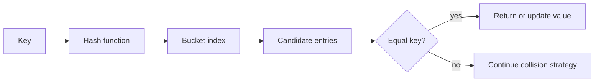

<TLDR>
  <TLDRCell label="what">
    <Term id="hash-table">哈希表（hash map）</Term>把键转换为桶位置，再通过键相等规则，从可能发生冲突的候选项中找出正确条目。
  </TLDRCell>
  <TLDRCell label="trap">
    查找的预期复杂度是 `O(1)`，并非无条件的最坏情况保证；哈希质量差、负载过高或键相等规则错误，都会造成性能或正确性问题。
  </TLDRCell>
  <TLDRCell label="fix">
    哈希与相等规则应保持一致，冲突必须显式处理，桶变得拥挤前应扩容，并且测试要同时覆盖普通键与对抗性键。
  </TLDRCell>
</TLDR>

## 是什么，为什么存在

哈希表保存键值条目，并支持按精确键查找。它不扫描全部条目，而是根据键计算哈希值，用这个数字选出一小部分存储区域，再在其中用相等规则确认哪个条目才是目标。

这种结构适合反复回答同一类问题：哪个客户拥有某个 ID、某个令牌是否出现过，或者某个单词出现了几次。线性扫描每次查询需要 `O(n)` 次比较。运行良好的哈希表能让插入、查找和删除达到预期 `O(1)`，因此工作量通常不会随条目总数一起增长。

「预期」二字才是实际契约。多个键可能选中同一存储位置，实现仍必须区分它们。存储容量也有限，所以表会定期增长，并重新分布已有条目。

当操作是精确键查找，且没有有用的顺序时，映射很合适。如果需要前驱查询、范围查询或有序遍历，排序数组或平衡树通常更合适。如果键本来就是较小已知范围内的稠密非负整数，直接使用数组索引会更简单。

多数语言提供类似字典的接口，同时隐藏具体表示。Python `dict`、Java `HashMap` 和许多其他集合采用哈希表技术，但内部布局并不相同。ECMAScript 要求 `Map` 提供平均次线性访问，却没有要求引擎必须使用哈希表；本主题只用 JavaScript `Map` 展示规范规定的键行为，需要观察内部机制时则构建一个教学实现。

### 接口背后的契约

每个键都要经过两项判断。哈希函数决定去哪里查找，相等规则决定候选项是不是同一个逻辑键。两者都不能安全地取代另一个。

<Term id="hashable">可哈希（hashable）</Term>的键具有足够稳定的哈希与相等行为，能满足集合规则。核心一致性规则是单向的：如果两个键相等，它们必须产生相同哈希值。不同的键可以产生相同哈希值，因为表具有冲突处理策略。

哈希表不只是缓存。它还能实现索引、符号表、邻接映射、频率计数器、连接、去重集合和注册表。在这些场景中，最难的设计选择往往是键代表什么，而不是调用哪个集合方法。

## 工作原理

最简单的哈希表拥有一个桶数组。哈希函数把键转换为整数，再通过 `hash % capacity` 一类缩减运算选择数组索引。选中的桶保存零个或多个可能共用该索引的条目。



### 查找与插入

一次查找沿着很窄的路径完成：

1. 用表配置的哈希函数计算键的哈希值。
2. 根据当前容量把哈希值缩减为桶索引。
3. 沿着表的冲突处理路径检查候选条目。
4. 用配置的相等规则，把候选键与请求键比较。
5. 返回匹配值，或者报告键不存在。

插入从同样的搜索开始。如果相等的键已经存在，映射就更新该条目的值，而不增加大小。否则，它会添加一个不同条目，并可能触发扩容。

删除必须保留查找所依赖的搜索路径。从链中删除节点很直接。开放寻址表通常需要墓碑标记或修复簇，因为直接清空槽位可能让后面的冲突条目无法到达。

### 冲突是正常现象

不同键得到相同哈希值或桶索引时，就发生<Term id="hash-collision">哈希冲突（hash collision）</Term>。键空间通常远大于桶数组，所以从数学上说冲突不可避免。正确性来自相等检查与冲突处理，而不是期待哈希值唯一。

<Term id="separate-chaining">拉链法（separate chaining）</Term>在每个桶中保存一个条目集合，查找只遍历选中的链。它实现简单，删除不会干扰其他桶，但每条链会增加分配与指针遍历开销。

开放寻址把条目直接保存在桶数组中。发生冲突时，它根据线性探测、二次探测或双重哈希等规则检查其他位置。这种布局可以改善局部性，但必须谨慎处理探测行为、删除标记以及接近满载的表。

### 负载与增长

<Term id="load-factor">负载因子（load factor）</Term>等于已存条目数除以桶数。对于拉链法，它预示平均链压力；对于开放寻址，它预示寻找空槽的难度。不同实现会选择不同阈值，因为布局、缓存行为与内存目标并不相同。

超过阈值后，表通常会分配更大的桶数组，再重新插入或移动已有条目。按旧索引直接复制条目是错误的，因为容量参与了索引选择。同一个完整哈希值在容量变化后可能映射到不同桶。

执行扩容的那次操作具有 `O(n)` 成本。几何增长把这些偶发复制分摊到许多廉价插入上，因此正常假设下，插入具有<Term id="amortized-complexity">摊还 `O(1)`（amortized `O(1)`）</Term>成本，但并非每一次插入都是常数时间。

### 相等规则定义键标识

不同运行时暴露不同的相等策略。Java 集合可以接收<Term id="equality-comparer">相等比较器（equality comparer）</Term>；Python 键使用相互兼容的 `__eq__` 与 `__hash__`；JavaScript `Map` 使用<Term id="same-value-zero">同值零相等（SameValueZero）</Term>。在 SameValueZero 下，`NaN` 等于 `NaN`，正零与负零相等，不同对象则按标识比较。

对于 `{ warehouse, sku }` 这样的业务键，对象标识往往不是预期含义。可以改用规范化的不可变字符串、驻留键对象，或者支持值相等的语言功能。表示必须没有歧义：直接用分隔符连接字段时，只要字段自身能包含该分隔符，编码就会失效。

### 成本模型

| 操作 | 受控负载下的预期成本 | 可能的最坏情况 | 主要影响因素 |
| --- | --- | --- | --- |
| 查找 | `O(1)` | `O(n)` | 哈希分布与冲突路径 |
| 插入或更新 | 摊还 `O(1)` | `O(n)` | 冲突路径与扩容 |
| 删除 | `O(1)` | `O(n)` | 冲突策略 |
| 遍历所有条目 | `O(n)` | `O(n)` | 必须访问每个条目 |
| 扩容 | 并非每次都执行 | `O(n)` | 必须移动所有条目 |

这些界限只计算表本身的工作，不包括计算键哈希值的成本。除非哈希已被缓存，对长字符串求哈希的成本与检查的字符数成正比。把表操作称为「常数时间」时，不能隐藏无界键长度的成本。

## 示例

下面的示例把可观察的语言语义与教学用内部机制分开。三个文件都用本地 Node 24 运行，后面的输出均为实际捕获结果。

### 观察键相等规则

JavaScript `Map` 能展示对象标识和 SameValueZero，而无需暴露桶。同字段的两个对象仍是不同键；重复的 `NaN` 与带符号零则会定位到已有条目。

<Depth level="quick">

```javascript run title="map_equality.js"
const priceByKey = new Map();
const firstOrder = { id: "A-17" };
const sameFields = { id: "A-17" };

priceByKey.set(firstOrder, 42);
priceByKey.set(sameFields, 55);
priceByKey.set(Number.NaN, "pending");
priceByKey.set(Number("not-a-number"), "updated");
priceByKey.set(-0, "credit");

console.log(`object entries: ${priceByKey.size - 2}`);
console.log(`first object: ${priceByKey.get(firstOrder)}`);
console.log(`fresh object: ${priceByKey.get({ id: "A-17" })}`);
console.log(`NaN: ${priceByKey.get(NaN)}`);
console.log(`zero: ${priceByKey.get(+0)}`);
```

```text
object entries: 2
first object: 42
fresh object: undefined
NaN: updated
zero: credit
```

<TryToBreak items={['重复设置同一个对象', '把 undefined 存为值', '使用两个内容相同的数组']} />

</Depth>

第二次 `NaN` 赋值更新了第一次的条目，`+0` 也能找到用 `-0` 保存的值。新的对象字面量找不到 `firstOrder`，因为字段相同不会改变对象标识。这个结果不能证明引擎使用桶，只展示规范定义的键关系。

`priceByKey.get()` 也无法区分缺失键与值为 `undefined` 的已有键。这个区别会影响行为时，应使用 `priceByKey.has(key)`。如果外围 API 能安全保留一个特殊值，也可以使用哨兵值。

### 处理冲突与扩容

这个小型映射接收字符串键，使用拉链法，并在负载因子超过 `0.75` 时增长。它只是教学实现，不能替代运行时集合：其中省略了删除、校验、迭代 API 与生产级哈希加固。

```javascript run title="string_hash_map.js"
class StringHashMap {
  constructor(capacity = 4) {
    this.buckets = Array.from({ length: capacity }, () => []);
    this.size = 0;
  }
  hash(key) {
    let hash = 2166136261;
    for (const character of key) {
      hash = Math.imul(hash ^ character.codePointAt(0), 16777619) >>> 0;
    }
    return hash;
  }
  set(key, value) {
    const bucket = this.buckets[this.hash(key) % this.buckets.length];
    const entry = bucket.find(([storedKey]) => storedKey === key);
    if (entry) {
      entry[1] = value;
      return;
    }
    bucket.push([key, value]);
    this.size += 1;
    if (this.size / this.buckets.length > 0.75) this.resize();
  }
  get(key) {
    const bucket = this.buckets[this.hash(key) % this.buckets.length];
    return bucket.find(([storedKey]) => storedKey === key)?.[1];
  }
  resize() {
    const entries = this.buckets.flat();
    this.buckets = Array.from({ length: this.buckets.length * 2 }, () => []);
    this.size = 0;
    for (const [key, value] of entries) this.set(key, value);
  }
}
const balances = new StringHashMap();
[["apples", 5], ["pears", 3], ["plums", 8], ["melon", 2]]
  .forEach(([key, value]) => balances.set(key, value));
console.log(`capacity: ${balances.buckets.length}`);
console.log(`values: ${balances.get("apples")}, ${balances.get("plums")}`);
console.log(`bucket sizes: ${balances.buckets.map((bucket) => bucket.length).join(",")}`);
```

```text
capacity: 8
values: 5, 8
bucket sizes: 1,0,1,0,2,0,0,0
```

第四个不同键插入后，负载从 `3/4` 变成 `4/4`，超过阈值，容量翻倍为八。每个旧条目都再次经过 `set()`，因此会按新容量取得索引。重新插入前把 `size` 清零，可以保证计数正确。

最终桶大小中出现了一个 `2`：扩容以后，`"apples"` 与 `"melon"` 仍在第四号桶发生冲突。桶保留了完整键，`get()` 也会检查相等性，因此两次查找都正确。如果只保存哈希值，就会丢失这种区别。

哈希循环使用 Unicode 码点和 32 位乘法，让示例结果保持确定。这并不表示 FNV 风格哈希适合恶意输入，也不是在复现 JavaScript 引擎的内部哈希。生产集合可能会随机化哈希值或采用其他防御措施。

### 构建复合业务键

当调用方会重建键对象时，JavaScript 对象标识无法表达值相等。只要编码能保留字段边界，就可以使用规范化字符串。长度前缀避免了直接用 `":"` 连接字段造成的歧义。

```javascript run title="key_contract.js"
function canonicalSkuKey({ warehouse, sku }) {
  return `${warehouse.length}:${warehouse}${sku.length}:${sku}`;
}

const stock = new Map();
const parisWidget = { warehouse: "PAR", sku: "W-7" };
stock.set(canonicalSkuKey(parisWidget), 12);

const lookup = { sku: "W-7", warehouse: "PAR" };
console.log(`key: ${canonicalSkuKey(lookup)}`);
console.log(`stock: ${stock.get(canonicalSkuKey(lookup))}`);

lookup.sku = "W-8";
console.log(`after mutation: ${stock.get(canonicalSkuKey(lookup))}`);
console.log(`original: ${stock.get(canonicalSkuKey(parisWidget))}`);
```

```text
key: 3:PAR3:W-7
stock: 12
after mutation: undefined
original: 12
```

属性顺序没有影响，因为函数按固定顺序读取具名字段。修改 `lookup` 会改变后续查找生成的键，但无法移动或破坏已经保存的字符串键。原始记录仍能生成原来的键。

规范化还必须定义类型、归一化、大小写规则和缺失值。如果仓库标识不区分大小写，就要在编码前归一化，并在每个插入与查找路径应用同一规则。对于任意结构化数据，应优先使用明确规定的序列化格式或值键功能，避免自行发明不完整的编码。

## 陷阱

### 把哈希值当作标识

> [!PITFALL]
> 哈希值只会缩小搜索范围，不能证明相等。不同键可以拥有相同哈希值，因此只保存 `hash -> value` 的代码可能静默覆盖无关条目。

**修复：**保留完整键或同样不会冲突的规范表示，并按定义好的相等规则比较候选项。构造两个必定冲突的键，确认两个值都仍然可以访问。

### 破坏哈希与相等契约

> [!PITFALL]
> 自定义相等规则忽略大小写，却按原始大小写计算哈希，会让相等键走向不同搜索路径。如果可变键参与哈希或相等判断的字段在插入后变化，也会出现同样的问题。

**修复：**从同一组不可变字段和归一化步骤推导相等与哈希规则。优先使用不可变键类型；否则应在修改键字段前删除条目，修改后再重新插入。

### 把常数时间说成最坏情况保证

> [!PITFALL]
> 「哈希查找是 `O(1)`」省略了成立条件。集中冲突会让链或探测序列接近 `O(n)`，对无界长度的键求哈希也不是常数工作。

**修复：**准确说法是在负载受控、哈希分布充分时，预期成本为 `O(1)`。限制不可信键的长度，使用运行时提供的加固集合；延迟很重要时，要基准测试代表性分布与对抗性分布。

### 扩容后不重新哈希

> [!PITFALL]
> 增长时按位置复制桶数组，会让条目留在按旧容量选出的索引。后续查找用新容量缩减同一个哈希值，可能会搜索另一个桶。

**修复：**按新表的几何结构，重新插入或正确移动每个活动条目。在每个增长边界前后立即查找全部条目，并覆盖发生冲突的键。

### 混淆缺失与已存值

> [!PITFALL]
> 如果 API 用 `undefined`、`null`、零或其他普通值表示未命中，而这些值本身又是合法数据，返回结果就会有歧义。真值判断还会把已保存的 `false`、`0` 和空字符串误判为缺失。

**修复：**使用集合的成员检查操作，例如 `Map.has()`；也可以返回带标签的结果，明确区分是否存在和值本身。测试要包含每一种假值与一个缺失键。

### 把普通对象用作不可信字典

> [!PITFALL]
> 在 JavaScript 中，普通对象的原型和特殊属性名带来了键值包以外的语义。生成代码如果写入不可信键，之后又合并或读取属性，就可能产生原型相关缺陷。

**修复：**键可以是任意值时使用 `Map`；如果必须与字符串属性互操作，则创建无原型对象。在信任边界校验键，并使用自有属性检查，而不是继承成员检查。

## AI 时代

**生成代码在这里容易犯什么错**

模型经常把扫描替换成映射，却选错键，例如用每次新建的对象查找按标识比较的键。它们还会把 `JSON.stringify()` 当成通用复合键，而属性顺序、省略值、数值边界与归一化方式都可能不同。另一个常见问题是教学实现遇到冲突就覆盖，复制桶却不重新哈希，或者因大小计数错误在重新插入时递归扩容。

生成的性能解释也常把预期行为说成保证。它们可能声称每次操作都是 `O(1)`，忽略长输入的哈希成本，或者在公开服务中使用由攻击者控制的确定性哈希。遇到可变键类型时，模型经常从不同字段生成 `equals()` 与 `hashCode()`，或者纳入插入后仍能变化的字段。

**要求 AI 检查**

- 说明准确的键相等规则、哈希输入、规范化步骤，以及参与字段能否变化。
- 构造两个会冲突但不相等的键、两个分别创建但应该相等的键，以及每个扩容阈值两侧的键。
- 跟踪一次未命中、一次更新、一次冲突、一次删除（如果支持）和一次扩容，同时检查大小与可达性不变量。

**审查清单**

- 确认相等键始终产生相同哈希，发生冲突时会保留并比较完整候选键。
- 区分预期或摊还界限与最坏情况工作，同时计入键哈希和扩容延迟。
- 检查缺失与已存值的区别、不可信输入限制，以及可变键和值的所有权。

**提示词汇**

使用准确术语：`hash function`（哈希函数）、`key equality`（键相等）、`hash-equality contract`（哈希与相等契约）、`collision resolution`（冲突解决）、`separate chaining`（拉链法）、`open addressing`（开放寻址）、`probe sequence`（探测序列）、`load factor`（负载因子）、`rehashing`（重新哈希）、`amortized O(1)`（摊还 `O(1)`）、`worst-case O(n)`（最坏 `O(n)`）、`canonical key`（规范键）和 `hash-flooding resistance`（抗哈希洪泛）。要求 AI 提供涵盖大小、桶所有权和键可达性的不变量表，而不是只说「让查找更快」。

<Depth level="deep">

## 预期 O(1) 为什么会失效

预期常数时间描述的是工作负载与实现，而不只是映射接口的性质。哈希值必须在当前桶数下充分分布，负载要保持在设计范围内，相等检查也不能意外昂贵。任何条件被破坏，候选集合都会变大。

### 分布比数值多样性更重要

哈希函数可能产生许多不同整数，但在缩减索引后分布很差。如果表的容量是二的幂，较弱的低位会把键集中起来，即使高位一直变化。良好实现会混合相关位，或者选择与哈希函数相符的缩减方案。

均匀分布不表示保留键的自然顺序。实际上，不应期待相近的键落在相近桶中。如果需要顺序或前缀访问，应使用另一个索引，而不是依赖哈希布局。

平均桶占用率也可能掩盖长尾。一个长度为五十的链加上许多空桶，整体负载因子看似可接受，但链中键的延迟很差。诊断异常值时，应检查最长链或最长探测距离。

### 对抗性冲突

对于公开端点，用户可能控制键并重复发起请求。如果他们能用很低成本构造大量键，使其在确定性哈希下发生冲突，普通的预期查找就可能变成线性，并消耗过量 CPU。这类攻击通常称为哈希洪泛。

运行时集合可能使用进程级随机种子、带密钥的哈希、树形冲突桶、探测限制或其他缓解措施。这些措施属于具体实现，并不意味着可以接收无界键或无界集合。应使用受支持的集合，执行输入与容量限制，也不要无谓公开内部哈希细节。

加密摘要不会自动解决整个问题。它可能带来不必要的高成本，截断后仍然允许冲突，而且相等检查仍不可少。表哈希应按分布与攻击模型选择；只有确实需要完整性等独立安全属性时，才另外使用加密哈希。

### 相等定律

对于键 `a` 与 `b`，表需要满足下面的蕴含关系：

```text
equal(a, b)  =>  hash(a) == hash(b)
```

反向蕴含不成立。哈希值相等只表示键进入同一冲突路径，相等规则仍要区分共用哈希的不同键。

相等关系还应是等价关系：键与自身相等，交换比较顺序不会改变结果，相等链也应保持一致。浮点 `NaN`、近似比较、受区域设置影响的文本规则，以及只做部分归一化的标识，都需要特别检查，因为简单实现可能破坏这些预期。

读取时间、可变全局配置或远程状态的相等操作不适合用在键上。同一对键可能在不同操作中得到不同结果，使表中已有位置失去意义。至少在条目存活期间，键标识必须具有确定性。

### 扩容延迟与内存峰值

几何增长能提供有用的摊还界限，因为容量不会为每次插入只增加一。基础实现仍会在一次操作中执行昂贵扩容，因此即使长期平均成本很低，延迟敏感系统仍可能观察到停顿。

重新哈希期间，新旧存储可能同时存在。因此，集合正在增长的时刻，内存峰值可能超过稳态大小。容量计划要考虑活动数据峰值、分配器行为，以及运行时是否提供受支持的大小提示。

有些实现会在后续每次操作中迁移有限数量的桶。渐进重新哈希可以分散延迟，但在迁移结束前，查找需要同时检查新旧表。此时的正确性依赖每个条目的唯一所有权规则，以及迁移期间对更新的谨慎处理。

如果大致条目数可信，预先设置容量可以避免早期反复增长。它只能是性能提示，不能成为正确性依赖，因为不同运行时解释容量参数的方式不同。过度分配会浪费内存与缓存空间。

### 开放寻址不变量

开放寻址要求每次查找遵循与插入相同的探测序列。真正的空槽可以终止失败查找，因为此前的插入不可能跳过它。但已删除槽位并不总能终止搜索，因为冲突键可能位于同一序列的更后方。

墓碑表示「以前有条目，需要继续探测」。墓碑过多会拉长探测，因此实现会定期重建或压缩表。插入时复用墓碑，也不能提前停止搜索，因为序列后面可能已经存在相等键。

探测循环必须覆盖足够多的表位置，才能保证在允许负载下找到可用槽位。因此，容量与步进函数会相互影响。照搬一个公式却遗漏其数论前提，可能只在一部分桶中循环。

### 拉链法不变量

拉链法的可达性规则更简单：每个条目都属于由当前哈希与当前容量选出的桶。在同一桶中，每个相等类至多出现一个条目。更新应该改变该条目的值，而不是追加重复项。

链可以使用链接节点、紧凑数组或其他小型结构。具体选择会改变分配与局部性，但不会取消比较键的语义要求。只要实现能为节点提供稳定顺序规则，把过长链转换成树还可以更严格地限制冲突查找成本。

### 暴露结构缺陷的测试

随机测试有用，但针对边界的测试更容易找到实现错误。准备一个简单参考模型，把同一组生成的 `set`、`get`、`has` 和 `delete` 操作应用到两个结构上。每次操作后比较可见结果与大小。

一组聚焦测试应包含：

1. 两个桶索引相同但不相等的键，按两种顺序插入、更新和删除。
2. 两种不同表示被相等规则视为同一个键，证明更新不会增加大小。
3. 在每个扩容阈值的正下方、阈值处与正上方插入，再查找此前全部键。
4. 与已有键共享桶的缺失键，以及与 API 未命中哨兵相等的合法值。
5. 在声明限制内的极短、极长、Unicode、已归一化、未归一化和攻击者构造的键。

内部断言可以验证计数条目数等于 `size`、每个活动条目都能沿规定搜索路径到达，而且相等类不会出现两次。这些检查开销较大，适合测试或调试构建，可把静默破坏变成局部失败。

### 选择其他结构

哈希表并不是普遍更快的映射。如果集合一直很小，小数组可能更快，因为它不需要哈希和间接访问。平衡树能提供有序遍历和最坏 `O(log n)` 查找，字典树则能为适合的键提供前缀操作。

数据库索引还涉及持久化、并发、范围规划和存储页，这些都不是内存映射能解决的问题。进程内哈希表无法在多个服务副本之间执行唯一性约束。结构应选择在键空间与所需查询真正所在的所有权边界。

最后要确定的是可观察语义。明确什么条件让键相等、迭代顺序是否重要、如何表示缺失、谁可以修改值，以及调用方需要何种并发保证。完成这些定义以后，哈希表布局才成为正确的优化问题。

</Depth>

<Checkpoint id="foundations/hash-maps" />

## 延伸阅读

- [ECMAScript 语言规范：Map 对象](https://tc39.es/ecma262/multipage/keyed-collections.html#sec-map-objects)
- [Java SE 25 API：`HashMap`](https://docs.oracle.com/en/java/javase/25/docs/api/java.base/java/util/HashMap.html)
- [Python 3.14 文档：映射类型](https://docs.python.org/3.14/library/stdtypes.html#mapping-types-dict)
- [Go 编程语言规范：映射类型](https://go.dev/ref/spec#Map_types)
- [MDN Web Docs：`Map`](https://developer.mozilla.org/en-US/docs/Web/JavaScript/Reference/Global_Objects/Map)
