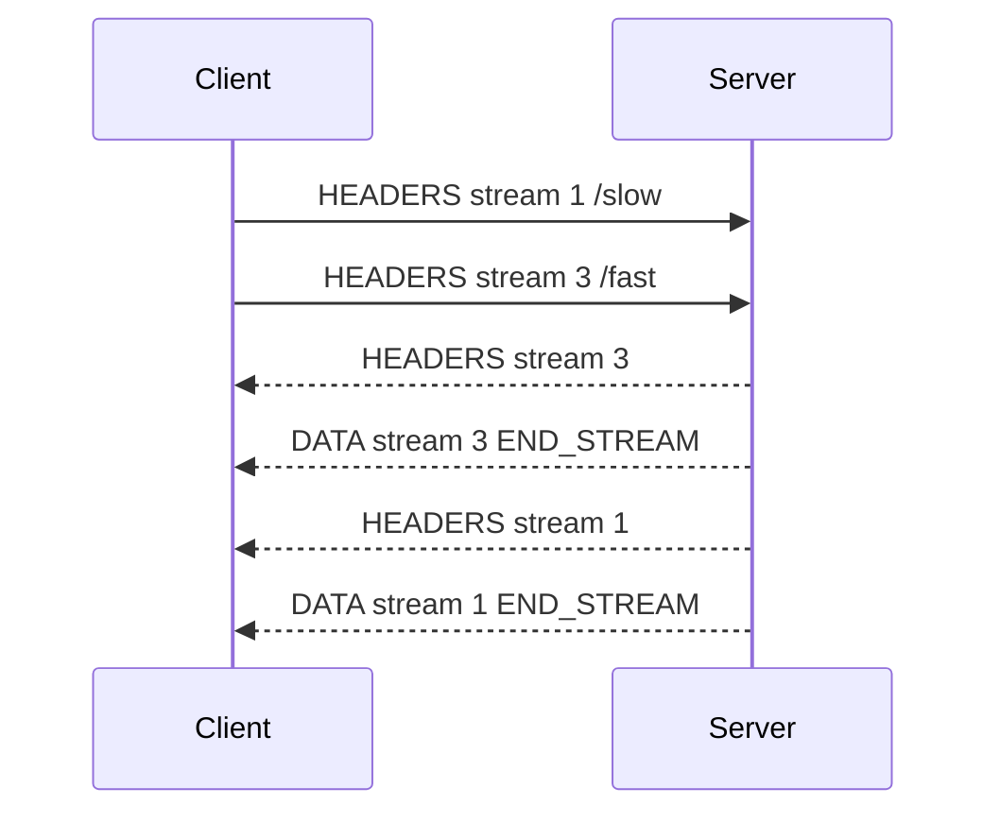

<TLDR>
  <TLDRCell label="what">
    HTTP/2 preserves HTTP methods, status codes, and field semantics, but splits messages into binary frames tagged with stream IDs so requests and responses can share one connection.
  </TLDRCell>
  <TLDRCell label="trap">
    Multiplexing removes HTTP/1.1 response ordering, but it does not remove connection-wide head-of-line blocking after TCP loss or impose application concurrency limits.
  </TLDRCell>
  <TLDRCell label="fix">
    Reuse long-lived sessions, bound in-flight streams, consume or cancel every response, and design `RST_STREAM`, `GOAWAY`, and retry policy together.
  </TLDRCell>
</TLDR>

## What it is and why it exists

HTTP/2 is a binary mapping of HTTP. It does not change application semantics such as `GET`, `POST`, status codes, caching, or authentication. It changes how those messages are encoded and interleaved on a connection, whether the peers are clients, servers, reverse proxies, or load balancers.

HTTP/1.1 can reuse a persistent connection, but responses on that connection must arrive in request order. Pipelining is hard to use under that constraint, so clients commonly open several connections. More connections repeat handshake and congestion-control work, while fields are sent again with every request.

HTTP/2 puts each request and response on an <Term id="http2-stream">HTTP/2 stream</Term>, then divides the message into <Term id="http2-frame">frames</Term>. Frames from different streams can be interleaved on one connection, a capability called <Term id="multiplexing">multiplexing</Term>. A slow response no longer has to block another response that is ready.

You meet HTTP/2 between browsers and edge nodes, in service APIs, under gRPC, and in command-line clients. Applications rarely construct frames themselves, but they still need to understand stream lifetime, connection sharing, and retry boundaries. Bad concurrency or timeout policy can defeat sensible protocol-library defaults.

HTTP/2 is not an older name for HTTP/3. HTTP/2 normally runs over one TCP connection, whereas HTTP/3 uses QUIC. Both expose streams, but their loss, migration, and handshake behavior differs.

HTTP/2 is not synonymous with encryption either. The specification defines TLS and cleartext uses, though public Web clients normally use it through TLS. TLS and application policy still provide authentication, authorization, and content confidentiality.

Changing the transport version does not fix inefficient queries, oversized responses, or missing caching. It changes how messages cross the network, not how much work an endpoint performs. Capacity planning still starts with the end-to-end path.

Cookies and other application fields also retain their meanings. HPACK can reduce repeated encodings, but it does not make sensitive fields safe to log or share across tenants. Compression is no reason to relax data-classification rules.

To determine whether a system uses HTTP/2 correctly, inspect negotiation, connection reuse, stream lifetime, and failure handling. The presence of `h2` in a configuration file does not prove that the request path has those properties.

## How it works

### One connection carries many streams

Every stream has a 31-bit identifier. Ordinary client-initiated streams use increasing odd identifiers, while stream `0` is reserved for connection-control frames. Identifiers are never reused, so a long-lived connection keeps assigning new ones until it closes.

A request normally begins with a `HEADERS` frame, as does a response. A body travels in one or more `DATA` frames. The `END_STREAM` flag means that the sender will send no more data on that stream, so the request and response directions can end at different times.

This sequence shows two requests sharing a connection. The response on stream `3` finishes first without waiting for the slower response on stream `1`.



Multiplexing removes application-layer <Term id="head-of-line-blocking">head-of-line blocking</Term> caused by HTTP/1.1 message ordering. All frames still travel through one ordered TCP byte stream. A lost TCP segment temporarily blocks every stream behind it, so HTTP/2 removes one source of queuing but does not isolate transport loss.

### Frames have one job

Each frame begins with a fixed nine-byte header containing payload length, type, flags, and stream identifier. `DATA` and `HEADERS` carry messages, `SETTINGS` negotiates connection parameters, `WINDOW_UPDATE` grants sending credit, `RST_STREAM` ends one stream, `PING` probes the connection, and `GOAWAY` starts closing it.

The receiver interprets the payload according to the frame type and current stream state. Unknown types can generally be ignored, which permits extensions. Violating the length, stream-identifier, or state constraints of a known frame can instead produce a stream or connection error; mature protocol libraries should perform this validation.

One HTTP message can span several frames, but a field block cannot be interleaved arbitrarily. If `HEADERS` does not end its field block, following `CONTINUATION` frames must be contiguous on the same stream until `END_HEADERS`. That rule gives the decoder an unambiguous field-block boundary.

### Pseudo-fields map HTTP messages

HTTP/2 does not send a textual start line such as `GET /orders HTTP/1.1`. Request pseudo-fields such as `:method`, `:scheme`, `:authority`, and `:path` carry the same information; `:status` carries the response status. Pseudo-fields must precede regular fields and cannot appear in trailers.

Field names must be lowercase. Connection-specific fields such as `Connection`, `Keep-Alive`, `Proxy-Connection`, `Transfer-Encoding`, and `Upgrade` cannot appear in an HTTP/2 message. `TE` is a narrow exception whose value can only be `trailers`.

Protocol libraries usually map pseudo-fields back to familiar request and response objects. Middleware should continue to process HTTP semantics. It should neither copy colon-prefixed fields into application metadata nor reintroduce HTTP/1.1 hop-by-hop fields downstream.

### HPACK compresses fields

<Term id="hpack">HPACK</Term> provides a static table, a dynamic table, and optional Huffman coding for field names and values. Each side maintains separate encoding and decoding state on a connection. Repeated fields can refer to table entries instead of resending their complete text, and that state cannot be shared across unrelated connections.

Compressed byte count is not a security boundary. The decoded field list can be much larger than its field block on the wire, so receivers still need limits on field count and decoded size. Passwords, tokens, and other sensitive values should also be marked never-indexed so they do not enter the dynamic table.

HPACK is stateful, so implementations must preserve field-block order precisely. Failure to decode one field block commonly invalidates the connection's compression context, not just one stream. This is one reason not to hand-write a production HPACK codec.

### Flow control has two levels

HTTP/2 applies <Term id="flow-control">flow control</Term> to `DATA` frames. A sender consumes both a per-stream window and a connection window; data must wait when either lacks credit. After processing data, a receiver can increase the corresponding window with `WINDOW_UPDATE`.

Flow control applies to body data, not control frames such as `HEADERS`, `PING`, or `RST_STREAM`. It prevents a receiver from being flooded continuously with body bytes, but it does not limit handler count, database queries, or application memory occupied by pending responses. Services still need concurrency, queue, and workload limits.

A window update says that the receiver is willing to accept more bytes. It does not say the business operation has processed those bytes successfully. Application acknowledgement, transaction commit, and idempotency remain higher-level concerns and cannot be inferred from `WINDOW_UPDATE`.

### Runtime backpressure

Protocol libraries map flow control into readable- and writable-stream backpressure. In Node, for example, `stream.write()` returning `false` tells the caller to pause and wait for `drain`, not to keep accumulating body data in user-space buffers. This signal reflects HTTP/2 windows, sockets, and runtime watermarks together.

Readers likewise need to consume, pause, or explicitly cancel a body. Registering a response-header callback while forgetting the `data`, `end`, and error paths can keep a stream alive. If an application writes incoming data to slower storage, it should use a pipeline that propagates backpressure.

Session and stream state snapshots are useful diagnostics, not busy-wait conditions. A window can change immediately after being read, and polling competes with the library scheduler. Correct code responds to lifecycle events such as `drain`, completion, reset, and error.

Backpressure must also cross business boundaries. Even when protocol windows work, an unbounded queue can accumulate objects after parsing. Admission concurrency, body parsing, downstream calls, and response writes need one continuous capacity policy.

### Session ownership

An HTTP/2 session belongs to a set of security and routing conditions for one peer, not to a universal global client. Scheme, authority, proxy path, TLS identity, and authentication context can all affect safe reuse. Library support for pooling does not erase those boundaries.

Callers should distinguish “stop accepting new streams” from “destroy the connection now.” The former drains accepted streams; the latter fails every active stream. Process shutdown, certificate rotation, and deployment draining all require an explicit order for those actions.

Sharing a connection also means sharing a failure domain. Streams with different trust or latency profiles on one session are all affected by a connection error or TCP loss. Split sessions only when isolation requirements and measurements justify it, not as a universal rule.

### Settings and protocol negotiation

Both peers send `SETTINGS` after establishing a connection. Parameters include the initial stream window, maximum frame payload, field-list size, and an advisory maximum number of concurrent streams. Settings are directional: values sent by one endpoint constrain how its peer sends to it.

Public Web traffic normally negotiates `h2` through ALPN during the TLS handshake. If negotiation fails, endpoints can continue with HTTP/1.1. Cleartext HTTP/2 is usually called h2c and needs prior knowledge or an explicit upgrade path; every intermediary on that path must support the mode.

Clients should inspect the negotiated result instead of assuming that an `https` URL means HTTP/2. Servers should record the protocol version, stream resets, and `GOAWAY`; otherwise, downgrades and intermediary behavior are hard to distinguish from application latency.

## Examples

### Reading a frame header

The first example constructs only a frame header, not a full protocol implementation. It creates a `DATA` header with payload length `5`, stream ID `1`, and `END_STREAM`, then reads those values back using the RFC 9113 layout.

<Depth level="quick">

```javascript run title="frame_header.js"
const header = Buffer.alloc(9);

header.writeUIntBE(5, 0, 3);
header[3] = 0x0;
header[4] = 0x1;
header.writeUInt32BE(1, 5);

const frameTypes = new Map([[0x0, 'DATA']]);
const length = header.readUIntBE(0, 3);
const type = frameTypes.get(header[3]);
const endStream = (header[4] & 0x1) !== 0;
const streamId = header.readUInt32BE(5) & 0x7fffffff;

console.log(`length=${length}`);
console.log(`type=${type}`);
console.log(`endStream=${endStream}`);
console.log(`streamId=${streamId}`);
```

```text
length=5
type=DATA
endStream=true
streamId=1
```

</Depth>

Length occupies 24 bits, so the code reads three bytes with `readUIntBE(0, 3)`. The high bit of the stream identifier is reserved and is cleared with `0x7fffffff`. There is no payload or state-machine validation here, so this is a frame-layout experiment rather than a client that can contact a server.

Production code also needs to handle fragmented input, length limits, unknown types, and type-specific constraints. Using the platform protocol stack keeps those parsing details out of the application's attack surface.

### Observing real multiplexing

The second example uses Node 24's `node:http2` module to create a local h2c server. The client opens `/slow` and `/fast` concurrently on the same session, and the server deliberately delays the first stream.

```javascript run title="multiplexed_session.js"
import { connect, createServer } from 'node:http2';

const server = createServer();
server.on('stream', (stream, headers) => {
  const path = headers[':path'];
  const delay = path === '/slow' ? 30 : 0;
  setTimeout(() => {
    stream.respond({ ':status': 200 });
    stream.end(path.slice(1));
  }, delay);
});

await new Promise((resolve) => server.listen(0, '127.0.0.1', resolve));
const { port } = server.address();
const session = connect(`http://127.0.0.1:${port}`);
const finished = [];

function fetch(path) {
  return new Promise((resolve, reject) => {
    const request = session.request({ ':path': path });
    let body = '';
    request.setEncoding('utf8');
    request.on('data', (chunk) => (body += chunk));
    request.on('end', () => {
      finished.push(path);
      resolve({ id: request.id, body });
    });
    request.on('error', reject);
    request.end();
  });
}

const [slow, fast] = await Promise.all([fetch('/slow'), fetch('/fast')]);
console.log(`stream ids: ${slow.id}, ${fast.id}`);
console.log(`finish order: ${finished.join(', ')}`);
console.log(`bodies: ${slow.body}, ${fast.body}`);
session.close();
await new Promise((resolve) => server.close(resolve));
```

```text
stream ids: 1, 3
finish order: /fast, /slow
bodies: slow, fast
```

The requests receive streams `1` and `3` in one client session. `/fast` has data ready first, so it finishes first. `Promise.all()` still returns values in input order, which is why the final line is `slow, fast`; completion order on the wire and result collection order are different things.

The example uses h2c on a loopback address to avoid certificate setup. A public deployment should use TLS, validate certificates, and inspect the ALPN result. Do not expose this cleartext `createServer()` configuration directly to an untrusted network.

### Cancelling only one stream

The third example resets a pending stream with `NGHTTP2_CANCEL`, then requests a health check on the same session. The server sees error code `8`, while the session remains usable.

```javascript run title="cancel_one_stream.js"
import { connect, constants, createServer } from 'node:http2';

let resolveReset;
const resetSeen = new Promise((resolve) => (resolveReset = resolve));
const server = createServer();
server.on('stream', (stream, headers) => {
  if (headers[':path'] === '/cancel') {
    stream.on('close', () => resolveReset(stream.rstCode));
    return;
  }
  stream.respond({ ':status': 200 });
  stream.end('healthy');
});

await new Promise((resolve) => server.listen(0, '127.0.0.1', resolve));
const { port } = server.address();
const session = connect(`http://127.0.0.1:${port}`);

const cancelled = session.request({ ':path': '/cancel' });
cancelled.end();
await new Promise((resolve) => cancelled.once('ready', resolve));
cancelled.close(constants.NGHTTP2_CANCEL);
const resetCode = await resetSeen;

const health = session.request({ ':path': '/health' });
health.setEncoding('utf8');
let body = '';
health.on('data', (chunk) => (body += chunk));
health.end();
await new Promise((resolve, reject) => {
  health.on('end', resolve);
  health.on('error', reject);
});

console.log(`cancel code: ${resetCode}`);
console.log(`session destroyed: ${session.destroyed}`);
console.log(`health: ${body}`);
session.close();
await new Promise((resolve) => server.close(resolve));
```

```text
cancel code: 8
session destroyed: false
health: healthy
```

`NGHTTP2_CANCEL` is the protocol error code for abandoning that stream, not a JavaScript exception number. `session.destroyed` is `false`, showing that the reset did not destroy the session, so the following `/health` request completes normally.

Real calls must also handle a race between reset and a normal response: the response might finish before the cancellation signal arrives. Cleanup must be idempotent, and a late `data` or `close` event must not settle one request twice.

## Pitfalls

> [!PITFALL]
> Treating “supports HTTP/2” as “this request used HTTP/2” hides downgrades caused by TLS, ALPN, or proxy configuration.

**Fix:** Record the actual protocol in client responses and server logs. Include HTTP/1.1 fallback in integration tests, and verify the path through the CDN, load balancer, and service-mesh ingress because any hop can terminate and recreate a connection.

> [!PITFALL]
> Creating a new session for every request discards multiplexing and HPACK's connection state while increasing socket and handshake pressure.

**Fix:** Reuse bounded, long-lived sessions per origin, with explicit handling for idle closure, connection errors, and process shutdown. Give the session pool a limit; reuse does not mean forcing all traffic onto exactly one physical connection forever.

> [!PITFALL]
> Running unbounded `Promise.all()` over an input collection can create substantial work before the peer advertises its stream limit, and can merely move the bottleneck into databases or memory.

**Fix:** Use an explicit concurrency controller for in-flight operations. Calibrate it against peer `SETTINGS_MAX_CONCURRENT_STREAMS`, local resources, and downstream capacity. Retry a refused stream only when policy allows the request and its body is replayable.

> [!PITFALL]
> Neither reading a response body nor cancelling its stream lets the stream, window credit, and listeners outlive the caller. This leak is especially easy to miss with streaming responses.

**Fix:** Consume the body completely on success; cancel the stream and remove listeners on early exit. Set a request deadline, and test expiry both before response headers and during body transfer.

> [!PITFALL]
> Copying HTTP/1.1 fields such as `Connection: keep-alive` or `Transfer-Encoding: chunked` into HTTP/2 creates a malformed message.

**Fix:** Let the protocol library generate hop-by-hop fields and message boundaries. Review gateway code for removal of connection-specific fields, lowercase regular fields, and pseudo-fields placed first.

> [!PITFALL]
> Depending on server push for correctness fails when the peer disables push, a library exposes no push API, or an intermediary drops pushed resources.

**Fix:** Keep every resource available through an ordinary request path. Consider push only for a measured client and network path, and treat `SETTINGS_ENABLE_PUSH = 0` or push rejection as normal capability negotiation.

## In the AI era

**What generated code gets wrong here**

Models often rename the module in an HTTP/1.1 example and call it HTTP/2, leaving `Connection`, `Upgrade`, or chunked-transfer fields behind. They also call `connect()` per request, open streams with unbounded `Promise.all()`, ignore bodies and cancellation, or generate page loading that depends on server push. On `GOAWAY`, generated code may replay requests with side effects unconditionally.

**Ask your AI to check**

- Identify every session creation, reuse, and closure site, and prove a single request does not accidentally create a new connection.
- Inspect every emitted field for connection-specific names, bad pseudo-field ordering, and secrets that could enter the HPACK dynamic table.
- Trace timeout, `RST_STREAM`, `GOAWAY`, and session-error paths; state which requests are retryable, whether bodies can be replayed, and who removes listeners.

**Review checklist**

- Verify the negotiated protocol, stream limit, downgrade path, and shutdown behavior through the real proxy chain.
- Test a slow body, cancellation, a half-closed stream, and `GOAWAY` arriving during a request.
- Bound stream count, decoded field size, body size, and downstream work together.

**Prompt vocabulary**

Use precise terms: `binary framing layer`, `stream identifier`, `multiplexing`, `pseudo-header field`, `HPACK dynamic table`, `flow-control window`, `stream error`, `connection error`, and `GOAWAY last-stream-id`. Ask for separate ownership and failure timelines at stream and connection scope; “optimize HTTP/2” is too vague to expose faulty assumptions.

<Depth level="deep">

## Stream states and half-closure

A stream starts `idle`, becomes `open`, may enter `half-closed (local)` or `half-closed (remote)`, and eventually becomes `closed`. Half-closed means one endpoint has sent `END_STREAM` while the other can still send. For example, a bodyless request can end its local direction on request `HEADERS`, while the server returns a response body later.

State determines which frames remain legal. A closed stream cannot receive ordinary `DATA`, though late control information has specific rules. The protocol library owns that state machine; the application owns higher-level questions: who awaits completion, who can cancel, and who releases body and listeners after failure.

Cancelling a stream normally sends `RST_STREAM` with an error code. It does not require closing peer streams on the connection, so it represents one request's deadline or an abandoning caller. Data already in flight can still arrive after the reset, and implementations handle a bounded amount of it.

## Stream and connection errors

A stream error affects one stream and is normally reported with `RST_STREAM`. A connection error means that frame sequencing, compression state, or another shared invariant can no longer be trusted; the endpoint sends `GOAWAY` and closes the connection. Confusing the two turns a local failure into failure for every concurrent request.

`GOAWAY` carries a last-stream identifier. A receiver can use it to identify higher-numbered, locally initiated streams that the peer did not process, but that does not make every request automatically retryable. Retry still depends on method semantics, idempotency keys, body replayability, and whether another intermediary produced a side effect.

Graceful closure normally rejects new streams before waiting for accepted streams to finish. After receiving `GOAWAY`, a client should direct new requests to another session and give the old one a finite drain deadline. Waiting forever turns graceful shutdown into a resource leak.

## HPACK state boundaries

An encoder can add fields to the dynamic table, while the decoder maintains corresponding entries in field-block order on that connection. After compression context is lost or reordered, later indices no longer have stable meanings. Compression errors are therefore normally connection failures.

The never-indexed representation constrains HPACK encoding only. It neither encrypts a field nor removes it from logs. Authentication data still requires TLS, log redaction, and access control; an intermediary that decodes and re-encodes a message also has its own compression context and indexing decisions.

Limits must apply to the decoded field list, not only to received frame bytes. An attacker can use high compression ratios to consume memory or CPU, so count, individual field size, total size, and decode work all need boundaries. On overflow, fail the stream or connection as the protocol requires rather than handing partial fields to the application.

## Migration boundaries

HTTP/2 and HTTP/1.1 share semantics, so routing and business handlers are often reusable. Framing, hop-by-hop fields, and connection lifetime are not. A reverse proxy chooses the protocol independently on each side, so one request can use HTTP/2 from the client and HTTP/1.1 to the origin.

That translation makes end-to-end observation more useful than inspecting one process. Record each hop's protocol, origin connection reuse, active streams, reset reasons, `GOAWAY`, and fallback. Interpret latency changes with these signals instead of inferring protocol effects from a URL or client setting.

Migration tests should cover large fields, slow request bodies, slow response bodies, cancellation, and connection draining during deployment. Check whether proxies forward forbidden connection-specific fields and whether a request body remains readable before retry. These boundaries resemble production failures more closely than one fast `GET`.

## Observability and verification

Total request latency alone cannot explain HTTP/2. Correlate a request with its session, stream identifier, negotiated protocol, response-header time, body termination, and reset code. At connection scope, record remote settings, the `GOAWAY` last-stream identifier, and the close reason.

Metrics must distinguish active sessions from active streams. A stable session count does not prove available capacity because one session might be at the peer's concurrent-stream limit. A low stream count does not prove health either if the client is reconnecting or falling back to HTTP/1.1; combine both with error codes and queue length.

Packet capture can confirm ALPN, frame ordering, and window updates, but TLS usually requires controlled key logging or endpoint debug support. Do not disable certificate verification in a production client merely to capture traffic. Prefer protocol-library diagnostics and reproduce in an isolated environment.

Fault tests should change one boundary at a time. Have the peer advertise a small stream limit, reset midway through a body, send `GOAWAY`, or stop reading an upload. Then assert that unaffected streams finish and every Promise, timer, and listener is released.

Load tests need consistent request sets, connection warm-up, TLS, proxy path, and concurrency policy. Otherwise, a comparison may measure handshake count or client limits rather than a protocol difference. Without those controls, do not conclude that HTTP/2 is always faster or slower.

At the end of verification, inspect resources as well as responses. Open sockets, active handles, session-pool size, and waiting queues should return to their expected range. Many HTTP/2 bugs appear as slow leaks only after repeated cancellation or rolling deployment.

</Depth>

<Checkpoint id="foundations/http2" />

## Further reading

- [RFC 9113: HTTP/2](https://www.rfc-editor.org/rfc/rfc9113.html)
- [RFC 7541: HPACK field compression](https://www.rfc-editor.org/rfc/rfc7541.html)
- [Node.js v24 documentation: HTTP/2](https://nodejs.org/docs/latest-v24.x/api/http2.html)
- [MDN: Connection management in HTTP/1.x](https://developer.mozilla.org/en-US/docs/Web/HTTP/Guides/Connection_management_in_HTTP_1.x)
