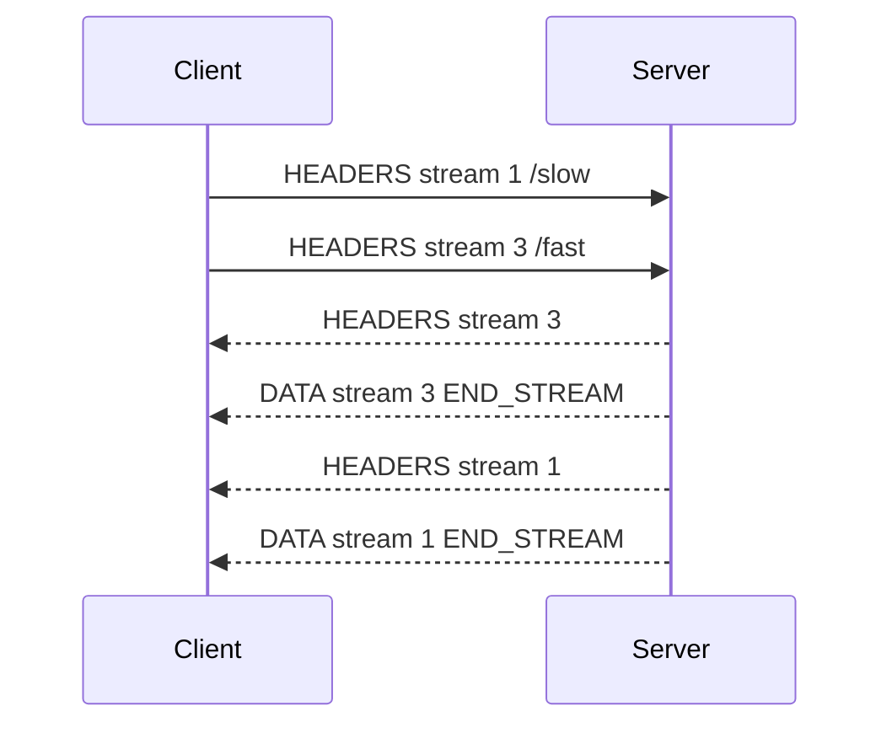

<TLDR>
  <TLDRCell label="what">
    HTTP/2 保留 HTTP 的方法、状态码和字段语义，但把消息拆成带流标识的二进制帧，让多个请求与响应共享一条连接。
  </TLDRCell>
  <TLDRCell label="trap">
    多路复用消除了 HTTP/1.1 的响应排队，却没有消除 TCP 丢包造成的连接级队头阻塞，也没有自动限制应用并发。
  </TLDRCell>
  <TLDRCell label="fix">
    复用长寿命会话，限制在途流数量，完整消费或取消响应，并把 `RST_STREAM`、`GOAWAY` 与重试策略一起设计。
  </TLDRCell>
</TLDR>

## 是什么，为什么存在

HTTP/2 是 HTTP 的一种二进制传输映射。它没有改变 `GET`、`POST`、状态码、缓存或认证等应用语义，而是改变这些消息在连接上的编码与交错方式。客户端、服务端、反向代理和负载均衡器之间都可能使用它。

HTTP/1.1 可以复用持久连接，但同一连接上的响应必须按请求顺序返回。流水线难以处理这种排队，因此客户端通常建立多条连接。连接数量增多会重复承担握手与拥塞控制成本，字段也会在每次请求中反复发送。

HTTP/2 把每次请求与响应放进一个<Term id="http2-stream">流（stream）</Term>，再把消息拆成<Term id="http2-frame">帧（frame）</Term>。不同流的帧可以在同一连接上交错，这种能力叫作<Term id="multiplexing">多路复用（multiplexing）</Term>。一个慢响应不必阻止另一个已经就绪的响应发送。

你会在浏览器到边缘节点、服务间 API、gRPC 传输和支持 HTTP/2 的命令行客户端中遇到它。应用往往不直接构造帧，但必须理解流的生命周期、连接共享和重试边界，否则协议库的默认行为仍可能被错误的并发或超时策略抵消。

HTTP/2 不是 HTTP/3 的旧称。HTTP/2 通常运行在一条 TCP 连接上，而 HTTP/3 使用 QUIC。两者都提供流，但丢包、迁移和握手行为不相同。

HTTP/2 本身也不等同于加密。规范定义了 TLS 与明文用法，但公开 Web 客户端通常只通过 TLS 使用它。认证、授权和内容机密性仍需由 TLS 与应用策略提供。

升级传输版本不会修复低效查询、过大的响应或缺失缓存。它改变消息在网络上的承载方式，不改变业务端点做了多少工作。容量规划仍要从端到端路径入手。

Cookie 与其他应用字段的含义同样保持不变。HPACK 可能减少重复编码，却不会让敏感字段适合记录或跨租户共享。数据分类规则不能因压缩而放宽。

因此，判断一个系统是否正确使用 HTTP/2，要观察协商结果、连接复用、流生命周期和故障处理。仅看到配置中出现 `h2`，还不足以证明请求路径具有这些性质。

## 工作原理

### 一条连接承载多条流

每条流都有一个 31 位标识。普通客户端发起的流使用递增的奇数标识，流 `0` 保留给整条连接的控制帧。标识不能复用，因此长寿命连接在关闭前会持续分配新标识。

请求通常从一个 `HEADERS` 帧开始，响应也从另一个 `HEADERS` 帧开始。消息体放在一个或多个 `DATA` 帧中。帧上的 `END_STREAM` 标志表示发送方不会再为该流发送数据；因此，请求体结束和响应体结束可以发生在不同时间。

下面的时序展示了两个请求如何共享连接。流 `3` 的响应先完成，并不需要等待流 `1` 的慢响应。



多路复用解除的是 HTTP/1.1 消息顺序造成的应用层<Term id="head-of-line-blocking">队头阻塞（head-of-line blocking）</Term>。所有帧仍通过同一条有序 TCP 字节流传输；一个丢失的 TCP 段会暂时阻挡其后的所有流。HTTP/2 因而减少了一类排队问题，但没有隔离传输层丢包。

### 帧只携带一种职责

每个帧以固定的 9 字节帧头开始，其中包含负载长度、类型、标志和流标识。`DATA` 与 `HEADERS` 携带消息，`SETTINGS` 协商连接参数，`WINDOW_UPDATE` 增加发送额度，`RST_STREAM` 终止单条流，`PING` 检查连接，`GOAWAY` 则开始关闭连接。

接收方必须按帧类型与当前流状态解释负载。未知类型通常可以忽略，以便协议扩展；违反已知帧的长度、流标识或状态约束则可能成为流错误或连接错误。应用代码应让成熟协议库完成这层校验。

一个 HTTP 消息可以跨多个帧，但字段块不能随意与其他帧交错。如果 `HEADERS` 没有结束字段块，后续 `CONTINUATION` 必须在同一流上连续出现，直到 `END_HEADERS`。这条规则让解码器能明确字段块边界。

### 伪字段映射 HTTP 消息

HTTP/2 不发送 `GET /orders HTTP/1.1` 这样的文本起始行。请求用 `:method`、`:scheme`、`:authority` 和 `:path` 等伪字段表达相同信息，响应用 `:status` 表达状态码。伪字段必须出现在普通字段之前，而且不能出现在尾字段中。

字段名称必须是小写。`Connection`、`Keep-Alive`、`Proxy-Connection`、`Transfer-Encoding` 和 `Upgrade` 等连接专用字段不能出现在 HTTP/2 消息中。`TE` 是一个受限例外，其值只能是 `trailers`。

协议库通常把伪字段映射回熟悉的请求与响应对象。中间件仍应按 HTTP 语义处理消息，不应把冒号开头的字段复制成应用元数据，也不应把 HTTP/1.1 的逐跳字段重新注入下游。

### HPACK 压缩字段

<Term id="hpack">HPACK</Term> 为字段名称和值提供静态表、动态表和可选的 Huffman 编码。双方在一条连接上分别维护编码与解码状态，重复字段可以引用表项，而不必每次发送完整文本。这个状态属于连接，不能跨不相关的连接共享。

压缩后的字节数不是安全边界。解码后的字段列表可能远大于某个字段块在网络上的大小，接收方仍需限制字段数量和解码后的总大小。密码、令牌等敏感值还应标记为永不索引，避免进入动态表。

HPACK 是有状态压缩，因此实现必须严格保持字段块顺序。无法解码一个字段块通常会破坏连接的压缩上下文，而不只是影响一条流。这也是不应手写生产级 HPACK 编解码器的原因。

### 两级流量控制

HTTP/2 对 `DATA` 帧执行<Term id="flow-control">流量控制（flow control）</Term>。发送方同时消耗单条流窗口和连接窗口；任一窗口没有额度时，该流的数据都必须等待。接收方处理数据后，可以用 `WINDOW_UPDATE` 增加相应窗口。

流量控制只约束正文数据，不约束 `HEADERS`、`PING` 或 `RST_STREAM` 等控制帧。它防止接收方被正文持续淹没，却不限制处理器数量、数据库查询或待发送响应占用的应用内存。服务仍需设置并发、队列和负载上限。

窗口更新表示接收方愿意接收更多字节，不代表业务已经成功处理这些字节。应用确认、事务提交和幂等语义都位于更高层，不能由 `WINDOW_UPDATE` 推断。

### 运行时背压

协议库把流量控制映射为运行时的可读流与可写流背压。以 Node 为例，`stream.write()` 返回 `false` 表示调用方应暂停写入并等待 `drain`，而不是继续把正文堆进用户态缓冲区。这个信号同时受到 HTTP/2 窗口、套接字和运行时水位线影响。

读取方也要持续消费、暂停或明确取消正文。只注册响应头回调却遗忘 `data`、`end` 和错误路径，会让协议库无法及时回收流。若应用需要把数据写入较慢的存储，应把可读流连接到能传播背压的管道。

会话和流的状态快照适合诊断，不适合作为忙等条件。窗口可能在读取后立即变化，轮询数值还会与库自己的调度竞争。正确做法是响应 `drain`、结束、重置和错误等生命周期事件。

背压也必须穿过业务边界。即使协议窗口正常工作，无界队列仍能在解析后积累对象。入口并发、正文解析、下游调用与响应写回需要一条连续的容量策略。

### 会话所有权

HTTP/2 会话属于连接到特定对端的一组安全与路由条件，而不是一个全局万能客户端。方案、权威、代理路径、TLS 身份和认证上下文会影响会话能否安全复用。库能够复用连接，不等于应用可以忽略这些边界。

调用方应区分「不再接收新流」和「立即销毁连接」。前者允许排空已经接受的流，后者会让所有活动流失败。进程关闭、证书轮换和部署摘流都需要明确选择这两个动作的顺序。

连接共享也会共享故障域。把互不信任或延迟特征差异很大的流放在同一会话上，意味着连接错误和 TCP 丢包会同时影响它们。是否拆分会话应由隔离需求与测量结果决定，而不是固定规则。

### 设置与协议协商

连接建立后，双方都发送 `SETTINGS`。参数包括初始流窗口、最大帧负载、字段列表大小和建议的最大并发流数。设置具有方向性：一端发送的值约束另一端如何向它发送数据。

公开 Web 流量通常在 TLS 握手中通过 ALPN 协商 `h2`。如果没有协商成功，端点可能继续使用 HTTP/1.1。明文 HTTP/2 通常称为 h2c，需要先验约定或明确的升级路径；每一层代理都必须支持这种模式。

客户端应检查实际协商结果，而不是因为 URL 使用 `https` 就断定连接是 HTTP/2。服务端也应记录协议版本、流重置和 `GOAWAY`，否则降级与中间代理行为很难从应用延迟中区分出来。

## 示例

### 读取帧头

第一个示例只构造帧头，不实现完整协议。它创建一个负载长度为 `5`、流标识为 `1` 且带 `END_STREAM` 的 `DATA` 帧头，然后按 RFC 9113 的字段布局读回这些值。

<Depth level="quick">

```javascript run title="frame_header.js"
const header = Buffer.alloc(9);

header.writeUIntBE(5, 0, 3);
header[3] = 0x0;
header[4] = 0x1;
header.writeUInt32BE(1, 5);

const frameTypes = new Map([[0x0, 'DATA']]);
const length = header.readUIntBE(0, 3);
const type = frameTypes.get(header[3]);
const endStream = (header[4] & 0x1) !== 0;
const streamId = header.readUInt32BE(5) & 0x7fffffff;

console.log(`length=${length}`);
console.log(`type=${type}`);
console.log(`endStream=${endStream}`);
console.log(`streamId=${streamId}`);
```

```text
length=5
type=DATA
endStream=true
streamId=1
```

</Depth>

长度占 24 位，因此代码用 `readUIntBE(0, 3)` 读取三个字节。流标识的最高位是保留位，解析时用 `0x7fffffff` 清除它。这里没有负载，也没有验证状态机，所以它是帧头布局实验，不是可以连接服务器的客户端。

生产代码还要处理分段输入、长度上限、未知类型和每种帧的专用约束。使用平台协议栈可以避免把这些解析细节变成应用攻击面。

### 观察真正的多路复用

第二个示例使用 Node 24 的 `node:http2` 创建本地 h2c 服务。客户端在同一个会话上同时打开 `/slow` 和 `/fast`，服务端有意延迟第一条流。

```javascript run title="multiplexed_session.js"
import { connect, createServer } from 'node:http2';

const server = createServer();
server.on('stream', (stream, headers) => {
  const path = headers[':path'];
  const delay = path === '/slow' ? 30 : 0;
  setTimeout(() => {
    stream.respond({ ':status': 200 });
    stream.end(path.slice(1));
  }, delay);
});

await new Promise((resolve) => server.listen(0, '127.0.0.1', resolve));
const { port } = server.address();
const session = connect(`http://127.0.0.1:${port}`);
const finished = [];

function fetch(path) {
  return new Promise((resolve, reject) => {
    const request = session.request({ ':path': path });
    let body = '';
    request.setEncoding('utf8');
    request.on('data', (chunk) => (body += chunk));
    request.on('end', () => {
      finished.push(path);
      resolve({ id: request.id, body });
    });
    request.on('error', reject);
    request.end();
  });
}

const [slow, fast] = await Promise.all([fetch('/slow'), fetch('/fast')]);
console.log(`stream ids: ${slow.id}, ${fast.id}`);
console.log(`finish order: ${finished.join(', ')}`);
console.log(`bodies: ${slow.body}, ${fast.body}`);
session.close();
await new Promise((resolve) => server.close(resolve));
```

```text
stream ids: 1, 3
finish order: /fast, /slow
bodies: slow, fast
```

两条请求获得同一客户端会话中的流 `1` 与流 `3`。`/fast` 的数据先准备好，因此它先结束；返回值数组仍按 `Promise.all()` 的输入顺序排列，所以最后一行是 `slow, fast`。这同时区分了线上的完成顺序与应用收集结果的顺序。

示例在回环地址上使用 h2c，只为避免证书干扰。部署到公开网络时，应使用 TLS、验证证书，并检查 ALPN 结果。不要把 `createServer()` 的明文配置直接暴露到不受信任的网络。

### 只取消一条流

第三个示例让客户端用 `NGHTTP2_CANCEL` 重置一条尚未响应的流，然后在同一会话上请求健康检查。服务端看到错误码 `8`，而会话仍然可用。

```javascript run title="cancel_one_stream.js"
import { connect, constants, createServer } from 'node:http2';

let resolveReset;
const resetSeen = new Promise((resolve) => (resolveReset = resolve));
const server = createServer();
server.on('stream', (stream, headers) => {
  if (headers[':path'] === '/cancel') {
    stream.on('close', () => resolveReset(stream.rstCode));
    return;
  }
  stream.respond({ ':status': 200 });
  stream.end('healthy');
});

await new Promise((resolve) => server.listen(0, '127.0.0.1', resolve));
const { port } = server.address();
const session = connect(`http://127.0.0.1:${port}`);

const cancelled = session.request({ ':path': '/cancel' });
cancelled.end();
await new Promise((resolve) => cancelled.once('ready', resolve));
cancelled.close(constants.NGHTTP2_CANCEL);
const resetCode = await resetSeen;

const health = session.request({ ':path': '/health' });
health.setEncoding('utf8');
let body = '';
health.on('data', (chunk) => (body += chunk));
health.end();
await new Promise((resolve, reject) => {
  health.on('end', resolve);
  health.on('error', reject);
});

console.log(`cancel code: ${resetCode}`);
console.log(`session destroyed: ${session.destroyed}`);
console.log(`health: ${body}`);
session.close();
await new Promise((resolve) => server.close(resolve));
```

```text
cancel code: 8
session destroyed: false
health: healthy
```

`NGHTTP2_CANCEL` 是对端放弃该流的协议错误码，不是 JavaScript 异常编号。`session.destroyed` 为 `false` 说明重置流没有销毁会话，随后的 `/health` 因此正常完成。

真实调用还要处理重置与正常响应竞态：响应可能在取消信号到达前已经完成。清理逻辑必须可重复执行，并且不能因为迟到的 `data` 或 `close` 事件再次结算同一请求。

## 陷阱

> [!PITFALL]
> 把「支持 HTTP/2」当成「请求必然走 HTTP/2」，会掩盖 TLS、ALPN 或代理配置造成的降级。

**修复方法：** 从客户端响应和服务端日志中记录实际协议。把 HTTP/1.1 回退纳入集成测试，并分别经过 CDN、负载均衡器和服务网格入口验证，因为任一跳都可能终止并重新建立连接。

> [!PITFALL]
> 为每个请求创建一个新会话，会丢掉多路复用与 HPACK 的连接级状态，还会增加套接字和握手压力。

**修复方法：** 按源站复用受控的长寿命会话，并设置空闲关闭、连接错误和进程退出处理。会话池要有上限；复用并不意味着永远只允许一条物理连接。

> [!PITFALL]
> 对输入集合直接使用无界 `Promise.all()`，可能在对端公布并发流上限之前就创建大量工作，也可能把瓶颈转移到数据库与内存。

**修复方法：** 用显式的并发器限制在途操作，并把上限与对端 `SETTINGS_MAX_CONCURRENT_STREAMS`、本地资源和下游容量共同校准。处理被拒绝的流时，只重试策略允许且正文可重放的请求。

> [!PITFALL]
> 不读取响应体，也不取消流，会让流、窗口额度和监听器比调用方存活更久。在流式响应上，这类泄漏尤其隐蔽。

**修复方法：** 成功路径完整消费正文；提前退出时显式取消对应流并移除监听器。为请求设置截止时间，同时测试超时发生在收到响应头之前和正文传输期间的两种路径。

> [!PITFALL]
> 把 HTTP/1.1 的 `Connection: keep-alive` 或 `Transfer-Encoding: chunked` 复制到 HTTP/2 请求，会产生格式错误的消息。

**修复方法：** 让协议库生成逐跳字段与消息边界。审查网关代码是否剥离连接专用字段，并确保普通字段为小写、伪字段位于最前面。

> [!PITFALL]
> 把服务器推送当成正确性要求，会在对端关闭推送、库不暴露推送 API 或中间层丢弃推送时失败。

**修复方法：** 让资源在普通请求路径上始终可获取。只有在已测量的特定客户端与链路上才考虑推送，并把 `SETTINGS_ENABLE_PUSH = 0` 与推送拒绝当作正常能力协商结果。

## AI 时代

**生成代码在这里常犯的错**

模型常把 HTTP/1.1 示例改个模块名就称为 HTTP/2，留下 `Connection`、`Upgrade` 或分块传输字段。它们也会为每个请求调用 `connect()`、用无界 `Promise.all()` 打开流、忽略响应体和取消路径，或生成依赖服务器推送的页面加载逻辑。处理 `GOAWAY` 时，生成代码还可能无条件重放带副作用的请求。

**让 AI 检查**

- 列出每个会话的创建、复用和关闭位置，并证明单次请求不会无意创建新连接。
- 逐个检查发出的字段，找出连接专用字段、错误的伪字段顺序和可能进入 HPACK 动态表的秘密值。
- 跟踪超时、`RST_STREAM`、`GOAWAY` 与会话错误，说明哪些请求可重试、正文是否可重放，以及谁负责清理监听器。

**审查清单**

- 用真实代理链验证协商出的协议、并发流上限、降级和关闭行为。
- 对慢正文、取消、半关闭流和连接中途收到 `GOAWAY` 编写测试。
- 同时限制流数量、解码后字段大小、正文大小和下游工作量。

**提示词词汇**

使用精确术语：`binary framing layer`（二进制分帧层）、`stream identifier`（流标识）、`multiplexing`（多路复用）、`pseudo-header field`（伪字段）、`HPACK dynamic table`（HPACK 动态表）、`flow-control window`（流量控制窗口）、`stream error`（流错误）、`connection error`（连接错误）、`GOAWAY last-stream-id`（`GOAWAY` 最后流标识）。要求模型给出流与连接两级的所有权和故障时间线，比「优化 HTTP/2」更容易暴露错误假设。

<Depth level="deep">

## 流状态与半关闭

流从 `idle` 开始，经过 `open`，还可能进入 `half-closed (local)` 或 `half-closed (remote)`，最后成为 `closed`。半关闭表示一端已经发送 `END_STREAM`，另一端仍可继续发送。例如，无正文的请求可以在请求 `HEADERS` 上结束本地方向，而服务端稍后继续返回响应正文。

状态决定哪些帧仍然合法。已经关闭的流不能继续接收普通 `DATA`，但迟到的控制信息有专门规则。协议库会维护状态机，应用需要维护的是更高层的所有权：谁等待结束、谁能取消，以及谁在异常时释放正文与监听器。

取消一条流通常发送带错误码的 `RST_STREAM`。它不会要求关闭同一连接上的其他流，因此适合表达单个请求的截止时间或调用方放弃。发送重置后，仍可能有已经在途的数据到达，实现需要在有限范围内处理这些数据。

## 流错误与连接错误

流错误只影响一条流，通常通过 `RST_STREAM` 报告。连接错误表示帧序列、压缩状态或其他共享不变量已经不可信，端点会发送 `GOAWAY` 并关闭连接。把两者混为一谈会把局部失败放大成所有并发请求的失败。

`GOAWAY` 携带最后流标识。接收方可以据此判断哪些更高编号的本端发起流未被对端处理，但这不等于所有请求都应自动重试。重试仍需考虑方法语义、幂等键、正文能否重新读取，以及链路中其他中间层是否已经产生副作用。

优雅关闭通常先阻止创建新流，再等待已接受的流完成。客户端收到 `GOAWAY` 后应把新请求导向另一个会话，并为旧会话设置有限的排空期限。无限等待会把优雅关闭变成资源泄漏。

## HPACK 的状态边界

编码器可以选择把字段加入动态表，解码器则按同一连接上的字段块顺序维护对应表项。连接中途丢失或乱序一段压缩上下文时，后续索引不再有稳定含义。因此，压缩错误通常属于连接级故障。

永不索引标记只约束 HPACK 表示方式，不会加密字段，也不会从日志中删除字段。认证信息仍需要 TLS、日志脱敏和访问控制。中间代理解码后重新编码消息时，也会建立自己的压缩上下文与索引决策。

限制必须针对解码后的字段列表，而不只是接收到的帧字节。攻击者可以利用高压缩率消耗内存或 CPU；数量、单字段大小、总大小和解码工作都需要边界。超限时应按协议终止流或连接，而不是继续把部分字段交给应用。

## 迁移边界

HTTP/2 与 HTTP/1.1 共享语义，所以路由和业务处理通常可以复用；消息分帧、逐跳字段和连接生命周期则不能照搬。反向代理会在两侧独立选择协议，同一个请求可能在客户端一侧使用 HTTP/2，在上游一侧使用 HTTP/1.1。

这种转换使端到端观察比检查单个进程更重要。至少记录每一跳的协议、源站连接复用、活动流数量、流重置原因、`GOAWAY` 和回退。延迟变化必须结合这些信号解释，不能只由 URL 或客户端配置推断协议效果。

迁移测试应覆盖大字段、慢请求体、慢响应体、取消和部署期间的连接排空。还要检查代理是否错误转发连接专用字段，以及请求正文在重试前是否仍可读取。这些边界比只测试一个快速 `GET` 更接近生产故障。

## 可观测性与验证

只记录请求总延迟不足以解释 HTTP/2。一次请求至少要能关联到会话、流标识、协商协议、响应头到达时间、正文结束方式和重置码。连接级事件还要记录远端设置、`GOAWAY` 最后流标识和关闭原因。

指标需要区分活动会话与活动流。会话数稳定并不代表容量正常，一条会话可能已经达到对端并发上限；流数很低也不代表连接健康，客户端可能在重连或回退到 HTTP/1.1。两类指标必须和错误码、队列长度一起观察。

抓包可以确认 ALPN、帧顺序和窗口更新，但 TLS 环境通常需要受控的密钥日志或端点级调试。不要为了方便抓包而在生产客户端关闭证书校验。优先使用协议库的诊断事件，并在隔离环境复现。

故障测试应一次只改变一个边界。可以让对端把并发流设置得很小、在正文中途重置流、发送 `GOAWAY`，或停止读取上传数据。随后断言未受影响的流仍能完成，而且所有 Promise、计时器和监听器都被释放。

负载测试需要保持请求集合、连接预热、TLS、代理路径和并发策略一致。否则，比较结果可能测到握手数量或测试客户端限制，而不是协议差异。没有这些控制变量时，不应给出 HTTP/2 一定更快或更慢的结论。

验证结束时检查资源而不只检查响应。进程的开放套接字、活动句柄、会话池大小和等待队列应回到预期范围。许多 HTTP/2 错误只在重复取消或滚动部署后表现为缓慢泄漏。

</Depth>

<Checkpoint id="foundations/http2" />

## 延伸阅读

- [RFC 9113：HTTP/2](https://www.rfc-editor.org/rfc/rfc9113.html)
- [RFC 7541：HPACK 字段压缩](https://www.rfc-editor.org/rfc/rfc7541.html)
- [Node.js v24 文档：HTTP/2](https://nodejs.org/docs/latest-v24.x/api/http2.html)
- [MDN：HTTP/1.x 连接管理](https://developer.mozilla.org/en-US/docs/Web/HTTP/Guides/Connection_management_in_HTTP_1.x)
