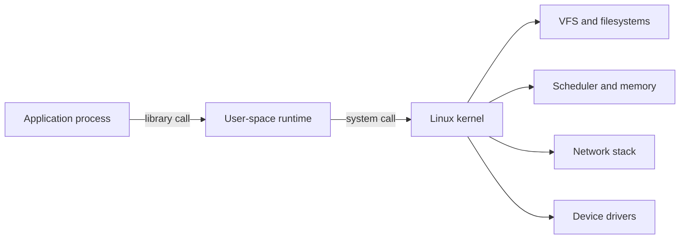

<TLDR>
  <TLDRCell label="what">
    The Linux kernel manages processes, memory, devices, and networking, and programs use those resources through system calls. A distribution supplies the user-space tools and services above the kernel.
  </TLDRCell>
  <TLDRCell label="when">
    You use this object model whenever you run a service, inspect permissions, interpret an exit status, find a resource leak, or review an operations script.
  </TLDRCell>
  <TLDRCell label="how">
    Establish the process identity and namespaces, then follow evidence through paths, permissions, file descriptors, signals, and logs. Keep a rollback path before changing the system.
  </TLDRCell>
</TLDR>

## What it is and why it exists

Strictly speaking, Linux is an operating-system kernel. It manages CPU time, virtual memory, storage devices, the network stack, and process isolation between hardware and user-space programs. Distributions such as Ubuntu, Debian, and Fedora combine the Linux kernel with a C library, shell, package manager, service manager, and default configuration to make an installable system.

Applications generally do not manipulate hardware directly. They request the kernel to open files, create processes, map memory, or establish network connections through <Term id="system-call">system calls</Term>. Shells, `systemctl`, `ps`, and container runtimes are user-space programs too; they organize these kernel interfaces into convenient commands and policies.

Linux gives resources a set of uniform interfaces. Regular files, directories, pipes, sockets, and many devices can be accessed through <Term id="file-descriptor">file descriptors</Term>, while running programs live in <Term id="process">processes</Term>. Uniform does not mean identical: directories require search permission, sockets carry protocol state, and the kernel generates the contents of `/proc` dynamically.

Developers meet these concepts in local terminals, continuous-integration jobs, containers, and production services. The transferable skill is not memorizing a long command list. It is knowing which kernel object a command observes, which identity it uses, and whether its result depends on the distribution, namespace, or permissions.

## How it works

### The kernel boundary and user space

The CPU runs ordinary applications in user mode and protected kernel code in kernel mode. When a program calls a C library function, some calls finish entirely in user space and some eventually enter a system call. A system call has a defined number, arguments, return value, and error convention. Applications normally use one through a runtime or standard library instead of writing an architecture-specific entry sequence.

A file read crosses several layers. The application supplies a path, the kernel resolves directory entries and checks credentials and permissions, a filesystem implementation locates data, and a device driver may interact with storage. Caches can keep some steps away from physical devices, so “the program called `read`” does not imply “the disk performed a read.”



The diagram shows responsibility boundaries, not a fixed pipeline followed by every call. A network send does not visit a filesystem, and a pure user-space string operation does not enter the kernel. During diagnosis, first locate the problem in application logic, the user-space runtime, or the kernel resource layer. That distinction prevents blind system tuning.

### Paths, mounts, and virtual filesystems

Linux arranges accessible filesystems into one directory tree rooted at `/`. A mount attaches another filesystem at a directory in that tree. Path resolution handles each component in turn and is affected by symbolic links, mount points, the current working directory, and the process root. An absolute path starts at the `/` visible to that process, which need not be the host's root directory.

`/etc` commonly holds host-level configuration, `/var` holds changing state, `/run` holds data for the current boot, and `/tmp` holds temporary files. `/proc` and `/sys` are primarily virtual views supplied by the kernel, not ordinary directories stored on disk. Exact layouts vary across distributions and containers, so a script should validate a target instead of assuming it exists by convention.

A path is not a file identity. Hard links let several directory entries refer to one inode; a symbolic link stores another path to resolve. After a process opens a file, it holds a file descriptor. If a directory entry is then deleted, the open object can continue to occupy space and remain readable and writable until its final reference closes.

### Identity and permissions

Every process has credentials including user IDs, group IDs, and supplementary groups. Traditional discretionary access control combines these credentials with a file's owner, group, and `rwx` mode bits. Access control lists, Linux capabilities, mandatory access-control modules, and read-only mounts can narrow or divide authority further.

On a directory, `r` means list names, `w` means add or remove directory entries, and `x` means search and traverse the directory. On a regular file, `x` means executable. Reading a file does not imply permission to delete it because deletion modifies the parent directory. Conversely, permission to remove a directory entry does not grant access to an already opened file's contents.

`root` is not a synonym for “bypass every security boundary.” Capability sets, user namespaces, SELinux or AppArmor, seccomp, and container configuration can all constrain UID 0. To diagnose an authorization failure, record the identity visible to the process, permissions on every directory component of the target path, and denial records from any additional security policy.

### Processes, threads, and lifecycle

A <Term id="process">process</Term> owns state such as a virtual address space, credentials, a file-descriptor table, and signal dispositions. Threads share most resources of their process but have their own scheduling state and stacks. A PID identifies an object inside one PID namespace; it is not a permanent identity across hosts or containers.

In the classic Unix model, a parent process creates a child and the child can execute a different program. After a program exits, the kernel retains a small termination record until its parent collects it through a wait operation. An exited child that has not been collected is a zombie. It no longer executes code, but a large zombie population shows that a parent has abandoned its lifecycle duty.

An exit status is a small result channel. In a shell, `0` conventionally means success and a nonzero value is a program-defined failure. When a signal terminates a program, shells often expose `128 + signal number`, but scripts should not interpret every nonzero value as the same fault. Callers need to preserve standard error, context, and the original status.

### File descriptors, redirection, and pipes

A file descriptor is a small integer local to a process. By convention, `0`, `1`, and `2` are standard input, standard output, and standard error, but a process can close or redirect them. Operations such as `open`, `pipe`, and `socket` create or obtain kernel objects and place descriptors in the process descriptor table.

The shell operators `>`, `2>`, `<`, and `|` configure descriptors before starting a target program. A pipe connects one process's output end to another process's input end. It carries a byte stream and preserves no business meaning such as “one write equals one line.” If a consumer exits early, a producer can also receive `SIGPIPE`, so pipeline status needs an intentional policy.

Descriptors consume per-process and system resources. Leaked files, pipes, and sockets eventually cause `EMFILE` or `ENFILE`, although the root cause usually occurred on an earlier error path. Reliable code gives one clear owner responsibility for closing each resource and covers success, exception, cancellation, and timeout paths.

### Signals and service shutdown

A <Term id="signal">signal</Term> is a kernel mechanism for notifying a process or thread about an asynchronous event. Most signals have a default action and can instead be ignored or caught by a handler. `SIGKILL` and `SIGSTOP` cannot be caught or ignored. Ordinary signals are not reliably queued once per arrival, so they are unsuitable for carrying business-message counts.

`SIGTERM` means “please terminate” and gives a program a chance to stop accepting work, perform bounded cleanup, and exit. `SIGKILL` terminates the target immediately; the program cannot flush user-space buffers, release leases, or finish a transaction. A service manager commonly sends a catchable stop signal first, waits for a bounded grace period, and keeps forced termination as a fallback.

Signal-handling code has restrictions too. The low-level handler can safely call only a small set of functions, and higher-level runtimes often turn a signal into a flag or event for the main loop to handle. When reviewing a service, verify who receives the signal, whether child processes receive a forwarded signal, and whether shutdown has an overall time budget.

### Observation interfaces and evidence

Linux observation interfaces are spread across commands, virtual filesystems, and logs. `ps` primarily produces process snapshots, `/proc` exposes per-process and some system state, `journalctl` or distribution logs record events, and `strace` observes the boundary between a process and system calls. They answer different questions. A single snapshot cannot replace a time series, and a missing log entry does not prove that an event never occurred.

Define the symptom before choosing an interface. High CPU utilization needs separation into user computation, kernel work, waiting, and quota throttling. Memory pressure needs separation into anonymous memory, page cache, reclaimable objects, and cgroup limits. “The machine is slow” has no object, time range, or baseline and gives almost no direction for a safe change.

Common objects and initial evidence include:

| Object | Inspect first | What it does not prove |
|---|---|---|
| Process | PID, parent PID, state, start time, credentials | PID existence does not prove service health |
| File | mount, inode, link count, mode, ACL | Equal paths do not prove equal underlying objects |
| Descriptor | type, target, owner, open count | A removed directory entry does not prove released data |
| CPU | run queue, per-process and per-cgroup use | High load average does not prove continuously saturated CPU |
| Memory | working set, reclaim, swapping, OOM events | Low `free` does not prove exhausted memory |
| Network | addresses, routes, listeners, connection state | A listener does not prove successful request handling |

Observation can itself fail or perturb timing. Frequent detailed sampling consumes CPU and I/O, attaching a tracer can require more authority, and a short-lived process can disappear between two queries. Record the command, time, namespace, and error status so another person can reproduce the same viewpoint.

### Resource pressure and queues

Resource problems usually appear as waiting, not merely as “a high percentage.” Runnable threads queue when they outnumber available CPU, writes slow when dirty-page writeback cannot keep up, and a sender blocks or gets a temporary-unavailable result when socket buffers fill. Look for queues, wait time, and throttling events, then trace them back to the workload creating pressure.

CPU utilization must be interpreted against the task. Continuous computation can be a healthy batch job, while low CPU can mean a process is waiting on a lock, disk, or network. Narrow the scope by process, thread, and cgroup before profiling or tracing the code path. Do not change a scheduler or kernel parameter merely because load increased.

Linux uses memory that applications do not currently need as page cache and can reclaim it under pressure. The “free” field is therefore not the only capacity signal. Combine available memory, swapping, reclaim pressure, process working sets, and OOM events to distinguish healthy caching from sustained growth or a hard limit.

For storage diagnosis, first map devices, filesystems, and mount points correctly. Capacity blocks, inodes, I/O latency, and throughput are different constraints. Removing a large file cannot cure inode exhaustion, and adding capacity cannot repair a high-latency device. Run filesystem repair or block-device writes only after confirming the target and backup and entering the required offline or maintenance state.

Network faults also need layered diagnosis. Addresses and routes choose a destination, firewalls and policy decide what is allowed, transport state describes connection progress, and application logs explain protocol handling. A successful `ping` does not prove that a TCP port, TLS handshake, or application request works. A failed `curl` does not automatically make DNS the cause.

### Clocks and timeouts

Linux exposes distinct time sources such as wall time and a monotonic clock. Wall time can jump when synchronization or an operator corrects it and is appropriate for recording a timestamp. A monotonic clock does not move backward when the system date changes and is appropriate for durations and deadlines. Timeout code that mixes the two can fire early or late after a clock adjustment.

A timeout should also cover the complete operation instead of granting a fresh budget to every retry. Resolution, connection, handshake, sending, receiving, and backoff all spend the caller's total time. Recording the remaining budget and the phase that expired is more useful than returning one generic `timeout`.

Log timestamps need an explicit time zone and understood clock source. Before comparing events across hosts, confirm time synchronization and allow for collection and transport delays. Systems that require strict event ordering also need request IDs, monotonic sequences, or causal information; sorting formatted wall-clock strings alone is insufficient.

## Examples

All four examples operate only on temporary resources or the current process. They connect permission bits, `/proc`, pipeline status, and catchable signals without requiring administrator privileges.

### Create a least-privilege file

`umask` removes permissions from a creation request. The example first creates a file readable and writable only by its owner, then explicitly adds owner execute and group read permissions.

<Depth level="quick">

```bash title="permissions.sh"
#!/usr/bin/env bash
set -euo pipefail

sandbox=$(mktemp -d)
trap 'rm -rf "$sandbox"' EXIT

umask 077
printf 'token\n' > "$sandbox/token"
stat -c 'created=%A mode=%a' "$sandbox/token"

chmod u+x,g+r "$sandbox/token"
stat -c 'changed=%A mode=%a' "$sandbox/token"
```

```text
created=-rw------- mode=600
changed=-rwxr----- mode=740
```

</Depth>

`umask 077` masks all group and other permissions. The later symbolic mode changes only named bits and is easier to review than an unexplained `chmod 777`. A real token file normally needs no execute bit; this example adds one only to make the mode transition visible.

### Observe the current process through `/proc`

`/proc/<pid>/status` exposes readable process metadata, while `/proc/<pid>/fd` shows the process's descriptors. The example opens descriptor `3`, reads its content, and verifies that its link disappears after closing it.

```bash title="process_view.sh"
#!/usr/bin/env bash
set -euo pipefail

exec 3<<<"ready"
process_name=$(awk '/^Name:/ {print $2}' "/proc/$$/status")
thread_count=$(awk '/^Threads:/ {print $2}' "/proc/$$/status")

printf 'name=%s\n' "$process_name"
printf 'threads_at_least_one=%d\n' "$((thread_count >= 1))"
if test -L "/proc/$$/fd/3"; then fd3_before=open; else fd3_before=closed; fi
printf 'fd3_before=%s\n' "$fd3_before"
read -r message <&3
printf 'read=%s\n' "$message"
exec 3<&-
if test -L "/proc/$$/fd/3"; then fd3_after=open; else fd3_after=closed; fi
printf 'fd3_after=%s\n' "$fd3_after"
```

```text
name=bash
threads_at_least_one=1
fd3_before=open
read=ready
fd3_after=closed
```

The number `3` has meaning only in this Bash process's descriptor table. Descriptor `3` in another process can refer to a completely different object. `/proc` is useful for diagnosis, but reading another process is also subject to permissions, mount options, and PID namespaces.

### Preserve a pipeline failure status

By default, a shell uses the final command's status as a pipeline's status. With `pipefail`, a failure in any stage is retained when no later stage has a later failure.

```bash title="pipeline_status.sh"
#!/usr/bin/env bash
set -uo pipefail

records=$'ok:42\nwarning:7'

if printf '%s\n' "$records" | grep -q '^warning:'; then
    printf 'warning_match=yes\n'
fi

if printf '%s\n' "$records" | grep -q '^error:'; then
    missing_status=0
else
    missing_status=$?
fi

printf 'error_match_status=%d\n' "$missing_status"
```

```text
warning_match=yes
error_match_status=1
```

`grep` uses status `1` to mean “no match,” which is not a broken program. The script interprets that status in an `if` condition instead of asking `set -e` to treat every nonzero status as exceptional. Stable automation distinguishes an expected branch from a real error according to each command's contract.

### Perform bounded cleanup on `SIGTERM`

This parent script waits for a worker to report readiness and then sends `SIGTERM`. The worker catches it, records cleanup, and exits with status `0`; the parent collects that result with `wait`.

```bash title="graceful_stop.sh"
#!/usr/bin/env bash
set -euo pipefail

sandbox=$(mktemp -d)
trap 'rm -rf "$sandbox"' EXIT

bash -c '
  trap "printf \"cleanup\\n\"; exit 0" TERM
  printf "ready\\n"
  while :; do sleep 1; done
' > "$sandbox/worker.log" &
worker_pid=$!

until grep -q '^ready$' "$sandbox/worker.log"; do sleep 0.01; done
kill -TERM "$worker_pid"
wait "$worker_pid"
cat "$sandbox/worker.log"
printf 'wait_status=0\n'
```

```text
ready
cleanup
wait_status=0
```

A real service also needs an upper bound on its grace period because cleanup can hang. A stop controller should record the signal it sent and the final exit status, then apply an explicit escalation policy after a timeout. The disappearance of a process alone does not prove an application commit completed or an external lease was released.

## Pitfalls

> [!PITFALL]
> Recursively running `chmod 777` after an authorization error expands write, read, and execute permissions across files and directories. It can let an untrusted user replace content that a privileged process will later consume.

**Fix:** Derive <Term id="least-privilege">least privilege</Term> from the operations the process actually needs, set file and directory modes separately, and preserve the ownership model. Use `namei -l`, `stat`, `id`, and security-policy logs to find the exact failed check before changing the smallest possible target.

> [!PITFALL]
> Generated cleanup scripts often pass an empty variable, unquoted path, or broad glob to `rm`, `find -delete`, or `chown -R`. One bad expansion can cross the intended directory boundary.

**Fix:** Before any destructive operation, resolve the target to an absolute path and reject empty values, `/`, and paths outside an allowed root. Print or enumerate exact targets with a read-only operation first, back up recoverable data, and use `--` to end option parsing.

> [!PITFALL]
> Hard-coding Ubuntu package names, `systemd` unit names, log paths, and network-interface names as universal Linux facts fails on other distributions, containers, and minimal images.

**Fix:** State a support matrix and validate the environment at entry: read `/etc/os-release`, check that commands exist, and query the active service manager and real interfaces. If only one image is supported, pin its digest and encode the assumptions in tests instead of claiming the script “works on Linux.”

> [!PITFALL]
> Parsing `ls`, interactive `top`, or localized error text as machine input breaks on spaces, newlines, locale changes, and output-version changes.

**Fix:** Choose stable scripting interfaces such as `find -print0` with NUL-delimited reads, explicit `ps -o` fields, or a tool's JSON output. Set `LC_ALL` and requested fields explicitly, then test the parser with names containing newlines, leading hyphens, and non-ASCII characters.

> [!PITFALL]
> Treating `kill -9` as a normal stop command skips the process's signal handlers and user-space cleanup. Forced termination also hides why the service could not stop on time.

**Fix:** Send the service's documented catchable signal first, stop admitting new work, and impose a bounded grace period. Escalate to `SIGKILL` only after timeout while preserving thread stacks, logs, queue depth, or other evidence that explains where shutdown stalled.

<Depth level="deep">

## The shared state behind an open file

A process descriptor table maps integers to kernel open file descriptions. An open file description holds the current offset and file status flags and refers to the underlying object. A descriptor returned by `dup` shares the same open file description as the original, so reading through one advances the offset observed through the other.

A child generally inherits descriptors when a parent creates it. Descriptors without close-on-exec can remain open after that child executes a new program. This behavior enables shell redirection, but it also leaks resources. An inherited pipe writer can prevent a reader from ever seeing EOF, and an inherited listening socket can keep an old port occupied.

Removing a regular file's directory entry only decreases its link count. Data is not released while an open file description still refers to its inode. A log can therefore disappear from the directory and continue growing, making the directory total from `du` smaller than the filesystem usage shown by `df`.

When diagnosing that difference, first verify that both observations cover the same mount, then inspect process descriptors for deleted targets. The repair is to make the owning process reopen or close the file, not to truncate `/proc/<pid>/fd/<n>` without understanding ownership. A rotation program and service need an agreed reopen signal or another safe handoff mechanism.

## Authorization layers beyond `rwx`

A process has real, effective, and saved user and group IDs, and access checks generally use its effective credentials.
An executable with a set-user-ID bit can change effective identity during execution, so its input boundary needs review as privileged code.

An ACL can grant permissions to additional users or groups, with a mask limiting the effective bits of some entries.
The nine mode bits from `ls -l` can therefore omit relevant ACL state; inspect a complete view such as `getfacl` during an authorization anomaly.

Linux capabilities divide traditional superuser authority into separate powers, such as binding a low port or changing file ownership.
A process's permitted, effective, inheritable, bounding, and ambient sets work together to determine which capabilities are usable.

Mandatory access control from SELinux or AppArmor applies policy after traditional permissions allow an operation.
Making a mode more permissive does not repair a policy denial and instead expands discretionary access that may already be correct.

Mount options, `no_new_privs`, and seccomp can further restrict execution, privilege gain, and system calls.
These controls come from different layers, so interpret errors and audit records alongside the process's namespaces and container configuration.

Start diagnosis from the exact operation: record effective identity, check each path component, then inspect ACLs, capabilities, mounts, and mandatory policy.
After locating the rejecting layer, change its narrowest rule and retry as the service identity. Success as root does not prove that production received the right authority.

## Process reaping and PID 1

A parent must wait for exited children to release their retained termination records. If the parent exits first, orphaned children are reassigned to a child reaper. PID 1 normally takes that role on a host, while a PID namespace can designate a subreaper. A container entrypoint that only launches the main program, without forwarding signals or reaping children, causes delayed shutdown and zombie accumulation.

PID reuse creates a race in “look up a PID, then kill it later”: the original can exit and another process can receive the same number. Mature interfaces can use stable references such as pidfds to reduce this race. A script should at least narrow the delay between observation and action and also validate start time, parentage, or service-manager identity.

Process existence alone is not service health. A process can be deadlocked, not yet listening, missing a dependency, or unable to handle requests. A health model distinguishes liveness, readiness, and business correctness and gives the check itself a timeout and resource limit.

## Boot and service ownership

After firmware, a bootloader, and the kernel complete their stages, the kernel starts the first user-space process. Modern general-purpose distributions commonly use `systemd` as PID 1, but Linux does not require every system to make that choice. Container images and embedded systems can use a smaller init or run an application directly.

A service manager does more than “start at boot.” It defines process identity, environment, working directory, resource limits, dependencies, restart policy, stop protocol, and log connections. Starting a second copy manually outside the manager creates conflicts around PID files, ports, credentials, and shutdown ownership.

A dependency declaration does not prove business readiness. A configured network interface does not make DNS or a remote dependency available, and a started unit may not have finished migrations or begun accepting requests. Services should handle temporary dependency failure within a bound and expose their real state through an explicit readiness check.

Automatic restart needs a failure budget. An unbounded restart loop amplifies logs, CPU use, dependency traffic, and alert noise and can overwrite evidence from the original fault. A supervisor should retain final status, limit attempt rate, and distinguish a permanent configuration error from a transient failure.

A service upgrade needs an explicit handoff among the old process, new process, and listening resources. A simple stop-then-start creates an unavailable interval. Parallel startup requires coordination through port sharing, proxy switching, socket activation, or another mechanism. The service protocol and state ownership determine the strategy; one universal restart command cannot.

## Namespaces and cgroups

Linux containers normally share the host kernel. Namespaces change the PIDs, mounts, network devices, hostnames, IPC objects, and user mappings visible to a process. Cgroups organize processes and account for or limit CPU, memory, I/O, and process counts. They address visibility and resource governance; neither turns application code into trusted code.

PID 1 inside a container has special lifecycle duties, `/` comes from that container's mount namespace, and UID 0 may map to an unprivileged host ID through a user namespace. When reading command output from a container, ask “which namespace supplied this view?” before comparing it with host data.

Resource limits change how ordinary failures appear. Reaching a memory-cgroup limit can invoke OOM handling scoped to that cgroup, a PID limit can make process or thread creation fail, and a CPU quota causes throttling rather than continuous full-core use. Diagnosis needs application metrics, cgroup configuration, and kernel events together. Free host capacity does not rule out a resource limit.

## An evidence chain for safe changes

System administration starts with read-only observation. Record the current identity, namespaces, kernel and distribution versions, exact target state, and the source of every command input. For a remote host, also confirm host identity and the change window so that a correct command does not run against the wrong target.

A change should be atomic, idempotent, and reversible where practical. A configuration update can write a new file in the same directory, validate its syntax and permissions, and then replace the old file atomically. Keep a known-good version before reloading a service. A multi-step operation that cannot be atomic must record intermediate state and define which failed steps are safe to retry.

Verification is more than “the command returned 0.” Confirm that the kernel or service accepted the new state, expected behavior works through the real path, error budgets did not regress, and the state survives restart when required. An audit record should identify the actor, target, time, reason, and verification result without copying secrets.

</Depth>

<Checkpoint id="foundations/linux" />

## Further reading

- [Linux kernel documentation: user-space API](https://docs.kernel.org/userspace-api/index.html)
- [Linux kernel documentation: the `/proc` filesystem](https://docs.kernel.org/filesystems/proc.html)
- [Linux man-pages: path resolution](https://man7.org/linux/man-pages/man7/path_resolution.7.html)
- [Linux man-pages: process credentials](https://man7.org/linux/man-pages/man7/credentials.7.html)
- [Linux man-pages: signal overview](https://man7.org/linux/man-pages/man7/signal.7.html)
