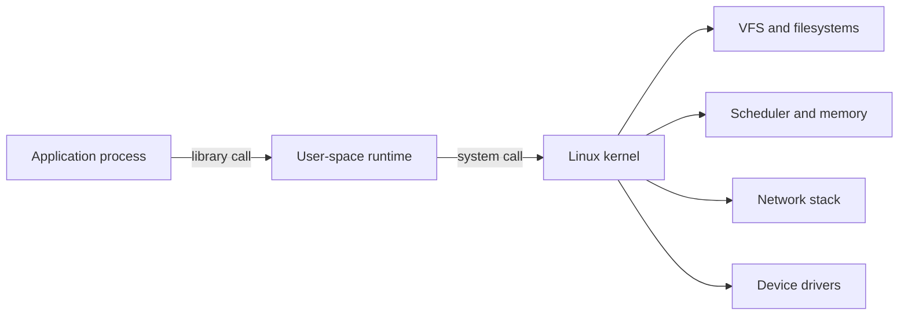

<TLDR>
  <TLDRCell label="what">
    Linux 内核管理进程、内存、设备和网络，程序通过系统调用使用这些资源；发行版则在内核之上提供用户空间工具和服务。
  </TLDRCell>
  <TLDRCell label="when">
    当你运行服务、检查权限、分析退出状态、定位资源泄漏或审查运维脚本时，都在使用 Linux 的这套对象模型。
  </TLDRCell>
  <TLDRCell label="how">
    先确认进程身份和命名空间，再沿路径、权限、文件描述符、信号与日志逐层取证；修改系统前保留回滚路径。
  </TLDRCell>
</TLDR>

## 是什么，为什么存在

Linux 严格来说是操作系统内核。它在硬件与用户空间程序之间管理 CPU 时间、虚拟内存、存储设备、网络协议栈和进程隔离。Ubuntu、Debian、Fedora 等发行版把 Linux 内核与 C 库、Shell、包管理器、服务管理器和默认配置组合成可安装的系统。

应用通常不会直接操纵硬件。它通过<Term id="system-call">系统调用（system call）</Term>请求内核打开文件、创建进程、映射内存或建立网络连接。Shell、`systemctl`、`ps` 和容器运行时也是用户空间程序，只是它们把这些内核接口组织成了便于操作的命令和策略。

Linux 提供统一的资源接口。普通文件、目录、管道、套接字和许多设备都能通过<Term id="file-descriptor">文件描述符（file descriptor）</Term>访问；运行中的程序则由<Term id="process">进程（process）</Term>承载。统一并不等于完全相同，例如目录需要搜索权限，套接字有协议状态，`/proc` 中的内容由内核动态生成。

开发者在本机终端、持续集成任务、容器和生产服务中都会遇到这些概念。真正可迁移的能力不是背诵一长串命令，而是知道每条命令观察了哪个内核对象、用了哪个身份，以及结果是否受发行版、命名空间或权限影响。

## 工作原理

### 内核边界与用户空间

CPU 在用户态运行普通应用，在内核态执行受保护的内核代码。程序调用 C 库函数时，有些调用完全在用户空间完成，有些最终进入系统调用。系统调用有明确的编号、参数、返回值和错误约定；应用通常通过运行时或标准库使用它们，而不是手写体系结构相关的入口。

一次文件读取会跨越几层。应用传入路径，内核解析目录项并检查凭据与权限，文件系统实现定位数据，设备驱动再与存储交互。缓存可能让某些步骤不触碰物理设备，所以“调用了 `read`”不能直接推出“发生了磁盘读取”。



这张图表达的是责任边界，不是每次调用都经过的固定流水线。一个网络发送不会访问文件系统，一个纯用户空间字符串操作也不会进入内核。排错时先确定问题位于应用逻辑、用户空间运行时还是内核资源层，能避免盲目调整系统参数。

### 路径、挂载与虚拟文件系统

Linux 把可访问的文件系统组织成一棵从 `/` 开始的目录树。挂载会把另一个文件系统接到树中的某个目录；路径解析逐段处理名称，并会受到符号链接、挂载点、当前工作目录和进程根目录的影响。绝对路径从进程看到的 `/` 开始，不一定是宿主机的根目录。

`/etc` 通常保存主机级配置，`/var` 保存会变化的状态，`/run` 保存本次启动的运行时数据，`/tmp` 用于临时文件。`/proc` 与 `/sys` 主要是内核提供的虚拟视图，不是磁盘上的普通目录。具体布局受发行版和容器环境影响，因此脚本应验证目标路径，而不是仅凭习惯假定它存在。

路径本身不是文件身份。硬链接让多个目录项引用同一个 inode；符号链接保存另一条待解析的路径。进程打开文件后持有的是文件描述符，即使某个目录项随后被删除，已打开的对象也可能继续占用空间并保持可读写，直到最后一个引用关闭。

### 身份与权限

每个进程都有用户 ID、组 ID 和补充组等凭据。传统自主访问控制会结合这些凭据、文件所有者、所属组和 `rwx` 模式位判断访问。访问控制列表、Linux capabilities、强制访问控制模块和只读挂载等机制还能进一步收紧或细分权限。

目录上的 `r` 表示列出名称，`w` 表示增删目录项，`x` 表示搜索并穿过该目录。文件上的 `x` 才表示可执行。能读取文件并不意味着能删除它，因为删除操作修改的是父目录；反过来，能删除目录项也不代表能读取已打开文件的内容。

`root` 也不是“跳过所有安全边界”的同义词。能力集、用户命名空间、SELinux 或 AppArmor、seccomp 和容器配置都可能限制 UID 0。排查权限问题时，需要同时记录进程看到的身份、目标路径每一级目录的权限，以及额外安全策略的拒绝记录。

### 进程、线程与生命周期

<Term id="process">进程</Term>拥有虚拟地址空间、凭据、文件描述符表和信号处理设置等状态。线程共享所属进程的大部分资源，但各自有调度状态和栈。PID 是某个 PID 命名空间中的标识，不是跨主机或跨容器永久唯一的身份。

在经典 Unix 模型中，父进程创建子进程，子进程再执行另一个程序。程序退出后，内核保留少量终止信息，直到父进程调用等待接口收集它；未被收集的已退出子进程称为僵尸进程。僵尸不再执行代码，但大量僵尸说明父进程没有正确承担生命周期责任。

退出状态只是一小段结果信息。Shell 中 `0` 通常表示成功，非零值表示程序定义的失败；被信号终止时，Shell 常把状态表示为 `128 + 信号编号`，但脚本不应把每个非零值都解释成同一种故障。调用方需要保留标准错误、上下文和原始状态。

### 文件描述符、重定向与管道

文件描述符是进程内的小整数。按照惯例，`0`、`1`、`2` 分别是标准输入、标准输出和标准错误，但进程可以关闭或重定向它们。`open`、`pipe`、`socket` 等操作会创建或取得内核对象，再把一个描述符放入进程的描述符表。

Shell 的 `>`、`2>`、`<` 和 `|` 在启动目标程序前配置描述符。管道连接前一个进程的输出端与后一个进程的输入端，它传递的是字节流，不保留“每次写入一行”的业务含义。消费者提前退出时，生产者还可能收到 `SIGPIPE`，所以流水线状态必须按预期策略处理。

描述符会消耗进程与系统资源。泄漏的文件、管道和套接字最终会触发 `EMFILE` 或 `ENFILE`，但根因通常发生在更早的错误路径。可靠代码让一个明确的所有者负责关闭资源，并覆盖成功、异常、取消与超时路径。

### 信号与服务停止

<Term id="signal">信号（signal）</Term>是内核向进程或线程通知异步事件的机制。大多数信号可以采用默认动作、被忽略或由处理器捕获；`SIGKILL` 和 `SIGSTOP` 不能被捕获或忽略。普通信号不会为每次到达都可靠排队，因此不适合承载业务消息计数。

`SIGTERM` 表达“请终止”，让程序有机会停止接收工作、完成有限清理并退出。`SIGKILL` 立即终止目标，程序无法刷新用户空间缓冲区、释放租约或写完事务。服务管理器通常先发送可处理的停止信号，等待一个有界宽限期，再把强制终止作为兜底。

信号处理代码也受限制。低层处理器可安全调用的函数集合很小，高层运行时往往把信号转换成标志或事件，再由主循环完成清理。审查服务时应确认由谁接收信号、子进程是否转发得到信号，以及关闭是否有总时间预算。

### 观察接口与证据

Linux 的观察接口分布在命令、虚拟文件系统和日志中。`ps` 主要生成进程快照，`/proc` 暴露每个进程与部分系统状态，`journalctl` 或发行版日志记录事件，`strace` 则观察进程与系统调用边界。它们回答的问题不同，不能用单次快照代替时间序列，也不能用日志缺失证明事件没有发生。

先定义症状，再选接口。CPU 利用率高需要区分用户态计算、内核工作、等待与受配额节流；内存紧张需要区分匿名内存、页缓存、可回收对象和 cgroup 上限。一个“机器很慢”的描述没有对象、时间范围或基线，几乎不能指导安全修改。

常见观察对象与证据如下：

| 对象 | 先查什么 | 不能直接推出什么 |
|---|---|---|
| 进程 | PID、父 PID、状态、启动时间、凭据 | PID 存在不等于服务健康 |
| 文件 | 挂载点、inode、链接数、模式、ACL | 路径相同不等于底层对象相同 |
| 描述符 | 类型、目标、所有者、打开数量 | 已关闭目录项不等于数据已释放 |
| CPU | 运行队列、每进程与每 cgroup 用量 | 高负载均值不等于 CPU 一直满载 |
| 内存 | 工作集、回收、交换、OOM 事件 | `free` 较小不等于内存已经耗尽 |
| 网络 | 地址、路由、监听端点、连接状态 | 端口监听不等于请求能成功处理 |

观察命令本身也可能失败或改变时序。读取高频率的详细状态会消耗 CPU 与 I/O，附加跟踪器可能需要额外权限，并且短命进程会在两次查询之间消失。记录命令、时间、命名空间和错误状态，才能让另一个人复现同一视角。

### 资源压力与排队

资源问题通常表现为等待，而不仅是“某个百分比很高”。可运行线程多于可用 CPU 时会排队，脏页写回跟不上产生速度时写入会变慢，套接字缓冲区填满后发送方会阻塞或收到暂时不可写。排错要寻找队列、等待时间和限流事件，再回到造成压力的工作量。

CPU 使用率必须和任务目标一起解释。持续计算可能是正常批处理，低 CPU 也可能意味着进程在锁、磁盘或网络上等待。先按进程、线程和 cgroup 缩小范围，再使用剖析或跟踪定位代码路径；不要看到负载升高就先改调度器或内核参数。

Linux 会把未被应用占用的内存用于页缓存，并在需要时回收。因此，`free` 输出中的“空闲”不是唯一容量指标。需要结合可用内存、交换活动、回收压力、进程工作集和 OOM 事件，判断是正常缓存、持续增长，还是明确的上限命中。

存储排错先确认设备、文件系统和挂载点的对应关系。容量块、inode、I/O 延迟与吞吐是不同限制；删除大文件不能解决 inode 耗尽，增加容量也不能修复高延迟设备。任何文件系统修复或块设备写入都应在确认目标和备份后，于适当的离线或维护条件下执行。

网络问题也要按层定位。地址与路由决定数据包去向，防火墙和策略决定是否允许，传输状态反映连接进展，应用日志解释协议处理。`ping` 成功不保证 TCP 端口、TLS 或应用请求成功，`curl` 失败也不能自动归因于 DNS。

### 时钟与超时

Linux 向程序提供墙上时间与单调时钟等不同时间来源。墙上时间会因同步或人工调整而跳变，适合记录时间点；单调时钟不会随系统日期校正倒退，适合计算持续时间和截止时间。超时实现若混用两者，时钟调整后可能提前或延后触发。

超时还需要覆盖完整操作，而不是给每次重试一个全新的预算。解析、连接、握手、发送、接收与退避都消耗调用方的总时间。记录剩余预算和超时发生的阶段，比只返回一个笼统的 `timeout` 更有诊断价值。

日志时间戳需要同时说明时区与时钟来源。跨主机比较事件时，应先确认时间同步，并允许采集与传输延迟。事件顺序要求很高的系统还需要请求 ID、单调序列或因果信息，不能只按格式化后的墙上时间排序。

## 示例

下面四个示例都只在临时资源或当前进程上操作。它们展示权限位、`/proc`、流水线状态与可处理信号之间的联系，不需要管理员权限。

### 创建最小权限文件

`umask` 会从创建请求中移除权限。示例先创建一个仅所有者可读写的文件，再明确增加所有者执行权限和组读取权限。

<Depth level="quick">

```bash title="permissions.sh"
#!/usr/bin/env bash
set -euo pipefail

sandbox=$(mktemp -d)
trap 'rm -rf "$sandbox"' EXIT

umask 077
printf 'token\n' > "$sandbox/token"
stat -c 'created=%A mode=%a' "$sandbox/token"

chmod u+x,g+r "$sandbox/token"
stat -c 'changed=%A mode=%a' "$sandbox/token"
```

```text
created=-rw------- mode=600
changed=-rwxr----- mode=740
```

</Depth>

`umask 077` 让组和其他用户的权限都被屏蔽。之后的符号模式只改变指定的位，比不加解释地写 `chmod 777` 更容易审查。真实密钥文件通常也不需要执行位；这里增加它只是为了让模式变化可见。

### 从 `/proc` 观察当前进程

`/proc/<pid>/status` 暴露进程的可读元数据，`/proc/<pid>/fd` 则显示该进程的描述符。示例打开描述符 `3`，读取内容，再验证关闭后对应链接消失。

```bash title="process_view.sh"
#!/usr/bin/env bash
set -euo pipefail

exec 3<<<"ready"
process_name=$(awk '/^Name:/ {print $2}' "/proc/$$/status")
thread_count=$(awk '/^Threads:/ {print $2}' "/proc/$$/status")

printf 'name=%s\n' "$process_name"
printf 'threads_at_least_one=%d\n' "$((thread_count >= 1))"
if test -L "/proc/$$/fd/3"; then fd3_before=open; else fd3_before=closed; fi
printf 'fd3_before=%s\n' "$fd3_before"
read -r message <&3
printf 'read=%s\n' "$message"
exec 3<&-
if test -L "/proc/$$/fd/3"; then fd3_after=open; else fd3_after=closed; fi
printf 'fd3_after=%s\n' "$fd3_after"
```

```text
name=bash
threads_at_least_one=1
fd3_before=open
read=ready
fd3_after=closed
```

这里的 `3` 只在该 Bash 进程的描述符表中有意义。另一个进程的描述符 `3` 可以引用完全不同的对象。`/proc` 输出适合诊断，但读取其他进程时还会受到权限、挂载选项和 PID 命名空间限制。

### 保留流水线失败状态

默认情况下，Shell 以流水线最后一条命令的状态作为整条流水线的状态。启用 `pipefail` 后，只要其中一环失败且后续没有更晚的失败，流水线就保留该非零状态。

```bash title="pipeline_status.sh"
#!/usr/bin/env bash
set -uo pipefail

records=$'ok:42\nwarning:7'

if printf '%s\n' "$records" | grep -q '^warning:'; then
    printf 'warning_match=yes\n'
fi

if printf '%s\n' "$records" | grep -q '^error:'; then
    missing_status=0
else
    missing_status=$?
fi

printf 'error_match_status=%d\n' "$missing_status"
```

```text
warning_match=yes
error_match_status=1
```

`grep` 用状态 `1` 表示“没有匹配”，这不等于程序损坏。脚本在 `if` 条件中解释这个状态，而不是让 `set -e` 把所有非零状态一概当成异常。稳定的自动化会按命令契约区分预期分支与真正错误。

### 用 `SIGTERM` 完成有界清理

这个父脚本等待工作进程报告就绪后发送 `SIGTERM`。工作进程捕获信号、记录清理动作并以状态 `0` 退出，父进程再通过 `wait` 收集结果。

```bash title="graceful_stop.sh"
#!/usr/bin/env bash
set -euo pipefail

sandbox=$(mktemp -d)
trap 'rm -rf "$sandbox"' EXIT

bash -c '
  trap "printf \"cleanup\\n\"; exit 0" TERM
  printf "ready\\n"
  while :; do sleep 1; done
' > "$sandbox/worker.log" &
worker_pid=$!

until grep -q '^ready$' "$sandbox/worker.log"; do sleep 0.01; done
kill -TERM "$worker_pid"
wait "$worker_pid"
cat "$sandbox/worker.log"
printf 'wait_status=0\n'
```

```text
ready
cleanup
wait_status=0
```

真实服务还需要宽限期上限，因为清理逻辑可能卡住。停止控制器应记录发送的信号与最终退出状态，并在超时后明确升级策略。仅看到进程消失，不能证明它完成了应用级提交或释放了外部租约。

## 陷阱

> [!PITFALL]
> 遇到权限错误就递归执行 `chmod 777`，会同时扩大文件与目录的写入、读取和执行权限，还可能让不可信用户替换将被高权限进程使用的内容。

**修复方法：** 从进程实际需要的操作反推最小权限（least privilege），分别设置文件与目录模式，并保留所有者和组的设计。先用 `namei -l`、`stat`、`id` 和安全策略日志定位是哪一级检查失败，再改变最小范围的目标。

> [!PITFALL]
> 生成的清理脚本经常把空变量、未加引号的路径或宽泛通配符交给 `rm`、`find -delete` 和 `chown -R`。一次错误展开就可能越过预期目录。

**修复方法：** 在任何破坏性操作前把目标解析成绝对路径，拒绝空值、`/` 和不在允许根目录下的路径。先打印或以只读方式枚举精确目标，给可恢复的数据建立备份，并使用 `--` 终止选项解析。

> [!PITFALL]
> 把 Ubuntu 上的包名、`systemd` 单元名、日志路径和网卡名硬编码成所有 Linux 系统的事实，会在其他发行版、容器或精简镜像中失败。

**修复方法：** 明确支持矩阵并在入口验证环境，例如读取 `/etc/os-release`、检查命令是否存在、查询服务管理器与实际网络接口。若只支持一种镜像，就锁定镜像摘要并把假设写进测试，而不是声称脚本“适用于 Linux”。

> [!PITFALL]
> 用 `ls`、交互式 `top` 或本地化错误文本作为机器输入，很容易被空格、换行、区域设置和输出版本变化破坏。

**修复方法：** 选择为脚本设计的稳定接口，例如 `find -print0` 配合 NUL 分隔读取、显式的 `ps -o` 字段或工具的 JSON 输出。把 `LC_ALL` 和所需字段写清楚，并用包含换行、前导连字符和非 ASCII 字符的名称测试解析器。

> [!PITFALL]
> 把 `kill -9` 当作正常停止命令，会跳过进程的信号处理器和用户空间清理。强制终止还会掩盖服务为何不能按时退出。

**修复方法：** 先发送服务约定的可处理信号，停止新工作并设置有界宽限期。超时后再升级到 `SIGKILL`，同时保存线程栈、日志、队列深度或其他能解释卡住位置的证据。

<Depth level="deep">

## 打开文件的真正共享状态

进程的描述符表把整数映射到内核中的打开文件描述（open file description）。后者保存当前偏移和文件状态标志，并引用具体对象。调用 `dup` 得到的新描述符与原描述符共享同一个打开文件描述，所以从一个描述符读取会推进另一个描述符看到的偏移。

父进程创建子进程时，子进程通常继承描述符；执行新程序后，未设置 close-on-exec 的描述符还能继续存在。这对 Shell 重定向很有用，却也会造成泄漏：意外继承的管道写端可能让读取方永远看不到 EOF，继承的监听套接字可能让旧端口持续占用。

删除普通文件的目录项只会减少链接计数。只要仍有打开文件描述引用 inode，数据就不会立刻释放。日志文件即使已从目录中消失，也可能继续增长并占用磁盘；`du` 从目录树累计的结果因此可能小于 `df` 看到的文件系统使用量。

诊断这类差异时，先确认是否真是同一挂载点，再检查进程的打开描述符与已删除目标。修复动作是让正确的进程重新打开或关闭文件，而不是在不了解所有权时截断 `/proc/<pid>/fd/<n>`。轮转程序与服务需要约定重开信号或采用能安全交接文件的机制。

## `rwx` 之外的授权层

进程同时具有真实、有效和保存的用户与组 ID，访问检查通常关注有效凭据。
设置用户 ID 的可执行文件可能在执行时改变有效身份，因此其输入边界需要按高权限程序审查。

ACL 可以为额外用户或组设置权限，并由 mask 限制某些条目的有效位。
只看 `ls -l` 的九个模式位可能漏掉 ACL，应在异常授权中检查 `getfacl` 等完整视图。

Linux capabilities 把传统超级用户权限拆成不同能力，例如绑定低端口或改变文件所有者。
进程的 permitted、effective、inheritable、bounding 与 ambient 集合会共同影响能力是否可用。

SELinux 与 AppArmor 等强制访问控制会在传统权限允许后继续应用策略。
把模式改得更宽不会修复策略拒绝，反而会额外扩大原本正确的自主访问权限。

挂载选项、`no_new_privs` 和 seccomp 还能限制执行、提权与系统调用。
这些控制来自不同层，错误信息和审计日志应与进程实际所在的命名空间及容器配置一起解释。

排查顺序应从精确操作开始：记录有效身份，逐级检查路径，再查看 ACL、capability、挂载与强制策略。
找到拒绝层后修改最窄规则，并以原服务身份重试；以 root 成功执行并不能证明生产身份获得了正确授权。

## 进程回收与 PID 1

父进程必须等待已退出的子进程，才能释放内核保留的终止记录。父进程先退出时，孤儿子进程会被重新指定给子回收者；在普通主机上通常由 PID 1 承担，在 PID 命名空间中也可以有专门的 subreaper。只负责启动主程序、却不转发信号也不回收子进程的容器入口，会造成停止延迟和僵尸累积。

PID 复用意味着“先查 PID，稍后再杀”存在竞态：原进程可能已经退出，而同一数字已经属于另一个进程。成熟接口可使用 pidfd 等稳定引用降低这类竞态；脚本至少要缩短检查与操作之间的窗口，并同时验证进程的启动时间、父子关系或服务管理器身份。

服务是否健康也不能只看 PID 存在。进程可能卡死、尚未监听、依赖未就绪，或已经失去处理请求的能力。健康模型应区分存活、就绪和业务正确性，并给检查本身设置超时与资源上限。

## 启动与服务所有权

固件、引导加载程序和内核完成各自阶段后，内核启动第一个用户空间进程。现代通用发行版常使用 `systemd` 作为 PID 1，但 Linux 并不要求所有系统都这样选择。容器镜像和嵌入式系统可能使用更小的 init，甚至直接运行应用进程。

服务管理器的价值不只是“开机启动”。它定义进程身份、环境、工作目录、资源限制、依赖、重启策略、停止协议与日志连接。绕过服务管理器手工启动第二份进程，会让 PID 文件、端口、凭据和关闭所有权出现冲突。

依赖声明也不等于业务就绪。网络接口已经配置，不代表 DNS 或远端依赖可用；另一个单元已经启动，也不代表它完成迁移并能接受请求。服务应对暂时依赖失败进行有界处理，并通过明确的就绪检查暴露真实状态。

自动重启需要失败预算。没有上限和退避的重启循环会放大日志、CPU、依赖流量与告警噪声，还可能覆盖最初故障的证据。监督器应保留最终状态，限制尝试速率，并把永久配置错误与暂时故障分开处理。

升级服务时要明确旧进程、新进程和监听资源的交接方式。简单停止再启动会产生不可用窗口，并行启动则需要端口共享、代理切换或套接字激活等协调机制。选择哪种策略取决于服务协议和状态所有权，不能由一条通用重启命令决定。

## 命名空间与 cgroup

Linux 容器通常仍与宿主机共享同一个内核。命名空间改变进程能看到的 PID、挂载点、网络设备、主机名、IPC 对象和用户映射；cgroup 则组织进程，并对 CPU、内存、I/O 与进程数量实施记账和限制。两者解决的是可见性与资源治理问题，不会自动把应用变成可信代码。

容器中的 PID 1 有特殊生命周期责任，容器内的 `/` 来自它的挂载命名空间，UID 0 也可能通过用户命名空间映射成宿主机上的非特权 ID。看到容器内的命令输出时，应先问“这是哪个命名空间中的视图”，再与宿主机数据比较。

资源上限会改变普通错误的表现。内存 cgroup 达到上限可能触发该 cgroup 范围内的 OOM 处理，PID 上限会让进程或线程创建失败，CPU 配额会造成节流而不是持续满核。诊断需要同时查看应用指标、cgroup 配置与内核事件，不能仅凭宿主机仍有空闲资源就排除资源限制。

## 安全变更的证据链

系统管理操作应从只读观察开始。记录当前身份、命名空间、内核与发行版版本、目标对象的精确状态，以及待执行命令的输入来源。对远程主机操作时，还要确认主机身份与变更窗口，避免在正确命令上选错目标。

变更应尽量原子、幂等并可回滚。配置文件可先在同目录写入新文件、校验语法和权限，再原子替换；服务重载前应保留已知可用版本。无法原子完成的多步操作要记录中间状态，明确哪一步失败后可以安全重试。

验证不能只是“命令返回了 0”。还要检查内核或服务实际接受了新状态、预期行为经过真实路径成立、错误预算没有恶化，并且重启后仍能保持。审计记录应包含变更者、目标、时间、理由和验证结果，但不能复制密钥等敏感内容。

</Depth>

<Checkpoint id="foundations/linux" />

## 延伸阅读

- [Linux 内核文档：用户空间 API](https://docs.kernel.org/userspace-api/index.html)
- [Linux 内核文档：`/proc` 文件系统](https://docs.kernel.org/filesystems/proc.html)
- [Linux man-pages：路径解析](https://man7.org/linux/man-pages/man7/path_resolution.7.html)
- [Linux man-pages：进程凭据](https://man7.org/linux/man-pages/man7/credentials.7.html)
- [Linux man-pages：信号概述](https://man7.org/linux/man-pages/man7/signal.7.html)
