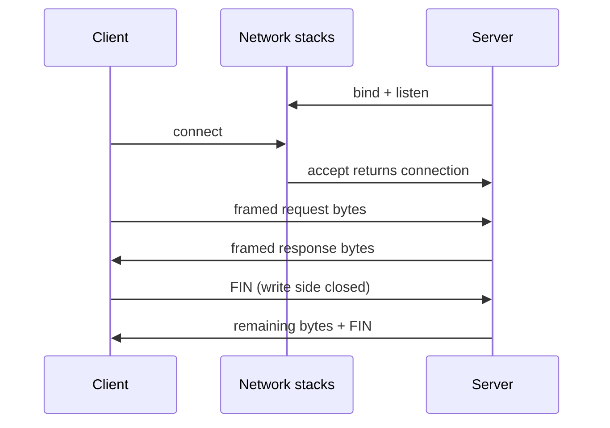

<TLDR>
  <TLDRCell label="what">
    Network programming lets processes exchange bytes through sockets. TCP provides a reliable, ordered byte stream; UDP provides boundary-preserving datagrams without a delivery guarantee.
  </TLDRCell>
  <TLDRCell label="trap">
    One `send()` does not correspond to one peer `recv()`; TCP has no application message boundaries. A happy path without size limits, timeouts, or backpressure fails against slow or hostile peers.
  </TLDRCell>
  <TLDRCell label="fix">
    Define framing, loop around partial I/O, and bound connections, message sizes, waits, and queues. Treat EOF, timeout, and protocol errors as different outcomes.
  </TLDRCell>
</TLDR>

## What it is and why it exists

Network programming is the work of designing programs in which two or more processes exchange data over network protocols. Applications do not usually manipulate Ethernet frames or TCP segments directly. They call the operating system's network stack through a <Term id="socket">socket</Term>, which associates a read/write interface with an address family, transport protocol, local address, and peer address.

You meet it in HTTP services, database clients, message brokers, game sessions, device telemetry, and service-to-service RPC. Higher-level libraries hide many system calls, but they do not remove transport constraints. When a request is occasionally truncated, shutdown hangs, or memory keeps growing under load, those constraints often explain why.

A network program chooses communication semantics before it chooses an API. TCP and UDP both use ports to direct arriving data to a process, but they give applications different contracts. Code that confuses them may pass small loopback tests and then fail under packet loss, congestion, or long-lived connections.

### TCP is a byte stream

TCP provides a reliable, ordered, bidirectional byte stream between two endpoints. "Reliable" means the protocol detects loss, retransmits, and delivers bytes to the receiving application in order. It does not mean a connection cannot fail or that a write necessarily arrives in full. Timeouts, resets, host restarts, and network partitions still leave applications with uncertain outcomes.

A byte stream has no message boundaries. If a sender writes `b"red"` and then `b"blue"`, the receiver may read `b"redblue"`, or it may get more fragments. The application protocol must define where each message ends.

### UDP is datagrams

UDP sends <Term id="datagram">datagrams</Term>. One successful send creates one datagram, and the receive API preserves that boundary. If the receive buffer is too small, excess content is truncated rather than saved for the next read.

UDP does not promise delivery, ordering, or duplicate suppression. An application that needs those properties must implement them at the application layer or choose a protocol that already does. Because UDP has no connection handshake, calling `connect()` on a UDP socket normally records a default peer and filters received sources; it does not establish a TCP-style connection.

### A socket is a resource with a lifetime

A server's listening socket queues connection requests. `accept()` returns a new connected socket for one client, while the listening socket remains available for other connections. A client normally resolves a host name and then calls `connect()` for one candidate address.

Sockets consume kernel resources and may retain ports, buffers, and protocol state. Ownership should be as explicit as it is for a file: who creates and closes the socket, who can cancel a blocking operation, and whether process shutdown stops new work before interrupting established connections. A context manager closes a descriptor, but a complete service still needs a shutdown order.

## How it works

### Name resolution produces candidate endpoints

An application often starts with a host and service name such as `api.example` and `443`. The resolver turns them into one or more candidate socket addresses. Results may contain both IPv6 and IPv4 and may change across locations and time. Address, port, address family, and transport protocol together determine how a socket is created and connected.

Do not treat DNS as a dictionary that returns one permanent IP address. `getaddrinfo()` returns candidates, which a client tries sequentially or with bounded connection concurrency. Taking only the first result, forcing `AF_INET`, or caching the answer forever discards usable fallback paths.

### A TCP connection pairs two one-way streams

A server calls `socket()`, `bind()`, `listen()`, and `accept()` in that order. A client creates a socket and calls `connect()`. After connection establishment, each endpoint can send and receive. Either direction may finish first, so "connection closed" is not always an instantaneous two-sided event.



`send()` copies as many bytes as it can into the local sending path and may return less than the input length. `recv(n)` returns up to `n` bytes currently available, not "whatever the peer sent last time." In blocking mode, either call may wait. In nonblocking mode, a call reports that it should be retried later when it cannot make progress.

A TCP acknowledgment says that the peer's protocol stack received the relevant bytes. It does not say that the peer committed a business transaction. If a client loses the connection before the response arrives, TCP state alone cannot tell whether the server finished the operation. Retrying a write requires application-level idempotency semantics or an idempotency key.

### Framing recovers application messages

<Term id="message-framing">Message framing</Term> defines how complete messages are recognized in a byte stream. Common schemes use a fixed length, a delimiter, a length prefix, or a frame format defined by a higher-level protocol. The choice depends on whether payloads can contain a delimiter, whether a maximum size is known, and whether data can be parsed incrementally.

A length-prefixed protocol normally sends a fixed-width integer followed by that many payload bytes. A multi-byte integer needs an agreed byte order. Network protocols commonly use <Term id="network-byte-order">network byte order</Term>, which is big-endian. The `!` prefix in a Python `struct` format selects network byte order explicitly.

A parser must not allocate an arbitrary buffer as soon as it sees a length. It validates the limit first and then waits for the complete frame. Its buffer may hold half a header, one complete frame plus part of the next, or several frames at once. All are normal input shapes.

### Blocking, timeouts, and readiness

Blocking socket code is easy to follow, but every wait needs a way to end. A connection timeout, a per-read timeout, and a deadline for the whole operation are different. A peer can send a few bytes often enough to refresh individual read timeouts without ever finishing a message. External operations normally need a monotonic deadline spanning the whole operation.

Nonblocking I/O turns "cannot continue now" into normal control flow. `selectors`, `poll`, `epoll`, or an event loop may report that a socket is probably readable or writable, but readiness is not a completion promise. A handler still reads or writes until it cannot make more progress and retains the unfinished state.

Threads, async tasks, and event loops are waiting strategies. They do not supply framing, size limits, or cancellation propagation automatically. The number of connections a concurrency model can support also cannot be inferred from its API name; it must be measured with the intended workload.

## Examples

### A local TCP round trip

The first example binds an ephemeral port on the loopback address. The server handles one newline-terminated request and returns its uppercase form. `makefile()` wraps the socket in a buffered stream, and the newline is this tiny protocol's message boundary.

<Depth level="quick">

```python run title="tcp_round_trip.py"
from socket import AF_INET, SOCK_STREAM, create_connection, socket
from threading import Thread


def serve_once(listener):
    connection, _ = listener.accept()
    with connection, connection.makefile("rwb") as stream:
        request = stream.readline()
        stream.write(request.upper())
        stream.flush()


with socket(AF_INET, SOCK_STREAM) as listener:
    listener.bind(("127.0.0.1", 0))
    listener.listen()
    host, port = listener.getsockname()

    server = Thread(target=serve_once, args=(listener,))
    server.start()

    with create_connection((host, port), timeout=1.0) as client:
        with client.makefile("rwb") as stream:
            stream.write(b"ping\n")
            stream.flush()
            reply = stream.readline()

    server.join()

print(f"reply={reply.decode().strip()}")
```

```text
reply=PING
```

</Depth>

Port `0` lets the operating system choose an unused port, so the example does not depend on a fixed one. It prints only the protocol result, not the port that changes on every run. The thread finishes before the listening socket closes, and the two `with` blocks make resource ownership visible.

Here, `readline()` waits for a newline, EOF, or an error. If the peer never sends a newline and keeps the connection open, the server waits forever; a production protocol also needs a message limit and a deadline. A simple delimiter does not remove the need for resource bounds.

### Observe UDP datagram boundaries

The second example sends two datagrams to one loopback endpoint and receives them separately. The two output lines record this real run, but they do not prove that public-network UDP always arrives in sending order.

```python run title="udp_datagrams.py"
from socket import AF_INET, SOCK_DGRAM, socket


with socket(AF_INET, SOCK_DGRAM) as receiver:
    receiver.bind(("127.0.0.1", 0))
    receiver.settimeout(1.0)
    destination = receiver.getsockname()

    with socket(AF_INET, SOCK_DGRAM) as sender:
        sender.sendto(b"alpha", destination)
        sender.sendto(b"beta", destination)

    first, _ = receiver.recvfrom(1024)
    second, _ = receiver.recvfrom(1024)

print(f"datagram 1={first.decode()}")
print(f"datagram 2={second.decode()}")
```

```text
datagram 1=alpha
datagram 2=beta
```

Each `recvfrom()` returns one datagram and its source address. The receive buffer is `1024` bytes, so a real protocol must guarantee that datagrams fit or use an API that reports truncation. A large datagram cannot be recovered with two calls to `recvfrom()`.

### Parse a length prefix incrementally

This parser uses a four-byte unsigned length prefix. It deliberately joins two messages and cuts the bytes at awkward positions to simulate possible TCP reads. The parser emits a message only when both its header and payload are complete.

```python run title="length_framing.py"
from struct import Struct


HEADER = Struct("!I")
MAX_MESSAGE = 1024


def encode(message):
    return HEADER.pack(len(message)) + message


def extract_messages(buffer):
    messages = []
    while len(buffer) >= HEADER.size:
        (size,) = HEADER.unpack_from(buffer)
        if size > MAX_MESSAGE:
            raise ValueError("message too large")
        frame_size = HEADER.size + size
        if len(buffer) < frame_size:
            break
        messages.append(bytes(buffer[HEADER.size:frame_size]))
        del buffer[:frame_size]
    return messages


wire = encode(b"alpha") + encode(b"beta")
chunks = [wire[:3], wire[3:8], wire[8:]]
buffer = bytearray()

for chunk in chunks:
    buffer.extend(chunk)
    for message in extract_messages(buffer):
        print(f"message={message.decode()}")

print(f"remaining={len(buffer)}")
```

```text
message=alpha
message=beta
remaining=0
```

The first chunk is not even a complete four-byte header, so the parser retains it. Later chunks complete the first frame and carry the second one, which means one pass may emit multiple messages. `MAX_MESSAGE` rejects an unreasonable length before reading its payload and prevents allocation based on an untrusted field.

This example copies messages and deletes bytes from the front of a `bytearray`. That is fine for explaining the protocol, not a claim about a high-throughput implementation. A production parser can use a read offset or ring buffer to reduce copying, but only after measurements show parsing cost matters.

### Distinguish timeout, data, and EOF

The last example uses `socketpair()` to isolate state transitions without an external network. The first read times out because no data is available. After the sender writes and shuts down its write side, the receiver gets the data and then observes orderly EOF as an empty byte string.

```python run title="timeout_and_eof.py"
from socket import SHUT_WR, socketpair


writer, reader = socketpair()
with writer, reader:
    reader.settimeout(0.02)
    try:
        reader.recv(4)
    except TimeoutError:
        print("read timed out")

    writer.sendall(b"done")
    writer.shutdown(SHUT_WR)

    print(f"data={reader.recv(4)!r}")
    print(f"eof={reader.recv(4)!r}")
```

```text
read timed out
data=b'done'
eof=b''
```

A timeout says no data arrived before the deadline; it does not prove that the connection is dead. `b''` denotes an orderly close of the peer's sending direction and appears after previously buffered bytes are consumed. A reset normally raises an exception and must not be collapsed into either result as an empty response.

## Pitfalls

> [!PITFALL]
> Treating one `recv()` as one complete message. Short loopback messages often arrive in one read, hiding half a header, half a payload, or multiple coalesced frames.
>
> **Fix:** parse incrementally according to the protocol. Tests should split every header and payload boundary deliberately and feed several frames in one chunk.

> [!PITFALL]
> Ignoring partial writes or blindly replaying a business operation after connection failure. `send()` may accept only part of its input; even a successful `sendall()` says only that the local call completed, not that the business transaction committed.
>
> **Fix:** use `sendall()` for a complete buffer in blocking Python code. Nonblocking code retains the unwritten slice and waits for writability again. Retry only when application semantics allow it, with idempotency protection for operations that may have side effects.

> [!PITFALL]
> Trusting a peer's declared length or setting only a per-read timeout. An attacker can announce a huge frame or drip bytes slowly enough that the connection never reaches a complete message.
>
> **Fix:** validate the frame limit before allocation, and bound the accumulated buffer, idle time, and total operation time. Oversize, timeout, and malformed-input paths need observable and testable shutdown behavior.

> [!PITFALL]
> Binding to `0.0.0.0` or `::` for convenient testing without authentication or encryption. TCP reliability and UDP checksums neither authenticate the peer nor keep application data confidential.
>
> **Fix:** bind local tools to loopback by default. When a service must be exposed, define the network boundary and use a maintained TLS or application-protocol implementation. Do not invent a cryptographic handshake.

> [!PITFALL]
> Trying only the first IPv4 address returned by DNS or caching a host's resolution forever. The first candidate path may be unreachable, and service addresses can change while a process runs.
>
> **Fix:** preserve the address-family information from `getaddrinfo()`, use the library's multi-address connection policy, and set one overall connection deadline. Caches must honor the resolver and deployment environment's update policy.

> [!PITFALL]
> Closing sockets without defined ownership. One task can close a descriptor still used by another and cause intermittent faults; stopping a read loop without releasing the socket eventually exhausts process resources.
>
> **Fix:** make one component responsible for close and cancellation, while other components signal it to stop. Test orderly EOF, reset, timeout, cancellation, and process shutdown, and confirm that every path releases listening and connected sockets.

<Depth level="deep">

## TCP shutdown is directional

TCP's two sending directions can finish independently. Calling `shutdown(SHUT_WR)` tells the local protocol stack that no new bytes will be sent. The peer observes EOF after reading queued data, while the local endpoint can continue receiving. This <Term id="half-close">half-close</Term> works for simple protocols in which EOF terminates a request body and a response follows.

`shutdown()` does not release the descriptor or replace `close()`. It changes the protocol state of one connection direction; the socket must still be closed eventually. Conversely, directly closing a socket with unsent data, shared references, or an error state may produce a different peer outcome from an orderly FIN.

Orderly EOF, reset, and timeout provide different evidence. EOF says that the peer's sending direction closed, a reset says the connection ended abnormally, and a timeout says only that the waiting budget expired. None proves on its own whether an application operation committed, so the protocol needs a response, transaction identifier, or query interface to resolve business uncertainty.

Long-lived connection shutdown must account for active work. A server commonly stops accepting new connections or requests, gives existing work a bounded drain period, then cancels what remains and closes descriptors. If several tasks read or write one socket, one named owner must coordinate shutdown.

`SO_REUSEADDR` solves specific address-reuse cases, not a universal "port already in use" problem. Its exact semantics vary by platform, so it cannot replace orderly process shutdown or a clear binding policy. When generated code adds the option unconditionally, ask which state and target platform it is meant to handle.

## Backpressure must cross every layer

Writing to a socket usually hands data to a local kernel buffer. When the peer slows down, that buffer fills; a blocking write waits, while a nonblocking write completes partially or reports that it would block. This is where <Term id="backpressure">backpressure</Term> starts moving toward the producer, and it is not an error.

If an application keeps appending responses to an unbounded user-space queue while the socket is not writable, that queue bypasses kernel backpressure. A sound design pauses upstream reading or computation and sets queue high-water marks per connection and per process. Whether overload rejects new work, drops permissible data, or disconnects a slow peer depends on protocol semantics.

<Term id="flow-control">Flow control</Term> and congestion control are also different. Flow control protects a receiver from a sender; congestion control protects the network path. Application backpressure must also cover parsed objects, database work, and task queues. TCP flow control does not make those bounds optional.

The receive direction needs bounds too. Even when each frame is small, accumulating an unlimited number of complete frames exhausts memory. A read loop feeds a capacity-limited consumer. When that consumer falls behind, it pauses reading so pressure reaches the socket instead of creating more tasks.

Do not claim that "async" is faster without evidence. Costs for threads, event loops, and asynchronous I/O depend on connection count, computation per connection, message size, and runtime. Measure queue time, buffered bytes, active connections, and tail latency before changing the concurrency model or its watermarks.

## Multi-address connection is a policy

A host name may resolve to several IPv6 and IPv4 addresses. Sequential attempts can stall on the first broken path, while connecting to every address at once creates unnecessary traffic and server work. Algorithms in the Happy Eyeballs family stagger candidate attempts to trade a little extra work for a faster successful connection.

Mature client libraries usually understand platform resolvers, address ordering, and cancellation details better than a hand-written loop. An application still supplies an overall deadline and records the selected address family plus candidate failures. Otherwise, "connection timeout" merges DNS, routing, firewall, and TLS failures into one result that cannot be diagnosed.

Successful resolution does not imply a successful connection, and a TCP connection does not imply that the application protocol is usable. Diagnostics should distinguish resolution, transport connection, security handshake, and application handshake. Each layer needs its own error context while still respecting one total time budget for the caller.

Server binding also has address-family policy. Binding only `127.0.0.1` does not accept IPv6 loopback connections. Whether a socket bound to `::` accepts IPv4-mapped addresses depends on platform settings. Deployment configuration should choose listening addresses explicitly and be tested on the target operating system rather than inferred from a development machine.

## Diagnose failures by phase

"Network error" is too broad to guide a fix. A request passes through name resolution, transport connection, security handshake, application handshake, message exchange, and shutdown, each with different errors and timeouts. Record the failed phase so an operator knows whether to inspect DNS, routing, certificates, protocol parsing, or business processing.

| Observation | What it establishes | What it does not establish |
| --- | --- | --- |
| Resolution failure | No usable address was produced | Whether the server process is healthy |
| Connect timeout | No transport connection completed by the deadline | Whether another candidate received a request |
| Connection reset | The peer or a middlebox aborted the connection | Which endpoint's business code failed first |
| Orderly EOF | The peer closed its sending direction | Whether a business operation committed |
| Protocol error | Received bytes violated the application protocol | Whether TCP ever experienced packet loss |
| Operation timeout | The total time budget expired | Whether the connection will recover later |

Logs should capture the phase, remote address family, candidate index, bytes sent and received, framing state, and shutdown reason. Connections and requests need separate identifiers so one operation remains traceable when connections are reused or multiplexed. Error aggregation retains every candidate failure instead of exposing only the last exception.

Observability has a security boundary too. Frame length and message type are often enough to diagnose framing, without logging an authentication token or complete payload. Remote addresses and error text may also be sensitive and should follow the system's retention policy.

Metrics should correspond to capacity decisions. Active connections, queue length, buffered bytes per connection, timeout phase, and reset rate explain broken backpressure better than one generic request-failure counter. Thresholds still come from measured traffic, not numbers copied from an example.

### Inject failures before production

A normal loopback round trip misses the hardest network paths. Test fixtures should delay reads, split writes, send early EOF and oversized frames, trigger resets, and make every address candidate fail. After each injection, verify that tasks, threads, buffers, and descriptors return to baseline.

Failure tests also verify the semantics callers observe. Whether a timeout is retryable, cancellation propagates, partial responses are discarded, and errors retain phase information are all parts of the API contract. Merely asserting that "an exception was raised" misses the distinctions that matter.

</Depth>

<Checkpoint id="foundations/network-programming" />

## Further reading

- [Python 3.14 `socket` documentation](https://docs.python.org/3.14/library/socket.html)
- [Python 3.14 `struct` documentation](https://docs.python.org/3.14/library/struct.html)
- [RFC 9293: Transmission Control Protocol (TCP)](https://www.rfc-editor.org/rfc/rfc9293.html)
- [RFC 768: User Datagram Protocol (UDP)](https://www.rfc-editor.org/rfc/rfc768.html)
- [RFC 8305: Happy Eyeballs Version 2](https://datatracker.ietf.org/doc/html/rfc8305)
